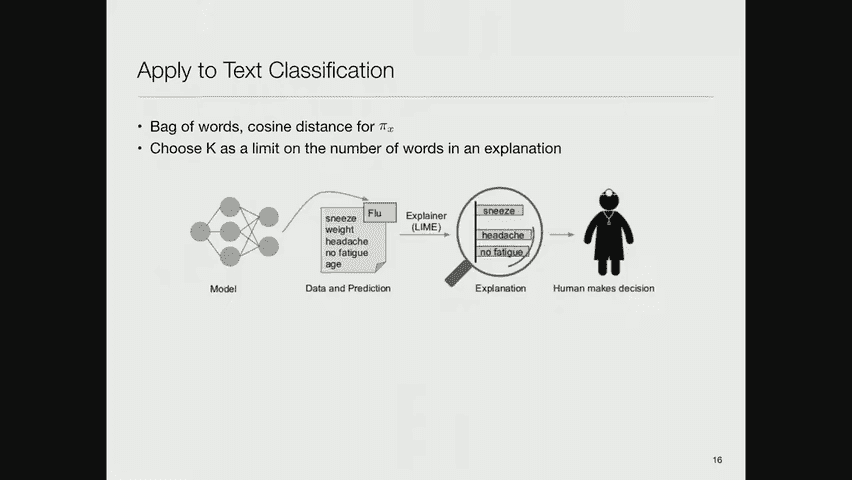
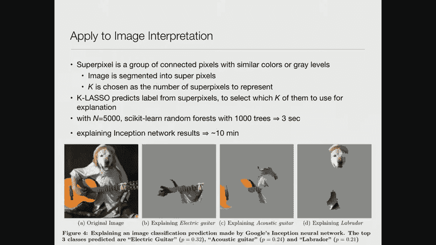
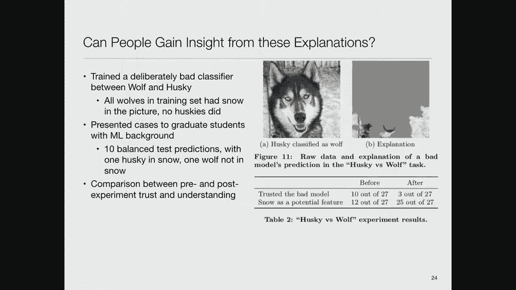
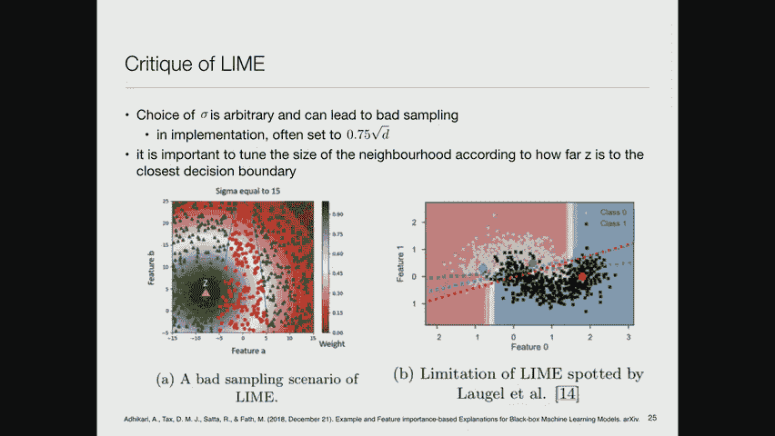
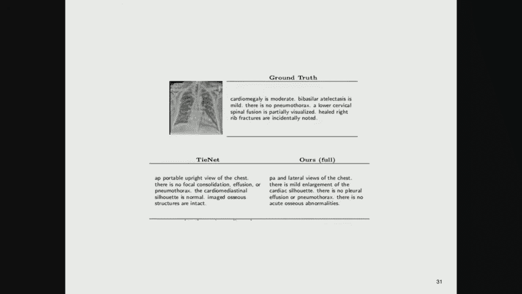
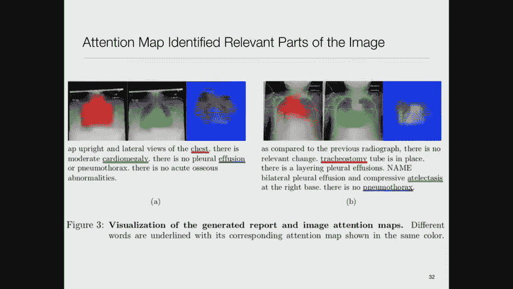

# 25：可解释性 🧠


在本节课中，我们将探讨机器学习模型的可解释性。这是一个至关重要的主题，因为复杂的模型（如拥有数十亿参数的GPT-2）虽然强大，但其内部决策过程却难以理解。如果我们无法理解模型，就无法判断其决策是否公平或存在偏见。因此，我们将学习人们为解决这一“黑箱”问题而开发的各种方法。

## 概述：为什么需要可解释性？

理解复杂模型为何有效并非易事。答案显然不在于某个特定参数的具体数值。在关于公平性的讲座中，我们提到过，如果无法理解模型，就无法检查它是否产生了偏见。本节课将介绍克服模型“高深莫测”问题的不同方法。

## 人类认知的局限：米勒定律

在深入技术方法之前，了解人类认知的局限性很有帮助。心理学家乔治·米勒在1956年提出了著名的“神奇的数字7±2”理论。该理论指出，人类在信息处理能力上存在限制，例如：
*   我们能区分的不同声音强度等级大约为7±2个。
*   我们能区分的不同颜色数量大约为7±2种。
*   我们能记住的项目数量大约为7±2个。

这表明，如果给人类一个包含20个要点的解释，他们很可能无法完全理解，因为无法同时将所有部分记在脑中。这一观察结果在解释复杂模型时扮演着重要角色，因为它意味着解释不能包含太多不同的因素。

## 复杂模型的来源与应对策略

复杂模型的出现有多种原因。过拟合是其中之一，但更根本的原因是，世界本身就很复杂。人类并非被设计出来，而是进化而来，这留下了各种复杂的机制。那么，我们该如何处理这个问题呢？

主要有两种应对思路：
1.  **编造“故事”进行局部解释**：对复杂模型进行局部近似，然后解释这个简化后的模型。这就像鲁德亚德·吉卜林写的《原来如此的故事》，用简单、可爱的故事解释复杂现象（如狮子如何得到鬃毛）。在机器学习中，我们也会采用类似方法，对模型在特定情况下的行为进行局部近似和解释。
2.  **牺牲性能换取可解释性**：使用本质上就更简单、更易解释的模型（如决策树、逻辑回归），尽管它们的性能可能略低于最复杂的模型。这种牺牲是值得的，因为模型通常只是辅助人类决策的工具。决策者（如外科医生）需要理解模型的推荐逻辑，才能建立信任。

## 方法一：局部近似与LIME

上一节我们提到了用“故事”进行局部解释的思路，本节中我们来看看一个具体的实现方法：LIME（Local Interpretable Model-agnostic Explanations）。

### LIME的核心思想

LIME 的核心思想是：虽然我们无法理解整个复杂模型 `f`，但可以针对**单个预测实例**，在其附近用一个简单的、可解释的模型 `g`（如线性模型）来近似 `f` 的行为。

**公式化描述如下：**
*   设原始数据空间为 `X`（维度为 `D`）。
*   我们定义一个可解释的表示空间 `X'`（维度为 `D'`，通常 `D' << D`），其变量是二进制的（例如，某个词是否出现，某个图像超像素是否被激活）。
*   复杂模型 `f: X -> [0,1]`（例如，属于某类的概率）。
*   可解释模型 `g: X' -> [0,1]`（例如，线性回归、决策树）。
*   定义一个衡量数据点之间接近度的函数 `π_x(z)`，用于在解释点 `x` 附近赋予样本点 `z` 不同的权重。
*   LIME 通过最小化以下目标函数来寻找最佳解释 `g`：
    ```
    L(f, g, π_x) + Ω(g)
    ```
    其中 `L` 是损失函数，衡量 `g` 在 `x` 附近对 `f` 的近似程度；`Ω(g)` 是模型 `g` 的复杂度惩罚项（如线性模型的非零权重数），以确保解释的简洁性。

**操作流程简述：**
1.  在想要解释的预测点 `x` 附近进行采样。
2.  用复杂模型 `f` 为这些采样点生成预测标签。
3.  根据接近度 `π_x` 为这些采样点赋予权重。
4.  在加权的采样数据上，训练一个简单的可解释模型 `g`。
5.  用 `g` 来解释 `x` 的预测结果。

### LIME的应用示例

以下是LIME在不同数据类型上的应用：



**1. 文本分类**
例如，判断一个帖子是关于基督教还是无神论。LIME可以列出对当前预测贡献最大（正面或负面）的词语。
```
预测：无神论
正面贡献词：”posting”, “host”
负面贡献词：”God”, “Koresh”, “mean”
```
通过比较不同模型对同一案例的解释，我们可以判断哪个模型的决策依据更合理（例如，依赖“God”一词比依赖“NNP”这样的元数据标签更合理）。



**2. 图像分类**
例如，识别图片中的物体是“拉布拉多犬”还是“电吉他”。LIME可以将图像分割成“超像素”（颜色/纹理相似的区域），然后指出哪些区域支持或反对某个分类标签。

### LIME的评估与局限性

LIME方法可以通过“解释矩阵”来评估整个模型的可信度。该矩阵展示了不同案例下各个特征与模型决策的相关性。通过选择一组能最好地覆盖所有重要特征的案例，可以帮助用户理解模型的整体行为。

然而，LIME也存在批评，主要集中在其**距离函数 `π_x` 的选择**上。原始方法中使用固定的距离尺度可能不是最优的。后续研究提出，应根据解释点离决策边界的远近来动态调整邻域大小。

## 方法二：基于案例的推理与对比解释





另一种解释思路是**基于案例的推理**。这种方法在法律等领域很常见，即通过引用相似的先例（“盟友”案例）和不同的先例（“敌人”案例）来解释当前决策。

**核心思想：**
*   **盟友**：与当前案例预测结果相同的训练样本。
*   **敌人**：与当前案例预测结果不同的训练样本。
通过展示关键的盟友和敌人案例，并提供**对比解释**（即“为什么是A而不是B”），可以给出更令人满意和更具洞察力的解释。这种方法改进了距离函数，使其不仅考虑空间距离，还考虑预测差异，从而能更好地识别出对当前决策最具代表性的邻近案例。

## 方法三：构建本质可解释的模型

上一节我们讨论了如何解释复杂的“黑箱”模型，本节我们来看看另一种根本不同的思路：直接构建**本质就可解释的简单模型**，并愿意为此牺牲少量性能。

### 下降规则列表



一个著名的例子是**下降规则列表**。它是一系列按顺序评估的“如果-那么”规则，规则的风险评分（例如，患病的概率）逐条下降。



**示例：**
```
如果 {肿块形状不规则 且 病人年龄 > 60岁}，那么 恶性肿瘤概率为 85% (n=230)
否则，如果 {肿块边缘有毛刺 且 病人年龄 > 45岁}，那么 恶性肿瘤概率为 78% (n=12)
否则，如果 {肿块边缘模糊 且 病人年龄 > 60岁}，那么 恶性肿瘤概率为 69% (n=3)
...
否则，恶性肿瘤概率为 10% (n=100)
```
这种模型非常容易理解，即使对非技术人员（如医生）也是如此。构建这样的模型本身是一个复杂的优化过程，涉及贝叶斯方法、频繁项集挖掘和蒙特卡洛采样等，但其最终产物是简洁明了的。

### 性能与可解释性的权衡

研究表明，在许多任务上（如医院30天再入院预测），下降规则列表等可解释模型的性能（如AUC）与逻辑回归、随机森林等相当，有时仅略低一点。然而，其可解释性的优势是巨大的。当模型用于辅助关键决策时，牺牲1%-2%的准确率以换取决策者对模型逻辑的完全理解和信任，通常是值得的。

## 注意事项：注意力机制不等于可解释性

在追求可解释性的过程中，需要注意区分机制与解释。例如，**注意力机制**在深度学习模型中非常有用，它能显示模型在决策时“关注”了输入的哪些部分（如图像区域或文本单词）。然而，研究表明，高注意力权重与特征的实际重要性（通过梯度或特征消融法衡量）之间的相关性可能很弱。因此，**注意力权重本身并不能直接等同于模型的解释**，它只是模型内部运作的一种可视化提示。

## 总结

本节课中，我们一起学习了机器学习模型可解释性的重要性及主要方法：
1.  **局部近似解释**：以LIME为代表，通过用简单模型局部拟合复杂模型的行为，为单个预测提供解释。其优势是模型无关，但解释是局部的，且距离函数的选择需要谨慎。
2.  **基于案例的推理**：通过展示相似和相反的案例来进行对比解释，更符合人类的推理习惯。
3.  **构建本质可解释模型**：以下降规则列表为代表，直接构建简单、透明的模型，愿意为可解释性牺牲少量性能。这是最直接、最可靠的获得可解释性的途径。


可解释性是确保机器学习模型在医疗等高风险领域被负责任地使用、建立用户信任的关键。目前，这仍然是一个活跃且快速发展的研究领域。