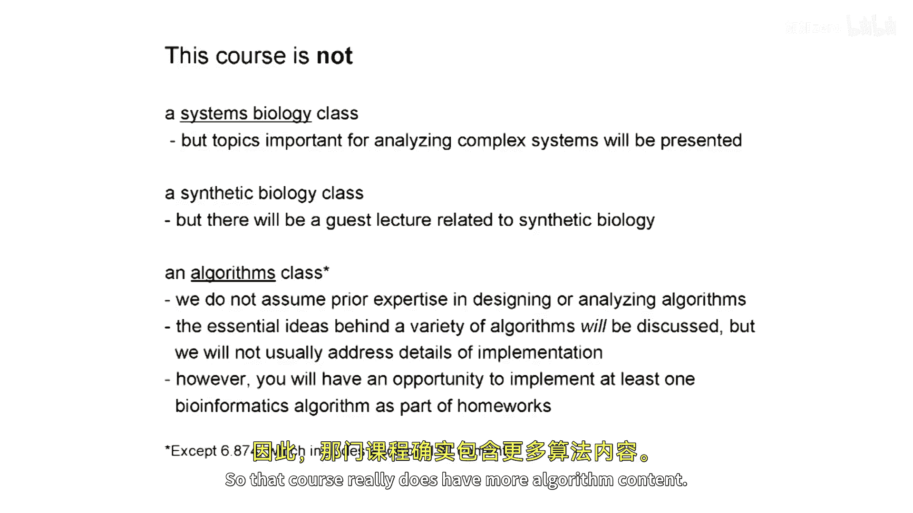
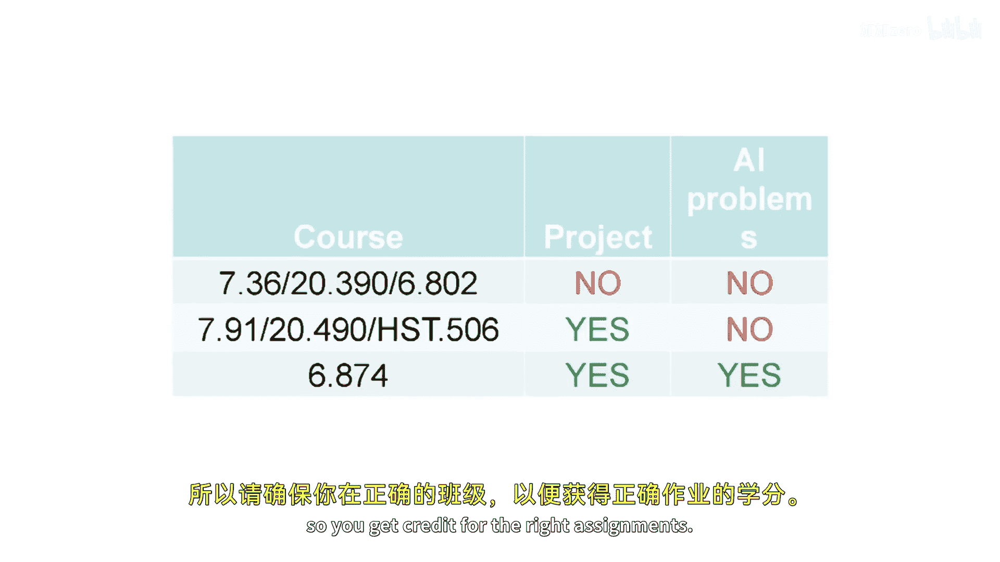
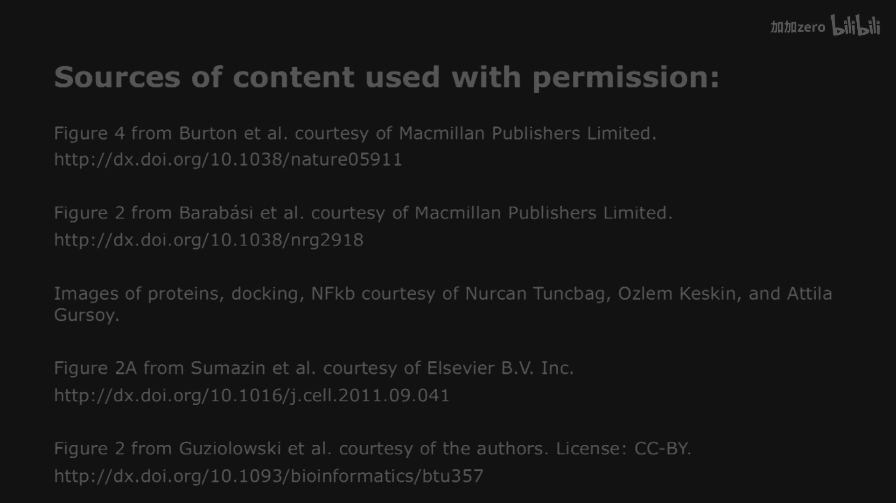

# 001：课程介绍与概述

在本节课中，我们将对《计算与系统生物学基础》这门课程进行全面的介绍。我们将了解课程的历史背景、核心内容、教学结构以及各项要求，为后续的学习奠定基础。

## 课程背景与历史脉络

上一节我们介绍了课程的基本框架，本节中我们来看看计算与系统生物学领域是如何发展起来的。这是一个跨学科的领域，它融合了生物学、计算机科学、统计学和数学等多个学科。

计算生物学是生物学的一个分支，它使用计算策略来理解生物学问题，就像遗传学或生物化学一样。生物信息学则更侧重于工具的开发，而计算生物学侧重于使用这些工具。整个领域建立在信息学、计算机科学、统计学和数学的基础之上。

以下是该领域按年代发展的简要概述：
*   **20世纪70年代**：早期工作集中于蛋白质序列比较，以理解其功能、结构和进化。关键贡献包括Margaret Dayhoff开发的氨基酸替换矩阵（如PAM系列），以及Carl Woese和Russ Doolittle通过核糖体RNA序列分析对生命进化树的重构。
*   **20世纪80年代**：随着数据库扩展，序列比对和搜索算法变得至关重要。FASTA、BLAST（由David Lipman等人开发）和Smith-Waterman等快速算法被广泛使用。同时，RNA二级结构预测（Nussinov和Zuker）和文献数据库（如PubMed）也取得了进展。
*   **20世纪90年代**：微阵列技术和首批基因组序列推动了领域发展。隐马尔可夫模型（HMM）被引入用于序列标记问题（如基因识别）。比较基因组学和蛋白质结构预测（如David Baker的Rosetta算法）也取得了重要进展。
*   **21世纪00年代**：人类基因组计划完成，带来了基因组组装、注释等巨大计算挑战。高通量技术（如微阵列）使得大规模测量基因表达成为可能，系统生物学和合成生物学作为新领域诞生。例如，Eric Davidson构建了海胆发育的基因调控网络模型，而合成生物学则设计了人工基因网络（如抑制振荡器）。
*   **21世纪10年代至今**：第二代测序技术彻底改变了生物学研究，使得基因组学、转录组学、蛋白质-DNA相互作用（如ChIP-seq）等应用变得常规。生物图像信息学和更复杂的系统模型继续推动领域前沿。

## 课程目标与结构

了解了领域背景后，我们来看看本课程的具体设置。本课程旨在帮助学生理解计算生物学的基础方法，从而能够阅读和理解该领域的大部分研究文献。对于研究生版本，课程还额外设定了帮助学生接触该领域研究、并完成一个小型计算生物学研究项目的目标。

本课程**不是**一门专注于系统生物学、合成生物学或算法设计的课程，尽管会涉及相关主题。课程6874版本包含额外的算法内容。

课程内容分为六个主要专题：
1.  **基因组分析一**：经典计算生物学（局部比对、全局比对等）。
2.  **基因组分析二**：面向第二代测序的新方法（快速读段映射、基因组组装等）。
3.  **生物功能建模**：序列模体、隐马尔可夫模型、RNA二级结构。
4.  **蛋白质组学与蛋白质结构**：蛋白质相互作用、结构预测。
5.  **调控网络**：不同类型的基因调控网络模型。
6.  **计算遗传学**：基因组功能注释、数量性状位点、疾病关联分析。

课程将由多位教授共同授课，并包含来自George Church、Doug Lauffenburger和Ron Weiss的客座讲座。

## 课程要求与评分

明确了学习内容后，我们需要了解如何完成这门课程。课程有本科生和研究生多个版本，请注意区分。

**核心要求包括：**
*   **先修知识**：扎实的生物学背景，并熟悉定量方法。不要求有编程经验，但作业会涉及Python编程，助教将提供帮助。
*   **教材**：《Understanding Bioinformatics》（M. Zvelebil & J. Baum）为推荐参考书，涵盖部分主题。课程核心内容以讲座和作业为准。
*   **概率统计基础**：课程提供了专门的《概率统计入门》资料，涵盖P值、概率分布（如泊松分布、极值分布）等关键概念。学生需自行掌握这些基础知识。

**作业与考试安排如下：**
*   **问题集**：共有5次问题集，总分120分，但最高计为100分。此设计允许学生在特殊情况（如面试）下，即使错过一次作业，仍可通过其他作业获得高分。迟交24小时内可获50%分数。
*   **考试**：共有两次80分钟考试，分别覆盖前半部分和后半部分内容，不累积。
*   **项目（仅研究生版本）**：研究生需组队（1-5人）完成一个研究项目，包括选题、研究计划、最终报告和口头展示。
*   **评分构成**：
    *   本科生版本：作业36%，考试62%，同行评议（听报告并评论）2%。
    *   研究生版本（7.91/20.490/HST）：作业30%，考试48%，项目20%，同行评议2%。
    *   研究生版本（6.874）：作业25%，考试48%，项目20%，额外AI问题5%，同行评议2%。
    *   课堂参与积极者可获得1%的额外加分。

**关于协作的规则：**
鼓励讨论问题集，但必须独立撰写解决方案和代码。提交相同或近乎相同的作业将导致双方得零分。

## 专题内容预览

最后，我们来简要预览一下各位教授负责的核心教学内容。

**Chris Burge教授（专题1 & 3）将涵盖：**
*   测序技术、局部序列比对（BLAST算法及其统计显著性，涉及极值分布）。
*   全局序列比对及空位罚分（Needleman-Wunsch， Smith-Waterman动态规划算法）。
*   比较基因组学分析基因调控。
*   模体发现（Gibbs抽样算法）、隐马尔可夫模型以及RNA二级结构预测。

**David Gifford教授（专题2 & 6）将涵盖：**
*   高通量基因组分析：序列读段快速映射与索引构建、基因组组装算法、蛋白质-DNA相互作用分析（如ChIP-seq）、RNA测序与异构体分析。
*   计算遗传学：基因组功能注释、数量性状位点建模、人类疾病全基因组关联研究分析。

**Ernest Fraenkel教授（专题4 & 5）将涵盖：**
*   蛋白质组学与结构：蛋白质结构预测（从专用硬件到众包游戏等多种方法）、蛋白质-蛋白质相互作用预测。
*   调控网络：从蛋白质-DNA相互作用到基因调控网络的重建、遗传相互作用网络、以及可计算模型（如逻辑模型、贝叶斯网络）。

## 总结

本节课中，我们一起学习了《计算与系统生物学基础》课程的总体介绍。我们回顾了该领域的发展历史，明确了课程的目标是掌握理解前沿文献的基础计算方法。我们详细了解了课程由六大专题构成的结构、不同版本（本科/研究生）的要求差异、以及作业、考试、项目的具体安排和评分标准。最后，我们预览了各位教授将讲授的核心内容。请确保您注册了适合自己需求的课程版本，并准备好开始这段探索生物学与计算科学交叉领域的旅程。