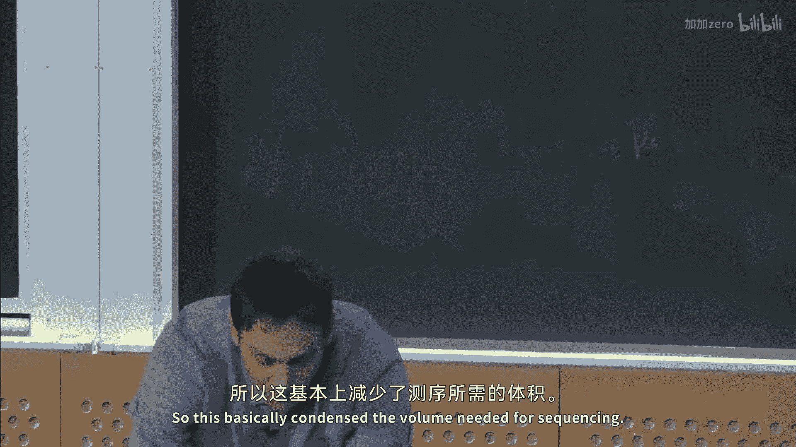
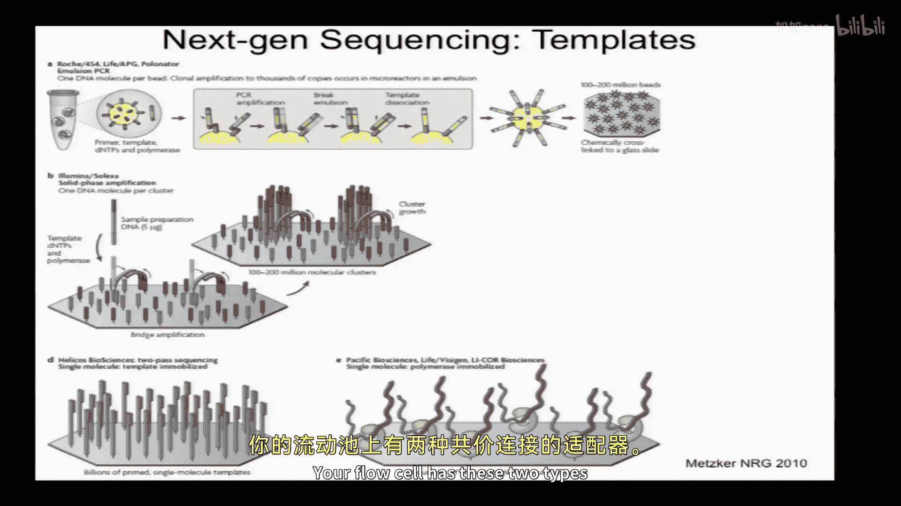
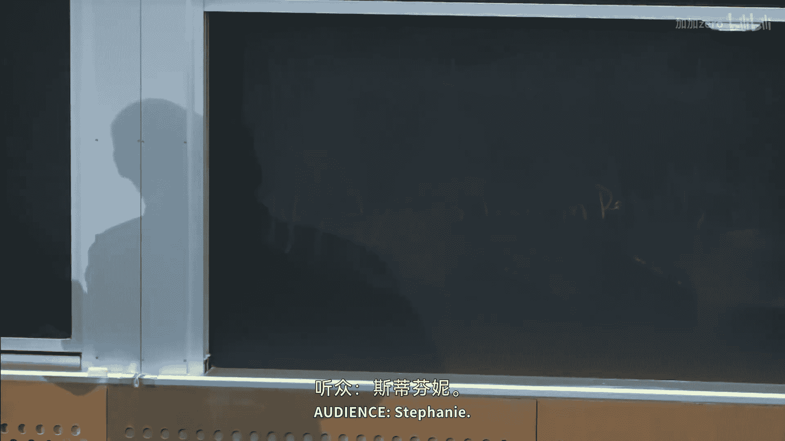
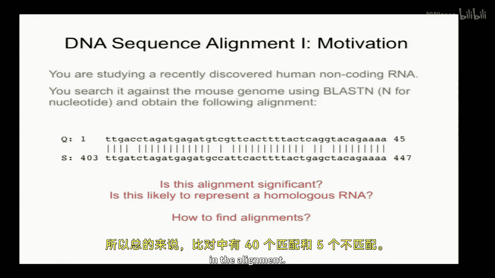
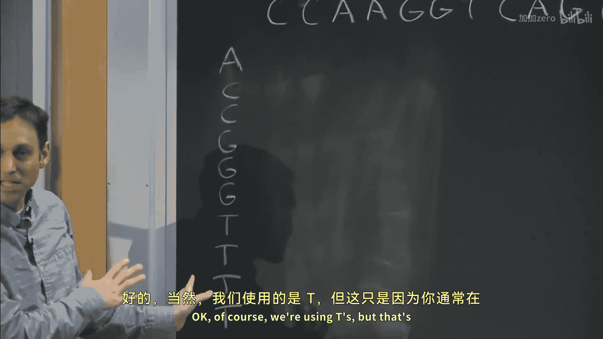
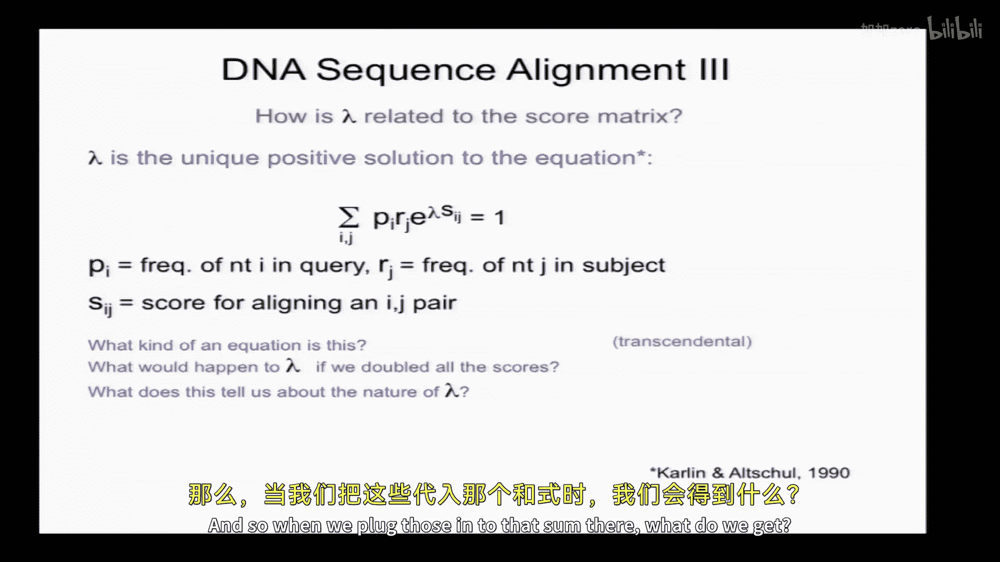

# 002：局部比对（BLAST）与统计学

以下内容基于知识共享许可协议提供。您的支持将帮助麻省理工开放课件持续提供高质量免费教育资源。如需捐款或查看来自数百门MIT课程的更多资料，请访问 MIT OpenCourseware 网站 OCw.MIT.Edu。

## 📚 概述

在本节课中，我们将首先简要回顾经典的桑格测序和下一代（第二代）测序技术，这些技术为我们即将讨论的分析方法提供了大量数据。随后，我们将介绍局部比对，特别是BLAST算法，以及与之相关的统计学原理。

## 🧬 第一部分：测序技术

### 1.1 经典桑格测序

首先，我们来讨论测序。测序主要在DNA水平进行。无论原始材料是否为RNA，通常都会转化为DNA并在DNA水平进行测序。因此，我们常将DNA视为一个字符串。但需记住，DNA实际上具有三维结构，如左图所示。通常，将其视为二维表示有助于理解，如中间图所示，其中展示了碱基及其氢键等。

测序的化学原理与单个碱基的化学性质密切相关。这里主要有三种相关类型：核糖核苷酸、脱氧核糖核苷酸以及用于桑格测序的双脱氧核糖核苷酸。如何区分这些结构？一个记忆方法是观察核糖上碳原子的编号：碳1连接碱基，碳2在RNA中连接OH，在DNA中连接H，碳3是延伸的关键位点，碳4和碳5连接磷酸基团，形成糖-磷酸骨架。碳3是链延伸时添加下一个碱基的位置。

如果给DNA聚合酶一个模板和一些双脱氧核苷酸，会发生什么？链将无法延伸，因为双脱氧核苷酸缺少3‘羟基。这正是经典桑格测序的基础，弗雷德里克·桑格因此于1980年获得诺贝尔奖。该技术利用了双脱氧核苷酸终止链延伸的特殊性质。

设想我们有一个模板DNA（黑色），我们想测定其序列。我们还有一个引物。引物按5‘到3’方向书写。末端是已知序列，模板中有与引物互补的序列。在传统桑格测序中，通常将模板克隆到载体中。然后进行四个独立的测序反应。

以第一个反应（含ddGTP）为例。反应混合物中应包含什么？需要模板、引物、所有四种常规脱氧核苷酸以及一种双脱氧核苷酸（如双脱氧G）。双脱氧核苷酸的浓度应远低于常规核苷酸，例如1%。原因在于，如果浓度相等，每次遇到模板中的C时，都有50%的几率终止，导致信号迅速衰减，只能测序开头的几个碱基。

通常使用放射性标记的引物。然后跑胶。上图是一个理想化的凝胶图像。在加入双脱氧G的泳道中，最小的产物仅比引物长一个碱基，这是因为模板此处有一个C，链在此终止。下一个C出现在几个碱基之后，因此出现间隔。通过从下往上读取凝胶，可以读出序列。第一个碱基是C（与G互补），第二个碱基是A（与T互补），依此类推。

实际测序凝胶如图所示。需要跑四个泳道。读取长度受限于条带间距：短片段差异明显，但长片段（如500与501碱基）差异极小，导致无法分辨，这从根本上限制了读长。

### 1.2 更高效的桑格测序方法

能否用单泳道完成桑格测序？可以使用四种不同荧光标记的双脱氧核苷酸。根据链终止的位置，会发出不同颜色的荧光。所有反应可在同一泳道中进行。这就是90年代至今重要的“染料终止子测序”技术，也是ABI 3700测序仪的基础，该仪器是90年代末和21世纪初基因组测序的主力。

另一项创新是用毛细管取代大凝胶。DNA在毛细管顶部的凝胶中加载，在底部检测四种荧光，读出序列。这大大缩小了测序所需体积。

### 1.3 下一代测序

下一代测序一次只读取一个碱基，速度可能较慢，但具有大规模并行性，这是其巨大优势。其每碱基成本比传统测序低数个数量级。

基本思想是将模板DNA分子固定在某种表面（通常是流动池）上。有单分子方法，也有通过局部扩增产生簇的方法。然后使用修饰的核苷酸（常带有荧光标记）依次掺入，同时对数百万个模板分子进行成像。

不同技术的主要区别在于DNA模板类型、使用的修饰核苷酸以及成像和分析方法。以下是几种主要技术：

*   **454测序（现属罗氏）**：基于乳液PCR。每个微珠携带独特的模板分子，通过局部PCR扩增。使用焦磷酸测序法，一次添加一种dNTP，通过检测发光确定掺入的碱基。
*   **Illumina测序**：在流动池表面进行。模板单分子通过桥式扩增形成簇。每次循环添加所有四种被3‘阻断且带有不同荧光标记的dNTP，聚合酶只能掺入一个碱基。成像后，切除荧光基团和3’阻断基团，进行下一轮。
*   **Helicos测序**：类似Illumina，但是单分子测序。
*   **Pacific Biosciences测序**：DNA聚合酶固定在表面，模板穿入其中。使用带有荧光标记的dNTP，通过检测荧光停留时间判断是否掺入。该技术错误率较高，但读长较长。

Illumina测序的化学原理延续了桑格终止的思想，但可逆。核苷酸被3‘阻断基团和荧光基团修饰。掺入、成像后，切除这些基团，使链能够继续延伸。

实际测序图像显示不同荧光通道下的簇。簇的大小不一，因为不同DNA分子的PCR扩增效率不同。

当前Illumina HiSeq 2000的吞吐量：一个流动池有8个通道，每个通道可产生约2亿条读长，读长通常为100碱基。这相当于每个通道产出约1600亿个碱基。成本约为每通道2000-3000美元（仅试剂）。这远超人类基因组（30亿碱基）的测序需求。因此，通常使用条形码将多个样本混合在一个通道中测序。

## 🔍 第二部分：序列比对与局部比对

### 2.1 比对的意义

一旦从测序仪生成读长，通常需要将其比对到基因组上。例如，在RNA-seq中，需要确定读长来自哪个基因。其他原因包括：序列组装（通过重叠序列推断更长序列）、寻找同源基因（如疾病基因研究中，在模式生物中寻找同源物以进行功能研究）。

### 2.2 局部比对问题

我们将首先讨论局部比对，即寻找短片段的高相似性区域，不要求整个序列对齐。

举例：研究一个45碱基的人类非编码RNA，想在小鼠中寻找同源物。使用NCBI BLAST搜索后，得到一个匹配结果：查询序列1-45位与小鼠染色体某段403-447位匹配，其中40个匹配，5个错配。

问题：这个匹配是否显著？小鼠基因组有27亿碱基。这样的匹配是否可能偶然发生？如何判断？

首先需要定义一个评分系统。最简单的系统是：匹配得+1分，错配得-1分。这对应于一个4x4的矩阵，对角线为1，其余为-1。

如何判断显著性？一种方法是随机打乱查询序列多次，每次搜索基因组，得到最佳得分的分布，然后看实际得分是否显著高于该分布。但存在解析理论可以更快地确定显著性。

另一个问题是：如何在实际中找到这个最佳匹配？即设计算法在数据库中找出与查询序列最高得分的无空位局部比对片段。

### 2.3 无空位局部比对算法

假设查询序列很短，数据库很长。目标是找到最高得分的连续匹配片段。不允许插入/缺失（无空位）。

考虑一种比对“寄存器”，即查询序列的碱基1对应数据库的碱基1。沿着这条对角线，逐个检查是匹配（+1）还是错配（-1）。目标是找到累计得分最高的连续片段。

算法思路：定义两个变量。
*   `maxS`：迄今为止找到的最高片段得分，初始为0。
*   `cumulative_score`：当前累计得分，初始为0。

然后遍历数据库（对于每个可能的起始位置，即每个“寄存器”），对于每个寄存器，遍历查询序列长度，更新累计得分：`cumulative_score += score(query[i], subject[j])`。

同时，记录累计得分曾达到的最小值（`last_min`）。每当累计得分上升时，计算 `cumulative_score - last_min`，这代表从上次最低点至今的净增分，可能是一个候选的高分片段。如果这个值大于当前的 `maxS`，则更新 `maxS` 并记录位置。

该算法的时间复杂度是 **O(mn)**，其中m是查询长度，n是数据库长度。因为本质上需要比较查询的每个碱基和数据库的每个碱基（在所有的偏移位置上）。这是BLAST类算法速度的基础。

该算法要求平均得分期望为负，以确保累计得分有向下的漂移，从而产生向上的“激增”作为高分片段。在+1/-1评分下，由于错配概率3/4，平均得分为负。

### 2.4 局部比对的统计学

Karlin 和 Altschul 为该问题发展了一套理论。对于使用整数评分、期望得分为负的局部比对，最高得分超过某个阈值X的概率服从极值分布（Gumbel分布）。

公式为：**P(S > x) ≈ 1 - exp(-K m n e^{-λx})**

其中：
*   m, n 是查询和数据库的长度。
*   x 是观察到的得分。
*   K 和 λ 是两个正常数参数，取决于评分矩阵和序列组成。
*   λ 是关键参数，因为它与得分x相乘。

λ 是以下方程的唯一正解：
**Σ_i Σ_j p_i r_j e^{λ s_{ij}} = 1**
其中 p_i 是查询序列中碱基 i 的频率，r_j 是数据库中碱基 j 的频率，s_{ij} 是评分矩阵。

#### λ 的计算示例

假设序列组成均匀（所有 p_i = r_j = 1/4），评分矩阵为匹配+1，错配-1。
代入方程：
4种匹配项：(1/4)*(1/4)*e^{λ} * 4 = e^{λ}
12种错配项：(1/4)*(1/4)*e^{-λ} * 12 = 3e^{-λ}
方程：**e^{λ} + 3e^{-λ} = 4**
令 x = e^{λ}，则方程化为二次方程：**x + 3/x = 4 => x^2 - 4x + 3 = 0**
解得 x=3 或 x=1。λ 为正，故取 x=3，所以 **λ = ln(3)**。

#### 评分缩放的影响

如果将评分全部加倍（匹配+2，错配-2），新的 λ‘ 会变为原来的一半（λ’ = λ/2）。因为评分s_{ij}加倍，为了保持方程 Σ p_i r_j e^{λ‘ s_{ij}’} = 1 成立，需要 λ‘ 减半。这样，在显著性公式中，λx 的乘积保持不变，因此统计显著性不变。λ 实质上是评分的缩放因子。

### 2.5 如何选择DNA评分矩阵？

一个简单的通用矩阵是：匹配得1分，所有错配得相同的负分M。M必须是负数，以确保期望得分为负。

M应取何值？这很重要。它决定了算法将找到何种相似度的片段。根据 Karlin-Altschul 理论，高分比对片段中碱基i与j配对的比例 Q_{ij} 由以下“目标频率方程”给出：
**Q_{ij} = p_i p_j e^{λ s_{ij}}**

如果我们希望找到具有一定百分比一致性（r）的片段，可以反过来确定评分。假设序列组成均匀（p_i=1/4），设匹配得分 s_{ii}=1，错配得分 s_{ij}=M。可以推导出：
**M = ln( 4(1-r)/3 ) / ln(4r)**

代入不同的 r 值：
*   若想找到 75% 一致性的片段，M ≈ -1。
*   若想找到 99% 一致性的片段，M ≈ -3。

这意味着，当希望找到相似度更高的片段时，需要使用更严厉的错配罚分。这直观上是合理的：要识别高度相似的区域，需要惩罚错配更重，以避免低相似度区域产生高分。

## 📝 总结

本节课中，我们一起学习了：
1.  **经典桑格测序**的原理，包括双脱氧核苷酸链终止法和毛细管电泳的发展。
2.  **下一代测序**的核心思想——大规模并行，并简要介绍了454、Illumina等主要技术平台的特点。
3.  **局部比对**的基本概念和意义。
4.  寻找**无空位局部最佳比对**的算法思想及其O(mn)时间复杂度。
5.  局部比对得分的**统计学显著性评估**，即Karlin-Altschul极值分布理论，以及关键参数λ的计算和意义。
6.  如何根据期望找到的片段相似度（百分比一致性）来**选择评分矩阵**中的错配罚分。

下节课我们将讨论带有空位的全局比对。