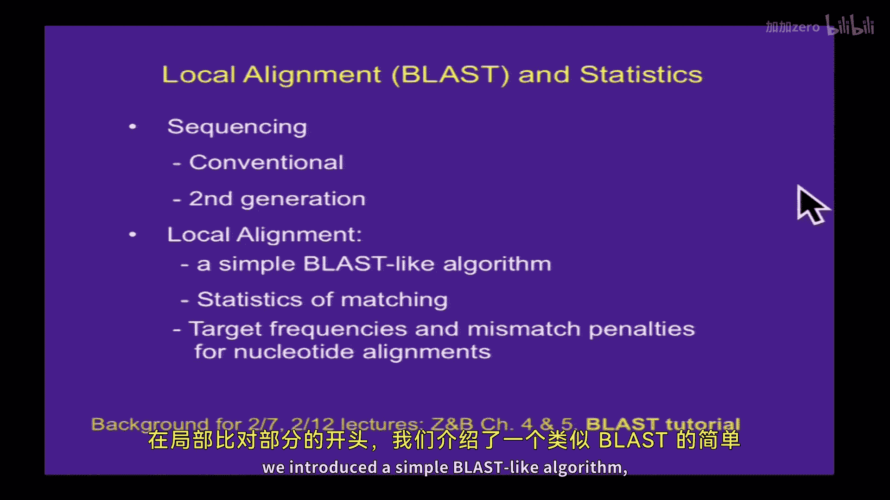

# 003：蛋白质序列全局比对（NW、SW、PAM、BLOSUM）

## 概述

在本节课中，我们将要学习蛋白质序列的全局比对。我们将回顾上次讨论的局部比对，并引入全局比对的算法，特别是Needleman-Wunsch算法和Smith-Waterman算法。同时，我们将探讨与蛋白质序列相关的更复杂的评分矩阵，如PAM和BLOSUM矩阵，理解它们如何基于氨基酸的进化替换频率来优化比对结果。

---

## 回顾：局部比对与测序技术

上一节我们介绍了局部比对及其相关的统计学，以及Sanger测序和二代测序技术。在局部比对部分，我们引入了一个类似BLAST的简单算法，并讨论了目标频率、错配罚分等概念。

一个关于局部比对算法的小技巧是，当累计分数变为负数时，可以将其重置为零。这种方法更直观，最高分片段就是算法运行过程中达到的最高点。

---

## 从DNA到蛋白质：为何进行翻译搜索？

在讨论蛋白质比对之前，我们需要理解为何有时需要对编码序列进行翻译搜索。

当比较不同物种的序列时，例如将人类EST序列与小鼠基因组比对，直接进行核苷酸搜索可能效果不佳。虽然核苷酸序列可能只有约80%的相似性，但由于密码子简并性和蛋白质功能约束，对应的氨基酸序列相似性通常更高。因此，将核苷酸序列翻译成氨基酸序列后再进行搜索（例如使用tBLASTn或tBLASTx），往往能发现更可靠的同源关系。

以下是几种常见的BLAST变体及其用途：
*   **BLASTn**：核苷酸查询序列对核苷酸数据库。
*   **BLASTp**：蛋白质查询序列对蛋白质数据库。
*   **BLASTx**：核苷酸查询序列（翻译为所有阅读框）对蛋白质数据库。
*   **tBLASTn**：蛋白质查询序列对核苷酸数据库（翻译为所有阅读框）。
*   **tBLASTx**：核苷酸查询序列（翻译）对核苷酸数据库（翻译）。

---

## 蛋白质序列比对的动机与挑战

我们进行蛋白质序列比对，最主要的原因是为了发现同源物。通常，序列相似性意味着功能和/或结构的相似性。当全长蛋白质的序列一致性超过30%时，这种推断通常是可靠的。在20%到30%的“模糊区域”，推断需要谨慎。低于20%时，通常不能仅凭序列相似性做出可靠推断。

需要强调的是，**结构相似性并不一定意味着序列相似性或共同起源**。进化压力可以导致不同谱系独立演化出相似的结构或形态，这被称为趋同进化。

---

## 比对类型：全局、局部与点阵图

根据序列之间的关系，我们需要选择不同的比对策略。

一种常见的可视化工具是点阵图，将一个序列放在X轴，另一个放在Y轴，当一定窗口内的残基相同时进行标记。

*   **全局比对**：适用于整个序列长度相似，仅存在少数插入/缺失的情况。它试图将两个序列从头到尾进行比对。
*   **局部比对**：适用于序列仅共享某些保守结构域或存在内部重复的情况。它寻找序列内部相似度高的片段，而不强制比对整个序列。

---

## 空位罚分：线性与仿射

在蛋白质或DNA比对中，我们经常需要处理插入或缺失（合称Indel），在比对中用“-”表示空位。

空位罚分有两种常见形式：

1.  **线性空位罚分**：罚分与空位长度成正比。
    `罚分 = n * a` （其中 `n` 是空位长度，`a` 是每个空位的罚分，为负值）

2.  **仿射空位罚分**：引入空位开启罚分和空位延伸罚分，更符合生物学实际，因为一个插入/缺失事件可能产生不同长度的空位。
    `罚分 = G + (n * γ)` （其中 `G` 是空位开启罚分，`n` 是空位长度，`γ` 是空位延伸罚分，均为负值）

通常，空位罚分比平均错配罚分更严厉，因为插入/缺失突变在进化中比替换突变更少见，对蛋白质结构的破坏也往往更大。

---

## 全局比对算法：Needleman-Wunsch

那么，如何找到最优的全局比对呢？这可以通过动态规划算法解决，即Needleman-Wunsch算法。

其核心思想是将大问题分解为小问题：计算序列1前 `i` 个残基与序列2前 `j` 个残基的最优比对分数 `S(i, j)`。通过填充一个矩阵，并利用以下递推关系，可以从左上角计算到右下角：

`S(i, j) = max{ S(i-1, j-1) + σ(Xi, Yj), S(i-1, j) + a, S(i, j-1) + a }`

其中：
*   `σ(Xi, Yj)` 是残基 `Xi` 和 `Yj` 的匹配分数（来自评分矩阵）。
*   `a` 是空位罚分（负值）。

算法步骤：
1.  初始化矩阵的第一行和第一列（累积空位罚分）。
2.  按行或列填充矩阵，每个单元格的值基于其左上、上方、左方三个邻居的值计算得出，并记录来源方向。
3.  矩阵右下角的值即为全局最优比对分数。
4.  从右下角开始，沿记录的方向反向回溯至左上角，即可得到具体的比对结果（匹配、错配或空位）。

---

## 半全局与局部比对算法

*   **半全局比对**：适用于不惩罚末端空位的情况（例如，蛋白质核心区域保守而末端可变）。实现方法是将动态规划矩阵的边缘初始化为0，并从最后一行或列的最高分开始回溯。
*   **局部比对**：即Smith-Waterman算法。与Needleman-Wunsch的主要区别在于：
    1.  矩阵第一行和第一列初始化为0。
    2.  递推公式中增加一项“0”：`S(i, j) = max{ 0, S(i-1, j-1) + σ(Xi, Yj), S(i-1, j) + a, S(i, j-1) + a }`。这允许在分数变负时重置，从新的位置开始。
    3.  从整个矩阵中的最高分开始回溯，而不是右下角。
    4.  对评分矩阵有要求：随机残基比对的期望分数必须为负，以确保高分片段具有统计学意义。

---

## 氨基酸替换矩阵：PAM

对于蛋白质序列，简单的相同/不同（1/0）评分系统并不理想。我们需要一个能反映氨基酸化学性质相似性和进化替换倾向的评分系统。

Dayhoff等人于1978年提出了PAM矩阵。其构建基于一个明确的进化模型：
1.  收集一组高度同源（>85%一致性）的蛋白质序列比对。
2.  从中统计出氨基酸相互替换的频率，构建一个反映1%氨基酸差异的模型矩阵（PAM1）。
3.  将PAM1矩阵乘以自身N次，即可得到反映N%进化距离的PAMN矩阵（例如PAM250）。这里的250%意味着每个位点平均经历了2.5次替换。

PAM矩阵的特点：
*   对角线元素（相同氨基酸匹配）分值最高，且不同氨基酸的分值不同（如色氨酸W-W为17，丝氨酸S-S为2），反映了其保守程度的差异。
*   非对角线元素中，化学性质相似的氨基酸对（如天冬氨酸D-谷氨酸E）具有正分，而性质迥异的氨基酸对则为负分。
*   矩阵是对称的。

这种评分系统本质上是一种对数几率比，高分意味着该替换在进化中比随机发生更为常见。

---

## 马尔可夫链：进化模型的基础

PAM矩阵背后的进化模型可以用马尔可夫链来描述。马尔可夫链是一种随机过程，具有“无记忆性”，即下一状态的概率只取决于当前状态，而与历史状态无关。

在序列进化中，可以看作：子代序列某个位点的状态（碱基或氨基酸）仅由其亲代序列该位点的状态决定，而与更早的祖先状态无关。这种性质使得我们可以用转移概率矩阵（如PAM1）来描述短时间内的进化变化，并通过矩阵乘法模拟长时间的进化。

---

## 总结

本节课我们一起学习了蛋白质序列比对的核心内容。我们回顾了局部比对，并深入介绍了全局比对的Needleman-Wunsch算法和局部比对的Smith-Waterman算法，理解了动态规划在序列比对中的应用。我们探讨了线性与仿射空位罚分的生物学意义。最后，我们引入了氨基酸替换矩阵的概念，重点介绍了基于明确进化模型的PAM矩阵的构建原理，并了解了其背后的马尔可夫链思想。这些工具和概念是进行同源性搜索、蛋白质功能与结构预测的基础。