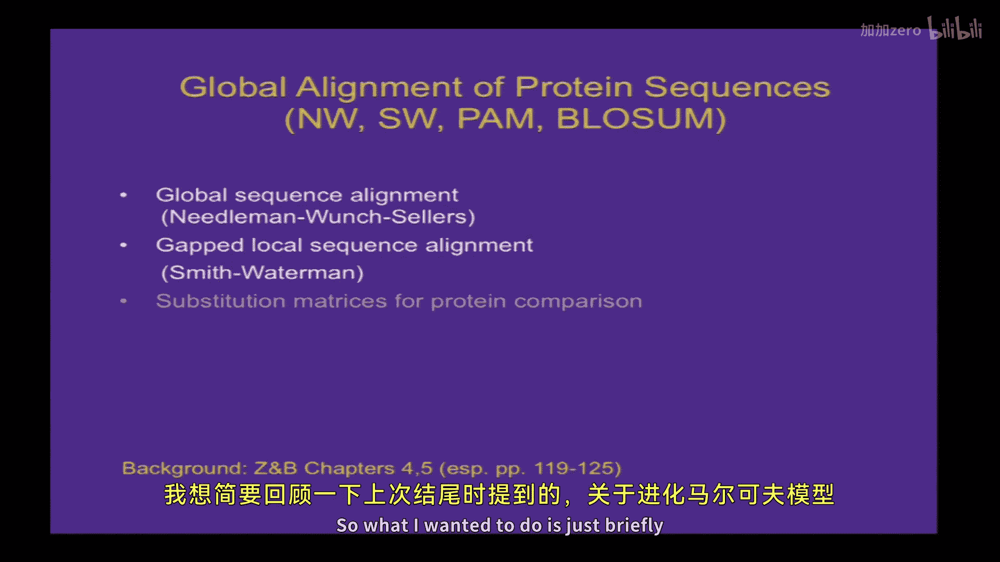
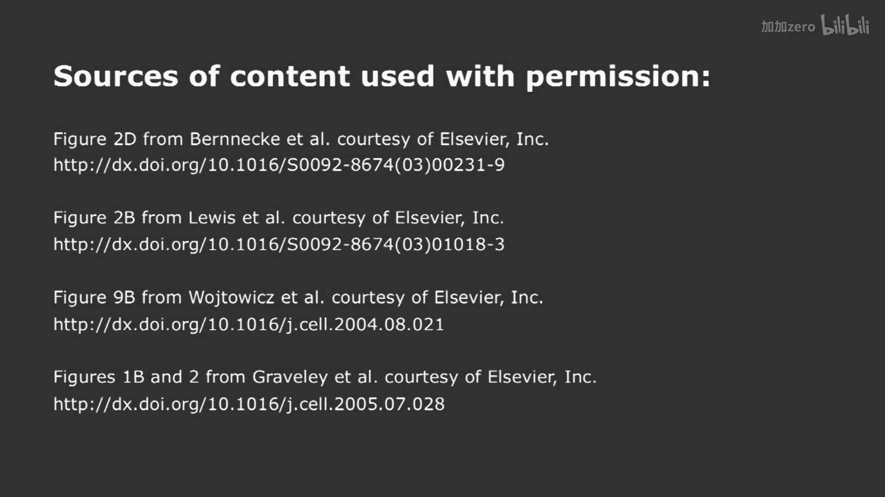

# 004：基因调控的比较基因组分析




在本节课中，我们将学习比较基因组学，这是一种通过比较不同物种的基因组序列来研究基因功能和调控的强大方法。课程将首先回顾序列比对和分子进化模型，然后通过一系列经典研究案例，展示如何利用简单的比较基因组学方法获得深刻的生物学洞见。

## 序列比对与进化模型回顾

上一节我们介绍了蛋白质序列的全局比对，包括Needleman-Wunsch和Smith-Waterman算法，以及空位罚分和PAM矩阵。本节中，我们来看看与PAM矩阵相关的马尔可夫进化模型，这不仅是理解序列进化的基础，也为后续课程中的隐马尔可夫模型做了铺垫。

### 马尔可夫模型与序列进化

马尔可夫模型的一个例子是DNA序列在连续世代中的进化。其核心观察是：特定位置在第n+1代的碱基，仅取决于第n代该位置的碱基。已知第n代的碱基后，再了解第n-1代的碱基不会提供额外信息，这就是马尔可夫性质。

以下是正式定义：
*   设S_n为第n代基因组中某个特定位置的碱基。
*   其进化过程可以用一个马尔可夫链描述。
*   该链可由一个4x4的矩阵P表示，其中元素P_ij代表从碱基i变为碱基j的条件概率。

在描述该位置的碱基状态时，最通用的方式是使用一个概率向量Q = (q_A, q_C, q_G, q_T)，其元素之和为1。那么，第n+1代的状态向量Q_{n+1}可以通过第n代的状态向量Q_n右乘转移矩阵P得到：
`Q_{n+1} = Q_n * P`
若要从第n代推演到第n+K代，则相当于连续乘以矩阵P K次：
`Q_{n+K} = Q_n * P^K`

一个值得思考的问题是：如果从一个特定的初始向量Q（例如，100%是G）开始，经过长时间演化后，这个向量会趋近于什么？

### Dayhoff矩阵与BLOSUM矩阵

Dayhoff通过分析高度相似（约85%一致）的蛋白质序列比对，计算了每个残基的突变率和相互间的突变概率，并将其缩放至平均突变概率为1%，最终通过取对数等处理得到了PAM1矩阵。通过矩阵乘法可以推导出PAM系列的其他矩阵（如PAM2、PAM250）。


然而，PAM矩阵在实际应用中存在一些问题。根本原因在于蛋白质在短期和长期的进化模式可能不同，简单的马尔可夫模型未能完全捕捉真实进化过程（如插入缺失、基因的出生与死亡等）。

大约20年前，Henikoff夫妇开发了新的矩阵。他们识别了称为“块”的区域，这些区域具有合理的相似性（但不如Dayhoff要求的高），利用更多、更丰富的蛋白质序列数据，推导出了新的参数。最终得到的BLOSUM62矩阵在比对中度或高度远缘的蛋白质序列时表现良好。

### 多序列比对的计算复杂度


我们讨论了成对序列比对，但在实践中，经常需要比对多条序列（如3条、5条或100条），以找出最保守的残基。

以下是关于计算复杂度的分析：
*   **成对比对**：使用Needleman-Wunsch或Smith-Waterman算法比对两条长度为N的序列，其计算复杂度为**O(N^2)**。即使引入线性或仿射空位罚分，也只是增加了常数因子，复杂度仍为O(N^2)。
*   **三条序列比对**：将其推广到三条序列，需要使用一个三维矩阵（立方体），计算复杂度变为**O(N^3)**。
*   **K条序列比对**：对于K条序列，完全动态规划方法的复杂度将达到**O(N^K)**，这对于大量序列（如20条）是完全不切实际的。

因此，实际中需要使用启发式方法，如ClustalW（及其本地版本ClustalX）。这些方法通常先进行两两比对，然后通过渐进方式组合这些比对。它们通常能给出合理的结果，但不保证是全局最优解。

## 分子进化与选择类型

现在，我们引入几个新主题。我们将更深入地讨论序列进化的马尔可夫模型，简要提及Jukes-Cantor等经典进化理论，并探讨序列可能经历的不同选择类型（中性、负向、正向），以及如何区分它们。这为今天的主要话题——比较基因组学——做了铺垫。

### 马尔可夫链的平稳分布

回到之前提出的问题：对于一个DNA序列进化的马尔可夫模型，如果从任何初始向量Q开始，多次应用转移矩阵P，当n趋于无穷时会发生什么？

理论表明，如果矩阵P的所有元素都大于0，且每行之和为1（这是一个定义良好的马尔可夫链），那么存在一个唯一的向量R，满足：
`R = R * P`
并且，无论初始向量Q是什么，极限 `lim (n→∞) Q * P^n = R`。向量R被称为**平稳分布**或**极限分布**。

让我们通过一些两字母（嘌呤R，嘧啶Y）的矩阵例子来理解：

**例1：对称突变矩阵**
```
P = [1-p,  p]
    [p,   1-p]
```
其平稳分布是 (0.5, 0.5)。直觉上，因为突变概率对称，最终会达到平衡。

**例2：非对称突变矩阵**
```
P = [1-p,  p]
    [q,   1-q]
```
其平稳分布是 (q/(p+q), p/(p+q))。平衡时，从R流向Y的流量（x * p）等于从Y流向R的流量（(1-x) * q）。

**例3：单位矩阵（无突变）**
```
P = [1, 0]
    [0, 1]
```
任何向量都是平稳的，但不一定存在唯一的极限分布。这违反了“所有元素大于0”的条件。


**例4：交换矩阵（总是突变）**
```
P = [0, 1]
    [1, 0]
```
向量(0.5, 0.5)是平稳的，但系统不会收敛于它（会在(1,0)和(0,1)间振荡）。同样违反了定理条件。

### Jukes-Cantor模型与进化距离校正

Jukes-Cantor模型是一个简单的DNA进化马尔可夫模型，假设每个碱基以相同概率α突变为其他三个碱基。因此，每个世代每个位点的总替换概率是3α。

通过求解，可以得到在时间t后，起始碱基仍保持不变的概率P(t)为：
`P(t) = 1/4 + (3/4) * e^{-4αt}`
其平稳分布是每个碱基各占1/4。

更有用的是，我们可以将观测到的序列差异比例D（即比对后不同位点的比例）与真实发生的替换数K联系起来：
`K = -(3/4) * ln(1 - (4/3)D)`
*   当D很小时，K ≈ D，因为几乎没有回复突变。
*   当D增大时，K > D，因为观测到的差异掩盖了一些发生过但又被回复的突变。
*   当D接近3/4时，K趋于无穷大，因为序列已完全随机化。

这个公式允许我们根据观测到的序列差异，估算真实的进化距离（替换数），这对于估算物种分化的时间非常重要。当然，这个模型忽略了选择、不同位点突变率差异等因素。更复杂的模型（如Kimura二参数模型、考虑CpG甲基化效应的模型）已被开发出来以更好地描述真实进化。

### 通过KA/KS比值推断选择类型

对于蛋白质编码序列（外显子），如果我们知道阅读框，可以区分两种替换：
*   **同义替换**：不改变所编码氨基酸的核苷酸变化。
*   **非同义替换**：改变所编码氨基酸的核苷酸变化。

通常计算两个值：
*   **KS**：同义替换率（同义替换数 / 同义位点数）。
*   **KA**：非同义替换率（非同义替换数 / 非同义位点数）。

然后计算比值 **KA/KS**。这个比值可以揭示基因所受的选择压力：
*   **KA/KS << 1**：表明**负向（纯化）选择**。氨基酸序列很重要，大多数非同义突变有害，因此被自然选择剔除。绝大多数蛋白质编码基因属于此类。
*   **KA/KS ≈ 1**：表明**中性进化**。可能原因包括：该序列不是真正的编码序列；该基因是假基因或功能已不再重要；或者同义和非同义位点受到的选择压力偶然平衡。
*   **KA/KS > 1**：表明**正向（达尔文）选择**。氨基酸序列的改变对生物体有利。这种情况相对罕见，通常发生在宿主-病原体军备竞赛、适应新环境等情形中。

需要注意的是，此方法假设同义替换是中性的。如果同义位点也受到选择（如影响剪接、RNA结构或翻译效率），则解释起来需要更谨慎。

## 比较基因组学研究案例

比较基因组学不仅仅是一套工具，更是一个活跃的研究领域。通过巧妙的比较和简单的算法，往往能获得有趣的生物学发现。以下是一些经典案例，展示了如何利用比较基因组学来研究基因调控。

### 案例1：超保守元件的发现与功能

Bejerano等人（2004）试图通过比较人类、小鼠和大鼠的基因组，寻找在进化上受到极端约束的调控元件。他们将“超保守元件”定义为在这三个物种间**100%相同**的异常长的片段。

通过统计学分析（基于中性重复元件的分歧度估算背景突变率），他们发现基因组中约有数百个这样的超长完全一致区域。这些元件分布在：
*   约100个与已知蛋白质编码基因的外显子重叠。
*   约100个位于基因的内含子中。
*   其余位于基因间区域。

功能关联分析发现：
*   与外显子重叠的超保守元件相关的基因（I型），富集于**RNA结合蛋白**，特别是剪接因子。
*   与基因间超保守元件相邻的基因（II型），富集于**转录因子**，尤其是同源框转录因子。

随后，Eddy Rubin实验室测试了167个极端保守序列（包括部分超保守元件）的功能。他们将每个序列与一个报告基因（lacZ）连接，并导入小鼠胚胎。结果发现，**45%** 的序列能够驱动特定的基因表达模式，起到**增强子**的作用。这些增强子通常在发育中调控大脑、神经管等器官的形成。有趣的是，100%保守的元件和95%保守的元件在驱动表达模式的能力上没有显著差异。

那么，这些极端保守的序列从何而来？Bejerano在后来的一项研究中发现，一些哺乳动物的超保守增强子与腔棘鱼（一种“活化石”鱼类）基因组中的一种**重复元件**高度相似。这提出了一个有趣的可能性：一些随机插入基因组的重复元件（转座子），因其在基因组中广泛分布且序列相同，可能被“征用”为协调调控一组基因的“脚手架”。转录因子可以进化出结合这些元件的能力，从而快速建立大规模的基因表达调控网络。这解释了为何许多调控元件可能起源于自私的遗传元件。

至于外显子中的超保守元件，例如在剪接因子基因*SFRS10*中的一个618bp完全保守区域，它位于一个非编码外显子中。该外显子的包含会引入一个提前终止密码子，导致mRNA被无义介导的降解途径清除。这似乎是该基因通过可变剪接进行自我负反馈调控的一种机制，但为何需要如此长的完美保守序列仍是个谜。

### 案例2：microRNA靶向规则的揭示

microRNA是小的非编码RNA，通过与其靶标mRNA的3‘UTR区配对来抑制翻译或促进降解。Lewis等人（2005）试图通过比较基因组学找出microRNA靶向的规则。

他们利用当时可用的人类、小鼠、大鼠基因组比对，寻找与已知microRNA序列完全匹配的、在3‘UTR中保守的短片段。通过将真实microRNA的靶标数量与随机重排序列的靶标数量进行比较，他们发现了一个显著高于背景的信号。

关键发现是：信号**仅集中在microRNA的5‘端**，特别是第2到第8个碱基的位置。而microRNA的其他部分则没有显著信号。这提示，microRNA与靶标mRNA的配对中，其5‘端的“种子区”至关重要。后续对microRNA基因家族（如let-7家族）的比对也显示，microRNA的5‘端序列是最保守的，与此结论一致。

### 案例3：通过序列互补性揭示互斥剪接机制

果蝇的*Dscam*基因非常特殊，它有多个可变剪接外显子簇，每个簇中只有一个外显子会被选择性地包含进最终mRNA，这是一种互斥剪接。Graveley（2005）想弄清楚这种互斥选择的机制。

他通过对多种昆虫的*Dscam*基因座进行测序和比对，发现了一个高度保守的序列，位于外显子5的下游、可变外显子簇的上游。更仔细的观察发现，在每个可变外显子的紧上游，也存在一段彼此相似且跨物种保守的序列。

经过比对，他意识到：**外显子5下游的保守序列，与所有可变外显子上游的序列在共识序列上是完全互补的**。这立即提示了一个机制：剪接需要通过外显子5下游的这段序列与下游某个可变外显子上游的互补序列进行**碱基配对**，从而将外显子5直接连接到那个特定的下游外显子，并跳过所有其他选项。这一机制后来得到了实验证实。

这个案例表明，比较基因组学有时能直接提供分子机制的线索，而仅通过遗传学方法可能极难发现。

## 总结




本节课中，我们一起学习了比较基因组学的核心概念与方法。我们从序列比对和进化模型（马尔可夫链、Jukes-Cantor模型、KA/KS比值）的基础知识出发，理解了如何量化序列差异并推断进化压力。更重要的是，我们通过多个具体的研究案例，看到了比较基因组学这一强大工具的实际应用：从发现功能重要的超保守调控元件和增强子，到揭示microRNA的靶向规则，再到解析复杂的互斥剪接机制。这些案例表明，通过对不同基因组进行巧妙比较，即使使用相对简单的计算方法，也能获得关于基因调控的深刻生物学见解，从而推动整个计算生物学领域的发展。