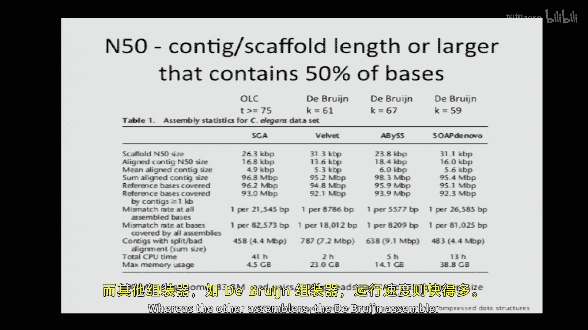

# 006：基因组组装

在本节课中，我们将要学习基因组组装的基础知识。基因组组装是现代生物学的基石，对于研究基因结构、调控、个体差异和进化都至关重要。我们将探讨两种主要的组装方法：**重叠-布局-共识** 组装法和 **德布鲁因图** 组装法。通过学习，你将理解基因组组装的核心挑战，特别是重复序列带来的困难，并了解如何从海量的短序列片段中重建出完整的基因组序列。

## 基因组组装概述

基因组组装的目标是从测序仪器产生的大量短序列片段（称为“读段”）中，重建出原始的基因组序列。基本流程如下：
1.  将读段组装成 **重叠群**，即由读段完全覆盖、我们认为连续不间断的基因组片段。
2.  利用配对读段的信息，将重叠群连接成 **支架**。支架中的重叠群之间可能存在未知的缺口，但配对读段能跨越这些缺口，将它们连接起来。
3.  有时会使用物理图谱技术，将支架定位到染色体的具体物理位置，从而获得完整的基因组图谱。

本节课我们将专注于 **从头组装**，即在不依赖参考基因组的情况下，仅凭读段数据进行组装。

## 覆盖度与组装挑战

在开始组装前，我们需要理解 **覆盖度** 的概念。平均覆盖度是指每个基因组碱基平均被多少测序碱基覆盖。例如，若基因组大小为 **G**，读段数量为 **N**，读段长度为 **L**，则平均覆盖度 **λ** 的计算公式为：
`λ = (N * L) / G`

根据 Lander-Waterman 模型，一个碱基未被任何读段覆盖的概率约为 **e^(-λ)**。因此，未被覆盖的碱基数约为 **G * e^(-λ)**，而组装中产生的缺口数约为 **N * e^(-λ)**。

然而，实际数据常偏离此模型，部分原因是建库偏差，此时可能需要使用负二项分布等模型进行拟合。

组装中另一个挑战是读段间的不一致。这可能是由测序错误引起，也可能是由于二倍体生物中来自父母染色体的 **等位基因差异** 造成。常见的参考基因组是单倍体型，只代表一条染色体的序列。

## 方法一：重叠-布局-共识组装法

上一节我们介绍了基因组组装的基本概念和挑战，本节中我们来看看第一种主流方法：重叠-布局-共识组装法。这类方法在人类基因组计划早期被广泛使用，尤其适用于较长读段。

### 构建重叠图

组装的第一步是构建 **重叠图**。其核心思想是：寻找一个读段的后缀与另一个读段的前缀之间的重叠区域。

*   **顶点**：代表每个读段。
*   **有向边**：从读段 A 指向读段 B，表示 A 的后缀与 B 的前缀存在重叠。边上可标注重叠的长度。

构建所有读段间的重叠图在理论上是一个计算量巨大的任务（复杂度可达 O(N²)）。但利用 **FM 索引** 和 **Burrows-Wheeler 变换** 等技术，可以高效地索引所有读段，然后快速查找重叠，将复杂度降至约 O(N log N)。这种方法还能自动消除 **传递边**（即通过其他边可推导出的冗余重叠），简化图形。

### 布局：寻找基因组路径

构建好重叠图后，下一步是 **布局**，即找到一条穿过该图的路径以重建基因组序列。一种思路是将其转化为 **最短公共超字符串** 问题：寻找一个包含所有读段作为子串的最短字符串。在图论中，这等价于寻找一条总重叠长度最大（即路径总成本最小）的路径。

然而，最短公共超字符串问题是 **NP 难** 问题（类似于旅行商问题），对于数百万读段的数据不具可操作性。因此，实践中常采用 **贪心算法** 等启发式方法。

但贪心算法可能出错，尤其是在处理 **重复序列** 时。如果读段长度不足以跨越重复区域，组装器将无法确定重复单元的正确拷贝数，可能导致组装出的序列比真实基因组更短或结构错误。重复序列是组装的主要难点，约 50% 的人类基因组由重复序列组成。

### 简化图与生成重叠群

通过移除传递边等简化操作，重叠图可以变得更清晰。简化的目标是识别出图中线性的部分，这些部分对应着确定无疑的连续序列，即 **重叠群**。无法线性化的区域（如由重复序列导致的环）则成为组装中的断点。

### 共识序列生成

对于每个重叠群，我们有多条覆盖该区域的读段。在 **共识** 阶段，我们需要处理读段间因测序错误或等位基因差异造成的不一致。通过比较所有覆盖该位置的碱基和质量分数，投票决定最终的 **共识碱基**，从而得到该重叠群的单倍型序列。

### 现代实例：字符串图组装器

SGA 是一个现代的重叠-布局-共识组装器。其流程分为三步：
1.  **读段纠正**：利用 FM 索引寻找罕见序列，并用相似的常见序列进行纠正。
2.  **重叠图构建与组装**：使用 FM 索引高效查找重叠，过滤低质量读段，构建简化重叠图并输出重叠群。
3.  **支架构建**：再次使用 FM 索引，将原始读段映射回重叠群，利用配对读段信息将重叠群连接成支架。

这类组装器精度较高，但计算资源消耗大，组装一个人类基因组可能需要数千 CPU 小时。

## 方法二：德布鲁因图组装法

上一节我们讨论了基于重叠图的方法，本节中我们来看看另一种更高效但信息有所损失的方法：德布鲁因图组装法。这类方法在短读段时代非常流行。

### 构建德布鲁因图

德布鲁因图的核心是将读段分解为更短的 **K-mer**（长度为 K 的序列）。

*   **顶点**：代表所有 **(K-1)-mer**（即 K-mer 的前 K-1 个碱基和后 K-1 个碱基）。
*   **有向边**：代表一个 **K-mer**。边的方向是从该 K-mer 的 **(K-1)-mer** 前缀顶点指向其 **(K-1)-mer** 后缀顶点。

因此，每条边编码了一个 K-mer 序列，而边的连接表示了 K-mer 之间重叠了 K-1 个碱基。构建此图非常高效，只需遍历所有读段的所有 K-mer，通过哈希表存储顶点和边，时间复杂度近似线性 O(N)。

### 从图中重建序列

重建基因组序列需要在图中找到一条 **欧拉路径**——一条访问图中每条边恰好一次的路径。如果一条欧拉路径存在，那么按顺序输出路径上每条边代表的 K-mer 的重叠部分，就能拼出基因组序列。

一个连通的有向图存在欧拉路径的条件是：最多有两个顶点是“半平衡”的（入度不等于出度），其余所有顶点必须是“平衡”的（入度等于出度）。在理想的无误差、全覆盖测序下，基因组起止点对应的顶点是半平衡的，内部顶点都是平衡的，因此欧拉路径存在。

### 德布鲁因图的挑战与纠错

然而，实际情况充满挑战：
1.  **非唯一路径**：即使存在欧拉路径，也可能不唯一，导致组装出错误序列。
2.  **覆盖度缺口**：导致图断裂，形成多个连通分量，即多个独立的重叠群。
3.  **测序错误**：会产生图中的“死胡同”、“气泡”或“嵌合边”。
    *   **死胡同**：低覆盖度的短分支，可被修剪。
    *   **气泡**：由错误导致的并行路径，可通过比较覆盖度来“戳破”。
    *   **嵌合边**：错误的连接，可被移除。

这些纠错操作高度依赖启发式算法，不同组装器的策略各不相同。

### 德布鲁因图的局限性

德布鲁因图方法的主要局限在于，它将读段拆解为独立的 K-mer，**丢失了读段内部的远程连接信息**。为了弥补，一些组装器会将原始读段“穿线”映射回图中，利用读段的连续性来约束路径选择。

## 组装器性能比较

以下是几种主流组装器的简单比较：
*   **SGA**：基于重叠图，精度高，N50（50%的组装序列包含在长度不小于此值的片段中）较大，但运行速度慢。
*   **Velvet, ABySS, SOAPdenovo**：基于德布鲁因图，运行速度快，通过调整 K 值来优化结果。

选择 K 值是一个经验性过程，通常通过测试不同 K 值下组装的 N50 等指标来确定最佳值。不同组装器对最佳 K 值的偏好不同，这反映了它们在图构建后处理步骤（如简化、纠错）上的差异。

## 总结与展望

本节课中我们一起学习了基因组组装的两种核心方法：重叠-布局-共识组装法和德布鲁因图组装法。关键要点如下：
*   **组装是一门艺术**：尽管有坚实的图论基础，但如何设计启发式规则来修剪图形、选择路径，高度依赖于经验和具体数据。
*   **重复序列是主要敌人**：短读段难以解析长重复区域，这限制了组装序列在重复结构上的准确性。因此，对待参考基因组中的重复区域需保持谨慎。
*   **权衡取舍**：重叠图方法更精确但计算量大；德布鲁因图方法更快但可能丢失信息。选择取决于数据规模、读长和可用计算资源。
*   **未来挑战**：对于宏基因组等包含多个物种混合样本的组装，问题将更加复杂，当前读长仍是主要限制因素。

随着测序读长的不断增加，基因组组装将变得更容易，但如何处理超大规模数据集和复杂变异，仍然是生物信息学领域激动人心的挑战。