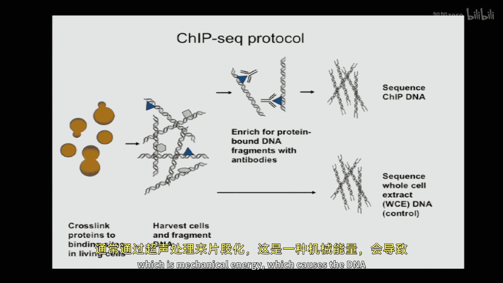
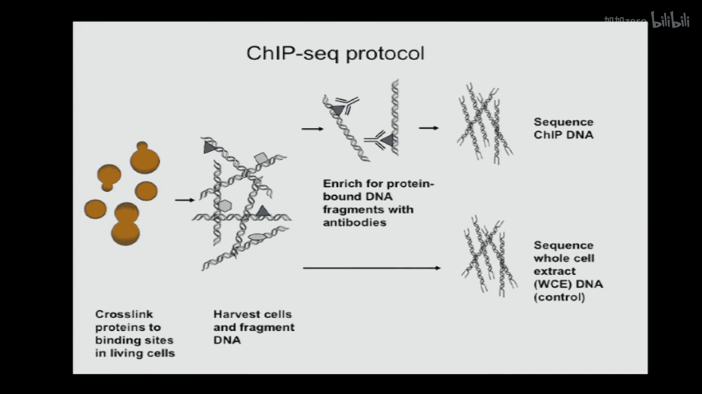
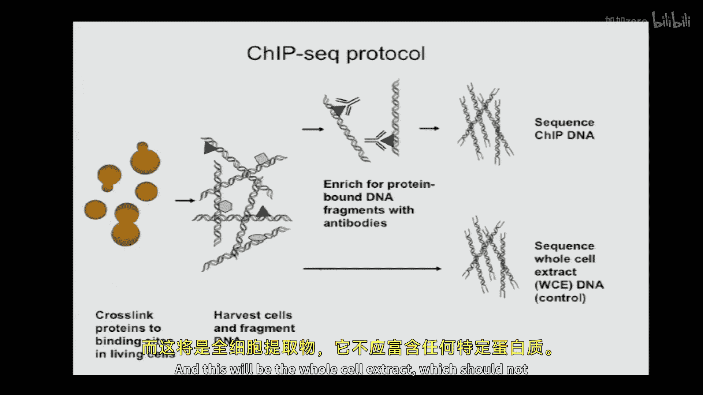
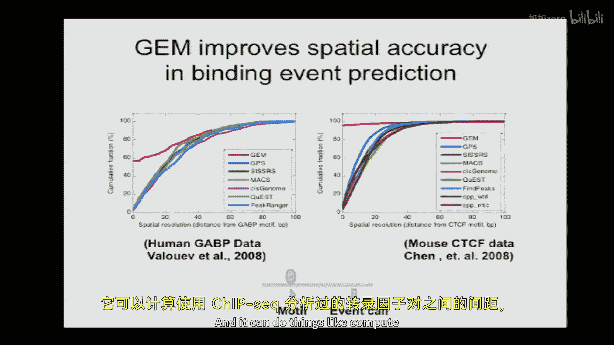
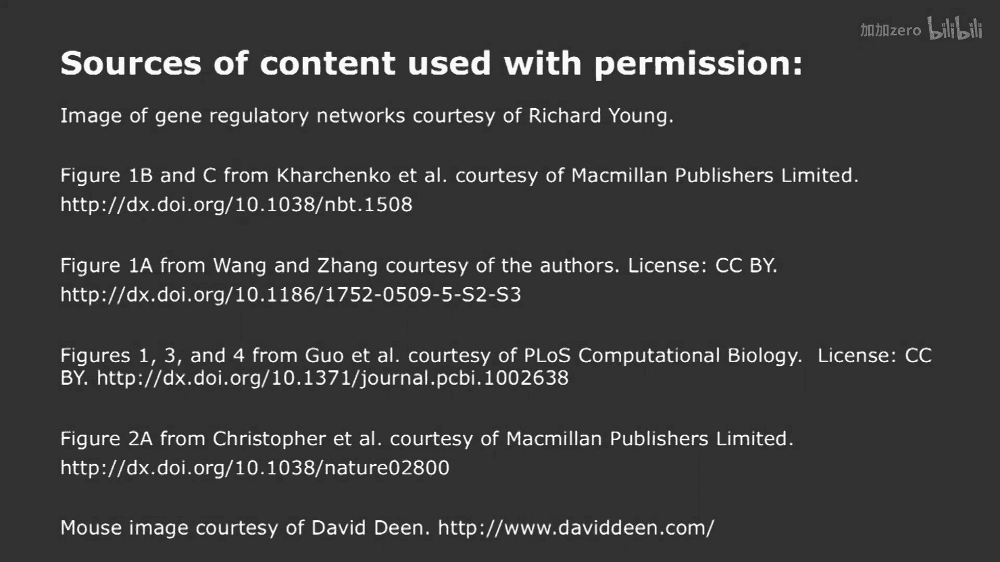

# 007：ChIP-seq分析与DNA-蛋白质相互作用 🧬

以下内容基于知识共享许可协议提供。您的支持将帮助麻省理工开放课件继续免费提供高质量教育资源。如需捐款或查看数百门麻省理工课程的其他材料，请访问 ocw.mit.edu。

在本节课中，我们将学习如何利用之前掌握的高通量序列比对和基因组组装知识，来深入探究转录调控的奥秘。我们将重点介绍一种关键技术——ChIP-seq，它使我们能够精确地阐明基因是如何被调控的。

## 转录调控与ChIP-seq概述

转录调控因子是一类能够以序列特异性方式结合到基因组上，并作为分子开关的蛋白质。这些蛋白质通常包含一个与DNA特定序列相互作用的结合域，以及一个与其他蛋白质相互作用的激活或抑制域，从而调控基因表达。

为了理解基因调控网络，我们需要绘制其“接线图”，即确定调控因子在基因组上的结合位置以及它们调控哪些基因。ChIP-seq技术使我们能够一次研究一种蛋白质，精确地定位其在基因组上的结合位点，分辨率可达约10个碱基对。

## ChIP-seq实验原理与流程

ChIP-seq代表染色质免疫沉淀测序。其基本思想是捕捉活细胞中蛋白质与DNA相互作用的“快照”。

以下是实验流程的核心步骤：

1.  **交联**：使用交联剂处理细胞，在蛋白质与其结合的DNA之间形成共价键，固定相互作用。
2.  **染色质提取与片段化**：分离染色质，并通过超声等方法将其随机打断成小片段（通常200-300 bp）。
3.  **免疫沉淀**：使用针对目标蛋白质的特异性抗体，富集含有该蛋白质的DNA片段。
4.  **解交联与测序**：逆转交联，释放DNA片段，然后进行高通量测序。
5.  **对照实验**：同时，对未经免疫沉淀的“全细胞提取物”进行测序，作为背景对照。

测序后，我们会得到许多短序列读段。这些读段的5‘端起始位置分布在蛋白质实际结合位点的两侧。我们的计算任务就是根据这些读段在基因组上的分布，推断出蛋白质最初结合的位置。

## 结合事件的计算发现：生成模型

我们的目标是将测序读段映射回基因组，并找出所有蛋白质结合事件的位置。一个简单的方法是“找峰”，但当一个峰下隐藏着多个相邻的结合事件时，这种方法就会失效。

因此，我们需要一个更精细的模型。我们假设：
*   每个结合事件会产生一个特定的读段空间分布模式（一个经验性的分布直方图）。
*   基因组上每个碱基位置 `i` 都有一个概率 `π_i`，表示该位置发生结合事件的可能性。
*   所有 `π_i` 的和为1，即总的结合事件概率是归一化的。

那么，单个读段 `R_n` 由整个基因组模型生成的概率为：
`P(R_n | π) = Σ_i [ P(R_n | 结合事件在 i) * π_i ]`
其中，`P(R_n | 结合事件在 i)` 可以从我们学习到的空间分布模型中获得。

所有读段的整体似然度就是每个读段概率的乘积。我们的目标是找到一组 `π` 值，使得观测到所有读段的似然度最大，即最大似然估计。

## 期望最大化算法与稀疏性约束

直接求解上述最大似然问题很困难。我们引入一个隐变量 `G`，它表示每个读段具体来源于哪个结合事件。如果我们知道 `G`，就能轻松计算出 `π`。

期望最大化算法通过迭代来解决这个问题：
1.  **E步**：基于当前的 `π` 估计，计算每个读段来源于每个潜在结合事件的“责任”（期望值 `γ`）。
2.  **M步**：基于计算出的责任 `γ`，更新 `π` 的估计，使其最大化似然度。

然而，初始运行时，算法会将概率质量 `π` 分散到基因组许多位置上，结果不够“稀疏”，即找出的结合位点太多、太模糊。这与生物学事实（结合位点很少）不符。

为了解决这个问题，我们在优化目标中加入一个**先验分布**，例如负狄利克雷先验，它倾向于让 `π_i` 趋近于0。这样，在M步更新规则中，对于支持读段数少于某个阈值 `α` 的位置，其 `π_i` 会被置零。这迫使模型只保留那些有足够证据支持的位置，从而得到稀疏且清晰的结合事件预测。

加入先验后的算法能够成功地从模拟数据和真实数据中，准确地分辨出单个结合事件，甚至是紧密相邻的“同型”结合事件。

## 显著性评估与对照分析

上一节我们介绍了如何发现候选结合事件，本节我们来看看如何判断这些事件是否真实可靠。这里，全细胞提取物对照数据至关重要。

我们通过假设检验来评估每个候选事件的显著性。零假设是：观测到的IP通道读段富集纯粹是随机的。具体方法是：
1.  在候选事件周围区域，分别统计IP通道和对照通道的读段数。
2.  在零假设下，一个读段出现在IP或对照通道是等概率的。我们可以使用**二项分布检验**来计算，在给定总读段数下，IP通道读段数达到或超过观测值的概率（p值）。

计算出每个事件的p值后，我们面临多重假设检验问题。我们使用**本杰明-霍奇伯格方法**来控制错误发现率。我们将所有事件的p值从小到大排序，然后选择一个阈值，使得排名第 `k` 的事件的p值满足 `p_k ≤ (k/N) * FDR`，其中 `N` 是事件总数，`FDR` 是我们设定的目标错误发现率（如0.05）。

## 实验可重复性分析：不可重复发现率

生物学实验需要重复。当我们有两个ChIP-seq实验重复时，需要评估它们结果的一致性。简单的做法是计算两个重复间结合事件排名的相关性。

更高级的方法是使用**不可重复发现率**分析。其思想是：
1.  将两个重复实验各自发现的事件按显著性排序。
2.  计算在排名前 `T%` 的事件中，有多少个事件在两个重复中是匹配的（即位于基因组相近位置）。记这个比例为 `si_N(T)`。
3.  对于完美的重复，`si_N(T)` 应该是一条从原点出发、斜率为1的直线，直到事件耗尽。
4.  IDR模型会拟合数据，区分出“可重复”和“不可重复”两部分事件混合的分布。我们可以设定一个阈值，只保留那些属于“可重复”部分的事件。

这种方法不仅用于评估实验质量，还可以比较不同数据处理算法哪个能产生更可重复的结果。

## 总结与展望

本节课中，我们一起学习了ChIP-seq技术的原理和计算分析流程。我们从实验设计开始，了解了如何通过交联、免疫沉淀和测序来捕获DNA-蛋白质相互作用。接着，我们深入探讨了核心的计算挑战：如何从测序读段中精确地定位蛋白质结合位点。

我们建立了一个生成模型，并使用期望最大化算法进行求解。通过引入稀疏性先验，模型能够准确地找出稀疏分布的结合事件。然后，我们利用对照样本进行统计检验，评估每个发现事件的显著性，并控制错误发现率。最后，我们介绍了IDR方法，用于评估实验重复间的可重复性，确保结果的可靠性。

ChIP-seq及其分析方法是解析基因组调控“程序”的基石。它使我们能够以极高的分辨率绘制转录因子和组蛋白修饰在基因组上的分布图谱，为理解复杂的基因调控网络奠定了基础。