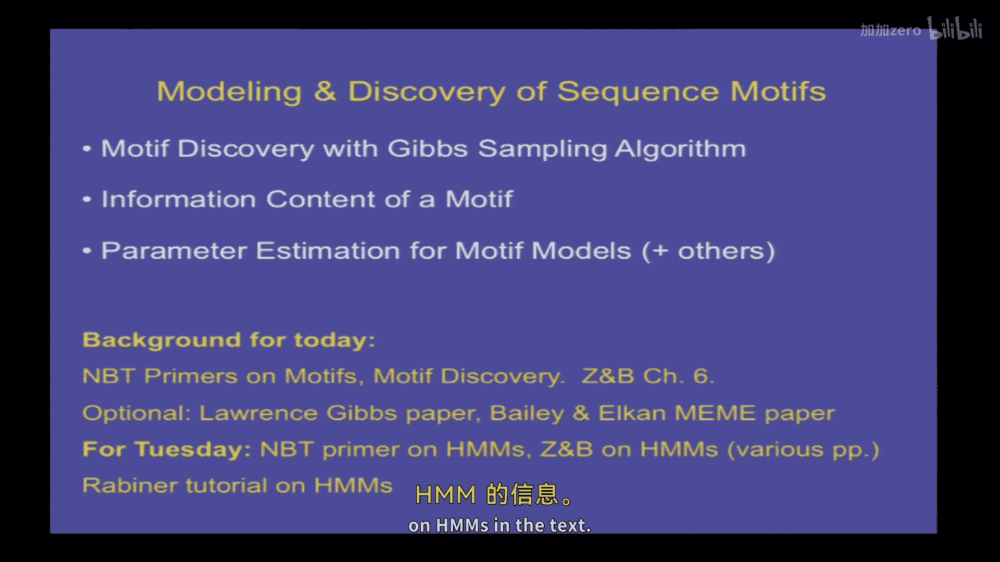
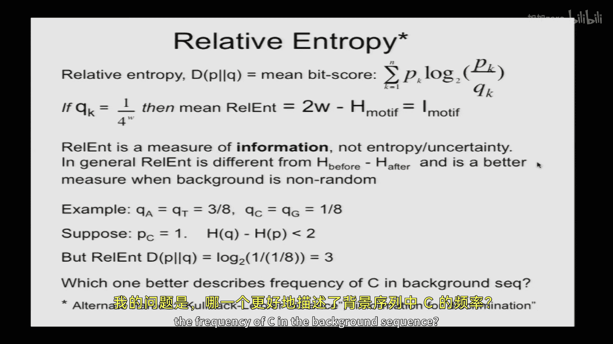
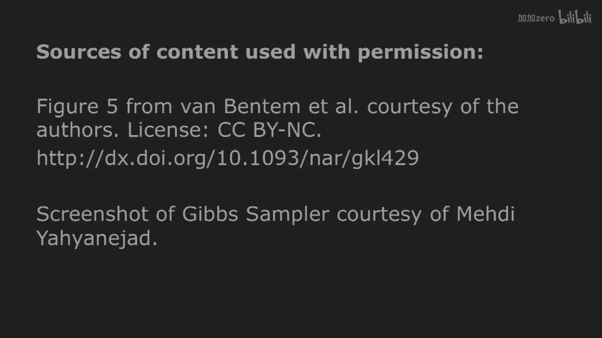

# 009：序列模体的建模与发现 🧬

以下内容基于知识共享许可协议提供。您的支持将帮助麻省理工开放课件继续免费提供高质量教育资源。如需捐款或查看来自数百门麻省理工课程的更多材料，请访问 [MIT OpenCourseware](http://ocw.mit.edu)。

在本节课中，我们将要学习DNA和蛋白质序列模体。本质上，它们是调控信息的基本构建模块。我们将以一个特定的模体发现算法——吉布斯采样算法为例进行讲解。它并非唯一的算法，也不一定是最好的算法，但它是一个很好的早期算法示例，能够很好地说明问题。同时，它也是一个随机算法的例子，其行为在一定程度上由随机性决定，但通常仍能收敛到特定答案。我们还将讨论其他类型的模体发现算法，并简要介绍统计熵和信息内容，这是描述模体的便捷方法。最后，我们会涉及参数估计，这在您拥有一个模体并希望建立模型以发现更多该模体实例时至关重要。

## 什么是序列模体？🔍

序列模体通常是指一组共享某种生物学特性的DNA、RNA或蛋白质序列所共有的模式。例如，某个转录因子M的所有结合位点可能共享一个模式，这个模式就被称为M的模体。

模体可以通过多种方式识别：
*   **序列比对**：获取一组基因，寻找它们共有的短序列模式。
*   **比较基因组学**：在不同物种中寻找保守的序列区域。
*   **蛋白质结合实验**：例如染色质免疫沉淀测序。
*   **功能筛选**：例如将随机序列克隆到报告基因上游，检测哪些能驱动表达。

## 模体的表示方法 📊

人们通常使用几种分辨率递增的模型来描述模体：
1.  **共有序列**：例如TATA框的共有序列是TATAAA。但这只是许多实例的共识，真实情况中很少能找到完美的共有序列。
2.  **正则表达式**：例如描述哺乳动物5‘剪接位点的GT\[AG\]AGT，其中R代表嘌呤（A或G）。
3.  **权重矩阵**：矩阵的宽度是模体的碱基数，四行分别代表四个碱基。这通常被称为位置特异性概率矩阵或位置特异性评分矩阵。
4.  **更复杂的模型**：简单的权重矩阵可能无法捕捉模体中的所有信息，因此需要更复杂的模型。

## 为什么模体很重要？💡

模体之所以重要，是因为它们可以识别具有特定生物学特性的蛋白质或序列。例如，识别可能被特定激酶磷酸化的蛋白质，或可能被特定转录因子调控的启动子。这对于理解基因调控以及建立预测基因表达的系统生物学模型至关重要。

## 模体发现算法概述 🧮

模体发现问题本质上是一个局部多序列比对问题。主要有三种通用方法：
1.  **枚举或词典法**：枚举所有可能的短序列（如所有六聚体），统计它们在目标序列集和背景序列集中的出现频率，寻找统计上富集的序列。缺点是需要进行多重检验校正，且可能无法发现简并性强的模体。
2.  **概率优化法**：在可能的模体空间中“游走”，直到找到一个看起来很强的模体。吉布斯采样算法就属于此类。
3.  **确定性算法**：如MEME算法，它使用期望最大化方法。

## 吉布斯采样算法详解 ⚙️

上一节我们介绍了模体发现的几种思路，本节中我们来看看一个具体的概率优化算法——吉布斯采样算法是如何工作的。

该算法步骤如下：
1.  输入N条长度为L的序列，并猜测模体宽度W。
2.  在每条序列中随机选择一个起始位置作为假定的模体实例。
3.  随机选择一条序列（例如序列i）。
4.  使用**除序列i外**所有其他序列中当前假定的模体实例，构建一个权重矩阵模型（θ）。
5.  将权重矩阵θ沿着序列i滑动，计算序列i中每一个可能的W-mer子序列在“模体模型（θ）”下生成的概率与在“背景模型”下生成的概率的比值（似然比）。
6.  根据上一步计算出的概率分布（归一化后），**随机采样**一个新的起始位置作为序列i中模体的新位置。
7.  更新序列i的模体位置，然后选择另一条序列，重复步骤3-6。
8.  迭代此过程直至收敛（例如，模体位置不再变化或权重矩阵稳定）。

**算法核心思想**：即使初始选择是随机的，算法也倾向于自我强化。如果偶然在几条序列中采样到了真实的模体实例，构建的权重矩阵就会带有轻微偏向性。这个带有偏向性的矩阵更有可能在其他序列中识别出真实的模体实例，从而进一步强化权重矩阵，最终收敛到强模体。信息内容（熵的减少）在此过程中倾向于增加。

## 熵与信息内容 📉

为了更精确地描述模体的“强弱”，我们引入信息论中的熵和信息内容概念。

**熵**是衡量不确定性的指标。对于一个概率分布 \\( P \\)（例如，模体中某个位置四个碱基的概率），其香农熵 \\( H(P) \\) 定义为：
\\[ H(P) = -\\sum_{k} p_k \\log_2 p_k \\]
其中 \\( p_k \\) 是第k个事件（如特定碱基）的概率。熵值越大，不确定性越高。例如：
*   确定性分布（如100%是C）的熵为0。
*   均匀分布（四个碱基各25%）的熵为 \\( \\log_2 4 = 2 \\) 比特。

**信息内容**定义为背景不确定性（熵）与模体不确定性（熵）的差值：
\\[ I = H(background) - H(motif) \\]
它衡量了模体所减少的不确定性。对于宽度为W的模体，如果背景均匀且模体各位置独立，其信息内容为 \\( 2W - H(motif) \\)。

信息内容的一个实用意义是：一个具有M比特信息内容的模体，在随机序列中大约每 \\( 2^M \\) 个碱基出现一次。例如，EcoRI限制性酶切位点（GAATTC）信息内容约12比特，预计每4096个碱基出现一次，这与经验相符。

## 影响模体发现的因素 ⚖️

以下是影响模体发现算法成功与否的几个关键因素：
*   **模体信息内容**：信息内容高的强模体更容易发现。
*   **序列长度**：给定序列越短，搜索空间越小，模体越容易被发现。
*   **序列数量**：通常序列越多，信号越强，但可能影响收敛速度。
*   **模体宽度猜测**：猜测的宽度与实际宽度不符会降低发现效率。
*   **背景序列组成**：有偏的基因组背景组成（如高AT含量）会使发现变得困难，需要使用**相对熵**（或称Kullback-Leibler散度）来替代简单信息内容进行衡量。相对熵公式为：
    \\[ D(P \\| Q) = \\sum_{k} p_k \\log_2 \\frac{p_k}{q_k} \\]
    其中 \\( P \\) 是模体分布，\\( Q \\) 是背景分布。

## 实践工具与总结 🛠️

在实践中，吉布斯采样器或其变体（如AlignACE）有时被使用。但更常用的可能是MEME算法，它是一种确定性算法，通常通过多次不同起始点运行并选择最佳结果来避免局部最优。用户可以使用如“WebMotifs”这样的在线平台，它集成了多种模体发现工具。

本节课中我们一起学习了序列模体的概念、表示方法及其重要性。我们重点剖析了吉布斯采样这一随机算法的原理，并介绍了用熵和信息内容来量化模体特征的方法。最后，我们讨论了影响模体发现的各种因素，为在实际研究中应用这些工具打下了基础。