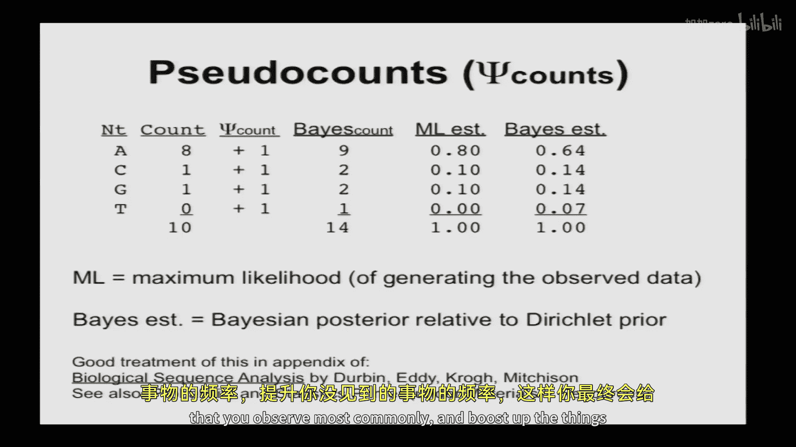
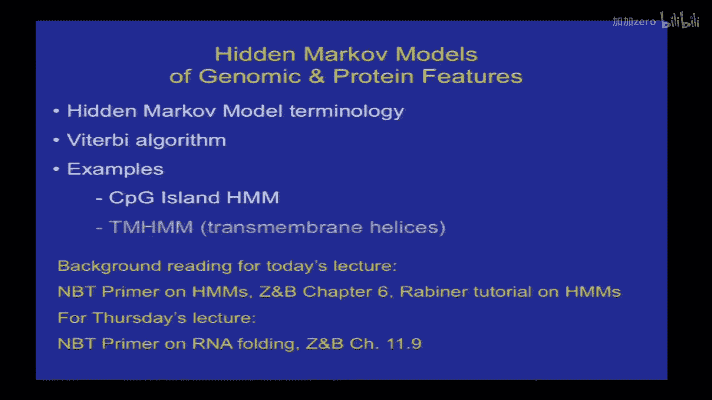
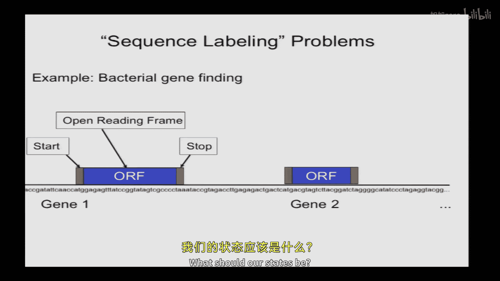

# 010：基因组与蛋白质特征的马尔可夫及隐马尔可夫模型

以下内容在知识共享许可下提供。您的支持将帮助麻省理工开放式课件继续免费提供高质量教育资源。如需捐款或查看来自数百门麻省理工课程的更多材料，请访问 OCW.MIT.edu。

## 概述
在本节课中，我们将学习马尔可夫模型和隐马尔可夫模型，它们是用于分析基因组和蛋白质序列特征的重要工具。我们将从回顾相对熵的概念开始，然后探讨如何将简单的权重矩阵模型推广到马尔可夫模型，以处理序列位置间的依赖性。最后，我们将重点介绍隐马尔可夫模型的基本概念、核心算法（维特比算法）及其在生物信息学中的应用，例如CpG岛预测。

## 相对熵回顾与推导
上一节我们介绍了相对熵的概念。相对熵是衡量两个概率分布之间距离的一种方法，可以写作不同的形式，通常使用D(P||Q)表示。在生物信息学中，当我们用一个前景模型P_k和一个背景模型Q_k来为一个模体打分时，相对熵就是在模体模型下的平均对数优势比得分。

在背景模型Q_k为均匀分布（例如，对于单碱基模体，Q_k = 1/4）的特殊情况下，模体的相对熵简化为2 - H(P)，其中H(P)是模体模型的熵。以下是推导过程：

\[
D(P||Q) = \sum_k P_k \log_2 \frac{P_k}{Q_k}
\]

将其重写为两项之差：

\[
= \sum_k P_k \log_2 P_k - \sum_k P_k \log_2 Q_k
\]

第一项是熵的负数：\( -\sum_k P_k \log_2 P_k = -H(P) \)。

在均匀背景的特殊情况下，\( Q_k = 1/4 \)，因此 \( \log_2 Q_k = \log_2 (1/4) = -2 \)。第二项变为：

\[
- \sum_k P_k \cdot (-2) = 2 \sum_k P_k = 2
\]

因为概率之和为1。因此：

\[
D(P||Q) = 2 - H(P)
\]

这个结果以及其他类似结果，可以通过将相对熵拆分为不同项并求和来证明。

## 相对熵的用途
相对熵在生物信息学中的主要用途是，它提供了一种考虑非均匀背景的度量方法。标准的“信息量”定义在背景均匀时有效，但在背景非均匀时会失效。

例如，考虑一个基因组背景高度偏向（如75%是A），而模体在某个位置总是C。标准信息量计算会得到2比特，预测该模体每4个碱基出现一次，这显然不正确。而相对熵计算会得到一个更合理的值（例如3比特），因为它考虑了背景分布的非均匀性。

## 从权重矩阵到马尔可夫模型
我们可以使用权重矩阵或位置特异性概率矩阵来为一个模体（如5‘剪接位点模体）建模，这假设了位置之间是独立的。但如果这种独立性不成立，一个自然的推广就是使用**非齐次马尔可夫模型**。

在这种模型中，位置k的碱基依赖于位置k-1的碱基，但不依赖于更早的碱基。生成特定序列S1到S9的概率由以下表达式给出：

\[
P(S_1, ..., S_9) = P(S_1) \cdot P(S_2|S_1) \cdot P(S_3|S_2) \cdot ... \cdot P(S_9|S_8)
\]

其中，\( P(S_i|S_{i-1}) \) 是条件概率。同样，为了方便，我们可以取对数。

在实际应用中，我们需要估计这些条件概率参数。条件概率 \( P(A|B) \) 是联合概率 \( P(A, B) \) 除以边缘概率 \( P(B) \)。因此，我们可以通过计算观测到的双碱基频率与单碱基频率的比值来估计。

通过实现权重矩阵模型和一阶马尔可夫模型对5‘剪接位点进行评分，可以发现两者都能部分成功地区分真实的剪接位点（黑色）和背景序列（浅色条带），但都不是完美分离。马尔可夫模型的表现略好一些，其分数分布的左尾更紧，意味着它能更好地区分真实位点和假阳性位点。

## 模型复杂性与数据量
马尔可夫模型可以在存在依赖性且有足够数据估计参数时提高性能。模型不仅可以依赖于前一个碱基，还可以依赖于前两个碱基（二阶马尔可夫模型），或更一般地，依赖于前K个碱基（K阶马尔可夫模型）。

然而，模型的复杂性需要与可用数据量相匹配。以下是不同模型所需的参数数量：
*   **独立模型（权重矩阵）**：每个位置有4个参数（4种碱基的概率），但只有3个是自由参数。
*   **一阶马尔可夫模型**：第一个位置有4个参数，后续每个位置有16个条件概率参数（4x4）。
*   **二阶马尔可夫模型**：每个位置（前两个位置除外）有64个参数（4x4x4）。

一般地，对于K阶马尔可夫模型，参数数量约为 \(4^{K+1}\)。如果你只有100条序列，却需要估计每个位置64个参数，数据量是远远不够的。因此，不应使用如此高阶的模型。

## 伪计数：处理有限数据
当数据量有限时，如何避免给未观测到的事件分配零概率？例如，假设你通过实验鉴定了10条与某个转录因子结合的序列。在第一列，你观察到8个A，1个C，1个G，0个T。你能确信T与结合不相容吗？不能，因为样本量太小。如果T在天然序列中的频率是10%，那么在10个样本中一个T都看不到的概率大约是 \(0.9^{10} \approx 0.35\)，这是一个相当高的概率。

因此，我们不应该给T分配0概率。应该分配什么值呢？一个原则性的方法是使用**伪计数**。在贝叶斯框架下，假设真实的频率来自一个先验分布（如狄利克雷分布），那么给定观测数据（例如0个T）后，参数的后验分布等价于在每个计数箱（bin）中添加一个计数。

例如，将观测计数(8,1,1,0)加上伪计数(1,1,1,1)，得到(9,2,2,1)，归一化后，T的概率约为0.07。随着数据量增大（例如计数为800,100,100,0），添加伪计数的影响会变小，估计值会收敛到最大似然估计。伪计数提供了一种在数据有限时进行更合理估计的方法。

## 隐马尔可夫模型简介
现在，我们开始介绍隐马尔可夫模型。我们将讨论其术语、应用以及核心算法——维特比算法，并给出几个例子。

### 背景与应用
HMM可以被视为解决序列标注问题的一种通用方法。我们拥有序列（如基因组、蛋白质、RNA序列），这些序列具有各种特征（如启动子、结构域、线性模体）。我们的目标是在未知序列中标注这些特征。

一个经典例子是基因查找：给定一段基因组序列，部分区域是外显子，部分是内含子，我们需要标注它们。我们可能有一个已知外显子和内含子的训练集，从中学习每个标签的序列组成特征，然后构建一个模型将它们组合起来。

HMM允许我们在不同状态之间定义转移概率，从而可以建模状态的长度以及状态之间的依赖关系。它们相对容易设计，甚至可以包含循环。HMM最初在几十年前由电气工程领域开发，用于语音识别，至今仍在该领域使用。

### 基本思想：一个遗传学例子
考虑一个简单的马尔可夫链例子：Simpson家族连续几代在某个基因座的基因型。Bart的基因型依赖于Homer，但在给定Homer的条件下，与祖父Abe的基因型条件独立。

现在，什么是隐马尔可夫模型？假设我们的DNA测序仪那周坏了，无法直接测量基因型。相反，我们只能观察依赖于基因型的某种表型（如胆固醇水平），但这种依赖不是确定性的，因为还受环境影响。例如，纯合子基因型倾向于有更高的LDL胆固醇，但存在一个分布。

如果我们只观察到Bart的胆固醇水平，我们很难判断他的基因型。但如果我们知道他父亲Homer的胆固醇很高，这就使得Homer更可能是纯合子，从而反过来影响了Bart基因型的分布，使他更可能是纯合子。这就是HMM的基本思想：我们有一些可观测的表型，它们以概率方式依赖于某些隐藏的状态，而这些隐藏状态本身具有依赖结构。我们的目标是从观测数据中预测这些隐藏状态。

### 生成式模型视角
理解HMM的一个便捷方式是将其视为**生成式模型**。想象HMM用于生成可观测序列：
1.  根据初始状态分布，选择一个初始隐藏状态。
2.  设置时间变量t=1（通常代表序列中的位置）。
3.  根据一个依赖于当前隐藏状态的概率分布，生成一个观测值。
4.  根据转移概率，转移到下一个隐藏状态。
5.  重复步骤3和4。

### 细菌基因查找HMM示例
让我们以细菌基因查找为例。细菌的蛋白质编码基因需要有起始密码子、开放阅读框和终止密码子。我们的HMM需要哪些状态？
*   **起始状态**：发射起始密码子（如ATG，3个核苷酸）。
*   **密码子状态**：发射一个密码子（3个核苷酸），并可以循环回到自身以生成长ORF。
*   **终止状态**：发射终止密码子（3个核苷酸）。
*   **基因间状态**：发射一个核苷酸，并可以循环回到自身以生成任意长度的基因间区。

状态之间的转移需要合理设计，例如：基因间 -> 起始 -> 密码子 -> 终止 -> 基因间。为了处理反向链上的基因，还需要设计互补的状态和转移。这个模型可以生成带有标注的序列字符串。

## CpG岛HMM与维特比算法
为了更清晰地说明维特比算法，我们将使用一个更简单的HMM：用于预测脊椎动物基因组中CpG岛的HMM。

### CpG岛简介
CpG岛是基因组中具有高C和G含量、并且CpG二核苷酸（即序列中C后面紧跟G）相对富集且未甲基化的区域。在脊椎动物基因组中，CpG二核苷酸通常因为甲基化导致的突变而稀少，但在某些启动子附近未甲基化的区域，CpG可以积累到较高频率。因此，寻找这些区域可以帮助预测启动子位置。人类基因组背景的C+G含量约为40%，而CpG岛区域的C+G含量可达50%-60%。

### CpG岛HMM设计
我们的模型只有两个隐藏状态：
1.  **基因组状态**：代表普通的基因组区域。
2.  **岛状态**：代表CpG岛区域。

转移是最简单的：允许任意两个状态之间互相转移（自循环或相互转移），从而可以生成任意长度的岛区域和基因组区域。

每个隐藏状态发射单个核苷酸。为了完全指定模型，我们需要定义三类参数：
1.  **初始概率**：例如，99%的概率从基因组状态开始，1%的概率从岛状态开始。
2.  **转移概率**：
    *   假设岛的平均长度为1000个碱基，则岛到岛的转移概率为0.999，岛到基因组的概率为0.001。
    *   假设岛之间平均间隔100kb，则基因组到基因组的转移概率为0.99999，基因组到岛的概率为0.00001。
3.  **发射概率**：这是预测能力的来源。假设基因组状态发射A/T/G/C的概率分别为0.3/0.3/0.2/0.2（C+G=40%），岛状态发射的概率分别为0.2/0.2/0.3/0.3（C+G=60%）。

### 问题反转：从观测推断隐藏
模型是从隐藏状态生成观测序列。但我们实际面临的问题是：我们拥有观测序列，想要推断隐藏状态。我们需要反转模型中的条件关系。

我们感兴趣的是给定观测序列 \( O = (o_1, ..., o_N) \) 时，隐藏状态序列 \( H = (h_1, ..., h_N) \) 的条件概率：
\[
P(H | O) = \frac{P(H, O)}{P(O)}
\]
根据贝叶斯定理，这等于：
\[
\frac{P(H) \cdot P(O | H)}{P(O)}
\]
分母 \( P(O) \) 需要对所有可能的隐藏状态序列求和，这在序列很长时计算量巨大（2^N数量级）。但幸运的是，当我们比较不同隐藏状态序列的概率以寻找最优解时，\( P(O) \) 是一个与H无关的常数，可以忽略。因此，我们只需找到能最大化联合概率 \( P(H, O) \) 的隐藏状态序列 \( H_{opt} \)：
\[
H_{opt} = \arg\max_H P(H, O)
\]
这个最优的隐藏状态序列被称为序列的**最优解析**。

### 维特比算法
维特比算法是一种动态规划算法，用于高效地找到这个最优解析。其核心思想是定义一系列变量：
令 \( R_i(h) \) 表示从序列开头到位置i的**最优子解析**的概率，并且该子解析在位置i以隐藏状态h结束。

算法步骤如下：
1.  **初始化**：计算第一个位置（i=1）以每种状态结束的最优解析概率。
    *   \( R_1(\text{基因组}) = P(\text{初始为基因组}) \times P(\text{发射} o_1 | \text{基因组}) \)
    *   \( R_1(\text{岛}) = P(\text{初始为岛}) \times P(\text{发射} o_1 | \text{岛}) \)
2.  **递归**：对于 i = 2 到 N，对于每个可能的状态h，计算：
    \[
    R_i(h) = \max_{h'} \left[ R_{i-1}(h') \times P(h | h') \times P(o_i | h) \right]
    \]
    即，考虑所有可能的前一个状态h‘，取（前一个位置以h’结束的最优概率 × 从h‘转移到h的概率 × 在状态h发射当前观测o_i的概率）的最大值。记录下是哪个h‘导致了该最大值（通常通过回溯指针）。
3.  **终止**：在序列末尾（i=N），比较 \( R_N(\text{基因组}) \) 和 \( R_N(\text{岛}) \)，选择概率更大的那个状态作为最终状态。
4.  **回溯**：根据步骤2中记录的回溯指针，从最终状态反向追踪到起始位置，得到完整的最优隐藏状态序列。

### 算法复杂度
对于每个位置i，我们需要为每个当前状态h考虑所有可能的前一个状态h‘。如果有K个隐藏状态，那么每个位置的计算量是 \( O(K^2) \)。对于长度为L的序列，总时间复杂度为 \( O(K^2 L) \)。这对于像CpG岛HMM（K=2）这样的简单模型来说非常快。如果HMM的转移矩阵是稀疏的（很多转移概率为0），实际计算量还可以更小。

## 课程中期考试信息
期中考试将于下周二（3月18日）举行。考试时间为1小时20分钟，形式为闭卷考试，但允许携带最多两页（可双面）的笔记。考试内容涵盖截至本节课（包括HMM）的所有讲座主题。RNA二级结构将是考试后的新主题。过去的期中考试试卷已发布在课程网站上，可供复习参考。助教将在本周的讨论环节进行复习。

## 总结
本节课我们一起学习了以下内容：
1.  **相对熵**：作为衡量概率分布距离的指标，在处理非均匀背景的序列模体时特别有用。
2.  **马尔可夫模型**：作为权重矩阵的推广，可以建模序列位置之间的依赖性，但需要更多数据来估计参数。
3.  **伪计数**：一种在数据有限时避免零概率估计、使参数估计更稳健的贝叶斯方法。
4.  **隐马尔可夫模型**：一种强大的序列标注工具，包含隐藏状态（如基因特征）和观测值（如核苷酸），并通过状态间的转移概率和状态内的发射概率来建模。
5.  **维特比算法**：用于在HMM中寻找最有可能产生观测序列的隐藏状态序列（最优解析）的高效动态规划算法，其复杂度为 \( O(K^2 L) \)。
6.  我们通过CpG岛预测的简单例子，说明了HMM的构建和维特比算法的基本步骤。

理解这些模型和算法对于分析基因组中的复杂模式至关重要。