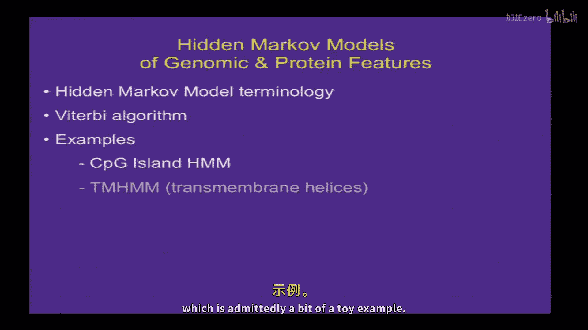
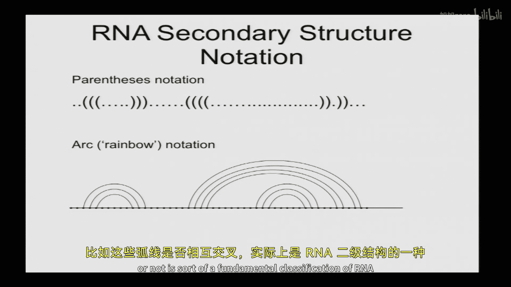
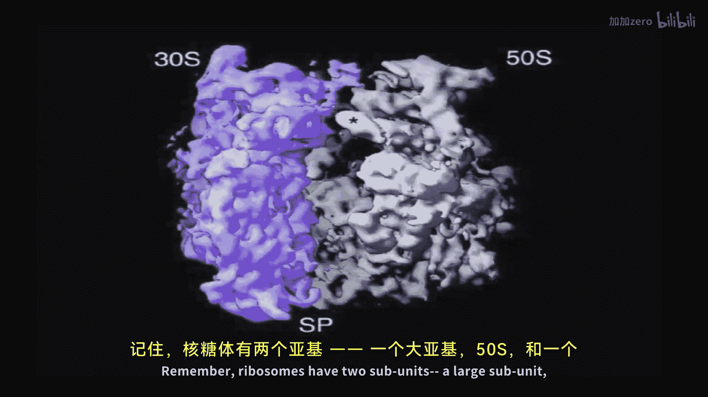
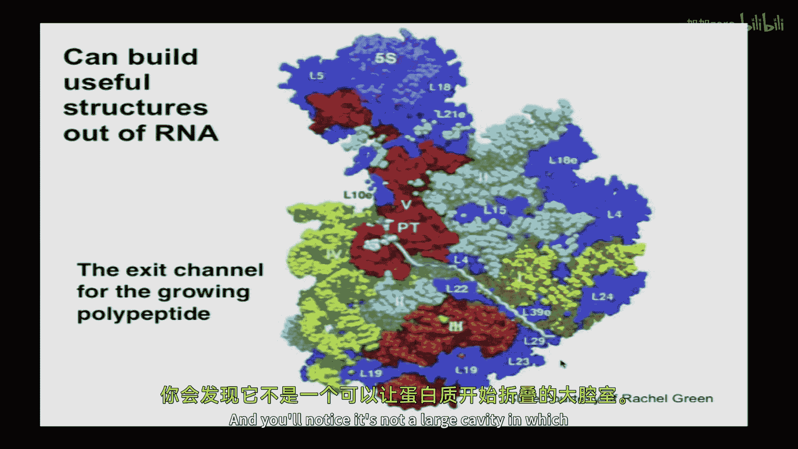

# 011：RNA二级结构；生物学功能与预测 🧬

## 概述
在本节课中，我们将学习RNA二级结构的基本概念、其生物学功能以及两种主要的预测方法。我们将首先回顾RNA在生物学中的重要作用，然后介绍RNA二级结构的表示方法。接着，我们将探讨如何利用进化信息（共变分析）和热力学原理（能量最小化）来预测RNA结构。课程内容旨在让初学者能够理解这些核心概念。

---

## 课程回顾：隐马尔可夫模型（HMM）🔍
上一节我们介绍了隐马尔可夫模型（HMM）及其核心算法——维特比算法。HMM是一种生成模型，包含初始概率、转移概率和发射概率等参数。维特比算法用于寻找最可能产生观测序列的隐藏状态路径，其计算复杂度为 **O(K²L)**，其中K是状态数，L是序列长度。

## 真实世界中的HMM应用 🌍
本节中我们来看看几个真实世界中的HMM应用实例。

### 基因发现
HMM已广泛应用于原核生物和真核生物的基因发现，相关例子在教材中有详细讨论。

### 谱HMM
谱HMM是基于具有相关功能或共同结构域的多重蛋白质序列比对构建的。例如，PFAM数据库包含了数百种不同蛋白质结构域的谱HMM。一旦拥有大量样本，就可以学习每个位置的残基频率、插入和删除的概率。挑战在于将查询蛋白质与所有这些谱HMM进行比对，以判断是否存在显著匹配。HMM的优点是允许根据数据调整不同位置的插入概率。

### TMHMM：跨膜螺旋预测
TMHMM是一个用于预测蛋白质中跨膜螺旋的HMM。它能够以约97%的准确率预测蛋白质是否含有跨膜螺旋、其方向以及具体位置。

为了准确建模跨膜螺旋的长度分布（通常约为20个残基），TMHMM没有使用单一可自我循环的“螺旋”状态（这会产生几何分布），而是使用了多个（例如25个）不同的螺旋状态，并设置了特定的转移概率，从而能够拟合任意的长度分布。这种方法的代价是增加了计算复杂度和参数估计的难度。

TMHMM程序的输出示例如下：它预测了一个小鼠氯离子通道基因CLC6含有七个跨膜螺旋（图中红色块），并预测蛋白质的N端在细胞外，C端在细胞内。

## 置信度评估：前向-后向算法 📊
对于预测结果，我们不仅想知道最优预测，还想了解算法对预测各个部分的置信度。这可以通过**前向-后向算法**实现。

该算法的基本思想是计算观测序列在所有可能隐藏状态路径上的总概率。类似于维特比算法，但在每个状态不是取最大值，而是对输入概率求和。可以分别沿序列向前和向后运行该算法。对于序列中特定位置i处于特定隐藏状态（如螺旋状态）的概率，可以通过将前向算法在i处的值、后向算法在i处的值相乘，再除以观测序列的总概率来获得。这等价于计算所有经过该位置和该隐藏状态的路径的概率之和。

例如，在TMHMM的输出中，可以绘制每个状态的后验概率图。这能显示算法对预测不同部分（如某个跨膜螺旋是否存在或其边界）的置信度，从而指导实验验证的优先级。

## RNA二级结构介绍 🧪
现在，我们将转向今天的主要话题：RNA二级结构。

### 什么是RNA二级结构？
与蛋白质类似，RNA具有决定其功能的三维折叠结构。**RNA二级结构**是一种更简单的表示，它只描述哪些碱基对通过氢键相互配对。例如，所有tRNA都具有经典的三叶草二级结构，指定了所有碱基对后，就能绘制出结构图，这有助于了解RNA分子的哪些部分是可接近的。

### 结构表示方法
RNA二级结构有几种常见的表示方法：
*   **点括号表示法**：例如 `(((...)))`。点表示未配对碱基，括号表示配对碱基。配对的括号必须正确嵌套。
*   **弧线图表示法**：在序列上方绘制连接配对碱基的弧线。弧线是否交叉是区分可处理结构和复杂结构（如假结）的关键。

### RNA结构的生物学实例
*   **核糖体**：核糖体大亚基和小亚基主要由RNA构成，蛋白质像装饰品一样分布在边缘，这支持了“RNA世界”假说。核糖体的催化活性位点附近没有蛋白质，证明肽键形成是由RNA催化的，即核糖体是一个核酶。许多抗生素正是通过利用原核与真核核糖体结构的差异来发挥作用的。
*   **非编码RNA**：包括tRNA、rRNA、UTR、snRNA、snoRNA、转录终止子、信号识别颗粒SRP、tmRNA、microRNA、lncRNA以及**核糖开关**等。

**核糖开关**是一种具有多种构象的RNA，其构象会响应某些刺激（如配体结合、温度变化）而改变。通常，一种构象会阻断调控元件（如核糖体结合位点），从而调节基因表达。

## 利用共变分析预测RNA结构 🔄
如果我们拥有一个RNA的多个同源序列比对，可以利用**共变**现象来推断其二级结构。其原理是：为了维持碱基配对，当配对中的一个碱基发生突变时，另一个配对的碱基会发生补偿性突变以维持配对能力。

### 互信息统计量
为了客观地衡量两列之间的共变程度，常用**互信息**作为统计量。对于比对中的第i列和第j列：
*   计算每列中各个核苷酸的频率 **fᵢ(x)** 和 **fⱼ(y)**。
*   计算两列间每个核苷酸对 **XY** 的联合观测频率 **fᵢⱼ(x, y)**。
*   互信息 **MIᵢⱼ** 的计算公式为：
    **MIᵢⱼ = Σₓ Σᵧ fᵢⱼ(x, y) log₂ [ fᵢⱼ(x, y) / (fᵢ(x) fⱼ(y)) ]**
    这实质上是观测联合分布与假设两列独立时的期望分布之间的相对熵。如果两列独立，MI为0；如果存在强共变关系（如严格互补），MI值会较高（最大可达2）。

### 应用步骤与注意事项
1.  对多重序列比对，计算所有列对之间的互信息。
2.  寻找互信息值高的列对。
3.  检查这些高互信息列对所对应的核苷酸是否倾向于互补。
4.  寻找连续位置之间的共变模式，形成潜在的茎区。
5.  此方法要求：
    *   二级结构在进化中保守。
    *   序列间有足够的分化以产生变异，但又不能分化太大以致无法获得可靠比对。
    *   通常无法有效预测涉及交叉弧线的**假结**结构。

## 利用能量最小化预测RNA结构 ⚖️
当没有同源序列或比对不可靠时，可以使用基于热力学的**能量最小化**方法预测RNA二级结构。其基本思想是：RNA折叠由折叠自由能决定，碱基配对带来焓减（有利），而结构有序化导致熵减（不利）。

### Nussinov算法：最大化碱基配对数
早期方法试图最大化碱基配对数量，忽略熵效应。Ruth Nussinov提出了第一个使用动态规划解决此问题的算法。

#### 算法核心思想
1.  **填充顺序**：不同于序列比对从一端开始，该算法从序列内部（短片段）开始，逐步向外（长片段）计算。这对应在一个 `n x n` 的矩阵中，从主对角线开始，向右上角填充。
2.  **递归关系**：计算序列区间 `[i, j]` 的最大配对数 `S(i, j)` 时，考虑四种情况：
    *   **情况1**：`i` 与 `j` 配对。则 `S(i, j) = S(i+1, j-1) + 1`。
    *   **情况2**：`i` 不配对。则 `S(i, j) = S(i+1, j)`。
    *   **情况3**：`j` 不配对。则 `S(i, j) = S(i, j-1)`。
    *   **情况4**：**分岔**。`i` 和 `j` 分别与区间内部的碱基配对，将区间分成两部分。则 `S(i, j) = max_{i<k<j} [ S(i, k) + S(k+1, j) ]`。
    `S(i, j)` 取以上四种情况的最大值。

#### 算法步骤与复杂度
1.  初始化 `n x n` 矩阵，主对角线及次对角线元素为0。
2.  按从短到长的顺序（即向右上角方向）递归填充矩阵，并记录回溯指针。
3.  矩阵右上角元素 `S(1, n)` 即为最大配对数。
4.  通过回溯指针重建最优二级结构。
该算法的**时间复杂度为 O(n³)**，**空间复杂度为 O(n²)**。因此，对于长序列（>1000 nt）计算较慢，且基础算法无法处理假结。

### 现代RNA折叠算法
现代算法（如Mfold、Vienna RNAfold）使用了更精细的热力学模型，不仅考虑碱基配对数量，还考虑具体配对类型（GC比AU更稳定）、环区大小等因素。它们能计算最小自由能结构、次优结构以及基于配分函数的碱基配对概率。这些工具的预测准确率通常在70%左右。

#### 应用实例
*   **U5 snRNA**：Mfold预测的结构非常明确，能量点图显示几乎没有其他竞争结构。
*   **赖氨酸核糖开关**：Mfold预测显示存在多个低能量结构（点图中多种颜色的点），这与其已知的、依赖配体浓度在两种功能构象间切换的特性相符。

## 总结 🎯
本节课我们一起学习了RNA二级结构的相关知识。我们首先回顾了HMM及其在真实世界中的应用，如TMHMM。然后，我们深入探讨了RNA二级结构的定义、表示方法及其重要的生物学功能，并以核糖体和核糖开关为例。最后，我们重点介绍了两种预测RNA二级结构的方法：
1.  **共变分析**：利用多重序列比对中的补偿性突变来推断结构，适用于有同源序列的情况。
2.  **能量最小化**：基于热力学原理，使用动态规划等算法预测最小自由能结构，适用于任何序列。

理解这些方法有助于我们解读非编码RNA的功能、寻找新的RNA基因，并设计实验验证其结构。