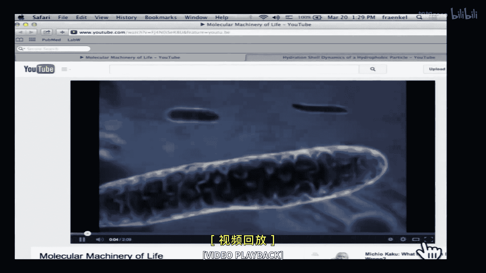
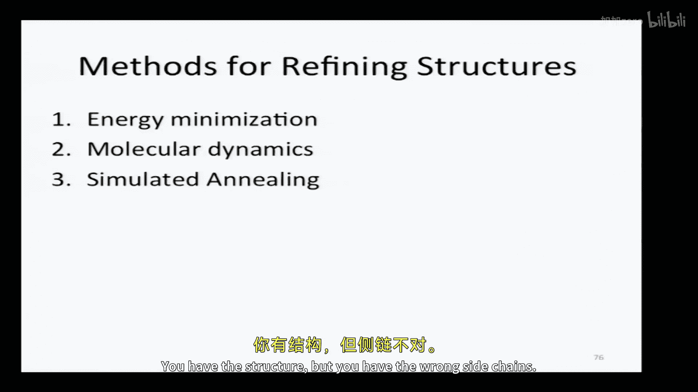

# 012：蛋白质结构导论；结构比较与分类

以下内容基于知识共享许可协议提供。您的支持将帮助麻省理工学院开放式课件继续免费提供高质量教育资源。如需捐款或查看来自数百门MIT课程的其他材料，请访问 ocw.mit.edu。

我是欧内斯特·弗兰克尔，我将讲授接下来的几节课。我鼓励大家在课外有任何问题时联系我，也欢迎在课堂上提问。尽管有摄像机和阶梯教室，环境可能有些非个人化，但我们希望能克服这一点。

本单元将重点介绍计算生物学中跨尺度的研究，从处理原子水平蛋白质结构基础的计算问题，到蛋白质-蛋白质相互作用、蛋白质-DNA相互作用以及小分子，最终深入到蛋白质网络。我们需要涵盖很多内容，但我相信我们能够完成。

正如你们在课程大纲中看到的，前几节课将深入探讨蛋白质结构在分子水平的分析，然后我们将转向一些更高层次的分析，包括蛋白质-DNA相互作用和基因调控网络。

我认为你们很多人可能都熟悉这句话：“除非从进化的角度，否则生物学中的一切都毫无意义。”我想提供一个修改版：“除非从结构的角度，否则生物学中的许多东西都难以理解。”蛋白质结构、DNA结构。当然，我们在分子生物学早期就看到了这一点，当DNA结构被解析时，它为何是遗传基础的原因立刻变得清晰。

但蛋白质结构的影响更为持久。一次又一次，许多事件真正彻底改变了我们对特定生物学问题的理解。一个当时令人震惊的例子与癌症中最常突变的蛋白质有关，即P53基因。大约一半的癌症中都有该基因的突变。在基因组测序时代之前，识别肿瘤中的突变实际上非常昂贵和困难，因此他们专注于这个特定基因。他们观察到突变是成簇出现的。

这是该蛋白质从N端到C端的结构图，条形图表示突变的频率。可以看到，它们几乎都聚集在这个分子的中心区域。为什么会这样？在MIT的卡尔·帕沃和他的博士后尼洛·帕沃利奇解析其结构之前，这始终是个谜。他们实际上表明，这些簇对应于关键的结构域。在第二篇论文中，他们进一步揭示了突变为何发生在这些特定位置。

如果你看左上角的图，上面是蛋白质序列，下面是突变频率，再下面是二级结构元件。你会发现突变发生在没有规则二级结构的区域，而在有二级结构的区域，突变可能频繁也可能完全没有。因此，二级结构元件的存在本身并不能解释突变的原因。

但当三维结构及其与DNA的复合物结构被解析后（如右图所示，左边是蛋白质结构，右边是DNA结构，黄色标记的是这些高频突变的残基），结果发现，所有高频突变的残基都位于蛋白质与DNA的相互作用界面上。因此，通过一张图，我们现在理解了为什么多年来这个谜团一直存在：突变为何如此特异性地聚集在这个蛋白质中，且方式并不明显。由于这是蛋白质与DNA的界面，这些突变扰乱了P53通过其作用进行的基因调控和转录调控。

因此，为了理解蛋白质功能，我们需要理解蛋白质结构。那么，我们从哪里获取这些结构呢？关于蛋白质如何被解析的统计数据，我在这里展示的是来自PDB（蛋白质数据库）的数据。它的全称是RCSB蛋白质数据库，但通常简称为PDB。这张幻灯片显示，当时大约有80,000个结构是通过X射线晶体学解析的。

第二常用的方法是核磁共振，解析了大约10,000个结构，而所有其他技术产生的结构非常少，只有几百个，而不是几千个。

那么这些技术是如何工作的呢？它们不会神奇地直接给你一个结构。它们提供信息，你需要通过计算来推导结构。

这是通过X射线晶体学解析结构的示意图。首先，你必须培养出蛋白质或你感兴趣研究的蛋白质与其他分子的晶体。这些晶体不像石英那样大，它们甚至比食盐还小，通常肉眼勉强可见，并且非常不稳定，必须保持在溶液中或经常冷冻。然后你用一束高功率的X射线照射它们。

大多数X射线会直接穿过，因为X射线与物质的相互作用很弱。但少数X射线会发生衍射。从这种微弱的衍射图案中，你实际上可以推断出散射X射线的电子在晶体中的位置。

右下角的图片显示了浅蓝色的电子密度云，以及贯穿其中的蛋白质结构。经过大量计算工作后，你可以从这些晶体学衍射图案中计算出电子密度的位置。然后，计算上的挑战是尝试找出能够产生该电子密度的原子位置，这些原子在被X射线照射时会产生X射线衍射图案。因此，这实际上是一个迭代过程，从一个初始结构开始，然后根据该结构计算电子的位置，再根据电子位置计算X射线照射时可能产生的衍射图案，并确定预测的衍射图案与实际衍射图案的吻合程度，然后不断迭代。显然，这是一个高度计算密集型的问题，因为你不仅要找到与观察到的衍射图案最一致的位置，还要找到与物理学最一致的位置。

例如，如果我们这里有一块分子，我们不能随意放置原子。它们需要以明确的键长、键角等位置放置。因此，这是一个高度耦合的问题，我们必须解决。我们将研究支撑这些方法的一些技术，尽管不会专门研究如何解析晶体结构。

你提到，第二常用的技术是核磁共振。这项技术不需要晶体，但需要非常高浓度的可溶性蛋白质，这本身也带来了问题。从核磁共振结构中获取的信息不是电子密度的位置，而是一组距离，告诉你两个原子（通常是质子）之间的相对距离。这在这里用黄色线条表示。同样，我们面临一个困难的计算问题：需要找出一个与所有物理力一致的蛋白质结构，同时使特定的质子彼此处于特定的距离。

因此，我们说“解析”晶体结构、“解析”NMR结构，因为这是解决一个非常复杂的计算挑战的方案。我们将要研究的技术（虽然不是专门用于解析晶体和NMR结构）是这些技术的基础。我们将重点关注一个可能更复杂的问题：蛋白质结构的从头预测。也就是说，如果我有一个序列，我能否告诉你一些关于其结构的重要且准确的信息？

《结构生物信息学》一书中有一个很好的总结，它真正涉及了许多与结构相关的计算生物学问题，并突出了我们在本课程中迄今为止看到的算法类型与我们在理解蛋白质结构时需要采取的方法类型之间的许多差异。

首先，最根本、最明显的是，我们处理的是三维结构。因此，我们正在从简单的线性数据表示转向处理更复杂的三维问题。因此，我们遇到了各种新问题。我们不再拥有离散的搜索空间，而是有一个连续的搜索空间。我们将研究试图将这个连续搜索空间简化回离散空间的算法，以使其成为一个更简单的问题。

但也许最根本的区别是，现在我们必须引入大量物理知识作为算法的基础。仅仅从物理学中完全抽象出来解决这个问题是不够的，我们实际上必须在算法的核心处理物理学问题。我们将在本次讲座的其余部分讨论红色高亮的问题。

另一个即将出现的问题是，如果存在从蛋白质序列到结构的简单映射就好了。如果是这样，你会认为两个序列差异很大的蛋白质会有不同的结构。但事实上，情况并非如此。你可以有两个序列相似性几乎为零的蛋白质，却采用相同的三维结构。因此，这显然是一个极其复杂的问题。更复杂的是，我们并不知道所有的结构。我们并不是从一个已知结构的离散集合中选择我们的新分子是什么，我们需要处理蛋白质链潜在的无限构象。

好的，我希望你们有机会查看我发布在网上的蛋白质结构复习材料。如果没有，请务必查看，这对理解接下来的几节课非常有帮助。我将假设你们熟悉蛋白质结构的基本要素：什么是α螺旋、β折叠、一级结构、二级结构等等。我也鼓励你们熟悉氨基酸。如果不了解氨基酸是什么，就很难理解蛋白质结构中的任何内容。教科书中有很好的图表总结了描述氨基酸特征的多种重叠方式，请熟悉它们。

这些是我们发布在网上的资源。此外，RCSB蛋白质数据库也有极好的在线资源，可以帮助初学者理解蛋白质结构。我鼓励你们查看他们的网站。特别是，他们的网站上有可以下载的可视化蛋白质结构的工具，这将是理解这些算法的关键组成部分，以便真正了解这些结构的样子。我特别推荐两个我觉得特别容易使用的工具：PyMOL和Swiss-PDB Viewer。你不仅可以用这些技术查看结构，还可以修改它们，甚至可以进行同源建模。

在我们深入研究理解蛋白质结构的算法之前，我们需要了解蛋白质结构是如何表示的。我已经提到过这些重复单元，我希望你们已经知道α螺旋和β折叠，这里不再详述。但描述蛋白质结构的两种更定量化的方式与三维坐标（每个原子的X、Y、Z坐标）和内部坐标有关。我们将稍微详细地介绍这些。

再次强调，这个PDB网站有很多很好的资源来理解这些坐标的样子。它们很好地描述了所谓的PDB文件。这些PDB文件开头有现在称为元数据的信息，但当时只是关于蛋白质结构如何解析的信息。它会告诉你蛋白质来自什么生物体，如果不是从该生物体纯化而是重组表达的，它是在哪里合成的，关于晶体结构如何确定的细节等等。

序列，这些大部分我们不会关心，但我们会关心的是这里更详细显示的底部部分。让我们看看这些行各自代表什么。包含原子坐标信息的行以单词“ATOM”开头，然后是一个索引号，只是文件中每一行的参考，告诉你它是什么类型的原子，它在蛋白质的哪条链上，以及残基编号。这里从残基100开始，这里的序列可能是任意的，可能与Swiss-Prot或GenBank中出现的蛋白质序列无关。

接下来的三列对我们最重要。这些是原子的X、Y、Z坐标。要在三维空间中确定任何分子的位置，至少需要三个坐标。这些就是那三个坐标。

它们后面跟着另外两个数字，这两个数字实际上非常有趣，因为它们告诉我们关于分子（原子）在晶体结构中确实处于该位置的确定程度。第一个是占有率。在晶体结构中，我们实际上获取的是晶体重复单元中成千上万个分子的信息。晶体一个单元和下一个单元之间的结构可能存在一些变化。因此，一个侧链在一个晶体中可能在这里，而在晶体的下一个重复单元中可能在那里。如果存在离散的构象，那么信号就会减弱，你实际上会得到所有可能构象的某种叠加。

这里的数字1意味着似乎存在一个主要的构象。但如果存在多个离散的构象，例如，你可能发现占有率为0.5，然后另一行显示另一个位置，占有率也是0.5。这就是当这些原子位于离散位置时的情况。

B因子称为热因子，它告诉你晶体中有多少热运动。这意味着什么？如果我们考虑晶体结构，其中一些部分在中心是坚固的，高度受限，蛋白质的致密核心不会发生太大变化，但在蛋白质表面，可能存在高度灵活的残基。因此，当它们在晶体中被撞击时，它们会以略微不同的方式散射X射线，但它们并不处于离散的构象。所以我们不会看到多个独立的位置，只会看到某个平均位置。这种噪声可以用这些B因子来解释，其中高数值代表结构的高度移动部分，低数值代表非常稳定的部分。

这里非常低的数值，比如20。像80这样的数值通常出现在分子末端，那里有很多结构灵活性。

因此，我们有这种描述蛋白质结构的方式，即指定每个原子的X、Y、Z坐标，并且有这两个参数来表示热运动和静态无序。那么，这些坐标是唯一定义的吗？如果我有一个结构，写下X、Y、Z坐标的方式是否只有一种？有些人说是，有些人说不是。为什么不是？你可以旋转它，可以设置原点，所以没有唯一定义的方式，这将在后面再次提到。

好的，这是一种描述蛋白质三维坐标的非常精确的方式，但并不是一种非常简洁的表示方式。为什么？正如静态模型所示，蛋白质结构的某些部分确实不会发生太大变化。键长在蛋白质结构中变化很小。四面体配位的碳原子不会突然变成平面构型。这些变化非常小。所以，如果我指定了这个碳的X、Y、Z坐标，另一个碳的位置自由度其实并不多，它必须位于某个距离的球面上。因此，与其表示每个原子的X、Y、Z坐标，我可以使用内部坐标。

在这张幻灯片中，我们有一个氨基酸，氨基氮、羰基碳，这是一个单一的氨基酸。这是连接到下一个氨基酸的肽键。如图所示，一个氨基酸的羰基碳与下一个氨基酸的酰胺氮之间的键是平面的。所以那个角度甚至不旋转。这是我们完全移除的一个自由度。主链中旋转的角度称为φ和ψ，φ在这里，ψ在这里。

因此，这是两个决定这个氨基酸构象的自由度。所以，与其指定所有坐标，我可以通过给出每个氨基酸的两个数字（φ角和ψ角）来指定主链，并假设ω角（这个肽键）保持不变。同样，对于侧链，我们稍后会更详细地介绍，我们可以给出侧链中可旋转键的坐标（旋转角度），而不是指定向外延伸的每个原子。

好的，我们有了这两种不同的表示蛋白质结构的方式。我们会看到两者都被使用。对此有任何问题吗？很好。

那么，如果我们观察蛋白质结构，我们想问的一个问题是：如何比较两个蛋白质结构？

我们已经提到，蛋白质可以具有相似的结构，无论它们的序列是否高度相似。例如，如果我有两个高度同源的蛋白质，具有高度的序列相似性，比如这两个来自牛和鼠的同源蛋白，从远处看，它们都有非常相似的结构，并且有74%的序列相似性。这并不奇怪。但你也可以得到序列相似性非常低的蛋白质，它们仍然是进化相关的，比如这些来自不同物种的同源蛋白（具有相同蛋白质），或者同一物种中具有两个相似但非完全相同的拷贝的蛋白质，它们保持相同的结构，即使只有大约20%到30%的序列相似性。

你甚至可以发现更远的关系。例如，这里有两个都在人类中的蛋白质，进化相关，但只有4%的序列同一性。然而，从远处看，它们看起来几乎一模一样。这些是进化相关的蛋白质。

但我们也可以有被称为类似物的东西，它们没有进化关系，没有明显的序列相似性，却采用几乎相同的蛋白质结构。这增加了我们试图解决的生物学问题的复杂性。

那么，如何定量比较两个蛋白质结构呢？常用的度量是称为RMSD（均方根偏差）的东西。这里我有一组通过NMR解析的结构。你可以看到有一个定义良好的结构核心，然后有一些部分定义不佳，没有足够的约束来定义它们。这些蛋白质都已经对齐，因此X、Y、Z坐标已经经过旋转和平移以达到最大程度的一致。一致性的度量就是这个均方根偏差。

我需要定义两个结构中成对的原子。如果像这里一样是同一个结构，那很容易，每个原子在这个用相同分子解析的结构中都有一个匹配项。但如果我们处理两个同源蛋白质，这就变得有点棘手，我们需要定义哪些氨基酸将匹配起来。我们还可以定义我们是否关心侧链的变化，或者只关心主链的变化，是否关心质子是否在正确的位置。你会看到，这些比对可以只使用重原子（不包括氢），或者只使用主链原子（完全不包括侧链）。

但一旦我们定义了对应的原子对，我们将取对应原子在X、Y、Z坐标上距离的平方和，然后取该和的平方根，这就得到了均方根偏差。当然，我们必须通过刚体旋转来最小化这个均方根偏差，以考虑到我可能将PDB文件的原点设在这个原子，或者设在那一个原子等等。对此有任何问题吗？是的。

问题：我们考虑单个原子吗？我们有一个选择。问题是我们是否考虑分子中的每一个原子？我们不一定需要。这实际上取决于我们试图解决的问题。例如，如果我们想看看两个蛋白质是否具有相同的折叠，我们可能不关心侧链，因此可能只限于主链原子。但如果我们试图判断两个晶体结构是否彼此吻合，或者像我们稍后会看到的，我们试图预测蛋白质的结构，并且我们有相同蛋白质的实验确定结构，我们想判断两者是否一致。在这种情况下，我们可能实际上希望确保每个原子都在正确的位置。所以这将取决于我们试图回答的问题。好问题。还有其他问题吗？好的。

到目前为止，我展示了很多分子的静态图片。我想强调的是，分子实际上移动很多，所以我在这里播放一小段视频。

好的，那部分是为了在课堂上播放一点新世纪音乐的借口。更根本的是，它提醒你，尽管我们会向你展示很多蛋白质的静态图片，但它们实际上是高度动态的，并且它们有明确的结构，但可能不止一个明确的结构，特别是那些执行工作的分子，它们实际上在移动东西，具有多种结构。因此，当我们考虑蛋白质结构时，这是一种近似，我们通常指的是蛋白质结构，而不是单一的某个结构。

那么，是什么决定了蛋白质结构？我告诉过你，是物理学，从根本上说，这是一个物理问题。因此，最佳的蛋白质结构必须是能量最小值。作用在蛋白质上的净力必须为零。力是势能的负导数，所以该导数必须为0。因此，我们必须有一个蛋白质结构的最小值。这并不意味着恰好只有一个最小值，那些在视频中有多种构象的蛋白质显然有多个最小值，取决于其他情况，但至少必须有一个局部最小值。所以，如果我们知道这个U（势能函数），并且可以对其求导，我们就可以通过简单地识别该势能函数中的最小值来确定蛋白质结构或蛋白质结构。

现在，如果生活如此简单就好了。但我们将看到，有一些方法可以参数化U，并用它来优化结构，从而至少找到局部最小值。我们将主要研究两种描述势能函数的不同方式。一种方式，我们将像物理学家那样看待问题；另一种方式，我们将像统计学家那样看待它。

因此，物理学家希望描述支撑蛋白质结构的物理力。因此，我们将尽可能尝试写出代表这些力的方程。我们并不总是能够做到这一点，因为涉及的许多力是量子力学的。两个固体物体不会相互穿过，正是因为涉及量子力学的排斥原理。我们不会为蛋白质结构中的每个原子写下量子力学方程，但我们会写下近似这些力的方程。并且，只要可能，我们将尝试将方程中的项与物理学中可识别的东西联系起来。这种方法的一个很好的例子是CHARMM程序。实际上，这些方法正是去年获得诺贝尔化学奖的方法。

在光谱的另一端是统计方法。在这里，我们并不真正关心潜在的物理特性，我们想要的是捕捉我们在自然界中观察到的现象的方程。通常，这两种方法会很好地吻合。物理学家为了捕捉基本物理力而做出的某些近似，可能正是描述自然界现象的最佳方式。因此，这些项在CHARMM版本和我最喜欢的统计方法（即Rosetta）中可能看起来没有区别。但我们会看到，在某些地方，这两种方法在如何描述分子势能函数方面存在根本分歧，因为一种试图描述物理力，而另一种试图描述统计力。

观众中有德语母语者吗？你想为我们读一下这个笑话吗？物理学。它说你可以在这里或这里找到自己。对于视频来说，这是量子力学研究所。你去MIT的地图，它会说你在这里，但在量子力学研究所，它说你在这里或那里。所以这是物理学家的方法。我们确实必须考虑这些量子力学特征，而右边是统计学家的方法。它说数据没有任何意义，我们必须求助于统计学。好的，所以统计学家可以在不理解潜在物理力的情况下走得很远。

那么，让我们先看看物理学家的方法。我们将势能函数分解为键合项和非键合项。键合项，顾名思义，将是结构中彼此接近的原子。当然，这两个原子因为通过单键连接而成为键合项。但我们也会看到，三个或四个彼此靠近的原子组也会成为键合项。非键合项则是当我有另一个分子靠近，但不是直接连接时。这两者之间的物理力是什么？

这些键合项首先分解为许多子项。我在这里展示函数形式。我们将只详细看其中几个，然后让你了解其他项是什么。第一个是描述两个键合原子之间距离的键合项。同样，这本质上是量子力学特性，但描述量子力学的计算成本太高，而且并非真正必要，因为通过将其描述为刚性弹簧就可以做得很好。

因此，方程中的这个二次形式就代表了这一点。我们简单地定义这里的b0是这两种特定类型原子之间的平衡位置（这里可能是两个四面体配位的碳）。这个参数是通过观察许多非常高分辨率的小分子晶体结构来确定的。我们知道这种键的典型距离，我们将其作为一个参数。CHARMM程序中会有一个大文件列出所有这些键合项的参数。然后，如果在你的优化过程中分子被拉伸了一点，导致有小的偏差，就会有一个惩罚项将其拉回，就像弹簧将其拉回一样。

事实证明，当你这样做时，你实际上必须提出很多方程来保持几何形状。因为，我们不仅需要担心这些距离键，还需要担心角度。所以我们需要考虑这个键和这个键之间的角度。是什么保持它在适当的位置？因此，我们需要添加另一个项，这是这里的第二项，以使这些之间的角度固定。

然后我们必须处理所谓的二面角，以确保这四个原子处于允许的几何形状中。因此，这些项中的每一项都解释了类似的事情。这里的最后一项确保φ和ψ角与我们看到的量子力学一致，并根据我们在这些小分子中观察到的任何偏差进行校正。因此，有很多项和很多参数，试图捕捉我们所观察到的最佳描述。但每一项的动机都是基于其下有一些量子力学原理。

那么，这些非键合项呢？非键合项是指那些在蛋白质结构中彼此相距较远，但在三维空间中靠近的分子。这里有两种基本力。第一种称为Lennard-Jones势，第二种是静电势。Lennard-Jones势本身由这两项组成：一项是R的负六次方依赖项，另一项是正的R的十二次方依赖项。负的R的六次方是一个吸引势，这就是为什么它是负的。这是由于每个原子电子云中产生的小诱导偶极子将分子拉在一起。R的负六次方依赖性与两个偶极子相互作用的物理学有关。

R的十二次方项是对量子力学力的近似。正如我们已经说过的，两个分子不会相互穿过，是因为量子力学力，而计算这些力非常昂贵。所以我们想出一个容易计算的项。当然，R的十二次方项就是R的六次方项的平方。所以如果你计算了两个原子之间的一个R的负六次方，你只需将其平方，就得到了R的负十二次方。这在计算上非常高效。然后你调整这些参数（如R_min），使其与晶体结构合理地吻合。这些是我们非常了解的小分子的晶体结构。

然后是静电势，正如你可能预期的那样，它有一个随距离变化（1/R）的势，并且是电荷的乘积。这些可以是全电荷，也可以是部分电荷。这里有一个项，这个ε，是介电常数。它代表了在真空中，两个带相反电荷的分子之间的拉力比在水中大得多，因为水会屏蔽。因此，这些静电项，这个介电势项，可以从1（真空）变化到大约80（水）。设置这个值有点艺术性。

那么，这些势能看起来像什么？这里展示了。深色线是范德华势的总和，它由具有R的负六次方依赖性的吸引项和具有R的负十二次方依赖性的排斥项组成。为什么在短距离时它上升得如此之高？因为分子不能重叠。你会看到有一个最小值。因此，在没有其他力的情况下，两个原子之间存在一个最佳距离。这大致就是比例模型中这些硬球距离所代表的。

静电势显然也有一个吸引项，但随着距离变小，它会急剧增加（变得更有利）。因此，这两者的总和如图所示，即范德华力和静电力的组合。它再次有一个强最小值，但随着距离变近，变得高度正（排斥）。关于这些力有任何问题吗？是的，范德华势和Lennard-Jones势是同一个吗？通常，这两个术语可以互换使用。还有其他问题吗？好的。

这就是物理学家描述势能函数的方式。正如我告诉你的，Rosetta是统计方法的一个例子。它拒绝了所有这些试图通过原子间刚性弹簧来计算精确距离的严格定义，而是说，让我们固定很多这些角度。所以我们要固定两个原子之间的距离，让它变化微小的键长分数是没有意义的。我们要固定四面体碳的四面体配位，不让它们变形，因为这在现实中永远不会发生。因此，我们将搜索空间完全集中在可旋转键上。还记得主链中有多少个可旋转键吗？有两个，即φ角和ψ角。在侧链中，我们会有侧链上的可旋转键。

在这个例子中，这是一个半胱氨酸。这是主链，这是硫原子。我们恰好有一个感兴趣的可旋转键，因为我们并不真正关心氢的位置。所以，如果我们有这个χ1角，如果这里有更多原子，这将被称作χ2和χ3。这些可以旋转，但它们不是自由旋转的。我们在晶体结构中并没有观察到这些角度的每一种可能旋转。这正是左边图表所代表的：对于这个侧链，有χ1、χ2和χ3，深色区域代表在许多晶体结构中观察到的构象。你可以看到它是高度非均匀的。为什么会这样？

我看到后面有人开始用手比划。那么，为什么会这样？如果你们不是在比划，那也是非常有趣的手语。如果我们沿着其中一个四面体碳-碳键看下去，我们显然有一个自由旋转。但实际上，在某些构象中，一个碳上的原子和另一个碳上的原子之间会有很多空间位阻冲突。因此，这不是一个有利的构象。有利的构象是交错的，这种效应在整个蛋白质链中传播。因此，某些角度是高度偏好的，而其他角度则不是。这些高度偏好的角度被称为旋转异构体。因此，我们现在将找出这个χ1旋转的最佳角度的连续问题，转变为一个离散问题，其中可能只有两到三个可能的旋转选项。所以现在我们可以决定，是这个比那个好，还是那个比这个好。

关于旋转异构体或任何这些有问题吗？很好。

那么，我们如何确定呢？我们已经决定，我们将完全用这些内部坐标来描述蛋白质：主链的φ和ψ角，侧链的χ角。我们仍然需要一个势能函数。这还没有告诉我们如何找到最佳设置。我们可以尝试避免CHARMM的方法，即通过观察量子力学来决定这些项是什么。那么他们实际上是如何做到的呢？他们获取大量高分辨率晶体结构，并表征这些晶体结构中的某些特性。例如，他们可能表征一个脂肪族碳靠近酰胺氮的频率，他们确实测量了所有晶体结构中酰胺氮和脂肪族碳之间的距离，并确定这些距离出现的频率。

然后，你可以通过简单地使用玻尔兹曼方程，将这些观察结果转化为势能函数。因此，我们可以找出在X轴（距离）和Y轴（频率，即晶体结构中的条目数）上，我们得到某些距离的频率。然后，根据玻尔兹曼定律，我们可以计算相对于某个参考的状态密度，这个参考实际上很难定义。你可以查看幻灯片中引用的参考文献，了解目前是如何定义的。但我们必须找到某个任意的参考状态，以确定处于这些状态中任何一个的概率将是这些状态频率的对数函数。

因此，我们得到了一个完全由距离观察决定的能量项，它并不说“我知道这个带电，那个不带电”，它只是说这里有一个带双键的碳氧原子，这里有一个不带电的碳，它们在任意特定距离的频率是多少。我们对许多其他特性也进行同样的处理。我们现在将详细研究这些其他项是什么，查看高分辨率晶体结构，看看某些特性是什么，然后将它们转化为势能函数，我们可以用来确定侧链和主链的最佳旋转。

我还应该指出，当我们这样做时，我们会有不同的项或不同的东西。我们会有描述不同种类原子之间距离的项，我们会有描述范德华力等势能部分的项，我们将在后续幻灯片中描述。我们需要决定如何权衡所有这些独立的项，以便最终得到合理的蛋白质结构。这又是一个曲线拟合练习，找到最适合数据的数字，而没有任何指导性的物理原理。

你将会使用PyRosetta。在PyRosetta中，你会看到势能函数各项的列表。我将带你了解其中几项，以便你知道你在使用什么。在PyRosetta安装文件中，也会给出每项的相对权重。

好的，前两项是范德华力。这里，曲线的形状看起来就像我们之前看到的那样，在某种意义上必须如此，因为它们试图解决相同的物理问题。但动机非常不同。这里没有试图决定是否应该因为偶极-偶极相互作用而采用1/R^6，而仅仅是：我如何找到一个能准确代表数据库中观察到的现象的函数。

因此，再次强调，这是计算的，FAA吸引和FAA排斥，这些是基于晶体结构中观察到的统计数据确定的。

这一项，氢键，分解为骨架和侧链、长程和短程。氢键是蛋白质结构的主要决定因素之一。你会在发布的阅读材料中看到这一点。关于氢键的一个关键点是它需要近乎平面。因此，连接这个带有氢的原子和这个带有自由电子对的原子之间的角度必须尽可能接近线性。偏离线性越多，氢键就越弱。

因此，这个氢键势能包含描述供体和受体原子之间距离的项，以及它们之间的角度。它已被参数化，以分别代表彼此相距较远和较近的事物、侧链或主链的事物。这里确实是统计学家与物理学家的分歧所在。为什么要区分侧链和主链？没有任何物理原理驱使你这样做。仅仅是因为这样能使模型最好地拟合数据。因此，统计学家不害怕添加能使模型更好地拟合现实的项，即使它们不揭示任何基本的物理原理。

我们会看到，对于其他一些项，这种差异甚至更加显著。这是拉氏图，你也会在阅读中看到。它代表了观察到的φ和ψ角的频率。正如你所知，在这个φ-ψ图上只有几个位置是经常观察到的，代表了不同的规则二级结构，主要是α螺旋和β折叠。与其试图通过让周围都有很好的力来捕捉蛋白质应该形成α螺旋的事实，他们只是简单地偏好拉氏图中观察到的角度。因此，我们将给出一个势能函数，如果你的φ-ψ角最终落在这里，就会惩罚你；如果你的φ-ψ角最终落在这些位置之一，就会奖励你。对于物理学家来说，这是作弊；对于统计学家来说，这完全合理。

你应该对此一笑。好的，对于旋转异构体也是如此。所以对于侧链，我们说过，有些角度比其他角度更受偏好，因为这是我们在数据库中观察到的。同样，我们不会试图通过确保当这两个原子重叠时它们之间有排斥力来得到它们，我们将简单地通过说当你处于这些交错构象之一时势能较低，而当你处于重叠构象时势能较高来得到它们。

现在，统计学家和物理学家之间差异最显著的地方出现在我们观察溶剂化项时。决定蛋白质结构的很多因素（我应该说）是蛋白质与水的相互作用。蛋白质沐浴在55摩尔浓度的高度极性的水分子浴中，它们通常彼此形成氢键。当蛋白质位于其中时，蛋白质必须开始与它们形成氢键。

我们在蛋白质结构的哪里发现疏水残基？在外面还是里面？里面。因此，疏水残基都将被埋在里面。为什么会这样？实际上，用基本的物理原理来描述这一点真的非常困难。事实上，用基本的物理原理来描述水的结构真的非常困难。几年前，试图让水结冰的模拟才取得成功。因此，如果你试图使用基本物理原理模拟水，当你降低温度时，很难让它形成冰。因此，要表示一个浸在水中的复杂蛋白质结构如何实际与那些水分子相互作用，就更难了。

你有所有这些水分子与极性残基或非极性残基相互作用。物理学家真的很难表示这些。为了说明原因，让我再播放一小段视频，遗憾的是，这次没有新世纪音乐。

这里显示的是一个浸在一堆水分子中的球体。棕色是氧原子，白色小部分是氢原子。你可以看到它们四处摆动。你观察到的基本特征是什么？它们几乎在这个疏水分子周围形成了一个笼子。为什么会这样？它们很难与之相互作用。因此，它们很难与非极性残基相互作用。所以水分子想要最小化它们的势能。它们将通过与大块溶剂中的某物形成氢键来实现这一点。它们与其他水分子形成氢键。在这里，它们无法与球体形成任何氢键。因此，它们必须跳复杂的舞蹈，试图在中间有这个物体的情况下彼此形成氢键。

好的，这本质上是疏水效应的基本驱动力，它导致疏水残基被埋在蛋白质内部。正如我所说，使用基本物理力来模拟这一点非常非常困难。

那么统计学家怎么做呢？统计学家拥有实验观察和统计数据的优势。我们可以测量任何分子的疏水性。我们可以将碳原子放入非极性溶剂和极性溶剂中，确定分子在极性环境与非极性环境中花费的时间比例，并由此得到任何原子从疏水环境转移到亲水环境的自由能。这可以给我们这里的ΔG_ref。

现在，在蛋白质中，即使是在表面上，那个分子也不是完全溶剂暴露的。因为水分子试图从这个方向接近它，无法到达；从那个方向接近它，也无法到达。因此，这个碳从完全溶剂暴露状态转移到埋藏状态的转移能量，与孤立碳的不同。

因此，统计学家说，好吧，我想出一个函数来描述这一点。我将描述蛋白质结构中这个原子附近还有什么。这就是右边的项所做的：对所有其他相邻原子求和，并将相邻基团的体积描述为旁边的东西真的很大还是很小。通常不一定在原子水平上描述，可能是侧链，取决于哪个程序在做，但我有邻居体积的某种度量。如果那个体积非常大，并且这个东西已经处于疏水环境中，即使它伸入水中，因为它被庞大的东西包围。如果邻居很小，那么当它伸入水中时，环境就更亲水。这将调节这个自由能。这个函数清楚吗？

好的，因此，通过结合来自小分子转移实验的观察和基于蛋白质结构的这些观察，我们可以得到疏水效应的近似值。让蛋白质的这一部分处于溶剂中与处于疏水核心中，代价有多大？再次强调，我们从未进行任何量子力学计算，从未实际显式计算这个分子与溶剂的相互作用，在这个结构中我们不需要任何水。这仅仅是蛋白质的几何形状，它将为我们提供一个良好的势能函数近似。

好的，所以。你可以在我们提供的Rosetta文档中在线查看所有这些细节，以更好地了解所有这些函数是什么。但你可以看到有很多项。它是逐渐增加的。你发现你的模型有问题，就添加一项来尝试解释它。再次强调，不一定由物理力驱动。

那么，到目前为止我们看到了什么？我们看到了本单元的动机，从蛋白质结构开始，蛋白质结构确实帮助我们理解我们正在研究的生物分子。这些结构将影响我们对生物学的理解。因此，我们需要擅长预测这些蛋白质结构，或者在拥有实验数据时解析它们。

我们将使用的计算方法，我们将专注于从头解析蛋白质结构，预测它们。但这些相同的技术将是用于解析X射线晶体学和NMR的方法的基础。从根本上说，我们有两种描述势能的方法：统计学家的方法和物理学家的方法。记住统计学家的关键简化：A) 我们使用固定的几何形状，我们不试图找出每个原子的X、Y、Z坐标，我们只是试图找出键角。B) 我们将使用旋转异构体，因此我们将把连续的选择转变为离散的选择。C) 我们将使用统计势能来表示势能，这些势能可能有也可能没有清晰的物理基础。

好的，让我们从一个小思想实验开始，尝试进入一些预测算法。我有一个序列，大约100个氨基酸长。这里有两个蛋白质结构。一个主要是α螺旋，一个主要是β折叠。我如何判断这个序列更喜欢顶部的结构还是底部的结构？

实际上，我们已经掌握了很多工具。是的，在后面。答案：我们可以查看先前已知的序列，寻找同源性。这实际上将是一个非常强大的工具。因此，如果数据库中有一个同源物与该蛋白质密切相关并且具有已知结构，那么问题就解决了。如果没有呢？那是我的下一步。是的。如果你从二级结构的描述开始呢？比如螺旋和折叠。你计算每种氨基酸在这些结构中出现的频率。然后你也许可以计算一个可能性。很好，所以答案是：如果我观察这些α螺旋和β折叠，并计算某些氨基酸在α螺旋与β折叠中出现的频率，然后查看我的蛋白质序列，检查我是否有更多有利于α螺旋或β折叠的氨基酸。我们将看到这是一种已成功使用的方法，即二级结构预测。其他想法？是的。

所以我有结构的位置。很好，另一件我可以做的事情是：如果我有这两个结构，我有它们精确的三维结构，我可以尝试将我的序列放到那个结构上，实际上将我的序列的正确侧链放到那个主链构象上。然后我会做什么？我会实际测量蛋白质在顶部结构中的势能和蛋白质在底部结构中的势能。如果势能更高，那是有利结构还是不利结构？有利结构势能更低，所以我想要自由能更低的结构。

好的，让我们想想，这是正确的。这正是我们要讨论的方向。但这种方法的复杂性是什么？首先，关于这些侧链，我现在必须取一个具有其他氨基酸序列的主链结构，并把这些新的侧链放上去。如果我以错误的方式放置它们。假设，其中一个结构是真实结构。让我们从一个简化开始。假设你那个恶作剧的实验室伙伴实际上已经解析了你的蛋白质结构，但拒绝告诉你答案。她实际上解析了两个结构，其中一个她会给你序列，但她会给你两个结构的坐标。它们长度相同。所以她问你，你上了7.91，你能解决这个问题。告诉我你的序列实际上是在这个结构还是那个结构中。所以其中一个是完全正确的，你只是不知道是哪一个。

所以她给你主链坐标。你使用Swiss-PDB，将你的氨基酸序列A添加到主链上，添加所有正确的侧链。但现在你必须为这些侧链构象做出一系列决定。如果你做出错误的决定，会发生什么？好吧，你把这个原子放在靠近另一个原子的地方。现在你有了一个优化问题。你相信其中一个主链坐标是正确的，但你有一个高度耦合的优化问题。你需要找出这个蛋白质上每个侧链的正确旋转，你不能一个一个地做，不能采用贪婪的方法，因为如果我在这里放这个侧链，在那里放那个侧链，它们会碰撞。但如果这个是错的，它应该在那里，那么也许这个是正确的构象。所以我有一个耦合问题。事实证明，计算起来在计算上是昂贵的。

因此，我们将研究如果我们知道主链构象，但不知道侧链构象时该怎么做，我们可以尝试解决那个优化问题。你实际上会在问题集中做到这一点。

那么，如果主链构象不完全正确呢？假设你做了第一个建议，搜索序列数据库，你取这个序列，发现它实际上有两个同源物，两个具有相似序列相似性的东西。有两个蛋白质具有20%的序列同一性，但结构完全不同。这个有20%序列同一性，那个有20%序列同一性。你无法决定哪个是哪个。而且没有一个会是正确的蛋白质结构。

因此，你知道，通过将侧链放在这些蛋白质结构上，你必须解决侧链优化问题。但显然，你还必须解决主链优化问题。这变得更加耦合，因为当我移动这个主链时，侧链随之移动。所以现在我有一个非常非常复杂的优化问题需要处理。搜索空间是巨大的。即使我将其离散化，它仍然非常非常大。事实上，有一个著名的“莱文索尔悖论”，S. 莱文索尔曾是这里的教授，后来去了哥伦比亚大学。他对极其简单的蛋白质结构模型做了一个粗略的计算。如果你想象蛋白质在所有可能的构象中随机搜索，并在可能的构象之间非常快速地切换，那么一个蛋白质基本上需要宇宙的寿命才能折叠。因此，蛋白质不会对所有可能的构象进行随机搜索，它们可以极其快速地检查构象。所以我们当然不能那样做。因此，我们将不得不研究优化技术。

好的，我们讨论了如何使用能量优化函数来尝试决定哪个是正确的。即使结构是正确的，我们也有侧链优化问题。如果结构不正确，我们有两个