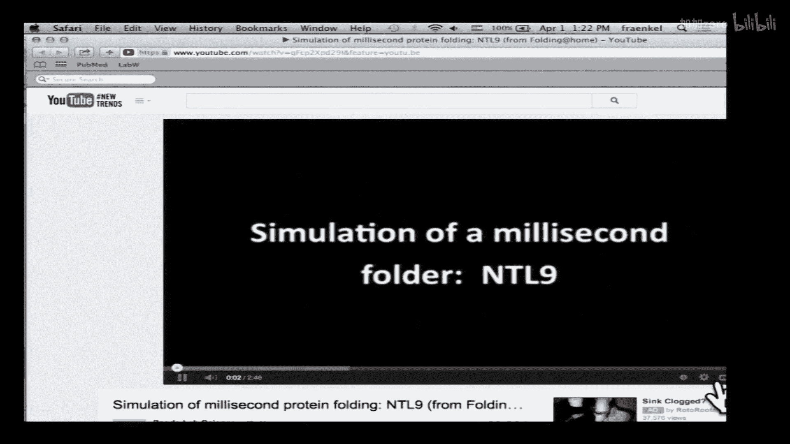
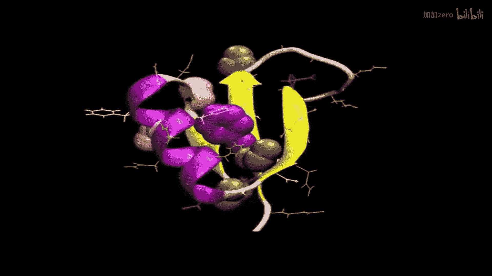

# 013：蛋白质结构预测

以下内容基于知识共享许可协议提供。您的支持将帮助麻省理工开放课件继续免费提供高质量教育资源。如需捐款或查看来自数百门麻省理工课程的其他材料，请访问 MIT OpenCourseware 网站 OCw.MIT.edu。

欢迎回来。希望你们休息得很好，也还记得我们上次课的内容。上次我们介绍了蛋白质结构，并讨论了蛋白质结构预测中的一些问题。现在，我们将更深入地探讨这个问题。上次我们将结构预测问题分解为几个子问题，包括二级结构预测（我们上次已稍作讨论）。早期的算法在70年代能达到约60%的准确率，而数十年的研究仅略有提升。但我们将看到，在结构域识别和预测新型三维结构方面的工作，在过去几年取得了非常显著的进展。

此外，我希望你们还记得，在蛋白质结构能量学方面，我们有两种不同的方法：物理学家的方法和统计学家的方法。这两种方法的关键区别是什么？有人愿意说说这两种方法在参数化结构能量方程时的区别吗？我们试图建立一个将坐标转换为能量的方程。物理学方法和统计方法的主要区别是什么？

是的，统计方法不改变键长和键角，它保持蛋白质的许多部分为刚性，而物理学方法允许所有原子独立移动。因此，一个关键区别是：在物理学方法中，两个相互键合的原子仍然可以根据弹簧函数（一个非常硬的弹簧）相互移动，原子是独立运动的；而在统计方法中，我们固定了原子间的距离。同样，对于一个四面体配位的原子，在物理学方法中，这些角度可以变形；在统计方法中，它们是固定的。所以，在统计方法中，我们具有大致固定的几何结构；在物理学方法中，每个原子独立运动。

还有人记得另一个关键区别吗？能量函数从何而来？在物理学方法中，它们尽可能地从物理原理推导而来；而在统计方法中，我们试图重现我们在自然界中观察到的现象，即使我们没有很好的物理基础。这在预测溶剂化自由能时最为明显：将一个疏水原子放入极性环境需要多少能量？在物理学方法中，你必须有水分子，它们必须与物质相互作用，这非常困难。而在统计方法中，我们提出一个近似：当极性原子在蛋白质结构中时，其溶剂可及表面积是多少？然后我们按此比例缩放转移能量。

所以，这些是主要区别。总结一下：统计方法采用固定几何结构，我们常使用离散的旋转异构体。记住，主链的 psi 和 phi 角原则上可以自由旋转，但通常只观察到少数几种构象，因此我们常将 chi 角限制在最常见的组合上。然后，我们使用依赖于数据库中观察频率的统计势能，这可以是观察到特定原子在精确距离上的频率，也可以是某物处于溶剂可及状态的时间比例。

我们上次还讨论了一个思考题：如果我有一个蛋白质序列和两个可能的结构，如何使用这些势能（无论是来自物理学方法还是统计方法）来决定哪个结构是正确的？一种可能性是，我有一个正确的结构和一个错误的结构。在这种情况下，我该怎么做？我知道其中一个结构是正确的，但不知道是哪一个。如何使用势能函数来决定？

正确的结构会有什么特点？它的能量会更低。但这足够吗？不，这里有一个微妙之处。如果我只是将我的蛋白质序列放到这两个结构中的一个上并计算自由能，并不能保证正确的那个自由能更低。为什么？我需要做出什么决定？当我将蛋白质序列放到一个主链结构上时，是的，侧链。我需要决定如何定向侧链。如果我定向错误，侧链可能会相互重叠，产生极高的能量。因此，在正确放置所有侧链之前，仅仅拥有正确的结构并不能保证得到最小的自由能。

这是简单情况。但在一般的结构域识别问题中，我们不知道正确的结构。我们有同源物。我们有一个序列，并认为它要么与蛋白质A同源，要么与蛋白质B同源。我想决定哪个是正确的。在这两种情况下，结构都是“错误”的，问题在于它有多“错误”。现在问题实际上变得更难了，因为我不仅需要得到正确的侧链构象，还需要得到正确的主链构象。它可能接近这些结构之一，但永远不会完全相同。

因此，在这两种情况下，我们都需要对初始结构进行某种精修。接下来我们将讨论用于精修部分正确结构的三种策略。我们将看三种策略：最简单的一种称为能量最小化，然后是分子动力学和模拟退火。

能量最小化基于我们上次讨论的原理：一个稳定的结构必须是自由能的极小值点，因为如果不是，就会有作用在原子上的力，从而将其推离该结构。然而，它是自由能极小值点这一事实，并不能保证它是全局自由能最小值点。蛋白质结构如果是稳定的，至少是一个局部自由能极小值点。它也可能是全局自由能最小值点，我们只是不知道答案。在蛋白质结构领域的早期，这是一个很大的争论点：蛋白质是否能自发折叠？如果能，那至少意味着它们显然是全局自由能最小值点。克里斯·安芬森因证明某些蛋白质可以在细胞外独立折叠而获得诺贝尔奖，这表明至少有些蛋白质的所有结构信息都隐含在其序列中，这似乎意味着它们是全局自由能最小值点。但我们现在知道，其他一些蛋白质最常见的结构只是局部自由能极小值点，并且存在很高的能量壁垒阻止其达到全局自由能最小值点。

但无论如何，如果我们有一个初始结构，我们可以尝试找到最近的局部自由能极小值点，也许那就是稳定结构。在我们的情境中，我们讨论的是在我们认为可能是正确结构的蛋白质表面堆积侧链。想象这是真实结构，我们有一个侧链，虚线绿线代表氢键，它从氮和氧与蛋白质其他部分形成一系列氢键。现在我们得到一个粗糙的主链结构，我们放入侧链。实际上，我们几乎永远不会随机选择正确的构象来获得所有这些氢键。因此，我们会从一个看起来像这样的结构开始，它被旋转了，以至于只能看到轮廓，而不是氮和氧。问题是，我们能否通过遵循能量极小值从一个结构到达另一个结构？

这就是问题。我们如何做到这一点？我们有一个函数，可以告诉我们每个原子 X、Y、Z 坐标的势能。那么我们如何最小化这个自由能？这与其他我们想要最小化的函数没什么不同：我们取一阶导数，寻找一阶导数为零的点。一个区别是我们无法解析地写出这个函数的样子，并解析地选择空间中的方向作为极小值点。因此，我们必须采用一种对结构进行微扰的方法，系统地尝试改进自由能。最容易理解的方法是梯度下降法，即我选择一些初始坐标，然后沿着函数一阶导数的方向迈出一步。

那看起来像什么？这里有两种可能性。我有一个函数。如果我起始于 x=2，减去某个小值 ε 乘以一阶导数，会指向左边。我将向左迈步，直到函数的一阶导数为零，然后停止移动。同样，如果我起始于右边，我将每次向右移动一点，直到一阶导数为零。这看起来不错，但可能需要很多步，并且由于步数可能很多，不能保证有很好的收敛性，可能需要很长时间。这是在简单一维情况下的导数。我们处理的是多维向量，所以我们使用梯度，即一组偏一阶导数。

这里需要指出的一点是，力是势能梯度的负值。因此，当我们进行梯度下降时，可以从物理角度理解为总是沿着力的方向移动。我有一个结构，它不是真正的天然结构，但我沿着力的方向逐步移动，朝着某个局部极小值移动。

我们在连续能量的情况下这样做了，但实际上你也可以对离散情况这样做。然而，关键点是，不能保证到达正确的能量结构。在我之前展示的例子中，如果我们进行最小化，实际上最终会得到侧链旋转180度的情况，它消除了所有空间冲突，但没有获得所有氢键。所以这是一个局部能量极小值点，而不是全局极小值点的例子。

有问题吗？是的。多维方程从何而来？这些是根据蛋白质中每个原子（如果你允许原子移动）或每个可旋转键（如果你只允许键旋转）表示能量的方程。问题在于，多维方程从何而来？还有其他问题吗？

好的，这是最简单的方法，即直接最小化能量。但我们说过，它不能保证找到全局自由能最小值点。另一种方法是分子动力学。这实际上试图通过模拟每个原子上的力和速度来模拟蛋白质结构在体外的行为。之前没有速度的概念，所有原子都是静态的。我们观察能量的梯度，沿着力的方向移动一个任意的步长。现在，我们实际上将赋予所有原子速度，它们将在空间中移动。

在任何时间 T 的坐标将由前一时间 T-1 的坐标加上速度乘以时间步长决定，而速度将由力决定，力又由势能的梯度决定。我们总是从势能函数开始，无论是来自物理学方法还是统计方法，最终得到速度，进而得到坐标。我们从蛋白质开始。关于如何平衡原子有一些严肃的问题。你从一个完全静态的结构开始，想对其施加力。如何做到这一点有一些微妙的技巧。但最终你实际上模拟了所有原子的运动。

为了让你感受一下那是什么样子，这里有一个快速视频。

这是蛋白质结构折叠的模拟。主链大部分被高亮显示，大多数侧链实际上没有以粗体显示。但你可以看到棍棒模型，慢慢地，它在积累其三维结构。

好的，我想你明白了。我就不继续播放了。好的，这些是支配类似运动方程的例子。

这种方法的优点是，我们实际上在模拟蛋白质折叠。所以如果我们做得正确，应该总是得到正确答案。当然，现实中并非如此。可能最大的问题只是计算速度。这些模拟，即使是非常短的，比如我展示的那个，也需要很长时间。一个蛋白质在体外折叠需要多长时间？一个长折叠可能需要毫秒级。对于像那样的小蛋白质，可能快几个数量级。但实际计算可能需要很多天。这需要大量的计算资源。此外，如果我们想准确表示溶剂化（蛋白质与水的相互作用，这导致了疏水塌陷），那么实际上必须在模拟中加入水，每个水分子都增加了许多自由度，这也增加了计算成本。所有这些决定了收敛半径：你距离真实结构多远仍然能到达那里？对于像这样的小蛋白质，使用大量计算资源，在大多数情况下，你可以从展开的蛋白质到达折叠状态，但我们将看到一些重要的进展可以让我们绕过这个问题。在大多数情况下，我们只能进行相对局部的改变。

好的，这引出了我们精修蛋白质结构的第三种方法，称为模拟退火。这个名字的灵感来自冶金学以及如何获得金属中最佳的原子结构。我不知道你们中是否有人做过金属加工。哦，好的，有一个人，这比大多数年份好。我没有做过。但我了解到，在冶金学中，通过反复升高和降低温度，可以获得更好的金属结构。这个说法准确吗？好的，如果你有兴趣，可以和同学讨论更多细节。

类似的想法将用于这种计算方法中，我们将尝试通过提高系统能量然后改变温度来找到原子最可能的构象，即最稳定的构象。这回到了我们从局部极小值开始的想法。如果我们只进行能量最小化，我们将无法从这个极小值到达那个极小值，因为有能量壁垒在中间。因此，我们需要提高系统能量以跳过这些能量壁垒，然后才能到达全局自由能最小值点。

但是，如果我们一直以非常高的温度移动，我们将采样整个能量空间，但这需要很长时间。我们也将采样许多低概率的构象。因此，这种方法允许我们平衡速度需求和高温需求（在高温下我们可以克服一些壁垒）。

这里我想强调一点：我们做了一个与冶金过程的物理类比，我们谈论提高系统温度并让原子在力的作用下演化，但这绝不意味着模拟蛋白质折叠过程中发生的事情。因此，虽然分子动力学试图说这是蛋白质在水中折叠时实际发生的情况，但模拟退火是使用高温来搜索空间，然后低温。但这些温度远高于蛋白质可能遇到的温度。所以它不是模拟，而是一种搜索策略。

关键点在于，在算法的各个步骤中，我们将尝试决定如何从当前的坐标集移动到某个替代的坐标集。我们将这个新的坐标集称为测试状态，并决定新状态是否比当前状态更可能或更不可能。如果它的能量低于当前状态，那么它更可能，对吧？所以在这个算法中，我们总是接受那些自由能低于当前状态的状态。当状态自由能高于当前状态时会发生什么？事实证明，我们将以概率方式接受它。有时我们会向上移动能量，有时不会。这将允许我们越过一些能量壁垒，尝试到达那些纯最小化无法到达的新能量状态。

其形式是玻尔兹曼方程，对吧？某个测试状态相对于参考状态的概率将是这两个玻尔兹曼方程的比值：测试状态的能量除以当前状态的能量。所以它是 e 的负能量差除以 kT 次方。我们稍后会回到这个温度项从何而来。

以下是完整算法。我们将迭代固定步数或直到收敛（我们会看到并不总是收敛）。我们有一个初始构象，当前构象为状态 N，我们可以根据上次会议讨论的势能函数计算其能量。我们将随机选择一个相邻状态。“相邻”是什么意思？如果我根据每个原子的 X、Y、Z 坐标来定义，我有一组 X、Y、Z 坐标，我将少量改变其中的一些。如果我大量改变所有坐标，就会得到一个完全不同的结构。所以我将进行小的扰动。如果我使用固定的主链角度并仅旋转侧链，相邻状态会是什么？改变一些侧链角度。所以我们不想全局改变结构，我们希望当前状态和下一个状态之间有一定的连续性。

因此，我们将选择状态空间中相邻的状态，然后遵循以下规则：如果新状态的能量低于当前状态，我们直接接受新状态。如果不是，这里就变得有趣了：我们以与能量差相关的概率接受那个更高能量的状态。如果差异非常大，接受的概率很低；如果差异稍高，则接受的概率较高。如果我们拒绝它，我们就回到当前状态，并寻找一个新的测试状态。

关于我们如何做到这一点有什么问题吗？问题：我们搜索邻居的距离有多远？搜索多远是这门技术的艺术，所以我不能给你一个直接的答案。不同的方法会使用不同的阈值。还有其他问题吗？

好的，那么我想让你们认识到关键点是，最小化方法和模拟退火方法之间存在区别。最小化只能从状态一到达局部自由能极小值点，而模拟退火有可能走得更远，并可能到达全局自由能最小值点，但不能保证找到它。

假设我们从状态一开始，相邻状态是状态二。我们会以100%的概率接受它，因为它能量更低。然后假设相邻状态是状态三。那能量更高，所以根据状态二和状态三之间的能量差，有一个概率我们会接受它。类似地从状态三到状态四。我们可能会回到状态二，也可能会向上，然后最终以某种概率越过这个坎。这是每一步概率的总和。

好的，如果这是我们决定是否接受新状态的函数，温度如何影响我们的决定？当温度非常高时会发生什么？看那个方程：是 e 的负能量差除以 kT 次方。如果 T 非常大，那么指数会怎样？趋近于零，所以 e 的负零次方大约等于 1。所以在非常高的温度下，我们几乎总是接受高能量状态。这使我们能够爬过那些能量山。如果我在模拟退火中设置非常高的温度，那么我总是越过那些壁垒。相反，当我把温度设得非常低时会发生什么？那么接受这些改变的概率非常非常低。所以如果温度接近零，我几乎永远不会向上移动。

因此，通过如何设置温度，我们可以控制该算法探索多少空间。这又是模拟退火的一点艺术：决定使用什么样的退火时间表，使用什么样的温度程序。你是从高温开始然后逐渐降低，还是使用其他更复杂的函数来决定温度？我们不会深入讨论如何选择这些细节，尽管你可以在笔记的参考文献中找到相关内容。基本思想是，我们将从较高的温度开始，探索大部分空间。然后随着我们降低温度，我们将自己冻结在最可能的构象中。

模拟退火并不局限于蛋白质结构。这种方法实际上非常通用，称为 Metropolis-Hastings 算法。它经常用于根本没有能量的情况，纯粹从概率角度考虑。所以如果我有一个概率函数，处于某个状态 S 的概率，我可以随机选择一个相邻状态，然后计算一个接受比，即处于测试状态 S 的概率除以处于当前状态的概率。这就是我们根据玻尔兹曼方程所做的。但如果我有其他概率公式，我就用它。然后就像在我们的蛋白质折叠例子中一样，如果这个接受比大于一，我们接受新状态；如果小于一，那么我们根据概率陈述接受它。这是一种非常通用的方法，我想你们可能会在习题集中看到，我们过去也曾在考试中要求你们将此算法应用于其他概率设置。这是一种非常通用的在概率景观中采样的方法。

好的，你们已经看到了这三种从近似结构开始并尝试到达正确结构的独立方法。我们有能量最小化，它将移向局部构象，因此与其他两种方法相比非常快，但仅限于局部改变。我们有分子动力学，它实际上试图模拟生物过程，计算量非常大。然后我们有模拟退火，通过提高温度，假装在非常高的温度下采样空间，然后冷却，从而让我们陷入高概率构象，以此作为到达某些全局自由能最小值点的捷径。

对这三种方法有什么问题吗？好的。

现在我将介绍一些已经用于尝试解决蛋白质结构问题的方法。我们从序列开始，想弄清楚结构是什么。这个领域取得了巨大的进步，因为在1995年，一个小组聚在一起，提出了一种客观的方法来评估这些方法是否有效。许多人提出了预测蛋白质结构的方法。1995年，CASP小组表示，他们将收集来自晶体学家和核磁共振光谱学家的尚未发表但预计能在项目时间范围内获得的结构。他们会将这些序列发送给建模者。建模者将尝试预测结构。然后在比赛结束时，他们会回到晶体学家和光谱学家那里说，好的，给我们结构，现在我们将比较预测答案和真实答案。在提交所有结果之前，没有人知道答案是什么。然后你可以客观地看到哪种方法最好。

一种一直表现非常好的方法，我们将详细研究，就是名为 Rosetta 的方法。你可以在线查看细节。他们将这个建模问题分为两种类型：一种是你可以提出一个合理的同源模型的情况（这可能是非常低的序列同源性，但已知结构数据库中有与查询序列相似的东西），另一种是完全从头预测的情况。

他们如何预测这些结构？如果有同源性，你可以想象，首先要做的是将你的序列与具有已知结构的蛋白质序列进行比对。如果是高度同源，这不是一个难题，我们只需要做一些调整。但当我们进入所谓的“模糊区”时，事情就变得有趣了，在那里你的序列比对很可能完全错误。他们有大于50%序列相似性的高相似性问题（被认为是相对容易的问题），20%到50%序列相似性的中等问题，以及小于20%序列相似性的非常低相似性问题。

你们已经在本课程中看到了进行序列比对的方法，所以我们不需要详细讨论。但有许多不同的具体方法来进行这些比对，你可以从 BLAST 到高度复杂的马尔可夫模型，以决定什么与你的蛋白质结构最相似。Rosetta 发现的一个重要点是不要依赖任何单一方法，而是尝试一堆不同的比对方法，然后跟进许多不同的比对。

然后我们进入如何精修模型的问题，这我们已经开始讨论。在一般的精修过程中，当蛋白质形状相对较好时，他们对主链扭转角施加随机扰动。这是统计方法的前提，他们不允许每个原子移动，只旋转一定数量的可旋转侧链。我们有主链的 phi 和 psi 角以及一些侧链角。

他们进行所谓的侧链旋转异构体优化。这意味着什么？记住，我们可以允许侧链自由旋转，但只有极少数旋转是经常观察到的。因此，我们将从最佳可能的旋转异构体中选择。一旦我们从那些高度可能的旋转异构体中找到了近乎最优的侧链构象，我们就允许对侧链进行更连续的优化。

因此，当你有一个非常高的序列同源性模板时，你不需要在大部分结构上做很多工作，大部分都将是正确的。所以你将专注于比对差的那些地方。这似乎很直观。当你拥有这些中等序列相似性的模板时，事情变得更有趣。在这里，甚至你的基本比对也可能不正确。所以他们实际上进行多重比对，并将它们带入精修过程。

然后你如何决定哪个最好？使用势能函数。你已经获得了一堆起始构象，你让它们通过这个精修过程，现在你相信这些能量代表了结构正确的概率。因此，你将根据能量选择使用哪种构象。

在这些中等序列相似性的模板中，他们的精修并不针对整个蛋白质结构，而是专注于特定区域：比对中存在空位、插入和缺失的地方（所以你的比对不确定，因此需要在那里精修结构）；起始模型中是环的区域（所以它们没有高度约束，因此很可能在起始结构和最终结构中不同）；以及序列保守性低的区域（所以即使有相当好的比对，在进化过程中发生变化的可能性也存在）。

当他们进行精修时，在我们刚刚概述的这些地方，他们如何做？他们不只是简单地随机扰动所有角度。实际上，他们取蛋白质的一个片段（这些片段的确切长度已经改变，当然，他们的 Rosetta 算法也在改进），比如大约3到9个氨基酸。然后你在数据库中寻找具有已知结构且包含相同氨基酸序列的蛋白质（可能是完全无关的蛋白质结构）。但你为所有这些短序列的所有可能采用的不同结构建立一个肽段库。你知道这些至少是与该局部序列一致的结构，尽管对于这个特定蛋白质来说可能完全错误。所以你放入所有这些可能的结构。我们替换扭转角为来自已知结构肽段的扭转角。然后我们使用我们刚刚讨论过的那种最小化算法进行局部优化，看看是否存在与从数据库中取出的那个小肽段大致兼容，同时也与结构的其余部分一致的结构。完成之后，再进行全局精修。

这种方法有效吗？他们是这个 CASP 比赛中最优秀的竞争者之一。这里有一些例子，其中天然结构是蓝色的，他们产生的最佳模型是红色的，最佳模板（同源蛋白质）是绿色的。你可以看到它们非常吻合。这非常令人印象深刻，特别是与其他一些算法相比。但同样，它专注于至少有一些像样同源性的蛋白质。

如果你看这些蛋白质的中心，你可以看到原始结构（我相信是蓝色的）和他们的模型（红色的）。你还可以看到他们或多或少得到了正确的侧链构象，这非常了不起。

真正有趣的是当他们处理这些具有非常低序列同源性的蛋白质时。我们谈论的是20%或更低的序列相似性。通常，你实际上会有全局错误的折叠。他们在这里做什么？他们首先说，好吧，我们不能保证我们的模板甚至大致正确。所以他们将从许多模板开始，并并行精修所有这些，希望其中一些最终能得出正确结果。

他们使用一种他们称之为更积极的精修策略。之前，我们把精修能量集中在哪里？集中在那些进化约束差或结构中没有很好约束的区域，或者比对好的地方。在这里，他们实际上也针对相对明确的二级结构元件。因此，他们现在将通过从数据库中取出具有其他结构的肽段，来改变在所有模板中都是清晰α螺旋的结构，从而采取非常积极的精修方法，重建二级结构元件以及这些空位、插入、环和低序列保守性区域。

我认为真正了不起的是这种方法也有效。虽然效果不是那么好，但这里有一个天然结构和最佳模型的侧面比较。这是只有参与这个 CASP 比赛的晶体学家或光谱学家才知道的隐藏结构，这是他们在不知道答案的情况下盲目提交的模型。你可以一次又一次地看到，他们提出的结构与实际结构之间存在相当好的全局相似性。并不总是如此。这里有一个例子，好的部分被高亮显示，不好的部分显示为白色，所以你可以公平地看到它们。但即便如此，给予他们信任，这种一致性还是非常令人印象深刻。

现在，我们已经看了有高序列相似性、中等序列相似性和低序列相似性的情况。但最难的类别是那些在结构数据库中实际上没有可检测的同源物的情况。那就是从头预测的情况。在这种情况下，他们采取以下策略：他们对主链角度进行蒙特卡洛搜索。具体来说，他们取短区域（同样，确切的长度在算法的不同版本中有所变化），这里是3到9个氨基酸的主链。他们在数据库和已知结构中找到相似的肽段，从数据库中获取主链构象，将角度设置为匹配那些构象。然后他们使用我们在模拟退火中看到的 Metropolis 准则（由玻尔兹曼能量决定的状态相对概率）来决定是否接受。所以如果能量更低，会发生什么？你接受。如果能量更高，你如何决定？根据概率。好的。

他们进行固定次数的蒙特卡洛步骤（36,000次），然后重复整个过程以获得2000个最终结构，因为他们对其中任何一个结构的置信度都非常低。现在你有了2000个结构，但你只会提交一个。所以你做什么？他们对它们进行聚类，试图查看是否出现了常见的模式，然后精修聚类，并将每个聚类作为这个问题的潜在解决方案提交。

关于 Rosetta 方法有什么问题吗？是的。再提一下为什么是3到9个氨基酸的自由区域？问题是什么？这个问题的动机是什么？最终，这是他们做出的一个经验选择，似乎效果很好。但你可能问，是什么可能促使他们这样做？长期以来，这个领域一直有一种想法（我认为尚未证实），即某些序列对某些结构有某种倾向性。我们在二级结构预测算法中看到，某些氨基酸在α螺旋中出现得更频繁。所以可能某些结构对于短肽段非常可能出现，而其他结构几乎从不出现。因此，如果你有一个足够大的蛋白质结构数据库，那么这将是一种合理的采样方法。实际上，是否可以通过其他方法得到好的答案，我们不知道。这就是实际效果好的方法。所以除了粗略的观察（即存在一些局部信息内容和大量全局信息内容）之外，没有真正的理论依据。

是的。问题：在从头预测中，通常会有许多单独的结构或结构聚类，而在同源性建模中则不然，对吗？是的，正确。所以在从头预测中，经常会有多个看起来同样合理的解决方案，而同源性往往会将你引向某些类别。好问题。还有其他问题吗？

好的，那是 CASP1，在1995年，那似乎是很久以前了。那么在过去的十年或二十年里，事情是如何改进的呢？最近有一篇有趣的论文，刚刚比较了 CASP10（最近的一次）和 CASP5（十年前）之间的差异。在这个图表中，Y轴是建模的残基百分比，这些残基不在模板中。好的，所以我有一个模板，一些氨基酸在模板中没有匹配。其中有多少我能正确预测？作为目标难度的函数，他们有自己的目标难度定义。你可以查看实际论文，了解在 CASP 比赛中是什么，但它是结构和序列数据的组合。

我们暂且相信他们在这里做出了合理的选择。他们实际上投入了大量精力来制定评估标准。图中的每个点代表某个提交的结构。十年前的 CASP5 是三角形，两年前的 CASP9 是正方形，CASP10 是圆形。然后他们有趋势线。CASP9 和 CASP10 的趋势线显示在这里。你可以看到，对于较容易的结构，它们表现更好，对于最难的结构，表现更差，这是你所期望的。CASP5 几乎在所有结构上都表现平平，即使在容易的结构上，也只和这些新方法在困难结构上的表现差不多。因此，就他们没有模板的蛋白质部分而言，他们能正确预测的比例，在后面的 CASP 中比十年前要好得多。这有点令人鼓舞。不幸的是，故事并不总是那么直接。

这个图表再次以目标难度为 X 轴。Y 轴是他们所谓的全局距离测试，这是准确性的衡量标准，是预测中接近真实结构的碳α原子的百分比（他们对“接近”有精确定义，你可以查一下）。对于一个完美模型，它会在90%到100%的范围内，随机模型会在这里。但这里更重要的是趋势线。CASP10（本报告中最新的）的趋势线是黑色的，CASP5 是这个黄色的，与黑色没有太大不同。这表明，在十年间，总体预测准确性并没有提高多少。这有点令人震惊。

所以他们在这篇论文中试图弄清楚，嗯，为什么？为什么是这样？正确预测的氨基酸百分比在上升，但总体准确性却没有。因此，他们提出了一些说法：可能是因为目标难度并不是一个公平的衡量标准，因为许多提交的蛋白质现在实际上在另一种意义上更难了，它们不是单结构域蛋白质。在 CASP5 上，很多是独立结构的蛋白质；到了 CASP10，许多提交的蛋白质是更有趣的结构问题，它们的折叠取决于相互作用和其他许多因素。所以也许你需要的所有信息并不完全包含在给你测试的肽段序列中，而是更多地取决于它与伙伴的相互作用。

然后他们看了，那些是同源模型的结果，这些是自由建模的结果。在自由建模中，没有同源性可参考，所以他们除了长度之外没有难度衡量标准。他们再次使用那个全局距离测试。这里上面是完美模型，下面是近乎随机的模型。CASP10 是红色的，十年前的 CASP5 是绿色的。你可以看到趋势线非常相似。CASP9（这里的虚线）看起来几乎和 CASP5 一样。所以再次，这并不令人鼓舞。它表明模型的准确性在过去十年中没有提高多少。然后他们指出，如果你专注于短结构，那么事情就有点意思了。在 CASP5（三角形）中，只有一个高于60%。在 CASP9 中，11个中有5个相当好，但到了 CASP10，只有3个大于60%。所以波动很大。因此，从头建模仍然是一个非常非常困难的问题。

他们有很多理论来解释为什么会这样，正如我已经说过的，他们提出，也许他们试图解决的模型在难以评估的方面变得更难了，许多以前没有同源物的蛋白质现在因为十年的结构工作试图填补缺失的结构域而有了同源物，并且这些目标往往具有更多不规则性，往往是更大蛋白质的一部分。所以再次，你得到的序列中没有足够的信息来进行完整的预测。

有问题吗？到目前为止，我们看到的是 Rosetta 解决蛋白质结构的方法。它真的是把所有东西都扔进去。任何你有的技巧。让我们查看数据库，让我们取同源蛋白质。所以我们有这些高、中、低水平的同源物。即使我们在做同源建模，我们也不局限于那个蛋白质结构。但对于某些部分，我们会进入数据库，找到长度为3到9个氨基酸的肽段结构，插入。我们的势能函数是各种信息的混合体，其中一些有很强的物理原理，一些只是曲线拟合，以确保疏水基团在内，亲水基团在外。所以我们把任何我们有的信息都扔给问题。

而我们的物理学家则鄙视这种方法，并说，不，不，我们要严格按照书本来做。我们所有的方程都将有物理基础。我们不会从同源模型开始。我们将尝试为每个我们想知道结构的蛋白质做我给你们看的小电影中的模拟。

为什么这个问题很难？因为这些折叠，这些势能景观非常复杂，非常崎岖。试图从任何当前位置到达任何其他位置都需要越过许多极小值。所以难做的原因主要是计算能力问题。没有足够的计算能力来解决所有这些问题。所以一个小组 D. Shaw 说，好吧，我们可以通过花很多钱来解决这个问题。幸运的是他们有钱。所以他们设计了硬件，实际上在硬件中而不是软件中解决势能函数的各个组成部分。所以他们有一个名为 Anton 的芯片，实际上有部分专门解决静电函数和范德华函数。因此，在这些芯片中，你尽可能快地解决能量项，而不是通过软件。这允许你采样更多空间，在实时方面运行模拟更长时间。他们做得非常出色。

这里有一些他们几年前论文中的图片，预测结构和实际结构。我甚至不记得哪种颜色是哪种，但你可以看到这并不重要，他们达到了非常高的分辨率。现在，你注意到所有这些结构的共同点是什么？它们很小，对吧？显然，这是有原因的。这是你在合理的计算时间内（即使是高端计算、专用计算）可以做到的。所以我们仍然不能折叠任意结构。你还注意到它们什么？是的，在后面。它们有非常明确的二级结构。具体来说，主要是α螺旋，对吧？事实证明，在α螺旋中编码的局部信息比在β折叠中多得多，β折叠取决于蛋白质片段遇到什么。所以对于这些物理学方法，当处理主要是α螺旋的小蛋白质时，我们会做得最好。但在后来的论文中，他们实际上也处理了一些β折叠的例子，并且结构会随着时间的推移变得更大。所以这不是一个固有的问题，只是硬件今天与明天的速度问题。

第三种方法。我们有统计方法，有物理学方法。第三种方法我不会详细讨论，但你们可以自己尝试，这是一个游戏，人类试图识别正确的结构。正如你们所知，人类在其他类型的模式识别问题上做得很好。所以你可以试试这个视频游戏，给你结构去尝试解决，你说，哦，我应该让那个变成螺旋吗？我应该旋转那个侧链吗？试试看，只需谷歌“Foldit”，你就可以看看是否能击败最好的游戏玩家和硬件。

好的。到目前为止，我们一直在讨论解决单个蛋白质的结构。我们已经看到这个领域取得了一些成功，从 CASP1 到 CASP5 在某些方面有了巨大改进，我认为从 CASP5 到 CASP10 可能问题变得更难了，也许没有改进。我们让别人来决定。在本讲座的最后和下节课的开始，我们想看看蛋白质相互作用的问