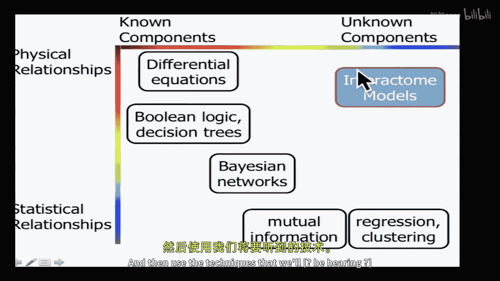

# 016：蛋白质相互作用网络

## 概述

在本节课中，我们将学习如何利用大规模蛋白质相互作用网络数据来推断细胞内的功能模块和信号通路。我们将从回顾基因调控网络推断的挑战开始，探讨为何仅凭基因表达数据不足以准确重建调控网络。接着，我们将介绍因子图模型，这是一种能够整合多种数据类型（如拷贝数变异、转录组数据）并明确建模调控步骤的方法。最后，我们将深入探讨蛋白质相互作用网络的分析方法，包括如何计算网络距离、进行聚类分析，以及如何利用“奖励收集斯坦纳树”等算法从大规模网络中提取与特定实验条件相关的、可解释的子网络。

---

## 从基因调控网络到蛋白质相互作用网络

上一节我们介绍了利用基因表达数据推断基因调控网络的各种方法及其在DREAM挑战赛中的表现。本节中，我们来看看这些方法的局限性，并探讨为何需要引入其他类型的数据。

DREAM挑战赛的结果显示，在合成数据上，各种算法（如贝叶斯网络、回归、互信息）表现尚可。然而，在真实生物数据（如大肠杆菌和酵母）上，所有算法的表现都大幅下降，尤其是在酵母数据上，预测准确率极低。

**核心问题**在于，算法假设转录调控因子自身的表达水平与其靶基因的表达水平高度相关。然而，在真实数据（尤其是酵母）中，这种相关性非常微弱。无论是无关系的基因对、受同一调控因子共调控的基因对，还是直接的调控关系对，它们之间的表达相关性分布几乎重叠。这意味着仅凭mRNA表达水平，很难区分出真实的调控关系。

这引出了一个根本性问题：**mRNA水平是否能准确预测蛋白质水平？** 多项研究表明，两者相关性较弱（R²约0.2-0.4）。这是因为从mRNA到活性蛋白涉及多个受调控的步骤：
*   **翻译速率**
*   **mRNA降解速率**
*   **蛋白质降解速率**
*   **蛋白质翻译后修饰（如磷酸化）激活**

这些过程的速率在不同分子间差异巨大（可达数个数量级），且彼此独立。因此，要准确推断调控网络，必须整合这些多层次的数据，而不是仅仅依赖mRNA表达。

---

## 因子图模型：整合多层次数据

为了解决上述问题，我们需要能够明确建模调控链中各个步骤的模型。Joshua Stuart等人开发的**PARADIGM**模型使用了**因子图**来实现这一目标。

因子图是概率图模型的一种，属于**二分图**，包含两类节点：
*   **变量节点**：代表我们关心的生物实体（如基因拷贝数、mRNA水平、蛋白质水平、蛋白质活性），其取值可以是“激活”、“抑制”或“不变”。
*   **因子节点**：代表变量之间的关系（如转录调控、翻译调控、蛋白质激活、复合物形成）。它们编码了我们对这些生物过程的认知。

**核心思想**是将全局联合概率分布分解为多个局部因子的乘积，每个因子只涉及与其直接相连的变量。这使得我们可以高效地计算**边际概率**，例如在给定拷贝数变异和mRNA表达数据的情况下，推断某个信号通路被激活的概率。

计算过程基于**置信传播**算法，信息以“消息”的形式在图中传递。变量节点将其所有子节点的消息相乘后传递给父节点；因子节点则对其子节点的状态进行汇总（求和）后传递给父节点。通过这种消息传递，可以高效计算出网络中所有节点的边际概率。

在PARADIGM中，先验知识（如已知的信号通路结构）被手动编码为因子图的结构和因子函数。模型参数则通过**期望最大化算法**从数据中学习。这种方法允许我们将拷贝数变异、DNA甲基化、mRNA表达等多种数据整合到一个统一的框架中，并推断出蛋白质活性等无法直接测量的隐藏状态。

---

## 蛋白质相互作用网络的分析方法

当我们的目标不仅是分析已知通路，而是要从大规模数据中发现新的功能模块时，就需要转向**相互作用组网络**分析。这些网络通常基于高通量蛋白质-蛋白质相互作用数据（如酵母双杂交、亲和纯化质谱）构建，节点是蛋白质，边代表相互作用。

以下是分析此类大型网络的几种核心方法：

### 1. 基于网络距离的推断

一个简单的应用是推断激酶与其底物的关系。如果我们知道一个蛋白质被磷酸化的位点序列，可以通过匹配激酶特异性基序来筛选候选激酶。然而，同一个家族的激酶可能具有相似的基序。此时，可以利用蛋白质相互作用网络来进一步筛选：**在序列匹配良好的候选激酶中，那些在相互作用网络中与靶蛋白距离更近的激酶更可能是真正的调控者**。

为了高效计算网络中所有节点对之间的最短路径，我们将网络表示为**邻接矩阵**。如果边带有权重（例如，权重 = -log(该相互作用为真的概率)），那么最短路径就对应于**最大概率路径**。标准的图算法（如Dijkstra算法）可以快速解决这个问题。

### 2. 网络聚类：发现功能模块

我们常常希望发现网络中内部连接紧密、与外部连接相对稀疏的子图（即模块）。以下是两种常用方法：

**边介数聚类**
*   **核心思想**：识别网络中连接不同模块的“桥梁”边。
*   **算法步骤**：
    1.  计算网络中所有边的**边介数**，即所有节点对的最短路径中经过该边的比例。
    2.  移除边介数最高的边。
    3.  重复步骤1和2，直到将网络分解为若干个模块。
*   **直观理解**：连接两个稠密模块的边会有很高的介数，因为两个模块间的大量通信必须经过它。移除这些边就自然分离出了模块。

**马尔可夫聚类**
*   **核心思想**：模拟随机游走过程，游走者更倾向于在模块内部停留，而不易跨越模块边界。
*   **算法步骤**：
    1.  根据邻接矩阵构建随机游走转移概率矩阵（列归一化的邻接矩阵）。
    2.  对矩阵进行**膨胀操作**：将每个元素求指数（如平方），然后重新按列归一化。这个操作会放大强连接，弱化弱连接。
    3.  重复膨胀和归一化步骤，直到矩阵收敛。最终矩阵会呈现出明显的块状结构，每个块对应一个聚类。
*   **优势**：可以处理重叠聚类，且对噪声相对稳健。

**模块功能注释**
找到聚类后，需要为其赋予生物学功能。常用方法是**超几何分布检验**：检验该聚类中富集了哪些已知的功能注释（如GO术语），其富集显著性即代表了该模块可能执行的功能。

### 3. 识别条件特异性活跃子网络

在特定实验条件（如疾病样本）下，我们不仅有关注网络拓扑结构，还拥有节点层面的实验数据（如差异表达基因、磷酸化蛋白质）。目标是找到一个**连贯的子网络**，它既包含许多实验上调或下调的节点，又符合相互作用网络的连接约束。

简单连接所有实验命中节点会导致巨大的、难以解释的“毛球”网络。**奖励收集斯坦纳树**方法可以解决这个问题：
*   **问题定义**：将实验命中节点设为“终端”，并为每个终端赋予一个**奖励**（奖励大小与置信度成正比）。网络中的每条边有一个**成本**（成本与相互作用置信度成反比）。
*   **优化目标**：寻找一个连接终端节点的子树，使得 **（收集的终端奖励总和 - 使用的边成本总和）** 最大化。
*   **效果**：算法会自动权衡。连接一个置信度低（奖励小）但距离远（成本高）的终端可能不划算，从而将其排除在最终子网络外。这样就能得到一个紧凑、高置信度且与实验数据相关的子网络。

这种方法能将包含数千条边的杂乱网络浓缩成几十个节点、功能清晰（如“DNA损伤”、“细胞周期”）的子网络，并提示出新的候选基因（斯坦纳节点），便于后续实验验证。

---

## 整合多组学数据

蛋白质相互作用网络的一个关键优势是提供了整合不同组学数据的框架。例如，转录组数据与蛋白质组数据相关性弱，遗传筛选命中基因与差异表达基因也大相径庭。
*   **遗传筛选**倾向于发现**主调控因子**（如DNA损伤传感器），它们本身表达量变化不大，但功能缺失影响巨大。
*   **差异表达**倾向于发现**效应分子**（如DNA修复酶），它们表达变化显著，但由于功能冗余，单个基因敲除可能表型不明显。

尽管不同数据层面给出的信号不同，但它们都源于相同的底层生物学过程。通过相互作用网络，我们可以将转录因子（从表观基因组数据推断）、信号蛋白（从磷酸化数据获得）、差异表达基因和遗传筛选命中基因连接起来，重建出完整的信号传导与调控通路。

---

## 总结

本节课中我们一起学习了：
1.  **基因表达数据的局限性**：仅凭mRNA水平难以准确推断基因调控网络，因为mRNA与蛋白质水平相关性弱，且涉及多步受调控的过程。
2.  **因子图模型**：通过明确建模调控链中的各个步骤（转录、翻译、激活），并整合拷贝数、甲基化、表达等多类数据，可以更可靠地推断信号通路活性。
3.  **蛋白质相互作用网络分析**：
    *   利用**网络距离**可以辅助推断具体的调控关系（如激酶-底物对）。
    *   **边介数聚类**和**马尔可夫聚类**能发现网络中固有的拓扑模块。
    *   **奖励收集斯坦纳树**算法能从全局相互作用网络中，提取出与特定实验条件相关的、紧凑且功能可解释的活跃子网络。
4.  **多组学数据整合**：蛋白质相互作用网络是整合转录组、蛋白质组、遗传学等多维度数据的理想框架，有助于还原完整的生物学过程，并发现新的调控关系和候选靶点。

这些从大规模、无偏数据中构建可解释网络模型的方法，为我们理解复杂生物系统、识别疾病机制和发现潜在治疗靶点提供了强大的工具。