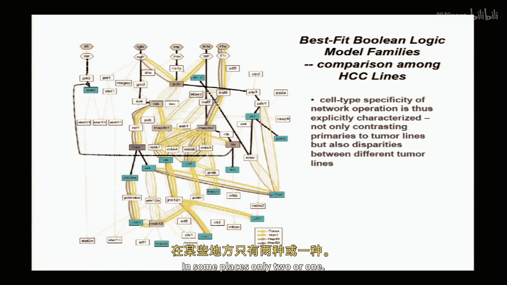

# 017：细胞信号网络的逻辑建模 🧬

以下内容基于知识共享许可协议提供。您的支持将帮助麻省理工开放课件继续免费提供高质量教育资源。如需捐款或查看来自数百门麻省理工课程的更多材料，请访问 [MIT OpenCourseWare](http://ocw.mit.edu)。

在本节课中，我们将学习如何将细胞信号网络转化为可计算、可预测的逻辑模型。我们将从概念背景入手，然后深入一个具体的研究案例，展示如何将先验知识图谱与实验数据结合，构建出能够解释和预测细胞行为的逻辑模型。

## 概述：从隐喻到可计算模型

在哺乳动物细胞生物学中，细胞的行为（表型响应）由其感知的环境信号（如生长因子、激素、细胞外基质）所控制。这些信号通过细胞表面受体激活复杂的生化信号通路，最终调控基因表达、代谢、细胞骨架等执行过程，从而决定细胞表型。

随着基因组测序的普及，我们发现即使是同一种癌症，不同患者的肿瘤也拥有大量不同的基因突变。然而，这些看似不同的突变往往汇聚在相同的信号通路或功能模块上。这表明，在蛋白质水平的信号通路层面理解细胞功能，是整合和理解基因组数据的关键。

人们常将信号网络比作“电路板”，这是一个吸引人的隐喻，但它本身无法进行计算或预测。本节课的目标，就是介绍如何将这种隐喻转化为**可操作的、可计算的逻辑模型**。

## 建模方法：理论驱动与数据驱动

在计算建模领域，主要有两类方法：
1.  **理论驱动建模**：基于先验知识（如已知的生化反应机制）建立微分方程等数学模型。这需要详细的机制知识和速率常数，对于复杂的信号网络通常难以实现。
2.  **数据驱动建模**：从大规模数据集中通过统计、聚类、回归等方法寻找关联和模式，无需详细的先验理论。

**逻辑建模**的吸引力在于，它可以灵活地应用于这两种模式。我们可以从先验知识图谱出发构建逻辑模型（理论驱动），也可以直接从实验数据中推断逻辑关系（数据驱动），并能在两者之间迭代优化。

## 先验知识：信号通路数据库的挑战

构建模型的起点通常是已有的知识。目前存在许多信号通路和蛋白质相互作用数据库（如 KEGG、Reactome、Ingenuity）。这些数据库基于文献整理，描述了分子间的上下游关系或物理相互作用。

然而，这些数据库存在挑战：
*   **不一致性**：不同数据库包含的节点和相互作用重叠度很低，缺乏共识。
*   **缺乏上下文**：数据库信息通常来自不同细胞类型、物种或实验条件，可能不适用于特定研究背景。
*   **无法计算**：仅凭图谱无法进行计算或预测。虽然有人尝试用图论特征（如节点连接度）预测重要性，但其生物学有效性证据尚不充分。

因此，我们的策略是：**将这些数据库信息作为初始“脚手架”，然后通过映射到特定背景下的实验数据，将其转化为可计算的逻辑模型。**

## 核心方法：构建布尔逻辑模型 🧮

我们的目标是将描述性的信号网络图（例如，“A和B激活E，B抑制F”）转化为形式化的、可计算的逻辑语句。

**布尔逻辑模型** 是常用的框架。在这个框架中，每个信号分子被视为一个节点，其状态被简化为 **“开”（1，激活）** 或 **“关”（0，非激活）**。分子间的相互作用被转化为逻辑门，例如：
*   **与门（AND）**：`E = A AND B` （A和B同时激活，E才激活）
*   **或门（OR）**：`F = C OR D` （C或D任一激活，F即激活）
*   **非门（NOT）**：`G = NOT H` （H激活会抑制G）

通过为网络中的每个节点定义其输入节点的逻辑规则，我们就得到了一个可以计算的布尔网络模型。

## 案例研究：肝癌细胞信号逻辑建模

接下来，我们通过一个具体研究案例来演示整个过程。该研究旨在比较正常肝细胞和几种肝癌细胞系的信号网络逻辑差异。

### 实验数据

研究测量了5种细胞类型（4种肝癌细胞系和1种原代正常肝细胞）在以下处理下的响应：
*   **7种细胞外刺激**：包括生长因子、细胞因子等。
*   **7种小分子抑制剂**：针对特定的激酶或通路。
*   **多个时间点**：如0、30分钟、3小时。
测量指标是**17种关键信号蛋白的磷酸化水平**，这反映了它们的活性状态。数据被归一化并可视化为热图，可以直观看出不同细胞类型对相同处理的响应模式存在显著差异。

### 建模流程

以下是构建逻辑模型的具体步骤：

1.  **获取先验图谱**：从Ingenuity等数据库获取信号网络的初始图谱，包含约82个节点和100多个相互作用边。这构成了模型的“脚手架”。
2.  **定义模型空间**：基于脚手架，考虑所有可能的逻辑门（AND, OR, NOT）组合，这会生成海量的潜在模型。
3.  **拟合与优化**：使用**遗传算法**搜索能最好拟合实验数据的模型。
    *   **初始化**：从脚手架衍生出一组随机变异的模型（种群）。
    *   **评估**：用**目标函数**评估每个模型的质量。目标函数权衡两个因素：
        *   **拟合误差**：模型预测的0/1状态与实验测量值（0到1之间的连续值）之间的差异。
        *   **模型复杂度**：模型包含的节点和边的数量，通过一个惩罚参数 `α` 来约束，防止模型过度复杂。
        公式可以简化为：`θ = 拟合误差 + α * 模型大小`
    *   **进化**：选择表现最好的模型（“精英”），通过“突变”（随机增减边/修改逻辑）和“交叉”（组合不同模型的边）产生新一代模型种群。
    *   **迭代**：重复评估和进化过程，直到获得一组拟合良好且稳定的模型。
4.  **生成共识模型**：由于数据噪声和模型等效性，通常不存在单一的“最佳”模型。我们会得到**一个模型家族**，然后从中提取**共识模型**。共识模型中边的粗细代表该边在模型家族中出现的频率，即共识强度。

### 结果与验证

*   **模型性能提升**：仅使用原始数据库图谱拟合的模型误差很高（~45%）。经过上述流程优化后，得到的共识模型能将误差降低到10%以下。
*   **模型预测**：使用训练好的模型去预测一个全新的数据集（包含新的刺激组合和抑制剂组合），预测误差约为11%，与训练误差接近，验证了模型的预测能力。
*   **生物学发现**：比较正常肝细胞和肝癌细胞的共识模型，可以识别出信号逻辑存在差异的边。这些差异通常对应着文献中已报道的癌症相关通路改变，例如胰岛素信号从代谢向增殖转变、NF-κB通路调控变宽松等。模型还意外地帮助发现了一个小分子抑制剂的脱靶效应。

### 从布尔模型到模糊逻辑模型

布尔模型的优点是简洁，但缺点是将连续的生物学数据强行二分。一个改进方向是使用**模糊逻辑模型**。

在模糊逻辑中，我们将布尔模型中的阶跃函数替换为更平滑的**S型转移函数**。这为每个逻辑门引入了额外的参数（如阈值和斜率），使模型能够处理更定量的输入和输出，做出“激活程度强弱”的预测。当然，这需要更多的数据来拟合增加的参数。

## 总结

本节课我们一起学习了细胞信号网络逻辑建模的核心方法。我们了解到：
1.  可以将基于数据库的先验知识作为起点，通过整合特定背景下的实验数据，构建出可计算的布尔逻辑模型。
2.  使用遗传算法等优化方法，可以从大量可能模型中筛选出能很好拟合和预测数据的一个模型家族。
3.  通过比较不同生理状态（如正常 vs 癌变）下的共识模型，可以识别出关键的信号逻辑差异，这些差异可能与基因突变相关联，并为药物靶点发现提供线索。
4.  逻辑建模框架可以进一步扩展为模糊逻辑，以更好地捕捉生物信号的定量特性。

这种方法将信号网络的“电路”隐喻转化为了一个强大的、可计算、可预测的分析工具，帮助我们在系统层面理解细胞如何解读环境信号并做出命运决策。