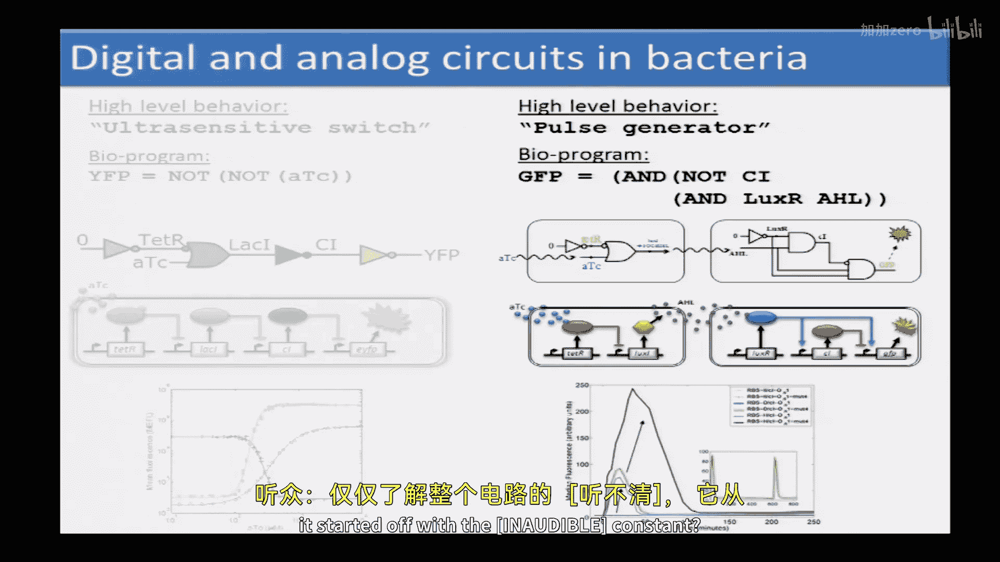
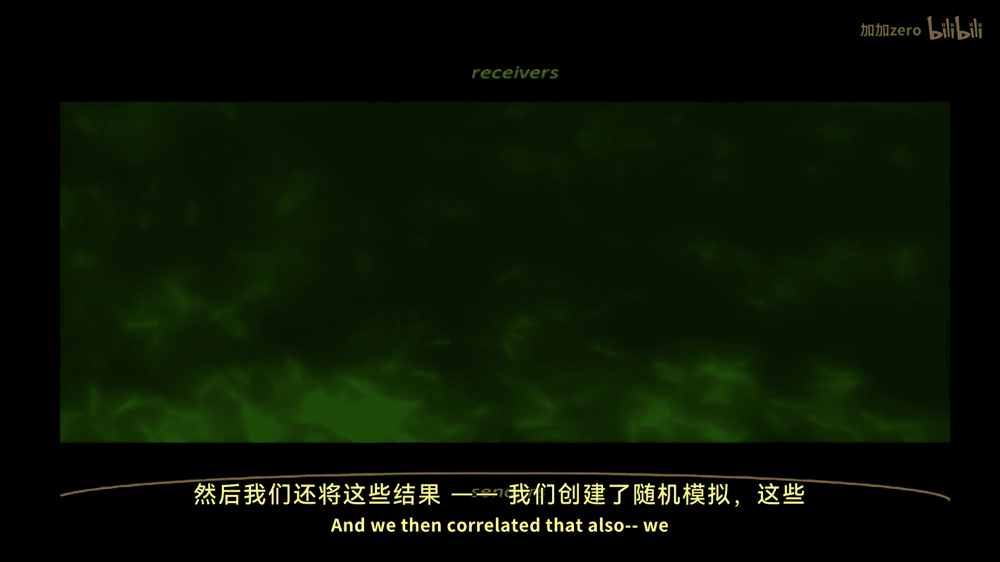

# 021：从部件到模块再到治疗系统 🧬

以下内容基于知识共享许可协议提供。您的支持将帮助麻省理工学院开放式课件继续免费提供高质量的教育资源。如需捐款或查看来自数百门麻省理工学院课程的更多材料，请访问 OCW.MIT.EDU。

欢迎回到计算与系统生物学课程。今天我们很荣幸邀请到 Brian Weiss 教授。正如我在周二提到的，他将为我们讲解合成生物学。Ron 教授来自生物工程系和电气工程与计算机科学系，同时也是合成生物学中心的创始成员之一。

感谢邀请我来到这里。David 教授在我刚来麻省理工读研究生时曾是我的导师。那时我从事数字视频和信息检索的研究，而他们开始涉足生物学领域。那是在90年代初，我觉得这很酷，但也很混乱。我当时想，如何用这些分子进行工程化设计呢？答案是，它确实可行。从一个怀疑者到最终决定投身于此，大约在1996年左右，我决定转向这个领域。

当时，我正在研究如何利用我们对生物学的理解来理解如何编程计算机，特别是在拥有大量计算元件的情况下，比如智能尘埃或非晶态计算。我认为生物学可以作为一个巨大的灵感来源，因为它拥有数百万甚至数十亿个计算能力不强但能进行局部交互并执行稳健操作的小元件。我进行了一系列模拟，例如胚胎发生过程，试图理解生物学中的现象，并思考是否能用它来编程计算机或微型计算机。

有一天，我决定翻转这个思路。与其试图用生物学来理解如何编程计算机，不如用我所知的计算机知识来尝试编程生物学。这个领域现在基本上被称为合成生物学。我从事这个领域大约有18年了，过程充满乐趣，也并非易事，但我想我们至少开始取得了一些进展。我将尝试介绍我们在这方面的一些努力，并鼓励大家随时提问。

当我看到生物学系统时，作为一名工程师，我感到兴奋。我在想，如果能像编程计算机一样编程这样的系统，那该有多酷。这种直接的基因工程概念，即创造新的DNA，自70年代以来就已存在。这使我们能够创造控制细胞行为的各种机制，例如转录调控、翻译调控、遗传编码传感器、细胞间通讯机制、合成各种有趣的分子（如生物燃料、药物）以及控制物理特性。

但如果你问我合成生物学有何不同，我会说它强调的是系统层面的工程。我们不仅仅是试图过度表达这个或那个基因，而是真正试图理解如何创建相互作用的系统。正如系统生物学强调不能仅通过了解某个特定基因的确切功能来理解细胞，而必须将其置于整个生物体的通路和背景下思考一样，当我们希望细胞执行有趣的任务时，也必须将系统视为一个整体。为了获得所需的复杂性，我们需要理解如何以可靠、可预测、高效的方式连接这些调控元件和其他元件，使细胞能像计算机一样可编程。这就是我对合成生物学的定义。

那么，我们如何从中发展出一门工程学科呢？关键在于，我们能否让本科生选修合成生物学101课程，使其成为一套定义明确、可靠的方法和实践体系。我们经常尝试从其他工程复杂系统的学科中汲取灵感，例如计算或机器人学，它们有自底向上组装的概念。你从基本设备开始，思考如何创建具有特定行为的模块，然后将这些模块集成以创建自主实体，如机器人，并进一步创建相互作用的机器人社区。这种方法在其他工程学科中运行良好，因此我们经常问，能否将这些机制引入生物学世界？我们能否采用基本的调控机制（可能是转录调控，也可能是其他模式），将它们连接起来创建可定制的通路，然后将其嵌入细胞，从而创建可编程的细菌群落或可编程的哺乳动物细胞组织？问题是，这是一种有用且高效的方法吗？例如，这些方法有何异同？我们可以从中借鉴什么来推动生物学领域的发展？

在我开始研究合成生物学时，我的大部分精力都集中在适应和实施这些概念上。但随着时间推移，我们开始越来越多地理解和欣赏细胞，我们也对这些概念的不同之处非常感兴趣。是什么使工程化生物系统成为一个真正独特的新工程学科？在生物学领域，你会做哪些与计算机、机器人、建造桥梁、汽车等不同的事情？这已成为我实验室乃至整个社区越来越重要的焦点，尽管尚未普及。你经常会看到来自其他学科的人认为，我们可以像编程计算机一样编程生物学，但事实并非如此简单。

当我们处理编程细胞的任务时，通常将其划分为传感器、处理和驱动模块。例如，我们希望开发能够检测活细胞中 microRNA、信使RNA、蛋白质水平的传感器，然后将它们连接到我们嵌入细胞的合成调控电路中。重要的是，这些传感器不仅能提供荧光读数，还能连接到我们设想的调控网络。这样，这些调控网络就可以整合多条信息并做出驱动决策。例如，如何开启特定的效应蛋白，从而以可编程的方式影响该特定细胞甚至环境，这由特定传感器的水平以及其他机制（例如细胞自身处理的历史信息）决定。这代表了合成生物学中大多数工作的范式。

我们为什么要这样做？不是为了编程下一个版本的 iOS 或 iPhone，尽管最初讨论过这一点，也不仅仅是为了计算本身，而是为了特定的应用。例如，如果我们的逻辑门运行速度很慢，以小时甚至天为单位，那可能没问题，如果应用是组织工程。在合成生物学中，最初的焦点主要集中在微生物群落或个体上，例如用于合成高价值化合物、生物能源、环境应用等。但过去几年，人们对健康相关应用的兴趣日益增长。我的实验室主要关注健康相关应用，今天我将给出一些例子，包括癌症、糖尿病和组织设计。

为了实现这种可编程性，我们需要考虑规模。我们需要考虑需要多少 DNA 来完成某项任务。这在很大程度上决定了系统的复杂性，是定义我们工作的重要元素。我们能够可靠、快速、高效、可预测、高通量且低成本地工程化的 DNA 规模，决定了我们能做什么。我们通常从基因级别开始。我认为，过度表达单个基因或可诱导表达几个基因，这不算合成生物学。当我们在特定背景下嵌入原本不存在的相互作用，即构建电路时，合成生物学才变得有趣。大多数合成生物学工作都处于这个规模，大约在这个范围内，现在正试图超越这个范围，例如创建 20,000 到 50,000 个碱基的 DNA。问题是，一个研究生能否在实验室里设计一个需要 20,000 到 50,000 个碱基的东西？这是否合理？然后问题是，这能为你提供什么样的能力，你能用它做什么？除此之外，人们还探索了最小生命和全基因组重写的概念。目前，这被一些人归入合成生物学，这没问题。但目前我们还没有真正好的方法能够从头开始或以根本不同的方式工程化最小生命。大多数关于最小生命的工作是，取一个生物体，尝试找出要敲除什么，而不是说我要从头开始设计这个新的最小生物体，定义要放入哪些反应，并创建一堆以前从未存在过的新反应。未来我们能做到吗？希望可以，但目前还不行。

目前真正活跃的领域是这里。推动这一发展的动力之一是 DNA 合成的成本越来越低。我们在 DNA 合成成本方面遵循着某种摩尔定律。这是使能技术之一，虽然不是唯一的，但却是最重要的使能技术之一，即订购越来越长的 DNA 序列的成本越来越低。例如，将来你能够设计一个 20,000 到 50,000 个碱基的东西，直接在线订购，并且你的导师愿意为此付费。虽然目前还达不到 20,000 到 50,000 个碱基的水平，但这将会改变，最终会变得对所有人都可用。我认为这将从根本上改变我们在生物工程领域的工作方式，甚至改变整个生物学领域的几乎所有工作方式。即使你不关心工程化新的生物功能，只想理解生物系统，如果你的导师告诉你，设计一大堆电路，让你能够以任意方式调控事物，以了解控制自然系统的底层网络，我认为这也将从根本上改变你提出的问题类型。

我将讨论基本设计、可扩展性，以及我们最近正在做的一些事情。我们正在构建这个基础，并认为这个基础可以产生影响，改变我们处理那些目前没有最佳解决方案的问题的方式，例如癌症、芯片上的组织设计以及糖尿病等。

我们从部件开始。我们所做的一切几乎都始于定义工具箱中可用的基本部件。这些包括转录调控部件、翻译水平部件以及蛋白质-蛋白质相互作用水平部件。我们经常（但不总是）工程化细胞间相互作用，可以通过细胞间通讯实现。我们通常想知道细胞内部发生了什么，就像我们创建新软件、新计算机程序时，有调试输出来告诉我们程序在做什么一样。我们通常使用荧光蛋白或染料来实现这一点，它们告诉我们你的电路或细胞的行为如何。另一组部件是用于在细胞内创建传感器和驱动器的部件，用于检测特定生物标志物水平，或影响细胞行为。例如，一个常用的驱动器是杀死细胞。另一个可能是告诉干细胞分化为不同的细胞类型。还有一个可能是让细胞制造某种高价值化合物。目前，如果你在寻找部件，它们实际上直到大约两年前还存放在 Stata 中心。我不知道有多少人知道 iGEM。iGEM 始于麻省理工学院，总部曾设在 Stata 中心，那里有几个大冰柜，存放着合成生物学人员常用的 5000 到 10000 个部件。现在它们搬到了剑桥酿酒公司附近，不再直接隶属于麻省理工学院，拥有大约 15000 个可用部件。如果你想开始合成生物学研究，这是一个快速的方法。你可以联系 iGEM 总部，索要 1000 个部件。只要你是可信的，并且不是来自那些被列入黑名单的国家，他们通常会寄给你。这是一个好的开始。

这些部件是什么？这实际上要回溯到我的博士研究。这是我表征的一个部件：数字逻辑反相器。我假设这里每个人都熟悉逻辑门。这是一个单输入单输出设备，处理二进制值，基本上是对信号取反。输入为 0，输出为 1；输入为 1，输出为 0。在生物系统中实现这一点的一种方法是使用转录抑制。如果没有阻遏蛋白存在，输出蛋白水平就高；如果有阻遏蛋白存在，就会抑制输出蛋白的产生。理论上，这可以用作数字逻辑门。这看起来很简单，但在我读博士时，做这样的事情花了我大约三年时间。现在快多了，一天之内就可以做很多个。这是另一个我在博士期间使用的逻辑门。这不仅仅是一个阻遏蛋白，还是一个可以被小分子失活的阻遏蛋白。其工作原理是，这个阻遏蛋白像以前一样工作，但如果小分子进入，它会阻止阻遏蛋白与启动子结合。结果，即使阻遏蛋白存在，输出蛋白也能被激活。这被称为“非A非X或Y”或实现了蕴含逻辑函数。这不是常用的逻辑函数，在典型的计算机中没有实现蕴含逻辑函数的逻辑门，但这是我们在细胞中可以实现的、允许外部控制基因表达的有用逻辑函数。一旦你能做到这一点，作为用户，你基本上可以与细胞互动并修改细胞内部的情况。

逻辑门之后，我们能构建逻辑电路吗？我认为整个生物学的复杂性从这里开始显现。这是我们构建的第一个逻辑电路之一。问题是，在生物学中有这种逻辑门表示看起来不错，但这真的有意义吗？你能在细胞内部真正进行数字逻辑运算吗？你能利用嘈杂的生物组件实现可靠的计算吗？这并不明显。在某些情况下，我们现在可以声称能够构建相当可靠的数字逻辑。在这个特定案例中，我展示的是这个蕴含逻辑函数，它允许我们通过小分子诱导一系列逻辑非门或转录阻遏蛋白的级联。这里的一个优点是，随着电路从蓝色变为黑色再到这里的黄色，随着级联变长，它实际上变得更加数字化，更像阶跃函数。现在，输入发生 2 到 4 倍变化时，输出有超过 1000 倍的变化。我们具有良好的噪声容限和信号恢复能力，这些都是创建更大、更可靠的数字电路所需的好特性。

数字计算的基础是，你能创建计算机的原因在于，你拥有能够进行信号恢复的逻辑门。输出是数字含义的更好表示。因此，当信号（可能是电压，也可能是蛋白质浓度）通过逻辑门传播时，它需要变得更“干净”，以便我们能够进行可靠的数字计算。人们在很久以前就弄清楚了如何在电子学中做到这一点，我们在合成生物学中大约在 10 到 15 年前弄清楚了，而大自然在数十亿年前就弄清楚了。例如，协同性。我假设你们已经了解了一些关于基因调控中的协同性。这是一种在系统中产生非线性响应的情况。生物学已经发现这是一种有用的机制，使得输入的信号实际上导致某种数字行为。你在这些调控元件中获得非线性信号处理。在信号转导级联的末端，输出要么高要么低，几乎没有中间状态，高低之间的转换非常快。从某种意义上说，这产生了数字或离散的输出。这对于许多情况至关重要，不仅在合成生物学中，在生物学中也是如此。一个例子是干细胞分化。你希望细胞能够做出离散的决定，例如，是成为肾细胞、肝细胞还是肌肉细胞。因此，细胞或大自然已经提出了保证这一点的机制。我们现在也学会了如何以合成的方式做到这一点。

需要注意的是，当我们工程化这些系统时，我们不仅仅考虑数字行为。我们可能花费同等的时间思考如何实现具有瞬态特性或更类似模拟行为的系统。这对于编程细胞执行我们想要的任何任务绝对至关重要。这是一个我们工程化细胞间通讯的例子，其中发送细胞产生小的可扩散分子，然后传递给接收细胞。现在，接收细胞不仅有一个开启响应，而是有一个脉冲响应。我们工程化它们使其具有脉冲响应，即绿色荧光蛋白先上升后下降。为了实现这一点，我们工程化了一个前馈基序，其中小分子与这个激活子结合，同时激活绿色荧光蛋白和一个阻遏蛋白，然后阻遏蛋白抑制绿色荧光蛋白。这样，绿色荧光蛋白先上升，最终阻遏蛋白积累到足够水平来抑制绿色荧光蛋白。这又是一个看起来简单的基序。在 2004 年左右，实现这个大约花了三年时间。如果你研究一个具有这种基序的自然系统，你会说，哦，没问题，我们有这个前馈基序，显然你可以做这种信息处理功能。但如果你尝试在实验室中在新的生物体中构建它，你会发现这并不简单。现在比 10 年前容易多了，但你仍然需要注意很多细节，比如速率常数、阈值匹配等，才能真正使其工作。

最终，经过尝试，这是我们的第一次尝试，就是这条蓝线。输入进来，什么都没发生。我想说，这基本上代表了直到今天的合成生物学：你构建了某个东西，认为它会工作，但它没有。然后，过一会儿你停止哭泣，但必须思考如何修复它。因此，迭代设计、调试周期绝对至关重要。你通常做的是创建计算模型，告诉你系统中不同的速率常数如何影响电路的行为。例如，你可以进行敏感性分析，了解哪些速率常数对系统性能影响最大。我们在这里做了一些敏感性分析，了解到例如这个阻遏蛋白的降解速率或其与各自启动子上结合位点的亲和力，是对系统性能影响最大的速率常数之一。

有人可能会问，我们能否预测这些速率常数？我希望可以，因为那会让事情容易得多。我们正在努力做得更好。一种挑战是，有人给你一个 DNA 序列，你必须预测其速率常数。我会称这个人为对手，而不是朋友。目前这太难了。一个更简单的任务是，给你的对手或朋友有限的选择，并说在冰柜里，我有这些由特定启动子、特定核糖体结合位点、带有特定降解标签的特定蛋白质组成的 DNA 序列。你只允许他们使用这些元素来设计电路。然后他们回来找你，让你预测电路会做什么。这仍然不完美，但我想这就是我们提出挑战的方式：坚持使用我们已知的东西，甚至提前表征这些东西。不幸的是，我这里没有，但人们可以得到一个大概的表征，比如输入输出行为大致如此。当我说“大致”时，误差可能在 5 到 10 倍左右。根据已发表的结果，目前大约是这个水平。5 到 10 倍的误差，取决于你的视角，可能很棒（因为这是生物学），也可能很糟糕（如果你是工程师）。如果你试图在培养皿中让绿色荧光蛋白开关，10 倍可能很棒。但如果你试图创建一个放入人体、用于杀死癌细胞但不伤害健康细胞的癌症分类电路，10 倍可能就不太好了。我肯定不会把这样的电路放进自己体内，尤其是当它控制着某种杀伤蛋白的产生时。我们最近（正在提交一篇论文）已经能够证明，如果你对这些调控元件（如这些阻遏蛋白设备）有非常好的表征，并且做了更多的表征工作，我们可以在哺乳动物细胞中平均在 20% 的误差范围内预测行为。作为一名工程师，对于许多应用来说，我对 10-20% 的误差感到满意。所以我认为我们在这方面做得更好了，但还不完美。

这种方法的一个方面是，我们不一定知道所有东西的速率常数。然而，我们确实知道阻遏蛋白-启动子对的非常详细的行为，包括稳态和动态行为。例如，我们不知道阻遏蛋白与启动子结合的亲和力或速率常数，不知道 RNA 聚合酶与该启动子结合的速率常数，也不知道确切的翻译或转录速率。但我们知道输入输出行为是什么。这实际上足以获得非常好的预测。我想说，这类预测是合成生物学最重要、最具挑战性的瓶颈之一。这些挑战包括：你能多快地构建 DNA？但如果你能预测 DNA 的作用，那该多好？这同样重要，甚至更重要。另一个挑战是：如果你能预测，你的冰柜里有多少部件可以组合在一起，并且它们被充分表征，可以实际构建电路？这可能是三个最重要的挑战。

回到我们所说的脉冲发生器，这是一盘细菌的延时摄影，其中发送细胞分泌小分子传递给接收细胞，接收细胞发光。这里要注意的一点是，它确实工作了。另一点是，它并不完美。这里的异质性程度相当惊人。如果我们看平均行为，它实际上是相当可预测的。但如果我们开始观察响应的分布，那是惊人的。我们量化了这一点，量化了荧光水平、峰值以及上升过程的分布。然后我们创建了随机模拟，与系统有合理的相关性，因此我们可以在群体水平上获得与我们所见大致对应的模拟。

现在，我想提出的一点是，当你思考工程化生物系统时，不要试图弄清楚如何工程化单个细胞可靠地做某事。你总是要考虑统计工程。你要考虑的是，我将创建一个电路，当我将这个电路放入一个细胞群体时，我将得到这样的行为分布。因为如果你试图依赖任何单个细胞给你你想要的确切行为，那将会失败。所以你必须真正考虑分布，而不是单个细胞。我认为这改变了一些事情。这通常不是我们思考编程的方式，也许微软思考编程的方式是这样的：如果 90% 的时间计算机不崩溃，那就很好。但这不是我们通常对软件的要求。

为了进一步从群体角度思考这个问题，我们编程了另一个东西：模式形成。现在我们希望创建发送者和接收者，其中发送者向接收者发送相同的信息，现在我们有一个更长的前馈基序。这个前馈基序有两个分支。这两个分支对最终输出有不同的影响。一个有两个阻遏蛋白，意味着输入进来，它激活一个荧光蛋白，另一个则抑制该荧光蛋白。这是一个非相干前馈基序。我们在这里使用它不是为了脉冲生成，而是为了定义一个浓度范围，该范围将开启最终输出。它将在低阈值时被激活，在高阈值时被抑制。因此，我们对输入有一个非单调响应：低、高、然后低。这就是我们设想的设计。想法是，如果你将接收细胞放在培养皿各处，将发送细胞放在中间，那么通讯信号会逐渐建立，形成一个化学梯度。每个细胞解读化学梯度，然后决定是否制造荧光蛋白。由于信号扩散和衰减形成的稳定化学梯度，你会得到某种带状图案。这至少是我们的希望。

为了给你一个时间尺度：我大约在飞机上花了三个小时制作幻灯片，花了大约三周时间创建计算模型，而构建实际的功能电路又花了大约三年时间。我们创建了这个计算模型，实际上使用计算模型来预测速率常数的变化如何影响带状检测区域，即对信号响应的区域，并利用这一点来工程化不同的响应。我们最终创建了三种不同的响应（输入 vs. 输出），并在其上放置了不同的荧光蛋白（红色和绿色）。这是实验设置，等待 16 小时后，我们得到了这个结果。我们让很多细菌形成了各种图案。我们对此非常高兴，在实验室里跳了一会儿舞。在那些罕见的事情实际奏效的时刻，这很有趣。然后我们说，再找点乐子。我们把发送细胞放在其他配置中，于是我们得到了可编程的细菌群落图案。

我不确定这本身是否有用，除了好玩。但我们现在正在将其用于一件事（如果时间允许，我稍后可能会讲到），就是将这类电路嵌入哺乳动物干细胞或人类诱导多能干细胞中，工程化这些细胞使其相互通讯、做出决策，然后这些决策导致分化模式。原则上，如果你能创建这些的三维版本，并用它们促使细胞做出分化决定，那么红色可能意味着制造神经元，绿色意味着制造肌肉，黄色意味着制造骨骼等等。原则上，你可能能够按设计创建组织。这是我们实验室目前正在积极研究的事情。我们还没有在培养皿中培育出功能完整的心脏，短期内也不会，但我们正在一步步前进。我们已经能够让细胞间通讯工作，已经能够让程序化的干细胞分化工作。希望我能给你们展示一些我们最近的图像，我们利用人类诱导多能干细胞创建了这些胚胎肝芽，其中包含许多有趣的、已知存在于胚胎肝脏中的所有细胞类型。所以，这方面有一些进展。我们预计不会很快替换你的肝脏，所以先别急着毁掉它。

但一个近期的具体应用可能是：想象一下，取你自己的成纤维细胞，将其去分化为人类诱导多能干细胞，然后将它们分化为类似肝脏的环境，放入培养皿，然后测试药物对你的微型肝脏的影响。也许在类似于人体组织的系统上测试药物是个好主意，而不是在某些可能与药物对人体细胞的实际作用相关性不强的随机小鼠身上测试。如果我们甚至以患者特异性的方式进行，我认为这将真正改变药物开发的方式。我认为这在未来几年内可能成为现实，在实验室环境中，未来一到三年内开始这样做。我认为这是近期且现实的。

我们注意到的一件事是，当我们工程化这些小系统时，直觉相当有效。我可以看着这个电路设计说，如果我修改这里，会发生什么；如果我修改那里，会发生什么。你可以使用直觉，而且效果相当好。在合成生物学的前 8 到 10 年，几乎每篇论文都有一个计算设计，但大多数情况是，我们构建了某个东西，为了发表，我们附加了一个与实验结果高度相关的计算模型。我们和其他人一样有这种“罪过”。拥有计算模型对于在实验室成功创建某些东西并不是至关重要的。但我认为这种情况正在改变。

我们现在有一些设计的例子（我不确定今天是否会讲到，但我们已经发表了相关论文），其中涉及大约 20 到 25 个组件，与我们试图工程化的一个糖尿病系统相关。对于这样的系统，我们可能有一些直觉，但直觉不再那么有效了。计算分析可能会突然提供仅通过在黑板上画图难以获得的洞察。因此，我认为计算设计工具正变得绝对必要，它们可以提供仅凭直觉无法获得的系统行为洞察。

计算设计的另一个方面是，想象一下能够指定某种行为，然后计算设计工具告诉你应该构建和测试的 1000 种不同版本的电路。对于人类来说，轻松生成 1000 种不同版本的电路来构建和测试仍然很困难。但构建它们正变得容易（也许“容易”这个词有点强，但“可行”）。我举一个最近的例子：在我的实验室里，一位研究生提出了一个框架，他能在三小时内生成 200 个版本的电路，而且它们基本上都正确。所以，我认为这真正改变了你在合成生物学中的工作方式。因此，将其与告诉你应该构建哪些电路的计算设计工具连接起来将非常有用。

具体来说，认识到这一点，我们与 BBN 的一些人以及我以前的博士生同事 Jake Beal（现在在波士顿大学的 Doug Densmore）合作。这里的想法是，我们希望合成生物学看起来像这样：如果你想编程生物学，你真的需要关心 lambda 阻遏蛋白的核糖体结合位点是什么吗？希望不需要。就像你在 Matlab 中编程模拟时，你不会考虑英特尔奔腾芯片中的移位寄存器如何工作来模拟这个 ODE 一样。那不是你编程的层次。你应该在高层思考，然后有编译器和大量基础设施处理中间的一切。也许在未来 5 到 10 年，研究生们回顾现在的合成生物学研究生时，会非常同情他们：天哪，你们居然需要知道电路中使用的元件并手动构建它们。所以，这里的想法是，我们从高层描述开始。顺便说一下，现在有一个网站，你可以免费注册，输入一个高层程序，它会自动创建一个低层基因电路表示，并给你这个的 Matlab 模拟文件。在我现在教本科生的一门课程中，许多学生在课程开始前甚至没拿过移液器，我们教他们的第一件事就是这个工具。在告诉他们 lac 阻遏蛋白通过 DNA 成环工作之前，我们说，有这些叫做阻遏蛋白的东西，当它们越多时，输出越少。现在让我们用这个来设计。我认为这对整个生物学来说是异端邪说。我不知道这是否是我们第一次尝试这样做，但我想效果还不错。同时，我们也教他们足够的底层生物学和机制知识。但如果他们只知道有转录阻遏蛋白这种东西，然后生物编译器会处理所有需要发生的事情，他们能做什么呢？实际上，他们做了很多设计。从下周开始，我们将进行测试。我们会发现这是否是教授生物工程的有用方式。但我认为是，因为他们似乎理解了设计意味着什么。我们把设计作为首要对象来关注。

你写看起来像这样的代码。有人写过这样的代码吗？这是 Lisp 语言。通常只有一两个人，但我希望这里更多。对于不熟悉 Lisp 编程的人，这是一个简单的程序：如果输入高，产生绿色荧光蛋白，否则产生黄色荧光蛋白。然后，生物编译器自动将其首先转换为数据流图，然后创建抽象基因电路，接着查看你冰柜里有什么，并说，这是实现这个功能所需的实际 DNA 序列。然后它创建机器人指令来组装这个，这样你就不必碰移液器来构建它了。我们有一个液体处理机器人来完成大部分组装工作。现在这个流程还没有完全端到端实现。如果你现在来我的实验室，我可以说它有效，但可能有点夸大。它大部分有效。但现在有一些公司，可以从这个层次（不是这个层次，而是这个层次）开始，并且大部分是自动化的。唯一没有自动化的可能是，一个技术员（不一定在欧洲）从一台机器人上拿一个板子放到另一台机器人上。除此之外，DNA 组装基本上是自动化的。这些公司可能比我们更有钱。但最终，DNA 组装将以这种方式进行。我们现在正与一些人合作，在微流控芯片上做这件事。这台机器人的问题是它要 15 万美元，我们还不能把它放在每个人的实验台上。但我们正在与林肯实验室合作，开发成本约 3000 美元的微流控设备来做这件事。我们已经证明，用微流控设备可以组装大型电路。所以，这并不遥远，将来每个人都会有微流控设备，在这里编程，然后得到组装的 DNA。然后他们会发现它不工作，但至少能更快地发现不工作，这是好事。

让我们看看这个生物编译器是如何工作的，以了解它并非魔法。这个程序说：如果没有 IPTG，则产生绿色荧光蛋白。IPTG 是我们有传感器的小分子。信息被路由到一个反相器，然后激活绿色荧光蛋白。你可以像这样指定一个程序，并自动转换为数据流图。然后数据流可以自动转换为基因电路的部分。IPTG 传感器就是这个基序：一个响应 IPTG 的阻遏蛋白，它基本上使阻遏蛋白失活。所以 IPTG 越多，输出越多。这就是 IPTG 传感器框。这就是你实现非门的方式。我展示过非门如何工作：阻遏蛋白抑制输出（绿色荧光蛋白）。你只需要一个激活子来激活绿色荧光蛋白。每个数据流框都可以自动转换为一个小基序。然后我们缺少的是“胶水”，也就是这些转录激活子和阻遏蛋白。一旦你把它们放进去，这就是一个电路。这是一种从高层描述自动生成电路的方法。它可以处理相当大、相当复杂的电路和逻辑，虽然还不能处理所有事情，但可以处理一组有趣的事情。

这还没有完全完成，因为我还没有告诉你 A 是什么，B 是什么。所以还有很多事情要么我们已经发表，要么还需要设计。但例如，有一个叫做“媒人”的工具，它会决定什么是好的蛋白质 A，什么是好的蛋白质 B。这些东西已经存在。

有人能看出为什么这不完美吗？我们有一个输入，它抑制一个阻遏蛋白。这意味着输入越多，这里的蛋白质越多，它抑制 B，而 B 激活 GFP。编译器自动输出这个。但你可能不想马上构建这个。有什么想法吗？基本上，A 可以……所以这是第一个版本，但 A 抑制 B，B 激活 GFP。为什么不直接将 A 连接到调控 GFP 呢？所以这似乎是一个非最优的解决方案。编译器也能解决这个问题。你可以进行复制传播。这些实际上是普通编译器、普通软件编译器中的机制。它们进行复制传播意味着，如果它看到 A 调控 B（A 抑制 B）并且 B 激活这个，它可以直接让 A 调控这个。然后编译器意识到 B 什么都不做，就把它去掉，然后启动子也不做，也去掉。现在编译器就搞定了。这只是使用基本的编译器技术。所以它能够做到。在你的生活中，4 和 30 之间的差异可能不大。但在你的生活中，15 和 5 之间的差异，可能就是获得博士学位与辍学创业成为亿万富翁之间的差异。所以编译器可以做到这一点，这确实有影响，而且它可能提出你无法轻易想到、甚至在一定时间内根本无法想到的优化方案。

编译器可以处理组合逻辑和状态，还有一些方面可以处理空间逻辑。这个工具现在可以在线使用。

在实验室里拥有生物编译器很好，但如果你在实验室里什么都做不了，如果生物学或合成生物学界没人相信你，那也没用。所以我们需要能够构建大型的东西。这里有一个我们可用的启动子和基因库。你可以决定，我想构建一个包含这些启动子-基因对的新电路。在五天内，你可以在实验室里创建那个电路。我们已经证明了可以构建 61-64 KB 的东西，在五天内高效构建。我们教的本科生，这些在学期初几乎不知道移液器是什么的人，现在也能高效构建大型电路。所以这已经成为一项易于使用的技术。

然后我提到过，你可以一次构建一个。但这个最近的发展是，你可以一次构建 200 个版本。你可以构建它们，然后放入哺乳动物细胞。这些东西有效。我们有很多很多调控部件。所以，我们构建了很多部件，可以构建模块，然后把模块组合在一起。但猜猜怎么着？这是生物学。这些模块可能会以不希望的方式相互影响，比如负载效应。所以当你有一个工作得很好的模块时，也许我会展示一张幻灯片，说明我们如何解决它。这是一张幻灯片。这是一个电路。有人知道这个电路可能做什么吗？这是一个调控电路，一个激活子激活自身，一个阻遏蛋白抑制这个激活子。你们见过这个基序吗？有些人低声说出来了。这是一个弛豫振荡器。当你单独做它时，它工作得很好。这些是模拟结果。但如果你连接它……在细胞中有一个振荡器很好，如果你想要闪烁的细菌或哺乳动物细胞，这很有趣。但你通常想把它连接到某个东西上。所以你花了三年时间构建一个振荡器，让它工作了。现在你的导师说，好吧，我们先发一篇论文。但在发论文之前，我想让你把它连接到有意义的东西上，因为我们想投高影响力的期刊。然后你把它连接到某个东西上，发现它不再工作了。我想你会对你的导师非常生气。你的导师可能不是想对你刻薄，但无论如何，这是生物学或合成生物学中的一个真正问题：这些东西会相互影响，首先可能是不希望的，但由于底物的独特方面……它们并不像你想象的那么独特，因为负载问题在电子电路中也存在。在电子电路中，这些问题几十年前就用负载驱动器的概念解决了。所以，如果你有一个模块具有高扇出（控制许多东西），那么猜猜怎么着，那些你认为只是被控制的下游模块，实际上也会对上游产生影响。所以你在电子学中做的就是构建一个负载驱动器，基本上就解决了问题。这样就没有寄生效应了。我们已经证明我们也可以构建负载驱动器。这是“可追溯性”的概念，是与这里的 Domitilla Del Vecchio 合作的工作。我们已经证明我们可以解决这个问题。即使在简单的电路中，这也是一个实际问题。它使用了时间尺度分离这个很酷的概念来解决。我们可以把这些从黑色变成红色的高效东西，放一个负载驱动器进去，就修复了。这应该有望导致更可预测的电路构建，这是从简单的玩具模块扩展到大规模系统的真正挑战之一。

一个应用实例。除了开关 GFP，我们能用合成生物学做什么没有合成生物学就做不到的事情？癌症治疗中最重要（也许是最重要）的挑战之一是特异性。还有其他重要的挑战，比如治疗剂的递送。但随着特异性的提高，它实际上可以改变你递送治疗剂的方式。如果你有一种更特异、没有副作用的治疗剂，你可以递送更多。所以这些是高度相关的。想象一种治疗剂，它能识别细胞表面的某些东西，然后说，这是肿瘤细胞，杀死它。实际上，有很多正在进行的工作采用这种方法，无论是小分子、含有各种结合细胞表面受体的分子的囊泡，还是目前非常热门的工程化杀伤性 T 细胞。这个概念是，你可以通过在这些杀伤性 T 细胞上放置各种受体来工程化你的免疫系统，然后它们去结合肿瘤细胞，通过识别细胞表面的某些东西，然后杀死它们。听起来很棒，取决于你的视角，也可能不棒。这些方法有时确实能很好地消除肿瘤，但副作用可能非常可怕。那些存在于肿瘤细胞上的细胞表面标记物，猜猜怎么着，它们也存在于健康细胞上。所以这些工程化杀伤性 T 细胞方法的副作用在某些患者身上非常严重。这不应该令人惊讶：一个标记物通常不足以区分癌细胞和健康细胞。这似乎很明显。所以，实际上，他们现在对这些工程化杀伤性 T 细胞所做的，不仅仅是说必须有这个细胞表面受体，而且不能有那个。所以就像是：生物标志物 1 必须有，并且不能有生物标志物 2。他们开始在这些东西中设计更多逻辑、更多多输入逻辑。他们还没有进行临床试验，但我几周前看到他们在培养皿中取得了进展。我们几年前就认识到这是一个问题，这是与 Kobi Benenson 合作的工作。实际上，你需要的所有信息都在细胞内部，以做出关于该细胞是否是癌细胞的精确决策。想法是，治疗剂进入细胞，通过整合多条传感器信息进行计算，然后决定是否表达杀伤蛋白。现在，即使这不是癌症的治愈方法（不能保证），仅仅是能够创建多输入电路、进入细胞、在活细胞中实时分析各种分子正在发生什么的概念，我认为在你能想象的几乎任何生物学领域都有应用。例如，我们正在研究的一件事是芯片上的器官或可编程器官。我们现在正在研究的一件事是将这些类型的传感电路放入芯片器官内的细胞中。想法是将细胞暴露于这些候选药物，然后细胞发出不同颜色的光，告诉你它们如何反应。例如，某种绿色可能意味着正常；绿色带红色和黄色可能表明某些凋亡通路被表达，或者这种药物影响了这个增殖通路或那个通路。这些机制可以实时、在单细胞水平、甚至空间上告诉你候选药物的影响。所以，我认为如果现在可用，这就会产生影响，但现实地说，在未来一到三年内制作原型。

我们以 HeLa 癌细胞为例开始。我们做了一些生物信息学分析，发现基于可用的 microRNA 谱，这是一个可以区分 HeLa 细胞与其他所有细胞类型的生物特征。有些人熟悉这种逻辑注释方式，可能觉得它很丑，但如果你不习惯，它很简单。这只是说这些 microRNA 必须低，这些 microRNA 必须高，那就是 HeLa 癌细胞。这是基本的逻辑。我们认为每种细胞类型都会有一个逻辑陈述，对该细胞类型为真，对其他细胞为假。这几乎是定义上的。当开始讨论异质性群体时，这就变得有趣了。例如，肿瘤中存在异质性。你可以做的一件很酷的事情是：这是一个六输入与门。如果你有异质性，你可以做一个六输入与门加上或操作。你可以识别肿瘤的这个亚群具有这个 microRNA 谱，那个亚群具有不同的 microRNA 谱。你只需要创建一个新的逻辑电路，像鸡尾酒药物一样将它们组合成一个或门。这是一个非常通用的方法，我认为应该与任何类型的群体都相关。你还可以设置阈值，做各种有趣的事情。所以，我认为问题真的是：那个 microRNA 表达谱是否足够小，可以编码在一个你能递送到细胞中的电路上？你能可靠地做到吗？这确实是挑战。想法是，治疗剂进入细胞，进行计算，然后决定是否制造杀伤蛋白。那么这实际上是如何工作的呢？我们如何实现一个带有反相输入的与门？这是电路的一部分。对于 microRNA，这实际上很容易。你只需在感兴趣的基因或输出蛋白基因上放置 microRNA 靶位点。想法是，只有当这些 microRNA 都低时，这个输出蛋白才能表达。原则上，这很容易做到。这就是我们实现带有反相输入的三输入与门的方法。现在我们可以向其中添加逻辑。如果我们还想确保当这个输入也高时输出高，我们该怎么做？记住我展示的第一个电路是那个级联电路，那是一系列阻遏蛋白，是进行非非操作的级联。当你想到非非操作时，它似乎不是一个非常有用的操作。但在这里，非非操作实际上是有用的。它可以将一个 microRNA 传感器转换为可以与其他传感器集成以创建四输入逻辑函数的东西。所以这个 microRNA 必须高，才能抑制这个阻遏蛋白，然后这个阻遏蛋白抑制最终输出。因此，只有当这个高且这三个低时，最终输出才能高。你可以继续添加另一个。这个稍微复杂一点，因为现在这些 microRNA 的总和必须高，才能让这个分支允许这里的表达。所以它稍微复杂一点，因为它像一个加法操作。我们发现这实际上是相关的操作。因此，只有当这个 microRNA 高、这两个的组合高、而这些低时，输出才高。这里你可能会看到一个潜在的问题：潜在的串扰。这里每个人都理解这个电路吗？也许举手示意如果你真的理解这个电路。好吧，没多少人。也许我应该再解释一下。如果你理解这个，请举手。好的，microRNA 会导致 RNA 降解。所以所有这些都必须低，这个才能高。现在，如果我们加上这个，让我们只关注这个以简化。这个 microRNA 抑制这个阻遏蛋白，这个阻遏蛋白抑制这个。所以如果这个 microRNA 低，那么这个阻遏蛋白就高。结果，这个阻遏蛋白抑制这个启动子，不管其他情况如何。所以如果这个低，这个阻遏蛋白高，那么这个输出就不可能高。现在，如果这个 microRNA 高，那么这个变低，允许这个可能变高，但不保证。现在，如果你理解了这个，请举手。好的，更多了。很好，有进步。顺便说一下，这不是