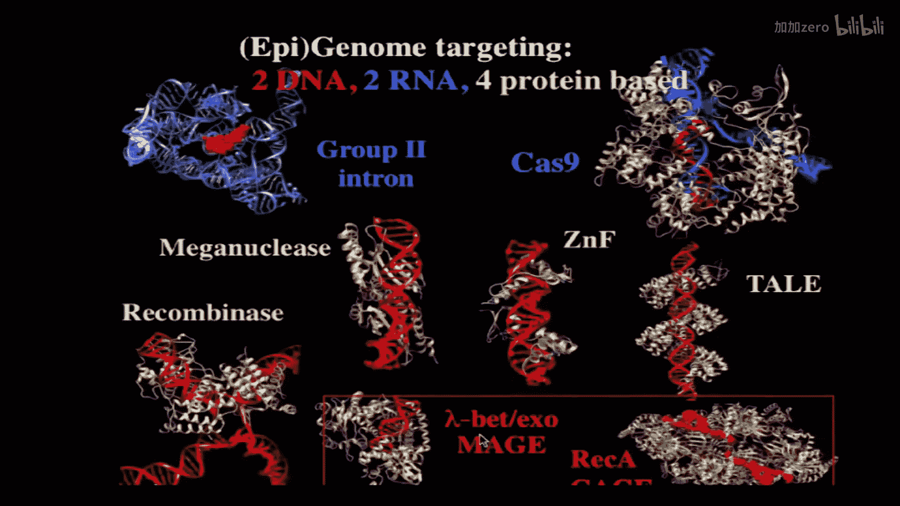

# 022：因果关系、自然计算与基因组工程 🧬

以下内容基于知识共享许可协议提供。您的支持将帮助麻省理工学院开放式课件继续免费提供高质量教育资源。如需捐款或查看来自数百门MIT课程的其他材料，请访问 [MIT OpenCourseware](http://ocw.mit.edu)。

在本节课中，我们将探讨如何通过基因组工程来验证生物学中的因果关系。我们已经学习了多种分析基因组的工具，但分析之后的关键步骤是检验我们的假设。通过高通量的方法测试假设，即使在小规模甚至单一样本队列中，也能有效减少假阳性的担忧。因此，了解验证因果关系的可能性至关重要，这将我们引向基因组工程，特别是计算机辅助的基因组设计。我们之前讨论了计算机分析，现在让我们来看看计算机辅助的基因组设计，包括细菌和人类基因组。

## 为何设计基因组？🔍

你可能会问，我们为什么要设计基因组？通常，通过改变一个碱基对就可以检验因果关系，那么为什么需要改变多个碱基对呢？单个SNP固然很好，但有时多个SNP会以多基因方式相互作用，这在人类中尤为常见。这里有一个极端的例子，你可能需要改变基因组中几乎每一个碱基对，不是为了复制一个基因组，而是以智能、半智能或组合的方式设计一个具有新功能、新特性的基因组。

我提出四个功能供大家思考：
1.  **遗传与代谢隔离**：出于安全或公共关系原因，你可能希望生物体在遗传和代谢上被隔离。
2.  **新化学**：引入新的蛋白质化学和新的氨基酸。
3.  **多病毒抗性**：这可能是四个功能中最强大的。想象一下，无论是工业农业还是人类，拥有一个能抵抗所有过去和现在、甚至尚未分析的病毒的生物体。

## 如何实现新功能？⚙️

我们如何实现新功能？如何设计一个不会崩溃的基因组？因为如果你改变基因组太多，你就会得到教训，你会发现你知道的并没有想象中那么多。你拥有来自分析的漂亮计算机模拟，但一旦开始测试，就会遇到意外。

因此，我将重点介绍设计、构建和测试这一过程。这种设计必须包含分析组件，所以我们会回到你熟悉的分析工具。

## 集成设计与分析系统 🛠️

以下是集成到我们称为“Millstone”系统中的计算工具列表。这个系统是关于设计和分析的循环：我们设计、构建、测试、分析，然后再回到设计。有时，当你构建时，你会构建一个大型的组合集合。这是生物工程中相当独特的一点，你可以在生物学中构建数万亿种不同的变体，看看哪一种效果最好。

我们能做到这一点的部分原因是，正如本课程中提到的下一代测序技术，我们也参与了下一代合成以及将合成DNA插入基因组的下一代技术。有四种不同的下一代合成方法，以及各种纠错方法，这些类似于电子和计算系统中的纠错，但我们不会过多强调这种类比。

## 实际构建与误差控制 📊

以下是一个实际例子，展示了在芯片上构建寡核苷酸时得到的结果。寡核苷酸长度可达300个核苷酸，随着长度增加，末端积累的错误会稍多一些。你可以看到，随着长度增加，错误数量从原始的1/1300错误率上升到1/250。然后，我们可以通过一种称为“ERASE”的酶系统纠正部分错误，在不进行测序的情况下，错误率可以降至约1/6000。如果愿意进行克隆和测序，错误率甚至可以更低。了解这种基本限制很重要，在计算和合成中，你始终需要考虑背景和错误。

## 组合合成与测序 🔬

现在，你可以通过构建顺式调控元件，将合成和测序紧密结合。在这篇已发表的论文中，我们基本上可以在基因组或质粒中合成顺式调控元件，然后通过RNA测序简单地读出RNA。你在RNA中看到这个条形码的次数，就告诉你这个特定构建体（可能经过大量工程改造，不像随机序列）的表达水平。我们可以构建数万甚至数百万个这样的构建体。

然后，你可以测量由此产生的蛋白质水平。你可以拥有启动子元件、核糖体结合位点和编码区突变，这些都可能影响RNA和蛋白质。我们通过使用两种荧光蛋白（红色和绿色）来测量蛋白质，红色作为对照，分布非常紧密；绿色则受顺式调控突变的影响，分布范围很大。通过荧光激活细胞分选仪，你可以将其分选并读出。因此，在这两个RNA和蛋白质图谱中，每个像素都是一个独立的实验。你可以深入挖掘，获取每个实验的更多信息。基本思想是，每个构建体都在芯片上单独合成，并随后单独测序以确定其序列。测序读取的条形码数量与RNA和蛋白质表达水平成比例。

## 研究中的意外发现 💡

以下是从此类研究中得出的一些意外发现的例子。我们进行这些研究并非毫无目的。例如，在进行这项研究之前，众所周知密码子使用效应与蛋白质表达相关，甚至可能因果影响蛋白质表达。观察结果是，如果你使用非常常用的密码子（这些密码子通常在细胞中具有高水平的相应tRNA），那么这些蛋白质的表达水平会更高。

新的发现是，在靠近顺式调控元件的基因起始端附近，情况发生了反转。与丰富密码子几乎没有相关性。实际上，这里存在一个负相关，R平方值为0.73，表明与稀有密码子有高度相关性。这项研究发表在《科学》杂志上。我们可以分离出各种因素，例如许多稀有密码子倾向于富含AU，但我们可以分离出这个成分。我们也可以分离出像核糖体结合位点这样的因素，它们是富含AG的。这里存在一个普遍趋势：如果稀有密码子位于基因起始端，它们有助于表达。你可以从这类实验中发现这一点。

## 设计根本不同的基因组 🧪

现在，如果我们想构建一个根本不同的基因组，比如在这里定义为在全基因组范围内释放和解放7到13个密码子。这意味着我们利用遗传密码中的同义密码子。每个氨基酸有1到6个密码子，终止密码子有3个密码子。我们可以利用这个同义替换表来重新排列，完全释放某些密码子。例如，消除每一个UAG实例，并将其变为UAA。这是第一个例子，我们在全基因组范围内做到了这一点。从而降低了风险，因为我们现在可以在其基础上进行构建，因为我们可以获得在各种条件下都能良好生长的基因组，它们仍然可以进行基因工程操作。

然后，我们想降低另一个特殊类别的风险。我之前提到，AGA和AGG是特殊的，因为它们是最稀有的编码密码子。UAG是终止密码子，而AGA和AGG是编码精氨酸的密码子，它们是最稀有的，并且情况复杂，因为它们往往代表富含AG的区域，这些区域参与翻译起始和蛋白质合成。无论如何，由于数量较大，我们无法在全基因组范围内进行，因此我们专注于必需基因。你可以通过计算找到所有必需基因，并设计策略来替换所有的AGG和AGA。

当你合成这些基因组时，你可以使用一种称为“MAGE”的过程一次一个地进行，我们不会深入讨论实验细节，但基本上你可以直接从寡核苷酸进入基因组，并且可以同时进行多个操作。你可以看到哪些难以构建，哪些容易构建。有些实际上被选择性地淘汰了，我们无法找到它们。这些就是发现。这些例子表明，同义并不总是同义的。这可能意味着存在一些隐藏在其他功能层之上的功能，同义密码子可能位于某个结合位点。我们发现，我们可以尝试其他密码子，比如当我们靶向精氨酸密码子时，有时甚至可以尝试非同义密码子。最终，我们找到了每一个。所以，最初有大约十几个难以处理，但最终我们找到了工程解决方案。

这说明了几个有趣的观点。所有这些在必需基因中都是成功的。根据我们的观察，如果能在必需基因中成功，那么在非必需基因中操作会更容易。然后我们继续前进。那是一次一个密码子，接着是两个密码子。到这时，我们已经降低了三个密码子的风险。然后我们继续降低所有13个密码子（64个中的13个）的风险。我们在更小的基因集中进行了操作，大肠杆菌有290个必需基因，我们操作了42个。在这种情况下，有400多个实例，除了一个之外，其他都成功了。就像精氨酸密码子一样，那一个我们尝试了许多不同的密码子，包括非同义密码子，最终成功了。在几乎所有情况下，你都能找到可行的方案。

然后我们进行了生物学测定，我们觉得应该改变的四个功能确实发生了改变。以下是关于病毒抗性的两张幻灯片。你可以用多种方法确定病毒抗性的有效性。在这里，对于噬菌体λ（已被突变成为高毒力版本），你看到了大约1000倍的抗性因子。T7是天然裂解性很强的噬菌体，你可以显示它对三种测试病毒中的两种具有抗性。我们的假设是，如果我们改变更多密码子（不仅仅是那一个，而是七个左右，这正是我们现在正在做的），那么它将对所有病毒都具有抗性，并且抗性非常强，强到病毒群体无法通过突变获得抗性。

你们所有人都应该质疑这一点：我真的相信吗？我们可以在讨论中谈谈这个问题。

## 遗传与代谢隔离 🛡️

另一个重要功能是，我们能否在遗传和代谢上隔离这些生物体？为了实现这一点，我们利用了新的遗传密码。我们不仅释放了一个密码子，我们现在还可以让那个密码子编码新的氨基酸，通过另一套生物化学方法。以下是一些看起来像酪氨酸或苯丙氨酸的氨基酸例子。这是一个联苯丙氨酸，它有两个苯环而不是一个，因此比任何天然存在的氨基酸都更庞大。我们想问，我们能否让这些我们一直在讨论的必需基因“上瘾”于这种氨基酸？我们通过这种计算蛋白质设计策略做到了。

基本思路是：我们查看了大肠杆菌中每个必需蛋白质的每一个晶体结构，大约有120个晶体结构。然后系统性地询问，是否存在任何位置，我们可以通过“雕刻”掉相邻的氨基酸来嵌入一个更大的氨基酸？这样，当我们不用更小的氨基酸替换那个更大的氨基酸时，它就不再适应。我们基本上系统性地检查了每个晶体结构中的每一个氨基酸，找到了大约半打看起来有希望的位置。思路是，你嵌入这些联苯基团，现在当你再把它缩小回去时，它就无法工作了。这就是基本思路。

在具体情境中，我们想为此进行一个非常严格的测试。我们不仅希望它“上瘾”于这种氨基酸，还希望它无法通过突变和进化逃脱，也不希望它通过“吃掉”同类（其他大肠杆菌）来逃脱。我们进行的测试是裂解细胞，裂解野生型大肠杆菌或某些能大量产生这些氨基酸的突变菌株的细胞。制造代谢隔离生物体的更经典方法是使用裂解物，但人们避免使用裂解物，因为它会带来坏消息：如果你在裂解物上培养它们，你会得到很多存活者。这些是经典方法，删除这两个基因会使它们仍然生长。但这是我们设计的非标准氨基酸菌株的例子，我们得到了更低的逃脱率。你会说，即使这个数字很低，我们也希望将其降至零。稍后你会看到我们如何做到这一点。

## 蛋白质设计实例 🧬

以下是这个设计的特写。这不是活性位点，可以是蛋白质中的任何位置，只要嵌入一个大氨基酸就会造成破坏。所以我们改变了这个亮氨酸。这个亮氨酸周围包裹着其他氨基酸。你们在这门课上学过蛋白质设计，对吧？好的，所以你们知道，我在谈论Rosetta。这就是我们在这里使用的。我们必须修改它以使用非标准氨基酸，因为通常人们用20种氨基酸设计蛋白质。所以我们把这个亮氨酸变成了联苯丙氨酸。你可以看到现在它有很多三维空间冲突，这不好。所以我们识别出这些冲突，并把它们改小。这一切都是在计算机上完成的，都是理论上的。你相信吗？我们来看看。然后，这是放回一个小氨基酸的情况。这些是参与这项工作的人，Mark和Dan是实验室的博士后，Barry做了晶体学。我接受过晶体学培训，但有点生疏了。这是设计图，这是电子密度图。现在你可以相信了，因为它不仅仅是计算机模型，而是基于数据的计算机模型。这是设计与X射线晶体结构的比较，还不错。

但问题是，这在活细胞中效果如何？这些是我们已经改变了整个基因组的细胞，现在终止密码子UAG是自由的，从未被使用。这意味着我们可以删除通常识别终止密码子的释放因子（否则是致死的），并用一个tRNA和一个tRNA合成酶来引入这种非标准氨基酸。这就是我们刚才在晶体结构中看到的那个，用粗体标出，它具有较高的逃脱频率。我们可以通过将其置于mutS缺失背景（基本上敲除一个错配修复蛋白）来提高突变率，从而加速进化。它有一个明显的逃脱频率。其他情况在mutS+背景下更现实，我们可以将逃脱频率降至10^-8。这些是同一蛋白质中的其他突变。这里是另一个蛋白质中的突变。

然后我们说，好吧，但这些都不完美。我们想要达到检测不到逃脱的水平。那么，我们如何解决这个问题？有人有建议吗？我在鼓励你们打断我，所以我在打断你们。你们有这些逃脱频率很低的东西。我们应该为此感到自豪，但我们想进一步降低，而不是10^-8，我们想降到10^-10左右，有什么建议吗？

这是一种回复突变。这意味着你可以突变密码子，使其不再编码联苯丙氨酸，而是编码其他东西。这样它就不再需要培养基中的联苯丙氨酸了。它放入另一个氨基酸，并以某种方式存活下来。所以，即使这不是一个完美的匹配，它也足够好，酶被制造出来了。

**多个必需基因**，说得太好了，我自己都说不出来。这正是我们做的。

所以这是一个概况。在我们选择我们想使用的两个或三个之前，我们想知道谱系是什么。所以我们故意用所有20种标准氨基酸替换联苯丙氨酸。我们说，让我们有意地、合成地突变它们，看看谱系是什么。现在，这不是自然的突变谱系，而是我们有意为之的。我们放入每一种氨基酸，然后在20次倍增后进行快速选择。这是非常快速的进化，不是30亿年。我的学生们不想等那么久。所以在20次倍增中，你会得到哪些氨基酸可以替代联苯丙氨酸的谱系。在理想情况下，没有一个可以。但我们强迫它们这样做，这些是存活者。所以我们一直在谈论的这些，色氨酸是替代联苯丙氨酸的氨基酸。这有道理，它是最大的氨基酸。这对酪氨酸-tRNA合成酶有效。

然后我们为这个80K（一种激酶）选择了另一个大红色箭头，在那里色氨酸的作用很小。但如果你强迫它接受这些疏水性脂肪族氨基酸如亮氨酸，你会得到一些逃脱者。所以我们制作了80K和TS的双突变体，它的逃脱率极低。我们可能还没做完，但我们会继续这样做。这就是你进行根本性重编码并获得新功能的方法。

## 人类基因组工程 🧑‍🔬

现在，我们继续讨论人类基因组工程。在座有多少人想编辑自己的基因组？好吧，我们稍后再问你们想改变什么。

这些是我和同事们研究过的一些工具。我职业生涯的大部分时间都在开发用于工程化基因组和测序基因组的新工具。到目前为止我讨论的是底部的RecA和Red Beta。而未来的明星是这个Cas9蛋白。我们在这里给它们上了色，以便区分。基因组编辑的关键在于大海捞针。你想改变一个碱基对，而不想改变其他任何东西。因此，必须有东西进行识别。这种识别可以是沃森-克里克配对。你可以通过DNA-DNA相互作用、RNA-DNA相互作用（沃森-克里克）或蛋白质-DNA相互作用（我相信你们已经学了很多）在整个基因组中进行搜索。所以这里有两个RNA（蓝色）的例子，方框内有两个DNA的例子，其余都是蛋白质的例子，其中蛋白质的氨基酸侧链通常识别大沟中的某种α螺旋。

Cas9是一个计算生物学的典型案例。它于1987年在大肠杆菌中被发现，本质上被认为是垃圾DNA。它不保守，具有重复性，这是垃圾DNA的两个标志性特征，在1987年非常流行。他们试图在基因组计划开始前三年就扼杀它，因为不想测序人类基因组中不编码蛋白质的任何部分。我是认真的。

无论如何，它作为垃圾DNA沉寂了许多年。最终，对于认知细菌学家来说，它可能是一种有趣的适应性免疫系统，有点像抗体，而不是固定的或天然的免疫（如限制性内切酶）。所以这有点像适应性版本的限制性内切酶。但直到2013年，当我的几位博士后和以前的博士后及研究生在一月份使其在人类细胞中工作时，它才真正流行起来。从细菌跳到人类是一个巨大的跨越。然后，一旦实现这个跨越，让它在我们尝试过的每一种生物体中工作都变得出奇地容易。所以现在至少在20种不同的生物体中有效，包括真菌、植物，甚至大象。我们还没有发表大象的数据，但我们有理由这样做。

最常被问到的问题，当然，这应该吸引试图进行设计的计算生物学家，就是：**脱靶效应怎么办？**

事实证明，现在有很多方法可以处理脱靶效应，多到我敢说，目前脱靶效应几乎到了无法测量的程度。以下是你可以采用的不同方法。我们从2013年1月开始进行理论分析，基本上寻找可能脱靶一两个核苷酸的位置，并将其排除在考虑之外。然后你得到一个较短的列表，并进行经验性搜索，因为这非常便宜。基本上，你有一个向导RNA，它形成一个三螺旋，与DNA的一条链结合。制作这些向导RNA非常容易，只需要合成20个核苷酸，将其插入载体，其余部分就自动处理了。如此容易，以至于你可以制作很多，并进行经验性搜索，找到对正确位点特别“热”、对错误脱靶位点特别“冷”的位置。这是前两种方法。

**配对切口酶**：你需要它们不产生双链断裂（这是其天然功能），而是产生单链切口，然后你需要两个这样的切口在附近重合。这有点像PCR的概念，你需要两个在彼此附近的引物。所以这是一种巧合。如果一个位点脱靶的概率是p，那么两个这样的位点在附近同时出现的概率大约是p的平方。

**截短的向导RNA**：你不一定会猜到，如果你让向导RNA更短，效果会更好。但显然有一个最佳长度。如果太长，那么它可能通过任何错配的子集结合；如果太短，从信息论的角度来看，它没有足够的比特数来识别基因组中的唯一位置。结果证明，最佳长度与天然长度略有不同，大约短两个核苷酸。

最后，这是刚刚出现的，来自Keith Young和David Liu的实验室，你消除了漂亮的双链断裂能力。你可以将其变成切口酶，或者使其完全失去核酸酶功能，然后重新添加核酸酶结构域。你会说，哇，这看起来有点奇怪，你做了所有这些工作来去除核酸酶，然后又添加了一个不同的核酸酶（FokI细菌限制性内切酶）。但事实证明，这是其他人处理其他DNA结合蛋白（如锌指蛋白和TALEN蛋白）的方式。所以我们必须尝试，而且效果非常好。它就像配对切口Cas9一样，你需要两个这样的位点才能产生切割。

请保持关注，我相信还会有更多方法。

## 回归因果关系 🔗

我想再次以因果关系结束，正如我开始时那样。这是一个双无效等位基因的例子，母本和父本拷贝都缺失。有很多双无效等位基因的例子，我们稍后可以讨论一些。它们通常很罕见。曾经，世界上只有一个人被鉴定出具有这种特征。很难对此进行大规模的队列研究。而且他们并没有真的生病。表型是，这个小婴儿肌肉发达，就像在阿诺德·施瓦辛格旁边锻炼过一样，但他生来如此，并且一直保持这样。但令人震惊的是，你看着基因组会说，哇，一个高度保守的蛋白质的双无效等位基因，这一定意味着什么。然后你可以根据对该通路的了解提出一个假设。这与表型相符，因此你有一个强有力的假设，可以在动物身上进行测试。通常会在三种不同的动物物种中进行测试，但这个例子碰巧在牛、狗和小鼠中都有现成的或容易进行的测试。

这是你可以用来验证因果关系的一种方法。另一种情况是，动物模型不起作用。要么你事先知道它们不会起作用，因为它们没有那种大脑结构，例如，除了人类之外，没有其他生物具有特定的大脑结构。因此很难制造突变体，因为它们已经是突变体了。另一个选择是芯片器官或类器官，因为它们并不完全生理学上忠实，但至少是人类来源的。就像动物模型可能有假象一样，人类类器官也可能有假象。

以下是一个即将在几天内发表的例子，是我们与Keith Parker实验室和Bill Pu实验室合作完成的。我认为这是一个很好的例子，说明你可以提出一个假设：一个碱基对发生了改变，这个G在这里被删除，据推测这导致了影响线粒体功能的心肌病。你可以使用我刚才提到的CRISPR技术或同源重组来突变它，找到那个碱基，改变它。或者你可以在附近制造一个混乱，作为对照。另一个对照是不改变它。当然，在那里制造一个小插入缺失也会把它搞乱。通过这三种情况，你现在构建了三个等基因株系。这些实际上是我在个人基因组计划中的细胞，我们像我这样的志愿者建立干细胞系，然后从干细胞系中，我们可以建立在这个例子中非常有序的心脏组织。在下一张幻灯片中你会看到，你可以测试该心脏组织的脂质生物化学、其他生理参数、形态学以及心脏肌肉的收缩性（舒张和收缩）。所以，你基本上可以制造一个只改变了我的基因组中一个碱基对的东西。我们基本上制造了一个突变版本的我。

## 总结 📝

在本节课中，我们一起学习了如何通过基因组工程来验证生物学中的因果关系。我们从设计具有新功能（如病毒抗性和代谢隔离）的基因组开始，探讨了计算机辅助设计、合成、测试和分析的完整循环。我们看到了同义密码子改变可能带来的意外发现，以及通过蛋白质设计引入非标准氨基酸来创造遗传依赖性的方法。最后，我们讨论了人类基因组工程的工具（如CRISPR-Cas9）及其在验证疾病因果关系和潜在治疗方面的应用，包括如何通过编辑干细胞模型来研究人类疾病。基因组工程不仅是一个强大的研究工具，也为未来精准医学开辟了道路。