# 1：数据中心AI vs. 模型中心AI

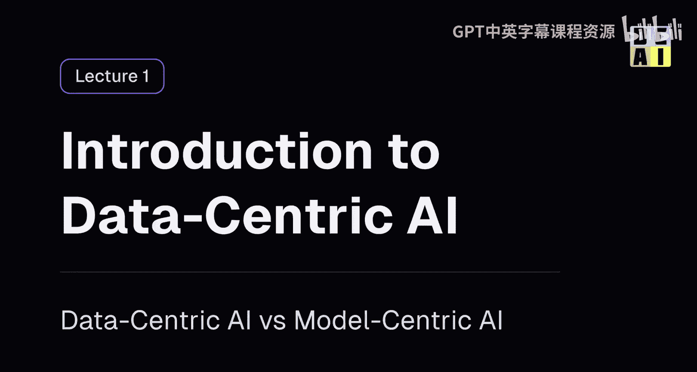

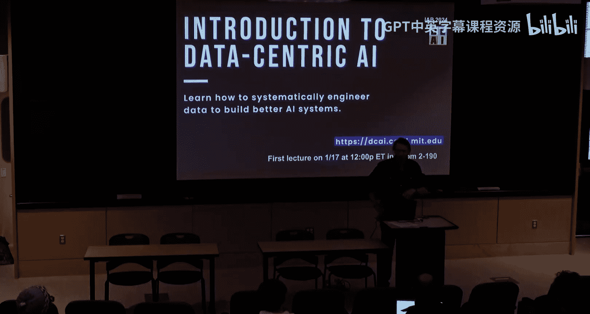


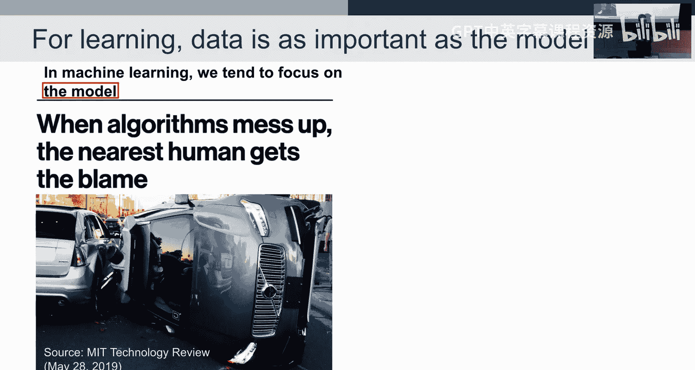

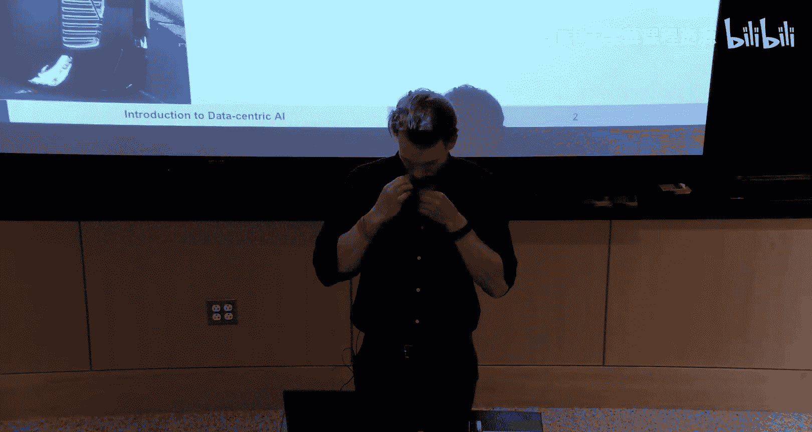

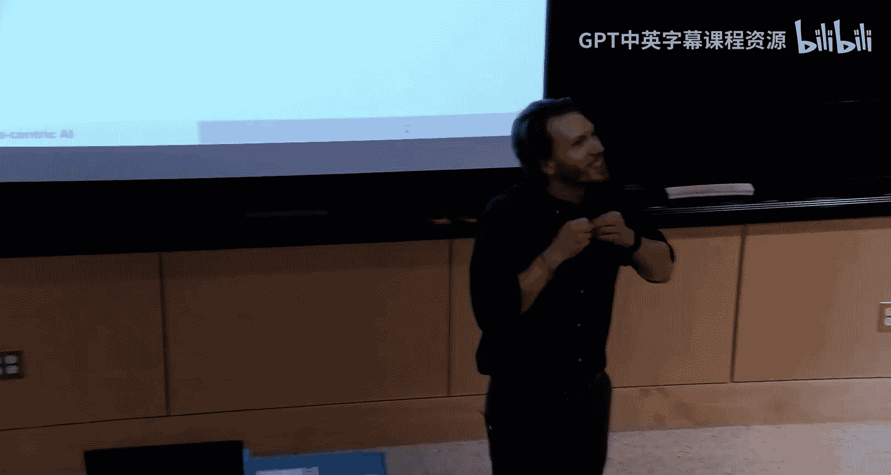


在本节课中，我们将学习数据中心人工智能的基本概念，并将其与传统的模型中心方法进行对比。我们将探讨为什么关注数据质量至关重要，并通过一个具体的算法示例来展示如何系统性地改进数据以提升模型性能。

## 概述

传统机器学习教学通常侧重于模型：给定一个固定的、相对干净的数据集，目标是调整模型架构、超参数或损失函数以获得最佳性能。这被称为**模型中心AI**。

然而，在现实世界的应用中，数据集并非固定不变。数据往往是混乱的，包含错误、异常值和模糊样本。**数据中心AI**的核心思想是：给定一个模型，我们如何通过系统性地改进训练数据集本身来提升AI任务的性能。本节课将介绍这一范式转变，并展示其基本原理。

## 模型中心AI vs. 数据中心AI

上一节我们概述了两种不同的AI范式。本节中，我们来具体看看它们的区别。

在模型中心AI中，数据集是给定的常数。你的目标是尝试各种方法来优化模型，例如：
*   改变模型架构。
*   调整超参数。
*   修改损失函数或添加正则化。

而在数据中心AI中，模型是给定的（或可视为固定）。你的目标是尝试各种方法来优化训练数据集，例如：
*   检测并修正错误标签。
*   识别并处理异常值。
*   通过数据增强生成更多样本。
*   主动选择最有价值的数据进行标注。

理想情况下，两者应同时进行。但实践中，从业者往往发现大部分时间都花在处理数据问题上。

## 为什么需要数据中心AI？

我们了解了两种范式的定义，现在来看看为什么数据中心AI如此重要。

现实世界的数据远非课堂作业中那样完美。以下是一些关键原因：

*   **数据存在固有错误**：即使是机器学习领域最常引用的基准测试集，也被发现包含标签错误。我们在有错误的数据上进行基准测试和模型比较。
*   **垃圾进，垃圾出**：如果输入模型的数据质量低下，无论模型多么复杂，其输出都可能不可靠。这在高风险应用（如自动驾驶、医疗诊断）中后果严重。
*   **数据质量成本高昂**：企业每年在数据管理和标注上花费巨大。例如，从GPT-3到ChatGPT（GPT-3.5）的关键改进之一，就是通过人类反馈进行大规模的数据清洗和排序，以确保回答的有用性和真实性。
*   **解决实际问题**：在工业界，模型部署后遇到性能下降时，往往是因为遇到了新的、模型未见过的数据分布（例如，自动驾驶汽车首次进入隧道）。传统的解决方法是人工收集、标注新数据并重新训练，这个过程昂贵且缓慢。数据中心AI旨在系统化、自动化地处理这类数据质量问题。

一个生动的例子是：2016年，一位图灵奖得主兴奋地宣布，他利用新的“胶囊网络”在著名的MNIST数据集上发现了一个标签错误（一个手写数字“5”被误标为“3”）。这说明了当时业界对在数据中发现错误的重视程度，也显示了我们现在所能做的远不止于此。

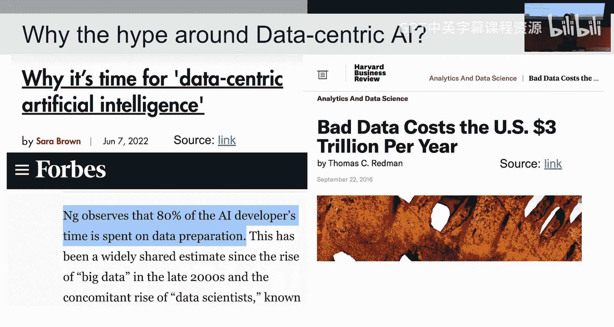

## 什么是（以及不是）数据中心AI？

明确了需求后，我们来定义什么才是真正的数据中心AI方法。

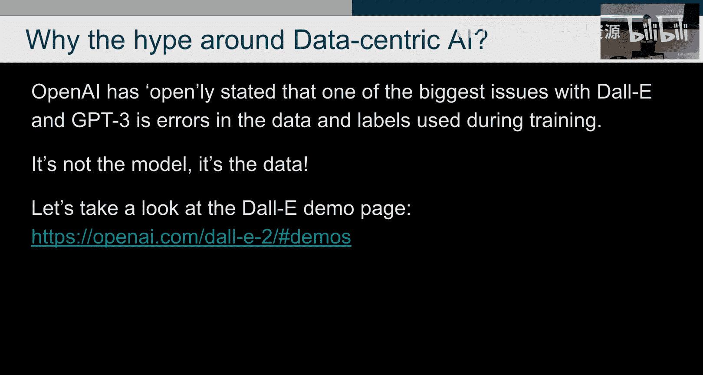

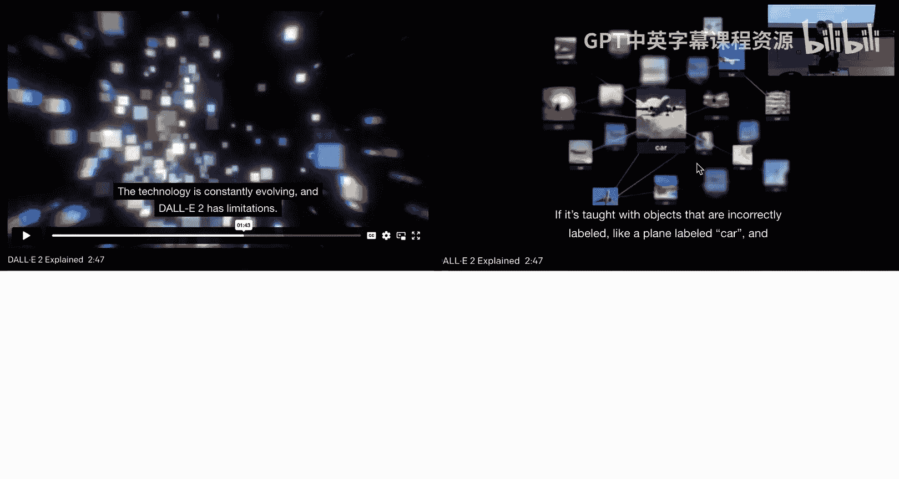

数据中心AI通常表现为两种形式：
1.  **理解数据**的AI算法：利用对数据的理解来改进模型。例如**课程学习**，即调整数据呈现给模型的顺序（先易后难）以加速学习。
2.  **修改数据**的AI算法：直接修改数据本身以改进模型。这是我们接下来重点关注的。

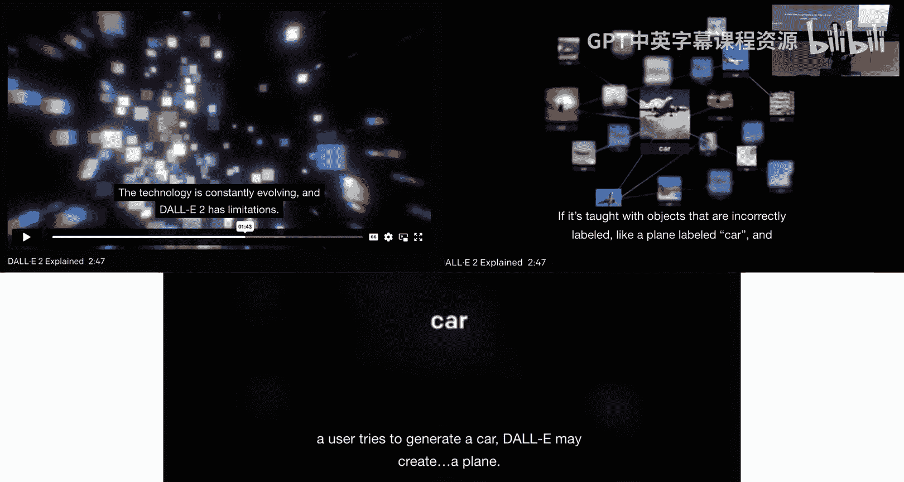

**以下不是系统性的数据中心AI**：
*   **手动挑选数据点**：这不可扩展，尤其当数据量达到百万甚至亿级时。
*   **单纯地收集更多数据**：这关注的是数据**数量**而非**质量**。虽然增加数据量有时有效，但存在成本和时间上限，且无法保证新数据的质量。

**以下是系统性的数据中心AI方法示例**：
以下是常见的数据中心AI技术：
*   **异常值检测与移除**：例如使用Z-score、孤立森林或单类SVM来识别并处理异常数据点。
*   **错误检测与修正**：自动发现并修正错误的标签。
*   **数据增强**：通过算法生成新的训练样本。例如，对图像进行旋转、裁剪；对文本进行回译（翻译成另一种语言再译回）；或进行特征工程生成新特征。
*   **特征工程与选择**：识别或创建对模型预测最有用的特征。
*   **共识标签**：当多个标注者对同一数据给出不同标签时，算法性地确定最终标签。
*   **主动学习**：模型自动选择对其学习最有价值的未标注数据，交由人类标注，以最小化标注成本、最大化模型提升。
*   **课程学习**：如前所述，智能地安排数据的学习顺序。

## 数据中心AI的感知机：PU学习

前面我们介绍了一系列数据中心AI的概念和例子。本节中，我们来看一个具体、优雅且强大的算法示例，它被称为“数据中心AI的感知机”——**PU学习**。

感知机是机器学习入门的第一课，因为它用简单的形式（权重更新：`w = w + η * (y_pred - y_true) * x`）展示了模型如何从数据中学习。类似地，PU学习用一个相对简单的框架，展示了如何从含噪声的标签中恢复出干净的数据分布。

### 问题设定

我们从一个简单的二分类问题开始。
*   我们有特征 `x`（如图像、文本）。
*   存在一个潜在的**真实标签** `y*` ∈ {0, 1}，但我们无法直接观测到。
*   我们观测到的是**含噪声的标签** `ỹ` ∈ {0, 1}，它可能出错。

我们的目标是：**仅使用含噪声的观测数据 `(x, ỹ)` 训练一个分类器，但希望它能够预测真实的 `y*`**。

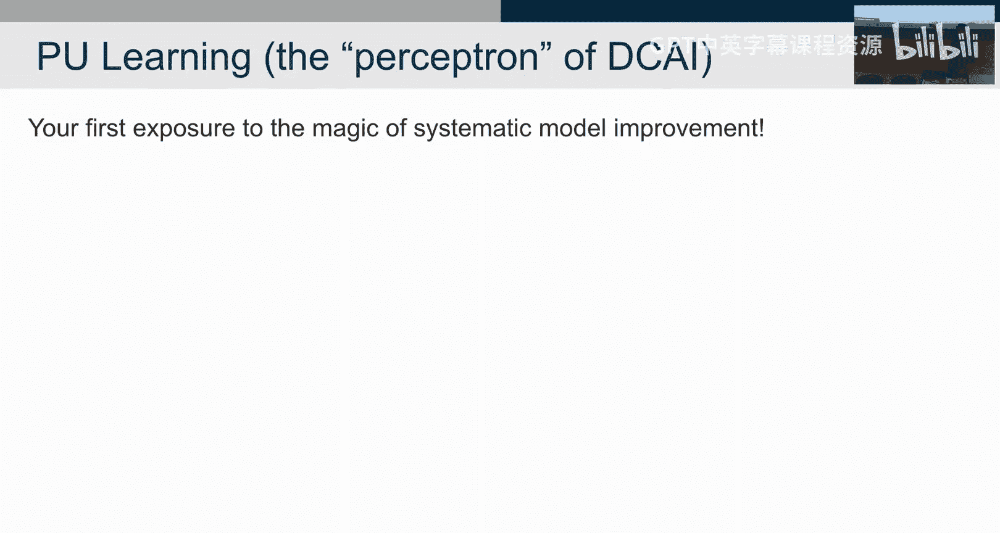

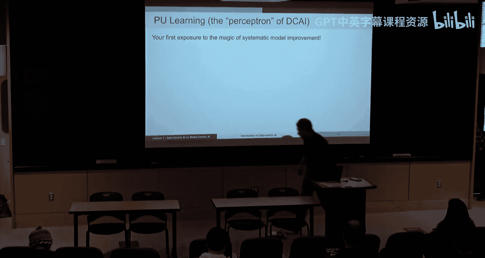

### 关键假设

PU学习基于两个关键假设：
1.  **正类无错误**：我们有一个**正例集合P**，其中的所有样本都被观测为正面（`ỹ = 1`），并且它们**确实都是真实的正面样本**（`y* = 1`）。即 `P(ỹ=1 | y*=0) = 0`。这是一个强假设，但某些场景下可以近似满足（例如，通过高质量专家验证获得一小部分干净正例）。
2.  **标签翻转概率与特征无关**：真实标签为1的样本被错误标记为0的概率是一个常数，与样本特征 `x` 本身无关。即 `P(ỹ=0 | y*=1, x) = c`（常数）。这意味着噪声是均匀的。

### 核心推导

在上述假设下，我们可以建立观测到的噪声标签概率与真实标签概率之间的美妙联系。

我们希望得到 `P(y*=1 | x)`，但我们只能训练模型得到 `P(ỹ=1 | x)`。

推导如下：
```
P(ỹ=1 | x) = P(ỹ=1, y*=1 | x) + P(ỹ=1, y*=0 | x)  # 全概率公式
```
根据假设1，第二项 `P(ỹ=1, y*=0 | x) = 0`。
```
P(ỹ=1 | x) = P(ỹ=1 | y*=1, x) * P(y*=1 | x)
```
根据假设2，`P(ỹ=1 | y*=1, x) = 1 - P(ỹ=0 | y*=1, x) = 1 - c`。
```
因此，P(ỹ=1 | x) = (1 - c) * P(y*=1 | x)
```
最终，我们得到核心公式：
```
P(y*=1 | x) = P(ỹ=1 | x) / (1 - c)
```

**这个结果非常强大**：它意味着，只要我们能够估计出常数 `c`（即真实正例被误标为负例的概率），我们就可以将**在噪声数据上训练出的分类器的输出概率**，简单地**除以 (1-c)**，从而得到**对真实干净数据概率的估计**。

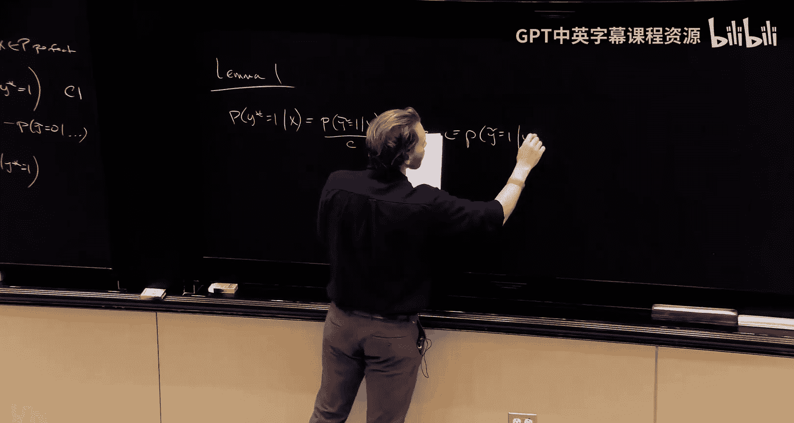

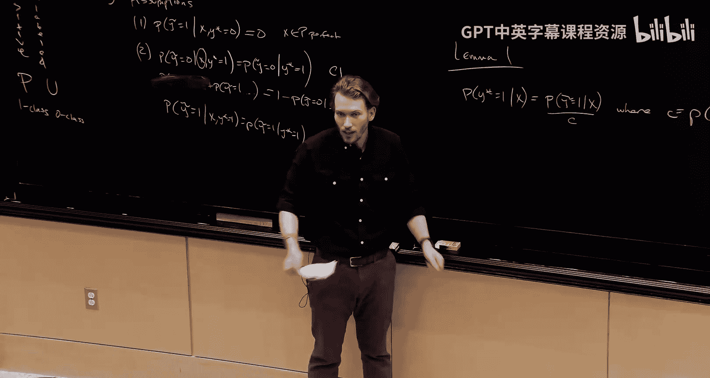

### 如何估计常数 c？

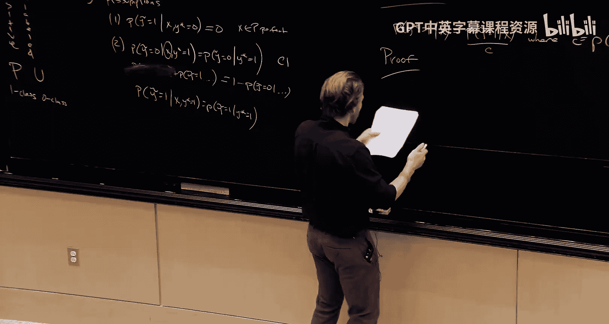

估计 `c` 的方法直观而简单。根据定义：
```
c = P(ỹ=0 | y*=1)
```
由于我们的正例集合P中的样本都满足 `y*=1`，我们可以在**这个干净的集合P上**评估我们之前训练的噪声分类器。这个分类器给出的是 `P(ỹ=1 | x, y*=1)`。我们对集合P中所有样本的这个概率取平均，就得到了 `P(ỹ=1 | y*=1)`。那么：
```
c = 1 - P(ỹ=1 | y*=1)
```
因此，算法步骤如下：
1.  利用所有数据（含噪声标签 `ỹ`）训练一个分类器，得到模型 `f(x) ≈ P(ỹ=1 | x)`。
2.  在**干净的正面数据集P**上运行该分类器，计算其预测概率的平均值：`avg = mean( f(x) for x in P )`。这个 `avg` 近似于 `P(ỹ=1 | y*=1)`。
3.  计算 `c = 1 - avg`。
4.  对于任何新样本 `x`，其真实为正的概率估计为：`P(y*=1 | x) = f(x) / (1 - c)`。

## 总结

本节课中，我们一起学习了数据中心人工智能的核心思想。
*   我们首先对比了**模型中心AI**（优化模型以适应固定数据）和**数据中心AI**（优化数据以适应给定模型）的范式差异。
*   我们探讨了在现实世界应用中关注数据质量的必要性，因为数据中的错误和模糊性会直接影响模型性能。
*   我们列举了多种系统性的数据中心AI技术，如错误检测、数据增强和主动学习。
*   最后，我们深入探讨了一个经典的数据中心AI算法——**PU学习**。通过两个合理的假设，我们展示了如何从带有噪声标签的数据中，恢复出对真实数据分布的估计。这个例子清晰地证明了，通过算法性地理解和处理数据，我们能够显著提升机器学习系统的表现，这正是数据中心AI的魅力所在。

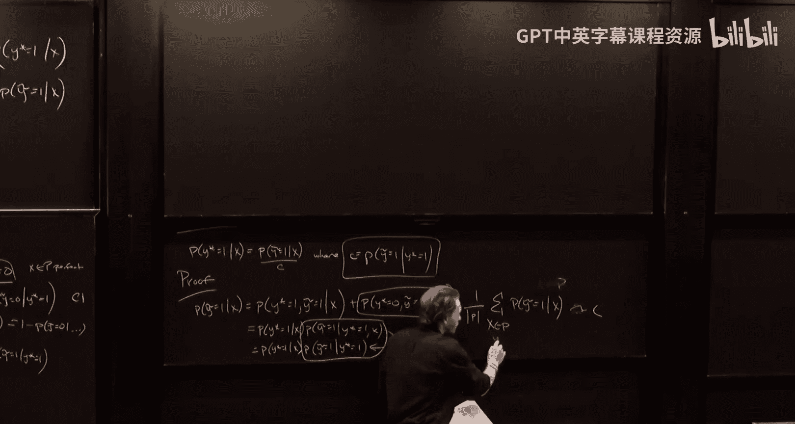

在接下来的课程中，我们将探索更复杂、更通用的数据中心AI方法，以处理多分类、非均匀噪声等现实场景。