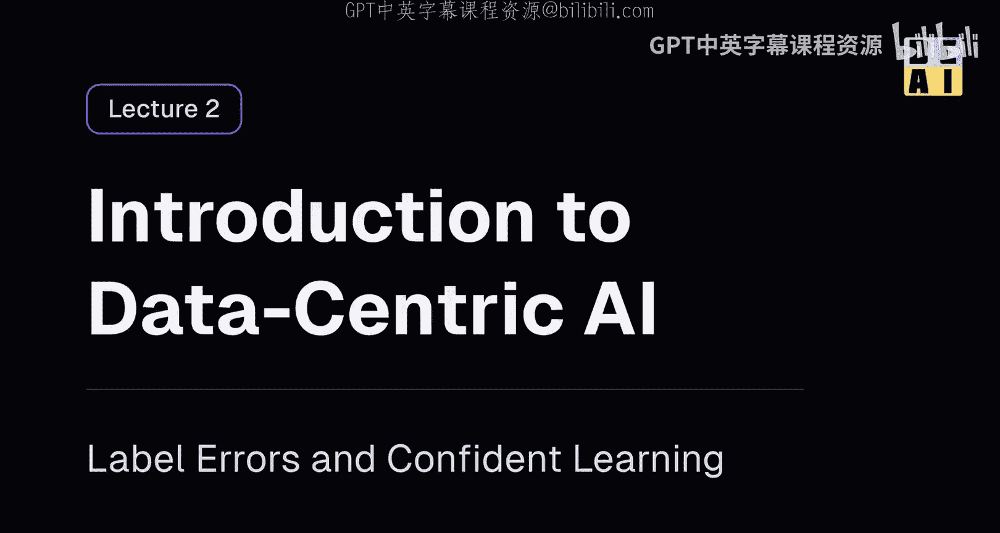
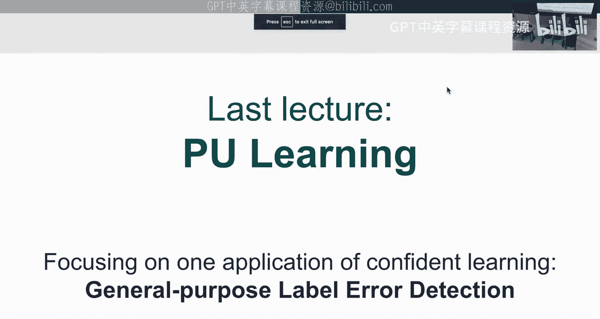
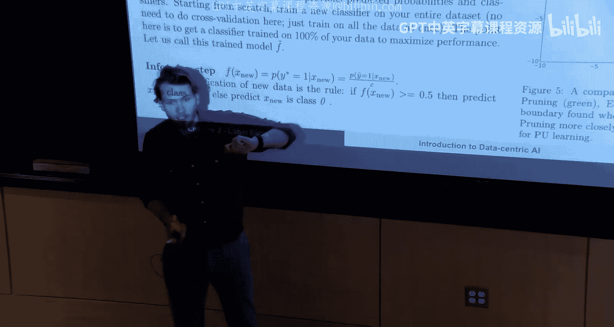
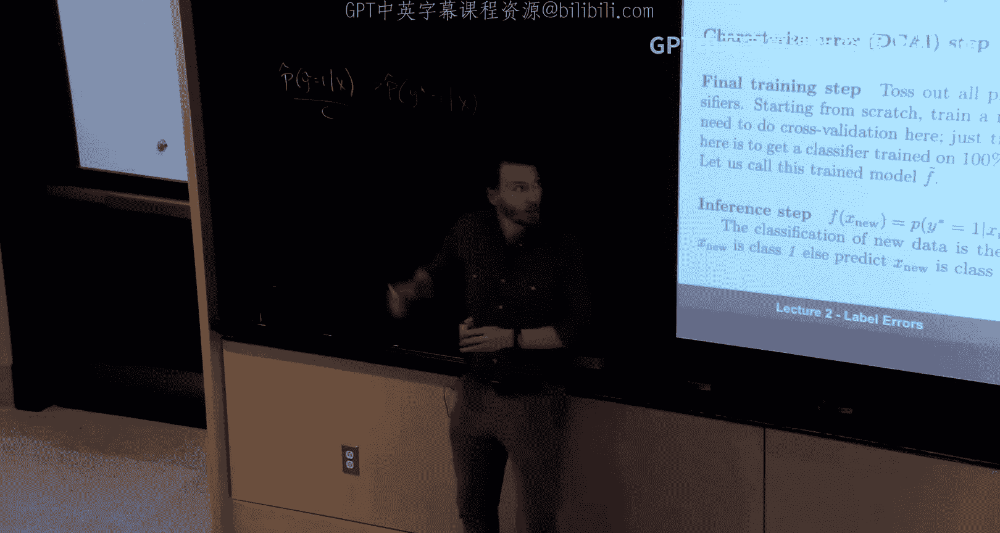
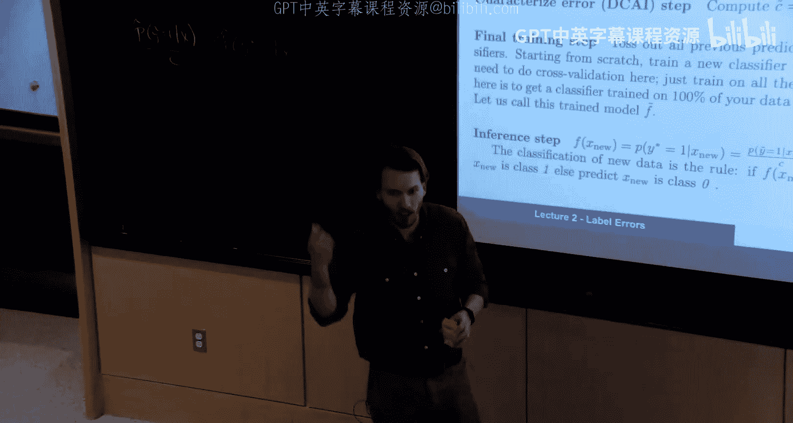
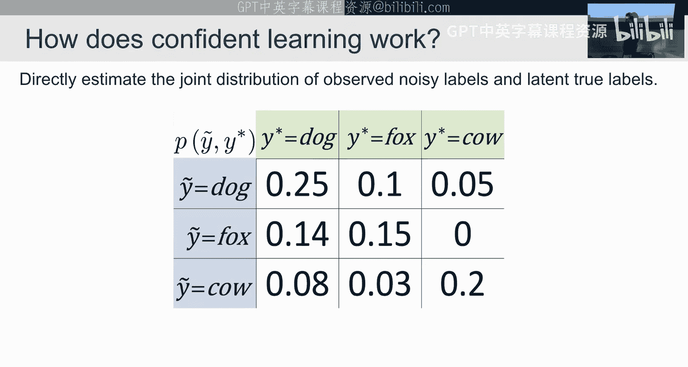
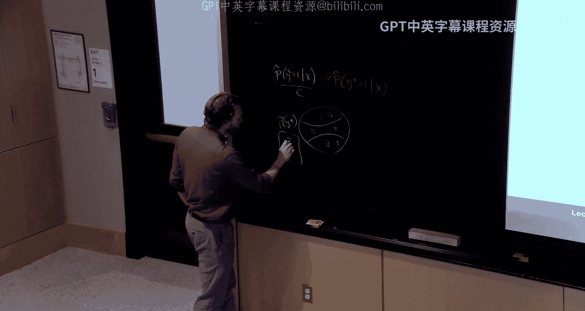
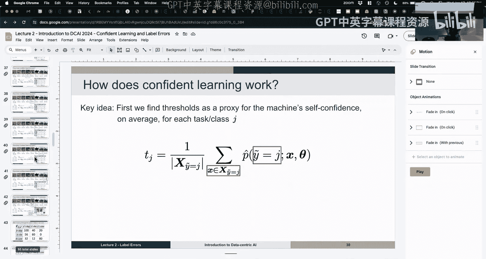
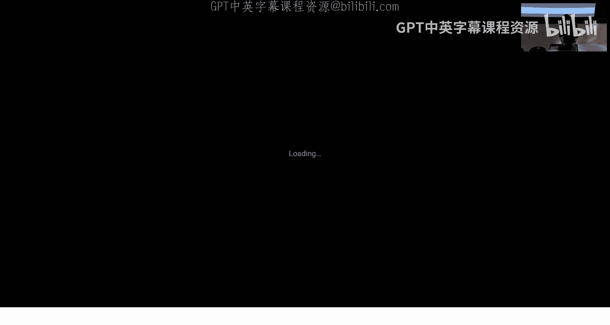
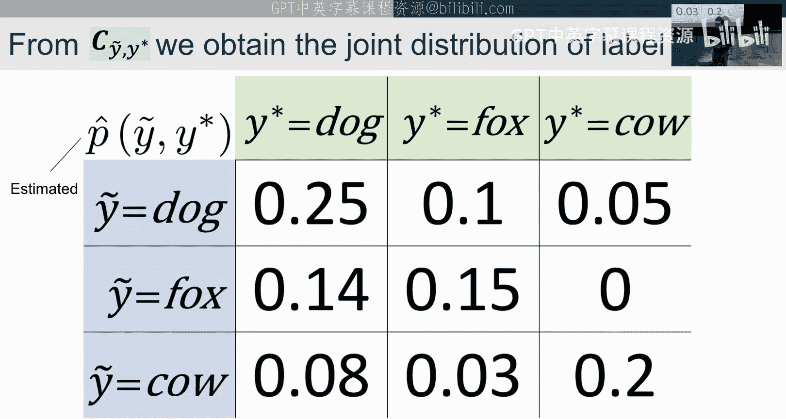

# 2：标签错误与置信学习

在本节课中，我们将学习如何自动发现数据集中的标签错误，以及如何在包含标签错误的数据上训练分类模型。我们将从回顾上一讲的内容开始，然后深入探讨置信学习的核心概念和方法。

## 概述

上一讲我们介绍了P学习。为了将所学内容串联起来，我为大家整理了一份手写形式的逐步算法说明，它概括了我们之前探讨的所有内容。核心代码步骤只有一个。

需要强调两点：
1.  **训练与推断的区别**：整个过程涉及两次训练。第一步是获取P。我们上次看到了从数据中估计出的 $\hat{P}(Y \mid \tilde{Y})$。我们利用它来得到我们真正想要的 $P(Y \mid \tilde{Y})$，其解决方案很简单，就是除以一个在此处估计的常数 $C$。
2.  **预测概率的来源与误差**：这些预测概率来自一个模型。我们实际拥有的是估计值。模型在观察了部分数据后输出的预测概率并非完美的真实概率。当我们平均这些带有误差的数字时，误差可能会相互抵消，但这并不完美。因此，我们得到的常数 $C$ 能帮助我们更接近目标，但如果模型本身很差，这些估计值就会偏差很大，误差会随之传播。我们正是要处理这种误差以改进机器学习模型。

预测概率是在样本外计算的。熟悉交叉验证的同学应该能理解这一点。通常我们会使用交叉验证。你也可以使用两个数据集：一个用于训练，另一个是你想在训练模型前进行改进的数据集。或者，你也可以直接从网上下载一个模型，只要类别相同，就可以用它来获取预测概率，只要该模型没有在你的任何数据上训练过，这些概率也是样本外的。

当我们用代码实现这个方法时，对于某些数据，一些数据点的标签被扰动并翻转为其他标签。图中未显示的是，绿线代表我们今天将要学习的算法的一个非常简单的早期版本，黑线是如果你拥有所有真实标签时的真实情况，而紫线则是使用我们昨天看到的方法得到的结果。今天我们将学习一个能让你更接近真实情况的方法。

现在，让我们开始今天的内容。

## 标签错误的重要性与来源

今天我们将讨论置信学习，我们的目标是实现通用的标签错误检测，以便用于改进我们输入模型的数据标签，从而系统性地提升机器学习模型。

这是一张来自我们合作论文的图片，我想强调错误有很多不同类型。例如，这些是图像错误。有些数据点，即使人类评审员也无法就标签达成一致，我认为这是模糊数据。有些数据点，你提供给标注者的两个标签都不正确，这些有时是异常值。还有些数据点本身包含两个标签。我们今天要关注的是这样一种情况：数据中实际上存在一个标签，但你想纠正它。一旦纠正，你将把这些数据输入你的机器学习模型以获得更好的性能。

那么，我们要做什么呢？我们将学习不同类型的标签问题、它们为何重要、噪声过程、如何发现问题，以及这些方法为何有效的数学直觉。如果有时间，我们还会深入一些算法，讨论如何对数据进行排序、如何估计标签问题的总数、如何训练最终模型，以及这对机器学习基准的影响。

在深入之前，请允许我分享一个简短但重要的故事。科学和数学是冷静的学科，但我想分享一个充满热情的故事。我今天要讲的这个讲座源于一个愿望。当我来到MIT时，我是edX的第一位研究科学家。我们有一个目标是检测作弊者。我在研究数据时发现，在获得超过五个证书的人中，有10%到30%的证书是通过作弊获得的。作弊方式是打开两个浏览器窗口。当时没有算法可以检测这种作弊。这促使我深入研究文献，结果发现，自2013年以来，并没有通用的算法允许你在有噪声标签的机器学习中进行学习。这让我很困扰，因为现实世界的数据集都存在噪声标签。这促使我思考，是否每个尝试应用机器学习的公司和个人都在处理这个问题？对于许多人来说，答案是肯定的。这就是今天我要介绍的“置信学习”讲座的起源。正是这个真实的动机推动了我们后来能够训练机器学习分类器，在约700门课程中大规模检测作弊。

让我们深入探讨。本讲座适用于文本数据、LLM输出数据、视频分类数据、音频数据等任何可以训练机器学习模型的数据类型。

## 简单方法的局限性

首先，我们思考一个非常简单的、在任何数据集中查找标签错误的方法：你可以训练一个模型，然后根据每个样本的损失函数值进行排序。这样做有什么问题呢？

1.  **样本内问题**：如果你在训练过程中使用损失函数，模型在之前的迭代中已经见过那些数据点。如果标签是错误的，模型会尝试拟合错误标签。正如我们在第一讲中看到的，一个在完全随机标签上训练的模型可以达到100%的准确率。因此，在训练时，模型可能会学会将猫的图片（标签为狗）输出为狗，导致损失为零。
2.  **如何确定阈值**：假设我们解决了样本外问题，例如通过交叉验证获得了样本外预测概率，并计算了这些样本外数据上的损失，然后根据损失排序。在一个拥有1000万个样本的真实世界数据集中，你得到了1000万个损失值并进行了排序。你如何知道在哪里截止？假设截止点以上的样本是错误，但你如何确定这个截止点？这是一个必须解决的关键问题。

因此，仅仅根据损失排序是查找标签问题的最简单算法，但你不知道应该走多远。

## 什么是置信学习？

置信学习是一个用于查找标签错误、根据问题可能性对数据排序、在有噪声标签的情况下训练机器学习模型以及全面表征数据中标签噪声的框架和理论。我们还可以用它来查找本体论问题（即如何定义类别本身），但这将在周五讨论。

其核心思想是，只要你能获得预测概率和标签，它就能适用于任何ML模型。预测概率和标签是置信学习仅需的两个输入。这意味着它是数据中心的，并且与模型无关。

## 符号与噪声类型

我们使用以下符号：
*   $\tilde{y}$：观测到的有噪声标签。
*   $y^*$：真实的标签（无法观测）。
*   $X$：最终训练模型所用的数据集。
*   $X_{\tilde{y}=i, y^*=j}$：数据集中标签被噪声标记为 $i$ 但真实标签为 $j$ 的子集。
*   $C_{ij}$：上述子集的基数（数量）。
*   $P(\tilde{y}, y^*)$：联合分布。
*   $P(\tilde{y}=i \mid y^*=j)$：真实标签为 $j$ 时被观测为 $i$ 的翻转率。

标签噪声的来源多种多样：点错按钮、疲劳、缺乏领域专业知识、测量错误、工具使用不当、不称职、使用有缺陷的机器学习模型进行标注，或者数据损坏。所有这些噪声源的结果都是，你最终得到了一些被错误标记的数据。

最终你会得到一个矩阵。这是对我们上一讲内容的推广。上一讲的矩阵是2x2，并且其中一个条目必须为零（对于正类）。现在我们将其推广到3x3，这可以扩展到 $n \times n$。它允许任何条目为非零，对哪些类别有错误、错误翻转到哪些类别、类别数量或样本数量都没有限制。

标签噪声有不同的类型。我们关注的是更通用的类型。有一种分布类型是，所有翻转率上都有均匀噪声，对角线（正确标注）上有信号。这种分布在研究论文中被大量研究，但在现实世界中完全不切实际。为什么这种相对容易解决？从信号与噪声的角度来看，如果你有100个错误，并且它们均匀分布在所有类别中，那么每个类别的错误数量就很少，信噪比很高。另一种情况是，同样的100个错误只集中在少数几个类别中，那么这些类别中的信噪比就会很低。我们关注的是最一般的情况，即除了对角线上的信号大于该列其他条目之和这一限制外，没有其他限制。这确保了信噪比。

## 不确定性与噪声分离

我们需要理解不确定性的概念。机器学习模型中的置信度是指你对预测的把握程度。不确定性则相反，是缺乏信心的程度。我们主要关注两种不确定性：数据本身的难度（偶然不确定性）和模型无法拟合数据的能力（认知不确定性）。你的数据有错误，但你的模型也不完美。因此，你的模型会产生不完美的预测概率，你的数据也有错误。我们必须将这两种误差源分开。

预测概率 $P(\tilde{Y}=i \mid X=x; \theta)$ 同时表达了两种东西：
1.  模型噪声：这些是你的模型输出的有噪声的预测概率。
2.  标签噪声：对于一个样本，它给出了所有可能标签的概率。例如，如果一个样本的真实标签是猫但被标记为狗，并且数据集中30%的猫被误标为狗，那么一个完美模型对于这张猫图片输出“狗”的概率应该是0.7。因此，这个术语同时包含了标签噪声和模型噪声。

我们需要在算法中将这两个噪声源区分开来。数学上通常通过做出假设来实现。我们将使用的假设与上一讲相同：给定真实标签，观测到某个噪声标签的概率与样本本身条件独立。对于大多数类别合理区分的数据集，这个假设并非过于疯狂。在类别极其相似、难以区分的情况下可能不适用，但对于大多数数据集，这是一个合理的做法。

## 方法类型：模型中心与数据中心

处理标签噪声的方法主要分为两类：
1.  **模型中心方法**：通常修改损失函数。例如，训练两个神经网络，利用一个网络对另一个网络未见过的数据计算高损失，从而在更新梯度时降低该样本的权重。这类方法（如MentorNet, Co-teaching）的缺点在于，它们通过损失函数传播误差，将一个模型的噪声输出作为输入影响另一个模型。
2.  **数据中心方法**：我们将改变数据集本身。通过找出错误，然后删除或修正它们，最后在一个干净的数据集上训练。这就是我们要采用的方法。

## 置信学习算法

我们的目标是估计联合分布 $P(\tilde{y}, y^*)$。如果我们有这个分布，我们就掌握了一切：我们可以得到翻转率 $P(\tilde{y} \mid y^*)$、$P(y^* \mid \tilde{y})$ 以及真实标签的分布 $P(y^*)$。注意，$P(y^*)$ 是未知的，因为我们不知道真实标签。但 $P(\tilde{y})$ 是已知的，它就是你数据集中观测标签的分布（例如，使用 `pandas.value_counts` 或 `numpy.bincount` 然后除以总数）。

算法步骤如下：

**第一步：计算每个类别的置信度阈值**
对于每个类别 $j$，阈值 $t_j$ 的计算公式为：
$$ t_j = \frac{1}{|\{x \in X_{\tilde{y}=j}\}|} \sum_{x \in X_{\tilde{y}=j}} \hat{P}(\tilde{y}=j \mid x; \theta) $$
这个阈值代表了模型对该类别标签正确性的平均置信度。如果 $t_j$ 为1，意味着模型认为该类所有标签都完全正确；如果 $t_j$ 很低，则意味着模型对该类标签非常不自信。

**第二步：构建计数矩阵 $C$**
我们初始化一个全零矩阵 $C$，其维度为类别数 $M \times M$。然后，对于数据集中的每个样本 $(x, \tilde{y}=i)$：
*   获取其样本外预测概率向量 $\hat{P}(\tilde{y} \mid x; \theta)$。
*   对于每个预测概率 $\hat{P}(\tilde{y}=j \mid x; \theta)$，检查它是否大于等于对应类别 $j$ 的阈值 $t_j$。
*   如果满足条件，并且这是该样本所有满足条件的预测中概率最高的一个，那么我们就认为模型“确信”这个样本的真实标签是 $j$，尽管它被标记为 $i$。于是，我们将计数矩阵 $C$ 中第 $j$ 行第 $i$ 列（注意行列对应真实和观测标签）的元素 $C_{ji}$ 加1。

**算法演示**
假设我们有一个图像数据集。我们已有样本外预测概率和标签。计算出的阈值如图所示。
*   **第一个样本**：噪声标签是“狗”，预测为“狗”的概率是0.3。狗类的阈值是0.7。0.3 < 0.7，所以不更新。
*   **第二个样本**：噪声标签是“狗”，预测为“狐狸”的概率是0.7。狐狸类的阈值是0.7。0.7 >= 0.7，所以更新矩阵 $C$ 中（真实=狐狸，观测=狗）的位置。
*   **正确标注的样本**：例如，一个标签为“狐狸”且预测为“狐狸”的概率为0.7的样本，也会通过阈值检查，并更新矩阵对角线上的相应位置。
*   **异常值**：例如，一个标签为“牛”但预测为任何类别的概率都很低的样本，可能无法通过任何类别的阈值检查。这样的样本不会被计入矩阵 $C$。这内在地提供了对异常值的鲁棒性。

通过这个简单的算法，我们实际上筛选出了数据：矩阵对角线上的计数大致对应正确标注的样本，非对角线上的计数对应错误标注的样本，而未计入的样本可能包含异常值或难以分类的样本。

**第三步：归一化得到联合分布**
获得计数矩阵 $C$ 后，我们需要做两件事：
1.  我们知道观测标签的总数 $P(\tilde{y})$。因此，我们可以按行缩放 $C$ 中的计数，使其行和与观测标签的分布相匹配。
2.  然后，我们除以检测到的样本总数（排除了未计入的异常值），得到一个归一化的矩阵。这个矩阵就是我们对联合分布 $P(\tilde{y}, y^*)$ 的估计。

至此，我们完全表征了数据中的标签噪声。

## 总结

本节课我们一起学习了如何利用置信学习框架自动检测数据集中的标签错误。我们从简单排序方法的局限性出发，引出了需要同时处理模型噪声和标签噪声的问题。通过引入“条件独立”的合理假设，我们能够分离这两种噪声。置信学习的核心算法通过计算每个类别的置信度阈值，并基于样本外预测概率是否超过阈值来构建计数矩阵，从而识别出可能的正确标签、错误标签和异常值。最后，通过归一化计数矩阵，我们可以估计出完整的标签噪声联合分布。这个流程简单有效，为我们在有噪声数据上训练更鲁棒的模型提供了强大的数据基础。下节课我们将进一步探讨该算法的理论保证及其实际应用。