# 3：高级置信学习、大语言模型与生成式AI应用

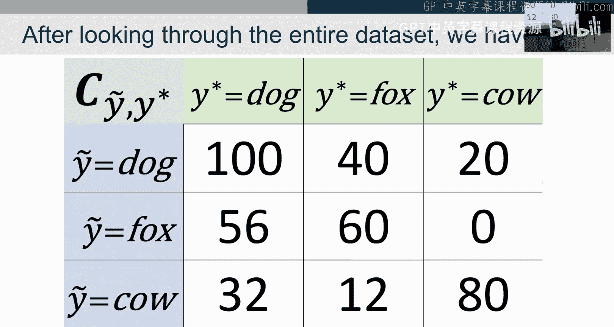

在本节课中，我们将深入学习置信学习算法的工作原理，探讨其理论依据，并了解如何将其应用于大语言模型和生成式AI等实际场景。

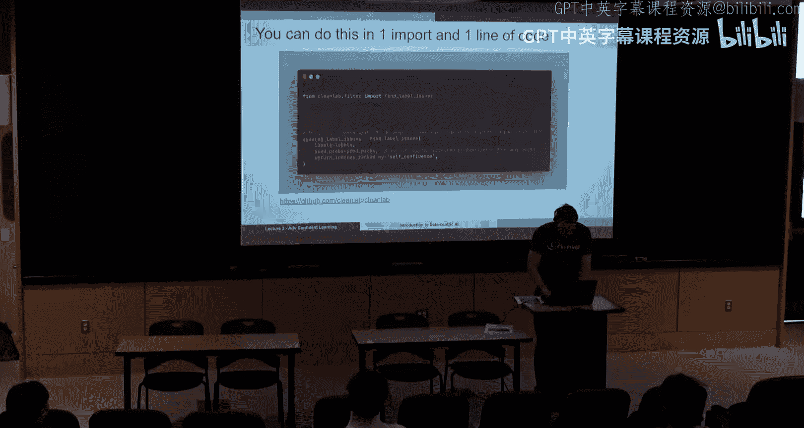

上一节我们介绍了置信学习的基本算法流程，本节中我们来看看为什么这个算法是有效的，以及在特定条件下它为什么是正确的。

## 算法回顾与误差排序

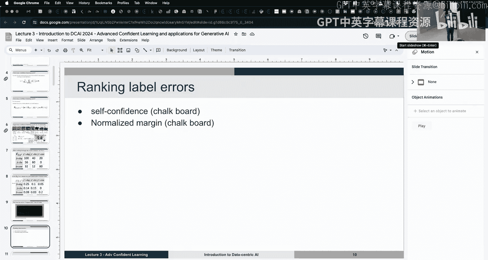

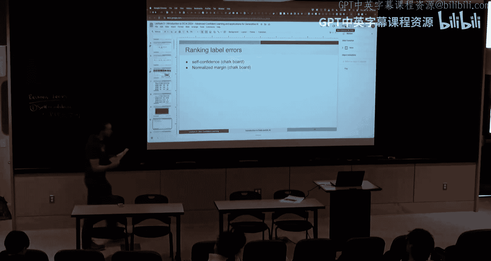

我们首先回顾一下上一讲的核心算法。输入是带噪声的标签和模型预测的概率。我们计算了每个类别的置信度阈值。这些阈值提供了一个统计上的参考，用于判断模型对于某个类别的样本被正确标注的典型置信水平。

基于此，我们可以建立一个阈值规则：如果一个样本对于其给定标签的预测概率高于该标签的阈值，我们就认为它很可能确实属于这个类别。结合原始标签，我们就能构建出计数矩阵。

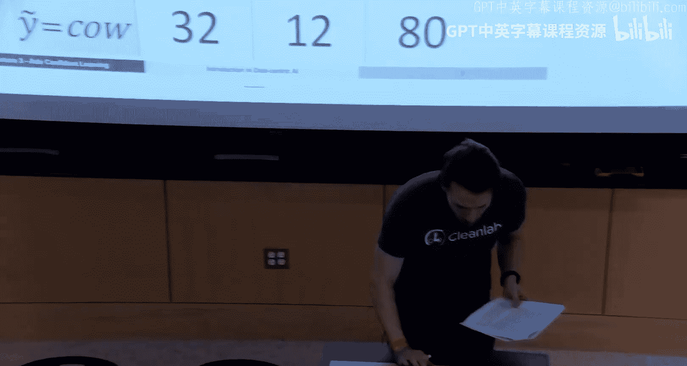

以下是构建计数矩阵的步骤：
1.  对于每个样本，检查其对于每个类别的预测概率是否大于该类的阈值。
2.  根据检查结果填充矩阵，其中非对角线上的元素代表我们估计的标签错误。
3.  对角线上的元素代表我们认为标注正确的样本。
4.  没有被任何类别高置信度包含的样本被视为离群值。

这个过程被称为“置信学习”，因为它为学习过程提供了我们确信标注正确的数据。

得到计数矩阵后，我们需要对识别出的标签错误进行排序，以确定哪些错误最需要优先处理。

以下是两种常用的排序方法：
*   **自信度**：对于一个给定的样本 `x` 及其给定标签 `ỹ`，我们查看模型预测该给定标签的概率 `P(ỹ | x, θ)`。概率越低，该样本是标签错误的可能性就越大。
*   **最大间隔**：对于一个给定的样本 `x` 及其给定标签 `ỹ`，我们计算 `P(ỹ | x, θ) - max_{j ≠ ỹ} P(j | x, θ)`。这个差值越小（甚至为负），说明模型越确信样本属于另一个类别，因此它是标签错误的可能性就越大。

## 寻找标签错误的多种策略

一旦我们通过计数矩阵估计出每个类别中的错误数量，就可以采用不同的策略来具体找出这些错误样本。

以下是三种常见的策略：
1.  **按噪声率剪枝**：对于每个类别 `i`，假设估计有 `E_i` 个错误。我们找出该类别中，模型对其给定标签预测概率 `P(ỹ=i | x, θ)` 最低的 `E_i` 个样本，将其标记为错误。
2.  **按类别剪枝**：针对计数矩阵中每个非零的非对角线条目（例如，有32个样本的真实标签估计是“狗”，但被标注为“牛”）。我们找出所有标注为“牛”的样本中，模型预测为“狗”的概率 `P(y*=”狗” | x, θ)` 最高的32个样本，将其标记为错误。
3.  **组合策略**：将上述两种（或多种）方法找出的错误样本列表进行布尔运算（如取并集或交集），可以得到置信度更高的错误集合。

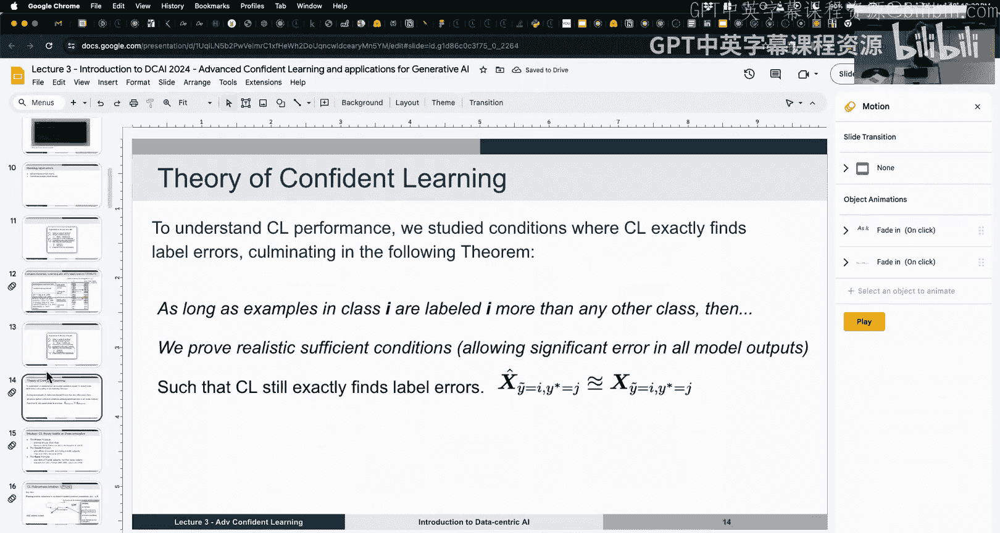

这些策略可以视为超参数，在实际应用中可以根据模型和数据集的特点进行选择和调整。

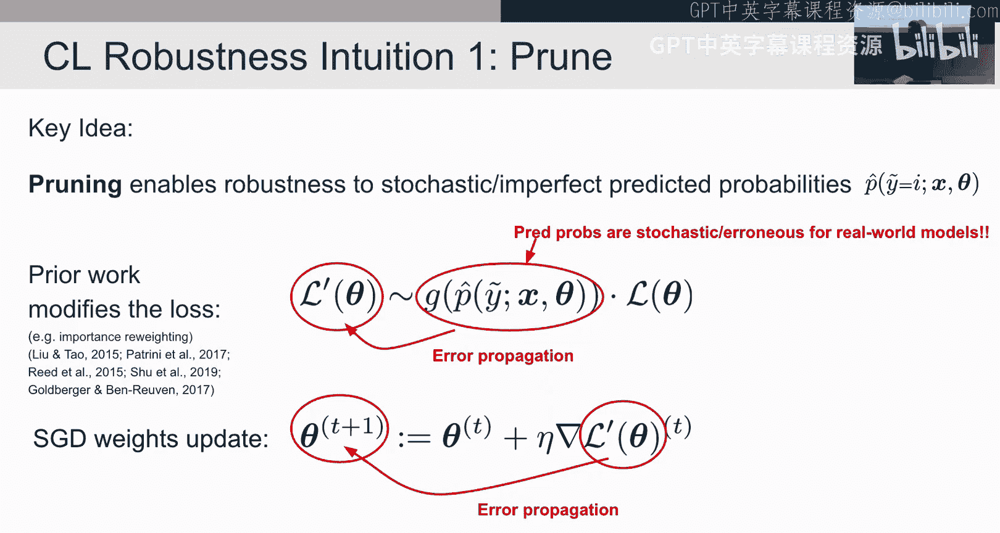

## 理论洞察：为何置信学习有效

现在，我们简要探讨一下置信学习算法有效的理论原因。关键在于，它通过使用“计数”而非“概率平均值”来规避模型预测的不确定性（认知不确定性）。

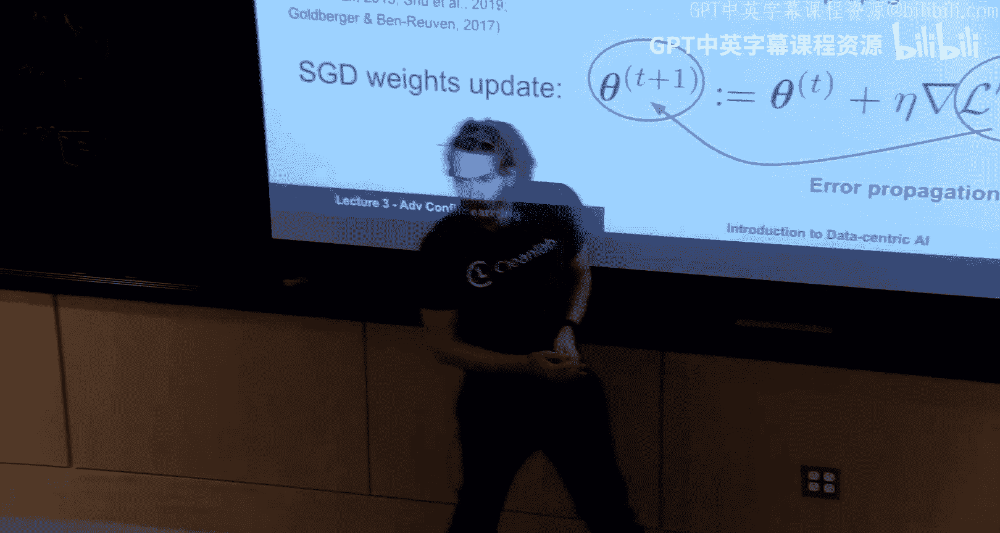

传统的损失重加权方法会将模型预测概率（包含误差）直接引入损失函数，导致误差在训练过程中传播。置信学习的核心思想是避免传播误差，而是直接移除或处理误差。

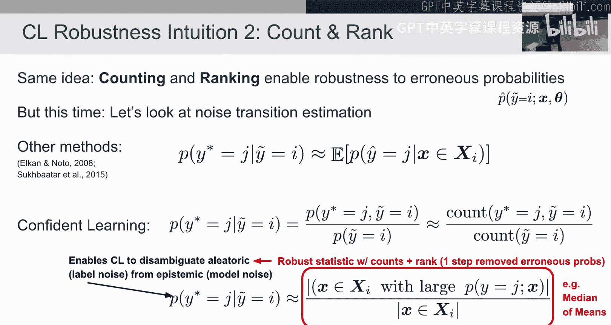

算法通过“大于阈值”的判断将样本放入不同的桶中，并统计数量。只要模型的预测不是完全错误的（即对于本应高置信的样本，其预测概率仍能超过阈值），即使预测概率值本身不精确，也能被正确归类。这种对阈值和计数的依赖，而非精确的概率值，提供了算法的鲁棒性。

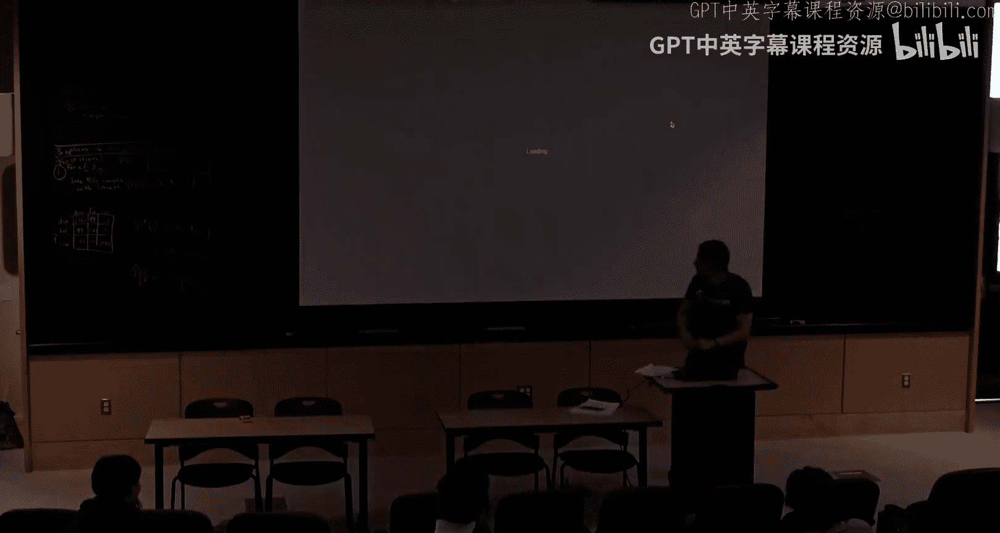

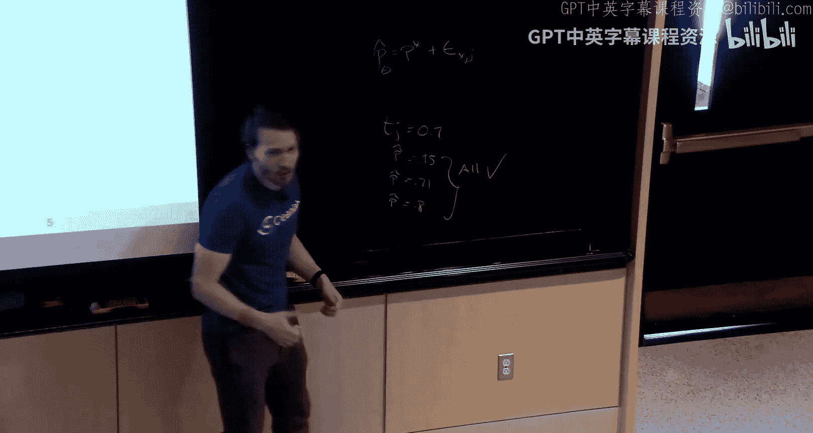

研究表明，在模型预测概率“完美校准”的理想条件下，置信学习算法可以精确地找出所有标签错误。更重要的是，即使模型存在系统性的过度自信或自信不足（这在实践中很常见），只要这种偏差是类别一致的，算法中的阈值调整机制也能与之抵消，从而仍然保持较好的错误检测性能。

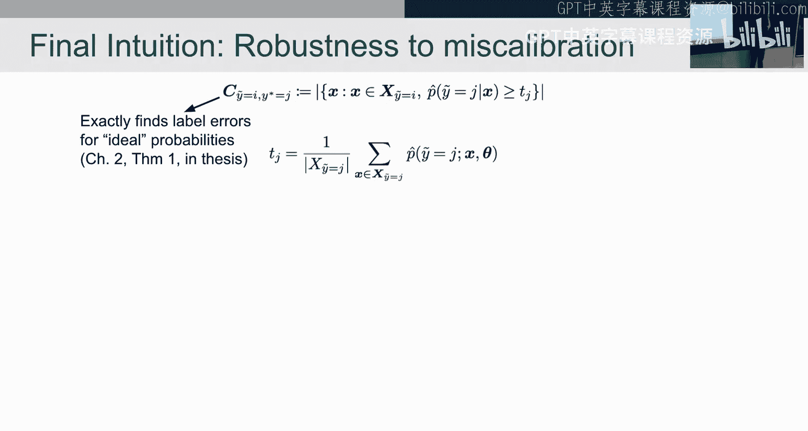

## 生成式AI与大语言模型中的应用

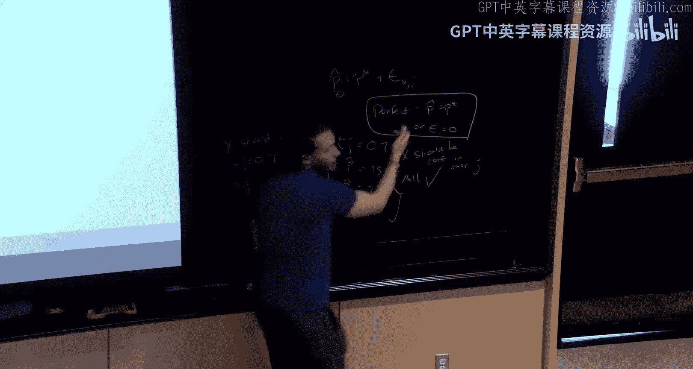

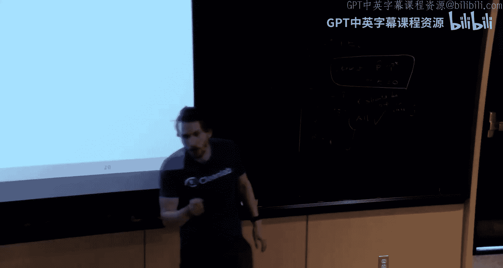

理论部分之后，我们来看看置信学习在生成式AI和大语言模型领域的应用。

在训练阶段，生成模型（如图像或文本生成模型）的输入数据可能存在标签错误、离群值等问题。使用置信学习清洗和改善训练数据标签，可以提升最终生成模型的质量。例如，已知一些开源大模型在训练时使用了大量未经验证的数据，其中包含许多错误。

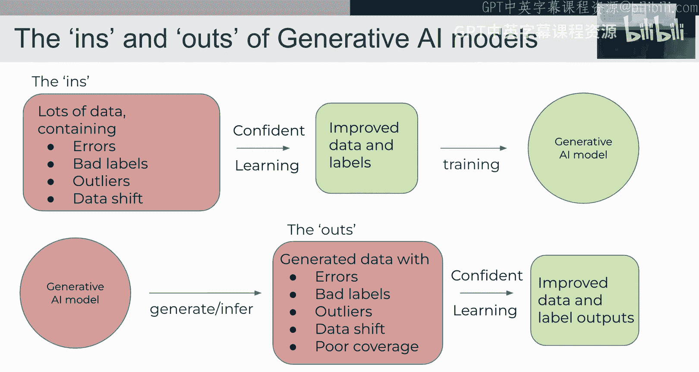

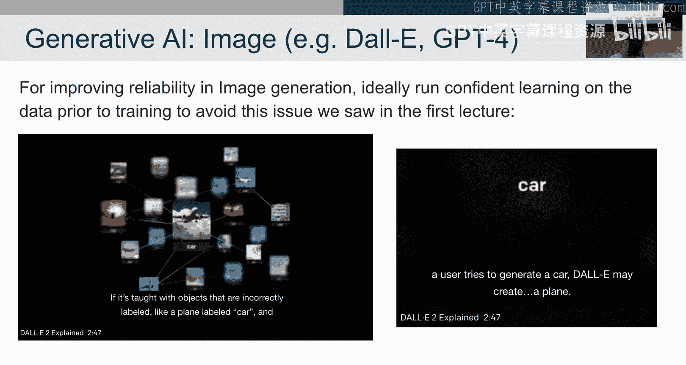

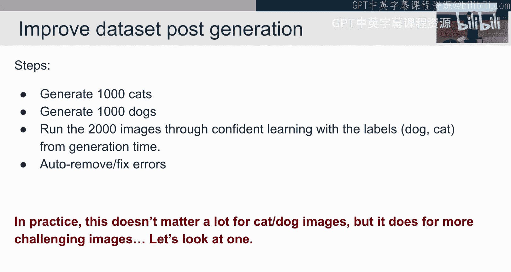

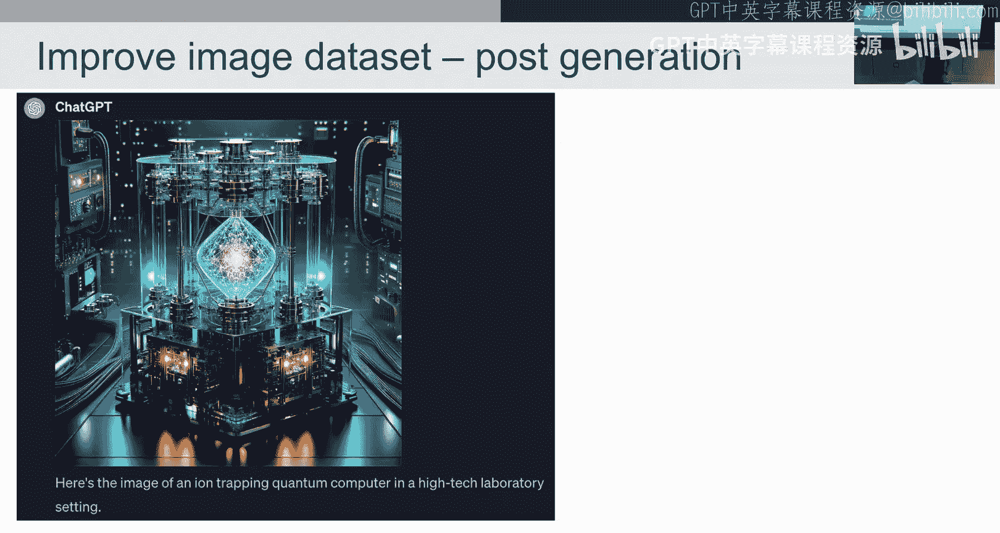

在推理和应用阶段，置信学习也能发挥作用：
*   **改善生成结果**：对于文本到图像生成模型，可以让其生成大量带有标签（如“猫”、“狗”）的图像，形成一个数据集。然后对此数据集运行置信学习算法，自动找出并修正标签错误的生成结果。通过迭代这个过程，可以提高模型后续生成结果的准确性。
*   **检索增强生成**：在RAG系统中，LLM根据查询从数据库中检索信息并生成答案（可视为标签）。可以对这些输入查询和输出答案对运行置信学习，以识别和排序RAG管道中可能存在的错误。
*   **评估大语言模型输出**：目前，像ChatGPT这样的大语言模型通常只提供输出，而不提供对该输出的置信度分数。置信学习的思想可以启发我们开发方法，为LLM的生成结果分配置信度或找出其中可能的事实性错误。

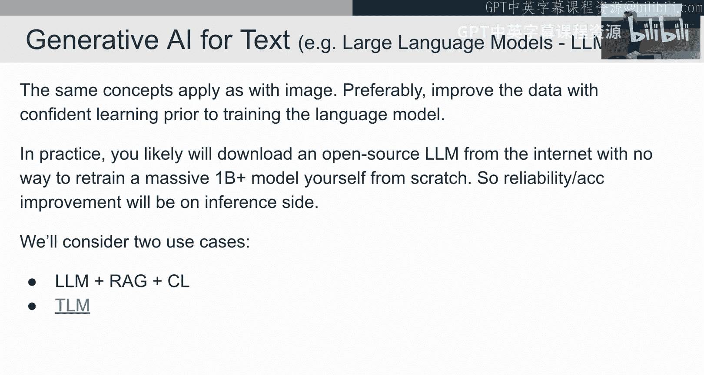

本节课中我们一起学习了置信学习算法的高级主题，包括误差排序策略、算法有效的理论原理，以及该技术在生成式AI和大语言模型中的实际应用前景。掌握这些知识，将帮助你更好地处理现实世界中的嘈杂数据，并构建更可靠的人工智能系统。