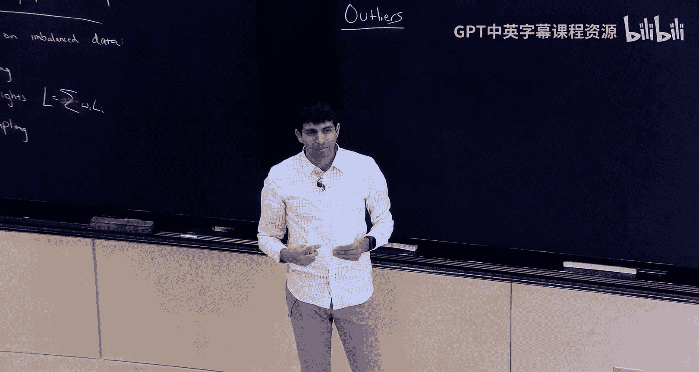
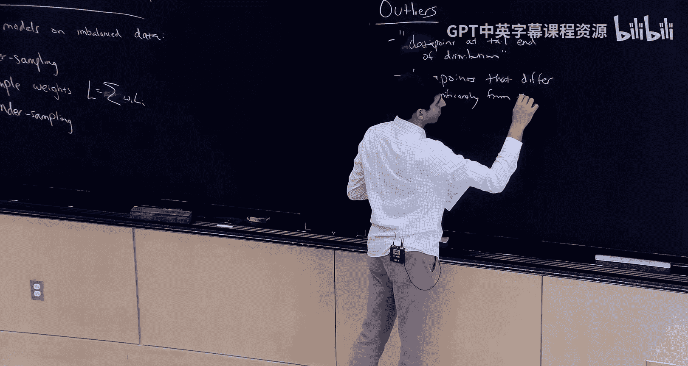
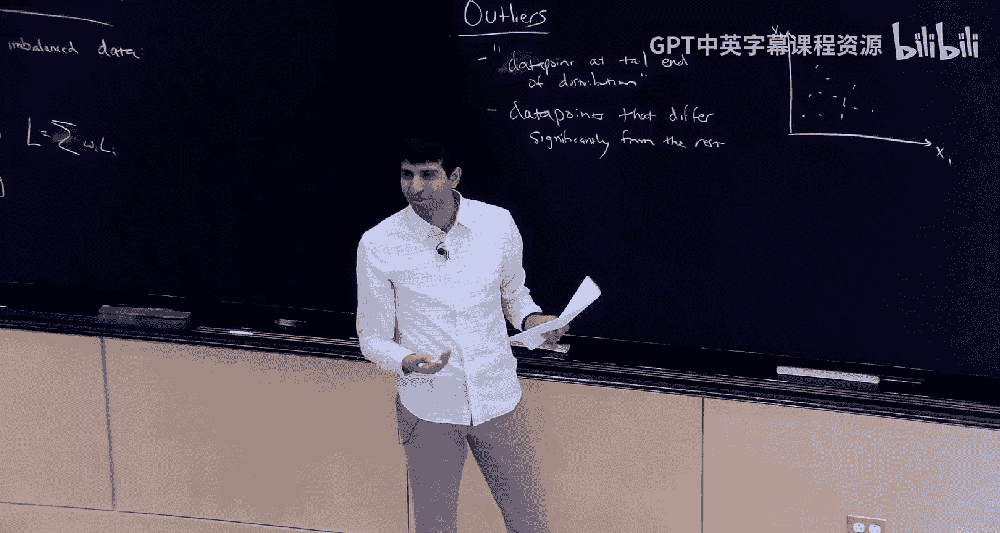
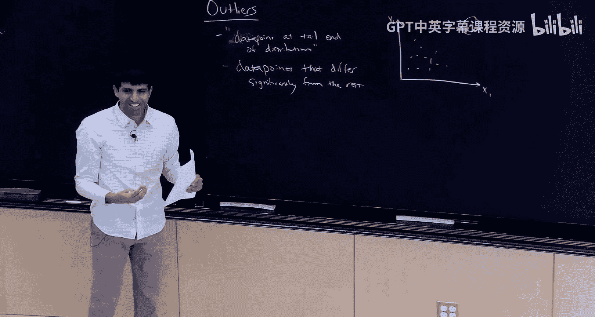
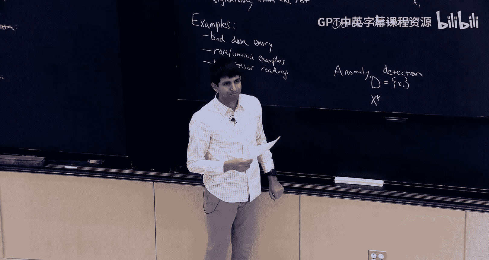
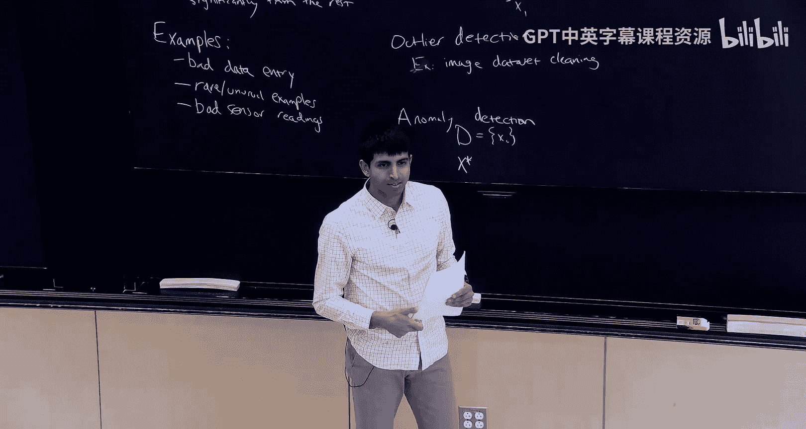
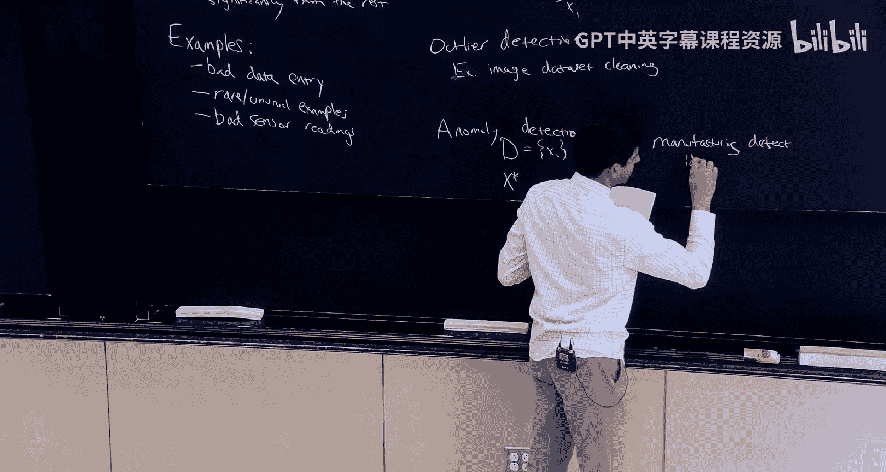
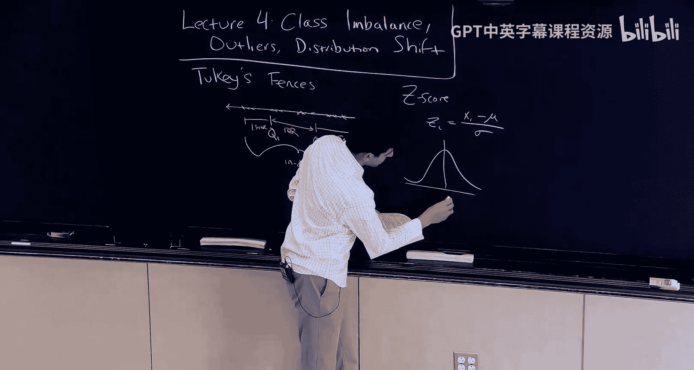
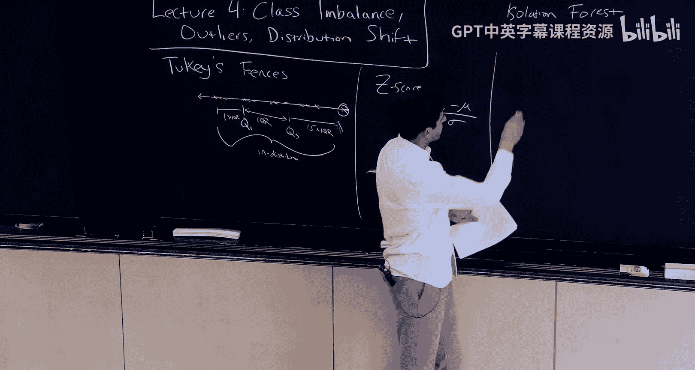
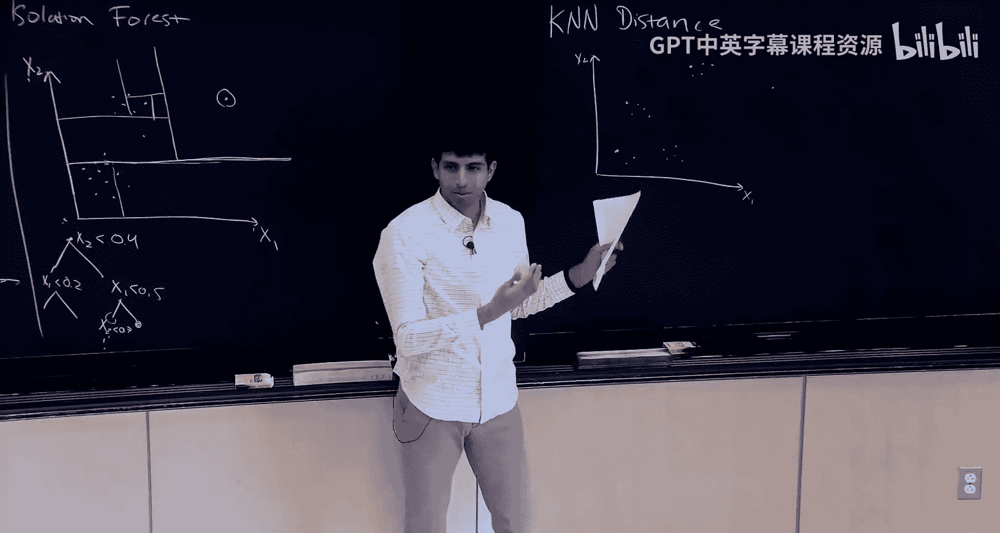

# 4：类别不平衡、离群值与分布偏移


在本节课中，我们将要学习机器学习实践中三个常见且重要的问题：类别不平衡、离群值检测与分布偏移。这些主题在入门课程中可能涉及不深，但在实际任务中几乎总会遇到。我们将逐一探讨它们的概念、挑战以及应对策略。

## 类别不平衡 🎯

上一节我们介绍了本课程将涵盖的三个核心问题。本节中，我们来看看第一个问题：类别不平衡。类别不平衡是指在一个分类任务（无论是二分类还是多分类）中，不同类别的样本在数据集和实际部署环境中的出现频率存在显著差异。

例如，在信用卡欺诈检测中，欺诈交易可能只占所有交易的 **0.2%**，而非欺诈交易占 **99.8%**。在疾病筛查或垃圾邮件分类中，也存在类似的极端不平衡情况。


### 评估指标的挑战

当面对类别不平衡问题时，首要任务是选择一个合适的评估指标。如果使用标准的准确率（Accuracy），一个总是预测“多数类”（如“非欺诈”）的模型就能获得极高的分数（如 **99.8%**），但这显然是一个无用模型。因此，我们需要更细致的指标。

以下是两个在二分类任务中常用的核心指标：

*   **精确率（Precision）**：在所有被模型预测为“正类”的样本中，真正是正类的比例。公式为：
    `Precision = TP / (TP + FP)`
    它衡量了模型预测结果的“纯净度”。

*   **召回率（Recall）**：在所有真实为正类的样本中，被模型成功找出的比例。公式为：
    `Recall = TP / (TP + FN)`
    它衡量了模型找出正类样本的“全面性”。

选择哪个指标取决于具体任务对错误类型的容忍度。

以下是不同任务对指标选择的示例：

*   **高召回率场景（如疾病检测）**：宁可误判健康人为患者（假阳性），也绝不能漏掉真正的患者（假阴性）。因为漏诊的代价远大于误诊。
*   **高精确率场景（如代码缺陷自动检测）**：模型标记出的每一个可疑点都需要开发者人工审查。如果标记了大量无问题的代码（假阳性），将严重浪费开发时间。

为了平衡精确率和召回率，可以使用 **F分数（F-score）**，它是两者的调和平均数。更通用的 **Fβ分数** 允许通过参数 β 来调整对两者的偏重：
`Fβ = (1 + β²) * (Precision * Recall) / (β² * Precision + Recall)`
当 β=1 时，即为标准的 F1 分数；β>1 时更看重召回率；β<1 时更看重精确率。

### 模型训练策略


确定了评估指标后，我们需要在模型训练阶段采取特殊策略来应对类别不平衡。







以下是几种常用的技术：






*   **过采样（Oversampling）**：在训练集中复制少数类样本，增加其出现频率，使模型更好地学习其特征。**注意**：需在划分训练/测试集后进行，且仅对训练集操作，避免数据泄露。
*   **欠采样（Undersampling）**：随机丢弃一部分多数类样本，使数据集更平衡。在极端不平衡时，可能会丢弃大量数据。
*   **损失函数加权**：在训练时，为不同类别的样本分配不同的权重，提高少数类样本在损失计算中的重要性。许多机器学习算法支持传入样本权重。


## 离群值检测 🚨

上一节我们探讨了类别不平衡问题及其解决方法。本节中，我们来看看第二个主题：离群值。离群值是指与数据集中其他样本显著不同的数据点。人类通常能直观识别离群值，但我们需要系统性的算法来自动化这一过程。

离群值可能由多种原因导致，例如数据录入错误、罕见的真实事件、传感器故障读数等。识别离群值很重要，因为它们可能损害模型性能，或者其本身（如果是罕见真实事件）就具有特殊价值。


### 离群值检测 vs. 异常检测



这两个概念密切相关但略有区别：


*   **离群值检测**：给定一个数据集，找出其中与其他样本显著不同的点。例如，在一个图像数据集中找出模糊或损坏的图片。
*   **异常检测**：给定一个代表“正常”分布的数据集，以及一个新的数据点，判断该新点是否属于这个分布。例如，在工业生产中，根据正常产品样本，判断新生产的产品是否为缺陷品。








可以通过将新数据点加入“正常”数据集，然后运行离群值检测算法，来将异常检测问题转化为离群值检测问题。


### 检测算法



接下来，我们介绍几种从简单到复杂的离群值检测算法。


#### 简单方法：IQR 与 Z-Score




对于一维数据，有一些简单有效的经验法则：

*   **IQR 法（Tukey‘s Fences）**：计算数据的第一四分位数（Q1）和第三四分位数（Q3），得到四分位距 `IQR = Q3 - Q1`。通常将低于 `Q1 - 1.5*IQR` 或高于 `Q3 + 1.5*IQR` 的点视为离群值。
*   **Z-Score 法**：计算每个数据点的 Z 分数：`Z = (x - μ) / σ`，其中 μ 是均值，σ 是标准差。对于近似正态分布的数据，可以将 `|Z| > 3` 的点视为离群值。

#### 高级方法

对于更复杂的高维数据，我们需要更强大的方法。




*   **孤立森林（Isolation Forest）**：基于决策树的算法。其核心思想是：离群点更容易被随机划分的决策树快速“孤立”。算法构建多棵随机决策树，计算每个样本被孤立所需的平均路径长度，路径越短，越可能是离群值。
    ```python
    # 示例：使用 sklearn 的 IsolationForest
    from sklearn.ensemble import IsolationForest
    clf = IsolationForest(contamination=0.1) # 假设离群值比例约10%
    clf.fit(X_train)
    outliers = clf.predict(X_test) # 返回1表示正常，-1表示异常
    ```

*   **K-近邻距离（K-Nearest Neighbors Distance）**：计算每个数据点到其 K 个最近邻点的平均距离。离群点通常距离其邻居较远，因此该距离值会很大。为了在像图像这样的复杂数据上使用，通常先使用嵌入表示（如通过预训练模型或自编码器提取的特征），再计算距离。
    ```python
    # 示例：使用 KNN 计算异常分数
    from sklearn.neighbors import NearestNeighbors
    import numpy as np
    knn = NearestNeighbors(n_neighbors=5)
    knn.fit(X_embedded)
    distances, _ = knn.kneighbors(X_embedded)
    anomaly_scores = np.mean(distances, axis=1) # 平均距离作为异常分数
    ```

*   **自编码器重构误差（Autoencoder Reconstruction Error）**：自编码器由编码器和解码器组成，旨在将输入压缩为低维表示后再重构回来。在正常数据上训练自编码器后，它能够较好地重构正常样本。对于离群点，其重构误差（输入与输出之间的差异，如均方误差）会显著更大。
    ```python
    # 示例：计算自编码器重构误差
    # 假设 `autoencoder` 是已训练好的模型，`data` 是输入数据
    reconstructed = autoencoder.predict(data)
    reconstruction_error = np.mean((data - reconstructed) ** 2, axis=1)
    # 误差大的样本可能是离群值
    ```

## 分布偏移 🔄

由于时间关系，关于分布偏移的详细讨论将延后到未来的课程中。简单来说，分布偏移是指模型训练时所依赖的数据分布，与模型实际部署时遇到的数据分布发生了变化。这会导致模型性能显著下降。常见的类型包括协变量偏移（输入特征分布变化）、标签偏移（输出标签先验分布变化）等。应对策略包括领域自适应、持续学习以及在数据收集阶段确保代表性。

## 总结 📝

本节课中我们一起学习了机器学习中的三个关键实践问题。

1.  **类别不平衡**：我们认识到在如欺诈检测等任务中，简单使用准确率是无效的。必须根据业务需求选择合适的评估指标（如精确率、召回率、F分数），并在训练中采用过采样、欠采样或损失加权等策略。
2.  **离群值**：我们区分了离群值检测和异常检测，并学习了一系列检测算法，从简单的 IQR 法到适用于高维数据的孤立森林、K-近邻距离和自编码器方法。
3.  **分布偏移**：我们了解到数据分布随时间或环境变化是实际部署中的主要挑战之一，其系统性的解决方法将在后续课程中探讨。

掌握这些概念和技术，将帮助你构建更鲁棒、更实用的机器学习系统。