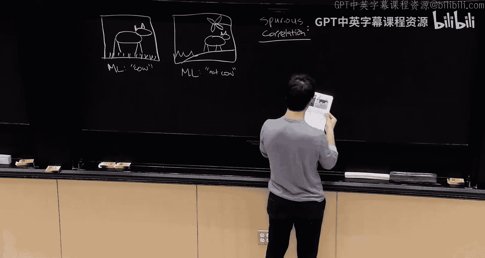

# 5：数据集创建与整理

在本节课中，我们将要学习如何为机器学习项目获取和整理数据。数据是构建任何人工智能产品或机器学习应用的基础，其质量直接决定了最终模型的性能。我们将探讨如何思考数据来源、如何获取标注、如何确保我们为机器学习整理的是正确的数据。

## 数据获取的关键问题

在开始任何机器学习项目之前，甚至在拥有任何数据之前，有两个关键问题需要始终思考。

首先，你的模型将如何被使用？这意味着我们需要考虑预测的目标人群以及预测发生的时间点。深入思考最终的使用场景将指导我们以正确的方式收集训练数据。

其次，需要考虑一些假设情况，例如边缘案例和高风险场景。在这些情况下，模型必须做出正确的预测，这些特定用例比其他情况更为重要。

第三，在获取训练数据时，需要考虑数据中可能出现的问题。例如，重复数据是一个在许多数据集中普遍存在且容易被忽视的问题。在项目初期就检查并处理此类问题至关重要。

## 理解选择偏差与伪相关

为了强调这些问题的重要性，让我们思考一个图像分类任务。

假设我们有一张田野中奶牛的照片，一个机器学习模型基于某些数据训练后，正确地将其预测为“奶牛”。然后我们还有另一张海滩的照片，以及另一张奶牛的照片。然而，模型却将海滩上的奶牛预测为“非奶牛”。

为什么模型能正确预测田野中的奶牛，却无法识别海滩上的奶牛呢？原因在于训练数据。训练数据中的奶牛总是与草地和牧场相关联，而没有任何奶牛在海滩上的例子。机器学习模型本质上是模式检测器，它们会寻找训练数据中存在的任何简单模式来降低训练损失。这些模式被称为**伪相关**。

伪相关是存在于训练数据中，但并不真正代表部署期间将出现的正确预测模式的关联。模型会寻找任何能使其在训练数据上快速获得良好性能的“捷径”。我们必须确保训练数据中存在的任何模式，在测试数据中仍然有效。

更广泛地说，这个问题被称为**选择偏差**。选择偏差是指训练数据的分布不再代表你实际在应用中使用机器学习模型时将遇到的部署分布。

选择偏差非常棘手，一旦它潜入你的训练数据和问题设置中，很多时候几乎是无法挽回的。因此，首要任务是思考部署分布会是什么样子，并尽一切努力避免在收集训练数据时引入选择偏差。

## 选择偏差的常见原因

以下是导致训练数据与部署分布不匹配的一些常见原因：

*   **时间**：过去的数据（如用户行为）可能无法反映未来的情况。
*   **季节性效应**：节假日等因素会对模型产生巨大影响。
*   **地点/批次效应**：从一个地点（如一家医院）收集的数据可能无法代表所有地点。
*   **数据可得性**：人们倾向于从最容易获取的来源收集数据，但这可能无法匹配部署时的数据。
*   **人口统计学**：确保数据能代表最终使用模型的目标人群至关重要。
*   **罕见事件/长尾分布**：在训练数据中几乎从未遇到过的罕见情况，在部署时却可能很重要。

## 利用验证数据评估选择偏差的影响

我们无法总是修复所有选择偏差。有时我们只能获得带有偏差的训练数据，无法收集更多。这时，我们可以通过精心选择验证数据来评估选择偏差可能对机器学习性能产生的影响。

传统的做法是随机将训练数据分割为训练集和验证集。但在这里，我们需要有目的地、非随机地选择验证数据，以观察各种选择偏差来源对模型性能的影响。

以下是针对不同偏差类型设计验证集分割的策略：

*   **针对时间偏差**：将所有最近的数据作为验证集。例如，将截止到某个时间点的数据作为训练数据，之后的数据作为验证数据，以评估模型对未来数据的泛化能力。
*   **针对地点偏差**：保留整个地点（如整个医院）的数据作为验证集。甚至可以更激进地，将具有某些地理特征（如整个半球）的数据完全从训练集中剔除，以观察性能下降的程度。
*   **针对罕见事件**：在验证集中放入比训练集中更多的罕见事件样本。这实际上加剧了训练数据中事件的稀有性，从而更准确地衡量模型在面临罕见事件时的性能差距。

这些内部评估的目的是在部署前，基于我们对可能存在的选择偏差形式的了解，来预估机器学习模型在部署时可能受到的影响程度。

## 估算所需数据量

在规划阶段，一个重要的基础问题是：我们需要多少数据才能达到目标准确率（例如95%）？这关系到数据收集的成本和时间。

假设我们已经有一些训练数据，样本量为 `n`。我们可以使用以下策略来估算达到目标准确率所需的数据量：

1.  在完整数据集的子集上训练模型。例如，取10%的数据训练模型 `M1`，并在一个固定的验证集上评估其准确率。
2.  重复此过程，使用逐渐增大的数据子集（如20%，30%...）训练模型 `M2`, `M3`...，并记录每个模型在相同验证集上的准确率。
3.  由于机器学习训练具有随机性，可以对每个数据量进行多次重复实验，得到一系列观测点。

现在的问题是：如何根据这些观测点，估算需要多少倍的数据量才能达到目标准确率？简单地使用黑盒机器学习模型（如神经网络）进行外推效果不佳，因为这本质上是一个需要外部知识的大范围外推问题。

我们可以引入一个描述模型误差随数据量变化规律的公式。这个公式是一个幂律关系：

`log(Error) = A * log(Sample Size) + B`

其中，`Error` 是模型的误差（例如 1 - 准确率），`Sample Size` 是训练数据量，`A` 和 `B` 是常数。

这个关系在经验上广泛存在。其直觉来源于机器学习本质上是估计条件平均值。以估计一个正态分布的平均值为例，估计的均方误差的期望恰好是数据方差除以样本量，这与上述公式形式一致。

知道了这个基本关系后，我们就可以基于已收集的观测点，通过拟合一条服从该关系的曲线来估计常数 `A` 和 `B`，进而外推达到目标准确率所需的数据量倍数。

## 数据标注与共识标签推断

获取数据后，下一个问题是如何为监督学习任务（如分类）获取标注。通常，我们会使用一个标注员团队来完成这项工作。

假设我们有三个标注员 `A1`, `A2`, `A3`，以及一批需要标注的图像（例如，自动驾驶场景中区分“人”和“车”）。由于标注预算有限，我们不会让每个标注员标注所有图像。

由此，我们面临三个核心目标：
1.  **确定共识标签**：每张图像应该使用什么标签？
2.  **估计置信度**：我们对每个共识标签的正确性有多大把握？
3.  **评估标注员质量**：哪些标注员做得好或不好？

### 简单方法：多数投票及其局限

最直接的方法是使用**多数投票**来确定共识标签。对于每张图像，统计所有标注员给出的标签，选择票数最多的那个。

基于此，我们可以：
*   **估计置信度**：使用标注员之间的一致性程度（即同意多数票的标注员比例）。
*   **评估标注员质量**：计算每个标注员在所有其标注过的、且有多于一个标注员的图像上，与多数票一致的频率。

然而，多数投票方法存在明显问题：
*   **忽视标注员能力差异**：将所有标注员视为同等可靠，但事实上专家和新手的标注质量可能天差地别。
*   **处理标注稀疏图像困难**：对于只有单个标注的图像，无法进行投票，也无法评估该标注的置信度。
*   **处理平局情况**：当两种标签票数相同时，多数投票无法给出结果。

### 改进方法：引入机器学习模型

一个更好的思路是引入一个训练好的机器学习（ML）模型作为额外的“标注员”。该模型会对每张图像 `i` 输出一个概率分布 `PM(yi)`。

我们可以利用模型预测来：
*   **打破平局**：在票数持平的情况下，选择模型预测概率更高的类别。
*   **增强稀疏标注图像的置信度**：对于只有单个标注的图像，模型的预测可以提供额外的参考信息。如果模型对某个预测非常自信，可能意味着它在训练中见过许多相似且标注良好的样本。

### C Lab方法：概率化集成

这引向了一种更高级的方法（如C Lab），它是一种概率化方法，用于同时估计共识标签、置信度和标注员质量。

基本思想是：
1.  将每个标注员 `j` 也视为一个“概率预测器”，为其构建一个概率分布 `PAj(yi)`，反映该标注员给出各类标签的倾向（例如，基于其历史标注与共识的一致性来估计）。
2.  将机器学习模型的预测 `PM(yi)` 和所有标注过图像 `i` 的标注员的预测 `PAj(yi)` 进行加权集成，形成最终的共识概率预测。

共识概率预测公式可以表示为：
`P_consensus(yi) ∝ w_M * PM(yi) + Σ_{j in J_i} w_j * PAj(yi)`

其中：
*   `w_M` 是机器学习模型的权重。
*   `w_j` 是标注员 `j` 的权重。
*   `J_i` 是标注了图像 `i` 的标注员集合。

共识标签就是 `P_consensus(yi)` 中概率最高的类别，其概率值即为置信度。标注员的权重 `w_j` 直接反映了其质量（权重越高，说明其标注越可靠）。

这种方法优雅地解决了多数投票的缺陷：它考虑了不同标注员的质量差异，能处理稀疏标注，并通过模型提供了数据特征空间上的泛化信息。

## 总结

本节课中我们一起学习了数据集创建与整理的核心内容。

我们首先强调了在项目初期思考模型使用场景和潜在偏差的重要性，并深入探讨了**选择偏差**和**伪相关**的概念及其危害。接着，我们学习了如何通过精心设计非随机的**验证集分割策略**来评估选择偏差对模型性能的潜在影响。

然后，我们探讨了如何基于现有数据，利用**误差随数据量增长的幂律关系**来估算达到目标性能所需的数据量，这对于项目规划至关重要。

最后，我们聚焦于数据标注环节，分析了使用标注员团队时面临的共识标签、置信度和标注员质量评估三大问题。我们从简单的**多数投票**方法出发，指出了其局限性，并介绍了通过引入**机器学习模型**和**概率化集成方法**（如C Lab）来更有效、更可靠地解决这些问题的先进思路。

这些关于数据获取、评估和标注的原则与实践，是构建高质量机器学习系统不可或缺的基石。