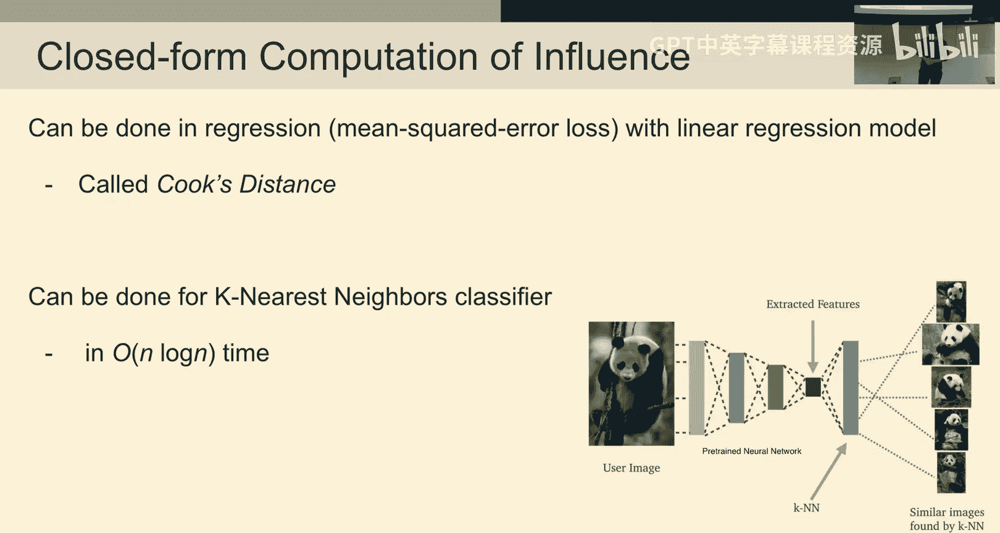

# 6：以数据为中心的机器学习模型评估

在本节课中，我们将要学习如何以数据为中心的角度来评估机器学习模型。我们将探讨标准的评估方法、常见的陷阱，以及如何处理模型在特定数据子群体上表现不佳的问题。我们还将学习如何衡量单个数据点对最终模型的影响。

## 概述：机器学习应用流程

首先，让我们退一步，思考典型的机器学习应用流程是怎样的。

你收集数据，探索数据以发现问题，将数据预处理成适合机器学习的格式，训练一个你认为性能尚可的机器学习模型。然后，你调查模型和数据集的缺陷，并希望使用我们教授的技术来改进数据，或者使用你在其他机器学习课程中学到的建模技术来改进模型。最后，部署模型并监控其在生产环境和新数据上的性能表现。

今天的讲座，我们将重点关注“改进模型和数据集的缺陷”这一环节。显然，要改进模型，我们首先必须能够评估它，这将是本课的主要议题。

## 模型评估基础

上一节我们介绍了机器学习应用的整体流程，本节中我们来看看模型评估的基础知识。

我们从标准的多类别分类任务开始。我们有一个训练数据集 D，样本量为 N。我们通常假设有特征 X 和标签 Y。在多类别分类中，每个数据点的标签是 K 个类别之一。我们假设它们是从特征和标签的某个底层联合分布中抽取的。

我们将使用这个数据集来训练一个模型。该模型在给定新特征值 X 时，应输出一个预测的类别概率向量，即该数据点属于每个类别的概率。通常，你会使用一个损失函数来训练这个模型，该损失函数应用于这些预测概率，并决定你如何优化模型以使其预测概率与训练数据中的标签相匹配。

这个过程的关键假设是：部署期间遇到的数据与训练数据来自相同的分布；训练数据被假定为独立同分布；每个示例恰好属于一个类别。

损失函数将评估模型对新示例的预测与其给定标签的差异。当损失函数作用于预测概率时，它通常需要是可微的，例如用于训练神经网络。但用于评估的损失函数可能与用于训练的损失函数不同。由于本讲座主要关于评估，我们将重点关注用作评估指标的不同类型的损失函数，这些函数不必是可微的。

通常，损失函数只是预测类别的函数，这涵盖了几乎所有标准的分类损失，如准确率、平衡准确率、精确率。损失函数也可以是预测概率的函数，这会导致更细粒度的性能度量，例如对数损失、ROC曲线下面积以及校准度。

我们希望用一个数字来总结模型在所有数据上的好坏程度，但这通常不是一个好主意。典型的总体得分只是许多在训练期间被保留的示例（即验证集或测试集）上的平均损失。或者，你可以将损失分解为更细粒度的度量，例如查看每个类别的准确率，或者报告完整的混淆矩阵。

## 评估中的常见陷阱

上一节我们介绍了基础的评估指标，本节中我们来看看评估机器学习模型时常见的陷阱。

第一个常见的陷阱是未能使用真正保留的数据。机器学习与优化的关键区别在于，机器学习的目标是泛化，而不仅仅是优化训练数据上的损失。但在实践中，即使你试图确保进行数据分割，也经常会发生数据泄露。

第二个重大陷阱是仅报告平均损失，这会掩盖特定罕见示例或你可能更关心的子群体的严重失败案例。

回到选择偏差问题，验证数据可能无法代表你的部署环境，这是另一个常见陷阱。此外，你用于评估的一些标签可能不正确。

随着机器学习日益普及，许多科学领域也开始大量使用机器学习。人们试图复现这些使用机器学习的科学论文时，经常发现数据泄露问题无处不在。数据泄露可能非常微妙，通常是训练数据中的某些信息为你测量的测试性能提供了不公平的优势。

## 文本生成模型的评估

上一节我们讨论了分类任务中的评估，本节中我们来看看更复杂的文本生成模型（如大型语言模型）的评估。

如何评估这类模型是一个非常开放且棘手的问题。一种黄金标准方法是人工评估，通常被称为“感觉检查”，即浏览输出并给出评分。

或者，你可以使用人工智能或大型语言模型来尝试进行评估。这通常通过向模型提供一系列预定义的二元标准来实现，然后总结成一个分数。这种方法与人工评估相关性很高，但在处理那些质量极高或极低但方式微妙的案例时，往往无法捕捉。

另一种流行的评估方法是，如果你有目标响应，可以尝试测量文本生成模型的响应与这些黄金标准目标响应之间的文本相似性。这可以通过基于词重叠或子词重叠的各种统计量来捕获。但这远非完美，因为基于短语的匹配不一定能捕捉到真正的语义。

与分类中“给定类别标签的概率”类似的概念是文本生成中的“困惑度”。文本生成模型通常测量给定已生成标记和用户输入条件下，下一个词或标记的概率。你可以测量整个响应的对数概率，这就是困惑度。显然，你需要根据响应长度进行归一化。

响应长度是许多评估指标的一个巨大混杂因素。较长的响应往往获得更好的评估分数。此外，数据泄露问题在这里变得十倍棘手，因为这些模型已经在整个互联网和大量专有秘密数据集上进行了训练，很难确定你的评估数据是否在训练期间已经被见过。

## 处理表现不佳的子群体

上一节我们探讨了文本生成的评估挑战，现在让我们回到分类任务，看看如何处理模型在特定数据子群体上表现不佳的问题。

我们可以将子群体想象为数据集中存在的、共享我们可能关心的共同特征的子集。例如，使用一个传感器与另一个传感器捕获的数据，或在一家医院与另一家医院的数据。在人类数据中，种族、性别、社会经济地位等人口统计因素通常非常重要。

关键是我们不希望模型预测过多依赖于数据点属于哪个切片。一个想法是，如果我们测量了这些因素，比如人口统计因素，我们是否可以在训练机器学习模型之前从特征中删除所有这些因素？这并不总是一个好的解决方案，因为其他特征值可能与这些人口统计特征相关。此外，如果某个子群体的数据量少得多，模型可能只是在该子群体上表现不佳，而删除这些信息甚至无法让我们知道问题存在。

因此，常见的做法是不将这些特征作为模型进行直接预测的直接输入，但将其保留在数据中用于评估，以评估模型对这些不同切片的敏感性。

## 改进子群体性能的方法

上一节我们定义了子群体及其重要性，本节中我们来看看如何改进模型在特定子群体上的性能。

首先，考虑使用更强大的机器学习模型。如果线性模型在某个数据切片上表现不佳，而非线性、更灵活的神经网络可能能够更好地近似相关的决策边界，从而在该切片上获得更好的性能。

其次，你可以尝试对特定切片中的示例进行加权。如果某个子群体（如数据中的少数亚组）数据量不足，这是一种常见技术。许多机器学习模型允许你指定每个数据点的权重。或者，你可以简单地在训练集中对示例进行过采样。

第三，收集更多数据。如果你能够为性能不佳的子群体收集更多数据，那会好得多。你可以应用之前讲座中提到的技术，仅在该子群体的数据上估计需要多少数据才能达到某个性能水平。

第四，尝试收集额外的特征。也许问题在于我们没有测量足够的特征。我们可以尝试出去收集额外的特征，这些特征专门允许模型在特定的数据切片上表现更好。这与尝试测量能使模型整体表现最佳的特征不同，这里可能更有针对性。

## 发现表现不佳的子群体

上一节我们讨论了如何改进已知子群体的性能，但首先我们如何发现这些表现不佳的子群体呢？

在图像数据等没有自然划分的数据集中，如何思考是否存在需要关注的重要子群体？一种常见的方法是发现表现不佳的子群体，即对所有验证集中的数据按模型预测的损失进行排序，然后查看损失最高的示例，即模型预测最差的地方。这被称为错误分析。

在这些接收模型糟糕预测的示例集合中，我们可以应用聚类。聚类是试图找到具有相似特征值的子群体。当我们对此进行聚类时，将揭示这些示例中常见的主题集群，这些集群可能揭示了模型正在努力应对的潜在概念，或者自然地对应于接收整体糟糕预测的数据子群体。

这引出了切片发现的概念，即找到数据中有意义的切片，特别是模型表现严重不佳的切片。有各种方法可以做到这一点，但这里概述的简单程序是一种非常基本的方法。一个问题是它在进行聚类时没有考虑预测的质量。因此，你可能希望在聚类中考虑预测的质量，甚至更细粒度地，在进行聚类时考虑被预测的类别。

## 诊断单个错误预测

上一节我们从子群体层面缩小到更细的粒度，本节中我们进一步深入到单个数据点，诊断模型为何在某个特定预测上出错。

模型在单个预测上出错的首要原因可能是标签不正确。此时建议的操作就是纠正标签。

另一个可能的原因是数据点实际上不属于任何类别。对于此类示例，我们可以考虑将其从数据中排除，或者考虑添加一个“其他”类别或垃圾类别。

如果示例是一个离群值，即训练数据中没有与之相似的示例。如果这个离群值确实属于某个类别，我们真正应该尝试做的是收集更多看起来与此相似的数据，使其不再那么离群。或者，完全改变问题的特征空间，使这个离群值不那么离群。我们也可以删除特征，或者添加合成数据。

模型出错的另一个原因是所使用的模型类型对此类示例来说只是次优的。如何诊断这一点？我们可以尝试对这些示例进行加权或多次复制，看看模型现在是否能更好地分类这些示例。在这种情况下，我们真的需要使用以模型为中心的工具包。如果发现所使用的模型类型不适用于此类数据，可以尝试不同种类的模型、超参数调优、特征工程，也可以集成多个模型。

最后，回到特征空间中数据点重叠的散点图，这个数据点被预测错误很可能是因为数据中某个地方存在另一个看起来基本完全一样但标签完全不同的数据点。你可以尝试在注释者的说明中更清晰地区分类别，或者尝试用额外的特征来丰富数据。

## 衡量数据点的影响力

上一节我们讨论了如何诊断单个错误，本节中我们将转向理解数据对最终模型的影响，这是一种以数据为中心的视角。

从经济学的角度来看，我们可以想象我们实际上在补偿人们提供数据。我们训练一个基于累积数据的机器学习模型，该模型基于这些数据获得一定的性能。问题是我们应该如何为这些数据分配价值？一个经典的衡量标准是：如果我从数据中省略一个数据点，模型会如何变化？这通常对应于为该数据点分配一定的影响值。

但仅省略一个数据点并重新训练可能不是最佳方法。一是成本极高，二是可能无法捕捉数据点之间的协同效应。为了弥补这一点，我们引入了数据沙普利值的概念。这源于经济博弈论，沙普利值是衡量团队中每个成员贡献价值的一种方法。

其思想是，我们计算每个数据点的影响，但不是在整个数据集上，而是在数据集的子集上。我们从该子集中删除一个数据点，并衡量其在那个数据子集上下文中的影响。真正的沙普利值会衡量每个数据点在与任何可能的其他数据点子集配对时，对机器学习模型提供的价值，然后对所有可能的子集进行平均。

然而，这种方法计算上不可行。一个简单的近似方法是取 T 个随机数据子集，然后根据包含该数据点的子集上训练的机器学习模型的平均准确率与不包含该数据点的子集上的平均准确率之差，来衡量数据点的影响力。这是对影响力的蒙特卡洛近似，是一种非常常用的衡量数据点对训练后机器学习模型影响的方法。

最后需要指出，对于某些特定类型的机器学习模型，如线性回归，有更高效的方法来计算这种影响力。

## 总结

本节课中，我们一起学习了以数据为中心的机器学习模型评估方法。

我们回顾了标准的评估流程和指标，指出了仅依赖单一平均指标的常见陷阱。我们探讨了在开放域文本生成等复杂任务中评估的挑战。我们深入研究了模型在特定数据子群体上表现不佳的问题，并学习了如何发现这些子群体以及通过加权、收集更多数据或增加特征等方法来改进性能。我们还学习了如何诊断单个错误预测的原因。最后，我们介绍了衡量单个数据点对模型影响力的概念，特别是沙普利值框架及其实际近似方法。

理解如何正确评估模型是确保其在实际应用中带来价值的关键第一步，而深入分析模型在不同数据切片上的表现以及数据点的影响力，是进行有效数据改进的基础。