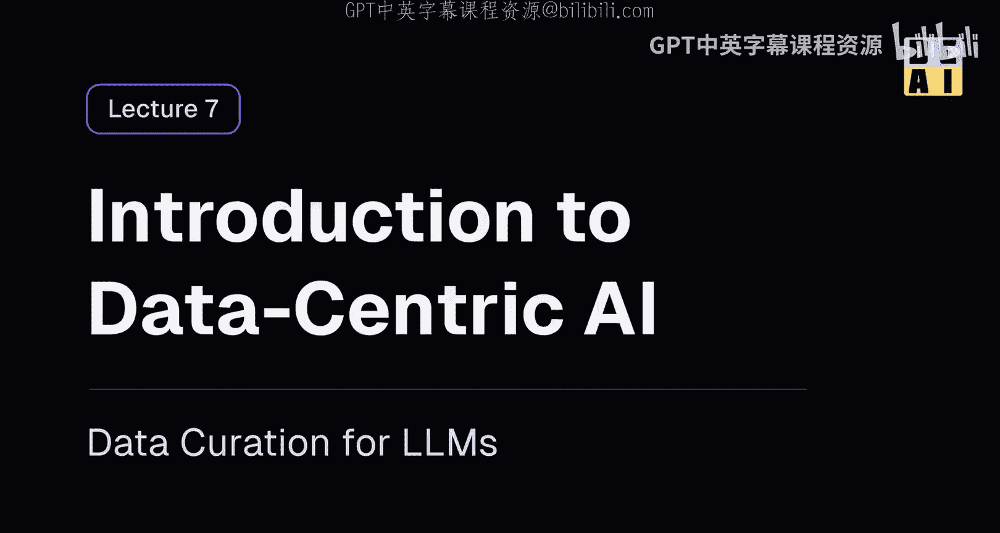
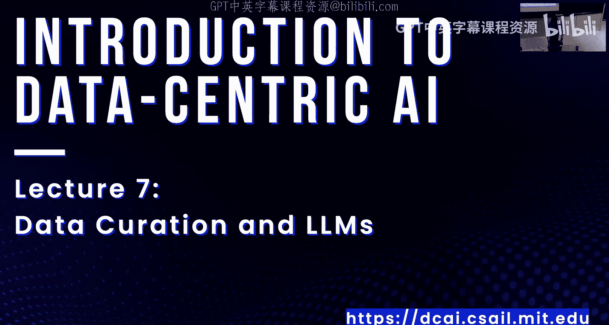
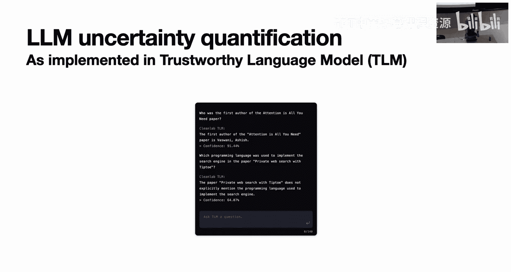
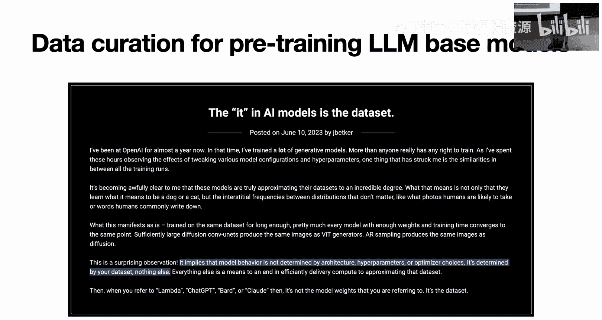
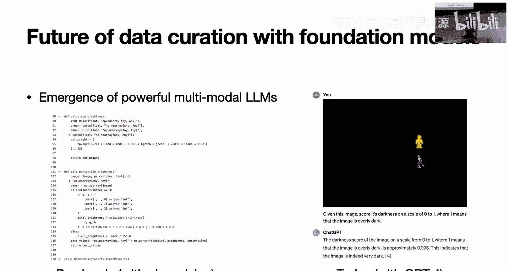

# 7：大语言模型的数据整理





在本节课中，我们将要学习大语言模型与数据整理之间的双向关系。我们将探讨如何利用LLM来辅助数据整理工作，以及如何为训练LLM本身进行数据整理。

## 概述

大语言模型是强大的自然语言推理引擎。它们易于针对新用例进行定制，在时间和计算成本上都相对低廉。这正在彻底改变我们处理文本数据集整理的方式。本节课我们将首先快速回顾LLM的背景知识，然后深入探讨其在数据整理中的应用、如何评估其输出，以及如何为训练LLM进行数据整理。

## LLM背景知识快速回顾

在深入细节之前，我们先快速了解一下大语言模型。

从高层次看，语言模型是一个序列到序列的模型，其训练目标是预测序列中的下一个词或标记。它模拟一个概率分布：给定一个句子或标记序列的前缀，它会告诉你下一个可能出现的词的概率分布。

LLM中的第一个“L”代表“大”。人们发现，增加模型容量，即拥有极高容量的模型，然后在海量数据集上进行训练，似乎能带来一些在小规模模型中不存在的有趣能力。因此，过去几年的重大创新主要在于规模化扩展。

这些大语言模型可用于解决各种自然语言处理任务，只需在其基础上进行少量工作，就能作为解决各类有趣任务的基础。

以下是LLM的一些常见应用示例：

*   **零样本提示**：LLM内置了大量的世界知识和理解。对于某些任务，你甚至不需要像传统机器学习那样收集数据集和训练模型，只需以正确的方式设置提示，模型就会给出答案。
    *   **示例**：要求模型“在保留原意的前提下，移除给定句子中所有关于性别的指代”。模型成功将“she”替换为“they”，将“her”替换为“their”。
*   **少样本提示（上下文学习）**：对于一些更复杂的应用，仅描述任务可能不够。但为LLM提供几个输入-输出对的示例，就足以获得高质量的结果。
    *   **示例**：通过示例编程，让模型理解文件重命名的模式（例如，移除“1080p”后缀，删除以“1”开头的文件等），然后对未见过的输入给出相应输出。
*   **检索增强生成**：LLM在公共数据上训练，不了解公司内部文档。RAG将检索系统与LLM结合：给定查询，从格式适当的文档数据库中查找最相关的片段，然后将这些片段与查询一起输入LLM以生成最终响应。
*   **微调**：从现有的神经网络开始，可能对网络结构进行一些小调整，然后使其适应不同的数据集。如果你有大量输入-输出示例，微调通常能为特定任务带来比少样本提示更好的结果。

这四种应用方式从左到右，所需投入的工作量递增。零样本提示只需一秒；少样本提示可能需要几个数据点；微调则需要收集数百或数千个数据点并使用GPU训练数小时。但即使是微调，其计算成本也在数百或数千美元量级，而非从头训练一个基础模型所需的数百万美元。

## 利用LLM进行数据整理

LLM是强大的工具，可以系统性地帮助我们完成数据收集和整理工作。以下是一些具体的应用示例。

### 示例一：检测个人身份信息

你可能希望避免在包含个人身份信息的数据上训练机器学习模型。原因之一是机器学习模型可能会泄露其训练数据，存在隐私风险。因此，你需要检测并处理PII。

过去，人们处理PII的方式是手动思考所有可能出现在数据中的PII类型，并编写正则表达式来查找它们。这种方式存在缺点：需要明确枚举所有PII类型，确保没有遗漏，并且编写这些正则表达式本身工作量巨大。

现在，利用大语言模型，你可以在几秒钟内完成这项工作，而无需思考所有可能的PII类型，因为语言模型对什么是PII有很好的理解。

以下是用于检测文本中PII的提示词示例：
```
考虑以下产品评论：[在此处注入文本]。告诉我其中是否包含PII。PII包括但不限于姓名、位置或信用卡号等。请确保捕获此处未列出的PII。输出：true 或 false。
```
你可以为数据集中的每个数据点运行此提示，解析输出，并根据需要丢弃包含PII的数据点。

这个提示效果很好。例如，对于不包含PII的评论，模型输出`false`；对于包含姓名或Instagram账号（即使提示中未明确列出）的评论，模型输出`true`。

**注意事项**：在某些情况下，简单地检测并删除或替换PII可能不够。例如，如果单个数据点涉及多人对话，简单地抹去所有姓名会丢失说话者之间的关联上下文。这时可能需要更精细的处理，如用“说话者1”、“说话者2”等进行确定性替换并保持一致性。

**关于使用外部API的考虑**：如果数据敏感，你可能不希望将其发送到外部API。解决方案包括在自有基础设施上运行开源LLM，或使用像AWS Bedrock这样在受控云环境中提供LLM服务的平台。

### 示例二：检查语法

过去，检查语法依赖于古典NLP和手动设计的规则列表，这需要大量工作来编写描述错误语法模式的通用规则。

如今，基于大语言模型，我们可以通过微调来解决这个问题。具体方法是：收集一个句子数据集（例如从互联网获取语料），让人工判断这些句子是否语法正确，从而得到一批输入-输出对。然后，在一个已经理解英语和世界知识的基座LLM上对这个数据集进行微调。这本质上变成了一个经典的监督学习问题（分类任务）。利用现有的高质量开源库，只需几行代码和大约一小时的GPU训练，就能得到一个解决问题的模型。

## 评估LLM的输出

使用大语言模型的一个主要挑战是“幻觉”问题，即模型可能产生看似合理但实际错误的输出。我们无法直接判断输出的好坏。

### 技术一：使用更强大的LLM进行评估

一种技术是使用更强大的LLM来评估较弱LLM的输出。这在研究中很常见，特别是在需要自动评估文本生成任务时。

例如，在之前的PII检测例子中，一个较弱的提示和模型可能给出了错误判断。但使用GPT-4并设计一个评估提示（要求根据给定查询和输出进行评分），GPT-4能够推理并指出原答案的错误，给出低分并解释原因。

**潜在问题**：如果你已经拥有更强大的模型，为什么不直接用它来完成任务？原因可能是成本。较弱的模型通常更便宜，且有更高的速率限制。但如果最终每个数据点都需要通过大模型进行评估，那么直接使用大模型可能更合理。此外，用同一个强大模型评估自己的输出可能不会有效，因为它倾向于同意自己。

### 技术二：量化LLM的不确定性

当使用强大LLM时，如何评估其输出？我们可以借鉴多标注者问题的思路，通过多次提示LLM并处理结果来量化其不确定性。

这项技术包含两个部分：观察一致性和自我反思确定性。

*   **观察一致性**：对同一个问题多次提示LLM（例如，通过改变温度参数或微调提示词来获得多样化输出）。然后，使用一个自然语言推理模型将原始答案与每个生成的答案进行比较，判断它们是否矛盾并获得分数。最后平均这些分数，作为最终置信度得分的一个组成部分。直观上，如果LLM对答案不确定，它可能会产生许多不同的答案；如果确定，则每次输出相同。
*   **自我反思确定性**：将原始提示和LLM先前生成的答案反馈给LLM，要求它解释得出该答案的推理过程，并判断自己认为答案是否正确或不确定。这也可以作为判断LLM是否确信其输出的有用信号。

这项技术虽然缺乏形式化证明，但通过大量基准测试被证明是有效的。它能在答案正确时给出高置信度分数，在答案错误时给出较低的置信度分数。

**实际应用**：例如，在Alpaca模型的研究中，作者使用GPT-3.5评估了52K个合成数据点，过滤出最好的9K个，然后在这个高质量小数据集上微调模型，结果显著优于在原始大数据集上微调的模型。

## 为训练LLM进行数据整理

接下来，我们简要讨论用于训练基座LLM的数据整理。虽然这需要大量计算资源和庞大数据集，但其中的原则与我们课程的主题一致：数据质量至关重要。

一位OpenAI研究员指出，LLM的行为不是由架构、超参数或优化器选择决定的，而是由你的数据集决定的，仅此而已。这与本课程的主题一致：即使在LLM领域，建模细节的重要性也远不及数据及其质量。

训练这些大型预训练模型的数据质量涉及多个方面：
1.  **无监督预训练**：从海量文本开始，训练模型预测序列中的下一个标记。即使在这一步，语料库的质量也很重要，因为让LLM“忘记”某些东西非常困难。
2.  **监督微调**：在基础训练之后，让人类编写大量高质量的输入-输出示例，然后进行监督微调。
3.  **基于人类反馈的强化学习**：例如，用于训练ChatGPT的RLHF。其核心思想是训练一个模型来模拟人类对LLM输出的评分行为，然后将这个模型作为奖励信号，在强化学习设置中改进基座LLM。



## 为LLM应用进行数据整理



在拥有基座模型后，为其应用进行数据整理同样重要。数据在几乎所有LLM应用中都很关键：
*   **零样本提示**：主要涉及提示工程。
*   **少样本提示**：提示词和少数几个输入-输出示例的质量对获得良好且稳定的性能至关重要。
*   **RAG**：用于检索的文档数据库质量会影响结果。
*   **监督微调**：输入-输出对的质量直接决定结果。

让我们花点时间更详细地讨论微调步骤。

### 微调与合成数据生成

为什么进行微调？因为它能为特定任务带来最佳结果。一个常见的范式是：从一个手动整理的小型数据集开始，然后使用LLM生成更多数据用于微调。

**为什么这样做有意义？** 一个常见原因是人们希望为特定任务微调一个更小的LLM，因为更小的模型推理速度更快、成本更低。可以使用更强大的LLM来为这些小模型生成训练数据。

为微调进行合成数据生成和数据整理的流程大致如下：
1.  **改进基础数据集质量**：从一些原始的输入-输出示例开始，运用本课程早期教授的所有技术来提高其质量。
2.  **使用强大LLM生成合成数据**：通过设计提示词，让强大LLM生成多样化的指令-响应对。
3.  **过滤低质量合成数据**：查看混合了原始数据和合成数据的整个数据集，可以训练一个二元分类器来区分真实数据与合成数据，并利用分类器的分数丢弃不真实的示例，从而获得更高质量的数据集。
4.  **应用通用数据清理原则**：将通用的数据清理实践应用于这个包含原始数据和高质量合成示例的完整数据集。
5.  **用于微调**：使用最终整理好的数据集进行微调，得到高质量的模型。

## 数据整理的未来展望

最后，我们简要展望一下基础模型时代数据整理的未来。

如今，我们不仅拥有强大的文本LLM，还拥有多模态模型（如能理解图像的GPT-4）。过去，我们需要编写Python代码和传统计算机视觉算法来识别图像数据中的问题（如过暗、过亮、模糊等）。现在，你可以通过零样本提示直接让GPT-4解决这个问题，例如要求它“在0到1的范围内评估这张图像的暗度”，并获得合理的响应。

因此，我们认为这些基础模型未来将能够解决许多数据整理任务。

## 总结



本节课中，我们一起学习了大语言模型与数据整理的双向关系。我们探讨了如何利用LLM作为工具来高效完成PII检测、语法检查等数据整理任务，并介绍了评估LLM输出置信度的技术。同时，我们也了解了为训练LLM本身进行数据整理的重要性，以及为LLM应用（特别是微调）进行数据整理的流程。最后，我们展望了多模态基础模型将进一步简化数据整理工作的未来。希望这些知识能帮助你在实际工作中更好地利用和管理数据。