# 1：课程介绍 🚀

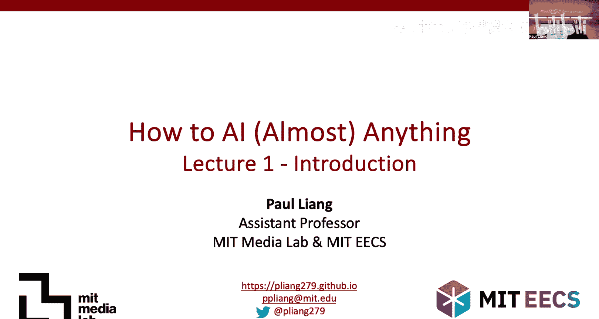

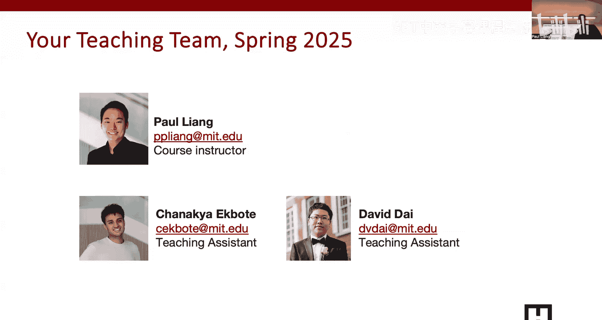

在本节课中，我们将学习《如何AI所有事情》这门课程的核心目标、课程结构、学习方式以及评估标准。这门课程旨在教授将人工智能应用于几乎任何新领域或新模态的基本原则，而非仅仅学习特定的算法。

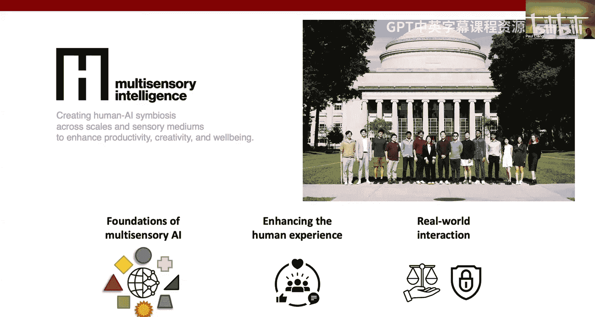

---

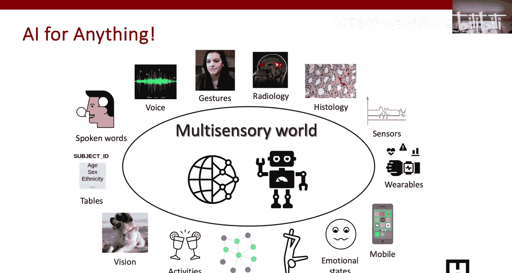

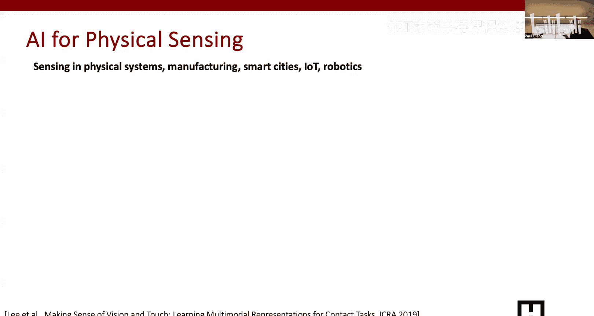

## 课程概述

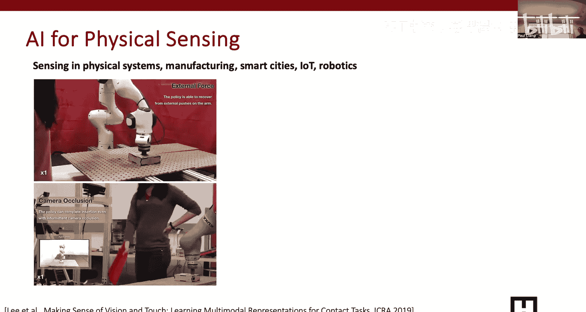

欢迎来到《如何AI所有事情》课程。我们非常兴奋能首次开设这门课程，延续媒体实验室“如何制造”和“如何发展”系列的传统。本课程的教学团队包括我（Paul，麻省理工学院媒体实验室和电子工程与计算机科学系的新任教师，多感官智能研究组的负责人）以及两位出色的助教Shaa和David。他们将协助作业并指导课程研究项目。

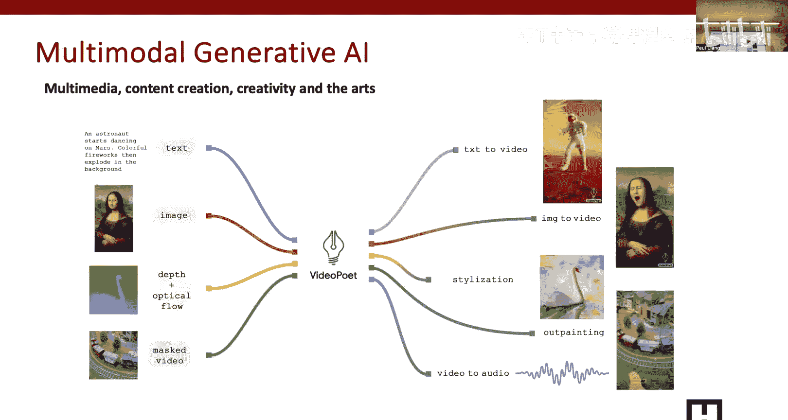

我们所属的“多感官智能”研究组，专注于开发能够理解世界万物的新一代人工智能系统。这些系统本质上是多模态的，能够处理语言、视觉、手势及各种传感器数据。因此，本课程的一大重点是如何设计真正多感官、能接纳世界上几乎任何感官模态的AI系统。

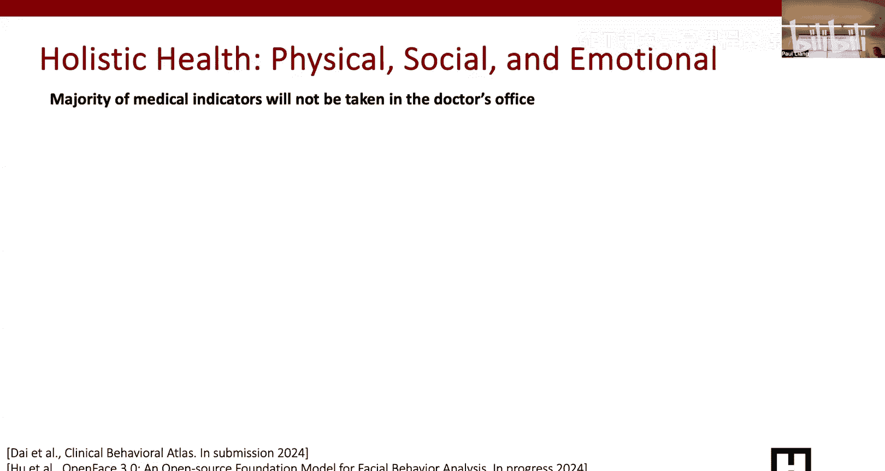

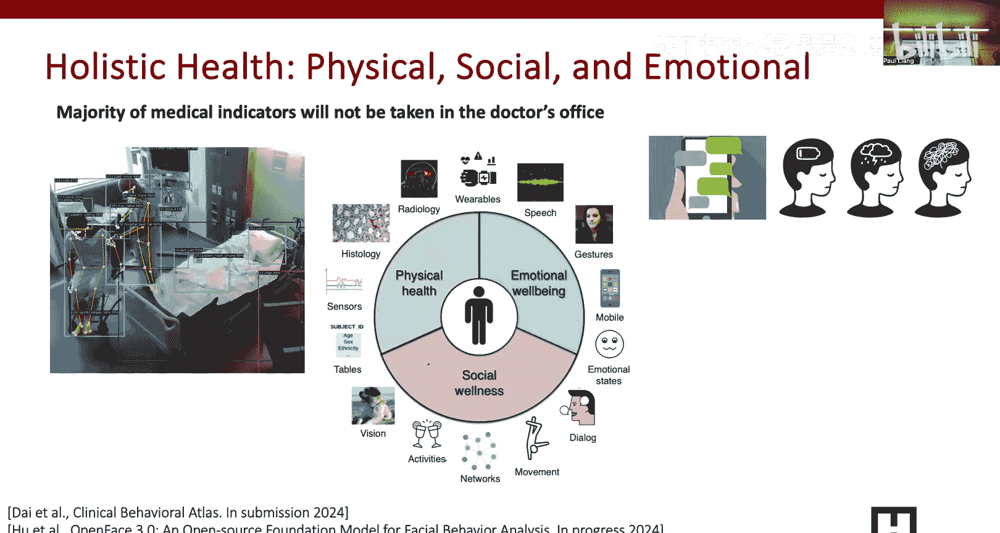

我们构建的系统旨在增强人类体验，而不仅仅是复制人类能力。同时，由于AI系统与人类的交互日益紧密和强大，确保其安全可靠也至关重要。课程后期将涵盖如何使AI系统真正安全与稳健。

## 为什么是“AI所有事情”？

我们周围的世界是多感官的。AI系统已开始能够处理和交互越来越多的媒介。例如，大型语言模型处理文本，语音识别系统理解我们的口语和声音表达，视觉系统能解读面部表情和肢体语言。在医疗领域，AI能通过X光图像进行合理预测以辅助诊断，或理解各种细胞和医学传感器数据。这仅仅是冰山一角，AI几乎已应用于世界上所有这些模态。

## 激动人心的应用实例

以下是AI应用于各种领域的几个启发性例子：

### 物理传感与机器人 🤖
机器人需要理解力和触觉信息，以感知抓取的是硬物还是软物，并判断放置位置是否正确。同时，机器人通常配备摄像头，可利用环境中的形状、颜色和大小等信息。为机器人集成更多传感器能使其更稳健。例如，可以模拟地震推动机械臂，它可依赖视觉完成任务；或遮挡摄像头模拟雨雾，它则可依赖力觉完成任务。

### 用于气味的AI 👃
我们的研究组正在构建用于嗅觉的AI。例如，一块能够感知不同食物和饮料释放的挥发性气体的芯片。在收集足够数据后，可以训练AI系统来检测特定气味，如花生。这对于花生过敏者非常有用。

### 生成式AI 🎨
本课程也将涵盖生成式AI。这类模型能够接收任何模态的数据，并将其语义转换到其他感兴趣的模态。例如，根据文本生成对应视频，或根据视频生成匹配的音乐或音效。

### 健康与福祉监测 🏥
AI可以应用于全面的健康指标监测。许多健康指标并非在医生办公室测量，而我们每年只去一两次医院。AI有潜力通过日常设备（如手机和可穿戴传感器）高分辨率地理解我们的身体状况（如ICU病人的状态）、情绪健康（压力、情绪）以及社交互动方式（通过语言和非语言表达）。

### 交互式智能体 ⚙️
除了感知和预测，新一代AI是关于交互式智能体的。这些智能体能够执行多步操作来完成人类指定的任务。例如，根据自然语言指令在网站上搜索、筛选并购买商品，或帮助操作办公软件。这开启了智能体协助处理多种计算机任务、提升日常生产力的新篇章。

以上只是构建“AI所有事情”机遇的快速一瞥，涵盖了从理解物理环境、处理生成数字媒介、监测健康到提升生产力的交互式智能体。

## 课程目标与主题

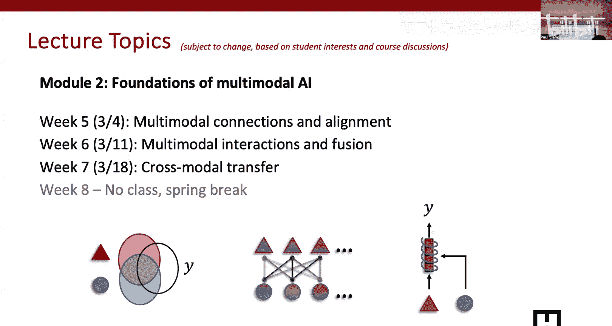

希望你们都能从本课程中学到东西。课程的核心目标是教授将AI应用于任何模态（尤其是AI研究前沿以外的新模态）的原则。这里的“原则”指的是：
*   **数据**：直观思考需要何种数据以及从哪里收集。
*   **模型架构**：需要何种模型架构以及如何设计。
*   **实验与评估**：如何快速实验并评估模型在数据上的成功。
*   **实际关切**：在实际部署AI系统前必须解决哪些现实问题。

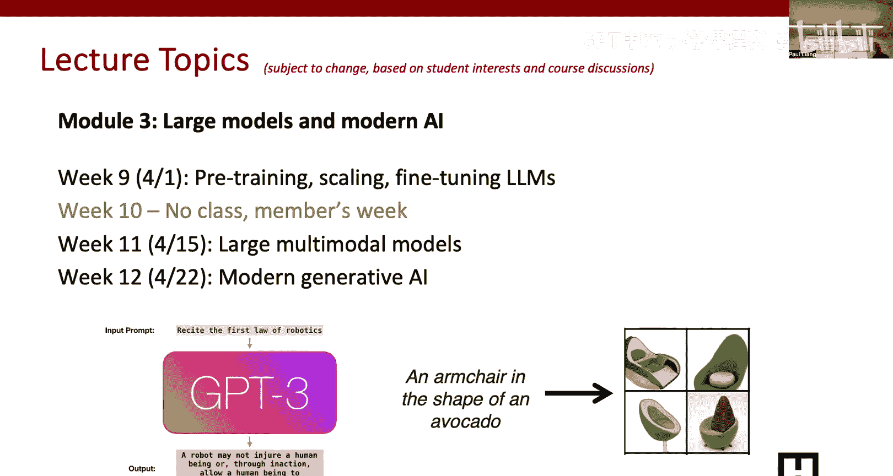

这与传统的机器学习或AI导论课程不同，后者通常侧重于每周学习一个特定算法。本课程则侧重于教授思考原则，而非方法本身。

课程的第一个主题是 **“面向新模态的AI”**。许多同学对姿态、医疗数据、生理传感器、移动数据等领域感兴趣，这些都是AI尚未充分研究的领域。

自然地，第二个主题是 **“多模态AI”**。许多应用需要连接不同的数据模态。例如，连接语言和手势以全面理解社交互动，或连接感知与驱动形成闭环。我们将涵盖如何构建能学习模态间连接的数据集、模型架构，以及如何评估和部署这些系统。

## 学习目标与课程形式

课程形式是半讲座、半独立研究与讨论。
*   **阅读与批判性思维**：通过阅读近期AI研究的顶尖成果（以讲座和论文阅读形式呈现），提升批判性阅读和思维能力。
*   **展望未来**：不仅理解现状，还要学会展望未来的挑战和愿景，以及如何实现这些成就。
*   **动手实践**：探索并实现一些新的研究想法，迈向未来。

## 先修要求

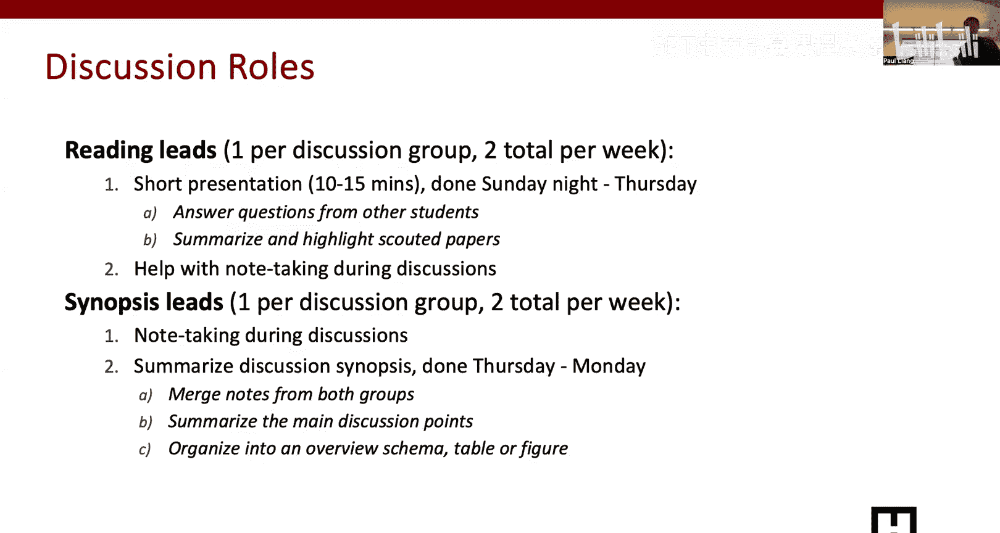

以下是理想的先修知识，但如果不完全满足，我们会根据你的情况调整课程体验：
1.  **编程知识**：最好是Python，但如果你会其他语言，也能快速上手Python，因为大多数AI工具包使用Python。
2.  **对现代AI能力与局限性的基本了解**：不需要深入技术细节，但应了解最新进展、能力和限制。每天浏览相关资讯是一个好方法。
3.  **外部领域知识**：带来一些AI之外的专业知识（如某个传感器、任务或领域问题），并与他人协作寻找解决方案。
4.  **加分项**：有过为某个模态尝试或原型开发AI的经验，可以借此深入研究。

## 课程安排与模块

我们每周二和周四下午1-2点上课。
*   **周二**：主要是一小时的讲座（由我、我的学生或客座讲师主讲）。
*   **周四**：更偏向动手实践和互动，可能是基于课前阅读的讨论课，也可能是代码实践教程。

课程分为四个主要模块，每个模块持续约三到四周：

### 模块一：AI基础 🧱
*   **第1周**：课程介绍与AI研究基础（如何做文献综述、产生想法、快速实验、撰写论文）。
*   **第2-4周**：应用AI于任何事物的原则。涵盖**数据**（性质、形式、收集）、**模型架构**（通用设计原则）以及**学习与泛化**（训练函数、监控学习过程、模型选择）。

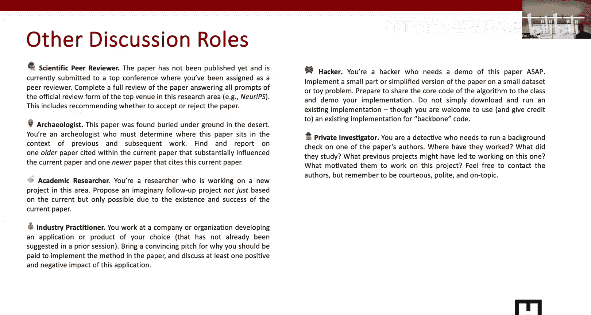

### 模块二：多模态AI基础 🔗
涵盖模态连接的原因、学习连接的方法、模态交互与融合，以及**跨模态迁移**（如何利用其他模态数据补充目标模态数据不足的问题）。

### 模块三：大模型与现代AI 🦾
春假后开始。涵盖大语言模型的**预训练、缩放与微调**（重点在微调实践）、**大视觉-语言等多模态模型**，以及**现代生成式AI系统**（生成图像、传感器数据、视频、音乐等）。

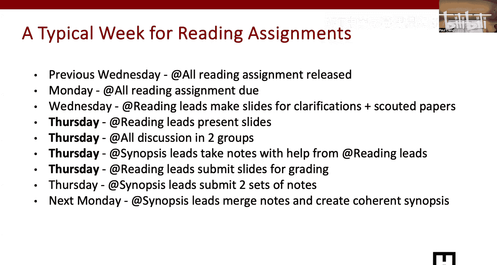

### 模块四：交互式AI 🤝
涵盖**多步推理AI**、**具身交互与实体AI**，以及最后一章关于**人-AI交互**中的安全等问题。

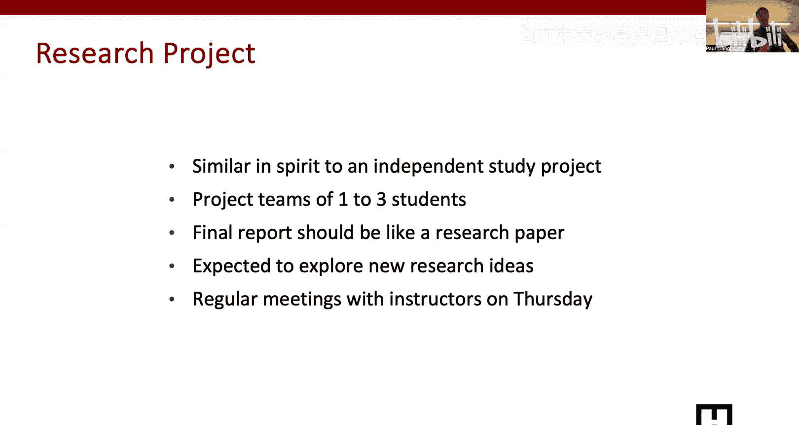

## 评分与考核

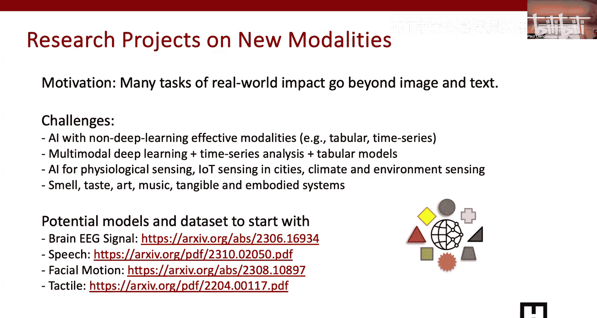

评分由两部分组成：
1.  **阅读与讨论（40%）**：基于7次阅读作业及课堂讨论。
2.  **研究项目（60%）**：完成一个高质量的研究项目。

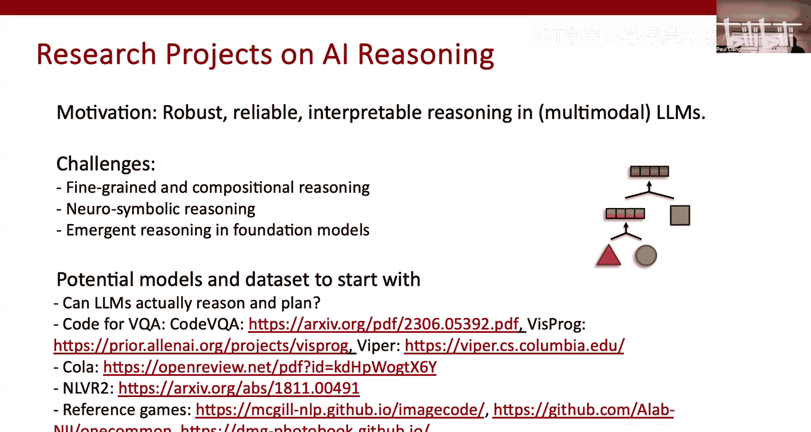

### 阅读与讨论详情
每次阅读作业会分配约2篇必读论文和5-6篇选读论文，并附带讨论问题。流程如下：
*   **个人准备（周一前提交）**：独立阅读论文，总结笔记，寻找相关论文，初步回答讨论问题。
*   **课堂角色与讨论（周四）**：
    *   **阅读负责人**：在课前准备简短报告，总结论文、答疑、汇总同学找到的相关资源，并在讨论中协助记录。
    *   **纪要负责人**：主要负责在讨论中记录，并在课后撰写一份连贯的讨论总结报告，与全班分享。
*   **讨论主题示例**：学习与泛化的属性、专用模型与通用模型的优劣、跨模态迁移、大语言模型、生成模型、人-AI交互等。
*   **评分构成**：个人作业15%，课堂参与讨论15%，担任特殊角色（阅读/纪要负责人）10%。
*   **可能的扩展角色**：为了增加趣味性，我们可能会尝试其他角色，如**论文评审员**、**考古学家**（追溯论文历史背景）、**学术研究员**（基于论文产生新想法）、**行业实践者**（评估商业价值）、**黑客**（快速实现演示）、**私人调查员**（探究作者动机）以及**社会影响评估员**。

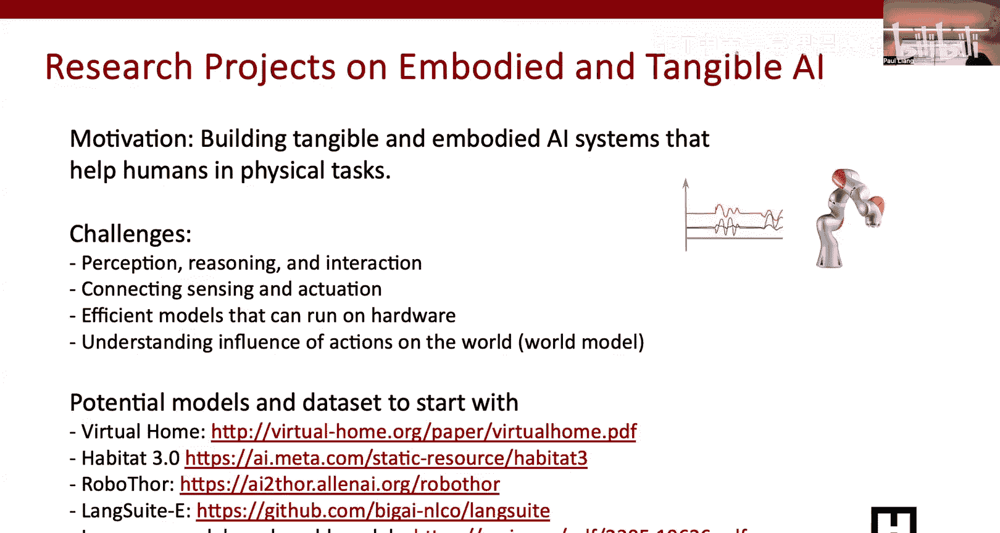

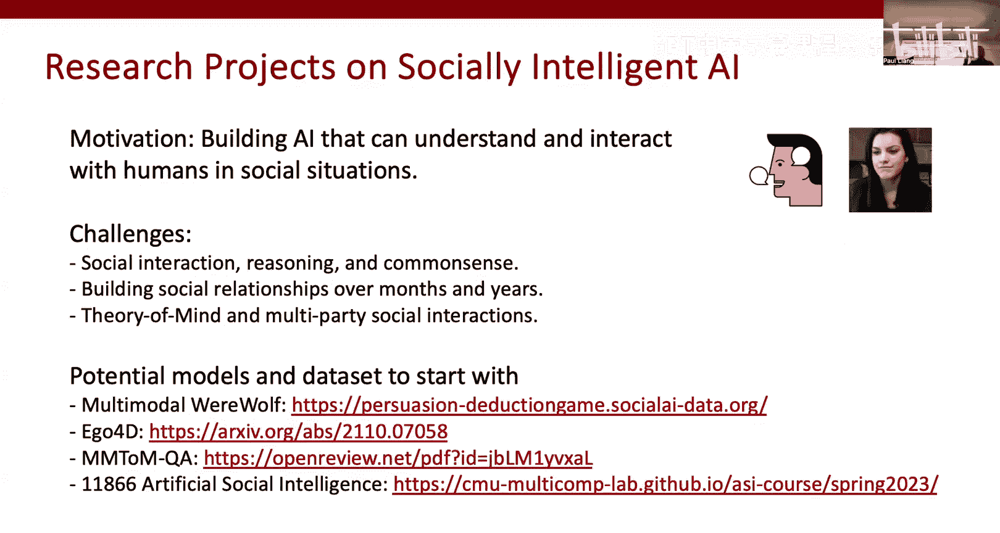

### 研究项目详情
项目类似于独立研究，鼓励组队进行。可以与现有研究有共通之处，但不应完全重复。最终报告应像一篇高质量的AI研究论文，鼓励探索新想法。
*   **项目思路方向**：适配AI到新模态（数据、建模、评估挑战）、时间序列/传感器数据、味觉/艺术/音乐/嗅觉、AI推理、交互式智能体、具身实体AI、社交智能AI、新人-AI交互媒介、超越模仿人类的新任务、AI伦理与安全。
*   **指导与会议**：每位同学/小组会分配一位主要导师（我或助教）。需要**每两周进行一次20-30分钟的会议**，并提前在共享文档中更新进展和遇到的困难。
*   **关键时间点**：
    *   第2周：提交预提案（简短描述）。
    *   第3周：课堂提案展示。
    *   第6周：初步想法实现。
    *   春假后：中期报告与展示。
    *   第11周：更新结果。
    *   第13周：深入分析成功与局限。
    *   第14周：期末展示。
    *   第16周：提交最终报告。
*   **项目评分构成**：提案10%，中期报告15%，最终报告25%，每两周进度更新10%。

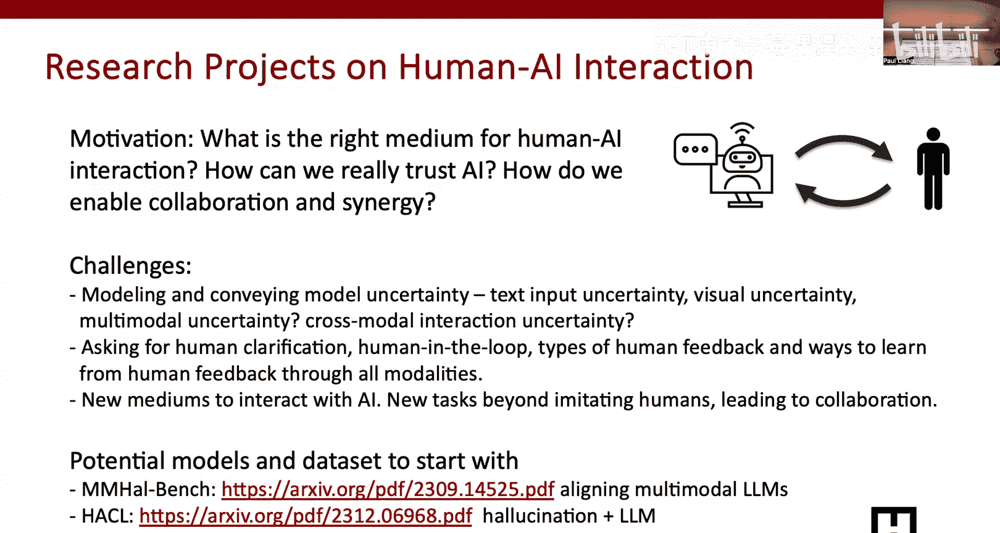

## 其他后勤事项

*   **出勤**：注册学分的学生需尽量出席每次课。如有长期旅行计划请提前告知。
*   **延期**：有**2次“万能卡”**可用于将阅读作业延期24小时提交；项目团队也有**2次“万能卡”**可用于将中期或期末报告延期1-2天。
*   **课程资料**：所有讲座幻灯片、视频和讨论笔记都将公开在课程网站上。作业和报告通过Canvas提交。

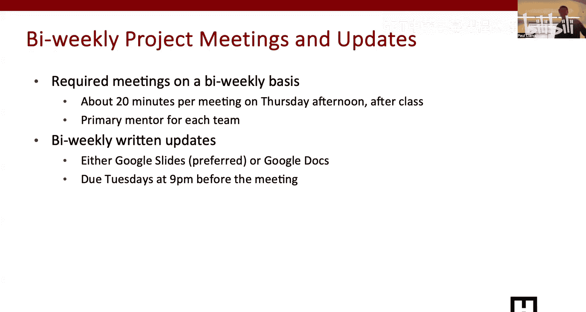

本周没有作业。建议开始思考感兴趣的研究项目，并寻找有共同兴趣的队友。我们将发布一份项目意向表格，于下周二截止。

**本周四的课**（下午1-2点）将继续，内容是“如何进行AI研究”的讲座，涵盖如何读论文、产生想法、快速执行研究以及撰写总结结果。

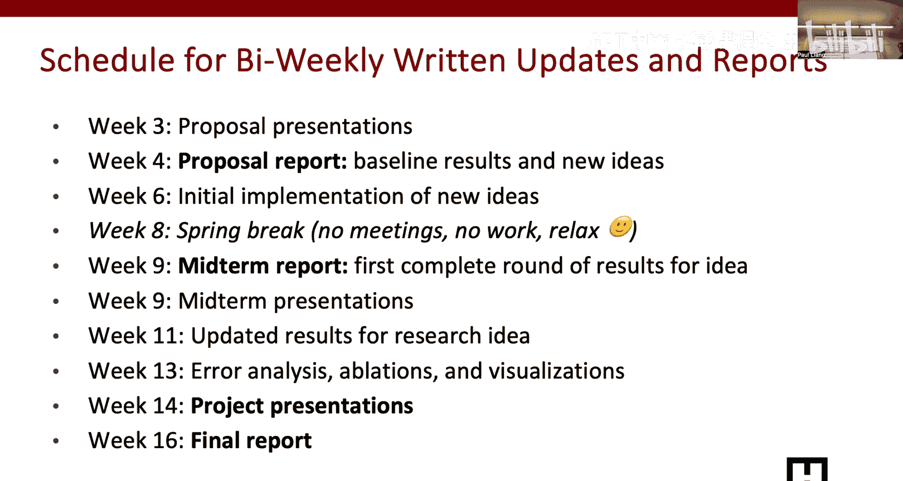

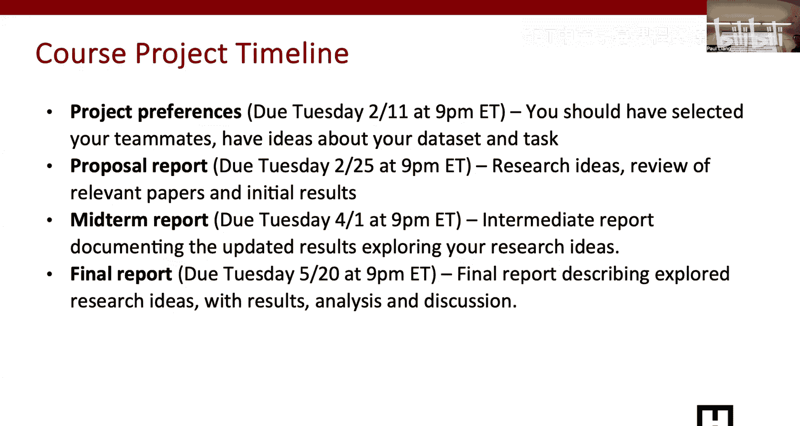

---

## 总结

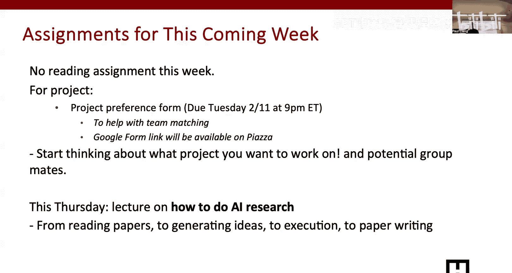

本节课我们一起学习了《如何AI所有事情》课程的总体介绍。我们了解了课程旨在教授将AI拓展到新领域的原则，探讨了多感官AI的广阔应用前景，明确了课程以讲座、阅读讨论和动手研究项目相结合的形式进行。我们还梳理了四个核心教学模块的内容脉络，以及评分考核的具体方式。接下来，请大家开始构思自己的研究兴趣方向，为后续的深入学习与实践做好准备。