# 2：人工智能研究导论 🧠

在本节课中，我们将学习如何进行人工智能研究。我们将涵盖从产生研究想法、进行文献综述、设计实验到撰写论文的完整研究流程。课程内容旨在为初学者提供清晰、实用的指导。

---

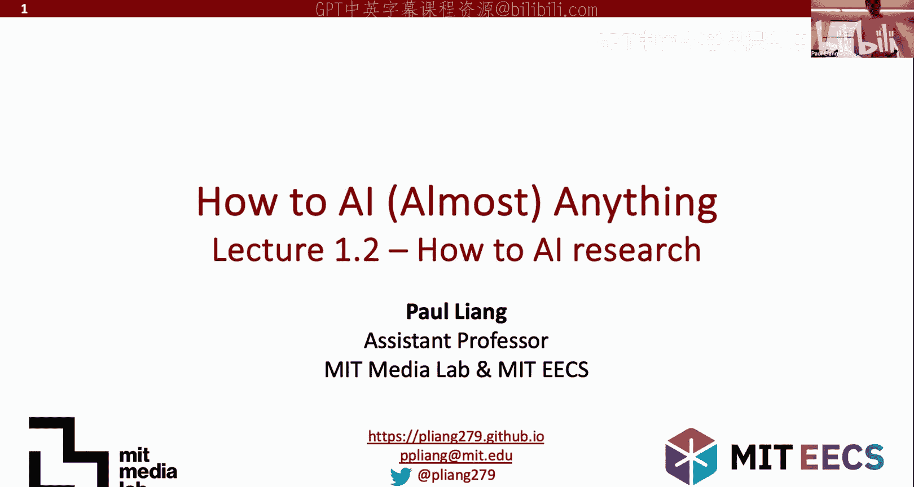

## 概述

人工智能研究是一个迭代循环的过程。它始于初步的观察和想法，接着通过文献综述将这些想法置于现有工作的背景下，然后提出具体的研究问题或假设。随后，通过编写代码和运行实验来验证这些想法，分析结果，并最终报告结论。如果结论不尽如人意，研究者将基于新的观察重新开始这个循环。本节课将详细介绍这个循环的每一个环节。

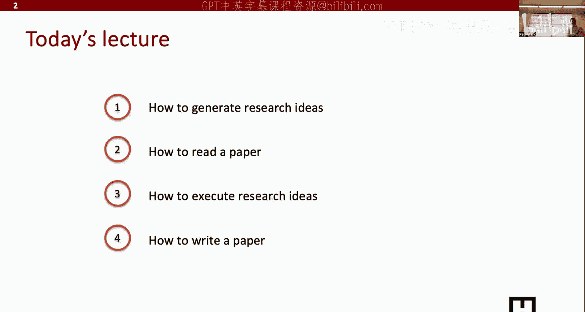

---

## 如何产生研究想法 💡

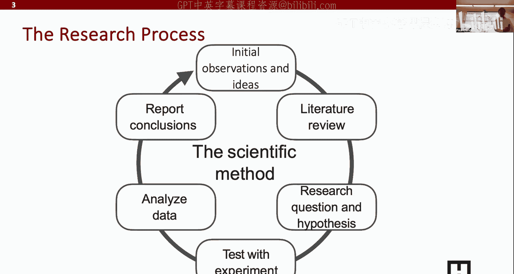

产生研究想法主要有两种通用方法：自下而上的发现和自上而下的设计。

上一节我们介绍了研究的基本循环，本节中我们来看看如何启动这个循环——即如何产生研究想法。

### 自下而上的发现

自下而上的发现意味着从具体实践出发。你首先调研某个领域的现状，尝试最先进的模型，观察哪些方法有效、哪些无效。基于无效的情况，你可以从中获得灵感，思考下一步该做什么。

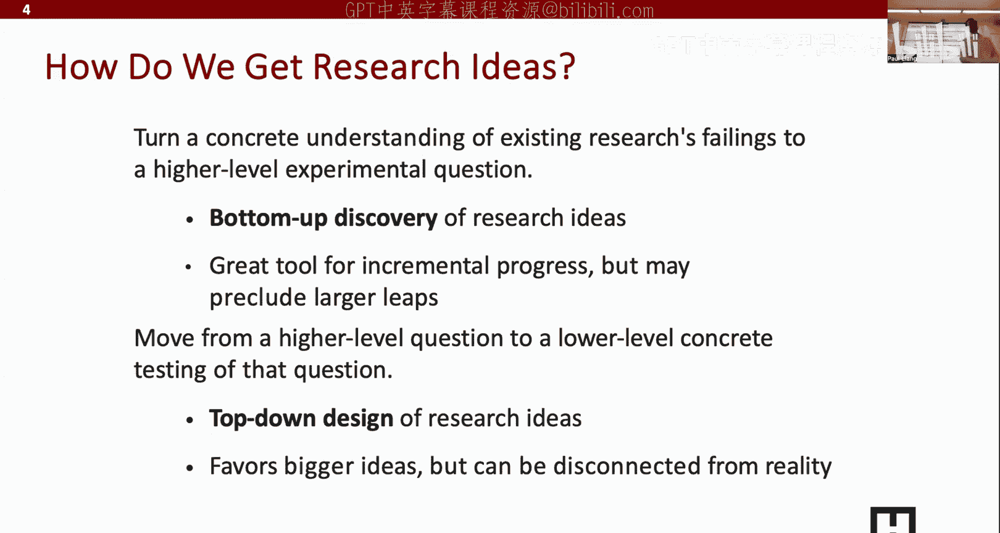

这种方法通常更安全，因为它始于一个在特定场景下有效的基础。只要你能修复它在其他场景下的问题，就能得到一个更好的新方法。它是实现渐进式、稳步进展的优秀工具，但通常难以实现研究上的巨大飞跃。

**核心公式**：`新想法 = 现有SOTA方法 + 观察到的失败案例 + 针对性的改进方案`

### 自上而下的设计

自上而下的设计与自下而上相反。你不是从具体的细节出发，而是从一个宏大的研究主题开始。这个主题可能是一个前所未有的、极具潜力的方向。当然，这个宏大主题通常不可直接实现，因此你需要将其分解为可在数月或数年内完成的若干子部分。

这种方法有助于构思更具突破性的论文和想法，但通常风险也更高。

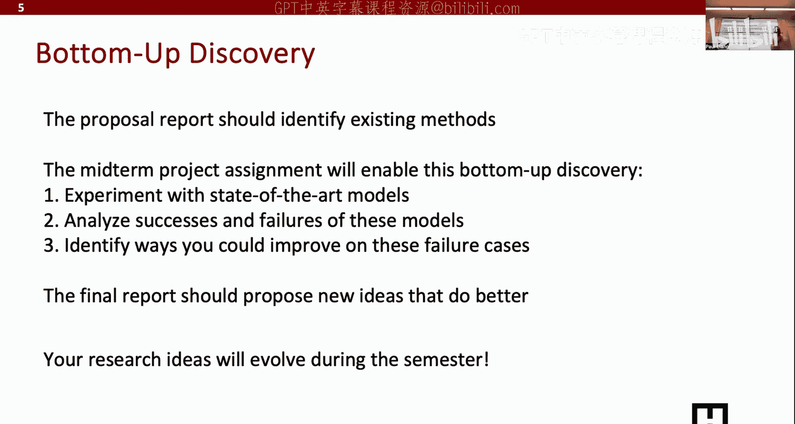

---

## 课程研究路径规划 📅

为了确保安全，本课程的设计将主要围绕自下而上的研究路径展开。当然，如果你有更具雄心的自上而下的想法，我们也非常支持。

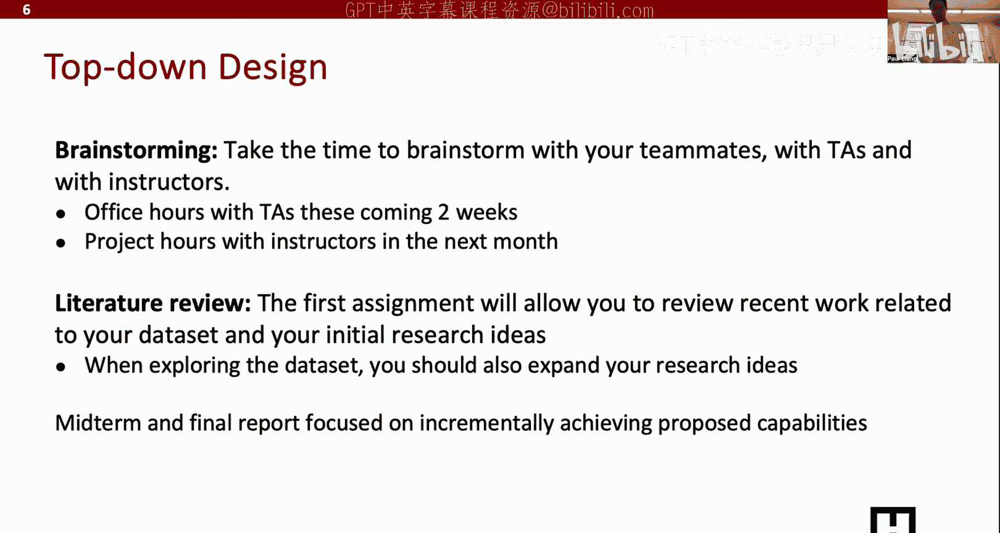

以下是自下而上研究路径的具体阶段规划：

*   **提案报告阶段（约2-3周内）**：确定你感兴趣的研究领域，并梳理该领域现有的最先进方法。如果你的领域没有直接可用的方法，可以考虑将其他领域的先进方法移植过来。
*   **中期报告阶段**：你应该已经实验了一些现有方法。在实验后，分析它们成功和失败的案例，进行错误分析，并对所有失败模式进行分类。在此基础上，找出修复这些错误的方法。
*   **期末报告阶段（春假后）**：专注于完成一份扎实的期末报告。报告应包含对你所提出的新想法的实现，并总结这些新方法是否真正修复了你在中期报告中发现的问题。

这是一个扎实的自下而上研究时间线，期望每位同学至少能完成这个框架下的工作。

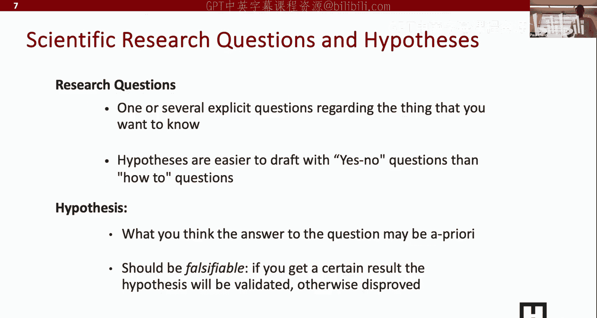

当然，我们也欢迎并支持那些更具“登月”性质的自上而下的研究构想。对于这类想法，与我和助教在办公时间进行头脑风暴至关重要，以确保项目的可行性。文献综述同样重要，你需要将你的宏大想法与当前工作联系起来。中期和期末报告的结构将不那么固定，更侧重于展示你朝着高层级想法所取得的进展。

---

## 研究问题与假设 ❓

所有的研究想法通常都源于一个待解答的研究问题。明确的研究问题是定义研究新颖性的关键。

研究问题是你向学术界提出的、尚未有明确答案的明确疑问。一个常见的问题是审稿人认为论文缺乏新颖性，这通常是因为研究问题要么已被解答，要么作者未能完全回答该问题。

我发现，将研究问题设计成**是非题**（Yes/No）形式通常比“如何”（How）类问题更容易入手和验证。因为是非题可以很容易地被证实或证伪，从而为你的研究提供一个坚实的答案。

假设则是你对研究问题答案的初步猜测。它为后续的实验设计提供了方向。

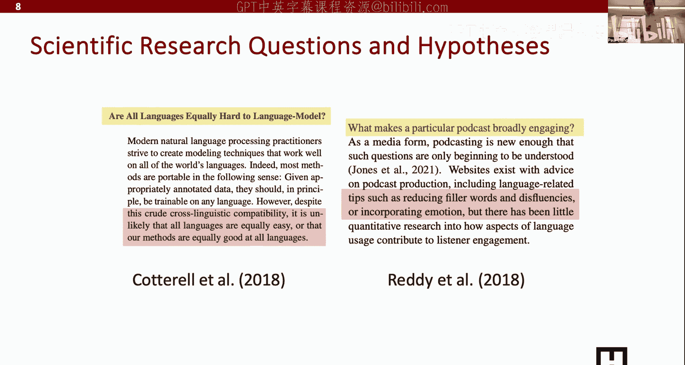

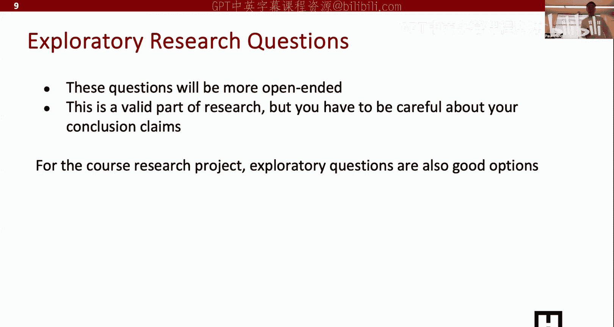

以下是两个例子：

1.  **研究问题**：所有语言是否同样难以进行语言建模？（这是一个优秀的、新颖的是非题）
    *   **假设**：基于跨语言可比性的概念，所有语言不太可能同样容易建模，或者说我们的方法不可能对所有语言都同样有效。（这为“否”的答案提供了一个具体理由）

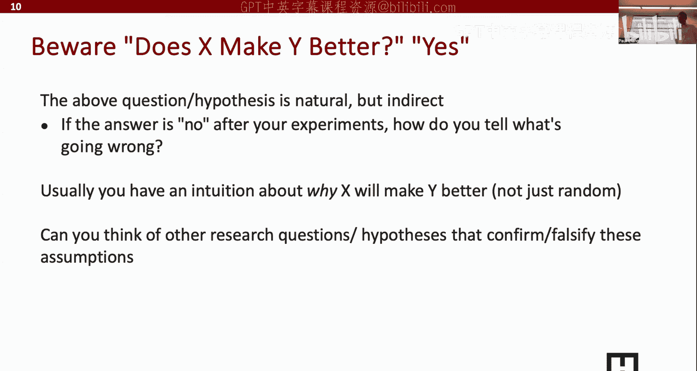

2.  **研究问题**：是什么让一个播客节目具有广泛的吸引力？（这是一个更复杂的探索性问题）
    *   **假设**：诸如减少填充词、提高流畅度或融入情感等因素可能使播客更吸引人。（这为研究问题分解出了可验证的具体部分）

通常，研究问题混合了验证性（是非题）和探索性（多因素分析）两种类型。

**需要注意**：避免使用“X是否让Y更好？”这种形式的研究问题。虽然有效，但它通常是间接的。如果答案是“是”，那很好；但如果答案是“否”，你就会陷入困境，不知道下一步该做什么。更好的方式是将其重新表述为“X的**哪种特性**会让Y更好？”，这样即使一种特性无效，你也可以探索其他特性。

---

## 潜在研究主题示例 🎯

以下是一些可能与本课程参与者兴趣相关的潜在研究主题示例，旨在激发大家的思考。

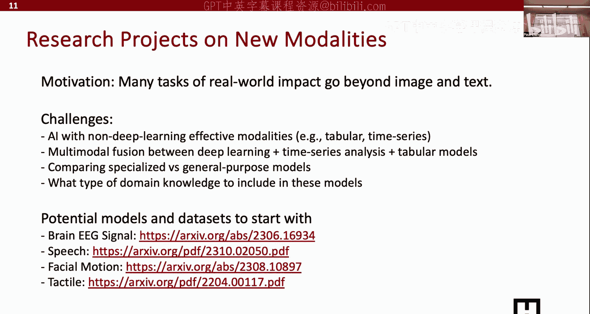

### 超越图像与文本的新模态AI

许多同学对超越图像和文本的新模态（如传感数据、脑数据、实体交互数据）感兴趣。
*   **如何将AI与非深度学习方法主导的模态结合？**（例如，结合深度学习和传统方法处理表格或时间序列数据）
*   **如何进行多模态融合？**（例如，融合语言模型与时间序列模型）
*   **在特定场景下，专用模型还是通用模型更有效？**
*   **如何将领域知识融入模型？**（例如，将医学专家处理EEG数据的知识融入模型，能否用更少的数据达到相同性能？）

### 传感器数据AI

传感器数据通常频率高、序列长，超出当前序列模型的处理能力。
*   **如何将传感器数据切分为有语义意义的单元（Tokenization）？**
*   **如何构建信号处理方法与深度学习的混合模型？**
*   **如何收集传感器-语言配对数据来构建传感器大语言模型？**
*   **如何设计自适应采样方法，以高效处理长达数年的传感器数据？**

### AI推理

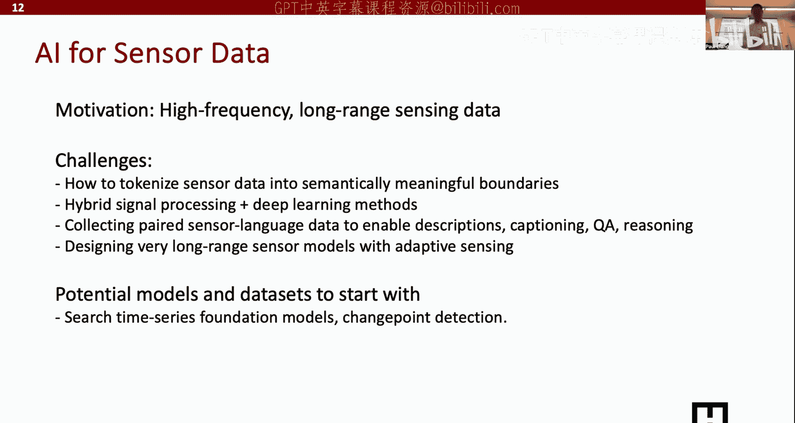

目标是构建能够进行多步骤复杂推理的系统。
*   **如何为模型提供明确的推理步骤监督？**（神经符号方法、收集中间步骤数据、树搜索等）
*   **如何在小样本（如1000-8000例）下复现复杂的推理能力？**

### 交互式智能体

让模型执行多步操作以协助完成任务（如自动办公、旅行规划）。
*   **如何构建能更好理解网页截图、PPT等非自然图像的视觉模型？**
*   **如何设计在不确定时能暂停并向人类寻求澄清的智能体？**（人在环学习）

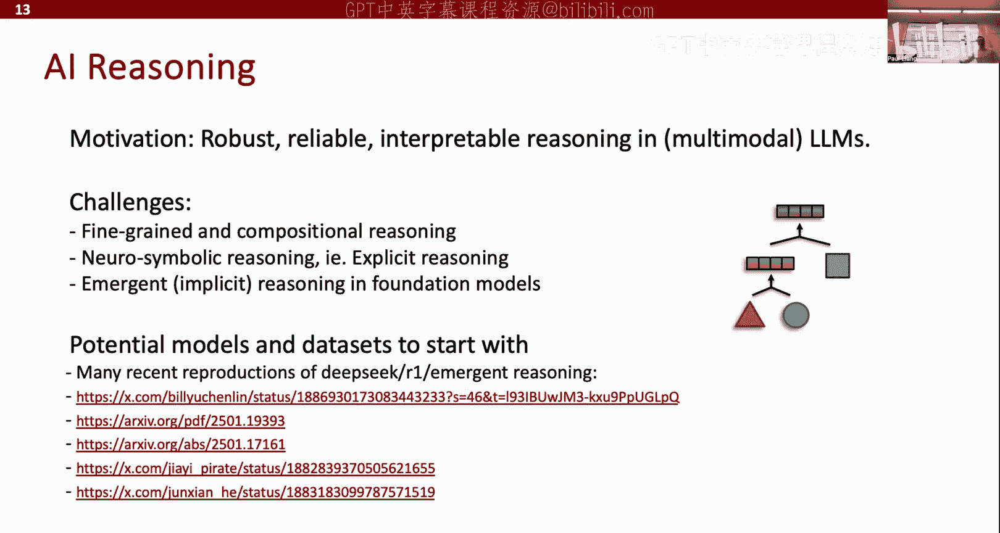

### 具身与实体AI

将AI从数字世界带入物理世界。
*   **如何构建能在硬件设备上高效运行的模型？**（模型压缩与优化）
*   **如何连接感知与驱动，形成强化学习闭环？**

### 社会智能AI

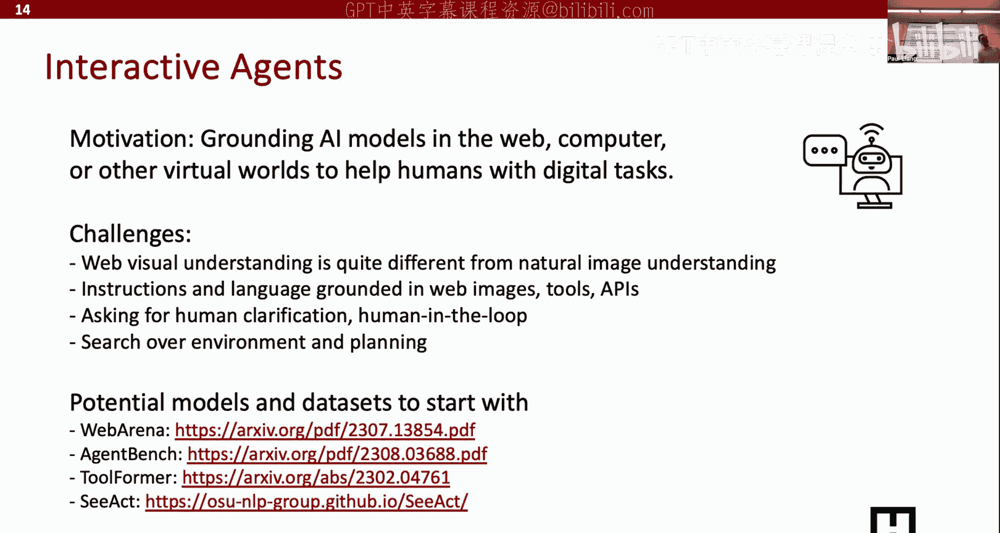

让AI更好地理解并与人类进行社交互动。
*   **如何让AI理解非语言表达和社交常识？**
*   **如何让AI系统发展长期社交关系？**
*   **如何让AI具备“心智理论”，理解他人所想？**（例如，构建能玩“狼人杀”这类涉及隐藏身份和欺骗游戏的AI）

### 人机交互

让AI系统更好地与人类协作。
*   **如何让模型表达其不确定性以寻求人类反馈？**
*   **除了点击投票，能否利用面部表情、手势等更直观的方式提供反馈？**

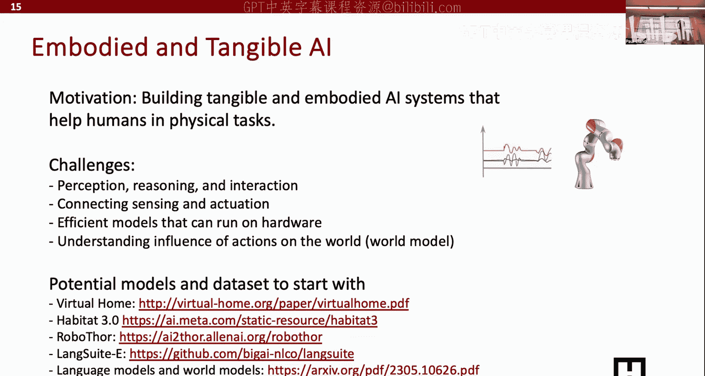

### 伦理与安全

确保AI系统的安全与公平。
*   **如何更好地分类和界定模型中的偏见与安全漏洞？**
*   **如何通过微调等新方法来缓解这些问题？**

这并非详尽列表，你可以基于自己的兴趣提出新的想法。

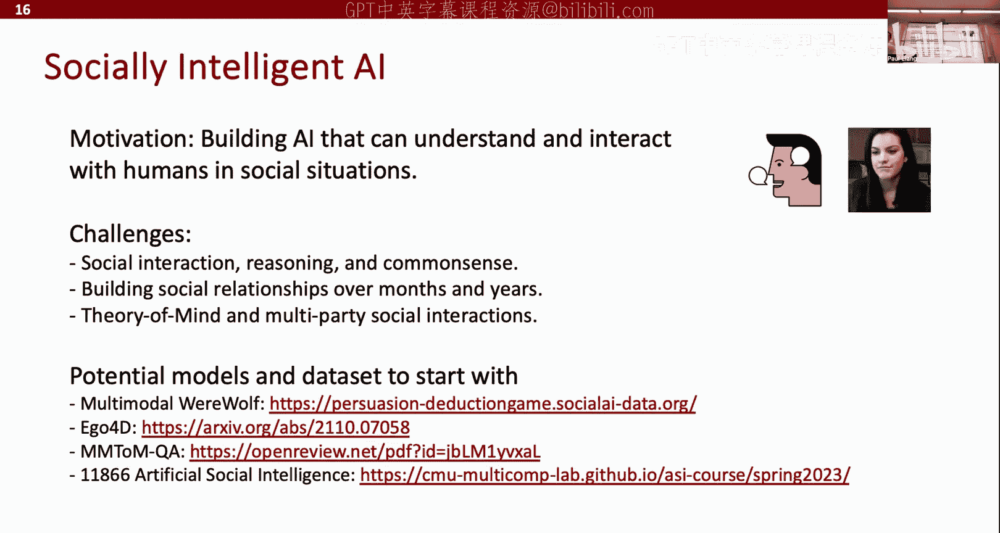

---

## 如何进行文献综述与阅读论文 📚

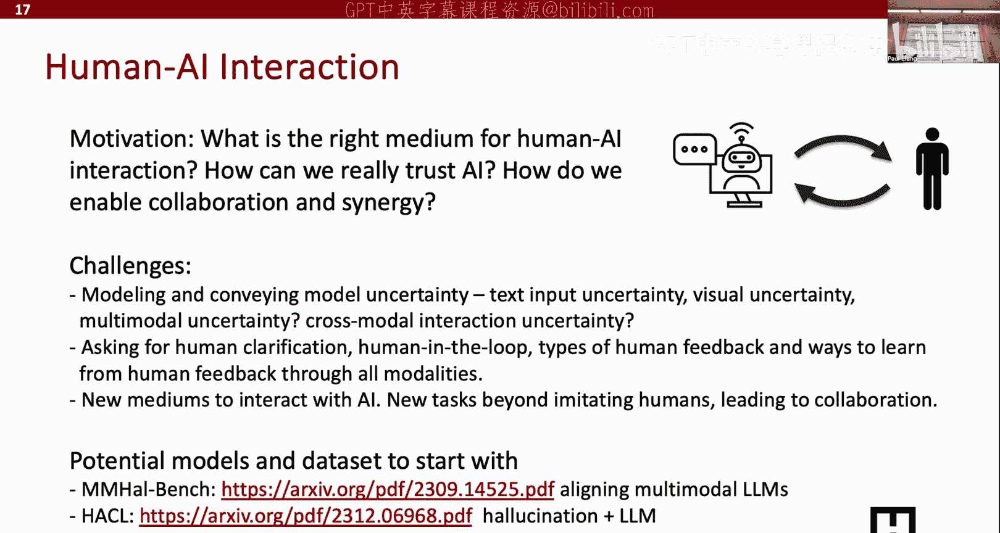

在确定了研究想法和问题后，下一步是进行文献综述，了解相关领域的研究现状。以下是进行文献综述和阅读论文的实用方法。

上一节我们探讨了各种研究主题，本节中我们来看看如何系统地了解一个领域的现有工作。

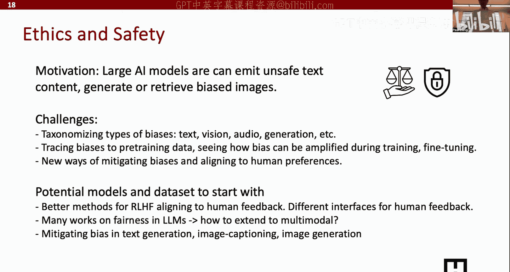

我通常按以下顺序和资源进行文献调研：

1.  **Google Scholar**：针对特定主题进行关键词搜索，浏览前几页的结果。
2.  **代码实现平台**：关注`Papers with Code`、`GitHub`和`Hugging Face`。这些平台集中了论文的代码实现，便于了解在特定任务或数据集上的最新进展。
3.  **会议论文集**：查看你所在领域顶级会议（如NeurIPS, ICML, CVPR, ACL等）近年来的论文集。
4.  **技术博客**：在搜索时加上“blog post”关键词。博客文章通常由领域专家撰写，内容更浅显易懂，非常适合初学者快速把握一个领域的关键进展和趋势。
5.  **综述论文与课程**：搜索“survey”、“tutorial”或相关课程资料。这些资源通常以教学方式系统化地组织领域知识，对初学者非常友好。

**核心流程**：`泛读（博客/综述） -> 精读（顶会论文） -> 实践（复现代码）`

---

## 总结

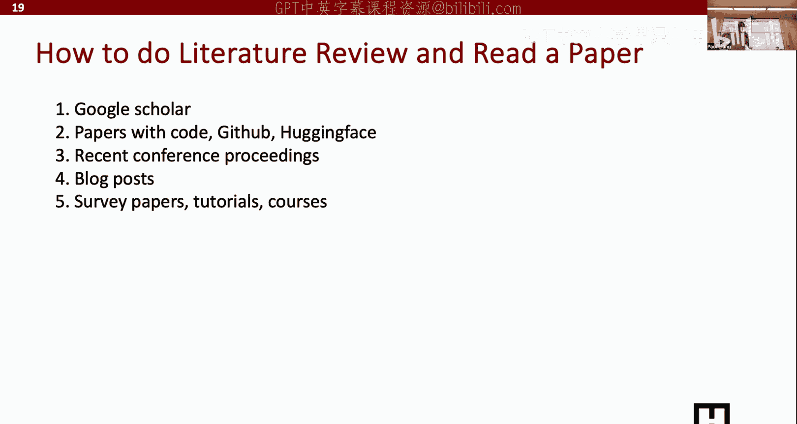

本节课我们一起学习了人工智能研究的基本流程。我们从如何产生研究想法（包括自下而上和自上而下两种途径）开始，接着探讨了如何提出明确的研究问题和假设。然后，我们浏览了多个潜在的研究主题示例以拓宽思路。最后，我们介绍了进行文献综述和阅读论文的系统性方法。掌握这些基础技能，将为你在本课程中开展自己的AI研究项目奠定坚实的基础。