# 3：数据、结构与信息

在本节课中，我们将学习机器学习和人工智能中最重要的组成部分——数据。我们将探讨各种形式的数据，分析其独特属性，并了解如何根据数据特性设计合适的建模架构。课程最后，我们会介绍不同的学习范式以及评估模型性能的关键概念。

## 课程管理与安排

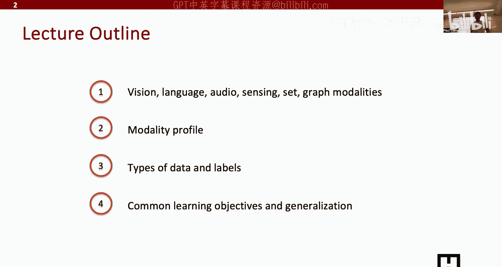

在进入正式课程内容之前，我们先处理一些课程管理事务。

所有同学应该都已加入Piazza。如果尚未加入，请在课后尽快告知我。Piazza是我们发布所有通知的资源平台，包括第一份公告、课程网站链接、讲座幻灯片、课程日历和教学大纲等。请确保你已注册Piazza。邮件已发出，如果你之前未使用过Piazza，可能需要激活并注册账户，请尽快完成。

关于Piazza，我们的第一份公告是：项目意向表需在今天结束前提交。如果你计划选修本课程并完成课程项目，请填写该表格。表格内容简短，包括你的姓名、已有的团队成员信息，或者你是否需要我们来帮助你匹配兴趣相似的同学，以及你对课程项目的总体兴趣方向。

请务必在今天完成Piazza注册并提交项目意向表。
我会提前一点结束讲座，以便尚未找到队友的同学有机会交流并寻找兴趣相似的人。

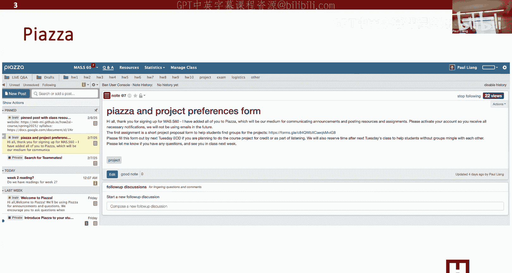

另一项快速的后勤安排：我们注意到下周（第三周）的周二和周一实际上互换了。可能你们不知道，周一是总统日。但根据学校的官方政策，我们没有取消周一的课，而是取消了周二的课，并将周一的安排移到了周二。因此，下周二的课程取消。我们将重新调整一些内容，以便将更多内容融入这些讲座中。

这个日历将非常有用，它涵盖了每周的主题以及任何重要的作业安排。例如，用红色标出的项目意向表提交截止日期是今天，2月11日。很快，一个非常重要的节点是下周四（不是本周四，而是2月20日），届时你们将进行第一次项目提案展示。我们将向所有同学和他们的团队成员发出相关说明，每个进行研究的团队将进行大约五分钟的展示，概述他们的初步想法、计划使用的数据集和模型。目的是从讲师和班级其他成员那里获得反馈。

请务必查看此日历，链接同样在Piazza上。如果你尚未加入Piazza，请尽快加入。

其他几项后勤事务：例如，本周四将有一个由我的学生主导的PyTorch和Hugging Face教程。这主要是一个关于机器学习中不同工具的入门教程，涵盖如何快速迭代代码、使用GPU、监控实验等内容。

有些同学询问第一次阅读材料何时发布。本周四将用于PyTorch和Hugging Face教程。下周四，所有同学将进行项目提案展示。再接下来的周四，讨论课将开始。春假前将有四次讨论课（第一、二、三、四次讨论）。这意味着阅读材料将在讨论课前大约一周发布。因此，第一次阅读材料将于2月19日发布。

请务必查看你的日历。

## 数据：机器学习的核心

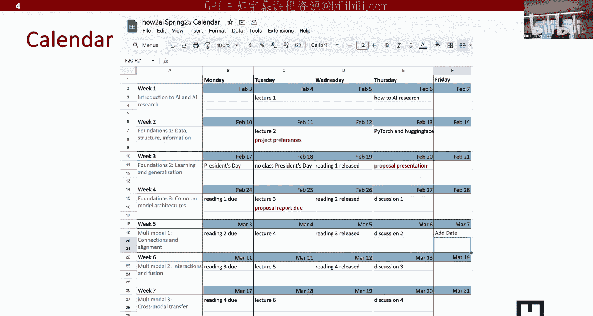

现在进入今天的讲座内容。

在机器学习中，我们经常谈论数据。数据是当今机器学习和人工智能领域任何成就的关键。

你可以将数据视为属于某种感知模态。感知模态本质上指的是数据在世界上被表达或感知的某种方式。

当你查看数据时，你通常会认为数据背后有某种传感器在收集。你可以从更接近传感器的原始模态，到离传感器更远的更抽象的模态来看待数据模态。

原始数据，例如，可以包括直接从麦克风录制某人语音的语音信号，或直接从相机捕获的图像。

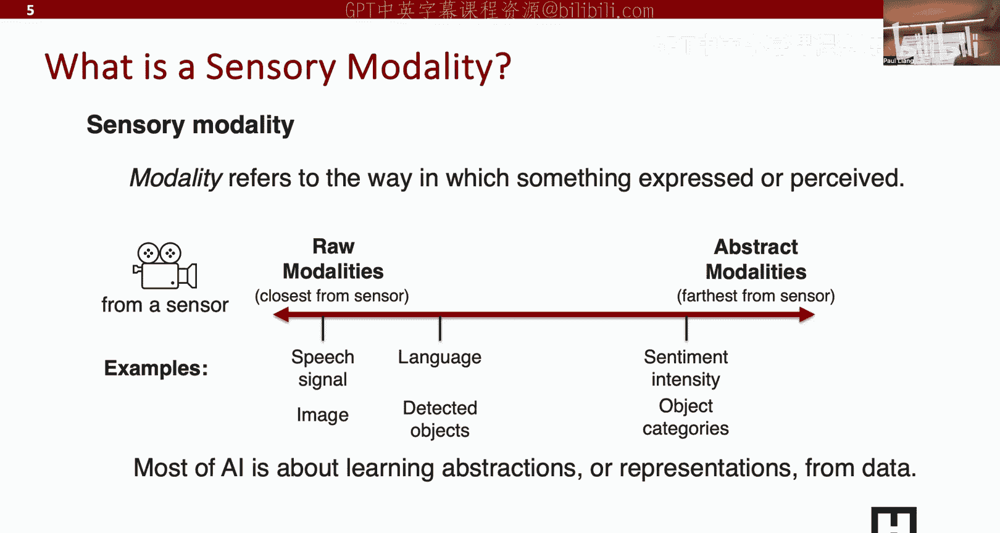

然后，你可以考虑从原始模态中进行抽象。例如，你可以从语音信号中提取出人所说的具体语言（单词）。这是一种通过保留某些信息并丢弃其他信息来进行抽象的方式。

你还可以开始从图像中检测物体，这同样是一种提取形式，提取出存在哪些物体、它们的位置，或者丢弃图像的其他部分。你甚至可以更进一步抽象。从语言中，你可以检测某人的情感，即他们对所谈论话题的感受是积极还是消极。从检测到的物体中，可以提取出精确的物体类别。

机器学习和人工智能主要是关于学习这些抽象，从通常非常高维、嘈杂、不干净的原始数据，到学习有用的抽象，并对这些数据做出推断。

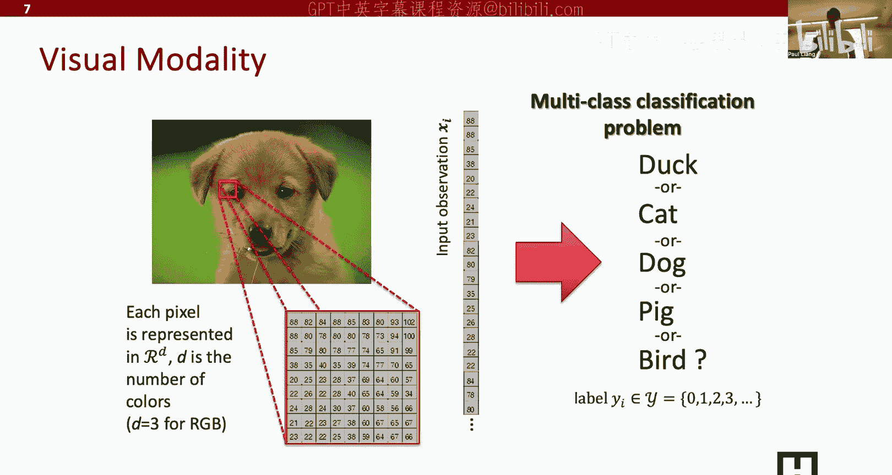

整个讲座乃至整个课程的目的，就是涵盖所有存在的数据类型，以及学习这些对特定任务有用的抽象的正确方法。

## 常见数据模态示例

为了在实践中了解这些，我们来看一些常见的数据模态。

### 视觉模态

你们可能都见过视觉模态。这里有一张彩色图像。当你查看这些模态时，它们通常需要以某种方式在你的计算机上表示。图像，如果你想进行分类，将被表示为像素，其中包含高度、宽度，每个维度都有一些通道（颜色数量，如RGB）。因此，它通常是一个三维矩阵：高度、宽度和通道。

对于这些图像，你可以对其中存在的物体进行分类。你也可以将其表述为一个二元分类问题，例如，判断图像中是否有狗。你还可以将其表述为一个多类分类问题，即你可能有一个大的类别集合，试图从图像中推断出类别，你的目标是选择正确的类别之一。

这就是视觉数据的一个例子，以及你可能对视觉数据做出的一些推断。

### 语言模态

你可以从互联网上获取大量语言数据。例如，这里是亚马逊上的一些书面语言，可能是某人在购买商品后写的评论。你也可以获取口语数据，例如，电影或电视节目中人们说话的实际录音，这也是一个很好的数据来源。

从语言数据中，你可以尝试推断，例如，情感。判断出现在整个语言数据中的特定词语（例如“humorous”）是积极的还是消极的。同样，你如何表示这个数据？“humorous”在你的计算机上是一个字符串，但你如何以一种可以被机器学习或人工智能算法实际接受的方式来表示它？

词袋模型是一种简单的实现方式。词袋模型本质上意味着你首先收集句子中出现的所有单词的词典。对于多个单词，你本质上是在感兴趣的那个特定单词（例如“humorous”是词典中的第八个单词）对应的索引位置放上1，其他位置放0。这是一种以数字格式表示单词的简单方法，你的计算机可以接受。

因此，你可以对这个词进行分类，例如，判断它是积极的还是消极的。你可以分类它的词性，是名词还是形容词。你还可以分类它是否是一个命名实体，例如，是否是一个特定的地点或物体。

当然，如今我们通常不训练单词级别的模型，而是训练句子或段落级别的模型。因此，你可能会输入一个段落或对话中的多个单词，并试图对其做出一些推断。例如，判断整个段落是否表明某人对他们购买的商品感到积极或消极，或者将这个段落编码到模型中并生成回应。因此，客户代理可能会自动回复这个人写的评论。

这些是更偏向句子或文档级别的分类任务。为了表示它，你可以继续使用词袋模型，基本上就是统计哪些单词出现。例如，“ideal”这个词出现了，它是词典中的第二个词；“where”和“anyone”作为第五个词出现；“humorous”这个词出现了。本质上，在你的句子中，所有出现在词典中的单词位置放1，其他位置放0。这是一种表示数据的方式。

当然，你们可能都意识到，这些是非常简单的数据表示方式。例如，词袋模型仅仅统计哪些单词出现，并没有真正处理单词的顺序。例如，“not happy”这两个词连续出现实际上意味着非常重要的事情，而“happy... not...”出现在其他地方则不同。因此，我们当然会在整个课程中探讨更好的数据表示方式和更好的学习方法的例子。

这仅仅是作为对各种数据形式的介绍。我们看到了视觉数据、语言数据。

### 音频模态

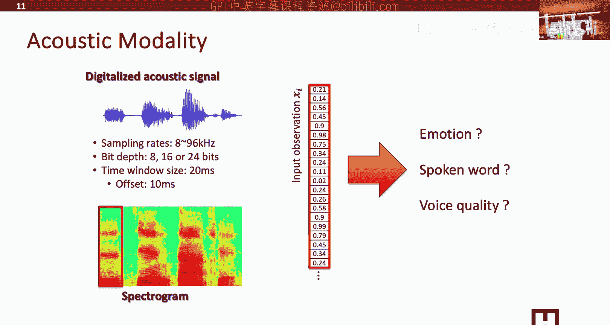

音频是另一种常见的模态。有时你可能从麦克风获取声学信号。通常，这些信号会以某种方式离散化，因为麦克风是以某个固定频率从世界上的连续数据中采样的。

同样，从这个音频信号中，你可能尝试推断这个人说了什么，这是一个自动语音识别的任务。

音频数据有几个关键参数，例如采样率（你以多高的频率录制一个人）、比特深度（每个样本记录了多少信息）。还有其他你可能需要考虑的因素，例如时间窗口。你希望在哪个时间窗口内识别出所说的单词？如果你的时间窗口太短，你可能只听到一个特定的音素或字符；如果时间窗口太长，你可能识别出不止一个单词，开始识别更多内容，你的模型在测量单词时可能不够精确。

表示音频模态的不同方式。这基本上是一个时间维度的表示，或者频谱图，它本质上将时间维度转换为频率维度，你可以看到振幅。

频谱图是表示音频的另一种方式。人们惊奇地发现，你可以将频谱图视为图像，甚至可以将其交给图像识别模型来对频谱图进行推断。因此，音频模态和视觉模态之间存在某种关系。

同样，你可以通过从第一时间步开始，使用某个固定的时间窗口输入观测值，然后在下一个时间步使用另一个时间窗口，来开始识别音频。自然地，你可以识别口语单词，但也可以识别情感，判断某人感觉积极还是消极，这不仅仅基于他们说的话，还基于他们说话的方式，可能是他们声音的幅度和振幅，以及他们说话的快慢。你还可以判断语音质量。

### 传感/时间序列模态

传感模态。如果你从事机器人或环境传感器相关工作，你通常会随时间收集数据，测量某个特定的物理现象随时间的变化。这里的Y轴显示了传感器如何变化。这里展示的是一个六轴力扭矩传感器的例子，常用于机器人，它随时间测量六个不同分量上的力。

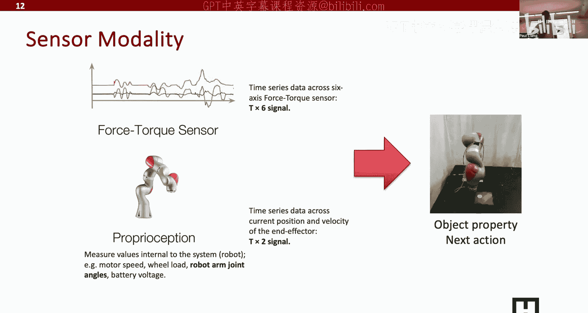

当你从事机器人工作时，通常还会拥有一些内部本体感觉数据。许多具身系统都有一些内部状态。这些内部状态可能测量机器人的位置、角度、速度、加速度以及其他与交互智能体内部相关的参数。

同样，这是随时间变化的数据。因此，这里有一个时间维度T。在这个例子中，它只是测量了这个机械臂的当前位置（X、Y、Z轴）和速度。所以它类似于一个 T x 2 的矩阵。

利用所有这些本体感觉数据，你本质上可以训练一个模型，该模型接收这些传感器数据并输出某些内容。你可以输出并尝试预测机器人抓取的是什么物体，或者预测机械臂的某个属性，例如被抓取的物体是软材料还是硬材料、刚性如何、不同形状等。你还可以尝试预测下一个动作。

因此，基于当前的传感器数据，你可能尝试预测机器人应该采取的下一个动作，以便更好地抓取或操纵物体，这将为你提供下一个时间步的一组新读数，或者一组新的力记录和机器人内部的新本体感觉读数。

这涵盖了传感模态。关键思想是，现在你有了时间维度，你可能希望利用这个时间维度和力的大小来识别物理世界中的事物，并采取行动。因此，你可以查看这些数据的新出现情况，并可能再次采取行动。

这就是传感模态。有时人们称之为传感器数据，有时称之为时间序列数据，它们经常可以互换使用。时间序列是传感器数据的一种泛化，指任何具有时间维度的数据。

因此，金融数据也具有时间维度，例如测量股票价格如何变化，这也被视为时间序列，但你可能不会称之为传感器数据。所以，你在寻找编码传感器数据的模型，即传感器模型，但也包括时间序列模型。

### 表格与时间序列混合模态

这里我展示了一个表格和时间序列的混合体。这是一个在医学领域常用的数据集，称为MIMIC数据集。它包含两种模态：关于特定患者的表格信息，例如他们的年龄、性别、种族、既往病史等，这些你通常会在表格形式中看到。同时，你还有时间序列模态，即患者入住ICU后，从入院到出院期间，他们的通气情况、心率随时间的变化、血糖水平随时间的变化等。

因此，表格和时间序列数据可以结合起来，对许多医疗程序做出推断，例如他们的死亡率、他们可能患有的疾病（通过ICD-9代码衡量）、他们在ICU停留的时间等。

表格模态在某种意义上非常独特。一个关键特性是，你基本上可以互换这些值。例如，无论你先放年龄和性别，还是先放性别再放年龄，从技术上讲，不应该改变你对表格数据做出推断的方式。因此，如果你的模型实际上对这些值内部的顺序敏感，那么你可能会遇到麻烦。

表格数据的另一个常见挑战是，数据通常更具离散性。例如，性别可能只有几个类别，种族可能只有几个类别。因此，它不是我们在处理图像或传感器数据时习惯的那种连续数据。因此，处理表格数据存在一些挑战。

### 图数据模态

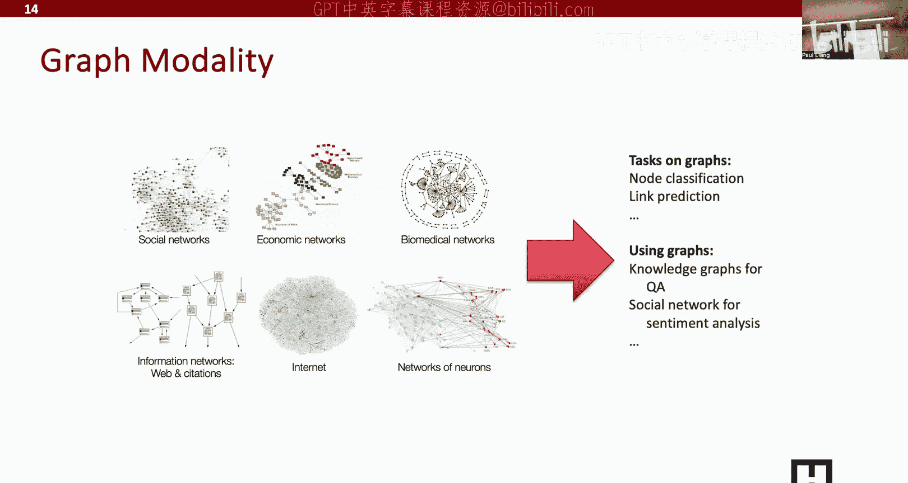

图是另一种非常有趣的数据形式。但我不认为有人会把图列为自己最喜欢的模态。图无处不在。例如，在社交网络中，你不仅想对网络中的单个人做出推断，还想利用这个人以及他与其他人的关系。这就是一个图的例子，显示了这些人之间是如何连接的。

经济网络、生物医学网络也非常常见。如果你研究不同的蛋白质，你必须查看蛋白质如何与其他蛋白质相互作用，哪些不相互作用。这可以表述为一个图。还有像互联网这样的东西。

如果你查看图模态，通常你有一组节点（图中的各个点）和边（本质上告诉你哪些节点与哪些其他节点相连）。

图上有几个重要的任务。节点分类：例如，在社交网络中，你能将每个人分类为更积极或更消极，或者他们的政治立场（右倾、左倾）吗？这是一个节点的属性，但你不能仅使用该节点来做出预测，你可能需要查看他们在社交网络中结交的朋友或点击的其他页面来对该人做出推断。

链接预测：给定两个特定节点，它们可能链接在一起的概率。例如，给定两个蛋白质，它们相互作用或结合的可能性；给定社交网络中的两个人，他们成为朋友的可能性。

这些是图上更多的分类任务。还有许多任务涉及将图用作数据数据库，并利用它来改进其他事物。

例如，如果你正在构建一个问答系统，许多早期的问答系统，如IBM Watson（在Jeopardy游戏中表现超群），它们能够访问包含所有这些常识性知识的知识图谱，这些知识对于这类问答游戏是必需的。它们本质上查询这些知识图谱，检索答案，以便实时回答这些问题。当然，如今人们使用大型语言模型，但也有许多工作致力于结合大型语言模型（知识存储在这些参数中）和显式知识图谱（你可能希望大型语言模型真正查询并从中检索答案）的混合方法。

因此，图本身有很多机会，可以对图进行推断，也可以将图作为一种额外的辅助模态来对其他任务进行预测。

### 集合模态

集合模态。集合模态与表格模态有一些共同点。你可能拥有某个对象组或分布，其中每个对象都很重要，哪些对象在集合内、哪些不在集合内非常重要。但关键的是，集合内元素的顺序并不重要。

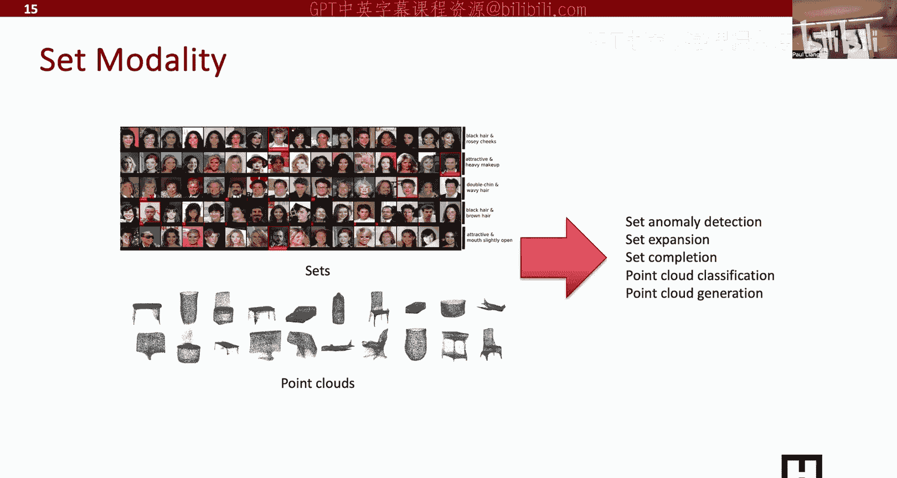

在这里，我可能正在查看一堆名人图像，这是机器学习数据集中常见的任务。你可能试图根据一组对象分类某些属性，比如头发颜色、肤色、年龄等。但无论这位名人先出现，还是另一位名人先出现，都不重要。事实上，如果你的模型对这些图像出现的顺序敏感，那么该模型的效果将不如对顺序不敏感的模型。

对于集合，你可以执行以下操作：检测异常，找出哪些人或哪些图像不属于该图像集合；进行集合扩展，例如，如果我想生成更多具有特定属性的图像，如何在该集合中采样更多元素。

当我们谈论集合时，点云是另一个例子。我们看到了2D图像，只有高度和宽度。点云本质上是其3D版本。之所以称为点云，是因为每个点都有X、Y、Z坐标，这就是它具有二维性质的原因；而“云”是因为你有一堆点，其顺序并不重要。一组点允许你重建和可视化这些3D对象。

因此，点云。同样，如果你从事3D表示相关工作，通常会将其表示为点云。你可能希望进行更多采样，例如，我想按照“椅子”这个语义类别，在不同3D方向上采样不同的椅子。这是一个点云扩展任务的例子。你可能希望分类特定的物体，或者检测这些3D对象中的异常，这些都是点云上的任务。

总结一下，集合模态也非常重要。关键区别在于，你有一组集合中的元素或点云中的点，但顺序无关紧要。因此，如果你构建的模型对集合中元素的顺序或点云中的点顺序敏感，那么你本质上没有充分利用你的数据，你的模型效果也不会那么好。

我们将在下一讲中详细讨论这些关于模型效果好与不好的想法，届时我们将实际讨论具体的模型。

## 数据模态的统一框架：模态剖面

好了，我们快速浏览了所有存在的数据形式，这远非详尽无遗，以及存在的任务。我倾向于将事物归纳起来，形成一个统一的框架。我称之为模态剖面。给定你最终收集的任何特定来源的数据，无论来自何种模态，你为其标注数据，思考该模态的几个维度是有用的。

因此，我称之为模态剖面。粗略地说，它是该模态独有的品质和结构。让我用两个例子展示哪些维度属于这个模态剖面：一个来自视觉模态，一个来自语言模态。

你可以看到这两者是相关的。右边是对这张图像的粗略描述：“一个干净房间里的笔记本电脑右侧有一个茶杯”。这是这张图像的粗略标题。

那么，什么构成了这个模态剖面？我应该如何开始推理数据呢？

首先，一个非常重要的维度是数据中各个元素的分布。我有这张图像，我开始意识到一个元素是沙发，一个元素是茶杯，一个元素是笔记本电脑，还有一个是桌子。对于语言也是如此，句子中有一些不重要的虚词，但也有一些我关心、需要建模的关键词，例如“茶杯”、“右侧”、“笔记本电脑”、“房间”。

因此，我将开始推理这些元素是什么，特别是它们的分布：是连续分布还是离散分布，以及它们的支撑集是什么（即我必须捕获的所有可能元素）。对于图像，可能是边界框区域；对于语言，可能是那些单词。

所以，我要开始考虑的第一件事是如何建模这些单个元素，如何学习一个能够真正捕获“这是一个笔记本电脑”的群体表示（即使它部分被茶杯遮挡），如何学习一个能够真正捕获“这是一个具有所有属性的沙发”的视觉表示。

同样，如何学习语言中元素的正确表示？

其次，我提到了元素及其分布，以及如何潜在地表示这些元素。第二个维度是粒度集合。我们考虑了单个元素是什么，但现在这些元素出现的频率如何？在图像上，每张图像可能看到几个物体，看起来不太杂乱，也许有三四个主要感兴趣的对象。在文本中，如果是一个人说话，可能是每分钟的单词数；如果是一个句子、段落或文档，则是我可能关心的单词数量。

粒度也会影响我们随后如何设计模型，即在学习了单个元素的表示之后，如何根据它们的粒度和频率组合这些表示。

第三个关键思想，第三个关键维度是结构。结构本质上告诉我这些元素如何组合形成更高级别的信息。

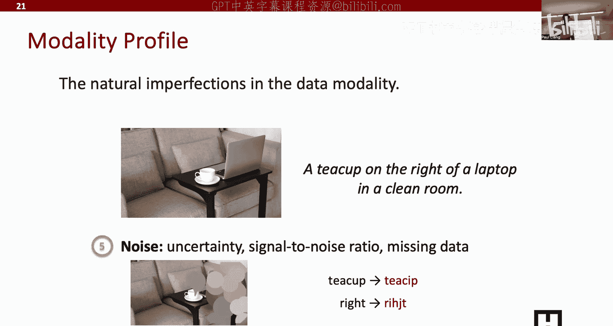

我们从这个自底向上的过程开始，查看了这些单个元素并表示了它们，查看了它们的频率，但最终你必须学习整个图像、整个句子或整个段落的表示。

因此，结构本质上告诉你这些元素应该如何组合以获得更高层次的意义，形成更高层次的抽象。

图像通常是一种空间结构。我们查看图像元素之间的空间关系：椅子在桌子前面，茶杯在桌子上面，笔记本电脑在茶杯左侧，等等。这是一种非常空间化的排列，当你组合这些元素以形成图像表示时，应考虑空间关系。

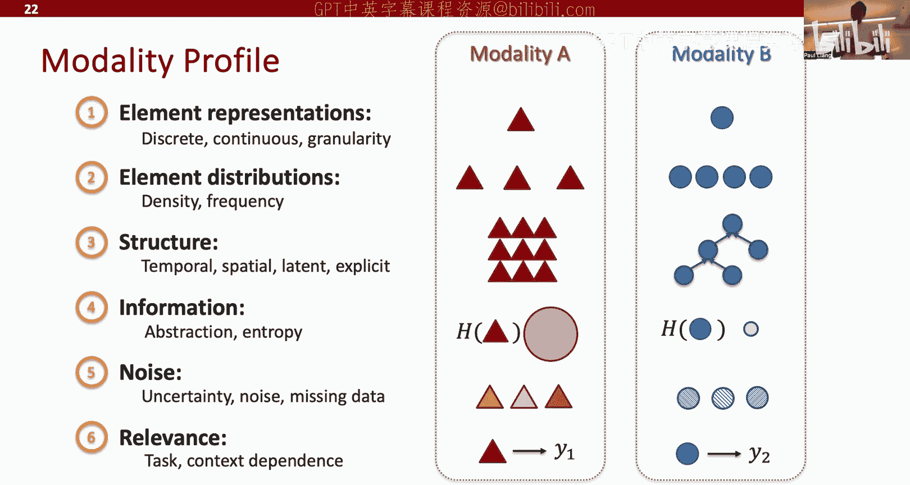

对于语言，根据哲学观点，有些人认为语言应该通过语法分层组合，你首先看“茶杯”这个名词，然后……（这里演讲者有些犹豫，未说完）。有些人认为语言应该通过查看单词并分层组合它们，通过某种语法形成更高层次的意义。例如，有很多工作致力于构建尊重这种语法的神经网络。

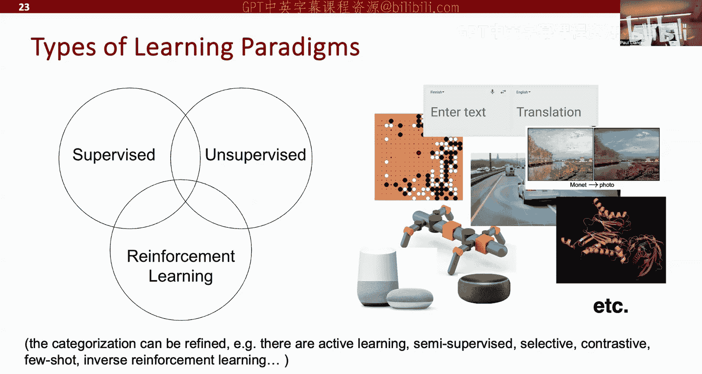

这是一种非常乔姆斯基式的思考方式。当然，如今人们从经验上知道，效果最好的方法可能并不完全是尊重所有这些语法结构。你可以简单地将其视为序列，也许是一个序列，并使用像Transformer这样的序列模型，这对于其他事情可能效果很好。例如，如果你有一个图或树，你的元素可能以某种特定的结构组合形成更抽象的表示，这是你应该根据它来设计模型的东西。

因此，结构。你查看了单个元素，我们如何表示它们，这些元素的频率，以及这些元素如何组合，结构组合是什么。

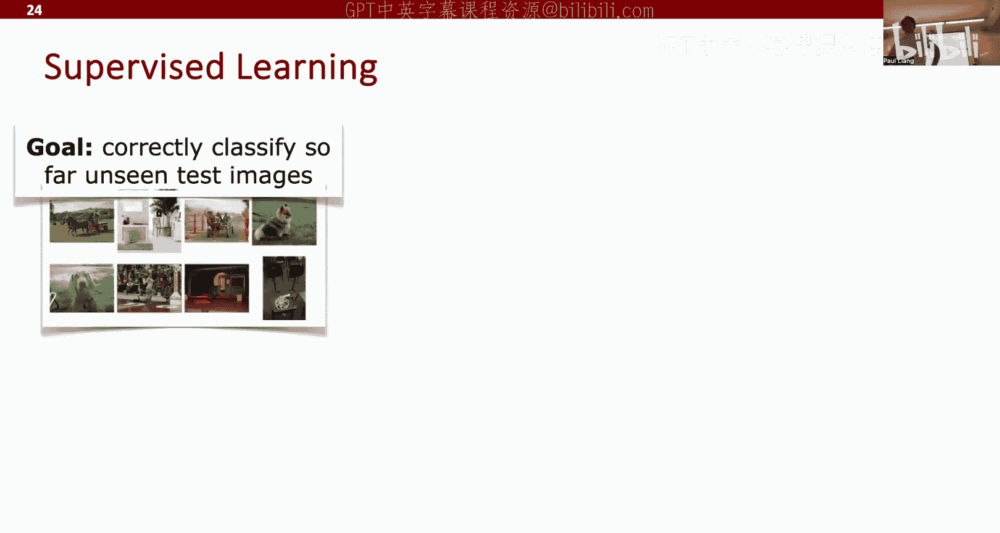

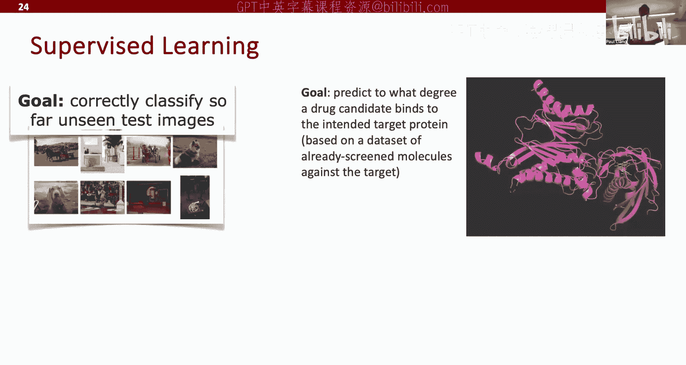

通常，我们也关心总信息量。抱歉，是你的模态中的总信息量。一旦你将它们组合成更抽象的高层表示，它们提供什么信息？我可以对这些我关心的图像做出什么推断？我可以对我关心的句子做出什么推断？

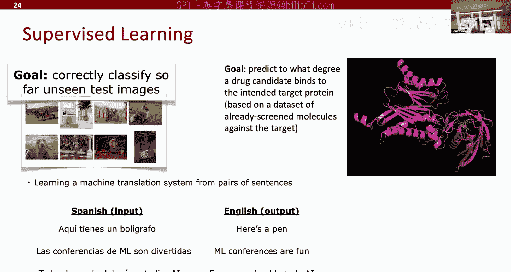

自然地，一些模态会比另一些拥有更多信息。实际上，有些模态确实比其他模态拥有更多信息。通常，这些模态在它们拥有的信息上也可能重叠。

最后，一个我们通常不考虑的维度，但当你开始从某些传感器收集这些模态时，它也是一组非常重要的规范。它们通常是不完美的：相机容易出现抖动和晃动以及遮挡；语言如果在计算机上输入，容易出现各种拼写错误；如果是口语，容易出现人们说话时犯的不同错误。通常，这些类型的噪声有独特的模式。

因此，思考你的数据中可能出现的噪声类型，以及实际出现的噪声类型，也是当你收集和处理数据时另一个重要的维度。

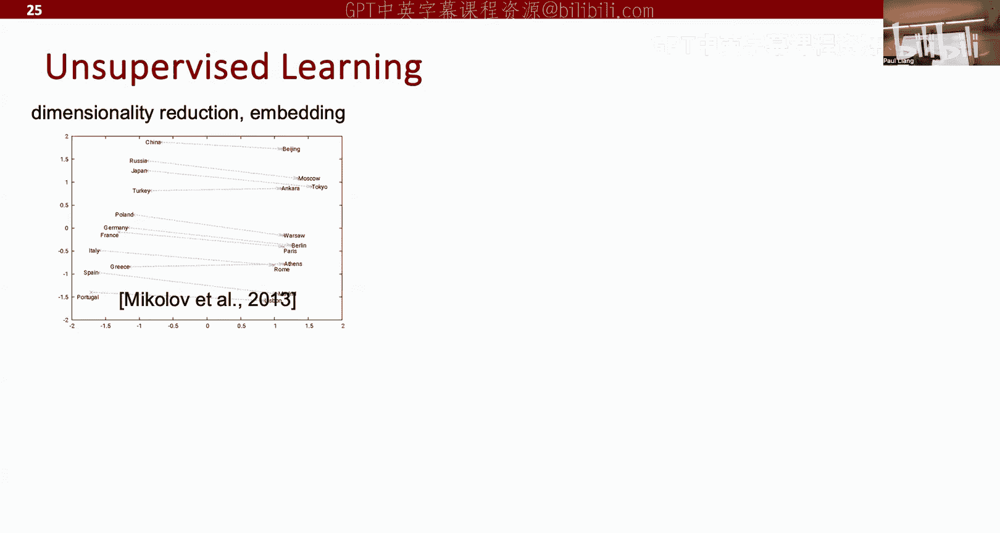

## 学习范式概述

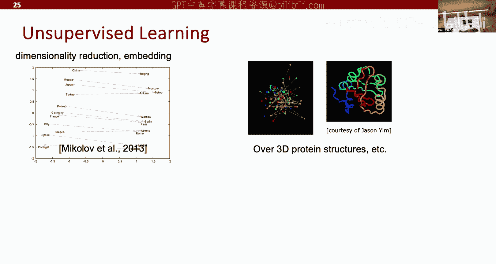

好了，这是对各种数据形式的总结（远非详尽），以及对不同剖面、不同维度的一般性看法。当你开始收集数据时，思考这些维度通常非常有用：元素是什么（这只是数据的一个元素）、它们的分布和频率、当你将它们组合成更高层次抽象时结构如何出现、不同形式的信息、是否存在噪声或不完美之处以及它们是什么。我并没有真正涵盖这一点，但它与你关心的预测任务的相关性如何。

好了，这就是数据。现在你有了数据，我们经常谈论学习，即如何从数据中学习？

我借用了一些本学期也在教授的机器学习入门课程的幻灯片。但总的来说，在高层次上，学习范式通常有三种类型。这些并非详尽无遗，它们也相互重叠，中间有交叉，并且不断扩展，但通常考虑三种学习目标是有用的：监督学习、无监督学习和强化学习。

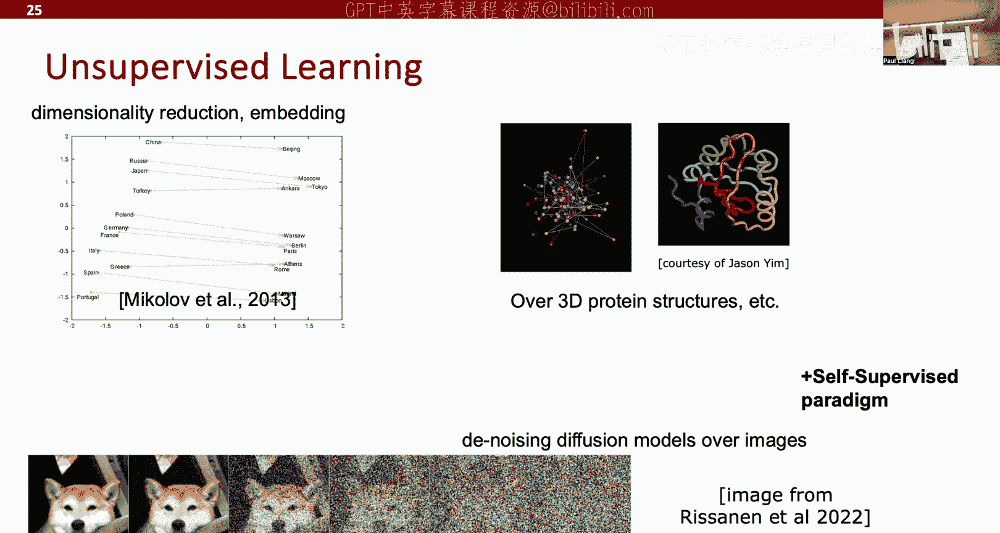

### 监督学习

监督学习本质上意味着你的数据有某种监督。原始数据输入，监督通常以某种标签的形式出现，即你想为数据预测的东西。例如，你可能有一堆图像，并且有这些图像中物体的标签：猫、狗、桌子、人等，这很简单。你可能有一个蛋白质结构，并且有一些关于它与哪些蛋白质相互作用或结合的标签。你可能有一个句子，例如西班牙语（这是你的输入数据），并且有它在其他语言中的对应翻译的标签。所有这些都是监督学习的例子。我们有数据X，有标签Y，你愿意提供这种监督，如何从中学习。

### 无监督学习

无监督学习则不同。“无”基本上意味着没有监督。现在你只有数据，但你不愿意提供监督来收集标签，因为标注数据可能成本高昂，需要大量人力，或者标签本身可能非常主观，比如一个人的情感可能非常主观。

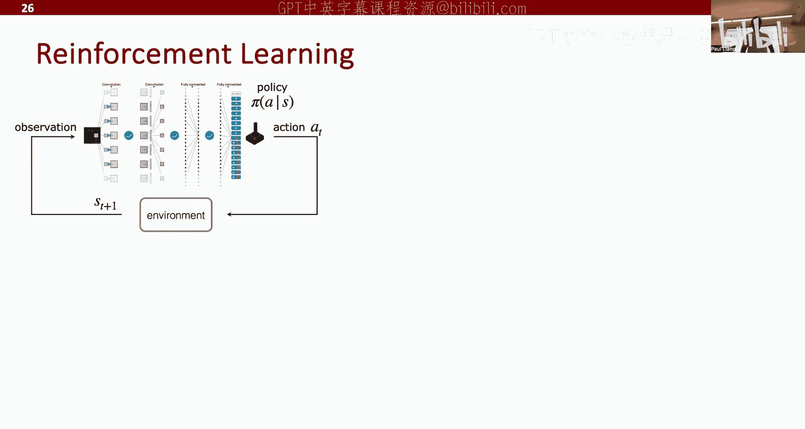

因此，你可能希望进行无监督学习，你只有数据X，你希望学习一些特征，这些特征最终可能对你愿意收集的标签或其他任务有用。

无监督学习的几种类型：你可能只关心降低维度，在低维空间中可视化你的数据，这不需要标签，只用你的数据就可以完成。例如，你能可视化单词吗？这些像词向量的东西，它们有一些结构，因为某些国家被分组在一起，某些单词被分组在一起。

你可能希望训练生成模型。如果你有大量蛋白质数据，但没有这些蛋白质是什么或它们如何与其他蛋白质相互作用的标签，你仍然可以学习一个模型，该模型本质上估计你的蛋白质分布，并可能生成更多蛋白质。你也见过图像，对吧？你有一堆图像，你不想标注里面有狗的事实，你仍然可以获取大量图像并训练一个能够生成新图像的模型。

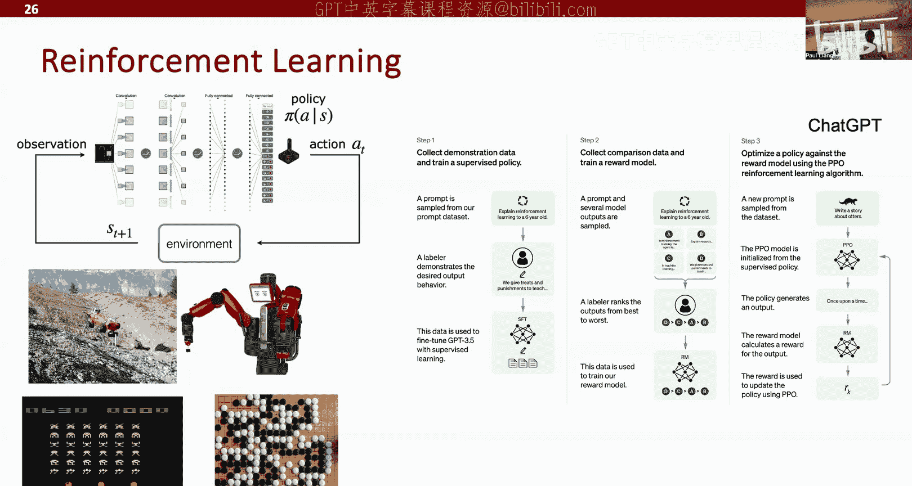

当然，如今，无监督学习和监督学习通过自监督学习的思想真正地交叉在一起。因此，你可能拥有大量数据，无标签，标注成本太高，但你仍然可以在未标注数据上定义一些良好的训练目标来学习这些抽象、这些特征。迁移学习或微调，即你有一些少量的标注数据和监督，是它们之间的一些交叉。

一个例子是：这些是狗的图片，如果你能成功学习所有狗图像的分布并生成新的狗图像，那么这些特征很可能在预测和识别狗图像时非常有用。

### 强化学习

第三种学习范式是强化学习。监督和无监督学习通常着眼于涉及单步的任务。你做出预测就完成了，或者你生成另一个样本就完成了，或者你可视化数据就完成了。强化学习着眼于通常跨越多个时间步的问题。

游戏是这方面的一个很好的例子。如果你想训练一个交互式系统来玩像国际象棋和围棋这样的游戏。通常会有游戏的某种状态，例如当前棋子的状态；你采取的一些行动，例如走一步棋，这会转换到游戏的新状态，即棋子的新配置，你可能希望在其中采取另一个行动，依此类推，直到你赢得游戏。

这个多步过程的一个关键区别是，我们不能再在局部步骤中最大化并选择最佳行动。可能有很多情况，你为了在长期获得更好的行动，而在短期内采取次优行动。这是强化学习最大的挑战之一：如何权衡短期行动以获得长期真正好的行动？

我们在游戏中看到它们，在机器人技术中看到它们，如今在大型语言模型中也看到它们。你可以将大型语言模型与人类的交互视为某种多步交互，你可能会提示它，得到一个答案，再次提示它，得到一些答案，这种跨越多个步骤的对话，你的目标是真正最大化你的长期奖励。因此，正如你可能已经看到的，有很多工作致力于应用强化学习方法来最大化人类与智能体之间长期交互的质量，我们将在课程中涵盖其中一些内容。

这三种范式可能对你们大多数人来说都很简单，有些人可能以前见过它们。我还想快速介绍更多学习范式，当你开始查看课程项目并思考可以收集哪些形式的数据时，这些范式非常有用，以便它们适合这些当前从数据中学习的方式之一。

## 其他重要学习范式

你看到了监督学习：X输入，预测Y。因此，你需要包含成对标注的X和Y的数据。当然，这是多模态学习，你有多个输入X进来，每个都提供互补信息，你可能对Y做出一些推断。这当然比只有X给你更多信息，前提是X1和X2选择得当。但现在你需要包含X1、X2和Y的数据，因此对你的数据有更多要求，而且通常数据量更少。

还有多任务学习，X输入，你同时预测Y1和Y2，利用两个任务互补的事实。例如，你可能想预测一个人的情绪，同时也预测一个人的压力，这两个任务通常相互关联。你可能想预测机器人抓取的物体的某些属性，同时也采取下一个动作来操纵物体。同样，这两个任务，虽然一个是标签，一个是动作，但彼此相关。因此，多任务学习如果效果好，可以表现得非常好。当然，限制是现在你需要X、Y1和Y2在一起的数据，即数据和两个标签在一起，这同样可能限制你拥有的数据量。

迁移学习略有不同。你可能在第一个任务Y1上训练一个模型X。训练该模型。然后，取你训练好的模型，并将其迁移到第二个任务Y2上。因此，继续在第二个任务Y2上训练该模型。

与多任务学习略有不同，因为现在你分两个阶段进行。第一阶段你需要X和Y1数据，第二阶段你可能只需要X和Y2数据。这也非常常见。这种两阶段过程在Y1和Y2数据分布不均时特别有用。例如，假设我训练一个图像模型来分类自然图像。我可以从互联网上获取大量自然图像数据，获取大量自然图像的标签。但然后我想迁移到一些在医院收集的医学图像上。因此，你将拥有少得多的医学图像和医学标签。迁移学习允许你处理这种不对称性。

跨模态学习是不同模态的扩展。有时训练X1模态用于Y，然后迁移到X2模态用于Y（或可能略有不同的Y）可能非常有帮助。因此，跨模态学习的输入模态不同，当你进行这种迁移学习时，如今X1可以是语言，你为某个任务训练大型语言模型。令人惊讶的是，这些大型语言模型不仅可以迁移到语言，还可以迁移到代码、数学、蛋白质结构、基因组序列，甚至机器人状态和动作序列，以及游戏状态。因此，我们如何推动跨模态学习的极限？不同的模态。你正在进行这种迁移吗？当然，可以结合这些。你可以进行跨模态学习，模态不同，同时也进行迁移，只要它们之间存在某种关系。

无监督和自监督预训练也非常常见。它是迁移学习的一种扩展，其中你不是以监督方式从X到Y1训练你的第一个模型，而是在第一个模型上进行一些无监督学习，即X到X‘。X’是X的某种变换。在这种情况下，你在第一步不需要任何标签，你只需要X，而X‘本质上是你创建的这种自监督标签。

有几种方法可以做到这一点：你可以使用图像的左半部分来预测右半部分；你可以将图像分解成不同的部分，像拼图一样，让模型重建哪些拼图部分应该放在哪里以重建完整图像；你可以使用前五个单词来预测第六、第七个单词（自回归生成）；你可以旋转图像或向其添加噪声，然后尝试去除噪声或无限旋转图像。只要X和X‘之间存在某种关系，你就可以自动在计算机上完成，并且本质上可以无限访问X和X’对，从而预训练你的模型。

通常，如果设计得当，这些特征将非常强大，因为首先你拥有大量数据，X数据比X-Y标注数据多得多，所以你可以利用大量数据。如果你的特征和X到X‘的设计得当，那么它实际上会学习到非常好的特征，然后可以迁移到某个任务Y上。

因此，我们称之为无监督或自监督预训练。

## 互动学习范式

更多互动学习范式。之前主要是关于进行预测。但互动学习范式，我们看到了强化学习，其中X（你的数据，或在强化学习中通常称为状态）输入，你可能采取多个行动，因为有多个状态、多个观察和多个你必须采取的行动。你可能最终获得一些奖励，你的目标是最大化这个长期奖励。因此，你想将强化学习视为多个行动、多个步骤。

大型语言模型适应也是使模型更具互动性的常见方法。你可能有一个本质上是监督性质的模型X->Y，即X预测Y，只是一个类别、数字或分类。你可以开始适应大型语言模型，使你的模型输出语言内容。这可能非常有用，因为现在你不仅可以预测是猫还是狗，还可以提出后续问题，例如它是什么类型的猫或狗。你甚至可以提示模型解释为什么它是猫，因此模型识别出它有四条腿、不同颜色等。本质上，通过使用大型语言模型向输出空间添加语言，使你的模型在回答所有问题甚至解释其决策时更具互动性。

当然，如何完美、稳健地做到这一点而不产生幻觉仍然是一个问题。

课程学习或主动学习。这是一种非常常见的范式。假设你有一个任务Y非常困难，如果你直接在Y上训练模型，模型会很糟糕。你可以做的是，首先用一些更容易的任务来监督模型。就像学生学习一样，学生从一些课程中学习，从容易的任务到更困难的任务。如何选择那个课程是一个开放性问题，但有很多相关工作。

主动学习是类似的范式，你可能首先拥有你的数据，模型对容易的数据做出预测，然后根据模型的当前状态，你将寻找越来越困难的数据或模型需要解决的越来越困难的任务。

人在回路学习。之前的一切大多只是在计算机上自动完成的。当然，在许多设置中，你有X来预测某个标签或采取某些行动，中间有一些人类反馈，然后可以用来为新的X训练模型并做出新的预测。这可以迭代进行，直到你对性能满意为止。它可以是原始的人类反馈，或者在你看到足够多的人类反馈后，你可以训练另一个模型来模仿人类如何给出反馈，这可以成为从某些人类反馈到最终自动化并预测人类将如何给出反馈的一种方式。

## 模型评估与泛化

现在让我最后介绍几个其他重要的提示。我们研究了不同形式的数据，你应如何思考所收集数据的属性，以及从数据中学习并找到学习过程的不同学习范式。本质上，机器学习和人工智能的整个目标是找到一种好的方法来建模、学习关系、从数据中学习特征。

通常，你会考虑一个模型或一类模型。一类模型可以是一类神经网络（许多大型语言模型）、一类线性函数、一类决策树等。例如，在一维情况下，如果你有X和Y，你有一些包含X和Y标签的数据。

因此，有了数据和标签，你本质上是在学习一个函数，该函数学习数据之间的关系。你经常看到这些框图：X输入，你学习某个函数F或H，然后做出预测Y。

在下一讲中，我们将研究如何定义这些模型，这些模型是什么样子。你的模型表现如何，很大程度上取决于你如何选择模型或如何定义模型的参数。

但在深入探讨模型本身之前，你如何评估模型的好坏呢？

因此，经常出现一个称为过拟合与泛化的问题。真正的目标是泛化到未来的数据。在机器学习中，我们谈论你收集的所有这些数据。例如，你收集了一堆图像，并为其中的不同物体标注了标签。你本质上是在这些数据上训练模型，但你的希望是泛化到新数据。如果我明天用相机拍一张新照片，我希望能够做出预测；如果一年后有人与我的智能体互动，我希望大型语言模型在那次互动中表现良好。

因此存在风险。有时模型没有捕获关系，我们称之为欠拟合，即它没有很好地学习关系，你的模型能力不足。如果它过于完美地捕获了关系，我们称之为过拟合，即它已经专门化到你的训练数据，可能无法泛化到你实际在测试数据上部署模型时的情况。

因此，这条蓝色曲线显然是过拟合，与训练数据拟合得太好，而不是实际上具有平滑的关系。

这是一个需要担心的问题。通常在实践中，你会收集数据，将其分为训练集、验证集和测试集。这旨在模拟在测试新数据之前收集数据进行训练的概念。你本质上在训练集上训练模型，在验证集上调整超参数，并在测试集上测量模型的表现，以此模拟模型在尚未拥有的真实未来数据上的表现。

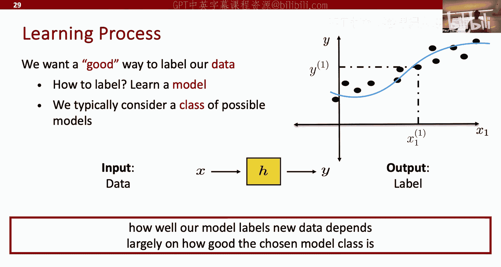

当然，确保你的测试数据条件尽可能接近你实际想在现实世界中部署模型的条件至关重要。

## 数据处理流程总结

好了。总结一下，如何对待数据？我将为每张幻灯片添加“如何做某事”，但这次是关于数据或如何处理数据。

首先，决定收集多少数据以及标注多少数据，假设你将收集标签。考虑收集数据的成本、雇佣人工标注员标注数据的成本，包括金钱成本、时间成本等。

清理数据。通常需要对数据进行一些归一化或标准化，以便所有数据都处于一个良好的范围内。查找噪声数据，检测异常值、异常情况，有各种软件包可以做到这一点。

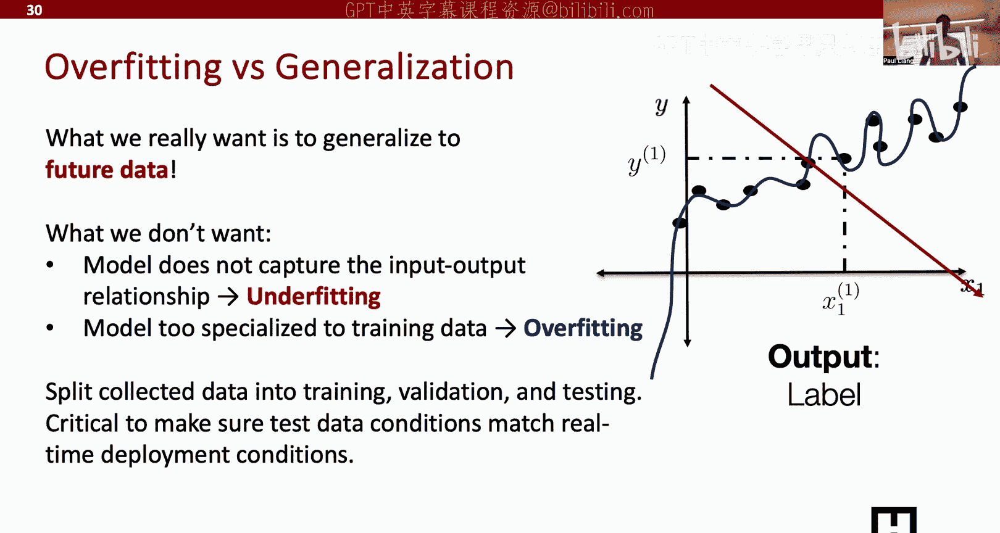

可视化你的数据。很多人做得不够，但你想绘制它。如果这是X1，这是Y，我绘制它，我知道我正在寻找X和Y之间的线性关系，这给了我设计什么模型的思路。这是一维的，所以更容易绘制。如果你的数据是高维的，有降维方法，如PCA、t-SNE，来识别聚类。我的数据是否首先落入我想要预测的聚类中，然后我才为它们设计任何模型？

选择评估指标。什么是评估模型好坏的好方法？无论是预测连续值、分类错误，还是更复杂的方法，如用户研究或可用性测试。你还想查看代理指标和真实指标。如果你的真实指标是未来人类如何使用，你不想在设计模型时与人类迭代，你可以使用它来获得一些近似真实指标的代理指标。

质量度量：单一量化指标和定性分析。

然后，并且只有在那时，你才会选择模型类别、学习算法并进行机器学习。不要从这一步开始，一、二、三、四需要先完成。

## 课程总结与作业

好了，总结一下，我们看了几个常见数据模态的例子。我们给出了一个统一的框架，说明如何思考数据中的维度。我们看了数据类型、标签和学习目标的类型，以及挑战，例如过拟合、欠拟合和实际泛化到现实世界的例子。

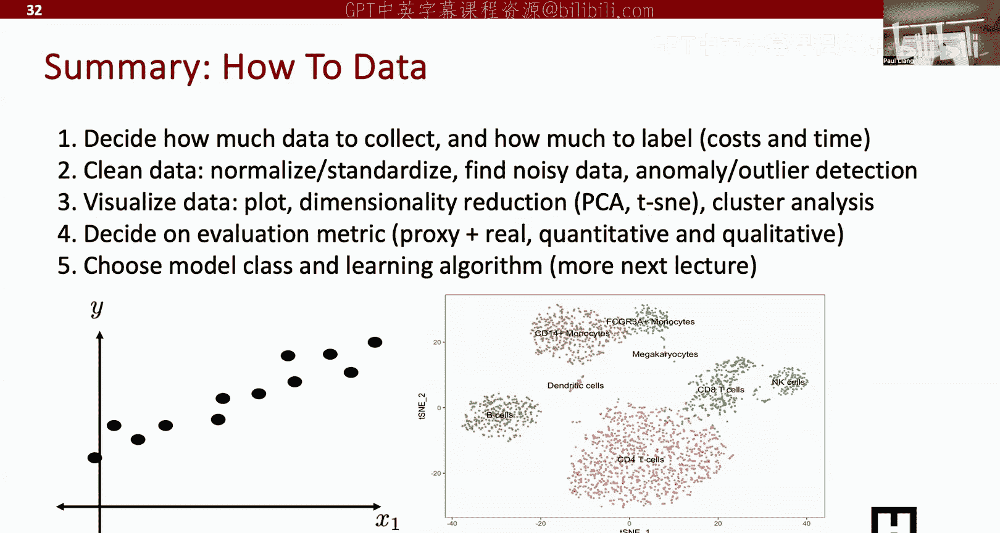

因此，本周的作业：还没有阅读作业，那将从下周开始。请确保在今天之前填写你的项目意向表，向我们概述你正在寻找的任务、数据和队友。

如果你还没有找到团队，请出去交流一下，尝试找到兴趣相似的人。

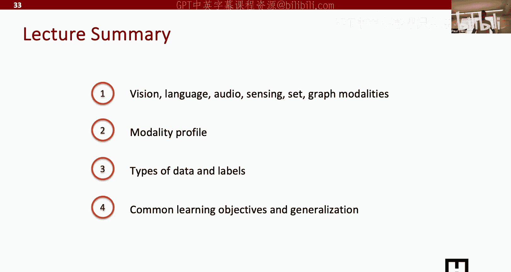

项目提案展示将在下周四进行。每个团队大约五分钟，我们将发出说明。本周四，我的学生将主持一个关于机器学习工具以及训练和调试流程实用技巧的教程。

好了，各位。今天和周四，如果你想讨论项目，我将在今天和周四的下午2点到3点在我的办公室，我们可以讨论你的课程项目，如果你需要任何反馈的话。

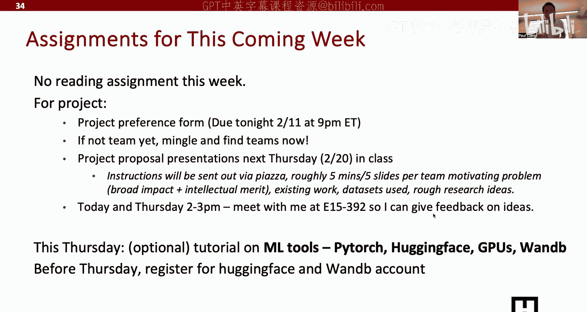

好了，谢谢大家。