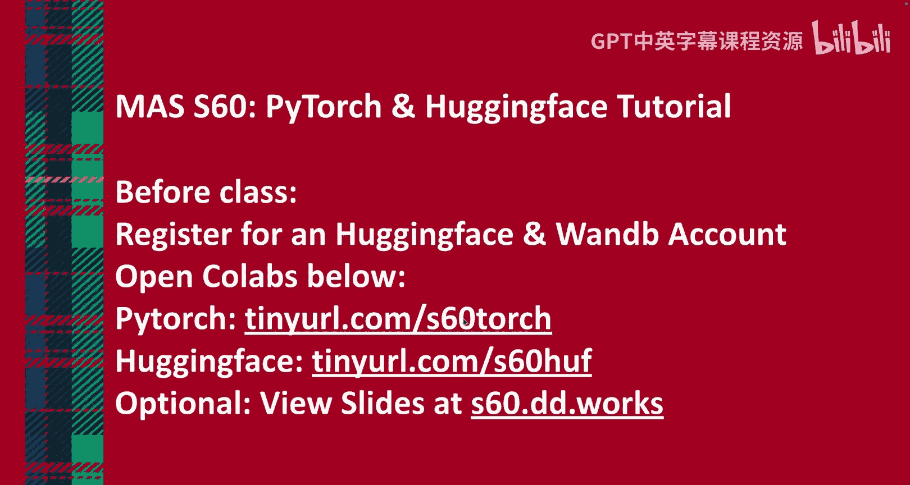
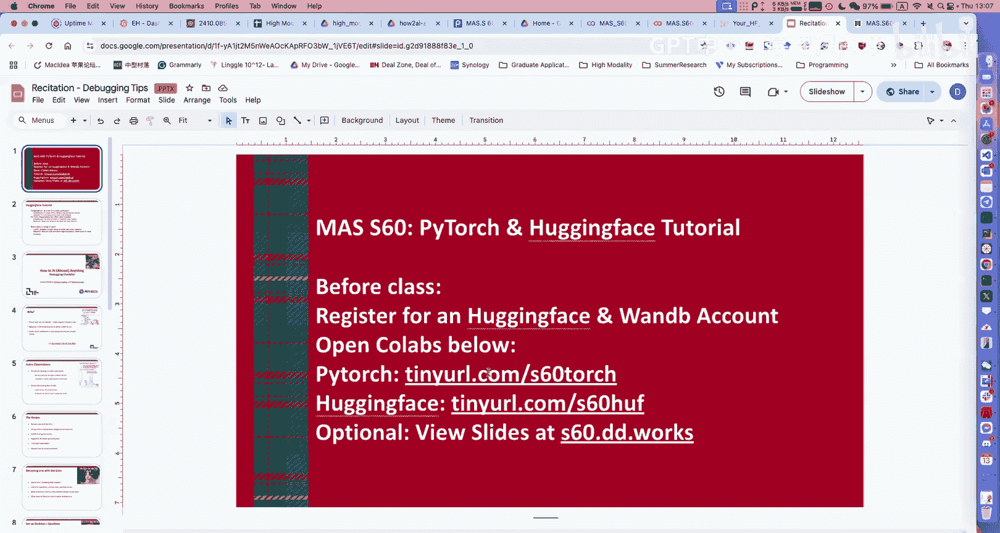
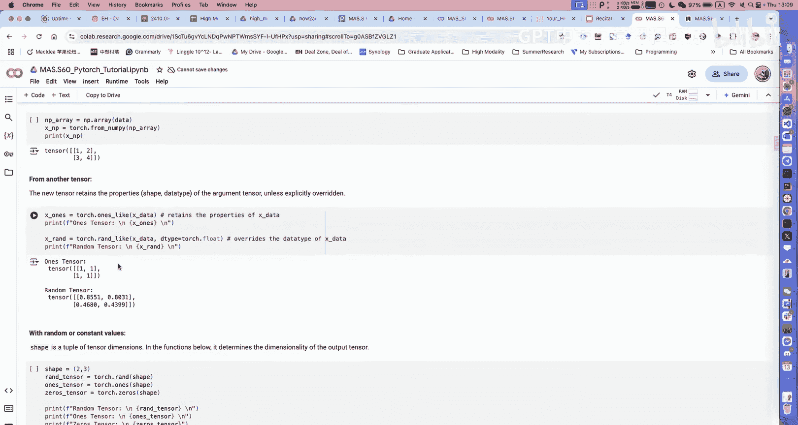
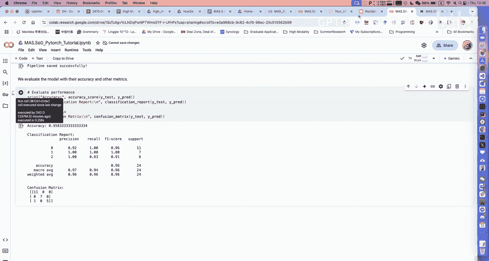
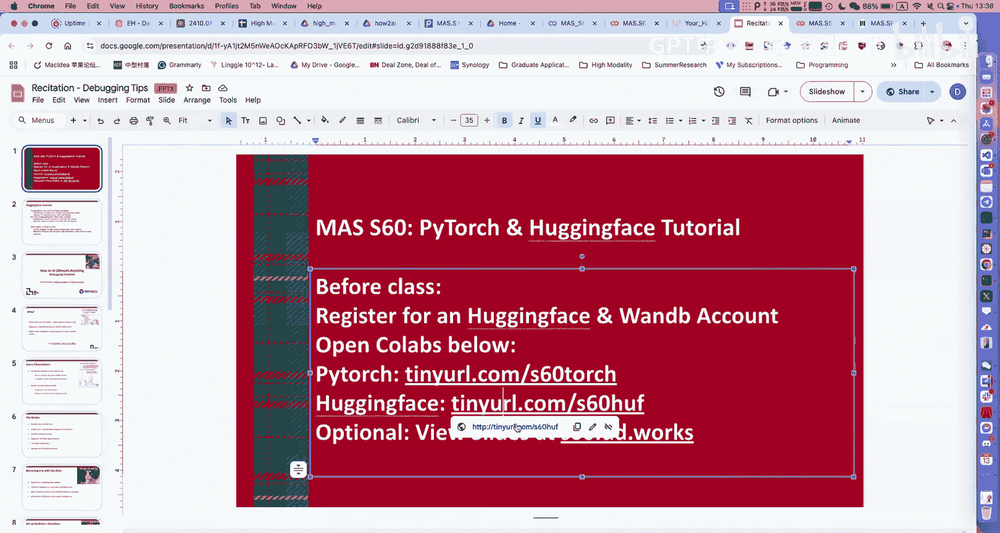
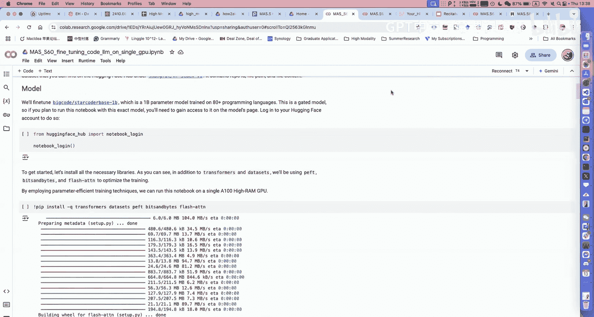
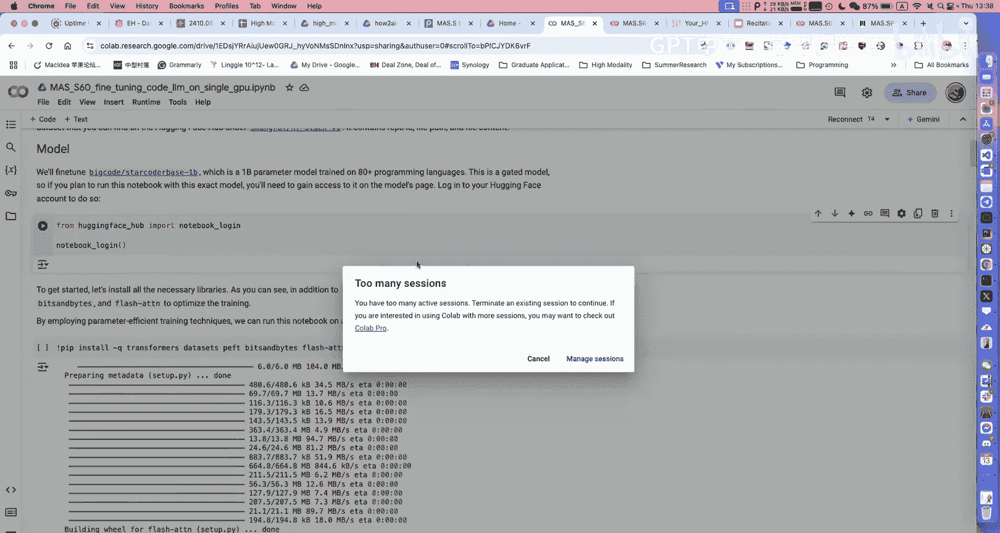
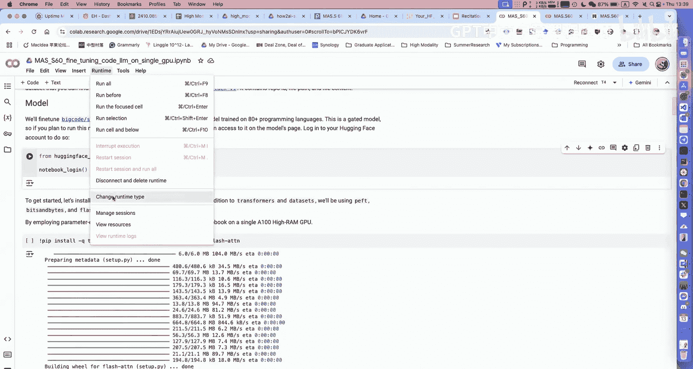
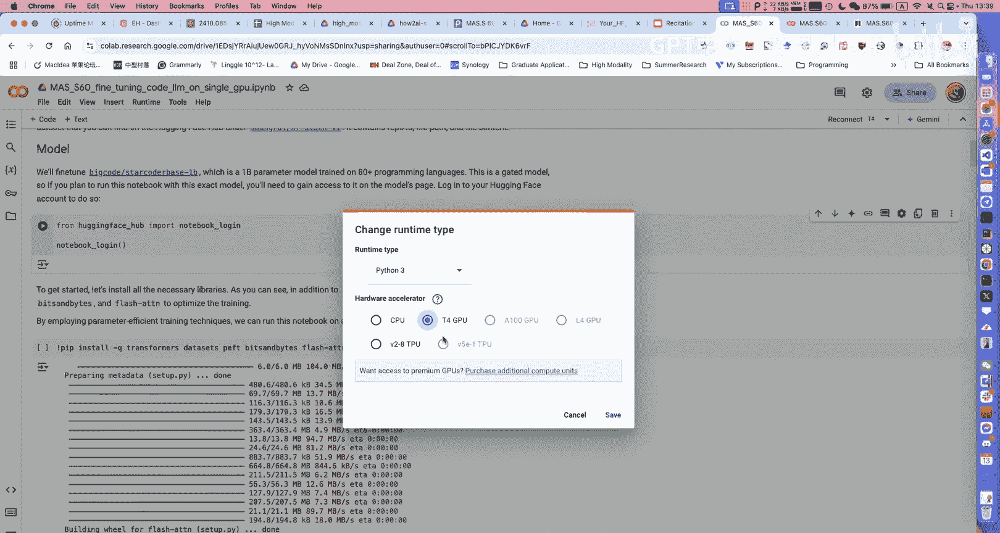
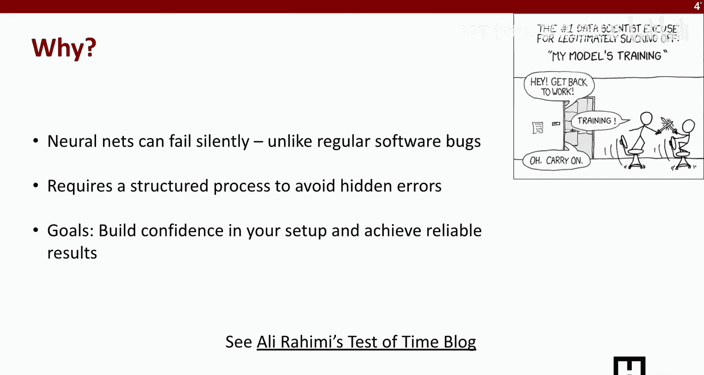

# 4：实用AI工具教程 🛠️

在本节课中，我们将学习如何使用PyTorch和Hugging Face等实用AI工具来构建、迭代和调试机器学习模型。课程内容涵盖从数据处理、模型训练到性能评估的完整流程，旨在为初学者提供清晰、直接的指导。

## 课程安排与后勤

在开始技术教程之前，我们先了解一些课程安排。请确保你已经提交了项目提案。提案表格已共享在Piazza上，你可以通过该表格寻找有相似兴趣的队友组队。

下周我们将进行项目提案展示，每个小组有5分钟时间介绍项目想法、计划使用的数据集等，以获取课程反馈。展示后一周，需要提交一份简短的书面报告。请尽快填写表格组队，并开始准备提案展示和报告。





接下来，助教David和Chanaka将为我们讲解关于高效构建、迭代和调试ML模型的实用技巧。

## PyTorch基础与简单项目实践




上一节我们介绍了课程的后勤安排，本节中我们来看看如何使用PyTorch进行机器学习。我是本课程的助教David，我将首先介绍如何使用PyTorch，然后通过一个在真实数据集上的简单项目来演示完整流程。

在开始前，请打开以下两个Colab页面，以便跟随操作：
*   Colab 1: [链接]
*   Colab 2: [链接]

本教程旨在帮助你入门PyTorch。如果你已有经验，可能会觉得基础，但我会确保每个人都能有所收获。

### PyTorch简介与张量基础

PyTorch是一个帮助加速机器学习过程的库。其核心概念是**张量（Tensor）**，你可以将其理解为线性代数中的多维数组。

首先需要导入PyTorch库：
```python
import torch
```

你可以通过多种方式初始化张量。如果你有一个像 `[[1,2], [3,4]]` 这样的二维数组，可以直接用它来创建张量：
```python
data = [[1,2], [3,4]]
x = torch.tensor(data)
```
如果你熟悉NumPy，也可以将NumPy数组转换为张量：
```python
import numpy as np
np_array = np.array(data)
x_from_np = torch.from_numpy(np_array)
```

你可以初始化特定形状的张量。例如，要创建一个2行3列的随机张量、全1张量或全0张量：
```python
x_rand = torch.rand(2, 3)   # 随机张量
x_ones = torch.ones(2, 3)    # 全1张量
x_zeros = torch.zeros(2, 3)  # 全0张量
```

关于张量，有两个需要特别注意的属性，它们是常见的错误来源：
1.  **数据类型（dtype）**：张量可以有不同的数据类型（如整数、浮点数）。确保参与运算的张量数据类型兼容。
    ```python
    print(x.dtype)  # 检查张量数据类型
    ```
2.  **设备（device）**：张量可以位于不同的设备上，如CPU或GPU。位于不同设备上的张量不能直接运算。
    ```python
    print(x.device)  # 检查张量所在设备
    # 将张量移动到GPU
    if torch.cuda.is_available():
        x_gpu = x.to('cuda')
    ```

张量支持基础运算。例如，对于两个张量 `x` 和 `y`：
```python
z = x + y   # 逐元素相加
z = x * y   # 逐元素相乘（**不是矩阵乘法**）
```
在PyTorch中，矩阵乘法需要使用特定函数：
```python
z = torch.matmul(x, y)  # 矩阵乘法
# 或使用 @ 运算符
z = x @ y
```

以上是对PyTorch张量操作的简要概述。

### 实战：基于气味传感器数据的分类项目

接下来，我们将通过一个完整的简单项目来演示整个流程。我们将使用实验室收集的小型气味传感器数据，对三种气味（环境空气、酒精、咖啡豆）进行分类。

在构建模型之前，我们必须先查看数据。根据我的经验，数据的实际格式与文档描述不符的情况非常普遍，因此先检查数据至关重要。

首先运行以下单元格来下载数据并导入必要的库。
```python
# 假设的下载和导入代码
# !wget [数据链接]
# import pandas as pd, torch, sklearn, etc.
```

数据包含三个类别的CSV文件。我们使用 `os.listdir()` 来列出所有文件，并用 `pandas` 打开一个文件查看其结构。
```python
import os
import pandas as pd

data_dir = './smell_data/'
files = os.listdir(data_dir)
sample_df = pd.read_csv(os.path.join(data_dir, files[0]))
print(sample_df.head())
```
你会看到许多列，分别对应不同的气体传感器读数以及一个“状态”列。

对于时间序列数据，可视化非常重要，它能帮助你理解哪些数据与分类相关。
```python
import matplotlib.pyplot as plt
# 绘制某个传感器通道随时间的变化
plt.plot(sample_df['sensor_channel_1'])
plt.show()
```
在我们的数据中，传感器先采集环境背景读数（状态0），然后将物质靠近传感器采集实际读数（状态1）。通过计算状态1区域的平均值并减去状态0的背景值，我们得到了相对变化值，这能有效消除环境因素的影响，是数据预处理的一部分。

观察数据可以发现，不同传感器通道的读数范围差异很大（例如0-2000 vs 0-100）。这告诉我们**需要进行归一化**，因为神经网络对输入尺度很敏感，数值过大的通道会主导训练过程。

以下是数据处理的关键步骤：
1.  **加载并合并数据**：读取所有CSV文件，提取特征和标签。
2.  **归一化**：使用 `sklearn` 的 `StandardScaler` 将输入数据缩放到相近的范围。
3.  **划分数据集**：按80%训练集、20%测试集的比例划分。
4.  **创建Dataset和DataLoader**：
    *   `Dataset` 负责存储数据和标签。
    *   `DataLoader` 负责批量加载数据，支持并行处理以加速训练。使用较大的批量大小可以使梯度计算更稳定。

```python
from torch.utils.data import DataLoader, TensorDataset
from sklearn.model_selection import train_test_split
from sklearn.preprocessing import StandardScaler

# 假设 X 是特征， y 是标签
scaler = StandardScaler()
X_normalized = scaler.fit_transform(X)

X_train, X_test, y_train, y_test = train_test_split(X_normalized, y, test_size=0.2, random_state=42)

train_dataset = TensorDataset(torch.FloatTensor(X_train), torch.LongTensor(y_train))
train_loader = DataLoader(train_dataset, batch_size=32, shuffle=True)
```

### 构建、训练与评估模型

现在我们可以设计模型。这里我们使用一个简单的多层感知机（MLP），包含多个线性层、批归一化层和ReLU激活函数。

```python
import torch.nn as nn

class SimpleMLP(nn.Module):
    def __init__(self, input_size=13, hidden_size=64, output_size=3):
        super(SimpleMLP, self).__init__()
        self.layers = nn.Sequential(
            nn.Linear(input_size, hidden_size),
            nn.BatchNorm1d(hidden_size),
            nn.ReLU(),
            nn.Linear(hidden_size, hidden_size//2),
            nn.BatchNorm1d(hidden_size//2),
            nn.ReLU(),
            nn.Linear(hidden_size//2, output_size)
        )
    def forward(self, x):
        return self.layers(x)

model = SimpleMLP()
```
对于我们的简单数据，两到三层通常就足够了。输入大小是13（传感器通道数），输出大小是3（类别数）。

以下是训练循环的核心步骤：
1.  从 `DataLoader` 获取一个批量的数据和标签。
2.  将数据输入模型，得到预测输出。
3.  计算损失（预测输出与真实标签的差异）。
4.  反向传播计算梯度（指导模型参数如何更新）。
5.  优化器根据梯度更新模型参数。

```python
import torch.optim as optim
criterion = nn.CrossEntropyLoss()
optimizer = optim.Adam(model.parameters(), lr=0.001)

for epoch in range(num_epochs):
    for data, labels in train_loader:
        optimizer.zero_grad()  # 清零梯度
        outputs = model(data)   # 前向传播
        loss = criterion(outputs, labels) # 计算损失
        loss.backward()         # 反向传播
        optimizer.step()        # 更新参数
```

评估阶段与训练类似，但不进行参数更新。我们计算模型在测试集上的准确率。
```python
model.eval()  # 将模型设置为评估模式
with torch.no_grad():  # 不计算梯度
    test_outputs = model(torch.FloatTensor(X_test))
    predicted = torch.argmax(test_outputs, dim=1)
    accuracy = (predicted == torch.LongTensor(y_test)).float().mean()
print(f'Test Accuracy: {accuracy:.2%}')
```
在这个例子中，我们获得了约75%的准确率。我们还可以查看更详细的分类报告（精确率、召回率、F1分数），以分析模型在哪些类别上表现好或差。

模型迭代改进的方法是：识别表现最好和最差的类别。对于表现差的类别，分析是数据不足还是其他问题，并据此决定是收集更多数据还是调整模型。

最后，别忘了保存训练好的模型以供后续使用。
```python
torch.save(model.state_dict(), 'smell_classifier.pth')
```

### 关于数据划分与模型选择的思考





在划分训练集和测试集时，应尽可能模拟真实应用场景。例如，如果你计划在不同日期使用模型，那么应该用某天的数据训练，用另一天的数据测试，而不是随机打乱同一天的数据。

此外，对于这个数据集，我们还尝试了**随机森林**这种非深度学习的简单模型。
```python
from sklearn.ensemble import RandomForestClassifier
rf_model = RandomForestClassifier()
rf_model.fit(X_train, y_train)
rf_accuracy = rf_model.score(X_test, y_test)
```
结果随机森林的准确率达到了95.8%，远高于我们简单的MLP模型。这揭示了一个实用技巧：**对于低维数据，简单的浅层模型（如随机森林、SVM）的性能可能优于复杂的深度模型**。因此，建议先从简单模型开始尝试。

## 使用Hugging Face微调大语言模型

上一节我们使用PyTorch完成了一个端到端的项目，本节中我们来看看如何利用Hugging Face生态来微调大型语言模型。









Hugging Face不是单个库，而是一套工具集，让你能用更少的代码训练大模型。其两个核心库是：
*   `transformers`：提供API来加载预训练大模型。
*   `datasets`：方便下载和使用公开数据集。

你可以直接在Hugging Face官网上搜索适合你任务的流行模型，然后将模型名称填入代码即可。此外，还有一些提升训练效率的流行工具，如：
*   `bitsandbytes`：量化模型，减少GPU内存占用。
*   `xformers` 或 `flash-attention`：加速注意力计算，提升训练速度。

本教程将展示如何使用**LoRA**来微调大语言模型。LoRA是一种适配器技术，通过仅训练少量参数来大幅降低内存需求。

请确保在Colab中运行时选择GPU硬件加速器。

首先，我们需要登录Hugging Face，以便访问有使用限制的模型。
```python
from huggingface_hub import notebook_login
notebook_login()
```
运行后会提示输入Hugging Face令牌。你需要在网站个人设置中生成一个具有相应权限的令牌。

我们使用 `bigcode/starcoderbase-1b` 这个10亿参数的模型。一个经验法则是，模型参数数量（以B为单位）乘以2，大致是推理所需的最小GPU内存（GB）。对于训练，则需要更多内存。我们使用的Colab GPU约有4GB内存。

LoRA的相关参数（如`r`、`alpha`）决定了模型修改的程度，数值越大，改动越大，所需内存也越多。

接下来，我们加载并预处理数据集。由于时间关系，我们只使用4000个样本。
```python
from datasets import load_dataset
dataset = load_dataset("dataset_name", split="train").select(range(4000))
```

对于语言模型，我们需要**分词器**将文本转换为模型能理解的令牌（Token）。
```python
from transformers import AutoTokenizer
tokenizer = AutoTokenizer.from_pretrained(model_name)
# 添加填充令牌（如果分词器没有）
if tokenizer.pad_token is None:
    tokenizer.pad_token = tokenizer.eos_token
```

我们需要定义如何从原始数据中提取训练数据。关键步骤是使用分词器对文本进行编码。
```python
def tokenize_function(examples):
    return tokenizer(examples["text"], truncation=True, padding="max_length", max_length=512)
tokenized_datasets = dataset.map(tokenize_function, batched=True)
```


然后，我们以4位精度加载模型，这是为了适应有限的GPU内存。理想情况下，使用16位精度（如`torch.float16`）训练会更稳定。
```python
from transformers import AutoModelForCausalLM
import torch
model = AutoModelForCausalLM.from_pretrained(
    model_name,
    load_in_4bit=True,  # 4位量化加载
    device_map="auto",
    torch_dtype=torch.float16,
)
```

接下来，设置LoRA配置并应用。
```python
from peft import LoraConfig, get_peft_model
lora_config = LoraConfig(
    r=8,  # LoRA秩
    lora_alpha=32,
    target_modules=["q_proj", "v_proj"],  # 对哪些模块应用LoRA
    lora_dropout=0.1,
    bias="none",
    task_type="CAUSAL_LM"
)
model = get_peft_model(model, lora_config)
```

最后，配置训练参数并开始训练。Hugging Face Trainer API与**Weights & Biases**等工具有很好的集成，可以方便地监控训练过程。
```python
from transformers import Trainer, TrainingArguments
training_args = TrainingArguments(
    output_dir="./results",
    num_train_epochs=1,
    per_device_train_batch_size=4,
    logging_dir='./logs',
    report_to="wandb",  # 报告到W&B
)
trainer = Trainer(
    model=model,
    args=training_args,
    train_dataset=tokenized_datasets,
)
trainer.train()
```

在监控训练时，除了损失曲线，还应关注：
*   **GPU内存使用率**：最好保持在80%-90%，既能充分利用内存，又不易出现内存溢出错误。
*   **GPU功率利用率**：如果低于60%，可能意味着数据加载或训练流水线存在瓶颈，GPU经常空闲。
*   **梯度范数**：梯度大小的平均值。如果持续增大，可能意味着训练不稳定。

由于大模型训练耗时较长，我们无法在此等待其完成。但通过上述流程，你已经了解了使用Hugging Face和LoRA微调LLM的基本步骤。

## 机器学习模型调试指南 🐛

上一节我们介绍了使用高级工具库的流程，本节中我们来看看如何系统地调试机器学习模型。调试模型更像一门艺术，而非精确科学。我们的目标是提供一份检查清单，帮助你在模型不工作时，知道该检查什么。

以下是训练神经网络的基本调试流程和心法：

### 调试检查清单

1.  **深入理解你的数据**
    *   机器学习工程师首先应该与数据融为一体。在尝试复杂模型前，花大量时间观察数据分布，看是否能发现直观的模式。对于数据量不大的任务，识别可建模的模式至关重要。

2.  **从简单模型开始**
    *   基于对数据的理解，尝试一个能给出初步信号的简单模型（如线性回归、逻辑回归）。对于已有公开数据集的任务，可以在GitHub上寻找相关的基线模型。

3.  **确保实验可复现**
    *   使用固定的随机种子，消除不必要的随机性，让调试过程更确定。
    ```python
    import torch
    import numpy as np
    import random
    seed = 42
    torch.manual_seed(seed)
    np.random.seed(seed)
    random.seed(seed)
    ```

4.  **简化问题，检查损失**
    *   尽可能简化模型。关注损失的初始值，如果初始损失就是无穷大（NaN），通常意味着模型初始化、数据归一化或损失函数有问题。

5.  **尝试在极小数据上过拟合**
    *   如果模型表现不佳，尝试让它过拟合**单个**或极少数训练样本。这是检验模型**容量**和训练代码**是否正确**的强有力方法。如果模型连一个样本都学不会（无法将损失降到接近零），那么问题可能出在模型架构或代码实现上。

6.  **可视化训练动态**
    *   观察损失曲线是如何下降/上升的，是否有异常波动。
    *   监控梯度范数。梯度爆炸（变得极大）或消失（变得极小）都是常见问题，可能与权重初始化、学习率设置或数据未归一化有关。

7.  **不要过早优化架构**
    *   初期不要过分纠结于设计酷炫的模型架构。在确保简单模型能在训练集上学习之后，再考虑更复杂的架构。

8.  **从过拟合到泛化**
    *   机器学习关心的是泛化能力，而非记忆。一旦确认模型可以过拟合训练集，再引入正则化技术（如Dropout、权重衰减）来提升泛化性能。在此之前不要使用它们。

9.  **系统地调整超参数**
    *   很多时候模型性能不佳，仅仅是因为没有找到合适的超参数（如学习率、批量大小）。对于小模型，进行系统的超参数搜索是值得的。

10. **集成与持续训练**
    *   如果以上步骤都做了，可以尝试模型集成。有时让模型训练超过收敛点（“训练更久”）也会有帮助。

11. **最后考虑复杂架构**
    *   只有在完成上述所有步骤后，如果性能仍不满足要求，再开始研究并应用更复杂的模型架构。

核心思想是：**数据 -> 简单模型 -> 过拟合检查 -> 调优 -> 复杂模型**。遵循这个流程，可以更高效地定位和解决模型训练中的问题。

## 总结



本节课中我们一起学习了实用AI工具的各个方面。我们首先了解了PyTorch张量的基础知识，并通过一个气味分类项目实践了数据预处理、模型构建、训练和评估的完整流程。随后，我们介绍了如何使用Hugging Face生态系统及LoRA技术来高效微调大型语言模型。最后，我们探讨了一份系统性的机器学习模型调试指南，强调了从理解数据、使用简单模型开始，逐步迭代优化的重要性。记住，在追求复杂解决方案之前，确保基础流程正确无误是成功的关键。