# 5：常见模型架构 🏗️

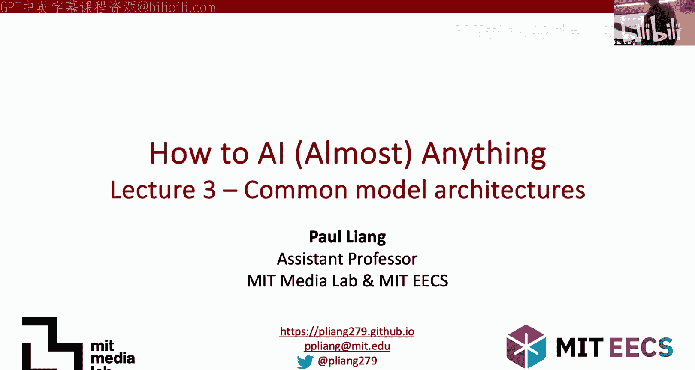

在本节课中，我们将学习深度学习中的常见模型架构。我们将在一个统一的框架下，理解序列模型、空间模型以及集合与图模型的设计原理。课程的核心是理解如何根据数据的固有结构（如不变性和等变性）来设计高效且数据需求量少的模型。

---

## 项目与阅读安排

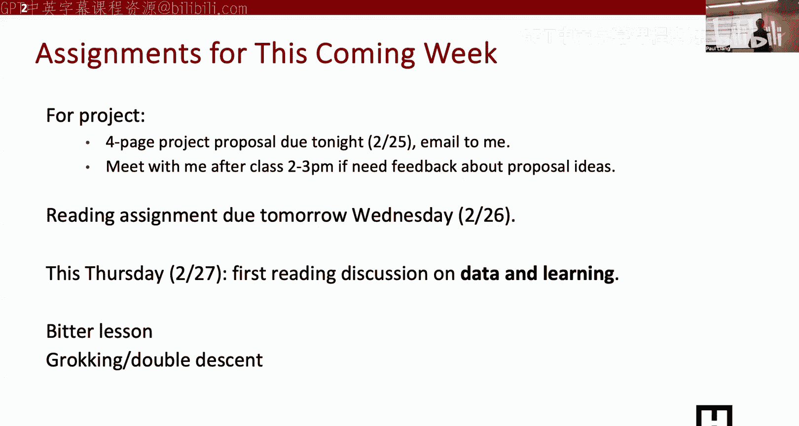

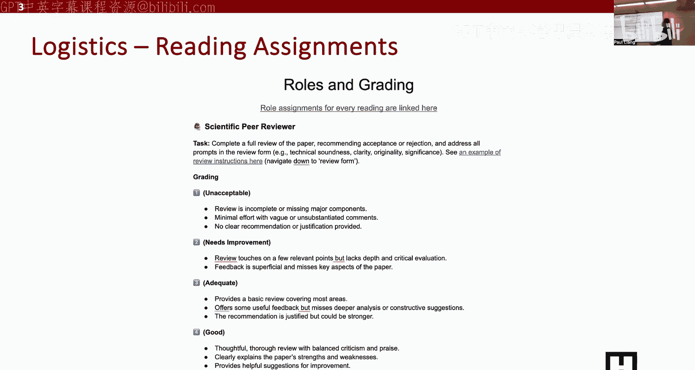

在开始之前，先说明一下项目与阅读的安排。

以下是项目提案的提交要求：
*   请于今晚前提交您的四页项目提案，通过邮件发送给我。
*   我会回复我的反馈意见。
*   如果您在最终确定项目想法前需要更多反馈，可以在下课后至下午3点在我们的实验室空间找我。

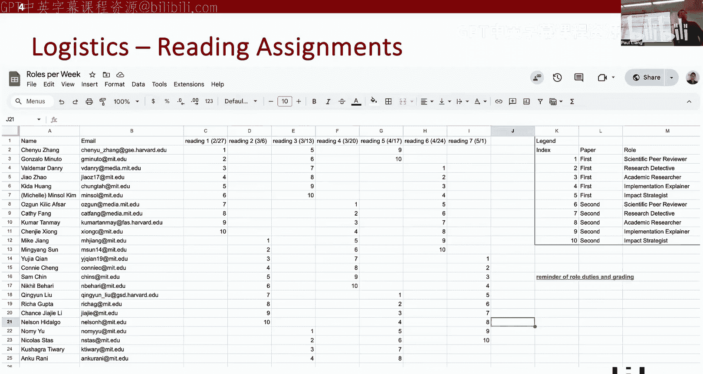

以下是本周阅读作业的要求：
*   阅读作业明天截止，为本周四的首次阅读讨论做准备。
*   本周主题是“数据与学习”。
*   有两篇必读论文，每个人都应阅读并反思，尝试回答文中的问题。

以下是两篇必读论文的核心议题：
*   第一篇论文关于“苦涩的教训”现象。该现象指出，随着算力增长，表现最好的往往是那些不使用过多归纳偏置和领域知识的大模型。您如何理解这一现象？它对您的AI实践有何启示？
*   第二篇论文关于“双下降”现象。这是现代AI中一个违背传统智慧的新现象，即模型在训练过程中可能看似过拟合且表现不佳，但训练更久后突然表现优异。这一现象对您部署和训练模型的方式有何启示？

以下是阅读作业的其他安排：
*   每个人都需要完成一个表格，回答一些问题并写下反思。
*   每周有10位同学会被选中承担更多任务，例如担任同行评审员等。具体角色和说明在PDF中。
*   这是一个随机分配每周10个角色的电子表格，链接在作业中。
*   如果某些周因旅行等原因无法完成任务，请尽快告知，我们会重新安排。

---

## 模型设计谱系与考量

今天我们将涵盖四个部分。我们将提出一个统一的范式来审视深度学习中的不同模型架构。这与传统的AI/ML课程不同，在传统课程中每周介绍不同的模型或算法。我将尝试统一视角，说明如何看待不同架构，以及如何设计自己的定制架构，探讨这些原则可能是什么。然后，我们将看一些常见的案例研究，包括非常适合时间序列等时序数据的序列模型、适合空间数据的卷积模型，以及适用于集合和图数据的模型。

从高层次看，您应该将这些建模范式视为一个谱系。您设计的任何机器学习或AI模型都可能落在这个谱系的某个位置，从更领域特定的方法（真正考虑问题结构和该问题的专家知识）到更通用的模型（利用更多数据和计算，因此对特定领域或问题的结构考虑较少）。

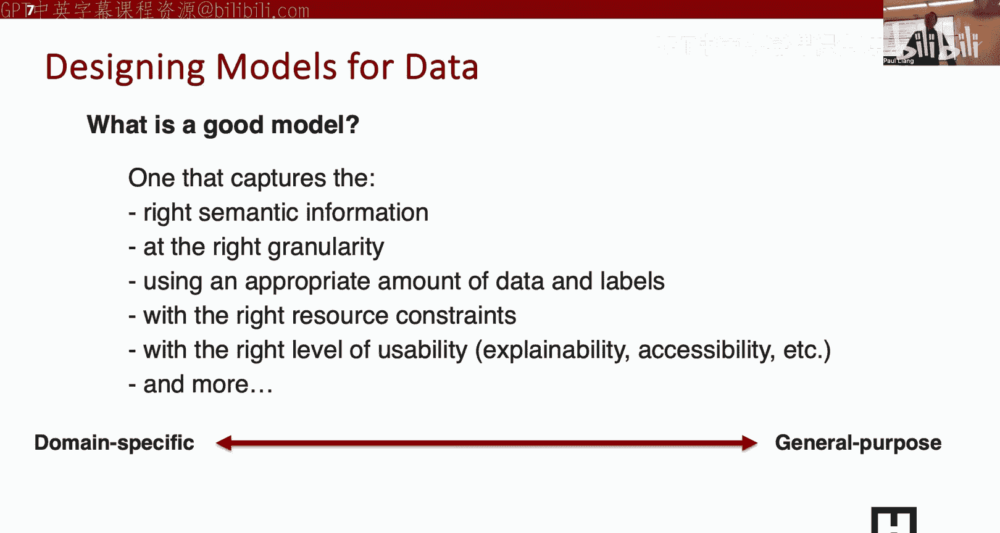

以下是模型设计谱系的具体说明：
*   **领域特定端**：设计具有非常专业化架构的自定义神经网络，或设计真正嵌入您对问题了解或数据应具有属性的自定义训练目标。
*   **通用目的端**：例如，直接应用现成的模型（这非常通用），或者对预训练的通用现成模型进行一些微调或适配。

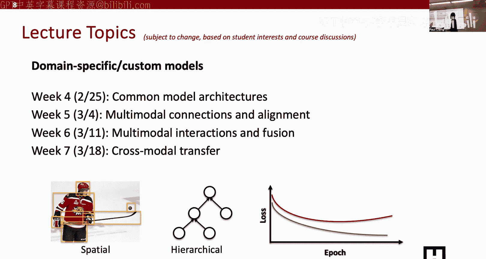

所有基于数据、架构、训练目标设计的方法都将位于这个谱系的某个位置。这个位置的确切取决于许多因素。

一个好的模型应具备以下因素：
*   **捕获正确的语义信息**：无论是进行预测、生成具有特定属性的数据还是进行预测，都应捕获正确的语义。
*   **使用适当的数据和标签粒度**：有些问题需要非常精细的定位，有些则需要更高级别的信息摘要。这是一个非常重要的因素，我们将看到，在谱系上不同位置的点需要根本不同数量的数据（包括未标记数据和标签）。
*   **尊重部署时的资源约束**：有些模型更适合在大型GPU上运行，有些则更适合在边缘和小型设备上运行。
*   **提供适当级别的可用性**：无论是您关心的某种解释质量、向用户解释模型决策，还是以某种方式使其更易于访问，这也会影响该点在谱系上的位置。

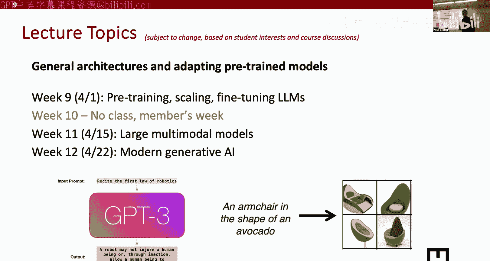

可能还有更多考虑因素，这是在开始设计模型之前首先要思考的事情：什么是好模型？有哪些属性？哪些是希望拥有的？哪些是绝对不能妥协的？

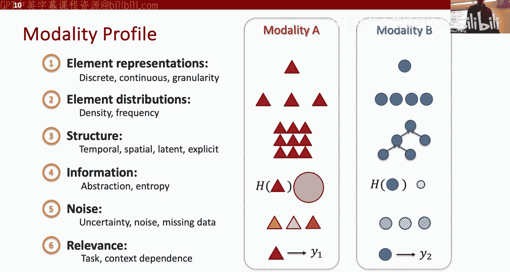

接下来的几堂课将基本涵盖这个谱系。今天的讲座将更偏向领域特定，涵盖一些更定制的模型架构。然后我们将开始讨论多模态架构，它们位于中间位置。春假回来后，将真正更多地讨论通用架构以及如何为您的任务微调和适配它们。因此，我们将涵盖从领域特定到更通用目的以及适配这些通用模型的整个谱系。

---

## 统一视角：表征学习与信息聚合

为了开始讨论这些更领域特定的方法，我们先回顾一下两周前关于数据的内容。我们提出了“模态概况”的概念。您收集的每个数据、您试图建模的每个任务都将具有一些特征。我发现将您的问题分解为这些特征中的每一个是非常有用的，对于每一个，您都需要从数据中理解它，并理解您将如何建模该特征。第一个是元素及其表示方式。

第二个是元素的分布。您是只关注图像的两三个部分还是高频数据？如果您处理的是空间或图形数据，其结构是什么？您的数据中必须鲁棒应对的不同类型的噪声是什么？您的任务是什么？它必须与您的任务有多相关？因此，模态概况再次只是一个总结：给定您的数据，这些是您首先应该查看并尝试理解您的数据的事项。

在理解了您的数据（包括将其分解为单个元素、它们的组成方式、分布等）之后，您可能开始构建一些深度模型。深度学习模型的一个统一观点是，这些模型总是有几个步骤。一个步骤是学习表征。学习表征的定义是，您将获取一些非常高维的原始数据，并尝试学习从中提取信息的更抽象的特征。

因此，可以有一个模型将其转换为一些更密集、更低维的特征，并从您的数据中捕获一些重要信息。几乎所有学习模型中的第二个关键属性是组合表征。您可能已经学习了图像中飞机的表征、天空的表征、地面上有房屋的表征，所有这些都代表某种意义。您如何组合它们以学习整体场景中的信息？在模型更深层时，总是在提取特征和学习表征的步骤与组合这些特征的步骤之间交替，以学习更具信息性和总结性的表征。

鉴于这些是深度学习中的两个目的，您基本上可以将不同的深度学习块视为实现这两个目的的方式。为了学习表征，有几个人们可能见过的块。全连接网络基本上是矩阵乘法。ReLU基本上是一个激活函数。如果一切都是线性的，那就是全连接。这些是线性函数。如果您有太多线性函数，最终将学习一个线性模型。像ReLU这样的东西是非线性激活函数，因此您可以开始逼近更复杂的非线性函数，并且可以证明在极限情况下它可以表达基本上任何函数。层归一化已被证明可以帮助您标准化数据并使一切处于良好的归一化范围内。卷积和自注意力（稍后介绍）本质上是用于基本学习特征或表征的构建块。

第二点，正如提到的，是用于信息聚合的块。因此，如果您从一个图像部分学习了特征，从另一个图像部分学习了特征，如何组合它们以学习整个图像的特征？同样，有几个您可以考虑的块。连接是一种非常简单的跨信息组合方式。注意力（稍后介绍）甚至像逐点加法、两个向量的逐点加法或取两个向量之间的最大值，都是组合信息的方式。

本质上，您为应用程序设计的任何现代AI模型都将是这些块的某种组合（可能简单，可能复杂）。因此，您有数据（这些小三角形代表一些元素，例如图像的某些部分、段落中的某些句子、句子中的某些单词），并且您将应用提取特征的层来学习表征，并在其中一些层或块中组合信息以学习更具信息性的语义特征。因此，它可能看起来像这样。

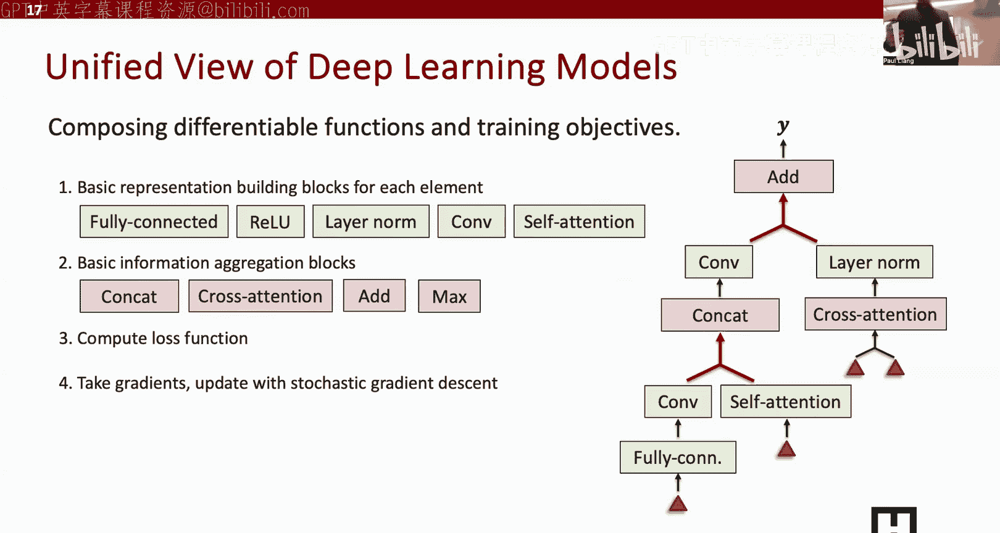

一旦您设计了这个前向传播，您基本上就计算您的损失。损失本质上衡量您预测的标签与真实标签的接近程度。如果您有一些标签数据，计算一些差异，并基本上将其视为您想要最小化的损失函数。您希望最小化预测值与真实标签之间的差异。您基本上可以通过计算梯度并应用像随机梯度下降这样的方法来最小化该损失，从而更新您的参数。

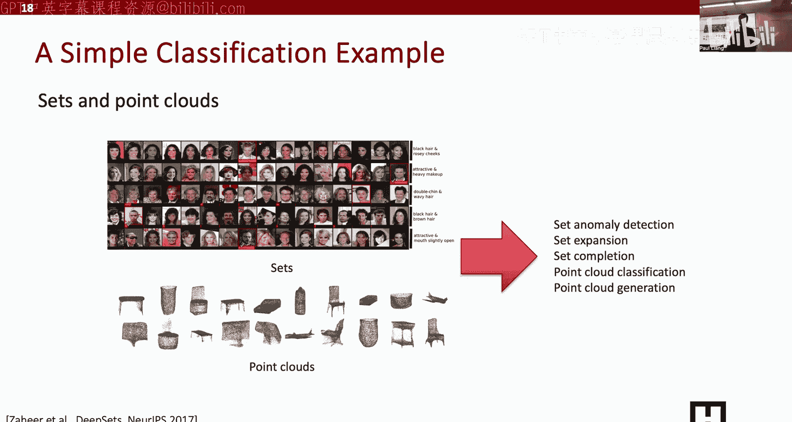

希望这对任何了解基础深度学习、基础机器学习的人来说并不新鲜。我只是以一种更统一的方式呈现：这些只是您可以定义和组合的不同构建块。只要大多数内容是可微分的，您就可以组合任意数量的这些构建块，并且基本上可以计算前向传播、计算损失、计算梯度以更新参数。

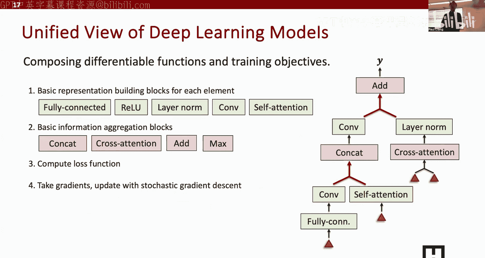

我们还看到，您阅读的任何机器学习论文、任何深度学习论文，无论是Transformer还是CNN，都将是这些块的某种组合。关键思想只是您如何放置这些块，放在哪个位置。

---

## 设计原则：以集合与点云为例

说到如何放置这些块以及如何思考设计模型的方式，让我从一个简单的例子开始。我想使用集合和点云作为例子。我非常喜欢这个例子。您有某种形式的数据集，本质上意味着我给您一堆具有特定属性的演员或女演员的图像，您可能想检测一些异常，即哪个人可能没有与其他人类似的人口统计属性。

或者是点云，这些是3D网格，每个点基本上是X、Y、Z坐标，您可以将一堆它们放在一起以构成3D形状、体积形状。也许您的目标是在您的图像集中检测异常，扩展以获取新图像，将这些点云分类为不同类型的家具，甚至生成点云的新3D模型。

那么，您将如何设计这个例子的神经网络？同样，它将是这些块的某种组合。您需要从您的集合和点云中提取一些特征。您可能需要聚合信息，因为现在您的集合中有多个图像，点云中有多个点。问题也许是我应该如何进行这种特征提取、学习表征，以及我如何真正聚合所有这些信息。

您想要思考的方式是，显然这些数据以某种结构形式出现。当您有集合或图数据时，可能想要考虑的最重要的结构是，您构建的任何模型都应该对集合中元素的顺序保持不变。

无论我以ABC DE的顺序向您呈现我的图像集，并尝试让您找到异常图像，还是我以ECDDA的顺序（某种反向顺序）向您呈现，并让您找到异常图像，您的模型应该给我相同的答案。五个图像集合中的异常图像不应取决于我呈现这些图像的顺序。

因此，几乎所有为集合设计的成功深度学习模型中的两个关键思想是：第一个关键思想是，首先，您应该共享编码每个集合元素的模型的参数。共享参数在这里意味着相同的颜色、相同的参数。

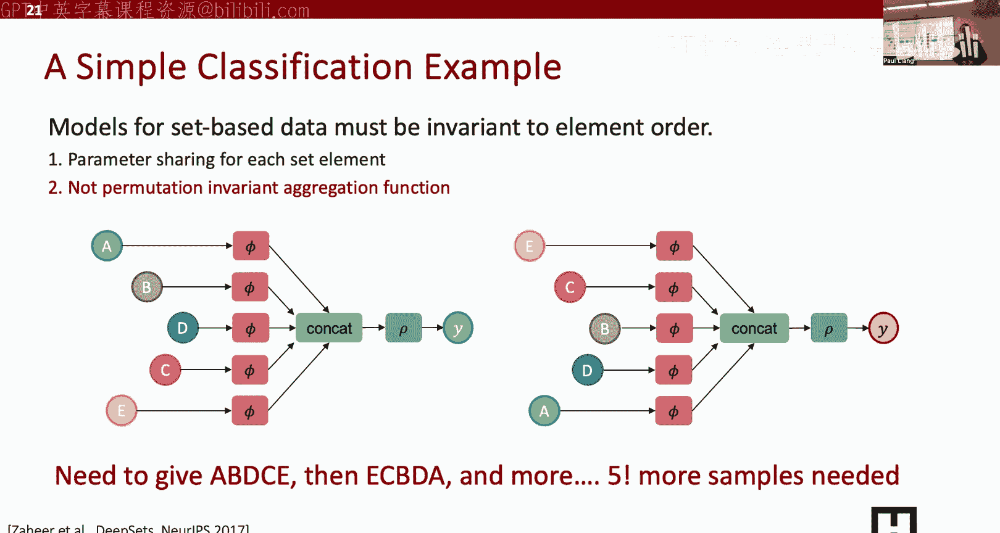

第二个关键思想是，您应该使用一个置换不变的函数来聚合从这些个体表征中学到的信息。例如，加法（如果这些都是向量，您将它们逐元素相加）就是置换不变的。一旦您有了那个特征，您可以将其输入更多层，并可以对标签进行预测。

为了理解为什么这很重要，只需想象我向模型呈现了不同的顺序，例如EC、B、EA，即图像的不同顺序。现在，每个这些元素都将通过完全相同的特征提取器来获得相同的表征。所以这没有改变。而这个加法函数，无论您加EC E加E还是您加C加E，都会得到相同的结果。因此，现在您从提取数据（A B D CE或其他顺序）中学到的最终特征将完全相同。这意味着您预测的异常图像也将完全相同。

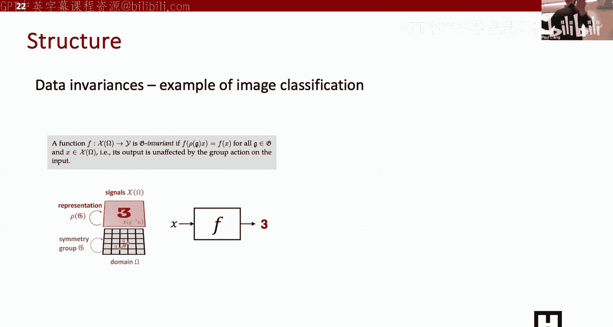

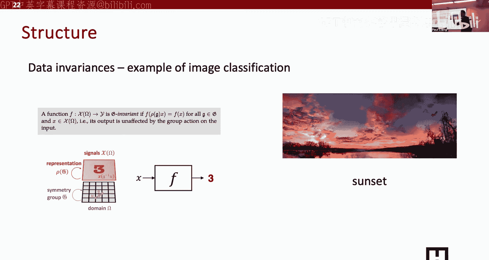

本质上，这个想法是，如果我向我的模型呈现训练数据，一个顺序为AB DCE的示例，我也基本上同时给了模型所有可能的这些图像的排列（即不同顺序），模型将学习相同的表征，无论我给它什么顺序。

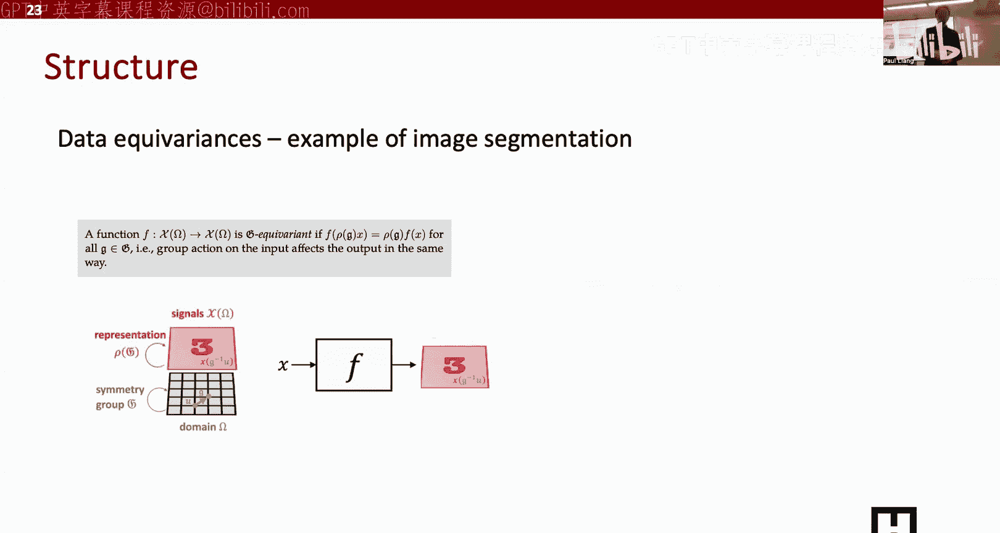

假设您不满足这两个约束。假设您不为每个元素进行参数共享。那么现在您正在设计一个模型，其中对于呈现给您的集合中的每个元素，您将使用不同的特征提取器（由不同颜色和不同参数表示）。这基本上意味着您呈现给模型的是相同的集合，只是顺序变了。答案应该相同，但模型最终将学习一个不同的结果，因为每个集合元素都通过不同的特征提取器，一旦将它们相加，最终特征将不同。实际上，这意味着您需要给模型第一个元素顺序，然后给它第二个顺序，它将学习其他东西，因此您必须给模型所有可能的顺序，本质上需要给模型看5的阶乘倍（即120倍）于第一个案例（您共享了参数）的样本。

同样，如果您进行参数共享，但不使聚合函数置换不变呢？一个例子是您进行参数共享，每个特征都通过具有相同参数的相同编码器，但您不做像加法这样对顺序不敏感的操作，而是做像连接这样的操作。在连接中，无论您堆叠A B还是堆叠B A，都会改变模型输出的向量。因此，做像连接这样的操作，那么标签又会不同，这意味着要成功训练这个模型，您需要给模型所有这些排列，然后它才能成功地从您的数据中学习。同样，您需要5的阶乘倍（120倍）的周期。

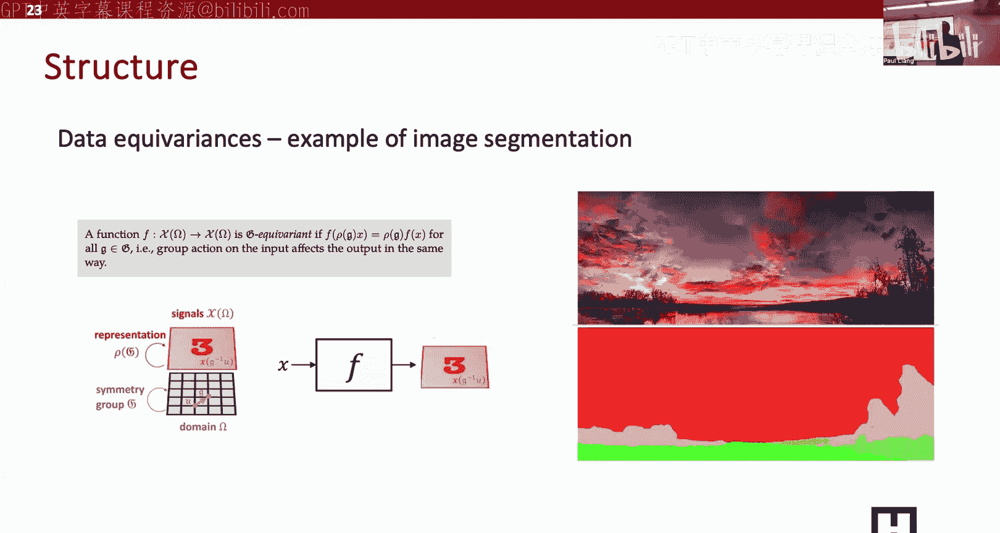

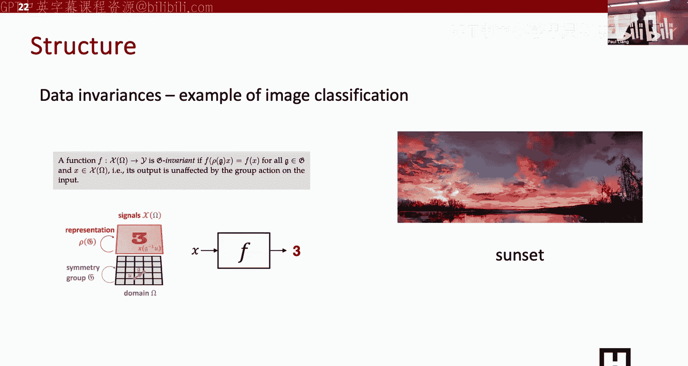

这只是一个非常简单的例子，希望人们觉得直观：如果您仔细设计模型架构，您将需要比不仔细设计时少得多的样本。

---

## 核心概念：不变性与等变性

为了概括这个讨论，我发现当您收集数据或查看任务时，有两个想法非常重要。两者通常都归入“结构”这个概念下。第一个想法是数据不变性。即您可以对数据进行的、标签或结果不应改变的变换。例如，我给您这个图像，上面有一个高亮的3，您的目标是分类这是什么数字或将其分类为3。如果您只是将图像上下左右移动几个像素，如果您将图像旋转45度、90度，如果您将其变为黑白而不是RGB，您仍然应该得出标签3。这是一个不变性的例子，理想情况下您的模型应该捕获它，因为如果您的模型对颜色敏感，或者对旋转敏感，或者对像素左右的小位移敏感，那么您将需要更多的数据来本质上学习相同的任务。

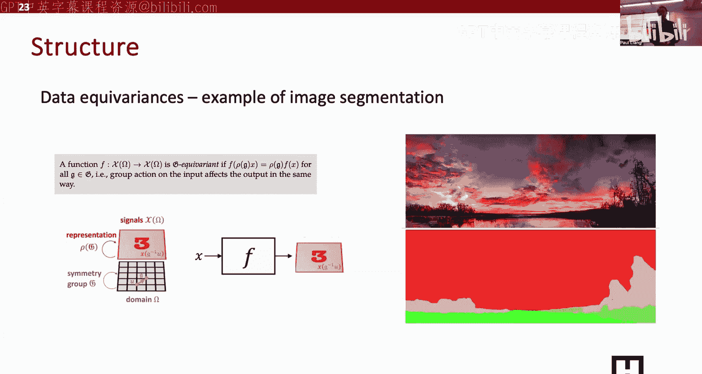

因此，图像分类是数据中具有某些不变性的一个例子。不变性是对输入数据的更改，模型不应敏感。这与等变性相对，等变性是输入数据中模型应敏感的更改。

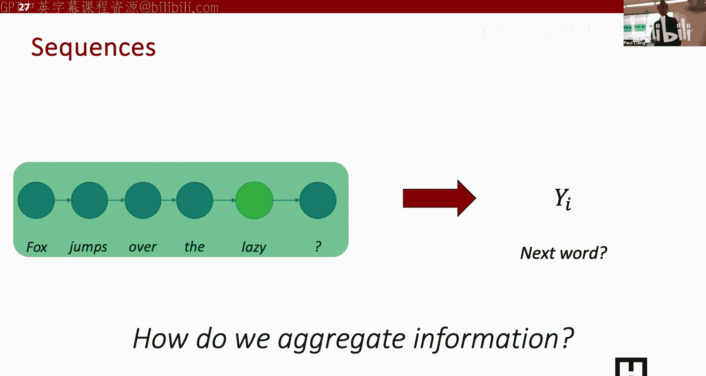

考虑一个非常相似的任务。同样，给定这个带有3的图像，您的目标基本上是生成一个语义图，告诉您这是背景，这是数字，这是树，这是海洋，您想做像分割这样的事情。那么，如果我将此图像向上移动两个像素，我的语义图也应向上移动两个像素。如果我将此图像旋转45度，我的语义图也应旋转45度。因此，移动和旋转是等变变换。无论我对输入数据进行什么更改，我也希望模型在输出中捕获该更改。这与例如颜色（无论是RGB还是黑白）相反，您仍然应该得到相同的语义图，因此RGBA和颜色是它应该不变的东西，而位移和旋转是它应该等变的东西。

这些是开始处理数据时要考虑的非常重要的属性。正如在集合数据分类案例中看到的，您必须尊重置换不变性这个想法。这意味着您可以任意置换您的元素。给定ABC或CBA，给定您要设置的所有元素，理想情况下不应改变模型的输出。

这是一种我喜欢思考的统一框架：给定数据，并且您想设计一些定制架构，使用尽可能少的样本并尽可能高效，这些是您可能想要考虑的事情。

---

## 常见架构解析：序列模型

接下来，我们继续讨论一些常见的架构。我们将再次在不变性和等变性的框架下呈现这些常见架构，我们将看到为什么这些架构会以这种方式被提出。

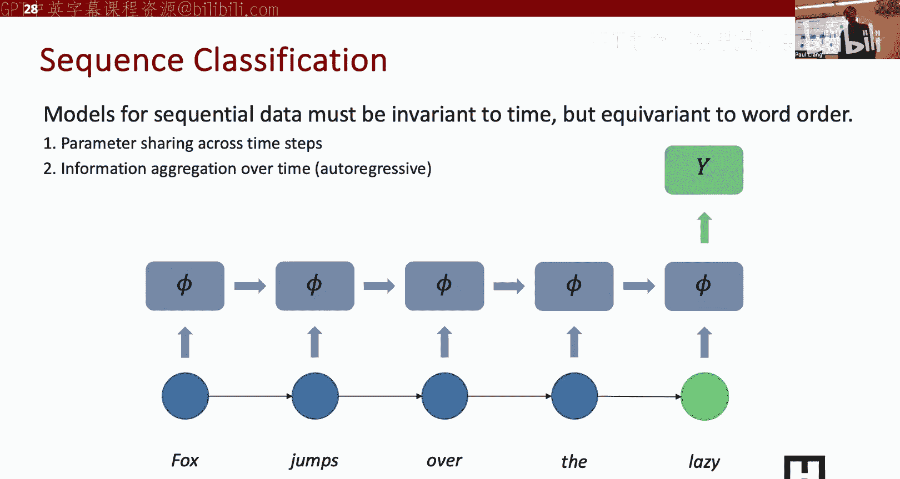

第一个要讨论的模型类型是基于时序的模型。例如，一个元素是一个单词，这个单词可能构成更长序列的一部分。您可能有一个很长的单词序列，或者它可能是时间序列数据中的时间步序列，也可能是代码、基因组学数据，所有这些都是序列。

目标可能是对下一个单词、某个主题或给定序列数据的某个标签进行分类。同样，关键问题是如何学习表征以及如何聚合信息？显然，对于时序数据，一个非常关键的想法是局部性的概念。如果您想预测下一个单词，您可能会看它前面的单词，可能前面的单词是最重要的，但当然，考虑到更长的上下文、四五个甚至更远范围的单词也是有意义的，这取决于您有多少计算资源。

这真正激发了我们对序列分类经典模型的首次讨论。这些模型本质上接收像单词、时间序列或基因组学数据这样的数据序列，并对您的标签进行一些预测。

同样，给定这样的数据，您想再次思考两个属性：这些数据应该对什么保持不变（即对什么更改不敏感），以及对什么应该等变（即对什么更改敏感）。直观上，为序列数据设计的任何模型都应该对时间本身保持不变，即无论您将此序列向前或向后移动一步，都不应对模型产生太大影响。但它应该对顺序等变，如果您说“狐狸跳过”或“狗跳过”，如果您改变单词的顺序，那么这是模型应该极其敏感并真正考虑到的更改。

为了处理这两种类型的不变性和等变性，几乎所有用于序列数据的模型都具有这两个属性。第一个属性是跨时间步的参数共享。相同的模型、相同的特征应处理这个单词、这个单词、这个单词和那个单词，即使单词本身可能不同，它们使用的处理函数应该是相同的。这很关键，因为否则，如果您只是将序列左右、前后移动所有时间步，那么如果您不共享参数，您将得到非常不同的输出。

第二个关键想法是您希望跨时间聚合信息。这种循环的思想是，您首先在这里提取特征，这是一个特征提取器，然后您看下一个单词“跳过”，提取特征，并累积您在前一个单词上的信息，然后看第三个单词，提取特征，并累积您在第二个和第一个单词上的信息，依此类推。这种跨时间的信息聚合思想。第二点本质上就是使模型对单词顺序等变的原因，因为现在如果您改变单词序列，您的信息聚合序列将不同，您将得到不同的结果。

因此，您应该对每个时间步不敏感，但应对呈现给模型的单词顺序敏感。因此，两个关键思想：我们希望进行参数共享，相同的特征提取器跨时间步，并且我们希望以自回归方式跨时间聚合信息。一旦您遍历了整个句子，您就预测标签。

为了了解这通常是如何实现的，这里有一点数学符号。X是您的数据，第一层概率乘以一些参数U。所有这些模型都只是线性变换U乘以X（矩阵乘法），后跟一些激活函数如tanh，这允许您表达非线性函数，然后您可能对其应用下一层，例如V是您的下一个参数，V乘以前一层的输出，最后您将计算相对于真实标签的损失，在这个分类案例中是负对数似然。本质上，当前模型只是展开这个，其中相同的V、相同的D是应用于序列中不同时间步X1、X2、X3等的相同参数。这显示了相同的参数在每个序列时间步应用，相同的参数在这里应用，相同的参数在这里应用。只是视觉上，输入的数据不同，是X1到Xt，但每个时间步都应用相同的参数，这是参数共享的关键，并且信息本质上跨时间累积。这里的H是信息累积的地方。

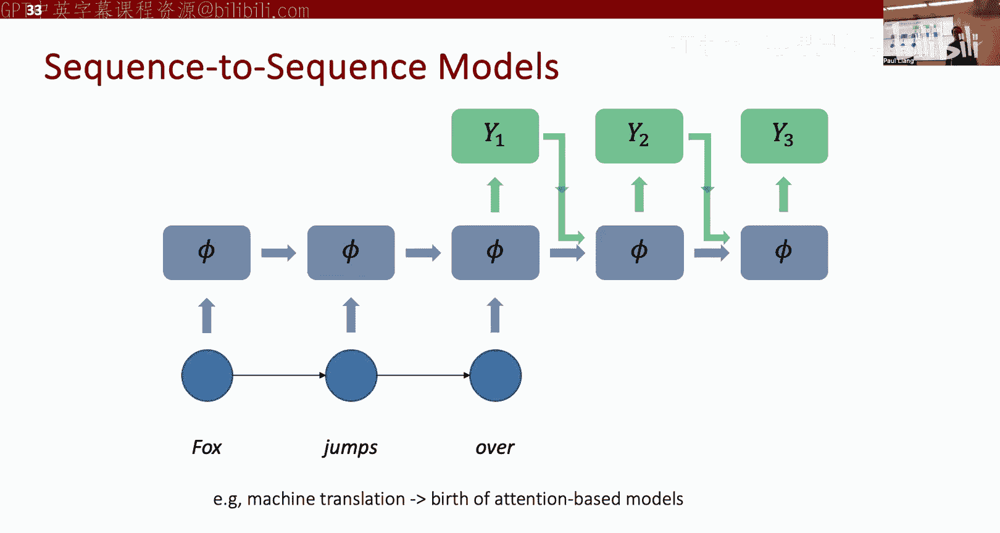

这是非常高层次的序列分类。当然，您也可以扩展它来进行序列生成。因此，如果您不是输入一个序列并预测一个标签，而是只输入一个东西并输出多个东西。假设我给您一个单词“狐狸”，您的目标是完成一个故事或生成音乐。同样，您将在每个时间步使用相同的参数。您将生成一些东西，将您之前生成的Y1作为输入到下一步并生成Y2，然后将您在Y2中生成的内容作为下一步生成Y3。我们称之为自回归解码。但想法相同：参数共享，每个步骤有一组参数，并且您将通过将先前生成的内容输入以生成下一个标记来跨时间累积信息。

数学上，它的样子是，您在T时刻的每个特征是您在前一时刻生成的Y和T-1前一时刻的特征H的函数。U和W是跨时间步共享的参数。

有些人可能意识到这些是循环网络，并会说它们已经过时了，但我实际上要说服您并非如此，因为RNN已经演变为LSTM，LSTM演变为时间卷积网络，而时间卷积网络真正启发了现代状态空间模型中的许多工作，如果您想处理时间序列或连续数据作为Transformer的替代方案，这些模型现在仍然相当流行。

那些是用于序列生成的模型。序列到序列模型本质上结合了两者。因此，将有一些序列输入，也将有一些序列输出。为了了解其工作原理，当序列输入时，完全相同的想法，您希望在每个时间步使用相同的参数来处理每个单词，并且您将跨时间累积信息，例如“狐狸跳过”，累积信息。当您读完一个序列时，您可以预测第一个输出，然后自回归地将前一个输出作为输入到下一步，得到Y2，取Y2，输入得到Y3。这些是序列到序列模型，用于机器翻译，例如您想将三个英语单词的句子转换为三个法语单词的句子。它们也用于许多机器翻译和当今的许多生成模型。

这是一个非常好的问题，也是下一部分的很好过渡。在某些语言中，我们知道主语或宾语翻译也是主语动词宾语，当然在其他语言中不一定。因此，一篇非常重要的机器翻译论文基本上展示了这些热图。这些热图告诉您，给定英语输入序列和法语输出序列，哪些英语单词对应于输出法语单词，您可以看到大多数都沿着对角线，因此顺序大部分被保留，但当然也有细微差别，有些偏离对角线，意味着英语和法语之间的单词顺序发生了偏移。

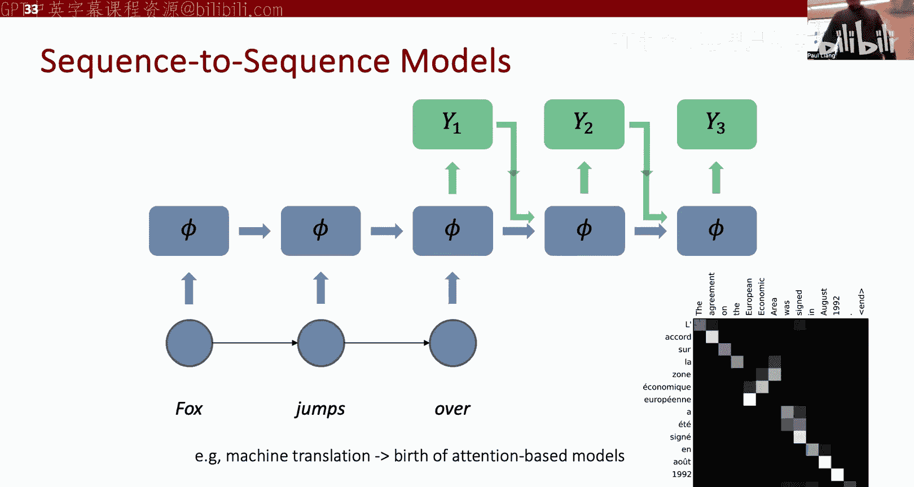

我说这是开创性的，因为这种机制本质上被扩展了，我们称之为基于注意力的方法，这些方法告诉您，当我在生成Y1时，前三个单词中哪些与生成Y1最相关？是“狐狸”还是其他？或者可能有一点“狐狸”，一点“跳过”，然后我在生成第二个单词时，这三个单词中哪些最重要？这就是为什么您会得到这个T乘T的注意力矩阵：您的输入序列乘以输出序列。当然，如果您的语言差异更大，比如英语和中文、英语和日语，那么您的注意力矩阵会更加偏离对角线。它应该是一个正方形，应该对应单词到单词，但有时可能不是正方形，它可能是T1乘T2。

另一个问题：我们是否将GPT视为序列到序列模型？是的，它们也算作序列到序列模型，有一些更高级的掩码，我稍后会讨论Transformer，但要获得GPT这样的序列到序列模型，您本质上拥有整个序列，只是放置掩码标记以强制模型生成输出。

这是一个非常好的过渡。序列到序列模型曾经很流行，然后它们通过注意力机制得到了增强，正如您所知，这些注意力机制真正启发了所有这些现代Transformer。对于不知道的人来说，第一篇Transformer论文实际上是在机器翻译上进行的基准测试，这是他们全面获得的第一个数据结果。

同样，这些基于注意力的方法的想法是，有时我可能希望给不同元素动态权重。在翻译时，我看第一个单词，也许我主要看第一个单词，但我也想稍微看第二和第三个单词；我看第二个单词时，我想主要看第二个，也许稍微看第一和第三个。这些基于注意力的方法本质上通过利用其上下文来计算新特征。因此，我想为单词“lazy”获取一个新特征，我将查看它前面的其他四个单词，我将计算注意力分数，这些分数本质上告诉我前四个单词中的每一个应该为第五个单词学习的特征贡献多少。

您可以这样想：五个上下文单词中的每一个都输入，这是您想要的目标特征，您想本质上学习一组五个分数A1到A5，告诉我五个单词中的每一个对这个新特征的相对贡献。然后，这些注意力分数可以用来根据它们的贡献加权每个特征。因此，您应该取A1乘以“狐狸”的值，A2乘以“跳过”的值，A3乘以“过”的值，A4乘以“那只”的值，A5乘以“懒惰”的值。一旦您获得这些注意力分数，它们告诉您相对贡献，然后您将实际将其与特征本身相乘，得到按这些注意力分数加权的加权和。

再给一个层次的细节，我喜欢通过矩阵乘法以抽象的方式思考这些注意力模型。为了解释这一点，这可能是每个人在Transformer中都见过的方程。我喜欢这样思考：这里有几个矩阵。X是您的数据。您的数据本质上是3乘D。在这个例子中，我假设您有三个单词，我不想画太多。三个单词，您的数据是3乘D，这意味着对于三个单词中的每一个，您都有某个维度。这里的WQ本质上只是您通过数据传递的一些线性变换，将其从单热标记转换为低维密集向量。因此，一边是3乘D，我将再次取我的数据并乘以另一个可学习参数，但这次我取转置，所以3乘D的转置变成D乘3。我先排列维度，然后排列单词数。本质上，我进行我们称之为加权外积的操作，这个外积本质上帮助我对于三个单词“狐狸跳过过”中的每一个，与相同的三个单词“狐狸跳过过”，得到一个3乘3的注意力矩阵，告诉我我的模型应该关注哪些成对注意力分数。“狐狸”与其他三个单词，“跳过”与其他三个单词，“过”与其他三个单词。

您的注意力分数总是序列乘序列。您将通过缩放来归一化。这里的原因是，因为您的3乘3矩阵中的每个条目都是D维向量与D维向量点积的结果。这就是您从3乘D和D乘3得到3乘3的方式，每个单独的条目是一个D维向量点积，所以如果您不小心，如果D很大，那么幅度Q会随着D迅速增加，因此我将除以D的平方根来归一化。方差变为1/D，值被归一化到0和1之间。然后我将进行softmax。这本质上是一个行softmax，将每一行的条目归一化为非负且和为1。因此，您实际上可以将这些条目视为例如0.7、0.3，非负且和为1，或者1.0、0、0，非负且和为1。您实际上可以将它们解释为注意力，告诉您我应该以概率分布的形式关注多少，例如这里50%，那里25%，25%。最后，您然后实际将其与真实的特征向量相乘。因此，仅仅有注意力分数不是很有用，仅仅告诉您哪些部分应该共同出现并相互关注，您必须实际将其与您的特征相乘以实际进行注意力操作。

因此，您将应用于您的特征X，这是另一个线性变换，这是3乘D，这是3乘3，这是3乘D矩阵向量乘法，得到3乘D的输出。这个输出向量您想再次将其解释为语言的新表征。因此，有三个标记，您再次为“狐狸跳过过”有一个新特征，只是对于每个单词，您查看了与其他三个单词中每一个的注意力，并实际乘以其他三个单词的向量，按该注意力缩放。然后您可以用它来进行任何您想要的预测。

这就是五分钟内的Transformer。尽管它们看起来与循环模型不同，但实际上并没有那么不同。回到统一框架，您再次要记住，序列数据，任何用于序列数据的模型必须尊重对时间的不变性，但对单词顺序的等变性。在这种情况下，您仍然尊重这些属性。首先，您仍然跨时间步进行参数共享。每个输入的单词通过Transformer嵌入，它们都通过相同的可学习变换，即W、W和W，本质上是在时间上重复的三组权重矩阵。因此，这种参数共享允许模型对时间保持不变，因此无论您将序列前后移动还是用零从左或右填充，它仍将给出相同的结果，因为不同时间输入的单词共享参数。

在这种情况下，它仍然在进行信息聚合。只是这种信息聚合不是顺序完成的（您必须等待一个得到两个，两个得到三个，三个得到四个，四个得到五个，这在GPU上可能更慢），而是使用矩阵乘法并行完成，一次性获得整个5乘5的注意力权重并进行注意力操作。因此，它仍然对单词顺序等变，因为如果您置换顺序，注意力矩阵将不同，然后输出将不同。因此，想法仍然相同：用于序列数据的模型应对时间保持不变，但对单词顺序等变。

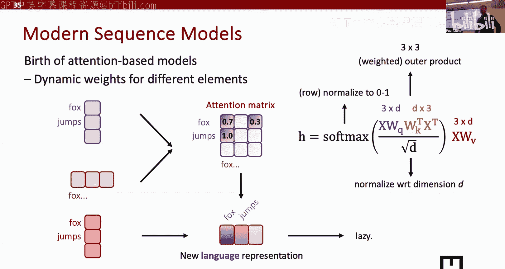

---

## 常见架构解析：空间模型（卷积与视觉Transformer）

最后，对于空间数据，同样的问题仍然存在：如何学习图像每个部分的特征？如何聚合图像多个区域的特征以进行预测？

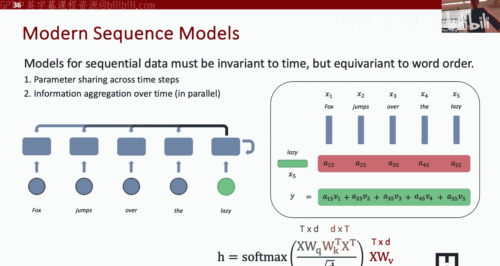

本质上，您希望理想地构建一个能够分解元素、可能学习图像每个部分的特征、可能聚合图像的局部部分以从图像中获得越来越多信息的模型。您如何做到这一点？一种朴素的方法是，您有一个图像，您只是将其展平，因此每个这些都是像素，您可以将其展平为像素序列，然后可以使用全连接网络连接到下一层。

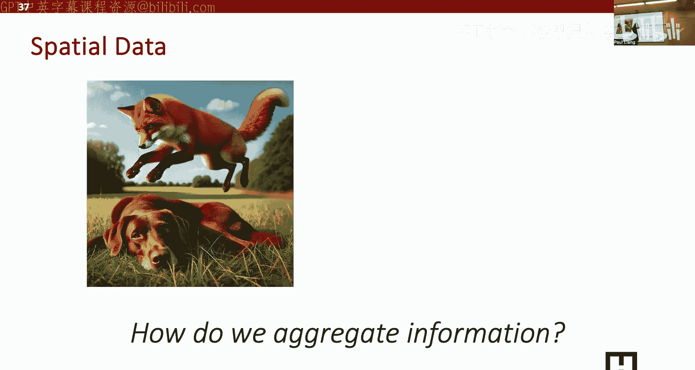

当然，这是一个非常糟糕的主意。为什么这是一个坏主意？如果我的图像是200乘200，即40,000像素，并且我想进入具有N个特征的下一层，这个矩阵将是40,000乘N，这非常巨大，所以效率不高。另一个大问题是，我为空间数据设计的任何模型应该对任何空间变换保持不变。如果您将图像上下左右移动几个像素，稍微旋转5度、10度，输出不应改变。如果您有一个模型基本上使用从像素到响应的全连接网络，那么它将对图像上下左右的细微位移敏感。

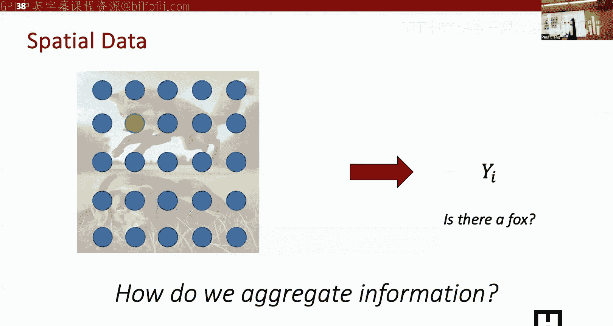

一个很好的问题：首先，我不明白为什么空间数据是……首先，有两个块，红色在黑色上面，所以如果我翻转它，那就不同了。很好的问题。正如一开始提到的，这取决于您的数据。如果您尝试进行分类，那么它可能对空间方向非常不变。如果您尝试进行分割，那么您将敏感，因此对于您描述的情况，它应该对任何位移和旋转等变。这取决于任务是什么：是将其分类为红色和白色块（在这种情况下您可以任意旋转），还是进行语义背景分割（那么您不希望旋转不变性）。

但一般来说，大多数用于图像的模型，特别是进行分类或检测时，将非常不变。以下是Transformer的几分钟介绍。第一个关键想法是，我不需要将所有输入像素连接到所有输出响应。如果我想获得输出响应，例如图像的右上角，我可能或应该只查看右上角区域的几个像素，而不需要查看图像的左下角区域。第一个关键想法是，我将只具有从像素到输出的稀疏连接，其中连接由某个滤波器大小（例如3）决定，其中每个输出响应仅取决于输出位置附近的三个像素。这首先节省了参数效率，同时也尊重了局部性，即该输出仅取决于其连接的小区域。

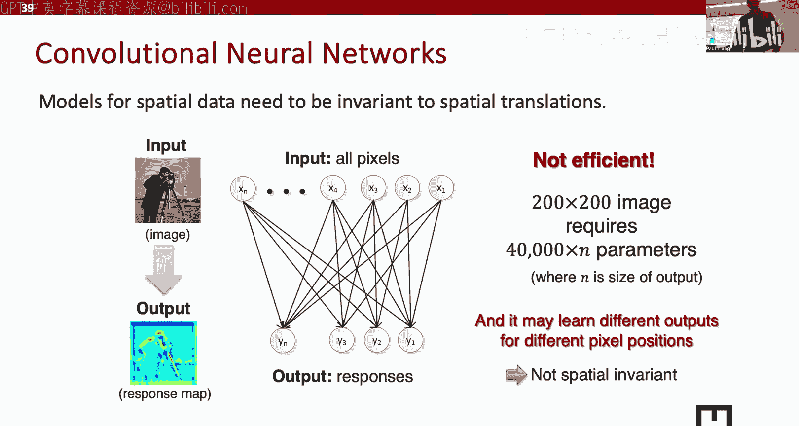

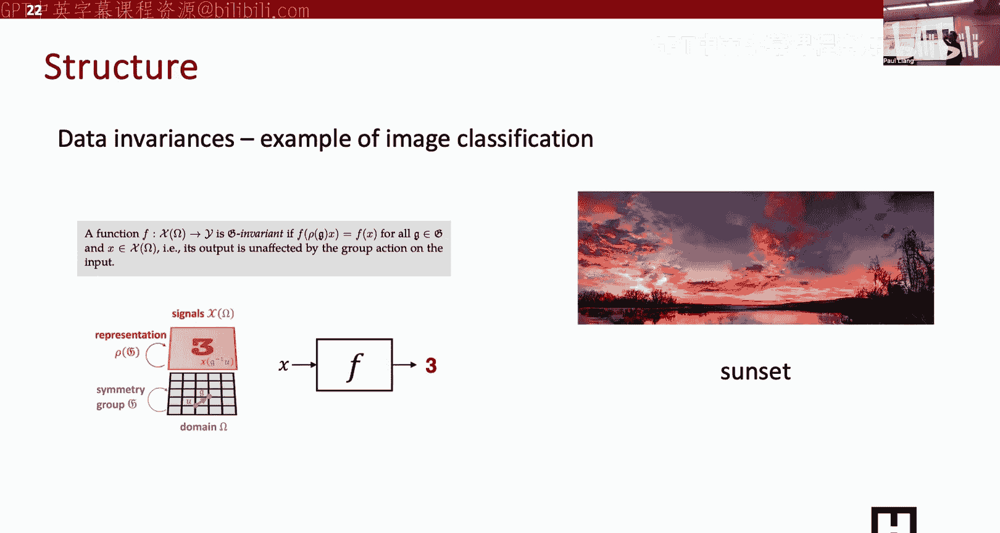

然后，我还将进行另一个修改，即共享参数。这个输出取决于三个附近位置，我将共享参数，因此相同的权重从这个输出应用到这三个位置，从这个输出应用到另外三个位置，从这个输出应用到这三个位置。现在，这种共享参数的想法本质上给了您空间不变性，因为现在您可以将像素左右移动一点，只要它落在窗口大小为三的范围内，就不会改变输出。

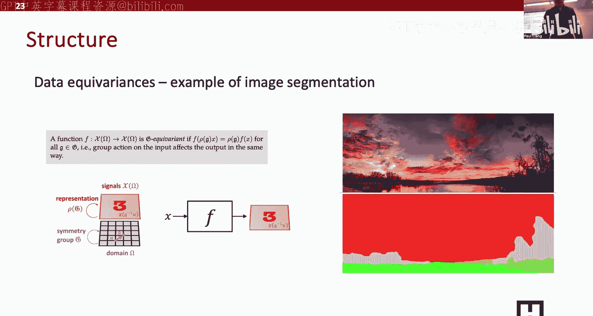

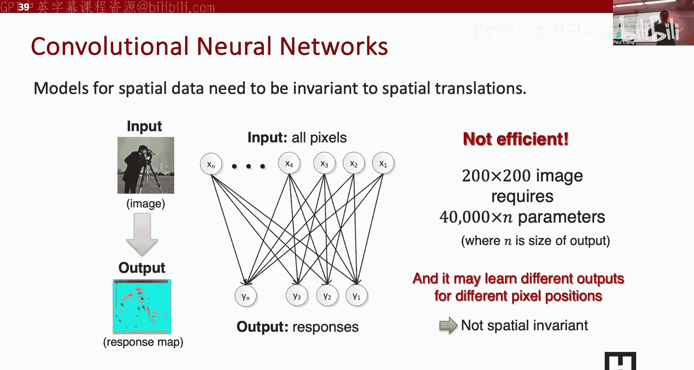

视觉上看起来像这样：我有一个图像，我将采用某个窗口大小，例如3乘3，对于每一个，我将提取特征，本质上总结该3乘3区域中的信息。我将把滤波器移动到下一个3乘3区域提取特征，然后下一个3乘3区域提取特征，每次提取特征时，我将使用相同的权重。同样，正如您所见，它将对该2乘3节点内的任何小变化保持不变，无论您在该2乘3节点内将剪切向下向右移动，它仍将给您相同的输出。我将用其他几层完成，并且还将跨那些2乘3区域聚合信息，这称为池化操作，本质上您有某个区域，例如2乘2，您将只取最大值。这使得模型对这些小位移和变化更加不变，并迫使模型看更大的图景。我只是取最大值。同样，相同的构建块只是卷积和取最大值，只是跨这些窗口和区域应用。

总结一下，卷积层允许模型学习这些部分的组合。人们已经证明，您取像素，首先学习边缘，然后一旦您学习了一些边缘，您组合边缘以学习直线边缘以学习部分和形状，然后您可以组合这些形状以学习更复杂的东西，如面孔。因此，卷积允许模型学习这些子部分，而池化（因为它本质上迫使模型在一个区域上取最大值）允许模型学习更抽象的信息，而不是仅仅关注低级细节。

如今，人们也从CNN转向了视觉Transformer，尽管不像NLP中从循环模型到Transformer的转变那样剧烈，但现在很多人使用视觉Transformer。老实说，要设计一个对任何空间平移保持不变的模型，这些视觉Transformer所做的是，它们切出图像中K乘3的块，因此原始图像是所有这四个部分在一起，现在它们将图像切割成不同的部分。每个部分可能是K乘K。您将这些作为四个图像部分的序列输入，就像您将其视为四个单词的序列一样，您对其应用Transformer，本质上通过计算相对于其他三个部分及其自身的注意力分数来学习每个部分的特征（给出四个分数），并通过使用这四个注意力分数对那四个特征中的每一个进行加权和来提取特征。

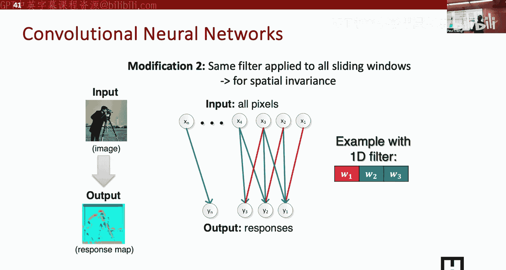

但同样的想法适用。首先，您仍然跨每个K乘K区域进行参数共享，相同的参数用于处理这个部分、这个部分、这个部分和这个部分，因此您仍然跨四个区域进行参数共享，并且您仍然跨这些块聚合信息。因此，如果这些块设计得当，那么模型将不会对这些块之间的任何小位移和移动非常敏感。

因此，您可以将这种分块视为类似于这些卷积区域。这只是视觉Transformer的动画：获取图像，分割成一系列块，应用一些序列设置，然后学习一个Transformer以获取成对注意力，从而获得图像的整体表征。

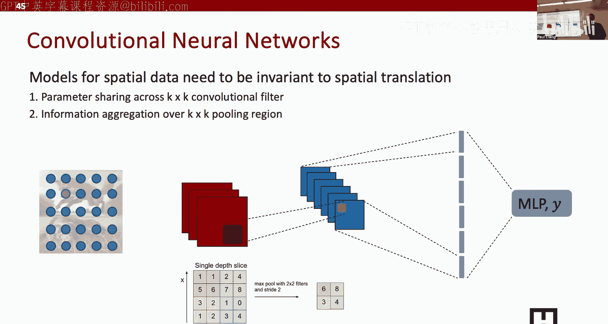

---

## 常见架构解析：图网络

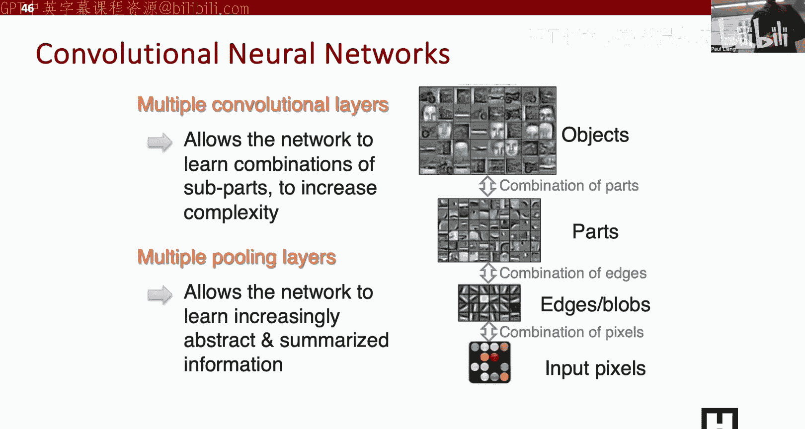

最后，图。图是另一种形式的数据，您有一些节点，也许某些节点之间有一些连接。对于图网络，同样的想法适用：首先，如何学习特征？如何聚合特征？

图网络的关键想法是，同样，您希望为每个节点共享参数。因为如果您不共享参数，那么您将无法泛化到新节点或新图。而信息聚合的想法是，您只想查看邻居中有哪些特征并从它们中提取那些特征。

假设您想学习节点A的表征，例如A是您社交网络中的一个人。您想为它学习一个特征，我们首先看哪些邻居是它的朋友，例如C、D、B、E。但要学习C的特征，C只依赖于A；D只依赖于A；B依赖于两个朋友A和E；E依赖于两个朋友A和B。因此，您本质上设计一个像这样的模型：这只是一个神经网络示意图，您想通过学习邻居的嵌入、通过一些非线性变换来学习特征，而邻居又将递归地依赖于它们的邻居。

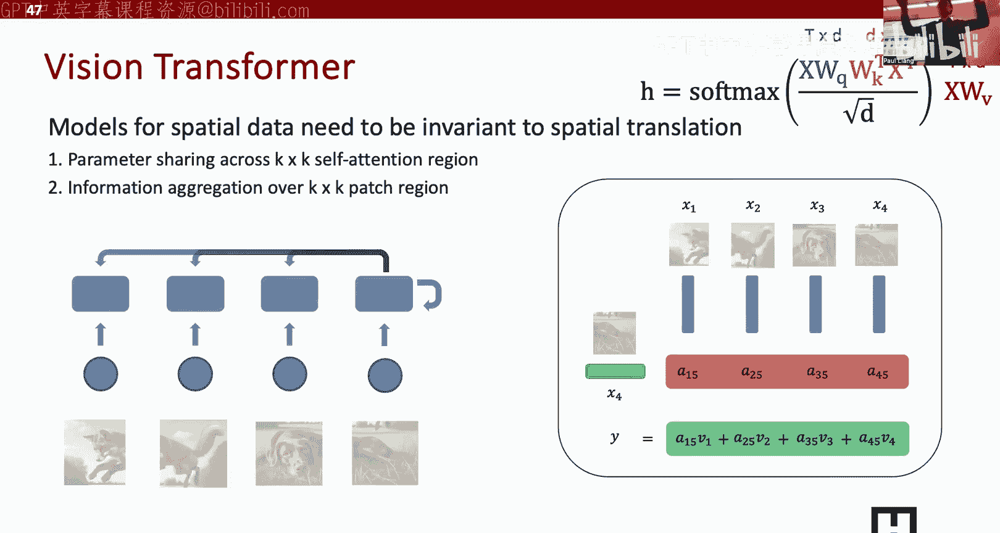

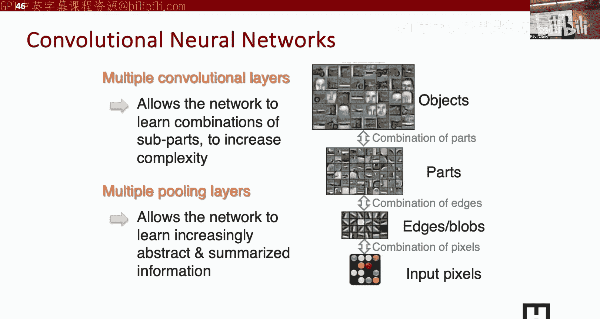

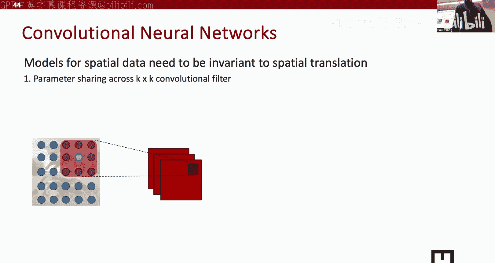

因此，这又是图网络的高层思想：您希望跨节点共享参数，因此所有这些节点将执行相同的函数，并且您基于节点彼此之间的连接性聚合信息。您可以看到图恢复了集合。集合本质上只是具有节点且彼此之间没有边的图。因此，同样的逻辑适用：您有一些参数共享，因此为每个节点提取相同的特征，只是这次没有聚合，因为当您为A学习特征时，它不依赖于任何其他东西，B不依赖于任何其他东西，因为没有邻居。

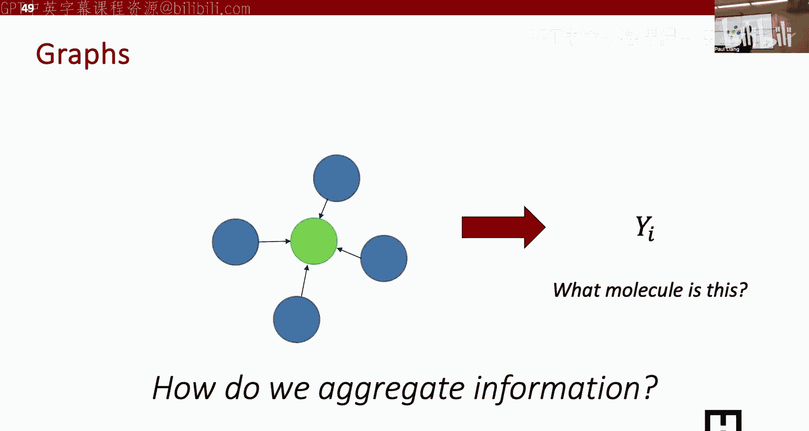

事实上，您可以应用相同的逻辑并证明图恢复了空间数据。像图像这样的空间数据本质上是部分在某些区域内上下左右连接的部分，因此有一个1乘1的区域，就像这样，也许您连接了2和3，如果您认为那是图像应该连接的区域。同样，它也是序列的泛化，因此序列是一个链图。这就是为什么在我们见过的所有这些模型中，总是跨元素进行参数共享，相同的模型处理A、B、C和D。并且信息聚合总是在您的邻居之间进行，或者对于序列数据，每个信息左右聚合，或者对于空间数据，您上下左右聚合信息。

---

## 总结与回顾

总结一下。我认为这内容很多。幻灯片会上线，希望你们中有些人以前见过这些模型的某些组合，但这只是一个统一的框架，用于审视多种深度学习架构并了解如何设计自己的架构。

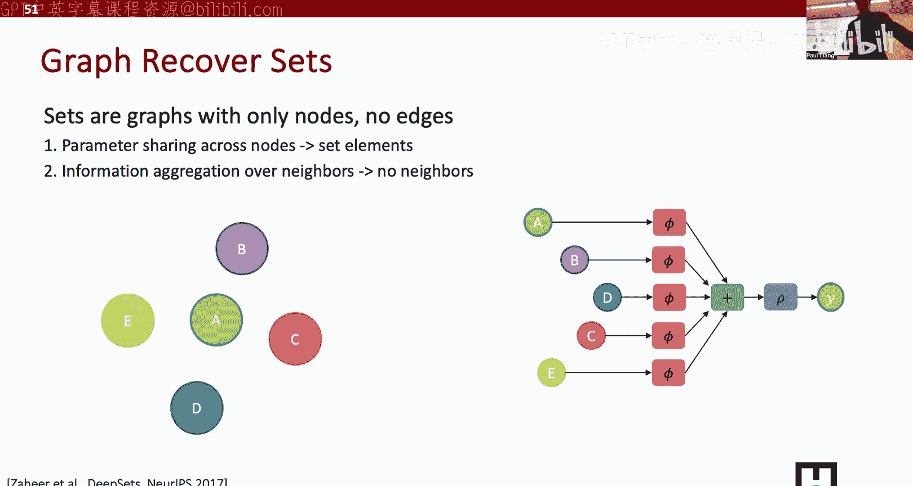

总结一下，上周的“如何建模”主要是关于数据：如何首先决定收集多少数据、标记多少数据，这是超级关键的；清理和规范化数据；从数据中移除异常值；可视化数据以理解标签与数据以及标签之间的关系。最后，正如提到的，您需要建模数据的方式很大程度上取决于您希望模型满足的最终结果和属性，无论是性能、效率还是某种程度的可解释性。

然后，您会想选择一些模型范式。今天我们看了针对每种模态的更领域特定的方法，也让您了解了如何为集合和图等构建定制架构。接下来的几堂课还将研究更通用的模型以及如何适配通用方法。

因此，对于任何AI问题，您必须做出的一个重大决策是：如果存在一些通用模型，您可以适配、微调它；如果不存在，我想在多大程度上构建一些领域特定的模型，无论是在模型架构上特定还是在训练目标上特定。

您必须弄清楚基本元素和表示。正如我们提到的，这总是关于将复杂数据分解为单个元素，无论元素是按序列组织、空间组织，还是集合或图上的元素，弄清楚基本元素以及如何表示它们。

弄清楚数据不变性和等变性。不变性是模型不应敏感的东西，等变性是模型应敏感的东西。如果您不小心，可能会爆炸性地增加模型训练所需的样本数量。

同时，我们还要弄清楚我们讨论的模态概况的其他部分，包括模型应鲁棒应对的噪声、信息量等等。最后，您通常会在数据收集、模型设计、模型训练、超参数调优、评估等之间迭代，直到您满意为止。

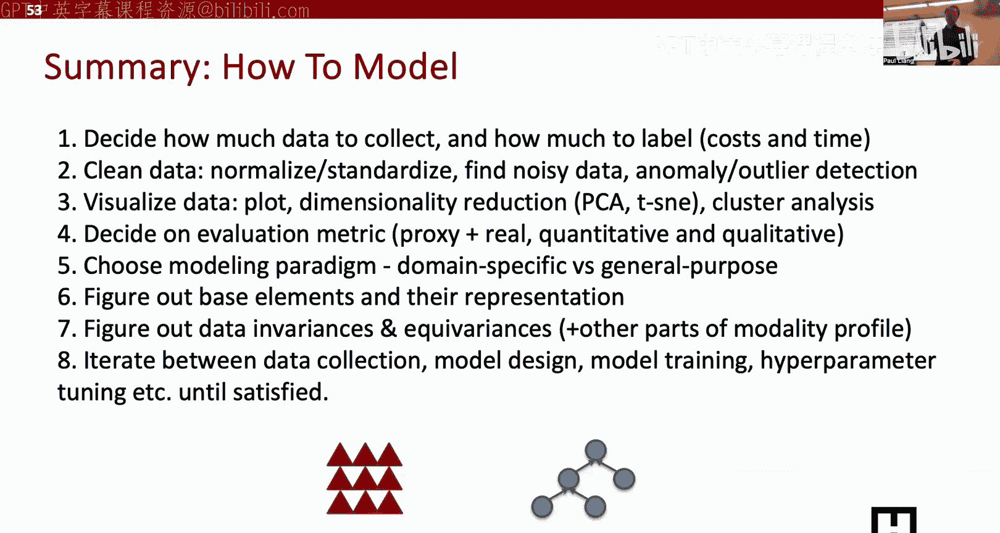

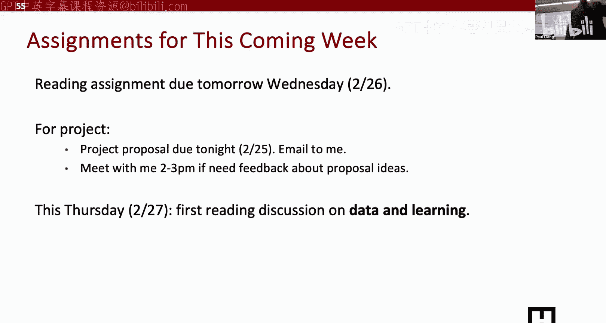

记住，阅读作业明天截止，为周四的讨论做准备。请今晚提交您的项目提案，稍后通过邮件发给我。接下来的一个小时我将有空提供反馈。谢谢大家。