# 7：跨模态学习

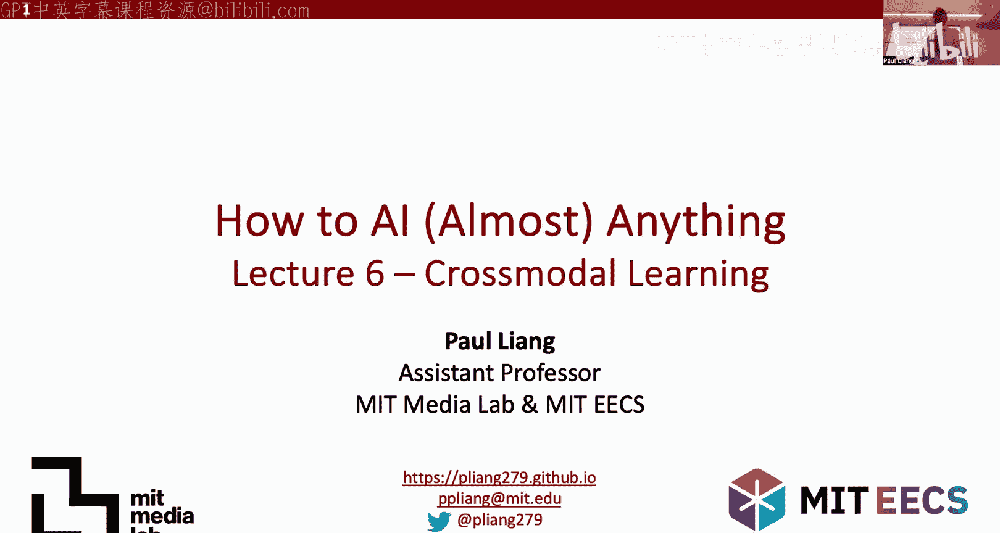

在本节课中，我们将要学习跨模态学习。这是一种在不同模态之间传递信息的技术，通常用于将数据丰富的模态中的知识迁移到数据稀缺但更重要的任务上。我们将涵盖三种主要范式：基于预训练模型的迁移学习、协同学习以及模型诱导。

## 课程概述与作业提醒

首先，提醒一下接下来的作业安排。期中作业即将截止，相关说明已发布在Piazza上。两个关键截止日期都在春假之后：4月1日（周二）提交一份六页的报告，4月3日（周四）进行课堂展示。

关于4月3日的展示，考虑到许多同学可能在下午2点有其他课程结束，我们将尽量灵活安排。如果你需要在2点离开，请告知我们，以便将你的展示安排在课程的第一小时（1-2点）。如果你的展示被安排在第二小时（2-3点），我们也理解你可以稍晚到达（例如1:30或1:45）。请大家尽量参与整个1-3点的课程。

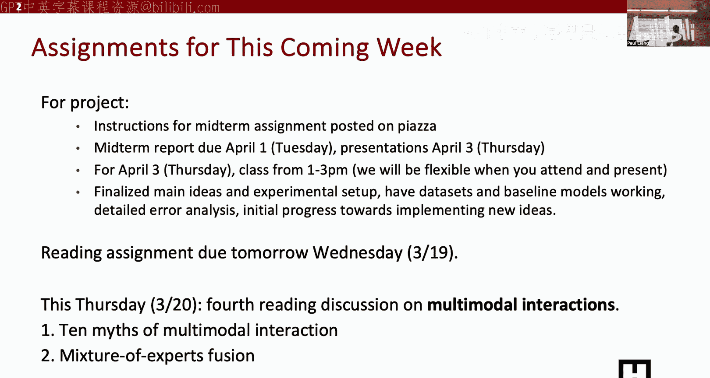

期中作业的要求是：确定你的项目想法、将要使用的数据集和基线模型。理想情况下，你应该已经处理了数据集和基线模型，运行基线模型得到了一些初步结果，并指出了这些模型的主要错误。同时，你应该已经朝着实现你的核心想法取得了一些初步进展，以展示你如何解决先前工作的关键局限。

此外，第四次阅读作业将于明天（周三）截止，为周四的讨论做准备。这次阅读作业主要关于多模态交互，探讨不同模态如何提供信息、如何结合，以及如何使用机器学习模型进行建模。包含两篇论文：一篇是从人机交互角度讨论多模态交互的经典论文，另一篇是近期关于使用专家混合和基础模型进行多模态融合的新论文。

总结一下：期中作业在春假后一周截止，阅读作业明天截止。

## 跨模态学习简介

在今天的课程中，我们将以跨模态学习的概念来结束关于多模态学习的讨论。我们将介绍基础知识以及实现跨模态学习的几种方法。

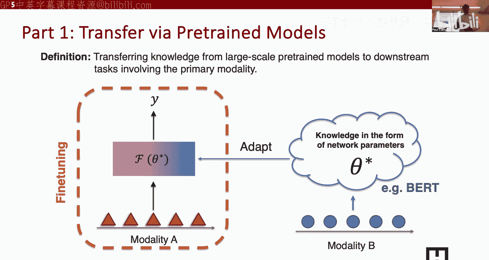

跨模态学习非常重要。其核心思想是在不同模态之间传递信息。通常，你关心的任务或模态可能数据有限（例如医疗数据或现实世界传感器数据）。如何将大规模数据源的知识迁移到你真正关心的任务上，是这里的关键。

我们将涵盖三种范式：
1.  **迁移学习**：通过预训练模型将信息迁移到下游任务。
2.  **协同学习**：在训练时引入辅助模态（在输入或输出端），但在测试时丢弃该模态，仅使用目标模态。
3.  **模型诱导**：即使只能以黑盒API形式访问模型，也能诱导模型之间的行为。

## 第一部分：通过预训练模型进行迁移

首先，我们快速回顾迁移学习。你可能已经对此有所了解。其思想是，我们通常拥有一个存储了大量信息的预训练大模型（例如BERT、LLM），目标是将其信息通过某种方式适配到我们关心的、可能与预训练分布不同的模态或任务上。这个过程通常称为**微调**。

我不会过多涉及大语言模型，春假后会有专门讲座。但需要指出，你经常会进行多任务或迁移学习。关键定义如下：
*   **监督学习**：使用数据 `X` 预测标签 `Y`。
*   **多模态监督学习**：使用 `X1` 和 `X2` 预测 `Y`。
*   **多任务学习**：使用数据 `X` 同时预测两个任务 `Y1` 和 `Y2`。如果任务间共享信息，两个任务的性能都可能提升。
*   **迁移学习**：从任务 `X -> Y1`（或通过自监督学习 `X -> X‘`）学习，然后将知识迁移到新任务 `X -> Y2`。目标是这种迁移比直接从 `X` 监督学习 `Y2` 效果更好。
*   **跨模态学习**：是迁移学习的扩展。例如，在一个模态（如语言）上预训练，然后迁移到另一个模态（如代码或基因组序列）。
*   **自监督预训练**：通常形式是 `X -> X‘`，然后迁移到 `X -> Y` 任务。

这些概念在第二周讨论数据收集和训练范式时已经涉及。

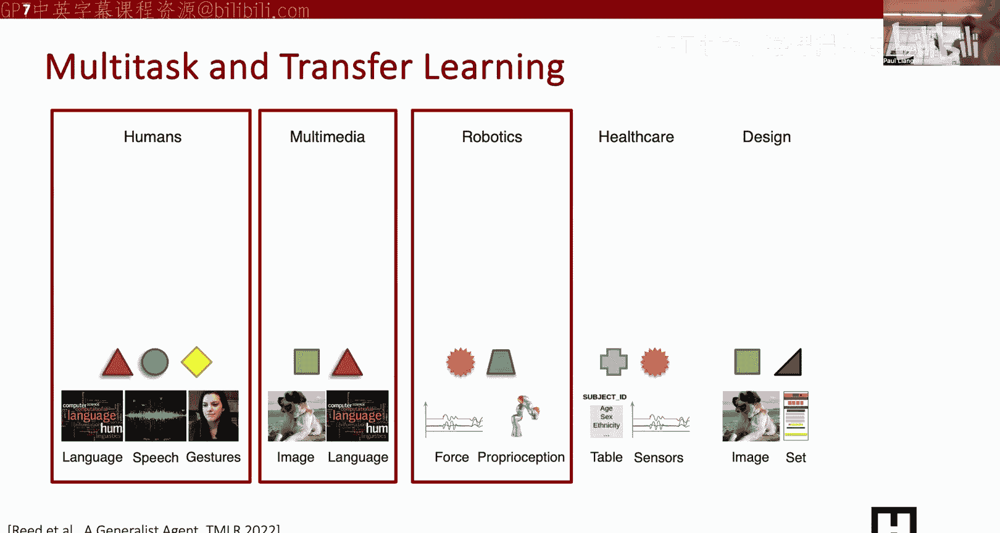

### 跨模态多任务迁移学习

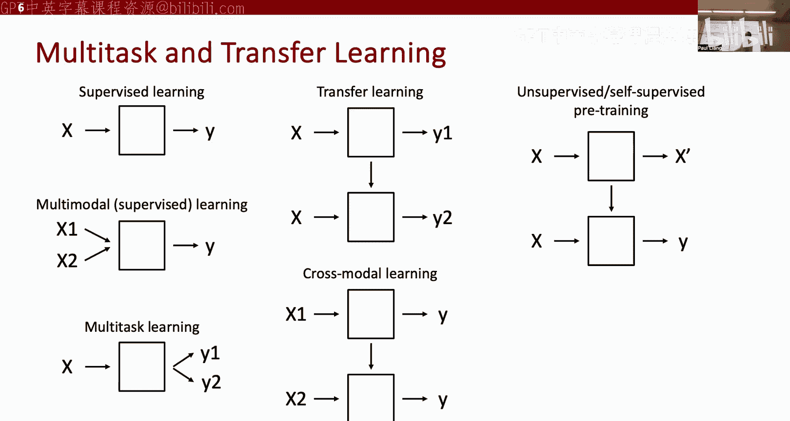

今天要讲的第一部分是“加强版”的多任务和迁移学习。这是一种新的方法范式，它们在许多**不同模态**之间进行多任务和迁移学习。

考虑当前多模态数据集的通用设置。例如，在理解人类时，你可能有语言、语音、手势和行为标注。在多媒体数据中，你有图像和文本（尽管与人类说话的内容不完全相同）。在机器人领域，你有传感器数据，其中部分与医疗数据（如ICU传感器信息）重叠。

如今的新一代方法不再局限于单个领域或一组模态内进行多任务和迁移学习，而是在**非常不同**的输入模态和输出领域之间进行。

例如，我们的HiMT论文以及另一篇名为“Journalist Agent”的论文，就为多媒体、机器人学和多个强化学习任务实现了这种跨域迁移。

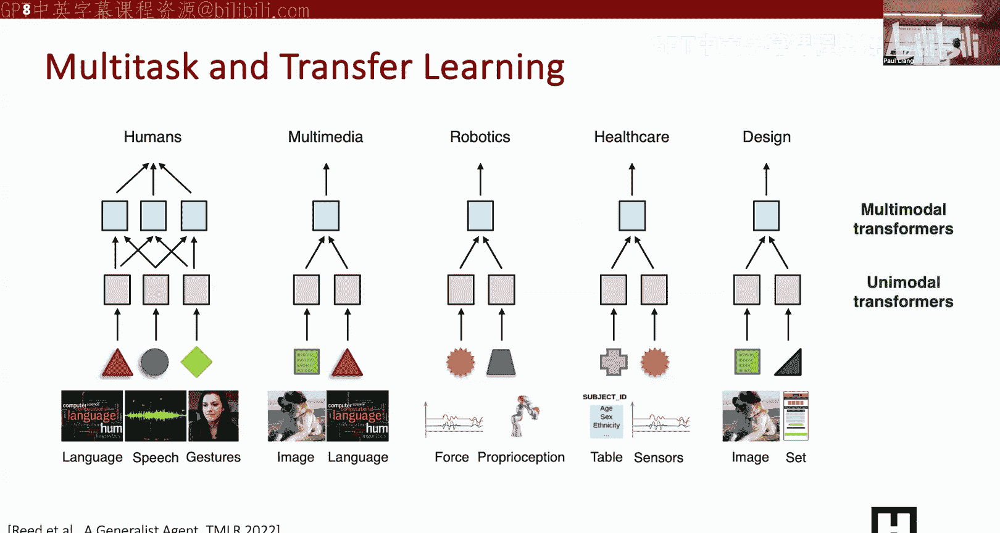

**关于迁移学习的一个问题**：在迁移学习中，我们是否关心源任务 `Y1` 的准确性？`Y1` 和 `Y2` 的性能之间是否存在关系？

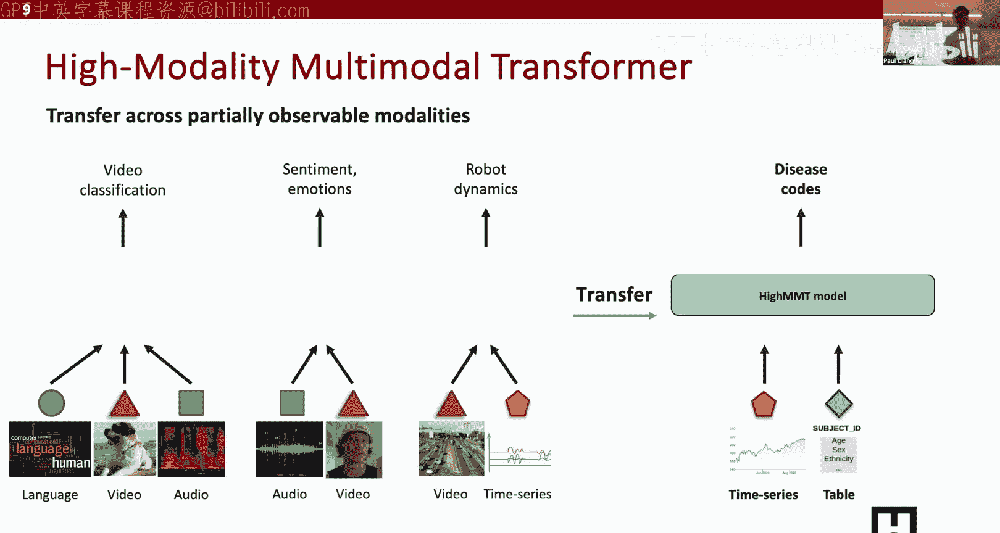

通常，`Y1` 的准确率越高，迁移性能越好。这就是为什么在计算机视觉研究中，一个在ImageNet（`Y1`是图像分类准确率）上预训练效果更好的模型，通常能更好地迁移到其他任务（如医疗图像）。如今，人们通过预训练并衡量模型在MMLU等多任务语言理解基准上的性能来评估模型，通常在这些基础任务上表现更好的模型，迁移到其他任务的效果也更好。当然也有例外，有时模型可能对源任务过拟合，导致 `Y1` 性能越好，迁移效果反而越差。

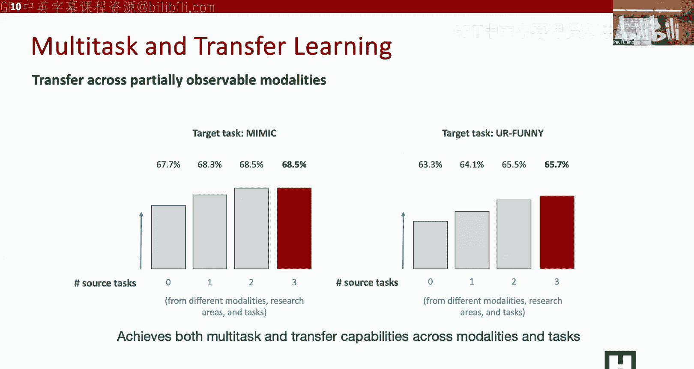

### 通用多模态Transformer

如今，我们确实有方法可以在非常不同的模态和任务之间进行多任务和迁移学习。这对于医疗或设计等数据稀缺的领域非常有用，因为你必须利用其他数据丰富的领域。

现在越来越常见的是，尽管表面上输入数据差异很大，但我们可以将所有数据**序列化**。语言可以序列化为词序列，语音可以序列化为采样频率序列，图像可以序列化为像素序列，传感器数据可以序列化为时间步序列。一旦序列化，Transformer被证明是学习模态内关系（词与词、面部表情之间、传感器时间步之间）的一阶近似非常可靠的方法。

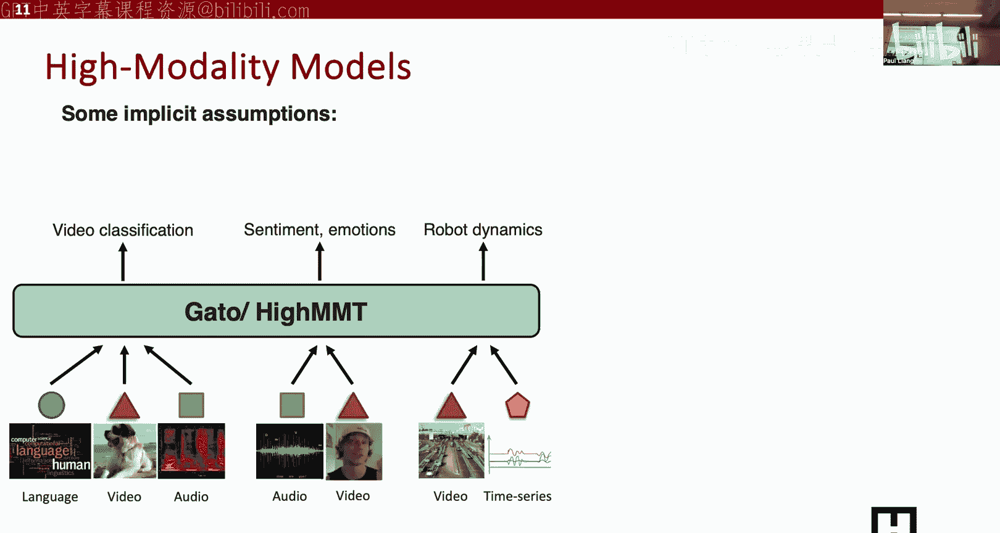

因此，**单模态Transformer正变得越来越通用**，事实上，你可以用同一套参数模型处理所有事情。同样，**多模态Transformer** 用于学习模态间的成对交互，也变得越来越通用。它们可以用来学习所说词语和面部表情之间的信息，也可以用来学习患者人口统计信息和ICU时间序列信息之间的关联。

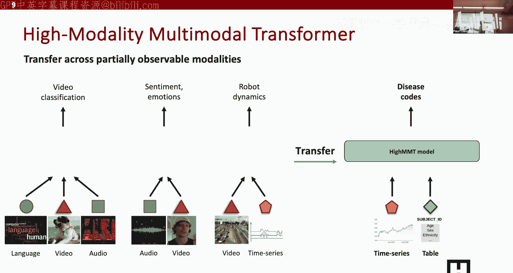

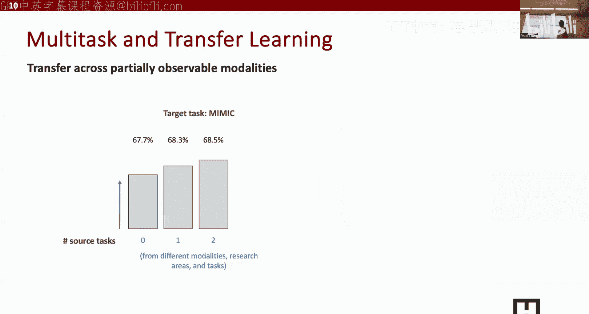

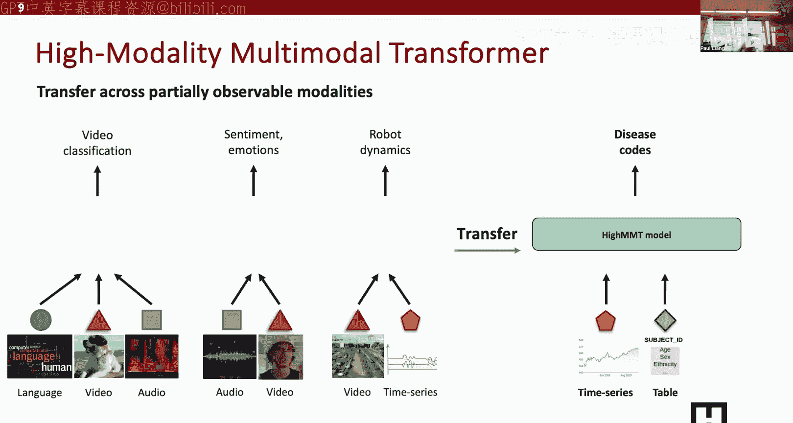

这些模型的优点是，首先，它们是**大规模多任务**的，一个模型在非常不同的输入模态子集和不同的预测任务上进行训练。其次，它们展示了**迁移现象**。例如，你可以在三个任务和三种模态上训练一个模型，然后将其迁移到第四个任务（比如一个医疗案例）。你会发现，机器人数据中的时间序列与医疗数据中的时间序列存在重叠，同时也有新的信息。

我们的研究结果显示，性能持续提升。如果仅在目标任务上监督训练，性能是67%。增加一个不同的源任务进行预训练，性能提升；增加两个，更好；增加三个，更好。同样，对于其他预训练和迁移任务组合，预训练的模态和任务越多，迁移性能越好。

### 关键假设与挑战

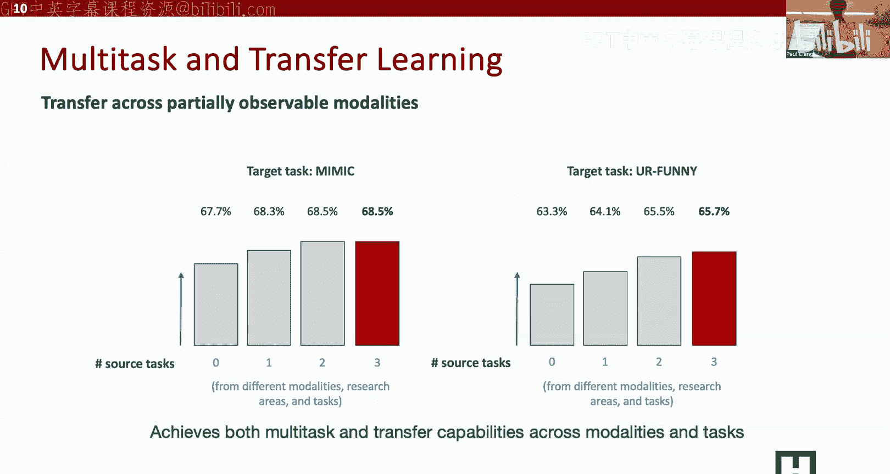

我们确实看到了一些非常通用的多模态多任务模型。但它们做出了一些关键假设，这些假设在不同场景下可能被违背：
1.  **序列化假设**：假设所有数据都适合表示为序列。有些数据可能不太适合。
2.  **模态标识**：假设仅通过一个独热编码向量来标识模态（例如语言是`[1,0,0,...]`，视频是`[0,1,0,...]`）。这没有捕捉到很多特定信息，也许可以做得更好。
3.  **共享模型**：使用一个共享的多模态模型处理一切。当然，现在也有工作（如阅读作业中的专家混合）探索让某些专家处理特定的融合，但专家之间仍然共享信息。

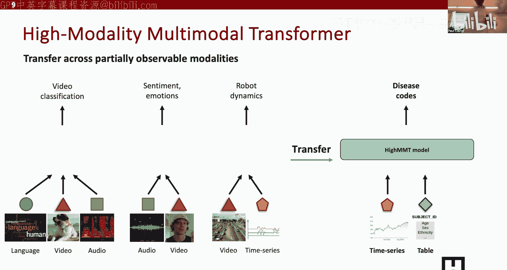

**关于医疗MIMIC数据迁移的问题**：那些任务具体是什么？当你在机器人时间序列数据上训练，如何评估其迁移到主要是数值的医疗MIMIC领域？

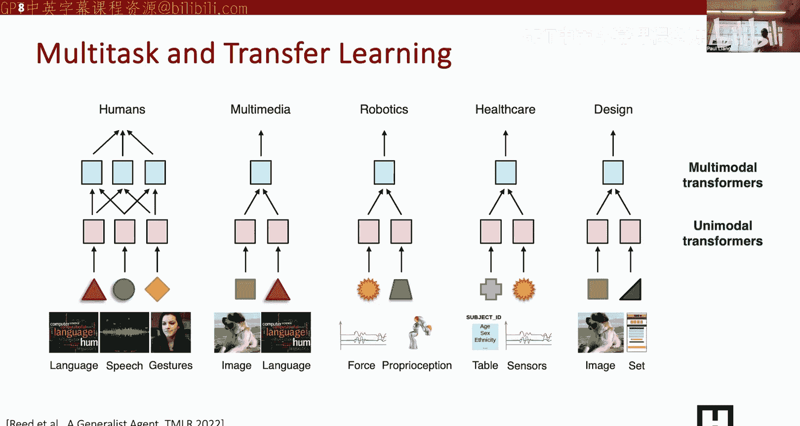

在我们的案例中，源任务包括多媒体视频分类、人类行为视频、机器人传感器数据等，然后迁移到MIMIC任务。我们尝试了从零个源任务（仅监督训练MIMIC）到一、二、三个源任务的不同组合。对于机器人数据，它也是预训练的任务之一，我们也尝试了其他组合。具体数字可以参考论文。

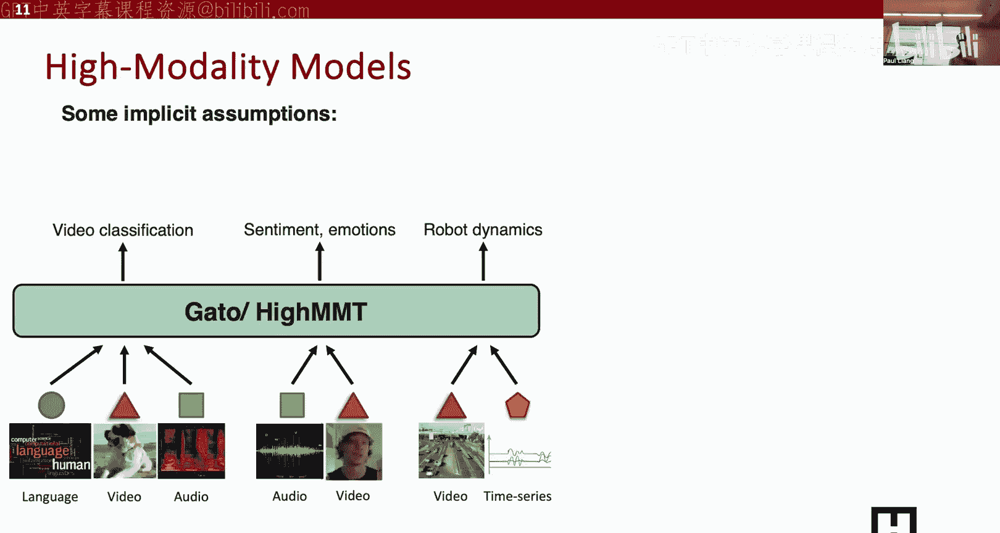

另一个问题是，在之前的例子中，模型使用音频、文本和图像，但首先用音频和文本做什么？为什么这样有效？这可能取决于你是否同时拥有所有三种数据。如果你同时拥有文本、视频和音频，那没问题。但有时你可能分别拥有文本-视频数据和文本-音频数据，而没有三者同时出现的数据。这时，文本可以作为连接这两个数据集的共同桥梁。

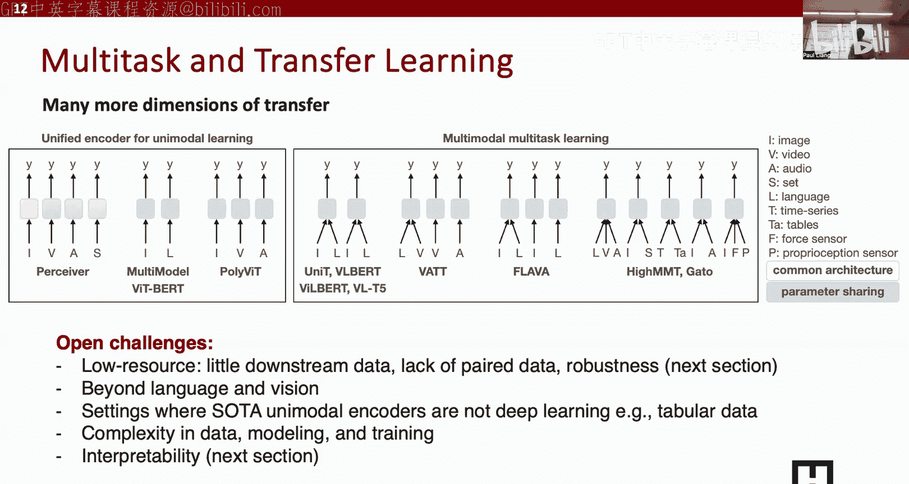

关于如何将视频等模态信息迁移到只有表格和时间序列的MIMIC任务：MIMIC确实是时间序列和表格数据。但我们在其他任务（如机器人、音频视频）中也看到了时间序列的证据。实际上，音频和视频虽然维度更高，但在效果上仍然主要是时间序列。

我们展示的方法基本上是训练一个Transformer编码器，它可以处理语言、语音、手势、视频、时间序列等一切。唯一的区别是一个标识模态来源的独热编码标识符。模型学习通用特征，而任务特定的头部学习任务特定特征。这并不总是容易做到，可能会面临领域特定挑战。

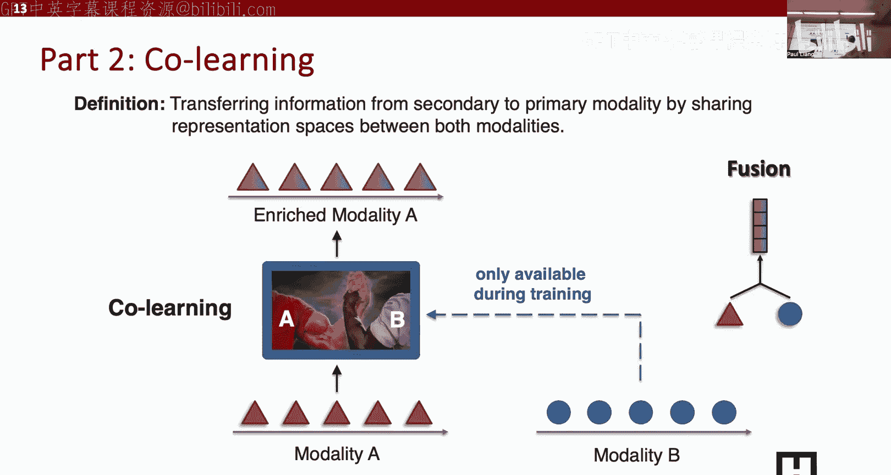

### 研究现状概览

截至2023年，我们进行了一项综述，总结了所有在不同模态和任务之间进行迁移的模型。例如，Perceiver是一种适用于一切的通用架构（但不同任务参数可能不共享）。有些模型尝试标准化图像、视觉、音频，有些模型尝试在语言、视觉、音频之间进行迁移。这就是2023年多模态多任务和迁移学习的概况。

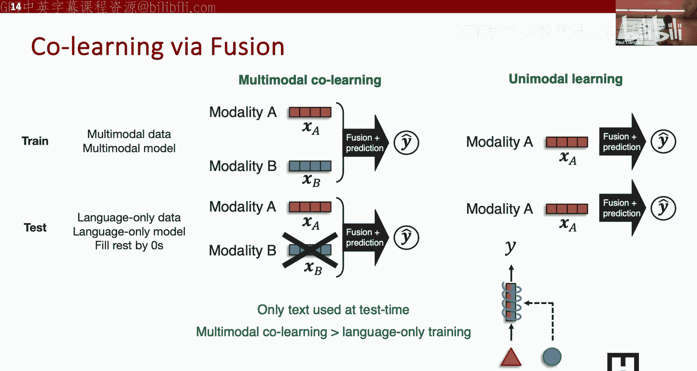

## 第二部分：协同学习

第一部分主要是通过多任务迁移学习来利用不同数据集的信息。第二部分，我们将看看称为**协同学习**的现象。

在协同学习中，我们有关心的模态A。我们会在训练时引入一些额外的模态B（仅训练时可用），以学习更好的表示。你可以将其视为一种更好的“协同”表示，它丰富了模态A的信息。关键思想是：**B仅在训练时作为辅助信息引入，在测试时，只有A分支被激活，仅使用A来预测标签**。因此，可以公平地与仅使用A进行监督学习的模型进行比较。

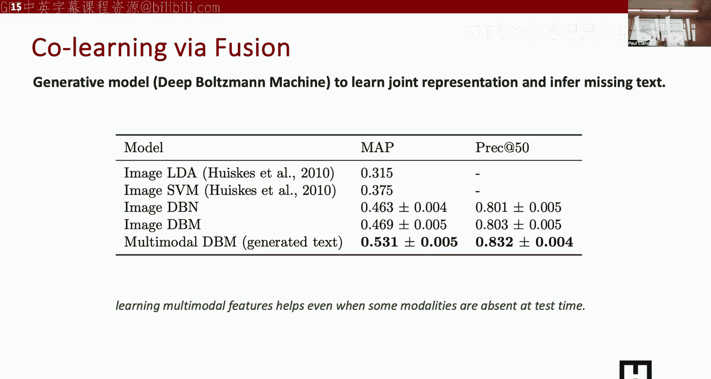

协同学习有三种主要方式，各有优缺点，有时有效，有时无效。

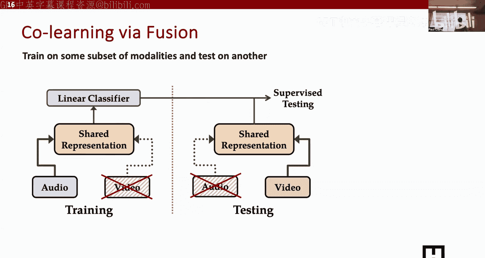

### 1. 通过融合进行协同学习

第一种方式是通过**融合**。你有A和B，学习一个融合表示。回想一下融合，你有一个设置，其中有两个模态，你学习一个结合它们的联合表示。

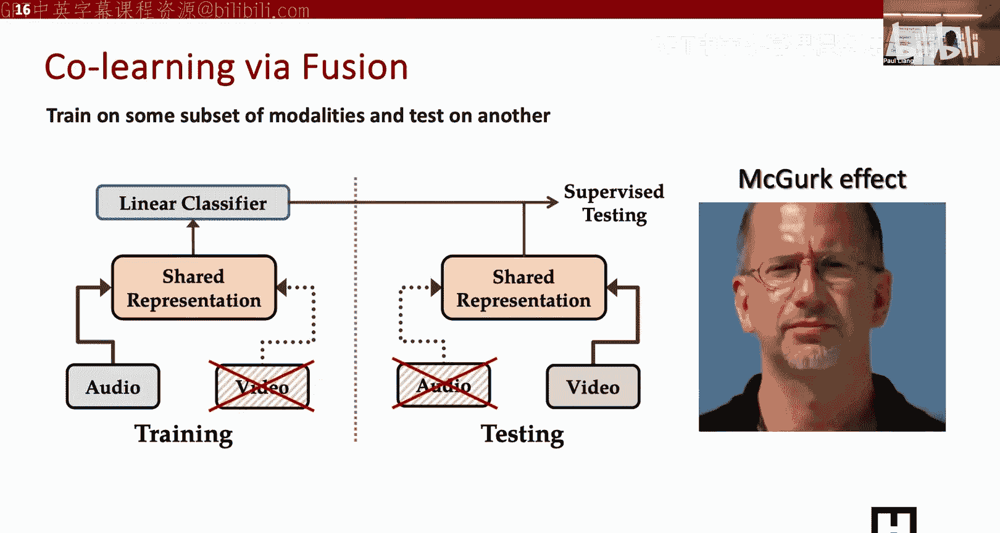

在测试时，你“清零”或“用平均值填充”模态B的输入。所以测试时仍然只使用A，将其通过融合模型来预测Y。

**基线**是单模态学习，即仅使用A预测标签Y。

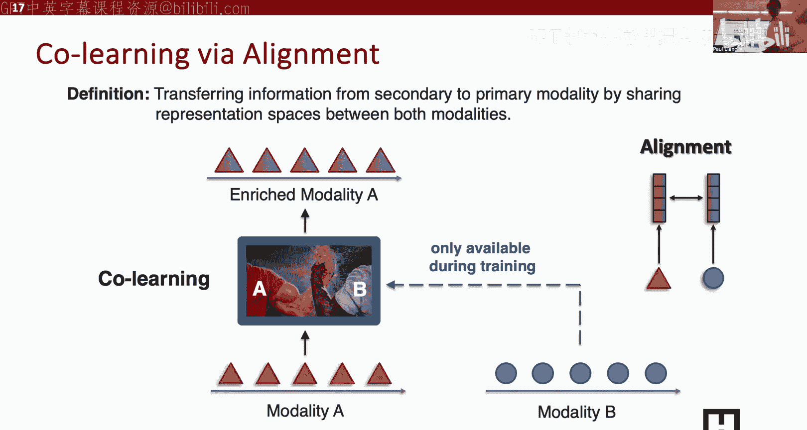

研究表明，使用这种协同学习范式，性能相比直接监督学习有持续提升。在我们的工作中，情境是A为语言，B为非语言信息（面部表情和声音表达）。在训练时结合语言和非语言信息学习，测试时仅使用语言，比直接监督学习语言效果更好。

其他证据包括2014年的论文《Multimodal Learning with Deep Boltzmann Machines》，他们使用深度玻尔兹曼机作为融合模型，在图像和文本上训练联合模型，测试时移除文本，模型性能优于仅基于图像的监督学习方法。

另一个例子是2011年的论文《Multimodal Deep Learning》，他们训练音频和视频的共享表示，然后在测试时尝试仅用视频，结果发现这与“视频训练-视频测试”的监督学习性能相当甚至更具竞争力。他们的任务是音素识别（McGurk效应），结合音频和视频来识别人在说什么。

这些例子都表明，在训练时拥有更多模态可以学习到更好的共享联合表示。即使在测试时某些模态缺失（用零或均值填充），其性能仍然优于仅使用现有模态进行监督学习。

### 2. 通过对齐进行协同学习

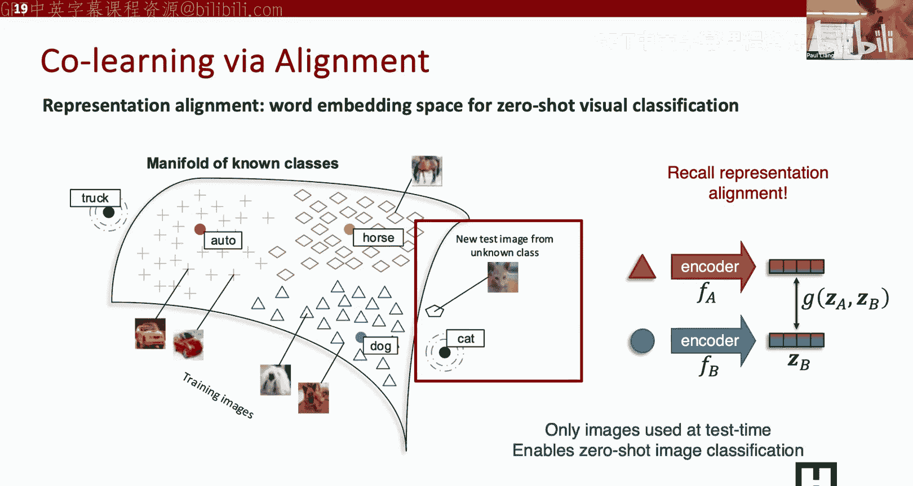

协同学习的第二种范式是通过**对齐**。设置相同：你关心模态A，但在训练时有额外的模态B。你不是像融合那样将A和B合并为一个表示，而是学习一个**表示空间**，其中A和B是分开的，但通过某种相似性函数对齐。

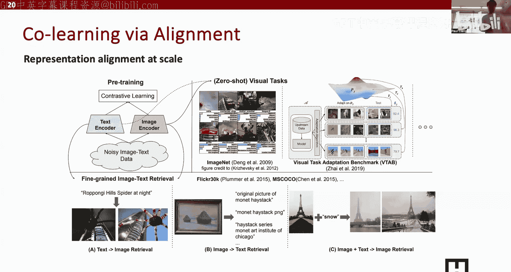

一个早期的证据是2013年的论文《Zero-shot Learning through Cross-modal Transfer》，这可以说是CLIP的早期版本。你有CIFAR-10的低分辨率图像和一些词嵌入。你学习一个对齐的表示空间，使得“汽车”的词嵌入附近是所有汽车图像的嵌入，“狗”的词嵌入附近是所有狗图像的嵌入。你使用余弦相似度或L2距离作为相似性函数，拉近对应配对，推开不配对。

在训练时，你学习这个对齐的表示空间。在测试时，假设你有一张从未见过的猫的新图像。在传统的图像分类中，由于没有“猫”这个类别，你无法预测。但在这个对齐空间中，你可以将图像投影进去，找到最近的词嵌入。由于词嵌入本身有结构（“猫”接近“狗”但不同于“狗”，并且远离“马”），你就能进行零样本预测，说这张图像应该标记为“猫”。

这同样是协同学习的证据：训练时使用词和图像进行对齐，测试时仅使用图像，通过查找最近邻词嵌入实现零样本图像分类。如今，我们有这种方法的扩展版本，如CLIP等模型。训练时使用图像和文本进行双编码器对齐，下游推理时仅使用单一模态（如图像编码器）进行预测任务，性能优于直接在目标模态上进行监督学习。

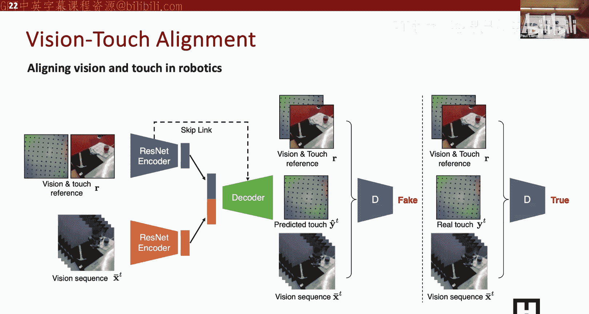

另一个例子是机器人领域，机器人操纵物体时有视觉和触觉。训练时使用视觉和触觉学习一个对齐空间，判断它们是否来自同一次演示。学习到的良好表示可以迁移到仅视觉或仅触觉的任务中。

所以，通过对齐进行协同学习：训练时有两个模态，学习它们之间的对齐表示，这个对齐表示对于测试时仅使用其中一个模态的任务是有用的。

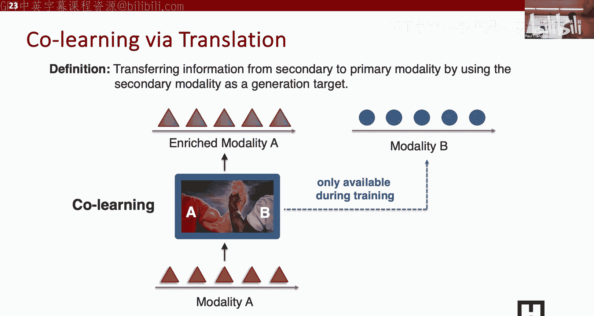

### 3. 通过翻译进行协同学习

协同学习的最后一种类型。前两种（融合和对齐）中，额外模态B出现在**输入空间**。这第三种例子将额外模态B用在**输出空间**。

在训练时，你以A为输入，学习一些特征，这些特征用于预测模态B作为一个预测目标。希望**通过预测这个额外的辅助模态B，你能学到更好的表示**，这些表示最终可以用于测试时仅使用A进行的预测。

我们称之为**通过翻译进行协同学习**。三种方式总结：融合（B在输入）、对齐（B在输入）、翻译（B在输出）。

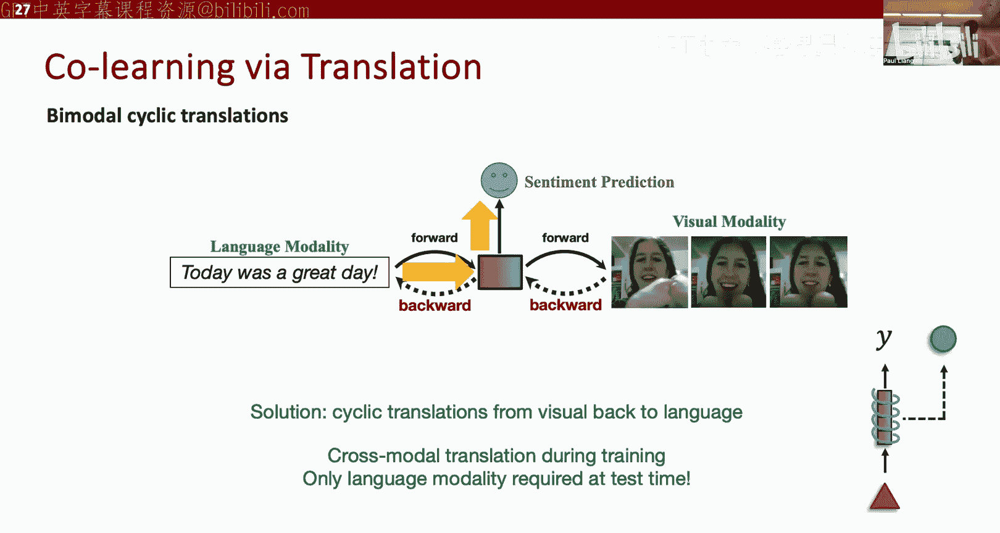

一些例子：在我们的工作中，数据包含人说话的语言和说话时的视觉表情。目标是理解情感等行为。通常做融合需要在测试时同时拥有两个模态。另一种方法是进行翻译：以语言为输入，预测一个表示，这个表示应该能够解码人的视觉表情（即“幻觉”出说这些话时可能有的表情）。这个表示本质上是多模态的，因为它编码了语言，但只保留了与预测视觉信息最相关的部分。然后，你可以用这个表示进行情感预测。测试时，你使用训练好的模型，输入语言，通过编码路径得到表示，然后直接通过分类头预测情感，不再预测视觉信息。

我们还展示了双向翻译（循环一致性）可以进一步提升性能：先用语言预测视觉，再用预测的视觉重建原始语言。这仍然是协同学习，因为训练完成后，测试时只需要输入语言，预测特征，然后解码标签。结果显示这优于仅使用语言进行监督学习。

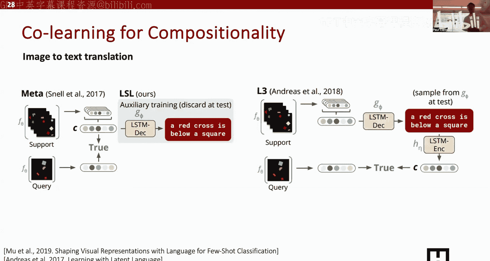

其他例子包括一些论文认为协同学习有助于组合性。在一些需要模型非常精细地预测物体位置、数量、空间关系的计算机视觉任务中，仅进行监督学习可能无法捕捉这些细节。这些研究者发现，可以进行辅助训练（测试时丢弃），即以图像为输入预测描述性语言。因为语言本身就捕获了“什么在什么上面/后面”的组合结构。训练时，学习能够预测这种组合句子的表示，测试时丢弃语言预测，仅进行图像预测，效果更好。

另一个例子是关于扩展掩码语言建模的论文。除了做掩码语言建模（用上下文预测被掩码的词），还可以做**掩码视觉标记分类**。在编码文本时，同时预测与之相关的人或事物的视觉表现（尽管可能很抽象）。这很自然，许多人认为人类就是这样学习的：听到语言会想象视觉画面，看到视觉会想象声音。证据表明，训练时使用文本来预测被掩码的词和图像，学习到的表示在测试时仅输入文本，性能优于仅基于语言的掩码语言建模。

最后一个例子是关于使用呼吸数据评估帕金森病的研究。你可以收集患者10小时的夜间呼吸数据，但只能预测一个比特的信息（是否患帕金森病）。训练信号非常稀疏。一个自然的想法是使用另一个模态来提供更丰富的监督。例如，同时预测同一时间点的脑电图（EEG）。呼吸数据是10小时，EEG也是10小时，这提供了丰富的监督信号（用10小时预测10小时），同时也要预测帕金森病指标。他们称之为辅助任务的多任务学习，但这也是通过从一个模态翻译到另一个模态进行协同学习的例子。研究表明，预测EEG数据的能力越强，学习到的用于预测帕金森病早期发作的表示也越好。

**关于数据规模和关系的问题**：这主要是经验性的发现。理论上，如果你对两个模态的互信息以及任务信息所在位置做出一些假设，可以证明一些结论。直觉是，当你进行翻译时，你本质上是在学习两个模态之间的共同部分。如果任务信息也恰好在这个共同部分内，那么你就会表现良好。

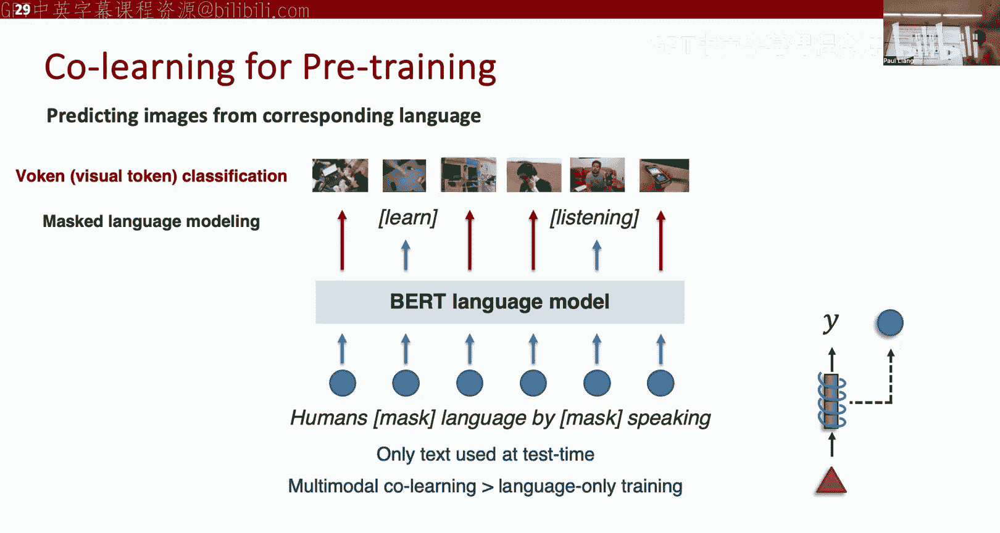

如何决定使用哪个辅助模态？这通常基于直觉、试错以及与领域专家（如医生）的交流。所有这些例子都包含直觉和试错的成分。

### 协同学习的失败案例

说到试错，我想展示一些失败案例，因为协同学习并非总是有效。

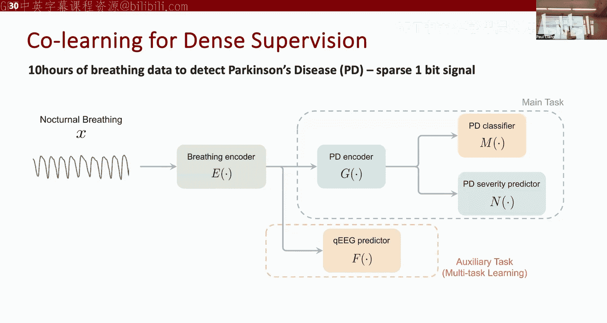

有一系列工作探讨了这个问题。例如，早期BERT在众多NLP任务上表现出色。然后出现了VideoBERT和VisualBERT，它们学习语言与视觉/视频的联合表示。事实上，人们发现这些模型不仅在视觉语言任务上，在纯NLP任务上也表现更好——这是协同学习的正面证据。

但有些研究者发现，对于许多任务，存在负面证据。如果你从BERT开始，在语义角色标注等词分类任务上达到90%的准确率，然后开始训练BERT去预测视频（或反之），性能实际上会下降，有时甚至大幅下降（从76%降到65%）。他们展示了一些NLP任务性能下降的例子。你可能会认为这些是NLP任务，不需要视觉和视频。但他们也展示了一些常识问答任务，这些任务似乎视觉很重要（例如“如何去除家具上的光泽？”）。直觉上，如果模型看过相关的教学视频，应该表现更好。但结果显示，训练这些VideoBERT/VisualBERT后，性能有时只有轻微提升，有时反而下降不少。

所以，协同学习有其局限性，并非总是有效。

## 第三部分：模型诱导

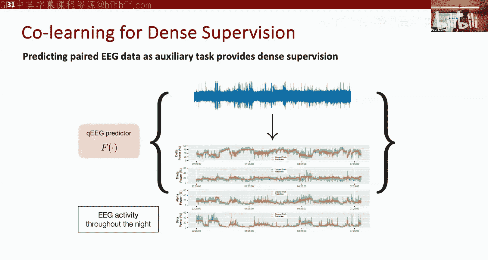

在最后一部分，我们将讨论**模型诱导**。这同样是迁移和多任务学习的扩展，但在这种情况下，我们主要关注API场景，你可能无法访问模型的内部。因为协同学习通常需要训练融合、对齐或翻译模型，需要内部访问权限。我们将介绍一些不需要内部访问的方法。

在剩下的课程中，我将介绍两种关键算法。我们将从单模态情况开始，即**自训练**，并以此作为热身，过渡到双模态情况，讨论**协同训练**算法——这是最有名的多模态/多视图算法之一。

### 自训练

自训练算法实际上与当今的标签学习非常相关。其直觉是，你有一些带标签的数据 `(X_labeled, Y)` 和大量未标签的数据 `X_unlabeled`。

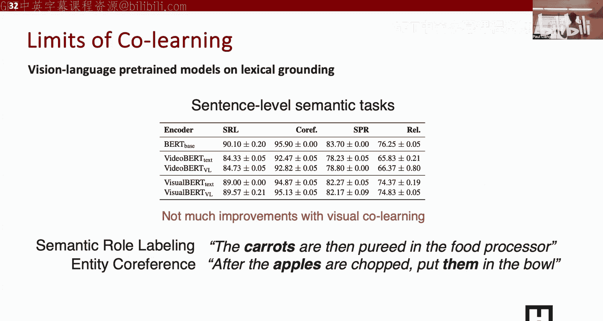

在自训练设置中，你通常会在以下步骤间迭代：
1.  在带标签数据上训练一个分类器 `F1`。
2.  使用这个分类器去标注你拥有的未标签数据（称为伪标签）。
3.  通常有一个选择过程，例如先标注最置信的样本。
4.  将这些新标注的样本添加回带标签数据集。
5.  在合并后的带标签数据上重新训练分类器。
6.  重复此过程，直到所有未标签数据都被标注，或者模型收敛。

测试时，直接输出分类器的预测。

**如何定义“置信度”？** 通常使用启发式方法。例如，分类器对未标签数据点进行推断，会给出一个softmax分布。你可以看这个分布是像 `[0.9, 0.1]` 这样非常确定，还是像 `[0.6, 0.4]` 这样不太确定。置信度的一种衡量方式是看预测概率的最大值，或者看样本距离决策边界的距离。

直观理解：假设你有一些带标签样本和一个初始分类器边界。未标签样本中，有些距离边界很远（高置信度），有些就在边界附近（低置信度）。你首先用分类器标注那些高置信度的样本（伪标签），将它们加入训练集，然后重新训练分类器。新的决策边界可能会向这些新加入的样本方向移动，从而更好地分类那些之前不确定的样本。

### 协同训练

协同训练是1998年提出的一篇非常具有开创性的论文，至今仍被广泛使用。它本质上是自训练向**两个视图**的扩展。

我们假设数据有两个视图 `X1` 和 `X2`（经典的多模态设置），有两个分类器。我们有一些带标签的配对数据 `(X1, X2, Y)`，以及大量未标签的配对数据 `(X1, X2)`。

一个关键假设是：**两个模态是冗余的**，它们之间的共同信息对任务至关重要。不能有太多独特或协同的信息。

协同训练算法的工作原理与自训练非常相似：
1.  你有带标签数据 `(X1, X2, Y)` 和未标签数据 `(X1, X2)`。
2.  分别在两个视图上训练分类器：`F1` 在 `X1 -> Y` 上训练，`F2` 在 `X2 -> Y` 上训练。
3.  使用分类器 `F1` 标注它在第一个模态上最置信的未标签样本，然后将这些样本（及其伪标签 `Y’`）**分配给第二个模态的分类器 `F2` 作为训练数据**。
4.  反过来，使用分类器 `F2` 标注它在第二个模态上最置信的样本，然后将这些样本分配给第一个分类器 `F1` 作为训练数据。
5.  两个分类器在对方标注的新数据上重新训练。
6.  迭代进行。

**为什么需要配对数据？** 因为当 `F1` 标注了 `X1` 中的一个样本时，我需要找到对应的 `X2` 样本，并将 `F1` 赋予的伪标签用于训练 `F2`。

测试时，给定新数据，你可以使用任一分类器，或者对两个分类器的结果进行集成（如多数投票）。

尽管是1998年的工作，但至今仍被广泛使用。例如，在行为识别中，你有视频数据（RGB帧）和光流数据（捕捉运动）。直觉上，有些活动（如静态图像分类）RGB更重要，有些活动（如高尔夫挥杆）运动信息更重要。协同训练被证明在这里效果很好，因为RGB分类器可以帮助标注光流数据，光流分类器可以帮助标注RGB数据，它们相互学习。

更多例子出现在语言模型中。例如，一篇2022年的论文中，两个视图分别是GPT-3和BERT。GPT-3更大，更擅长文本补全；BERT在当时更擅长使用其表示进行分类。他们进行协同训练：GPT-3模型标注一些数据用于训练BERT，BERT模型标注一些数据用于训练GPT-3。

如今，甚至有更多例子假设这些模型是API，你无法或不想修改其内部，但仍然具有多个智能体辩论、相互传递信息或相互标注数据的特性。协同训练工作确实启发了这一系列研究。

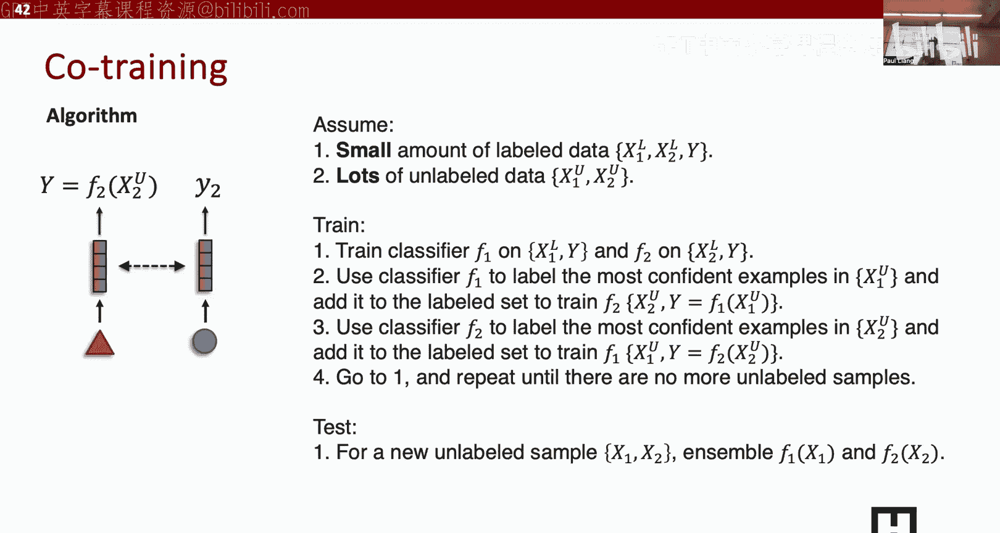

## 总结

总结一下，跨模态学习是在不同模态之间传递信息的思想，通常是从数据资源丰富、数据量大的模态传递到数据资源少、数据量小但你真正关心的模态。

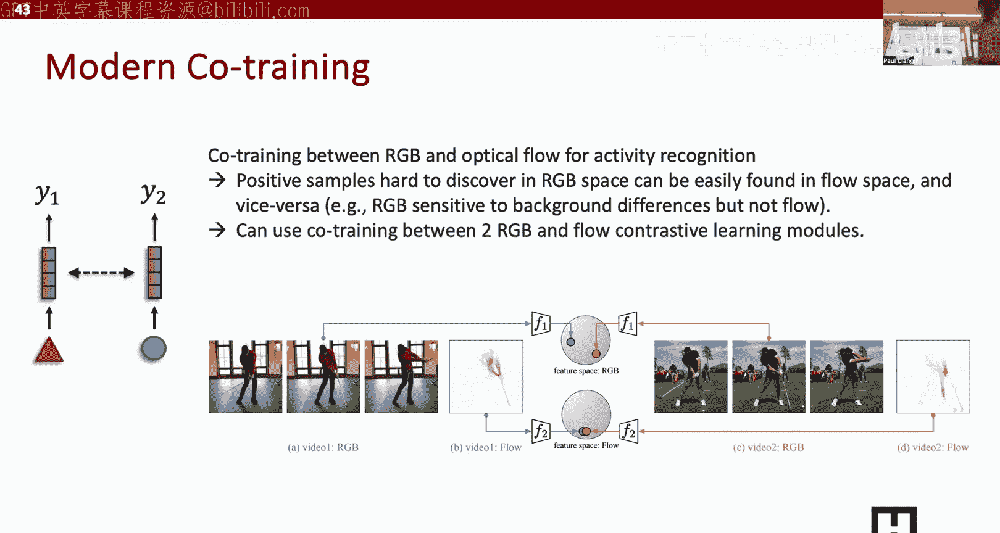

我们看到了三种主要方法的例子：
1.  **迁移和多任务学习**：通过预训练和微调，或在多个任务和模态上联合训练。
2.  **协同学习**：在训练时引入额外数据（作为输入或输出），测试时丢弃。包括通过融合、对齐和翻译三种方式。
3.  **模型诱导**：即使只能以黑盒API访问模型，也能诱导模型之间的行为，如自训练和协同训练。

一些提示：决定使用哪个辅助模态；决定是做辅助输入还是辅助输出；决定是修改模型内部还是保持黑盒访问。

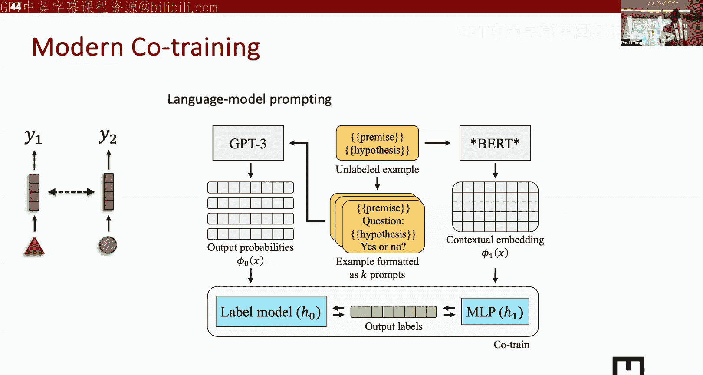

所有这些方法都假设模态之间存在一定的**冗余性**，你只能保留两者共同的部分（融合、对齐、翻译正是利用共同信息）。模型诱导也假设两个视图能提供相似的信息。目前，我还没有看到如何在不依赖冗余性假设的情况下进行跨模态学习。

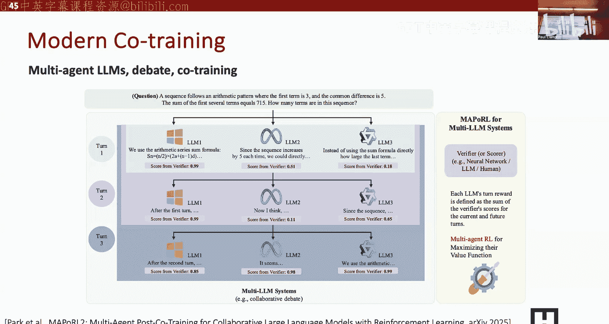

## 课程进度与后续安排

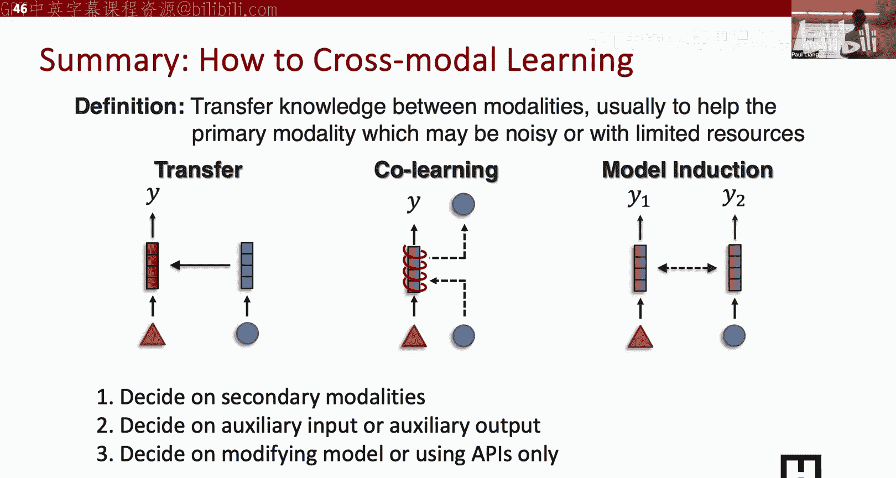

到目前为止，在本课程中我们已经学习了AI的基础知识，涵盖了多模态连接、对齐、交互、融合，以及今天的跨模态学习。下周是春假，没有课。春假回来后，我们将讨论大模型、现代生成式AI、推理、交互式智能体以及所有与数据相关的内容。

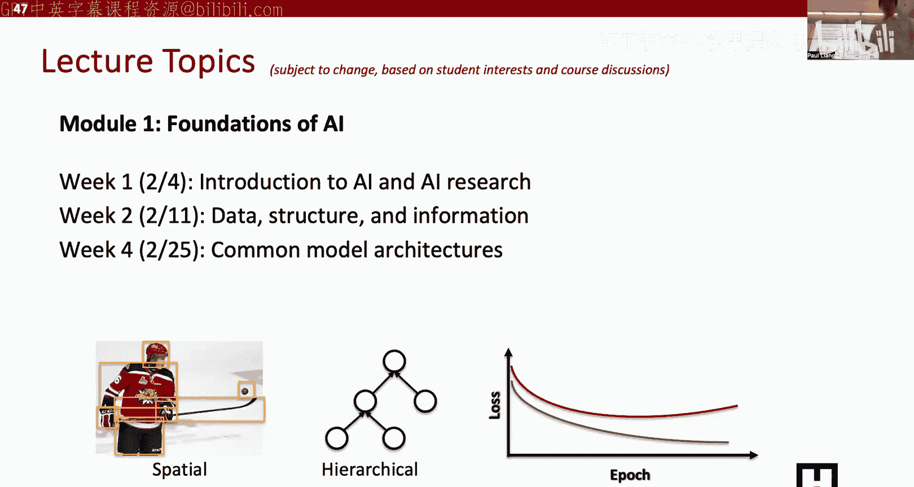

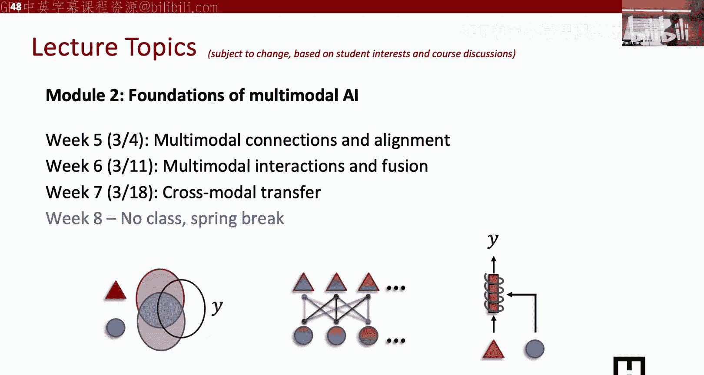

最后再次提醒，请确保你正在完成期中作业，报告和展示将在春假后一周截止。阅读作业明天截止，周四讨论。谢谢大家！

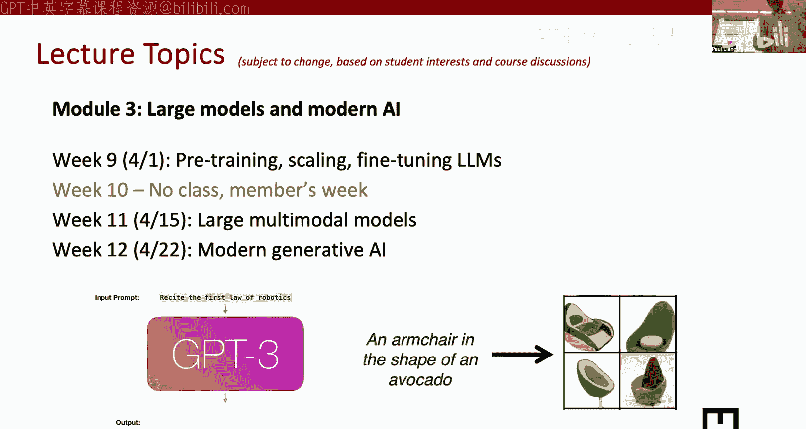

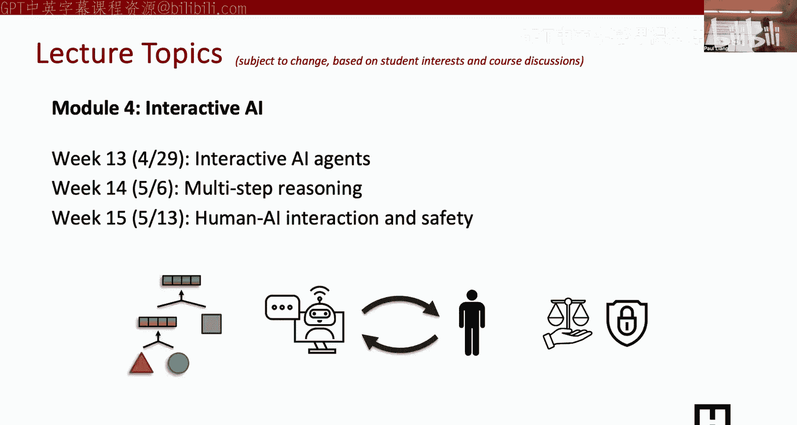

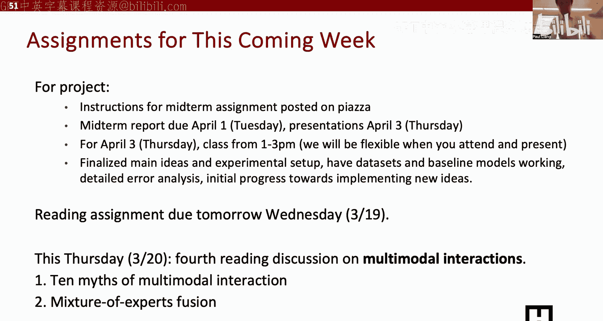

