# 8：多模态融合 🧠

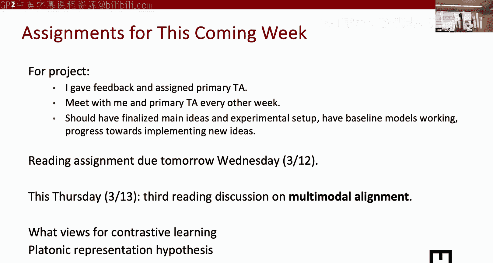

在本节课中，我们将深入学习多模态融合。多模态融合是多模态学习中的核心挑战，旨在将来自不同模态（如图像、文本、音频）的信息有效地结合起来，形成一个能够捕捉模态间交互的联合表示。

上一节我们介绍了多模态对齐，本节中我们来看看如何将已对齐或未对齐的不同模态信息融合在一起。

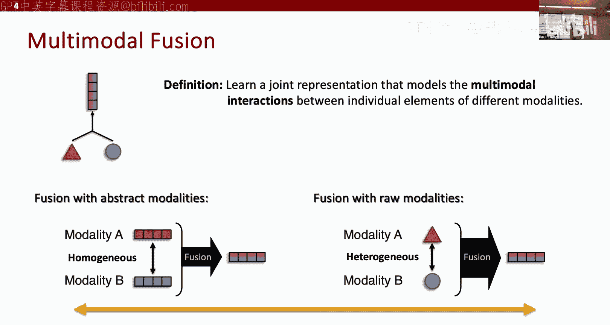

## 融合的定义与目标 🎯

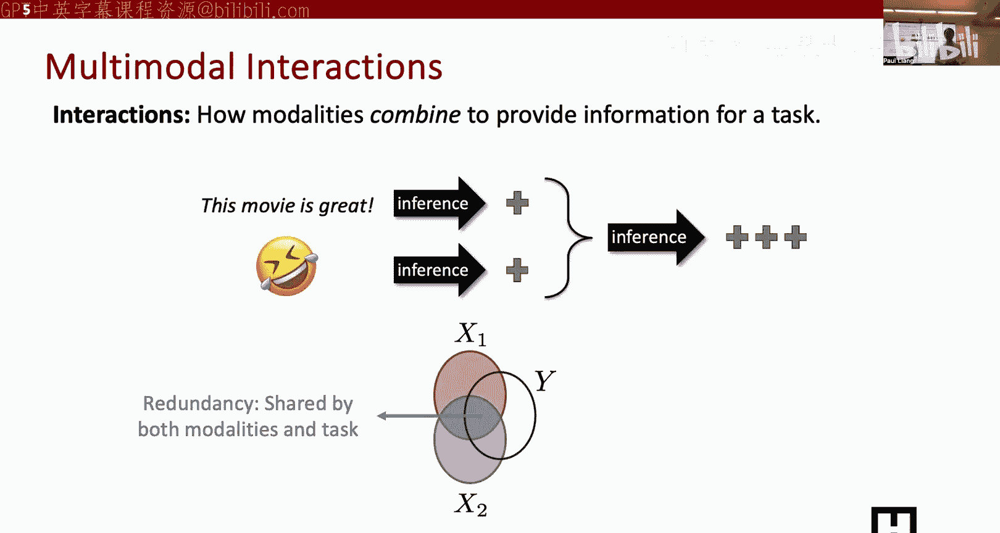

多模态融合的一般定义是：给定两个或多个模态，学习一个能够捕捉这些模态如何交互、信息来自何处以及如何组合的联合表示。

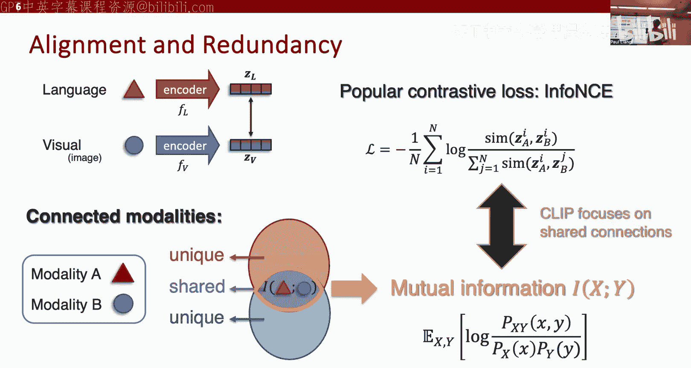

我们可以将融合视为一个光谱。光谱的一端是：首先使用预训练模型从原始数据中提取抽象特征，然后在特征层面进行较简单的融合。由于特征处于表示空间中，它们本质上更相似，因此融合需要做的工作较少。

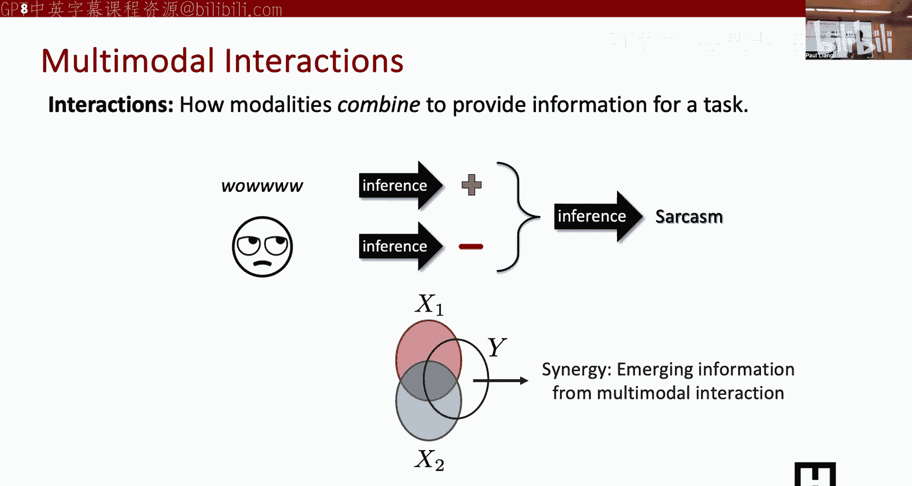

光谱的另一端是：直接从原始数据开始融合。这些原始数据模态彼此之间可能差异更大（异质性更高），因此融合模型需要做更多的工作来整合它们。

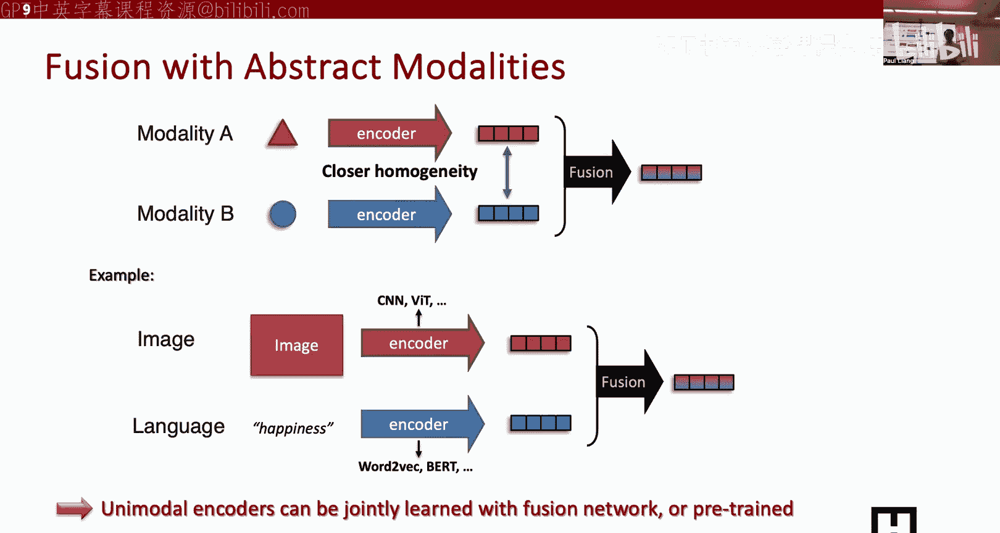

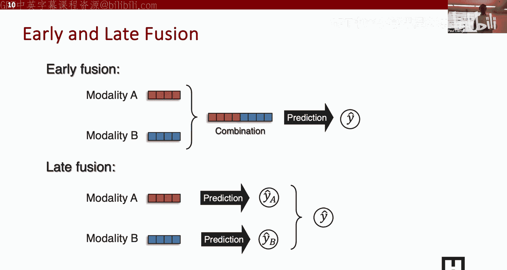

融合的整体目标是捕捉模态之间的交互。回顾上一讲，我们将“多模态交互”作为使多模态数据独特的三个关键原则之一。我们讨论了三种交互类型：
1.  **冗余**：模态间存在共同信息。
2.  **独特性**：信息仅存在于某一模态中。
3.  **协同性**：信息并非单独存在于任一模态，而是在融合后才显现。

基于对比学习的对齐方法本质上捕捉的是模态间的冗余（共同）信息。因此，我们需要其他融合方法来更好地捕捉独特性和协同性信息。

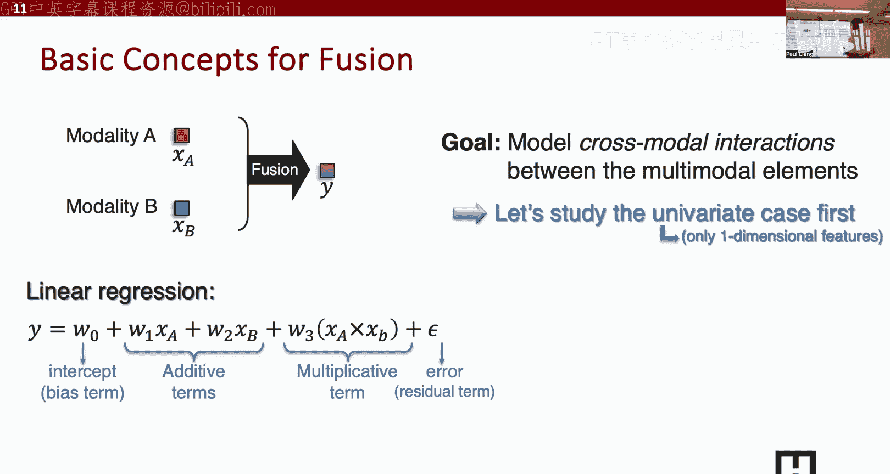

## 融合方法谱系 📊

以下是不同融合策略的概述：

*   **晚期融合**：先分别从各模态做出预测，再组合预测结果。例如，集成方法或多数投票。
    *   `最终预测 = 组合函数(模型A的预测， 模型B的预测)`
*   **早期融合**：尽早将原始数据组合，然后让模型自行学习如何融合。
    *   `融合特征 = 融合模型(拼接(原始数据A， 原始数据B))`
*   **基于特征的融合**：先提取抽象特征，再进行融合。这是介于早期和晚期融合之间的常见策略。

## 从简单到复杂：融合的数学基础 ➕➗

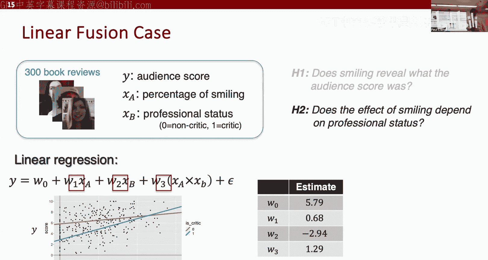

我们从最简单的一维案例开始，介绍融合的核心思想：建模跨模态交互。

假设有两个一维模态特征 `X_A` 和 `X_B`，要预测标签 `Y`。一个基础的线性回归模型如下：

`Y = w_0 + w_1 * X_A + w_2 * X_B`

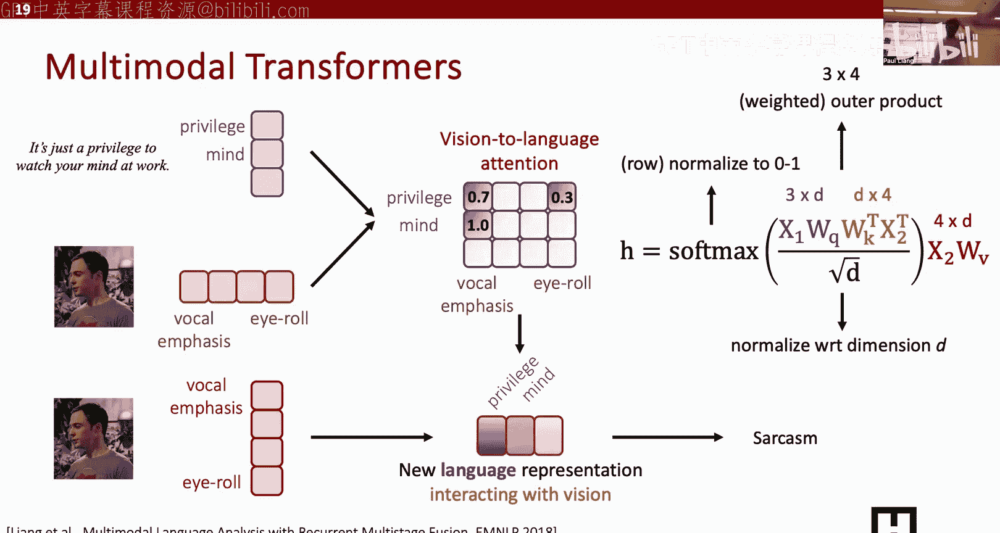

这只是一个**加性模型**，每个模态独立贡献。为了捕捉交互，我们引入**乘性交互项**：

`Y = w_0 + w_1 * X_A + w_2 * X_B + w_3 * (X_A * X_B)`

这里的 `w_3 * (X_A * X_B)` 项使得 `X_A` 对 `Y` 的影响依赖于 `X_B` 的值（反之亦然），从而能够建模更复杂的依赖关系。

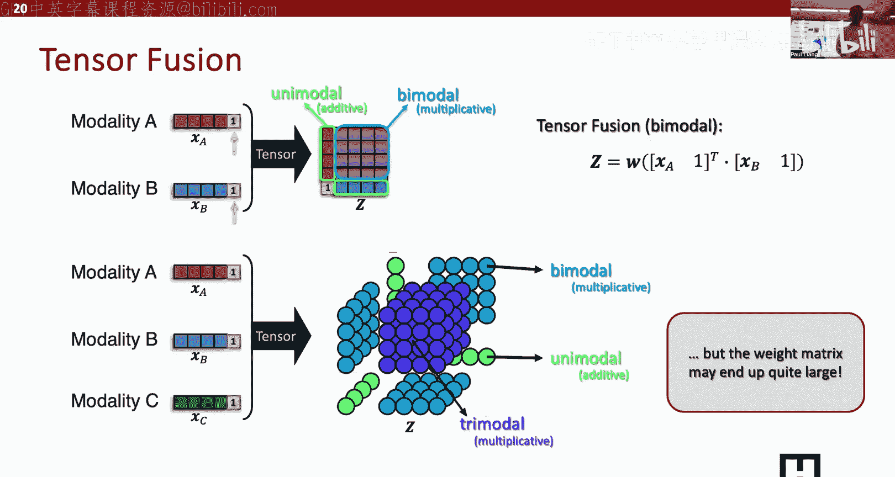

### 扩展到高维与双线性融合

对于高维特征向量，我们可以推广乘性交互。一种常见方法是**元素积**：
`Z = X_A ⊙ X_B` （其中 `⊙` 表示逐元素相乘）

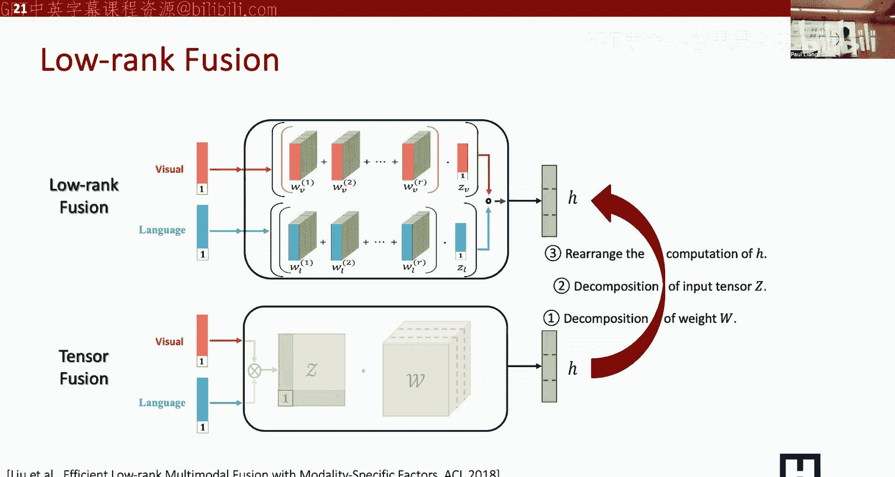

更强大的方法是**双线性融合**，它计算所有特征对之间的交互：
`Z = X_A^T * W * X_B` 或等价于 `M = X_A ⊗ X_B` （外积，得到一个矩阵）

这会产生一个矩阵 `M`，其元素 `M[i,j] = X_A[i] * X_B[j]`，捕获了所有可能的成对交互。现代**多模态Transformer**中的注意力机制就深受此思想启发，它计算一个模态序列中每个元素与另一模态序列中每个元素的相似度权重。

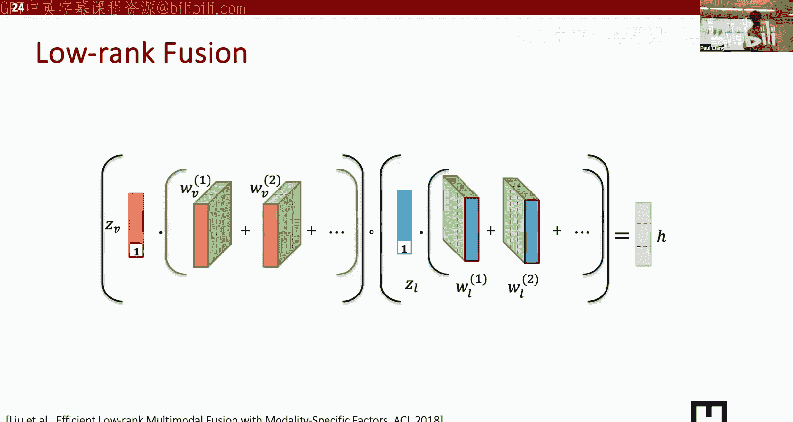

### 高效融合：低秩近似

双线性融合或Transformer的全注意力计算量可能很大。为了提升效率，可以使用**低秩近似**技术。其核心思想是，大的权重矩阵或张量通常可以用几个小矩阵的组合来近似。

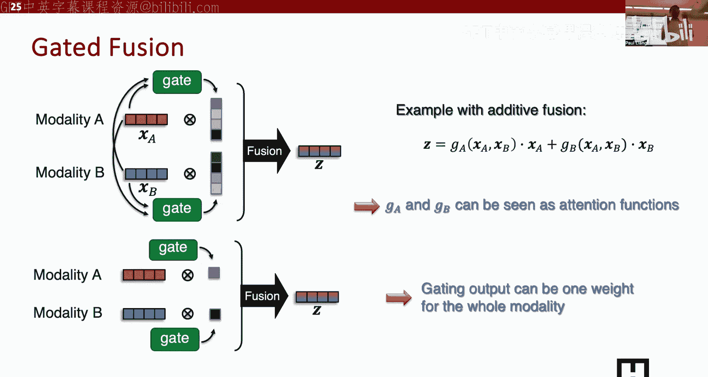

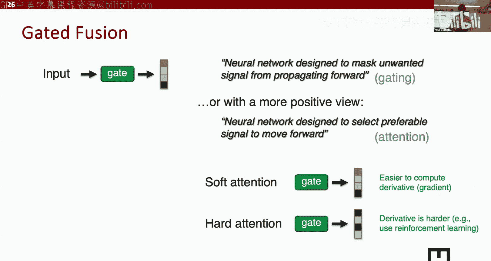

例如，一个大权重矩阵 `W` 可以近似分解为：`W ≈ U * V^T`
其中 `U` 和 `V` 是低秩矩阵。这显著减少了参数量，是当前微调大语言模型（LoRA等技术）和多模态学习中常用的策略。

## 动态与门控融合 ⚙️

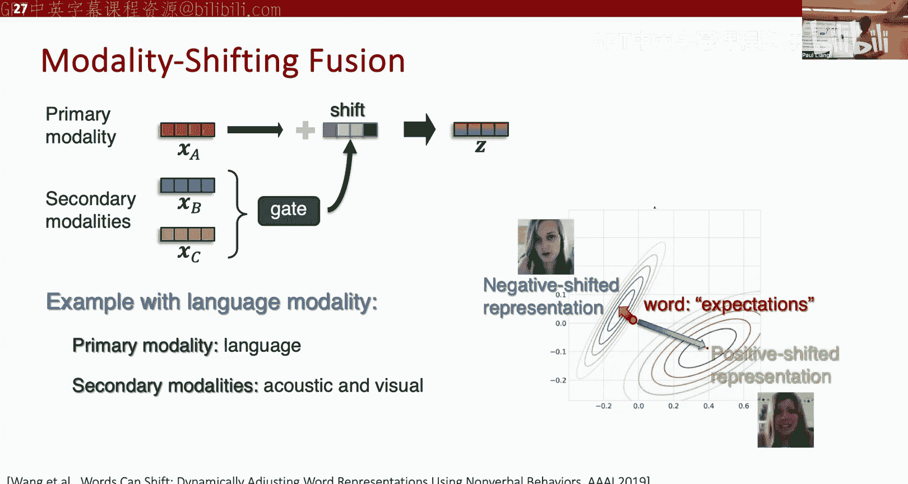

前述方法的融合权重是静态的。**动态**或**门控**融合则让权重根据输入数据本身动态变化。

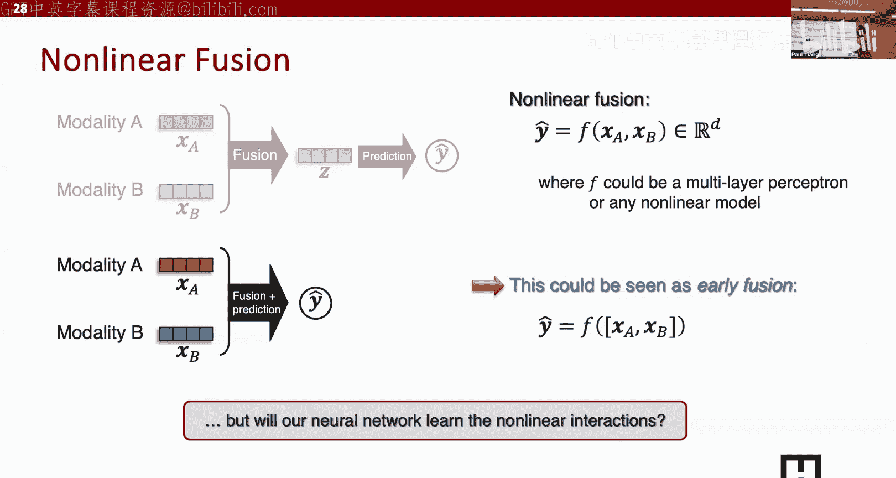

例如，融合权重可以是输入的函数：`Y = g(X_A, X_B) * X_A + h(X_A, X_B) * X_B`
这里 `g()` 和 `h()` 是网络学习的函数（如注意力机制），它们像“门”一样控制着每个模态特征的通过程度。这使模型能根据当前输入，自适应地关注更相关的模态信息。

### 处理模态不对称性

在某些任务中，模态的重要性不同（如语言为主，视觉为辅）。我们可以设计**非对称融合**，让次要模态以调制或补充的方式影响主要模态的表示，而不是平等对称地融合。

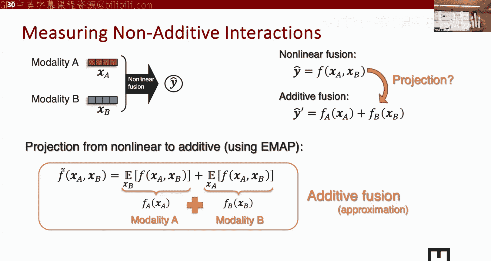

## 挑战：模型真的学到了交互吗？🤔

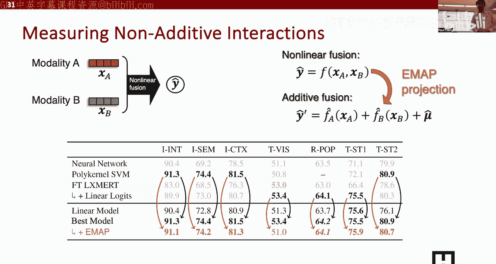

即使我们设计了复杂的融合架构，一个关键问题是：模型是否真的学到了有意义的非线性交互（协同性），还是仅仅学会了使用各模态独立的（加性）信息？

一篇重要论文提出了分析方法：给定一个训练好的复杂融合模型 `F(X_A, X_B)`，寻找一个最优的**纯加性模型** `G(X_A, X_B) = F_A(X_A) + F_B(X_B)` 来近似它。研究发现，在某些数据集上，即使将复杂模型替换为其最优加性近似，性能下降也非常小（例如仅0.2%）。这表明，有些复杂模型可能主要依赖加性交互，并未充分挖掘协同性。

### 分阶段融合策略

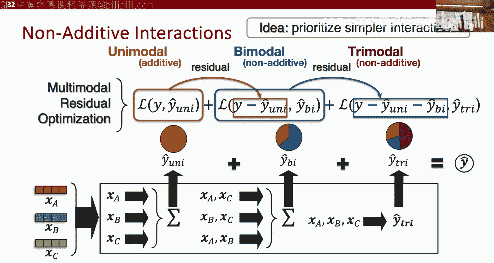

为了鼓励模型学习协同交互，可以采用**分阶段残差优化**策略：
1.  首先训练一个仅使用各模态独立信息的加性模型，预测 `Y_uni`。
2.  计算残差 `R1 = Y - Y_uni`。
3.  然后训练一个模型（可包含成对乘性交互）来拟合这个残差 `R1`，预测 `Y_bi`。
4.  计算新的残差 `R2 = R1 - Y_bi`，并用更复杂的模型（如三阶交互）去拟合。
这种方法确保每一阶段都致力于解决前一阶段未捕获的信息，理论上能更好地学习层次化交互。

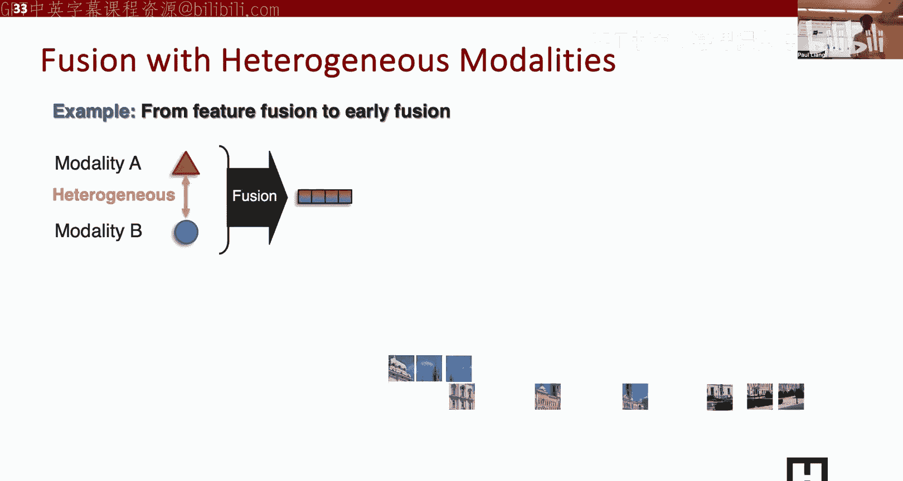

## 现代方法：基于Transformer的融合 🤖

当前主流的多模态融合模型常基于Transformer架构。它将文本视为词序列，图像切分为块序列，通过位置编码后输入Transformer编码器。Transformer的自注意力机制天然适用于建模序列内和跨序列（模态）的成对交互。

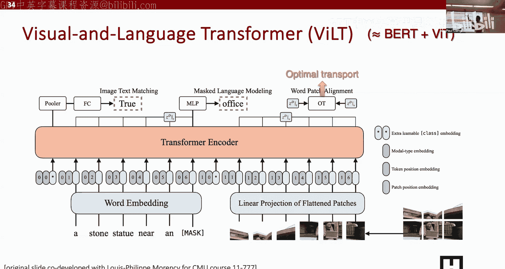

值得注意的是，许多现代模型（如CLIP、ALBEF）**同时进行对齐和融合**：
*   **对齐目标**：通常使用对比学习损失，在全局（如图片-描述）或局部（如词-图像块）层面拉近正样本对，推开负样本对。
*   **融合架构**：使用Transformer编码器对跨模态特征进行深层交互。
这种联合训练方式在富含冗余信息的数据（如图像-标题对）上非常有效。但对于独特或协同信息占主导的任务，需警惕对比损失可能会丢弃这些非共享信息。

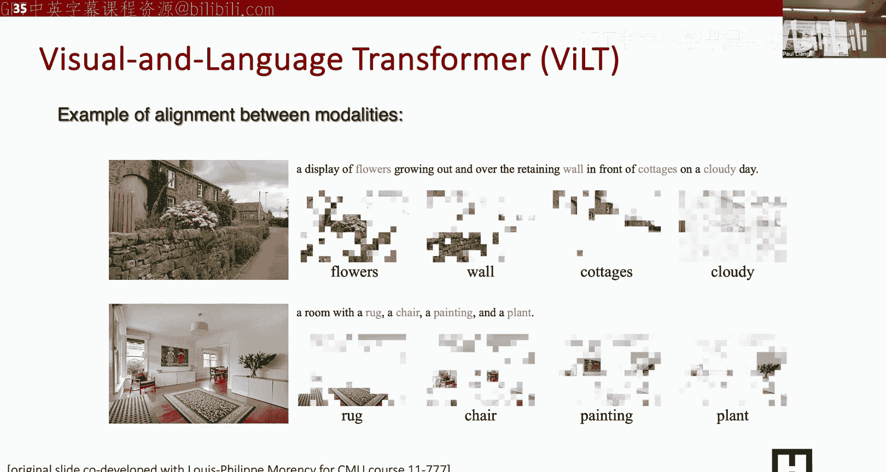

## 融合中的常见挑战与缓解策略 🚧

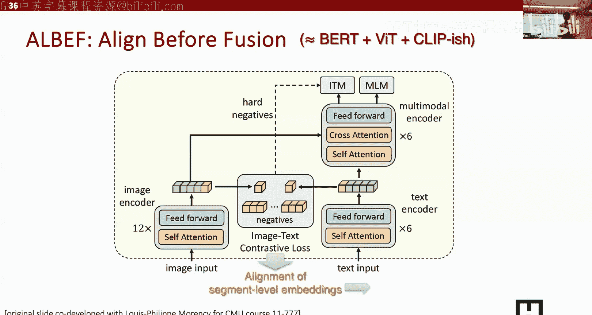

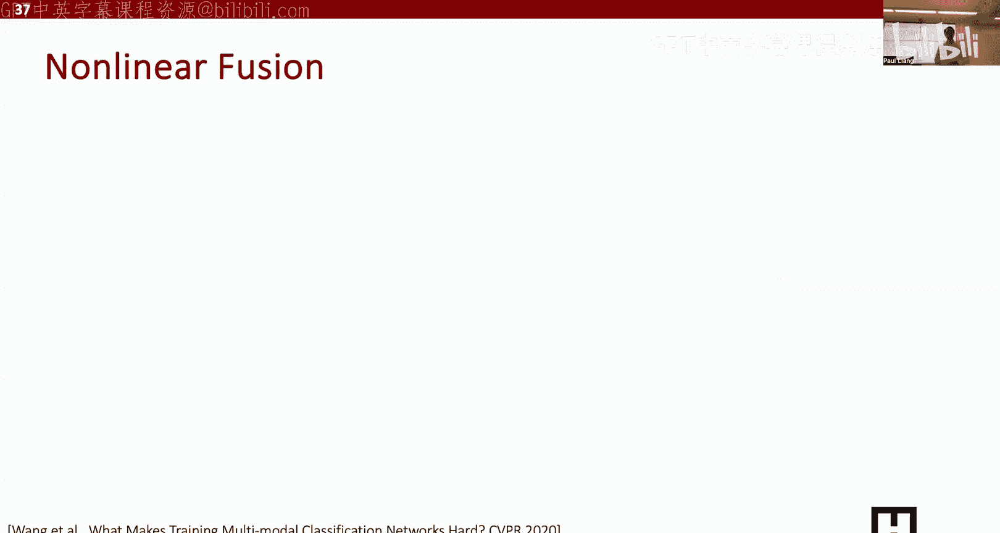

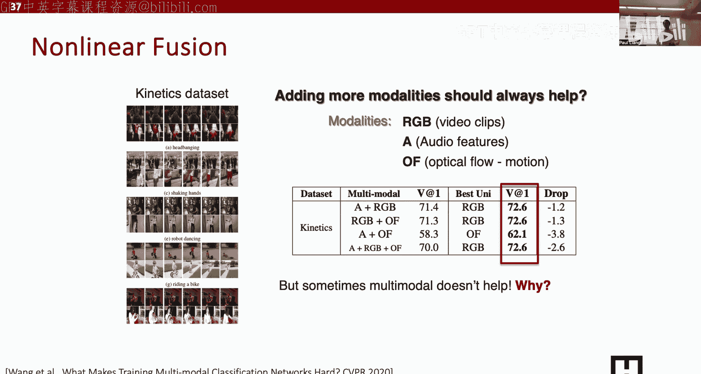

多模态融合并非总是有效，有时甚至不如单模态模型。主要挑战包括：

1.  **单模态偏差**：模型可能过度依赖某个容易学习的模态（如语言），而忽略其他模态（如图像）。例如，在VQA中，仅根据问题“香蕉是什么颜色？”就回答“黄色”，而不看图中实际的香蕉颜色。
    *   **缓解策略**：平衡数据集（如VQA 2.0），确保每个问题都有支持不同答案的图像；添加辅助训练目标，促使梯度流向所有模态。

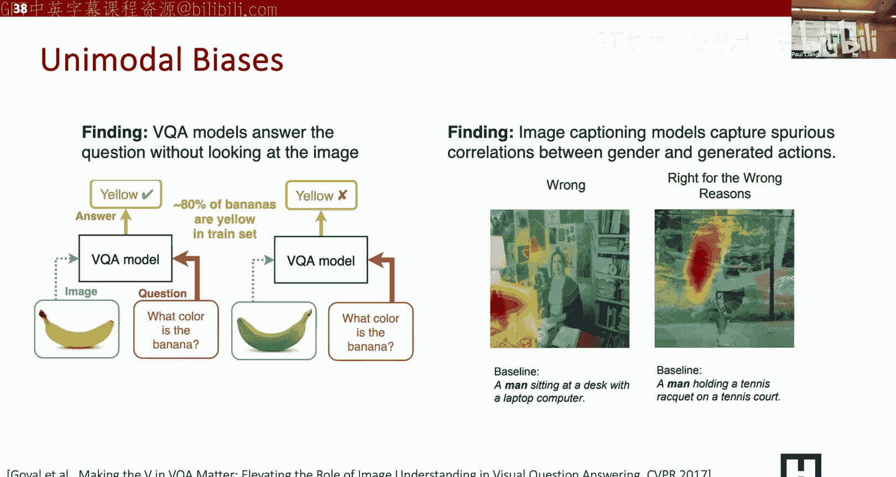

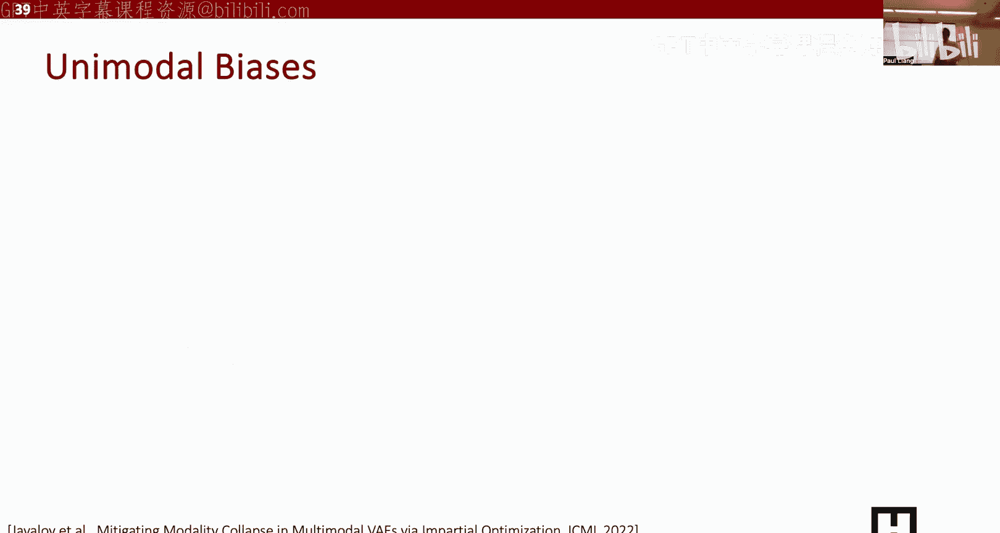

2.  **优化不平衡**：不同模态的学习速度和泛化能力不同，导致优化困难。
    *   **缓解策略**：采用**OGM-GE**等算法，在训练多模态模型的同时，监控各单模态模型的性能，动态调整多模态训练中各个模态的学习速率，以促进均衡学习。

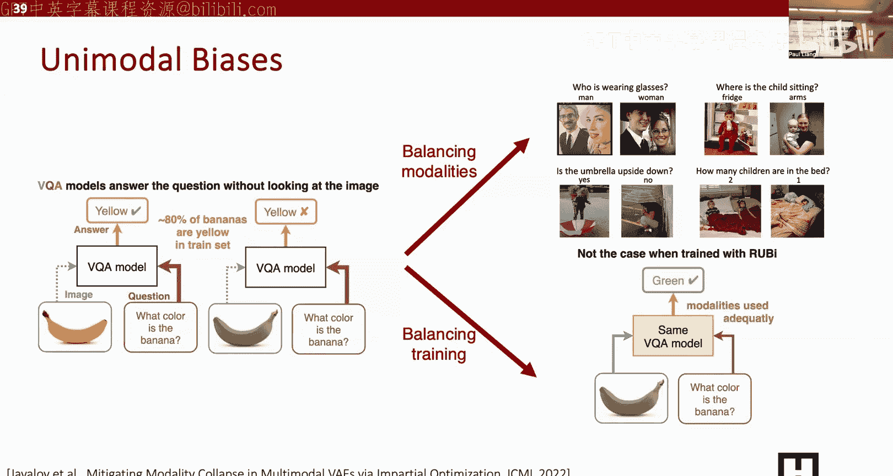

## 总结 📝

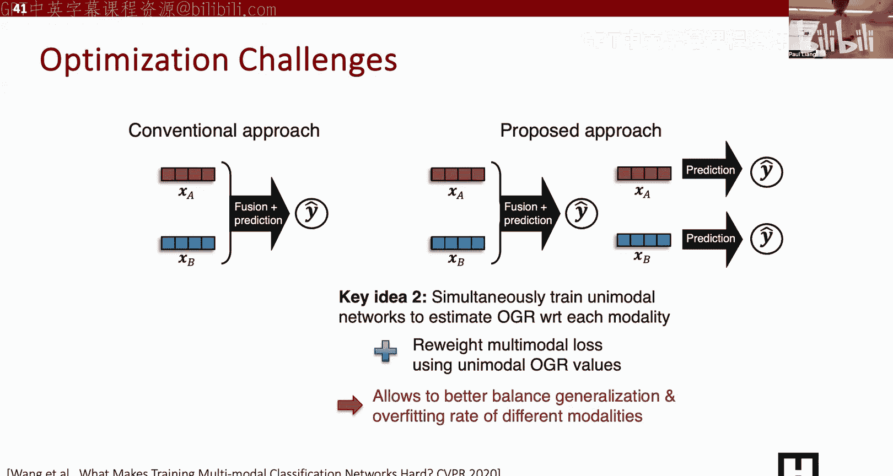

本节课中我们一起学习了多模态融合的核心概念与方法。我们了解到：

*   融合的目标是创建能捕捉冗余、独特和协同信息的联合表示。
*   融合方法构成一个光谱，从处理同构特征的简单晚期融合，到处理异构原始数据的复杂早期融合。
*   数学上，从加性交互到乘性交互（双线性、外积），再到更高效的低秩近似和动态门控机制，模型的表达能力逐渐增强。
*   我们需通过分析（如加性近似）和策略（如分阶段融合）来确保模型真正学到有价值的跨模态交互。
*   基于Transformer的架构是现代多模态融合的主流，常结合对齐目标进行训练。
*   实践中需注意单模态偏差和优化不平衡等挑战，并采用数据平衡、辅助损失、动态速率调整等策略来缓解。

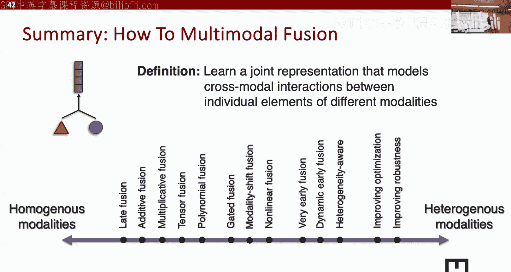

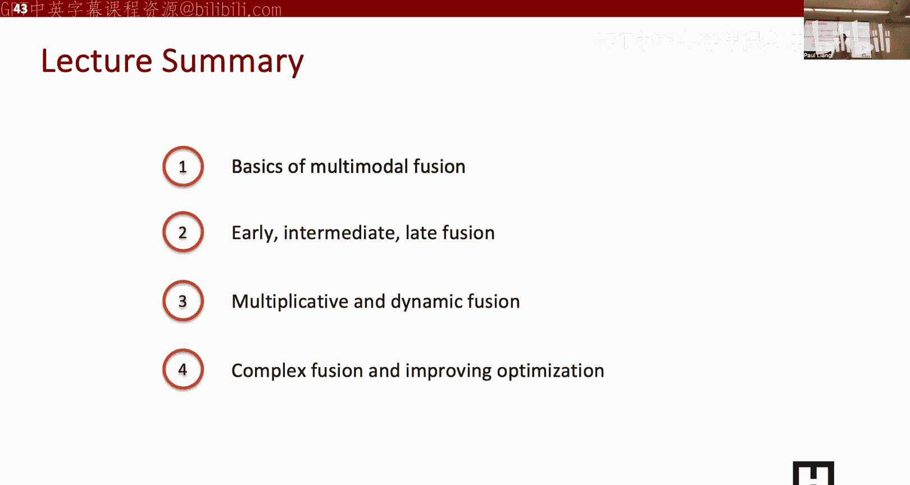

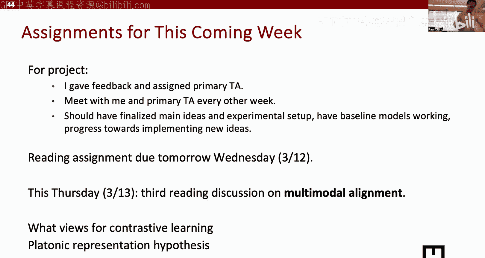

多模态融合是一个活跃的研究领域，拥有众多模型和技术。请根据你的项目需求，深入阅读相关的论文和参考文献。请继续推进项目，并记得完成阅读作业。