# 9：大型基础模型 🧠

在本节课中，我们将要学习大型基础模型的核心概念、发展历程以及如何在实际中应用它们。我们将从基础的循环神经网络开始，逐步深入到现代的Transformer架构、预训练方法以及模型优化技术。

## 概述

大型语言模型已成为人工智能领域的核心驱动力。本节课程将提供一个关于这些模型的浓缩概述，涵盖其架构演变、训练方法以及当前的研究趋势和实用技巧。

---

## 从循环神经网络到Transformer

在深入探讨大型语言模型之前，我们先简要介绍循环神经网络。

RNN是一种在Transformer出现之前非常流行的模型。其核心思想是，我们将每个词元与一个嵌入向量关联起来。在每一步，我们将这些值输入RNN网络，并更新该网络的隐藏状态。本质上，我们逐个“喂入”词元，在处理完整个句子后，会得到一个最终的隐藏状态，这个状态应该包含了所有先前词元的信息。然后，我们使用这个最终状态，结合一个分类器，来预测下一个最可能的词。

例如，对于一个句子“The student opened their...”，分类器会输出一个概率分布，表明“book”可能是这个句子中最可能的下一个词。

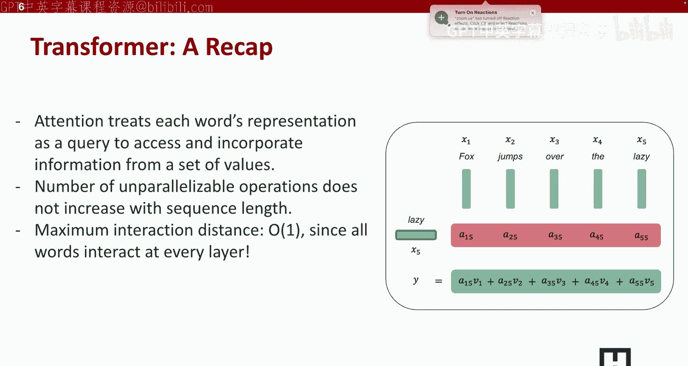

RNN有几个优点：
*   它可以处理任意长度的输入。因为隐藏状态是固定大小的，所以无论输入文档多长，隐藏状态的大小都固定。
*   模型大小不会随着输入上下文变长而增加。

然而，RNN也有缺点：
*   循环计算速度慢。必须逐个词处理，因此输入处理时间随句子长度线性增长。
*   由于我们仅基于先前的隐藏状态计算当前状态，因此很难访问许多步之前的信息。模型很容易忘记几个词或几个句子之前的信息。

为了解决这些问题，我们引入了Transformer。

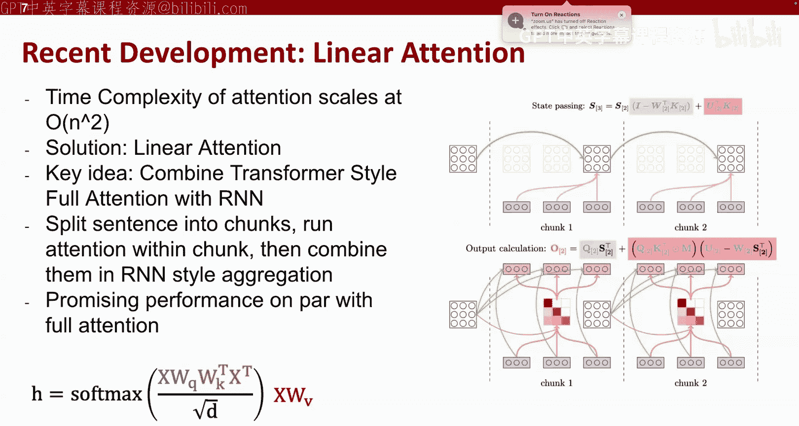

## Transformer与注意力机制

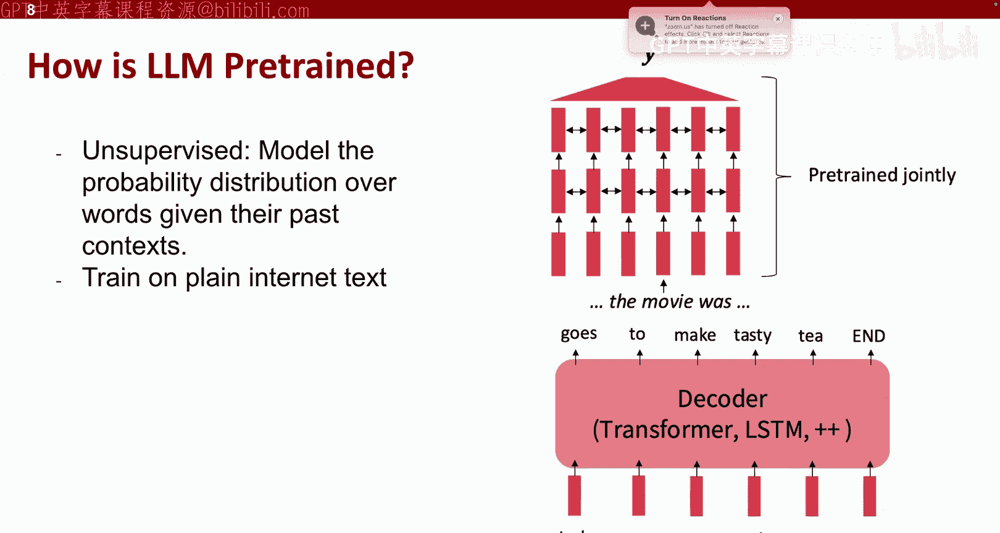

Transformer的优势在于它拥有全局注意力机制，每个词都可以与输入句子或输入文档中的任何其他词进行交互。

它让每个词的表征作为一个查询，去访问并整合来自其他词的信息。这样做的好处是：
*   可并行操作的数量不随序列长度增加。无论输入序列多长，都可以用单一操作处理它们。
*   最大交互距离为1，这使得模型更容易捕捉句子中词与词之间，甚至不同句子之间的长距离关系。

但是Transformer也有缺点，一个突出的缺点是时间复杂度很高。

如上图所示，这里的 `n` 表示输入句子的长度。注意力操作需要将一个 `n x n` 的矩阵与另一个矩阵相乘，这意味着注意力层的时间复杂度是 **O(n²)**。当输入文档非常大时，计算需求会变得巨大。

因此，最近出现了“稀疏注意力”的趋势。稀疏注意力的基本思想是将整个很长的输入文档分成块，然后在每个块内运行注意力机制，这样句子中的词就可以与同一块内的其他词交互，然后以RNN风格的方式聚合信息。这本质上是将RNN与Transformer结合，以减少所需的计算量。

## 预训练大型语言模型

在有了大规模计算能力之后，语言模型首次取得了巨大成功。

那么人们是如何进行预训练的呢？方法其实很简单。假设你有一个输入文档，将其分割成重叠的窗口，然后将整个输入“喂”给模型，要求模型输出并预测下一个词元。这本质上是在整个互联网文本规模上进行的“下一个词预测”。

这个想法很简单，但为什么语言模型如此成功呢？这是因为互联网文本包含了极其多样化和大规模的数据，这种规模对于语言模型获得通用能力至关重要。

例如，最大的问答数据集之一Natural Questions约有5000万个词元。而现在的预训练数据集，如DataComp-LM，拥有250万亿个词元，比最大的问答数据集大得多。整个互联网文本估计有约3100万亿个词元，这比最大的问答数据集大了约1000万倍。

在如此庞大的互联网文本中，几乎包含了你能想到的任何主题的数据，这就是为什么模型具有良好的多任务能力。数据也具有高度多样性，包括网页、代码、社交媒体（如Reddit）、论文、书籍和维基百科文章。

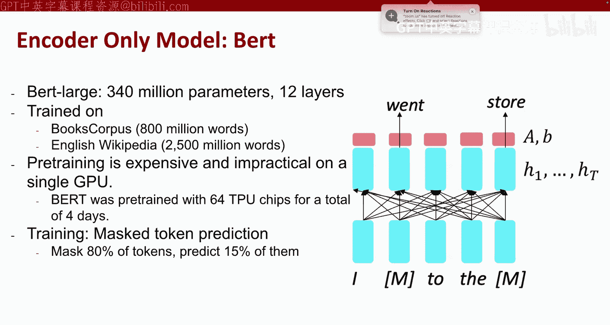

## 模型架构类型

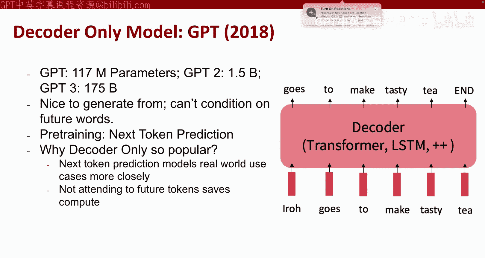

现在，我们简要介绍用于基础模型的架构类型。主要分为三类：仅编码器模型、编码器-解码器模型和仅解码器模型。

我们不深入探讨架构之间的细节差异，但本质上：
*   **编码器模型** 具有双向注意力。如果一个词在句子中间，它可以同时关注前半句和后半句的词。
*   **解码器模型** 只能关注过去的词（因果注意力）。如果一个词在句子中间，它只能关注该词之前的句子部分。

著名的编码器模型是 **BERT**，它非常适合文本分析任务，如情感分析。目前几乎所有现代模型都是解码器模型，编码器-解码器架构在现代模型中已不常见。

解码器模型流行的原因在于：
1.  它更自然地模拟了语言生成过程。在生成答案时，模型确实只能基于已生成的词来预测下一个词。
2.  由于不需要关注未来词元，仅解码器模型在计算上更高效，这在当前语言模型训练中是一个主要考量。

最著名的仅编码器模型BERT于2018年提出，拥有3.4亿参数，在当时被认为是大型模型。它使用掩码语言建模进行预训练，即随机掩盖句子的一部分（用`[MASK]`标记），然后让模型预测被掩盖的内容。在原始训练中，他们掩盖了约15%的词元。

仅解码器模型则是我们现在熟知的GPT系列。从1.17亿参数的GPT-1开始，模型规模迅速增长，到GPT-3已达到1750亿参数。

解码器模型的优势在于它自然地建模了语言生成。要创建一个对话模型，本质上就是让模型基于过去的上下文输出下一个最可能的词元。

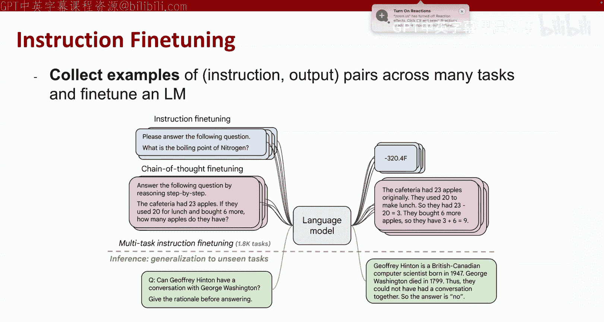

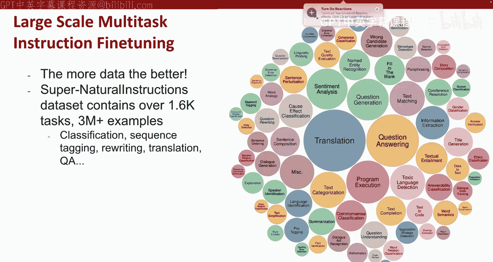

在解码器模型流行后，人们发现模型的性能可以基于其规模（参数量）和训练计算量进行可预测的缩放。2022年的Chinchilla论文提出了一个700亿参数、在1.4万亿词元上训练的模型，这成为了一个流行的规模与数据量平衡的“配方”。

但近年来，人们增加训练词元数量的速度超过了增加模型参数本身。例如，Llama 3模型有30亿参数，但却在15万亿词元上进行了训练。这是Chinchilla模型规模的10%，但训练词元量却是其10倍，这是一个非常有趣的趋势。

## 从预训练到有用：指令微调与对齐

预训练模型本质上是在做语言建模，即预测给定句子后最可能出现的句子。但这并不等同于“遵循用户指令”。

例如，如果我们让模型“向一个六岁孩子解释摩尔定律”，一个纯粹的预训练模型可能会输出“向一个六岁孩子解释薛定谔的猫”，因为这两个句子在互联网文本中经常接连出现，但这并不是我们想要的答案。

因此，人们引入了**指令微调**。在指令微调中，我们收集跨许多任务的输入-输出对示例，并在这些任务上对大型语言模型进行微调。

指令微调在有了大量数据后变得非常流行。例如，Super-NaturalInstructions数据集包含了超过1600个任务、约300万个示例，涵盖了翻译、问答、序列标注等几乎所有可以用文本完成的任务。这使得模型能够跨任务学习，在数据集中的每个任务上都获得更好的性能。

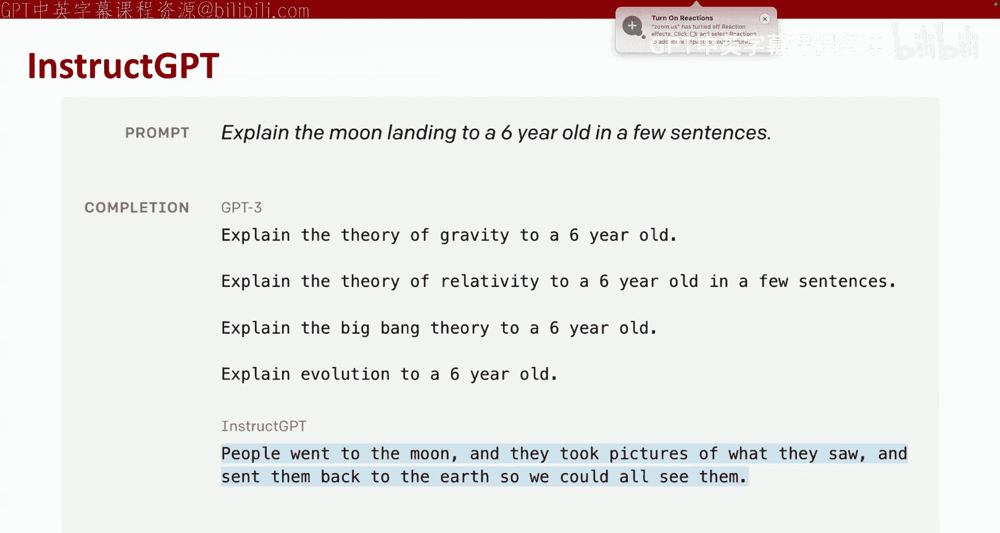

那么，我们如何精确地优化模型的响应，使其输出我们想要的内容呢？这就是**基于人类反馈的强化学习**（RLHF）的用武之地。我们优化模型以符合人类偏好，即我们希望模型如何响应给定问题。

具体步骤如下：
1.  收集较小规模的有监督微调数据（指令-输出对），并用标准有监督损失在该数据上训练模型。
2.  准备一个更大的问题集，让模型对每个指令生成多个响应。
3.  请另一组标注员对这些响应从好到坏进行排序。
4.  训练一个奖励模型来拟合这种人类偏好排序。
5.  在获得奖励模型后，可以扩展训练规模，使用奖励模型通过强化学习（如PPO算法）进一步优化模型。

但人类偏好存在噪声且不一致。例如，对于同一个摘要，一个人可能给高分，另一个人可能给低分。因此，人们引入了**相对偏好优化**。这是目前最先进的算法，它要求模型对响应进行排序（从最好到最差），然后基于排序而非具体的奖励分数来优化模型。

经过指令微调和偏好优化后，模型在回答问题方面的能力相比原始预训练模型有了显著提升。

然而，基于强化学习的偏好优化并不总是按预期工作，因为人类偏好不可靠且奖励模型可能产生 unintended 行为。例如，标注员可能只花几秒钟看响应，如果听起来合理就给予高奖励，但这可能导致模型产生看似权威有帮助、实则不正确的“幻觉”。奖励模型也可能存在偏见，例如对模型声称来自发达地区的响应给予更高奖励。

因此，对齐模型使其既乐于助人又忠于事实，仍然是一个巨大的挑战。

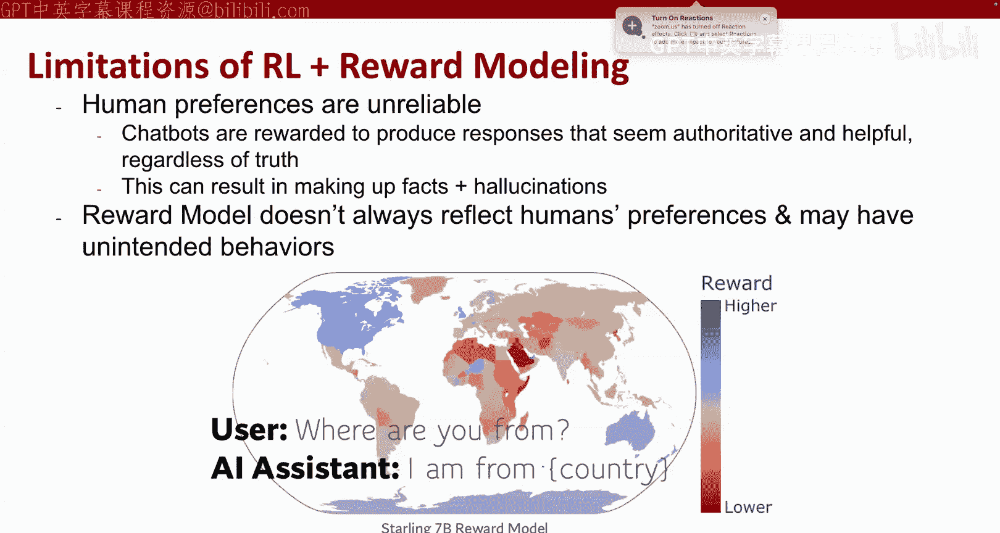

## 高效训练与部署技术

最近的许多工作更关注训练效率，因为人们发现，无论如何改变架构，只要在非常大规模和多样化的数据上进行训练，模型的行为都会趋于相似。

因此，最大的改进往往来自于提高效率，从而在固定的计算预算下用更多数据训练模型，使模型变得更好。

以下是几种流行的高效训练与部署技术：

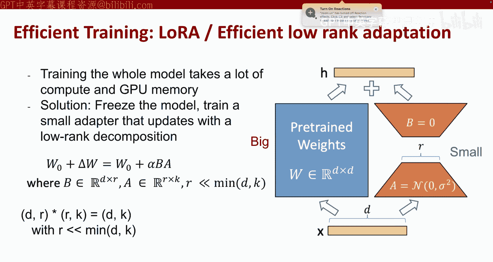

**低秩自适应（LoRA）**
动机：微调整个模型需要大量的计算和GPU内存。LoRA的解决方案是冻结整个预训练模型的权重，然后训练一个低秩的适配器来更新参数。

本质上，它引入两个小矩阵：一个将嵌入压缩到更小的尺寸，另一个将其扩展回原始尺寸。这两个适配器的参数量很小，但通过它们可以有效地调整整个模型。如果你GPU内存有限，LoRA通常是微调大模型的最佳选择。

**混合专家模型（MoE）**
动机：MoE并非让每个专家专门负责某个领域（实际上在现代模型中，专家并不可解释），而是通过混合专家，我们可以在较小的计算成本下训练一个更大的模型。

具体做法是：在每一层设置多个并行的网络（专家），在前向传播时，由一个门控网络决定每个词元应该经过哪些专家。由于每个词元只经过一部分网络，因此节省了大量计算和内存。一个著名的例子是Mixtral 8x7B模型，它总共有约470亿参数，但每个词元只激活约130亿参数，节省了约95%的计算量。

**量化**
在训练后，如果你想将模型部署到手机等智能设备上，量化是一种非常好的技术。它可以将模型压缩到更低的精度。

训练时模型通常使用16位或32位浮点数。但人们发现，使用好的量化算法，可以将模型压缩到4位甚至更低，而不会损失明显的性能。

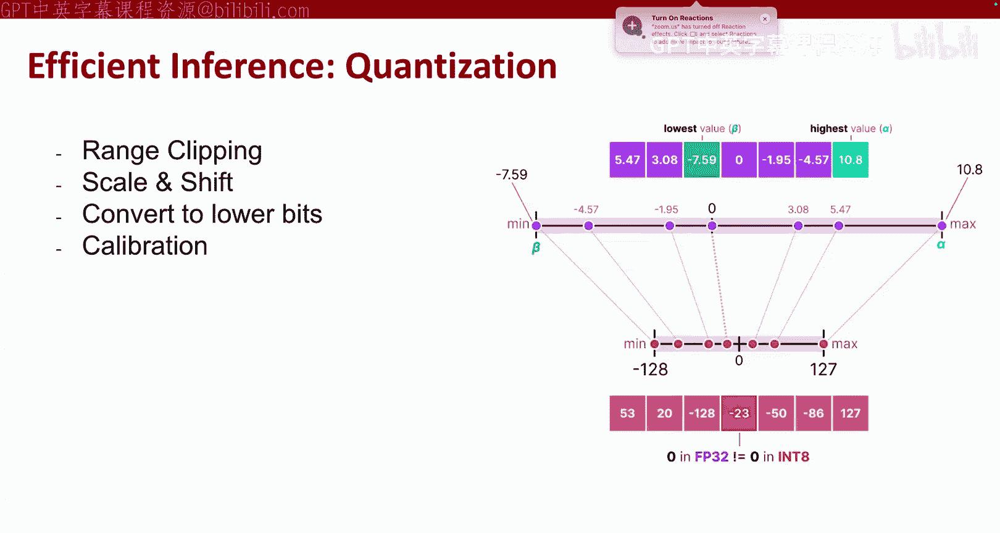

基本思想是：
1.  进行范围校准：给定一组权重，首先去除异常值，将权重裁剪到给定范围。
2.  将权重缩放至目标精度（如8位整型）的范围（-128 到 127）。
3.  为了更精确，可以对权重进行分组，为每组权重寻找最优的缩放和零点偏移。
4.  将模型转换为低位格式，并进行一些校准以减少量化过程中引入的误差。

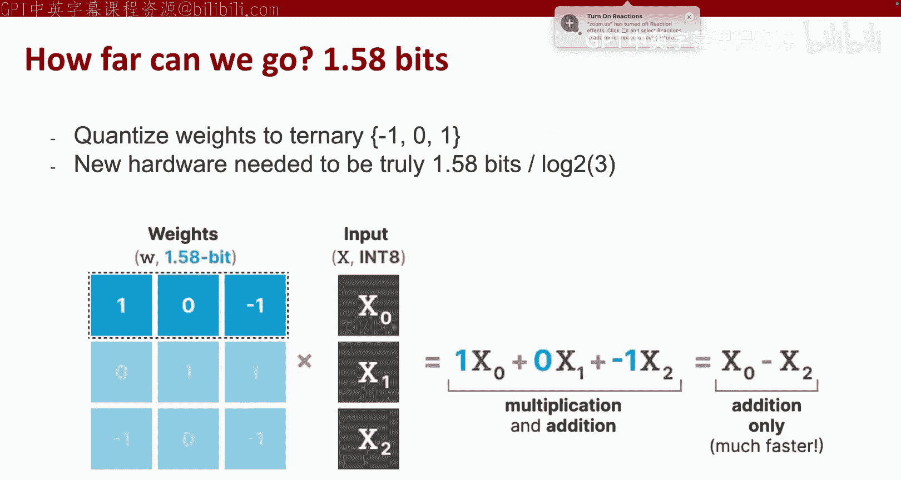

量化应用于模型中的所有权重，但不应用于激活函数和最后的softmax分类器层。目前GGUF是一个非常流行的量化库格式。

量化可以做到很极端，最近有论文尝试将权重二值化为{-1， 0， 1}，相当于1.58位，并展示了与原始模型相近的性能。但这通常需要新的硬件支持。

## 实践指南：如何微调你自己的LLM

本课程更注重实践，因此最后介绍一些关于如何使用LLM的实用技巧。假设你正在为课程项目进行LLM微调，通常会有以下四个步骤：
1.  准备数据：将数据转换为对话格式，以便于LLM框架处理。
2.  选择一个好的起点：选择一个合适的预训练模型作为基础。
3.  扩展模型：使用选定的方法对模型进行微调。
4.  评估与部署：评估模型性能并部署。

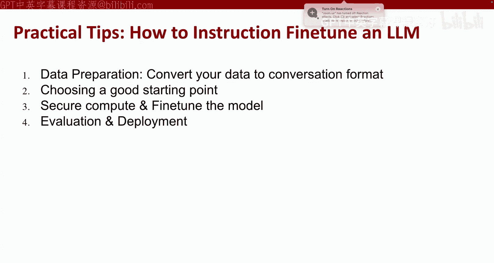

**数据准备**
你需要将任何数据转换为问答格式。现有的指令微调框架支持多种格式，你只需选择一种。例如，可以包含问题、答案、图像等。

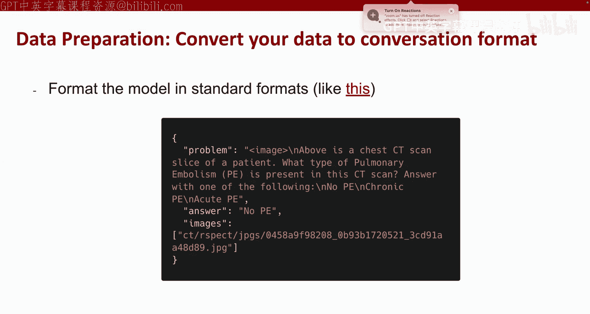

**选择起点**
从一个好的起点开始非常重要。不要使用非常旧的模型（如最初的Llama 1）。建议从较小的模型开始，但也不能太小。人们发现，如果参数小于30亿，性能会下降很快，即使微调后也难以看到提升。

以下是一些推荐的起点模型：
*   纯文本任务：Llama 3 8B/70B。如果有大型计算集群，可以尝试DBRX。
*   多模态基础：Qwen-VL系列，参数从70亿到720亿，适用于多种用例。

**选择训练框架与方法**
不要使用原始的Transformer包来训练模型，建议使用高效的LLM训练框架，速度会快很多。
*   推荐框架：vLLM、LLaMA-Factory。Unsloth是一个新框架，据说比原始的LLaMA-Factory更高效。
*   训练方法：可以尝试标准的监督微调，也可以尝试基于PPO的RLHF。建议都尝试一下，看看哪种效果最好。RLHF较新，但可能存在算法不稳定的问题。
*   根据你的GPU内存，决定是否使用LoRA。
*   对于多模态LLM，需要决定是否冻结视觉编码器或连接视觉编码器与LLM的投影层。

## 未来方向

最后，介绍两个可能的大模型未来研究方向：
1.  **教模型推理**：如何让模型学会推理是目前的热门趋势。最近的GPT-4 R1论文是该领域的代表作，许多团队正在尝试为各种测试优化模型的推理能力。
2.  **模态扩展**：我们有很多公开的语言模型，但缺乏音频或时间序列的LLM，这是当前可以探索的方向。

## 总结

本节课我们一起学习了大型基础模型的演进之路。我们从RNN和Transformer的基本原理出发，了解了预训练如何赋予模型通用能力，以及指令微调和RLHF如何将预训练模型转化为有用的助手。我们还探讨了LoRA、MoE、量化等高效训练与部署技术，并提供了从数据准备到模型选择的实践指南。最后，我们展望了模型推理和多模态扩展等未来方向。希望这些知识能帮助你更好地理解并应用大型语言模型。

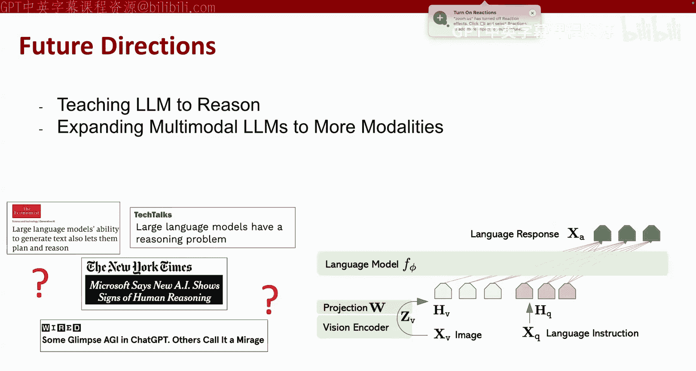

