# 11：强化学习与交互 🧠

在本节课中，我们将要学习强化学习的基础知识，了解其与监督学习的核心区别，并探索现代强化学习方法如何被用于对齐和提升大型语言模型的推理能力。课程最后，我们还将简要介绍强化学习在LLM智能体中的应用。

大家好，欢迎回来。我们必须马上开始，因为今天有很多内容要讲。

首先，学期即将结束。这意味着希望你们所有人的期末项目都取得了不错的进展。我们计划在本周四进行课堂展示，让大家简要概述一下期末项目。项目不需要最终完成，因为在周四的最终展示和下一个周二最终报告截止日期之间，你们还有大约12天的时间。之后我们会给所有报告评分，并将成绩提交给注册处。

所以，本周四将是期末项目展示。我也给大家一些概述性的指示。所有这些都发布在Piazza上了，但期望是你们的最终报告应包含8到9页的内容。两人小组是8页，三到四人小组是9页。

报告在这一点上应该总结你们在整个学期所做的一切。最重要的是，摘要、引言、问题动机及其重要性、相关工作。相关工作应按不同的方法类别进行组织，而不是按单篇论文，并强调你们的工作有何不同。严谨的问题陈述动机，形式化问题。当然，还有你们提出的方法，这应该是报告的主体，大约两页。可以是提出的新基准、新的AI方法、新的评估策略、模拟环境等，但这应该是最重要的部分。应该有一个很好的概览图来解释高层次上发生的一切。

实验方法、实验设置、数据集、基线。当然，你们应该有严谨的结果和讨论。基线的结果，你们方法的结果，理想情况下它效果更好，但你们知道我们不会根据它好多少来评分。如果更好，那很棒，你们仍然需要分析为什么你们认为你们的方法有改进。如果不如基线，也不用担心，但请包含一些分析，说明你们认为为什么会这样，以及未来可以采取哪些方向来改进。

最后是任何结论和未来方向。至于报告展示，将在本周四进行。每个项目的时间限制是8分钟，大约7到9张幻灯片。你们不必深入探讨问题和相关工作，它应该真正涵盖关键的新方法和你们已有的关键新实验的初步结果，以及你们计划在报告截止前12天内完成什么。所以，8分钟，7到9张幻灯片。我们会稍微延长一点时间，从下午1点到3点。但同样，如果有任何时间限制，请告诉我，我们会尝试将大家安排到合适的时间段。如果你们能在今天之前将限制条件发给我。

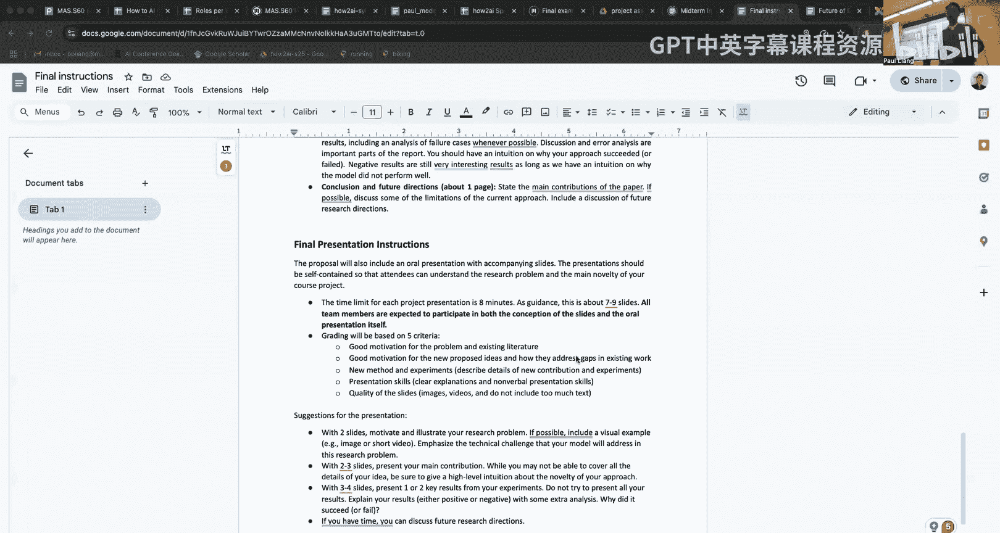

好的，关于期末项目流程有什么问题吗？

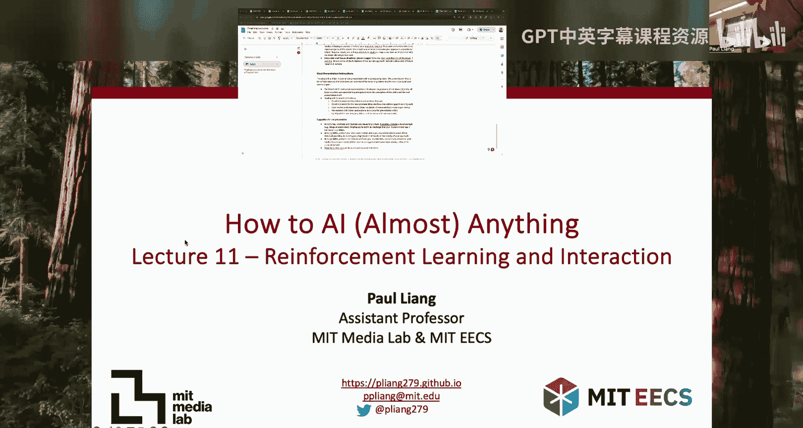

没有。好的。也请在今天下课后与我和助教们见面。我想我会从两点一直待到五六点，如果有人在周四之前想要反馈和讨论的话。周四我们也会在展示期间问一些问题，并给你们一些反馈，这样你们就能在5月20日之前完成一份扎实的最终报告。

好的。那么，回顾一下。学期即将结束，这门课涵盖了几个模块。我们从AI研究、数据和常见模型架构的基础开始。我们研究了多模态AI，对齐不同模态，使用它们并在模态之间传递信息。然后我们有几节关于LLM和大型多模态模型基础的讲座，以及一节关于生成式AI的客座讲座。所以今天的内容是扩散模型和流匹配模型，用于生成更多数据。本周和下周的最后两讲将涵盖更具交互性的AI。所以今天我们将介绍强化学习、推理和交互式AI，下周我们将介绍更多的人机交互、一些AI智能体，以及如何确保这些东西在世界上部署时是安全、合乎伦理的。

所以今天，基础RL。还有基础RL以及现代强化学习，以及它如何被用于对齐并使其他模型在推理方面变得更好。最后一部分，LLM智能体中的一些应用。

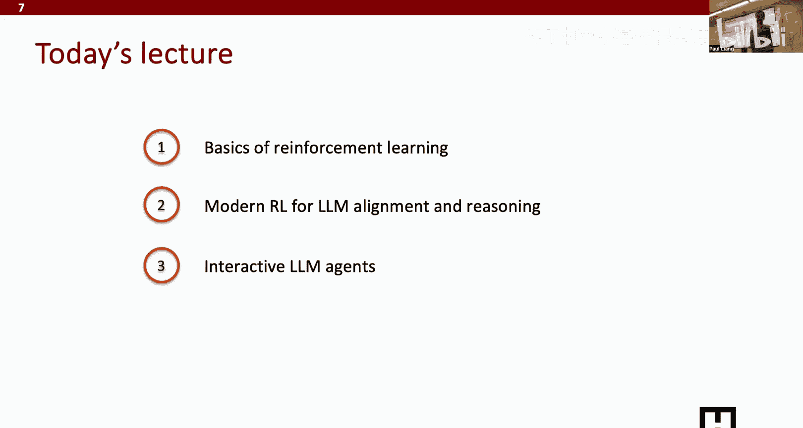

首先，RL基础。再次强调，目标不是要涵盖RL的所有深度，而只是为了理解今天所有的RL方法以及它们如何用于现代AI方法。

所以RL与非RL方法（监督学习）的最大区别在于RL是动态的。你们有处于某个环境中的智能体，它们不是像对一张图像进行分类那样只做一个预测，而是通常尝试采取一系列动作，环境然后给它们新的状态、环境中的新位置，在这种情况下它们可能会采取更多动作，整体上这种模式会持续下去。采取更多动作，与环境交互，进入新状态。目标方式是最大化智能体在该环境中的长期奖励。

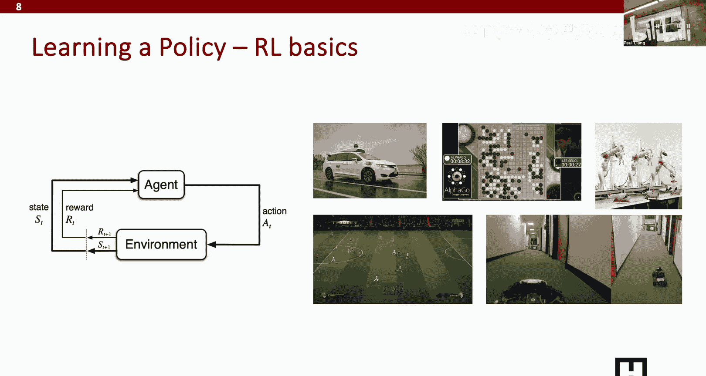

为了稍微形式化这一点，人们通常在MDPs（马尔可夫决策过程）的背景下讨论RL。这本质上是形式化以下事实的一种方式：存在一组状态。这可以是位置，如果是机器人导航的话。如今，人们也可以将状态视为语言模型生成的词语。所以状态是查看你当前在世界上拥有的数据的一种方式。

有一组动作，这些是动作，模型可以做的事情。如果是机器人，可以是上下左右移动。如果是语言模型，可以是它可能生成的输出词语集合，一组核心动作。

通常有一个转移函数，告诉你从一个状态出发，如果我采取一个动作，我会进入哪个下一个状态。有时是确定性的，如果机器人向右移动，它总是会到达右边。有时环境中也可能存在一些随机性。

同样非常重要的是奖励函数。所以如果我处于特定状态并采取某些动作，我会得到什么奖励。同样，这可能是你是否成功完成了任务，可能是对花费太多时间或太多资源完成任务的惩罚，也可能是用户对交互的满意程度，所有这些都是可能的奖励函数。

当然，还有其他东西，比如你开始的状态、折扣因子（这实际上对于确保这些RL方法收敛非常重要），本质上是告诉你现在拥有的奖励比未来的奖励更有价值，所以你应该尝试最大化你能得到的东西。而范围通常是智能体与环境交互的总步数。

当这个智能体在不同状态周围移动、采取不同动作并观察到不同奖励时，有几个关键事项需要关注。

首先是回报这个概念。意思是我不想仅仅训练一个动作来获得这个即时状态的最大奖励。我希望能够最大化我在交互中获得的所有奖励的累积长期总和。所以会有下一个时间步T+1的奖励，加上γ乘以时间步T+2的奖励，等等。γ是折扣因子，基本上模拟了即时奖励（比如你现在拥有的钱）比未来可能获得的奖励（未来的钱）更有价值。你会一直加到交互结束。

所以这是关键所在，不仅仅是最大化即时奖励，而是最大化未来所有奖励的总和。当然，在很多情况下，即时奖励并不好，但未来有更好的奖励需要尝试优化。

这就是RL的整体目标：最大化长期奖励。

你试图通过学习一个策略来最大化这个长期奖励。策略是一种花哨的说法，表示无论我当前处于什么状态，我应该采取的动作分布是什么。所以机器人在这里，它应该向上或向前移动。如果语言模型生成了这些词，你应该输出那些其他词。所以，给定当前状态，你应该采取的动作分布。我再次说分布，是因为有时你的策略是确定性的，所以你在特定状态下总是向前移动。有时拥有随机策略也很有帮助，比如现在的LLM都有一些温度参数，所以它们生成的下一个动作或下一个词存在一些随机性。

如前所述，目标确实是找到最佳策略，即从每个状态出发，我应该采取的最佳下一个动作分布，以最大化长期累积奖励，也就是你得到的下一个奖励，以及未来的其他奖励。

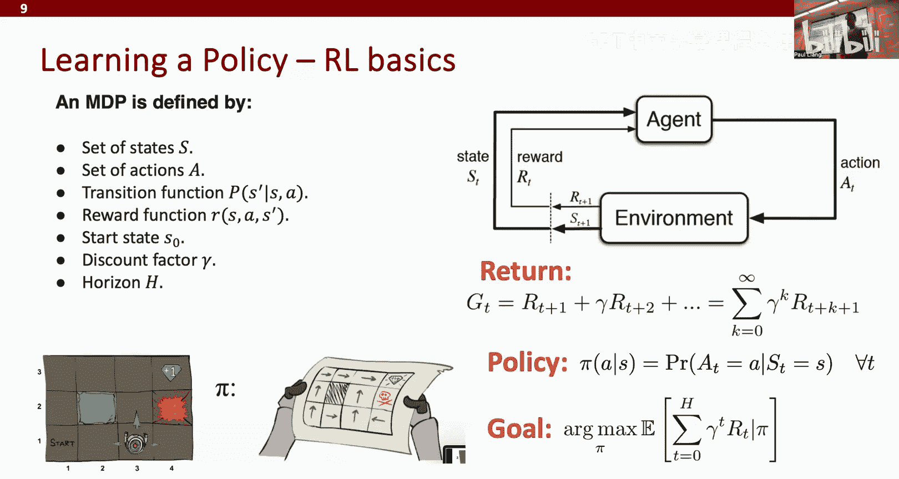

所以从概念上讲，RL与监督学习有几个关键区别。RL涉及做出一系列决策，这个序列可以任意长，而监督学习只做一步决策。

在RL中，你试图最大化一系列决策产生的累积奖励，而在监督学习中，你只最大化即时奖励。在RL中，有时你还会遇到奖励非常稀疏的问题。你可能交互了很长的序列，但只在1000步之后才得到一个奖励，也许是在LLM和人类对话了1000个词之后，你才得到一个奖励。这使得RL天生具有挑战性。但在监督学习中，你总是得到密集的奖励。你知道标签是什么。

在RL中，环境可能是未知的。总是存在探索问题。设计机器人或自动驾驶汽车时，你无法规划出自动驾驶汽车将要行驶的每一条道路或机器人将要前往的每一个地方。需要对环境进行一些探索，这又增加了一层难度。而在监督学习中，通常你知道要预测的可能事物是什么，你知道可能的输入是什么。

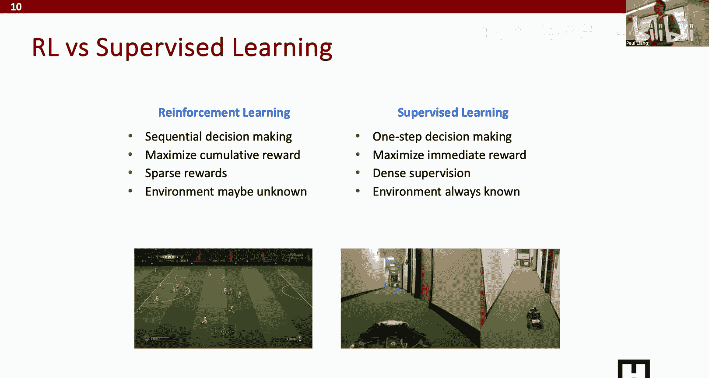

话虽如此，监督学习方法在RL中有一个非常简单的应用，叫做模仿学习。想象一个例子，你想训练一个策略来导航自动驾驶汽车。所以状态就是你从挡风玻璃上看到的东西，动作就是你应该如何转动方向盘。简单来说，输入状态是你看到的，动作是转动方向盘。

当然，你可以做的是，让人类专家长时间驾驶汽车，并使用这些数据，这些数据将是人类看到的状态序列、人类采取的动作、人类看到的下一个状态、人类采取的下一个动作。所以你可以得到我们所谓的专家轨迹，即擅长执行此任务的专家驾驶员的数据。

然后你基本上可以只做监督学习。通过学习一个函数，该函数接收这些人类专家数据中收集到的任何状态（这是你的输入S），你只是重现人类所做的，并预测动作。

所以这可以是一个简单的分类模型。这被称为模仿学习，它是强化学习的一个例子，但你也可以看到它失败的情况，有几个主要原因。

首先，最大的问题是分布不匹配。如果你看到人类专家驾驶员，他们当然会开得很好，他们会在应该停车的时候转弯和停车，并遵循其他道路规则，因此你的模型只有在处于正确路径上时才知道何时采取正确的动作。

但在你的模型意外走上错误路径的情况下，那么你将无法恢复，因为它从未见过人类专家如何从意外未在停车标志处停车或意外偏离道路的情况下恢复的例子。

所以这种分布不匹配将很难处理，如果你意外进入一些次优状态，同样也很难让模型恢复，因为在这些专家演示中，你从未见过任何次优状态。

当然，你还有后勤问题，有时专家轨迹并不总是可用。即使总是可用，也需要大量人力去做，这可能非常耗费资源。但你知道，有时如果有可能收集人类专家演示，模仿学习是一种初始化良好策略的方法，但随后你还必须解决让策略探索一些次优轨迹以及学习如何从这些次优轨迹中恢复的问题。

更深入地探讨RL，有两种通用范式。

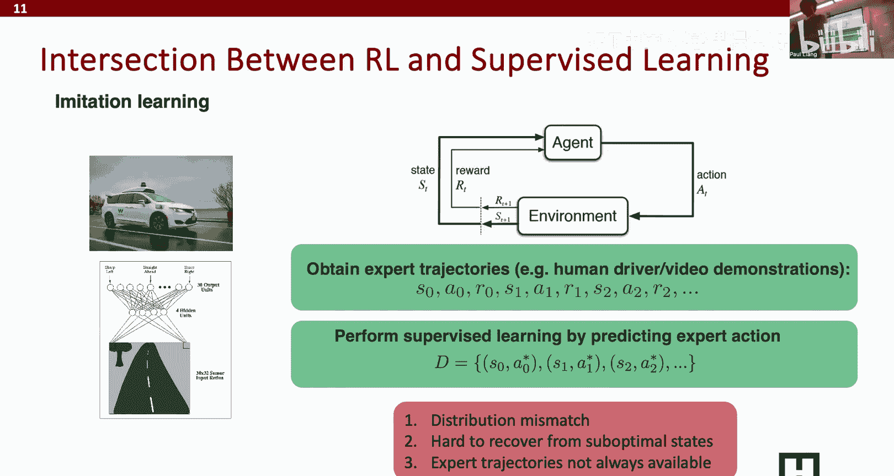

一种通用范式是所谓的基于模型的RL方法。在基于模型的方法中，你经常看到这些像树一样的图。这些树本质上表示，我将从这个状态开始。也许从这个状态出发，有两个可能的动作。给定这两个可能的动作，有两个可能的下一状态，也许每个状态都有，比如顶部是+1奖励，底部是-1奖励，然后又有两个可能的动作可以采取，在这种情况下又有两个状态。所以这是一个指数增长的节点树，节点是状态，边是动作，以及当你从一个状态到下一个状态时观察到的奖励。

所以，基于模型的RL在高层上就是构建这棵树，并为树中代表你将从这些节点获得的长期奖励的节点分配正确的值。

在这种情况下，我用蓝色高亮显示了一个策略。所以这个蓝色基本上意味着在这个状态，动作是……所以策略基本上是对这棵树的遍历。

同样，在短短五分钟内，如果你在做基于模型的RL，有几件事需要学习。一个叫做状态价值函数。所以给定每个状态，它的价值是多少？价值意味着如果我处于那个状态，我将获得的预期长期奖励是多少。再次强调，长期奖励是关键，不仅仅是这里的即时奖励。你不想仅仅因为状态是负一就给它赋值，你想给状态分配一个价值，要考虑到你未来可能获得+100。

这就是我们所说的状态价值函数，我们通常将其标注为V(S)。同样，有两种写法，一种是状态的价值。

当你遵循当前策略时，在这种情况下，状态S1的价值是，你从S1开始遵循当前策略，你会得到-1，然后得到+10，依此类推，所以价值是99。它考虑的不只是即时的-1，还有你的策略将在未来给你+100的事实，所以是+99。你提到了随机奖励？奖励是定义的。

所以就像我说的，如果我想为当前状态找到一个好的价值，我不想只是说如果我采取一个动作，我会得到负一。我想考虑到一旦我到达这里，未来有可能获得+100。所以在这种情况下，我没有使用任何折扣因子，总价值是-1 + 100 = 99。

所以它不……模型采取的步数无关紧要，但它需要是一个大数字。我的意思是，可能是-10，-20，然后+115。当然，是的。所以通常会有，我的意思是，会有更多我没有画出来的东西，通常可能有一个折扣因子来表明未来的东西可能价值较低。但在这种情况下，如果这个蓝色路径是一个策略。

那么它现在会得到负一，下一步会得到一百，然后得到更多。所以你会说总的长期价值是99。好的。

是否存在衰减函数？我可以想象，例如，假设你正在为做手术的医生制作一个RL系统，或者你知道有很多情况，即使等待很长时间或进行大量计算的结果更好，你可能也不想这样做，你可能想引入衰减函数或减少计算量。

是的，这正是折扣因子。所以γ就是你的总回报是下一个即时时间步的奖励加上γ乘以未来一步的奖励，然后你再加上γ平方乘以更远的奖励。通常γ设置为小于1的数，比如0.9。所以是的，有时折扣因子实际上对于确保其中一些方法收敛是非常必要的。否则你会一直继续下去，即使是一个小奖励，你也会一直试图寻找它。很好。

好的。😊 所以，这就是遵循你的策略的状态价值。另一个关键定义是，在所有可能采取的策略中，状态的最优价值。

如果你为S1计算它，你会发现这个蓝色路径已经是最优策略了。所以是的，V*(S1)也是99。同样，还有一个非常微妙的点，有时人们定义的不仅仅是状态的价值，还有状态-动作对的价值。所以如果我处于特定状态并采取特定动作，那么该状态-动作的长期价值是多少？同样，一些例子，如果人们将其标记为Q，你会看到Q(S, a)和V(S)。所以在这种情况下，遵循策略π，从S1开始并向上走，你会看到+1，然后看到+2，所以是+3。

呃，啊，所以。如果你从S1开始，然后向下走，那么你会看到，你知道这个，这是，你看到99。所以，那是。这基本上是一种估计状态价值以及你从该状态采取的动作价值的方法。同样，你基本上可以说最优的状态-动作函数是什么。所以在这种情况下，你看这个Q*，在S1，你向上走，你实际上会发现这个策略是次优的。事实上，你应该走这里然后走那里。所以这就是为什么在最优策略下，你的最佳状态价值函数是4而不是3。

所以很多基于模型的RL正是关于推导这些Q(S, a)和V(S)。你知道，在过去，人们在使用动态规划探索树时使用这些，如今人们当然使用神经网络来近似Q(S, a)和V(S)。但一旦推导出来，最优策略基本上可以通过将其视为树搜索问题来完成，你基本上将尝试遍历你的树，每次你将找到最大化你的V(S)或最大化你的Q(S, a)的动作。

所以基本上是从……搜索。另一点是，这些Q和V是可以互换的，你有了一个，也可以推导出另一个。很好。😡 所以，那是。简要地说，基于模型的RL，所以。

人们见过AlphaGo和一些下棋、玩游戏的情况，它们大多是基于模型的，所以它们有状态，即游戏的状态，有你可以采取的可能动作，你的目标确实是估计每个可能的棋子状态的长期奖励。所以不仅仅是，你知道，我刚刚在即时步骤中吃掉了对方的棋子，而是长期来看我获胜的可能性。AlphaGo本质上只是通过将棋盘视为图像来在这些棋盘上训练CNN，并以CNN输出V（状态的长期价值）的方式进行训练。然后，一旦你有了这些V，你基本上可以局部采取动作，因为你的V(S)已经考虑了长期奖励，所以现在你可以采取你的局部动作，这只是遍历你的树。所以是基于模型的。

另一种范式是基于策略的RL。所以基于策略的RL，我们不会构建树，我们也不会担心估计每个状态、每个动作的价值。在基于策略的RL中，我要做的就是直接学习一个策略，我将其视为本质上是一个函数，它接收状态并输出动作。所以在这种情况下，这个游戏，你的状态是游戏的图像，你的动作是我应该向上还是向下移动。

大多数现代方法，当你想到我们听到的RL和其他方法时，它们都采用这些基于策略的方法。所以我们将在讲座中主要详细讨论基于策略的方法。

在讨论基于策略的方法之前。我想强调一下，看看这是一个很大的争论，基于模型的方法在哪些方面更好，或者基于策略的方法在哪些方面更好。我在这里列出了每种方法的一大堆优缺点。所以在基于模型的RL中，你实际上在学习环境的一个模型，你在学习这棵树和每个可能的状态-动作转移。而在基于策略的模型中，你只学习策略，但不关心学习环境的模型。

因此，由于基于模型的RL学习了一个模型，它们更适合规划，因为你可以通过遍历这棵树来模拟其他潜在动作，它们的样本效率更高。但代价是更复杂。另一方面，基于策略的方法不允许你进行规划，它们不允许……它们具有更高的样本效率，但训练算法通常更容易实现。

还有很多优点和缺点，这也涵盖了一些例子，一些著名的基于模型的RL算法，以及一些著名的基于策略的RL算法。

好的。😊

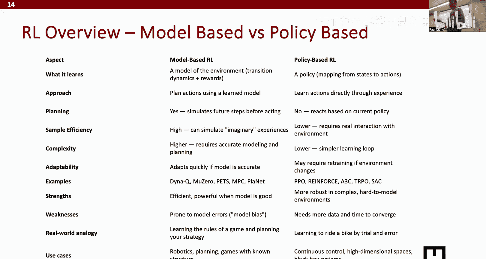

所以基于策略的RL。再次，我将使用这个激励性的例子。这就像乒乓球游戏，你知道你要控制其中一个球拍对抗对手，你的两个选择是向上或向下移动，将乒乓球弹回对手一侧。如果你成功将球打过网，你就得一分；如果你让球落在自己一侧，你就失一分。

所以现在的目标是训练一个模型，它接收这个状态（游戏的截图），并只输出两件事：你是向上移动还是向下移动。所以这是一个二元分类问题。你的目标本质上是训练这个模型。那么如何训练这个模型呢？

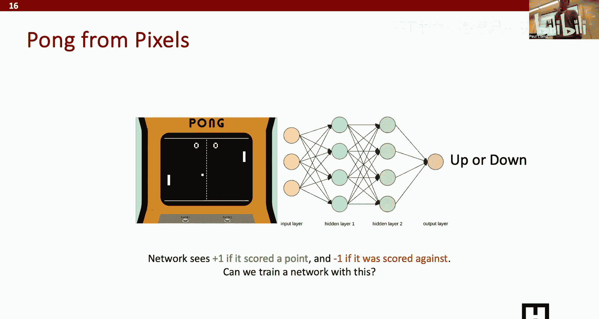

首先，假设你有标签。比如说，有人遵循人类专家，这些人类专家向你展示了在每个阶段，人类是向上移动还是向下移动。所以这是专家标签，专家轨迹。

然后你要做的通常是将其视为一个监督学习问题。输入状态，你的标签是向上或向下，你最大化你的对数概率。所以当实际向上移动时，最大化向上移动的对数概率；当标签是向下时，最大化向下移动的对数概率。这基本上就是你的交叉熵损失。如果有标签，你就会这样做。

当然，你没有标签，或者标签很昂贵。

所以基于策略的方法要做的是，首先，

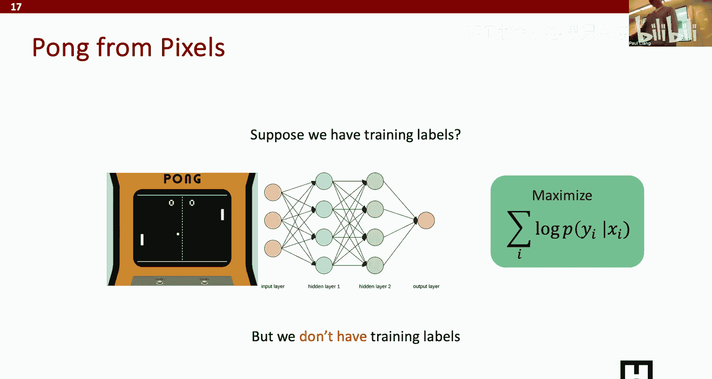

有一个策略。策略只是一种说法，我有一些状态，我采取一些动作，我将只是……提升这个策略。也许在第一次运行中，你的策略采样了上、上、下、下。在第二次运行中，你采样了其他东西。在第三次运行中，你又采样了其他东西。所以这些只是你的模型根据当前策略采取行动的方式。

假设你在游戏中运行这个，你意识到在你的第一个动作序列中，所以你的第一个

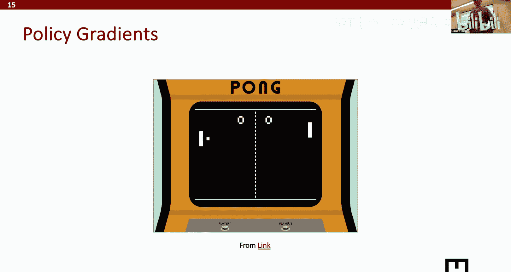

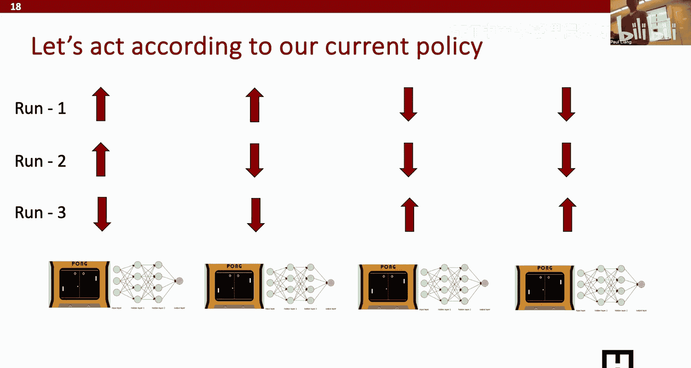

例如，从你的策略中，你赢了，所以你非常幸运地赢了。然后在你的第二次和第三次运行中，你不幸运，你输了。好的，所以你可以，你可以通过得分是给了你还是给了对手来观察你是赢了还是输了。

那么你要做的是，基本上将你赢了的序列（我知道可能是靠运气赢的）视为好的例子，所以我想最大化导致你赢的序列中的每个动作。

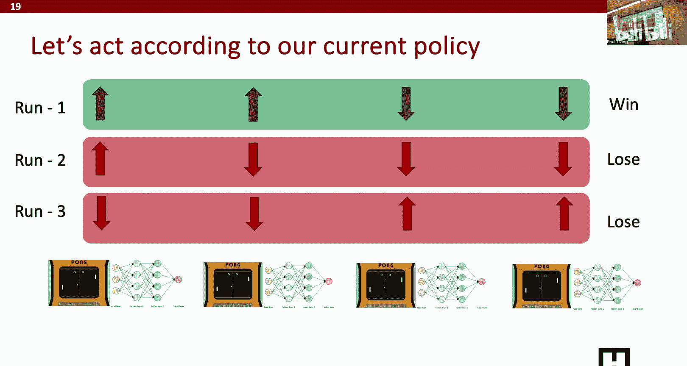

你也会将导致你输了的动作序列（你运气不好）视为坏的例子。所以我要惩罚导致你输的序列中的每个动作。

那看起来像什么？基本上，当你赢时，最大化每个动作的对数概率；当你输时，最大化负一乘以每个动作的对数概率。所以一般来说，你可以将其视为一个通用的目标函数，它最大化每个动作的奖励R_i（在这种情况下是+1或-1）乘以该序列中每个动作的对数概率的总和。

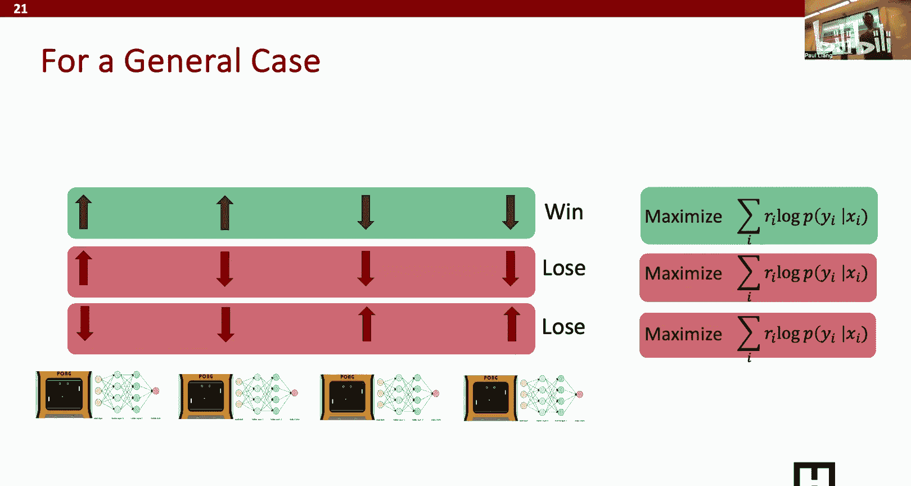

所以实际上，这就解释了基于策略的RL，就这么简单。

这是最早出现的算法，所以它被称为REINFORCE算法。你基本上会，你知道，从某个策略π(a|s)开始，假设它是可微的，所以它可以是一个神经网络。你将随机初始化参数。

然后你无限循环，使用该策略生成一个回合。所以从你的状态采取动作。在乒乓球游戏中，就是上下移动，这是一个回合，你看到一些奖励，然后再次上下移动，你看到其他奖励，依此类推。啊，对于你的策略。然后对于回合中的每个时间步，我将最大化这个函数。所以再次，这个函数中的G是你在该序列中的奖励，所以按照这个方程给出的方式将每个奖励相加，然后这是你的动作对数概率的梯度，给定那些序列。

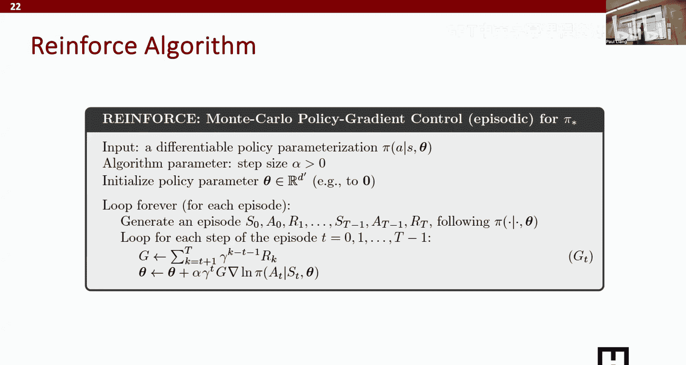

所以正是这个方程，只不过现在你的奖励只是

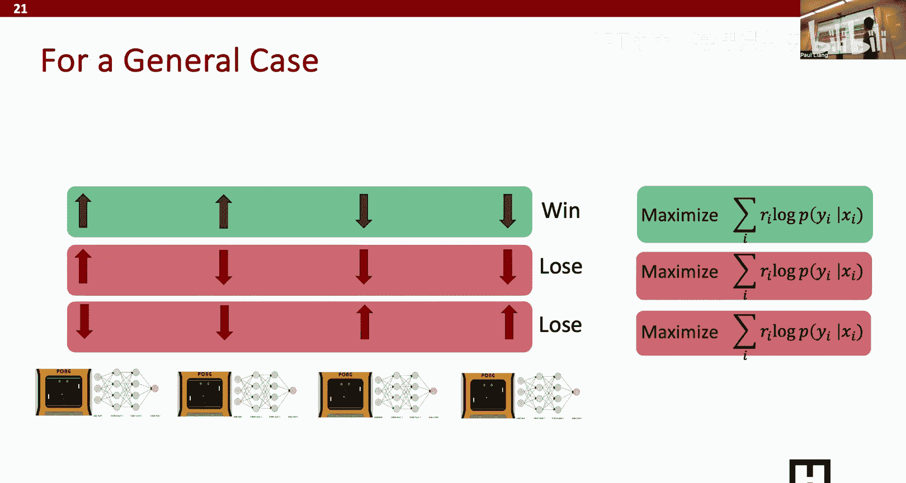

在每个时间步上求和。你也意识到，你知道这里的γ是你提到的折扣因子，所以你应该惩罚未来的好奖励，并倾向于现在就拥有它们。

但这就是策略梯度，所以采样不同的动作，你的策略，看看奖励是什么，然后根据奖励是正还是负来提升或降低动作的概率。

这里的这一点，遵循你的策略，我还应该指出ε是非常重要的。那么ε是什么意思？基本上，当你开始初始化你的策略时，你的策略会很差，或者基本上会给你随机的动作。

这意味着你不应该总是遵循你的策略来采取动作，而应该有时采取随机动作，这称为探索。不管你的策略是什么，采取随机动作。

所以通常以ε的概率，你只会采取一些随机动作。然后随着你慢慢开始训练你的模型，你提升好动作的概率，降低坏动作的概率，现在你的策略变得更好了，对吧？一旦你的策略变得更好，你将慢慢开始倾向于遵循你的策略，而不是从随机策略中采样太多。所以基本上，这个ε开始时很高，然后慢慢变小。

所以你称之为探索，即采样随机事物；以及利用，即遵循你的策略告诉你的内容。好的，所以这基本上就是策略梯度。好的。最大化奖励乘以对数概率，对数概率由奖励缩放。所以如果你的奖励是正的，就增加动作的概率；奖励是负的，就减少动作的概率。这是原始的策略梯度。

多年来有很多改进，因为它有几个问题。一个是方差非常高。为什么我说方差非常高？因为通常原始奖励本身可能没有太大意义。有时你玩的游戏总是得到正奖励，你只是想得到更多正奖励和更少正奖励；有时你玩的游戏总是得到负奖励，你只是想更接近零。所以有时原始奖励没有太大意义。

重要的是奖励随时间的变化，与奖励的滚动平均值相比。

所以一个重大的创新或提高性能的技巧是将奖励与基线进行比较，并使用相对改进。所以现在这是一个新的函数，最大的区别是，它是你的轨迹（动作序列）的奖励，减去基线。

基线可以是类似奖励的指数移动平均值。好的。减去基线显著提高了基于策略方法的稳定性。不。当然，人们也探索了更好的基线，因此开发了这种演员-评论家方法。

更好的基线基本上将你的基于策略的方法与基于模型的方法结合起来。

回想一下，我们定义了Q和V，对吧？V是V(S)，衡量一个状态的好坏，通过从该状态出发的长期奖励；Q是Q(S, a)，衡量一个状态-动作对的好坏，通过从该状态和动作出发的长期奖励。

所以实际上，Q(S, a)和V(S)之间的差异，我们通常称之为A(S, a)，其中A代表优势函数。优势基本上意味着从该状态采取特定动作有什么优势。同样，这个优势不是用即时奖励来衡量的，而是用长期预期奖励来衡量的。

所以。如果这个A(S, a)很大，那意味着我们对这个动作非常满意，因为它给了我们更好的长期奖励。如果A(S, a)很小或为负，我们非常不满意这个动作，因为它给了我们负的长期奖励。

所以。这引出了这个新的估计器，本质上还是最大化你序列中动作的对数概率，但现在由优势函数缩放，即Q(S, a)比基线V(S)好多少。所以我们称之为演员-评论家方法。这在2016年到2020年左右非常流行，它启动了很多深度强化学习研究。在这种情况下，你必须学习两个模型，因为正如这里提到的，首先你得到一个模型来学习策略，即我从一个序列中应该采取什么动作，但我还需要模型来学习这些Q和V函数，就像我之前展示的基于模型的RL和树一样。

所以这些演员-评论家模型正好维护两个模型。一个是演员模型，演员模型学习策略，所以状态输入，演员学习给定状态的动作分布，这就是你的策略或你的演员。同时，另一个模型是我们所说的评论家。评论家本质上学习Q(S, a)，它学习批评和评估模型看到的状态和动作的价值。

所以当这两个函数基本上使用不同的目标一起训练时，评论家评估基线动作的好坏。我不会在这里讲太多细节，你知道，如果有人以前见过Q学习或DQN，那基本上就是这些基于模型的方法如何用深度学习来近似的。

而演员，它决定策略是什么，再次是你的策略梯度函数，计算对数概率乘以你的优势函数。还在去发些创试。好的。😊

我知道这可能比平时的讲座内容多，但到目前为止有什么问题吗？好的。

所以，几乎到了激动人心的部分，就是关于这些RL方法如何与LLM交叉。

但在那之前，还有几个小的改进。其中一个叫做近端策略优化。所以之前的一切都是策略梯度、策略优化，然后出现了这个新方法叫做近端策略优化。

在这个领域内还有几个新方法。其中一个叫做信任区域策略优化，最大的区别是你仍然要做策略梯度，你仍然要最大化对数概率，但现在最大的区别是你要确保你的策略不会随时间变化太大，并且通过限制新旧策略之间的KL散度来衡量，即梯度更新后的新策略和梯度更新前的旧策略。

所以如果有一个当前点，你想确保你提出的点非常接近。同样，在视觉上，这是你的动作和你的策略，你不想让它与之前的样子相差太大。

所以那是2015年的信任区域策略优化，然后近端策略优化是它的进一步近似，说实际上你不需要正式测量新旧两个策略分布之间的KL散度，而是直接裁剪梯度，所以无论策略梯度（对数概率）是什么，都将其裁剪在一定范围内。

所以这是你讲义中的方程，这是你的新策略π_new(a|s)和旧策略π_old(a|s)之间的比率，你将把这个比率裁剪在1-ε和1+ε之间，所以每次更新模型时，你都在一个ε球内。

而PPO本质上是人们在RLHF（人类反馈强化学习）中使用的RL方法，如今被用来对齐这些LLM。

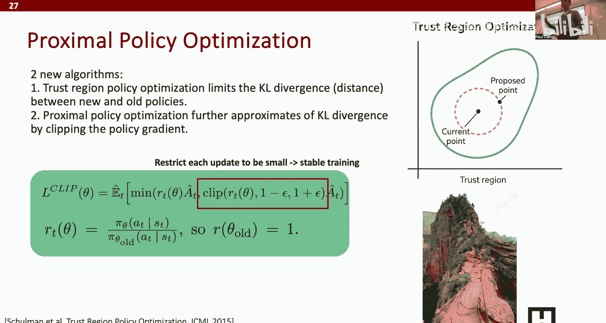

简要地说，这些方法的工作原理是。第0步，你首先预训练你的LLM。然后你会进行监督微调。所以无论你在预训练时做什么，只是在你的互联网文本上训练，预测一个词接一个词。监督微调有时我们也称为指令微调，收集人类编写的问答演示，并对这些问答进行下一个词预测。你们都见过这个。

然后第1步，现在这是基于RL的对齐开始的时候。所以对于每个提示，你将把LLM视为一个策略。所以策略是给定状态输出动作，现在我说它是给定状态（你的提示和之前生成的词）输出词序列。所以你可以将LLM视为一个策略。

你将从模型中采样多个响应。所以这可能是一个响应，另一个响应，另一个响应，就像我们在乒乓球游戏中看到的那样。在第2步，你让人类根据质量对这些输出进行排序，这就是人类反馈的来源。

但当然，你不能总是依赖人类标记响应，那在实验室外无法推广。所以现在你将训练一个奖励模型，该模型基本上预测并试图模仿人类偏好。

所以现在你可以标记任何其他响应，即使它没有被人类标记，也可以被奖励模型标记，所以你会得到一些奖励，就像乒乓球游戏一样，只是现在比简单的+1和-1更复杂一点。

一件事是，这些奖励模型根据完整的模型响应（即与人类对话的完整完成）来创建人类偏好。然后第4步，你使用RL，他们使用的第一个算法正是PPO，这个近端策略优化，来微调LLM以最大化这些奖励。再次，最大化这个奖励基本上意味着获取奖励，乘以该序列中动作的对数概率。

更多细节：首先是人类排序和奖励模型。所以你的提示输入，你有一个语言模型生成一些文本，人类将对每个句子评分，看他们是否喜欢。一旦这些人类评分，你将根据输入和人类评分的奖励进行训练，你使用监督学习来训练，得到一个奖励模型，以恢复给定真实人类标签时的人类奖励。

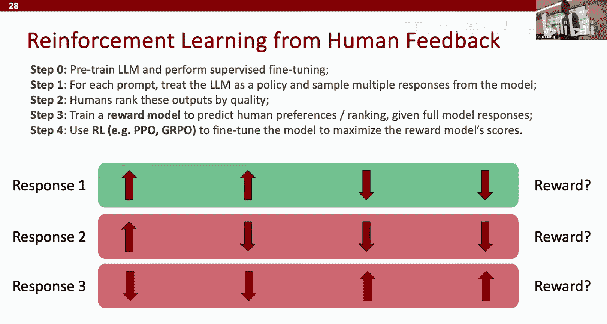

当然，你知道David在讲座中提到过，给对话分配客观的奖励（如8或1.2）更难，通常比较一个和另一个更容易，比如人类更喜欢这个而不是那个。

因此，你在这些论文中经常看到这种东西，这基本上是一种衡量一个输出优于另一个输出的可能性的方法，作为两个输出各自实际奖励的函数。所以基本上是一种将比较奖励与绝对奖励联系起来的方法。但是的，所有这些都是为了让人工排序并学习一个奖励模型。

然后在PPO中发生的是，到目前为止你拥有的，你有你的演员模型，也就是你的策略，那是你的大语言模型。状态是提示和模型目前生成的内容，动作是它们将生成的下一个词。它会有我们刚刚看到的奖励模型，该模型已经训练好并冻结，来自人类对这些响应的评分。现在它将只是重新创建并重新预测这些人类偏好作为一个标量奖励。再次，这些是在你的完整模型响应（即完整对话）之上的。

第三个组件是这个价值模型，所以这个价值模型与我们看到的评论家模型相同，所以这也将被训练，它将是一个评论家模型，本质上估计V(S)（状态的价值）。所以在这种情况下，状态只是模型响应，包括部分和完整的模型响应（词序列），你的预测器输出一个标量。

所以这几乎完全等同于你的演员-评论家模型，对吧？有一个演员模型生成动作（在这种情况下是词），还有一个评论家模型评估你从每个状态生成的词的价值。

那么你如何应用RL呢？你会从生成响应开始，LLM将为每个提示生成多个响应。

你将运行你的奖励模型，为每个输出响应分配奖励。

然后你将计算你的优势。就像在评论家中一样，你将在这里计算你的优势函数，你的策略（你的语言模型），给定提示和策略，你生成一些输出。

输出将通过奖励模型得到R，同时给你一个价值模型，它提供基线。

优势基本上是你的奖励比基线好多少。这就是优势函数，你想将其解释为你生成的特定词是否优于给定先前词的标准下你生成的平均词。

所以这给了你你的A函数，这个A函数将是你用于策略梯度中更新你的策略模型（即你的LLM）的项。另一件事是，在优化你的策略之后，你还要更新你的价值函数。所以你想训练一个更好的价值模型，你想把这个价值模型视为再次评估平均词的好坏。

所以看起来很复杂，对吧？看起来相当复杂。而这也许是GRPO最大的优势，它大大简化了这一点。

所以你之前有策略模型、参考模型、奖励模型。再次，蓝色是冻结的（我忘了提蓝色是冻结的），黄色是训练的。所以它有策略模型（即LLM），有价值模型（估计平均词的好坏），有奖励模型（这个新词有多好），然后你将新词的奖励与参考模型（即上一轮的LLM）的平均词价值进行比较，你还有这个KL惩罚，以确保它没有变化太大。记住，在近端策略优化中，你的KL必须确保你的策略不会变化太大。所以非常复杂。然后GRPO出现了，说了几件事：首先，我们要去掉价值模型。我们不要有一个跟踪平均词好坏的价值模型，我们不去学习它，相反，我只是要从我的策略中采样一组响应。

我对每个响应评分奖励，我的优势基本上只是通过这个奖励比组中其他奖励好多少来估计。

好的，所以你不需要一个价值模型来作为基线衡量平均或词的价值，如果你采样足够多的响应组，那么组内的奖励本身就允许你计算平均值是多少，从而你的奖励比那个平均值好多少。

所以是的，去掉那个价值模型，一个你不需要训练的东西，去掉它让事情变得容易多了。

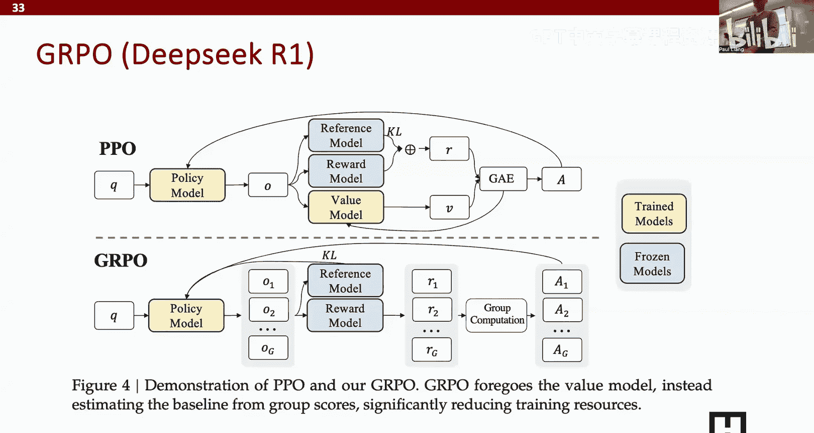

你可以在这里看到，这基本上就是你的……那是大事，只是带有KL的PPO目标，但这里简单的是这个优势函数，优势就是奖励减去组内奖励的均值，再除以组内奖励的标准差。

啊。所以是的，区别在于使用一组响应来计算优势并进行集成更新，你去掉了学习的价值函数，只是让它变得更简单，作为奖励的统计量（均值和标准差），而不需要学习它。然后进一步的创新甚至放弃了奖励模型，所以你不需要训练一个复杂的奖励模型来模仿人类偏好，而只是使用一些简单的基于组的验证器，比如二进制检查（你的代码是否运行），或者你的代码通过了多少测试用例，或者你的响应有多长，或者你的响应是否遵循某种格式。

所以你可以看到很多。创新是简化的结果，而不是更复杂或更高级的算法。

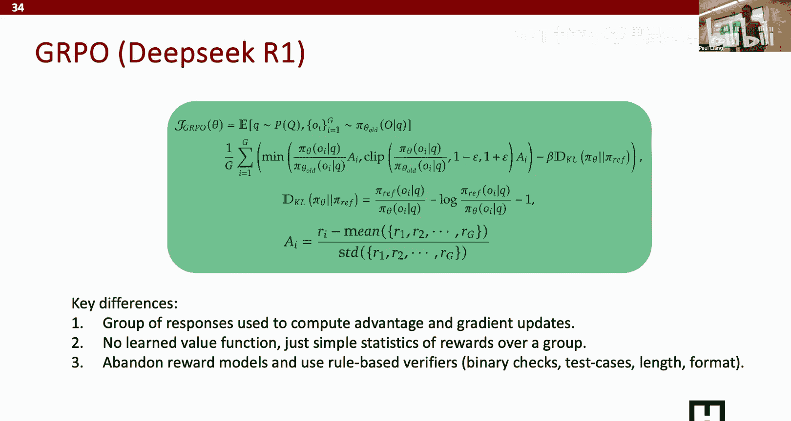

啊。很好。还有，这里只是，你知道，一些。我看了一些博客文章。

我想很多人，很多RL领域的人，所以现在很多将RL用于机器人和深度RL的人都在研究RL用于LLM，很多RL社区的人在想，GRPO简化了PPO这么多，令人惊讶的是以前没人尝试过这个。

所以这是一个评论，有人说为什么以前没人尝试过GRPO。嗯，我们有REINFORCE，记得REINFORCE是我们讨论的第一个算法，在REINFORCE中，你通过减去基线（通常是几个轨迹的平均奖励，即你到目前为止看到的奖励的指数移动平均值）来更新策略。

这有助于减少方差。事实上，理论表明理想的基线是从你的状态出发的总预期未来奖励，通常称为价值V(S)。

使用价值函数作为基线被称为演员-评论家方法。所以你有学习策略的演员和学习V(S)并将其用作基线的评论家。PPO是它的一个稳定版本。

现在，在传统的REINFORCE中，基线可以是当前状态的任何函数，传统上它只是轨迹的奖励，即单个批次中的平均值。

当然，在GRPO中，它是基于为每个提示生成的数千个样本计算的，这是新颖的。所以很大程度上是回到，你知道，甚至在演员-评论家之前，你知道，在学习价值函数之前，只是对多个采样提示的奖励进行简单的滚动平均统计。

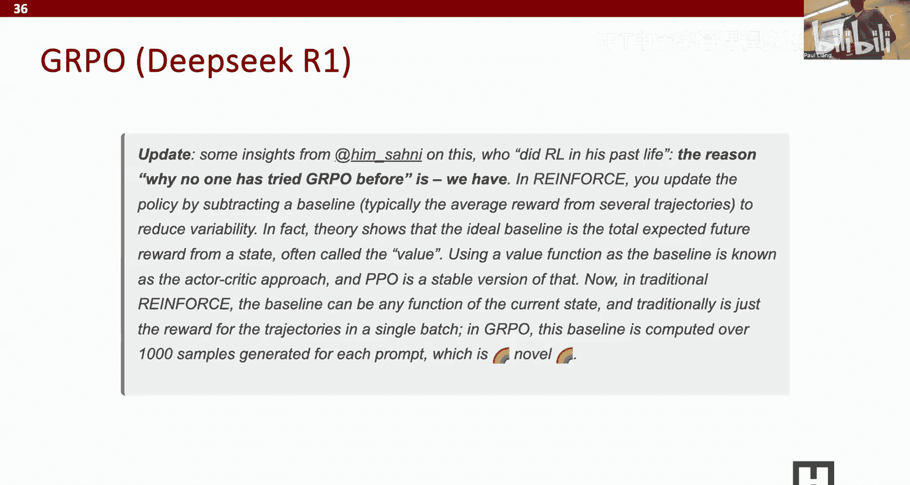

很好。嗯，最后两件事。DPO也是人们可能见过的。再次，是PPO的一个变体，也就是你的策略优化。

所以这个框是PPO，记得你有偏好数据，你有提示X和排序（人类认为一个比另一个好），你会训练一个奖励模型来反映你的人类评分，一旦有了奖励模型，你将使用它通过策略梯度来获得并更新你的策略模型。所以那是PPO。

DPO是这条线，它基本上再次从相同的偏好数据开始，跳过了训练奖励模型，跳过了PPO，实际上只是，你知道，在偏好数据上使用监督学习进行训练，就像在偏好数据上进行监督预测一样。

嗯，说它是监督的可能不太准确，它们是在这个偏好项上进行强化学习。

我不会讲太多细节，但有一些关键区别。

所以DPO在计算上更高效，因为它不需要训练一个单独的奖励模型并使用该奖励模型进行RL。

所以在计算速度和工程难度上更高效。它没有那种奖励模型。在训练期间，必须在线解码响应，这通常很慢。而PPO则必须在线数据上训练，所以它总是在你刚刚收集的响应上训练。而DPO在这些预先生成的离线数据上训练。所以关键是，这仍然是社区之间的争论。

PPO可以被视为在线强化学习，而DPO可以被视为离线强化学习。

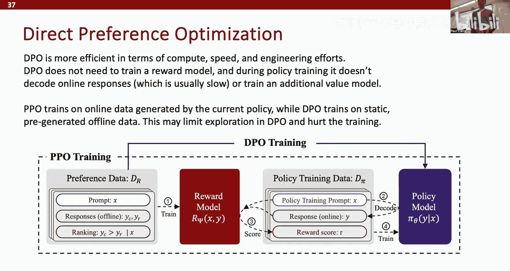

两者之间有一些差异。我认为一个简单的类比是，假设你想在自动驾驶汽车上训练一个策略。所以你将把它部署在你的车上，当你驾驶你的车时，你将收集更多数据，你将看到你驾驶得有多好的奖励，你将根据你在世界上实际在线体验到的内容来更新你的模型。

所以那是在线RL。而离线RL更像是，你知道，你看过别人在不同场景下驾驶汽车的视频，不是你实际生活中正在驾驶的场景，而是试图从离线数据中学习。

人们争论在线更好还是离线更好，但PPO和DPO之间最大的区别是一个在做在线RL，一个在做离线RL。

但DPO的一大吸引力再次在于它更简单，并且跳过了许多以前需要的额外步骤。

好的，我们时间快到了，让我总结一下强化学习的几个技巧和训练窍门。

通常，用固定策略进行完整性检查总是好的。例如随机初始化的策略，或者从人类专家演示初始化的策略。

因为RL中最大的挑战之一是，你是在奖励本身和环境本身也在变化的情况下学习策略。

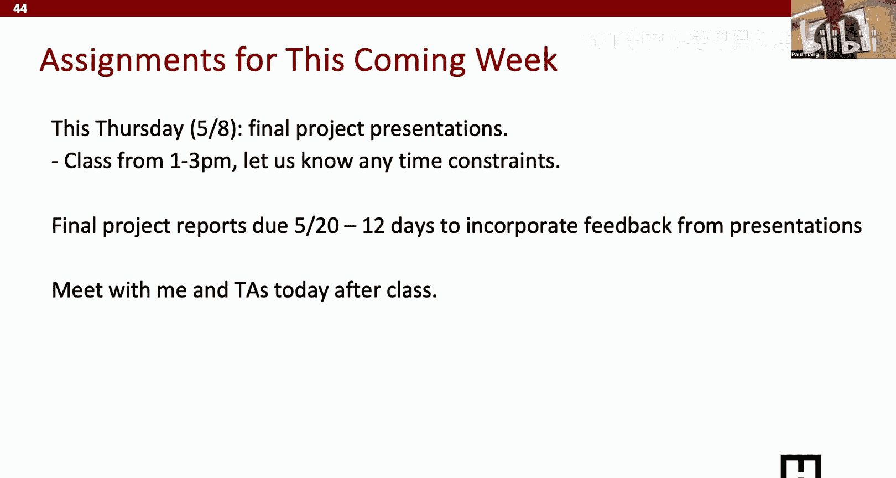

通常，监控策略散度是好的，特别是在你试图强制策略不会变化太大的算法中，确保其平滑。随时间监控熵，熵只是你的动作的方差有多大