# 12：人机交互

在本节课中，我们将探讨人机交互（Human-AI Interaction）领域的最新方向。我们将回顾多模态推理、智能体系统，并深入讨论如何让人工智能系统与人类有效协作，以及理解这些先进系统的伦理与安全问题。本节课是本学期的最后一讲，我们将展望未来研究面临的开放性问题。

---

## 多模态推理：下一代AI模型的核心

上一节我们介绍了推理，特别是强化学习。本节中我们来看看多模态推理，我认为下一代AI模型将在这方面非常强大。

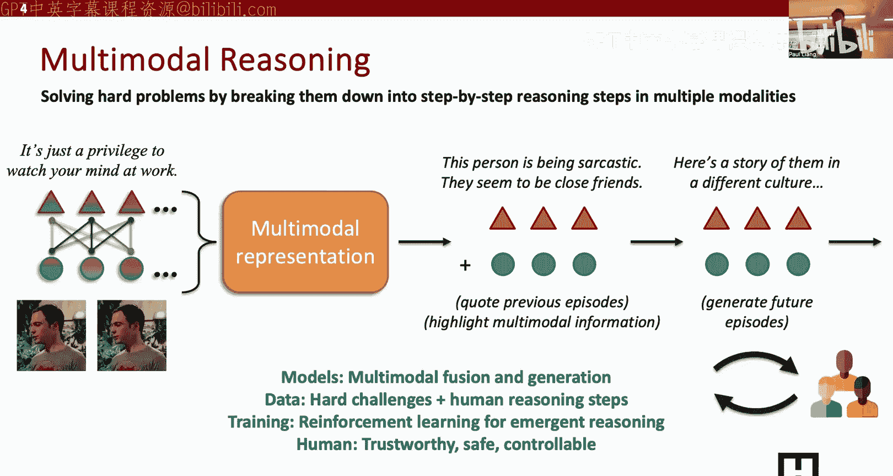

多模态推理意味着模型能够处理越来越多的信息模态，包括语言、视频、音频、传感器数据、医疗数据等。它需要：
*   **学习多模态表征**：从差异巨大的输入中学习统一的表征。
*   **进行多步推理**：将复杂问题分解为多个步骤，其中一些步骤涉及语言推理，另一些可能涉及视觉证据、听觉证据或其他模态的证据。
*   **实现人机交互**：人类需要能够理解每一个步骤，能够进行干预并提出后续问题。

我认为这是一个通用的框架：**多模态输入 -> 多步分解 -> 多模态输出 -> 人机交互**。

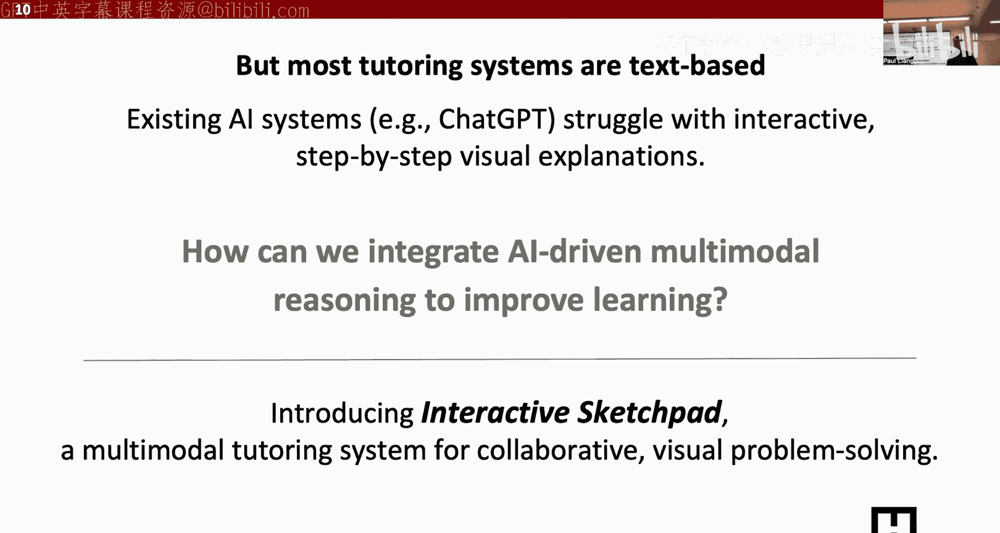

以下是该领域面临的主要挑战：

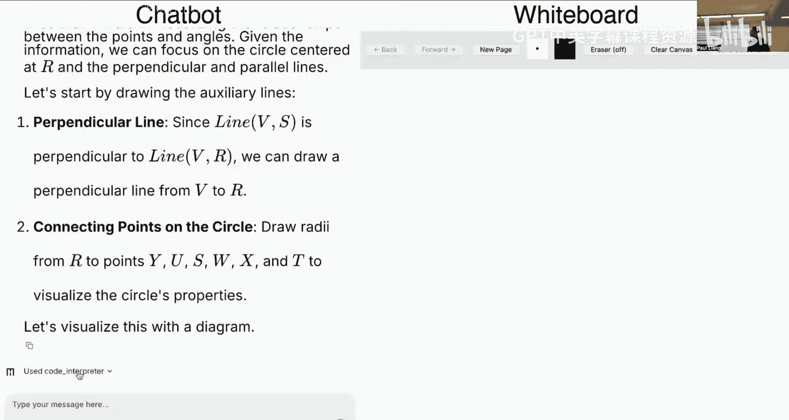

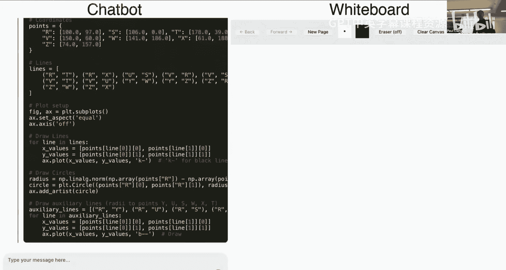

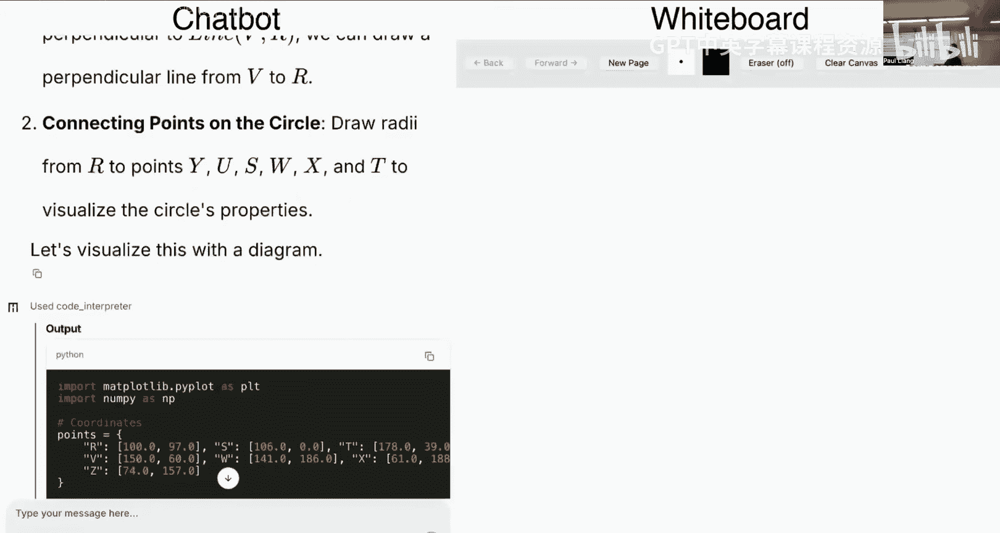

**建模方面**：涉及多模态融合（学习不同数据模态间的对应关系）和多模态生成（模型需能生成文本、视频、音频等以进行推理）。

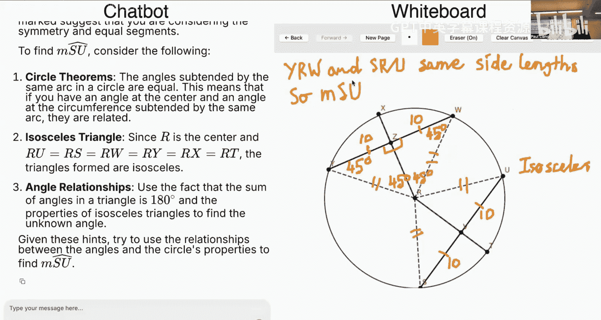

**数据方面**：需要更具挑战性的多模态推理基准，最好附带人类拆解问题的推理步骤。

**训练方面**：一方面可以利用优质的人类推理轨迹进行监督微调；另一方面，正如上周强化学习所示，可以直接针对最终目标进行训练，让推理行为自然涌现。

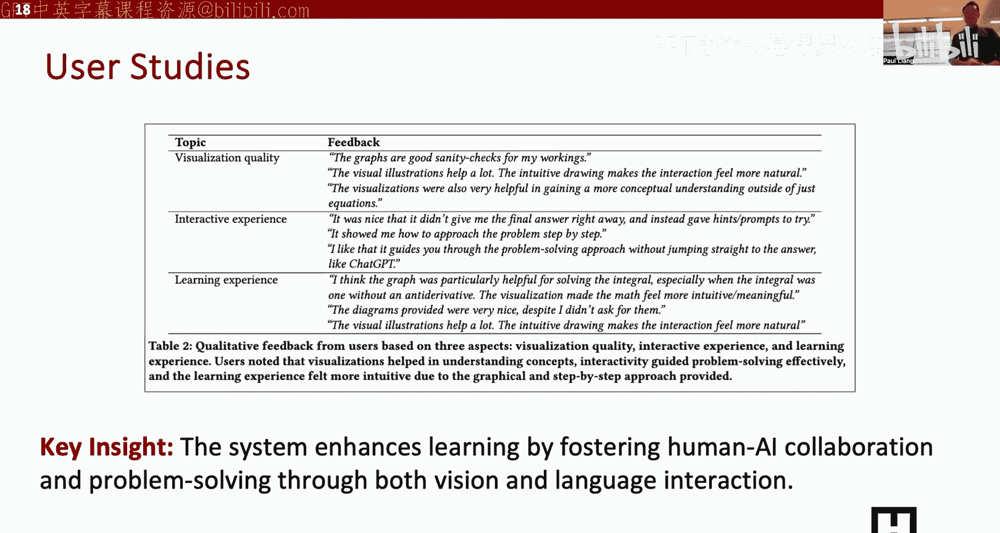

**人机交互方面**：系统需要与人类交互，人类输入应能控制模型，而模型输出则必须稳健、可信且安全。

---

## 案例研究：交互式草图板（Interactive Sketchpad）

为了具体说明多模态输入、推理、输出与人机交互的结合，让我们看一个我们近期的研究案例。

这项工作的背景是教育领域的推理，模态是图像和语言。例如，在解决几何问题时，在图形上绘制额外的辅助线或标注对学生理解非常有帮助。大多数辅导系统是文本基础的，而我们的目标是构建一个智能辅导系统，通过多模态交互引导学生自己找出答案，而不是直接给出答案。

我们开发的方法称为“交互式草图板”。“交互式”指的是它通过多步互动引导学生；“草图板”则借鉴了允许人们绘图、草图并迭代想法的平台历史。

**系统工作流程如下**：
1.  学生遇到问题（如几何题）并卡住。
2.  AI聊天机器人首先尝试提供提示（而非最终答案），例如建议绘制特定的辅助线。
3.  系统通过编写代码（如Matplotlib代码）来精确生成带有标注的图表。
4.  学生根据图表和提示进行绘图和思考。
5.  如果学生再次卡住，可将标注后的图表再次发送给模型。
6.  模型进一步提供提示（如几何定理），最终帮助学生解决问题。

在实现上，系统首先判断绘图是否有帮助（如几何、微积分问题）。然后选择生成方式：**使用代码能保证绘图的精确性（如距离、角度），而使用生成模型（如扩散模型）则更灵活但缺乏精确保证**。在本案例中，我们使用了代码生成方式。

一些成果表明，该方法改进了之前的“视觉思维链”方法，并且学生反馈积极，认为图表直观，且喜欢分步提示而非直接给答案的学习体验。

这个案例展示了未来人机交互研究的一种形态：处理复杂多模态、进行多步分解、产生直观的多模态输出，并以增强人类能力（如学习）为目标。

---

## 智能体与自动化任务

另一个令人兴奋的方向是交互式智能体，它们可以帮助我们提升生产力，自动化各种任务。

例如，任务可能是“购买一款评分超过4星、价格低于60美元的耳机”。现代AI智能体能够理解此类复杂指令，并将其分解为步骤：打开浏览器、搜索“耳机”、按评分筛选、按价格筛选、选择商品、结账等。

这些智能体未来可能应用于网站、数据库、PPT、电子表格、手机操作系统等，几乎能用自然语言自动化任何任务。然而，它们不能完全自主运行，必须能理解指令、在困惑时请求澄清，并且人类需要能够介入并提供反馈。

**智能体研究的主要挑战与方向包括**：

**1. 分层推理与动作分解**：
将困难任务分解为高级规划（用自然语言描述，如“搜索耳机”）和低级动作（如移动光标、点击、输入字符）。一个高级规划可能对应多个低级动作。这种分解也有助于人类干预。

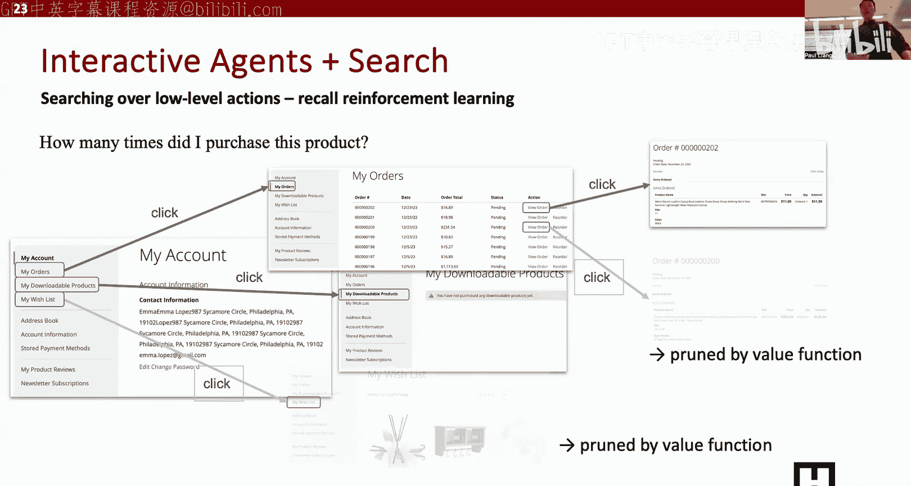

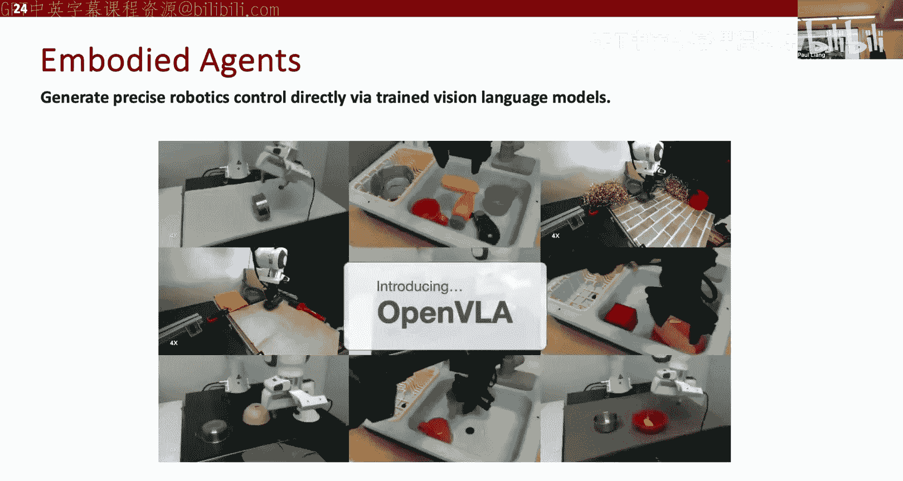

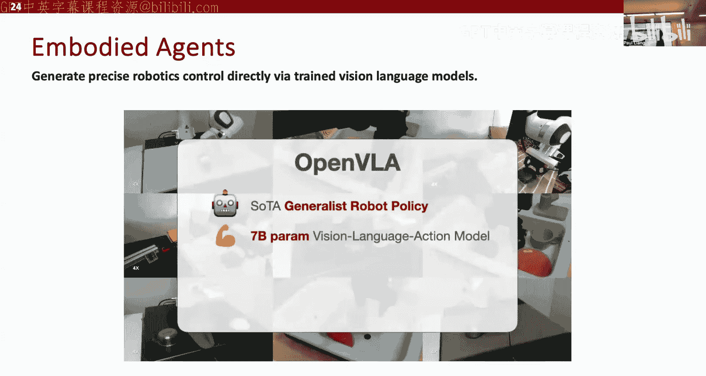

**2. 不确定性度量与人类介入**：
如何让智能体在不确定时发出信号？一种方法是多次采样模型的下一个动作，如果生成的多个动作差异很大，则表明模型不确定/困惑。此时，人类可以介入，提供一个正确的高级规划步骤（例如，“你应该按价格从低到高排序”），模型随后便能继续执行。

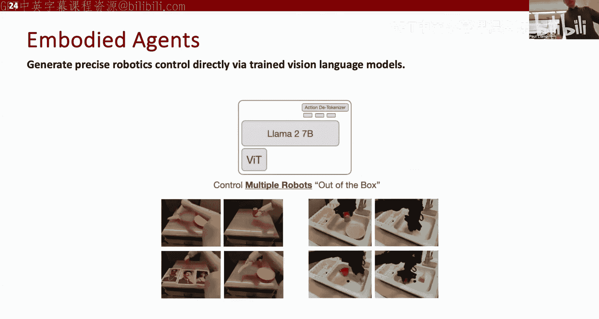

**3. 集成搜索与剪枝**：
对于复杂任务（如“查询我购买过某产品的次数”），智能体需要在巨大的状态空间（如网站页面）中搜索。可以借鉴强化学习中的价值函数概念，估计每个状态的价值，从而在搜索时剪枝掉无用的分支，提高效率。

**4. 从数字智能体到具身智能体**：
研究正扩展到机器人领域，即视觉-语言-动作模型。这些模型接收视觉输入（机器人所见）和语言指令，输出机器人动作（如位置变化、角速度、抓握）。通常使用大型语言模型（如LLaMA）作为核心，通过适配器接入视觉特征，并解码为动作序列。

关于训练，对于购买等复杂任务，纯强化学习可能不可行，更可行的策略是：用视觉语言模型和规划进行初始化，再对低级动作进行强化学习微调。

**5. 工具使用**：
将工具作为智能体的扩展模块是重要方向。目前，工具调用主要通过语言或代码接口。未来，多模态基础模型的发展可能使工具交互不再局限于语言瓶颈。

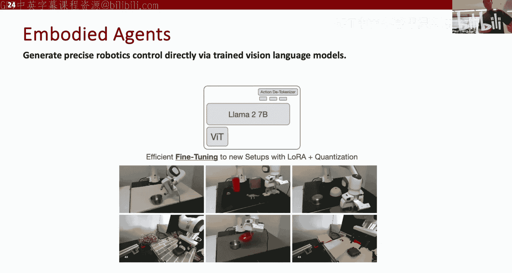

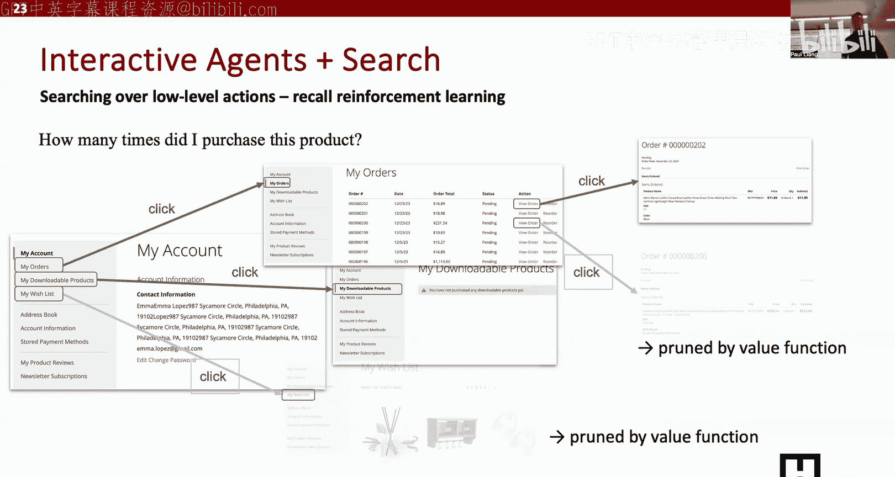

---

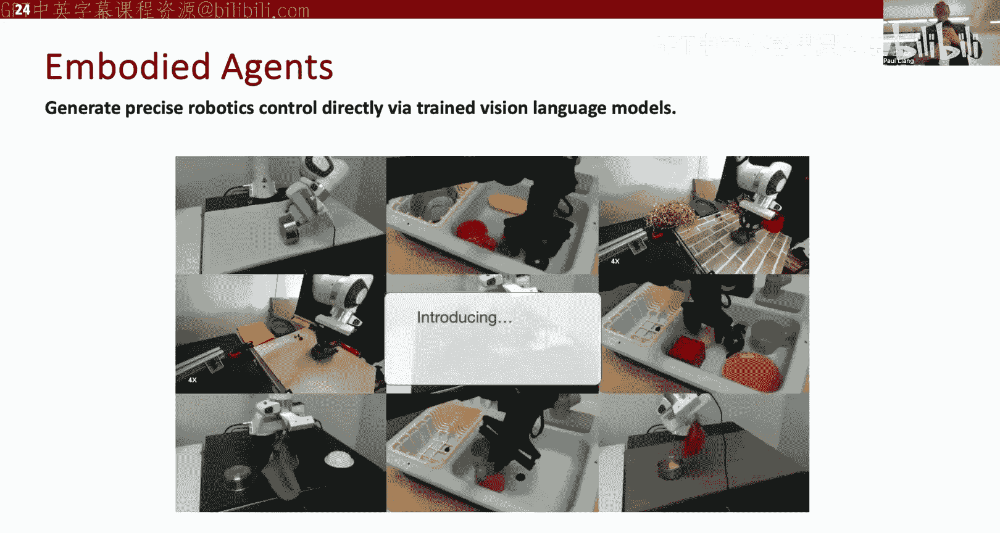

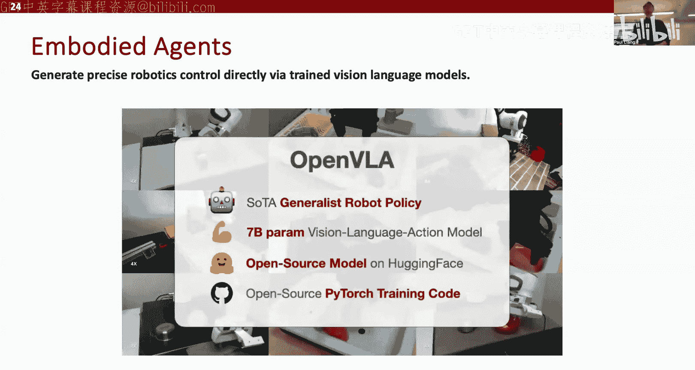

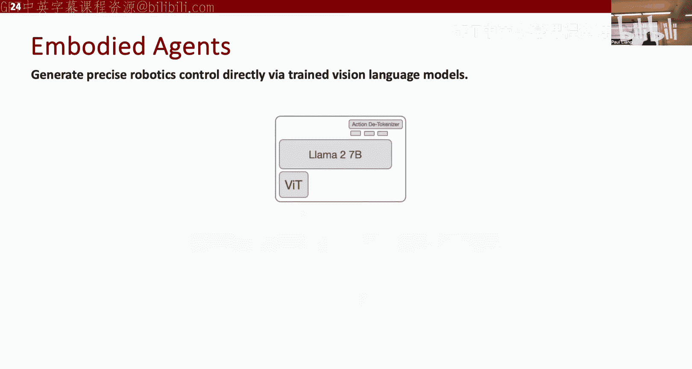

## 人机交互的未来与模型量化

最后，我们来探讨人机交互领域的核心问题及模型量化的重要性。

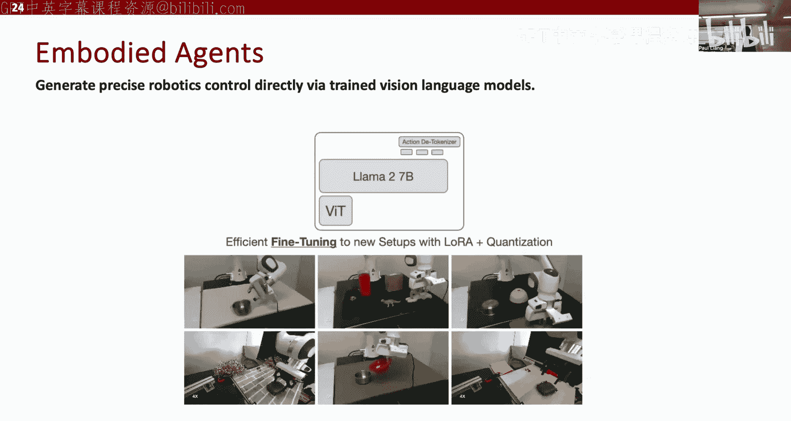

我认为有三个重大问题需要回答：

**1. 最直观的交互媒介是什么？**
除了语言提示，是否可以是基于代码、视觉甚至生理信号的交互方式？如何在保持语言保真度的同时，降低认知负荷？这涉及构建多模态交互界面并探索不同媒介间的切换与融合。

**2. 需要解决哪些新的AI技术挑战以实现人机交互？**
一个关键挑战是**模型量化**，其正式定义是：对模型进行实证和理论研究，以更好地理解其缺陷，并预测和控制其行为。这包括：
*   **理解模型何时及为何失败**。
*   **解释模型的内在行为**。
*   **预测模型如何学习及随规模扩展的性能变化**。

**3. 人机集成会带来哪些新机遇？**
如何帮助提升生产力、创造力和福祉？这是更偏向应用和人文的问题。

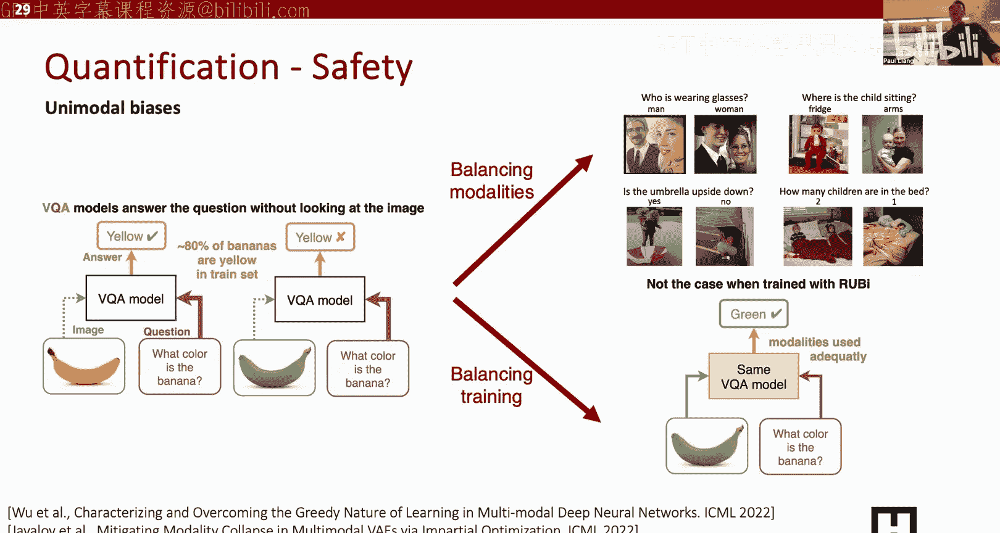

**模型量化的具体挑战包括**：

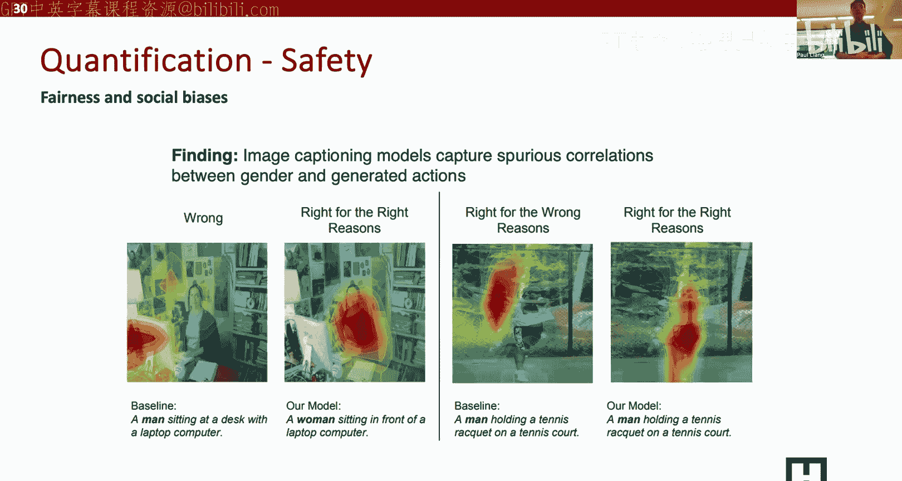

*   **安全性与社会偏见**：大型语言模型容易产生性别、种族等偏见。在多模态模型中，偏见可能被复合放大（“最坏情况叠加”）。对抗“越狱”攻击是一个持续挑战。
*   **鲁棒性**：模型在训练数据上表现良好，但在面对真实世界的噪声、分布外数据时性能可能大幅下降。研究表明，性能越高的模型，其鲁棒性下降可能越严重。
*   **可解释性**：可视化神经元、计算输入梯度以高亮重要区域等方法有助于理解模型。
*   **量化评估本身的挑战**：如何评估我们对模型属性的理解是否正确？因为没有现成的“地面真理”。我们提出两种间接评估方法：
    *   **人类模拟测试**：如果人类能够模拟模型在正确和错误情况下的预测，说明模型更可理解。
    *   **人类调试测试**：如果人类基于对模型属性的理解，能够实际发现并修复模型中的错误，也证明该理解是有效的。

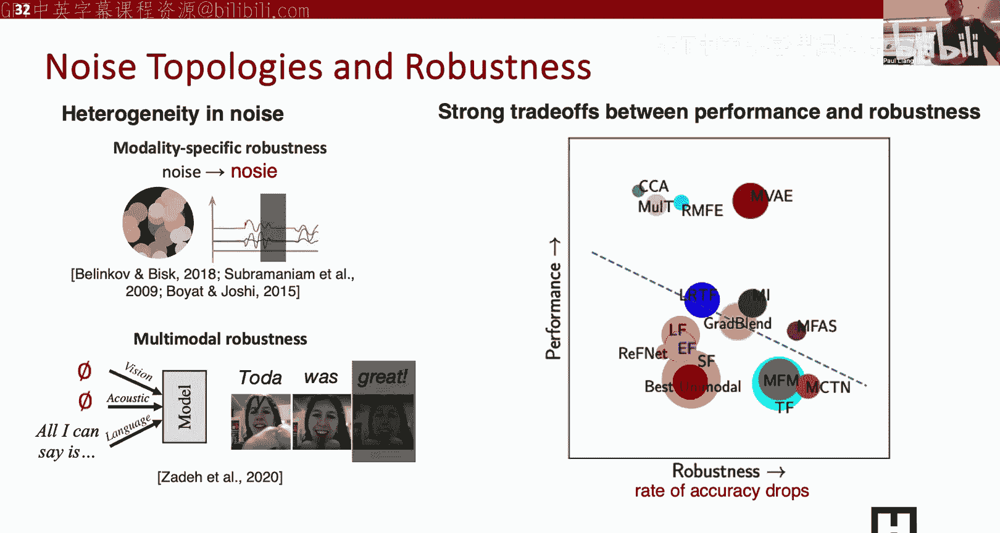

---

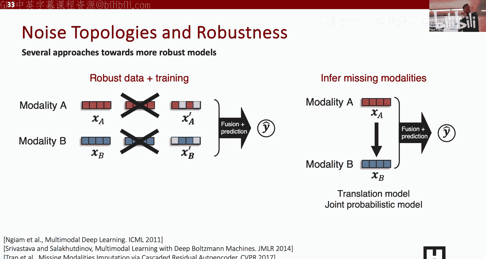

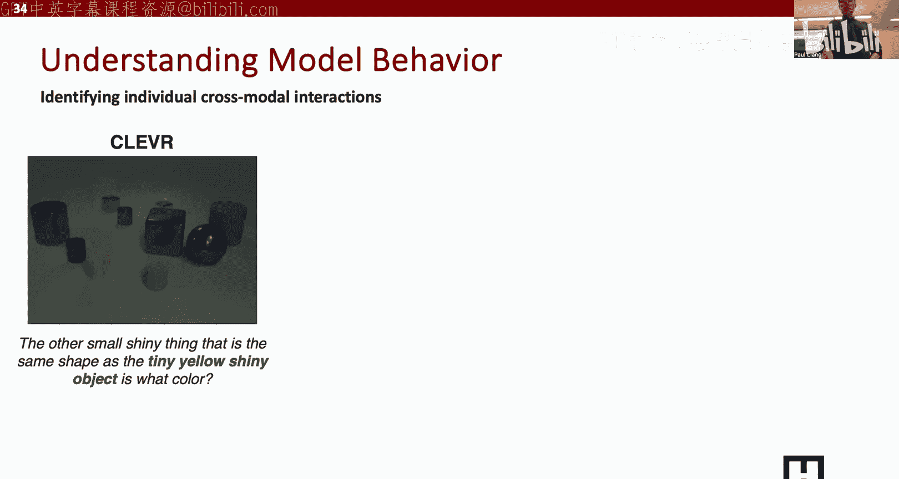

## 总结

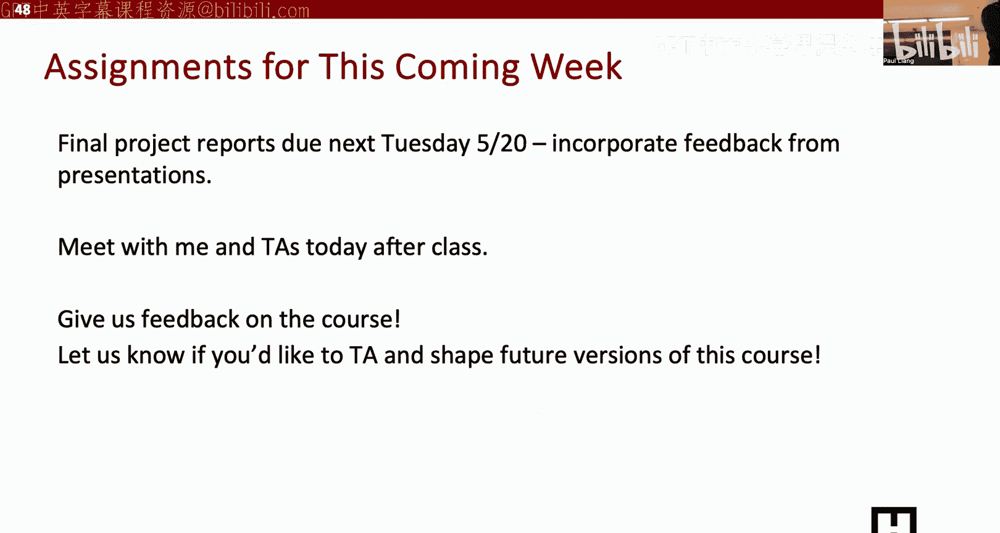

本节课中我们一起学习了人机交互的前沿方向。我们回顾了多模态推理的框架与挑战，通过“交互式草图板”案例看到了多模态交互在教育中的应用。我们探讨了智能体系统的关键问题，如分层规划、不确定性处理、搜索以及从数字世界到机器人领域的延伸。最后，我们审视了人机交互面临的根本问题，并强调了模型量化在理解、控制AI模型以及确保其安全、鲁棒方面的重要性。随着AI系统日益强大和普及，如何设计使其与人类有效、安全、可信地协作，将是未来研究的核心。