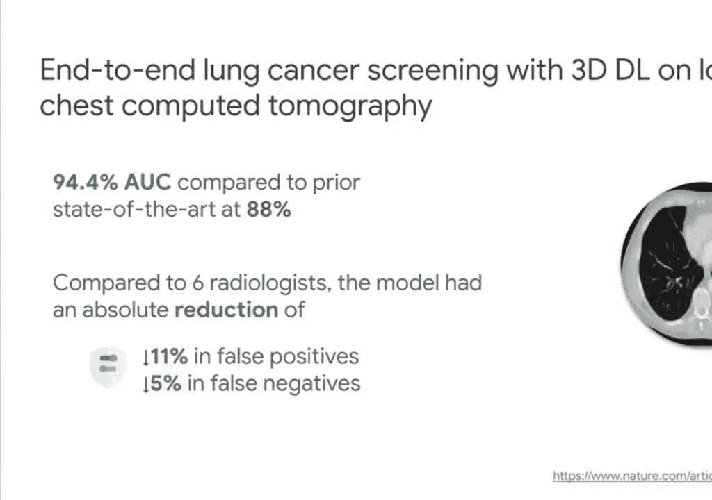
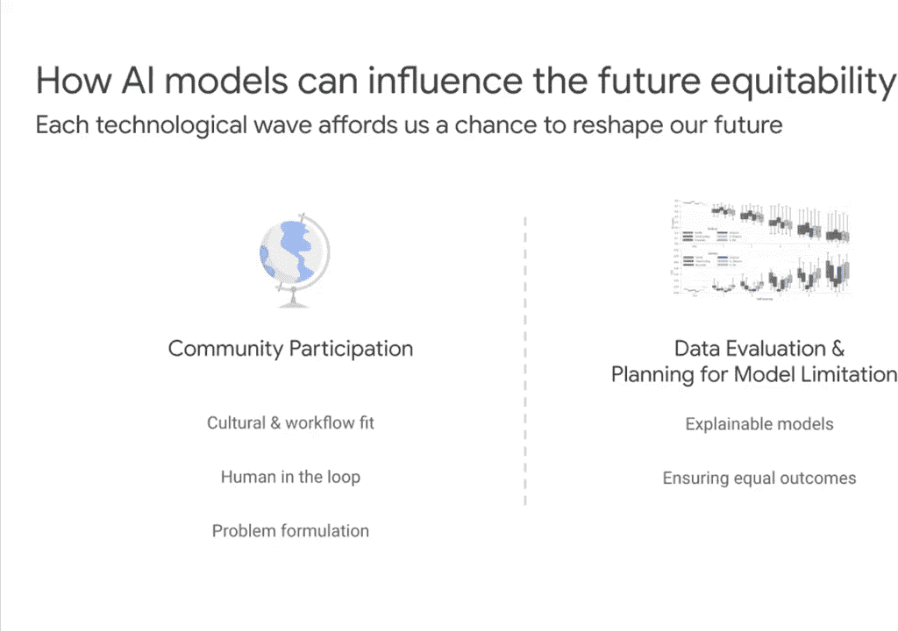
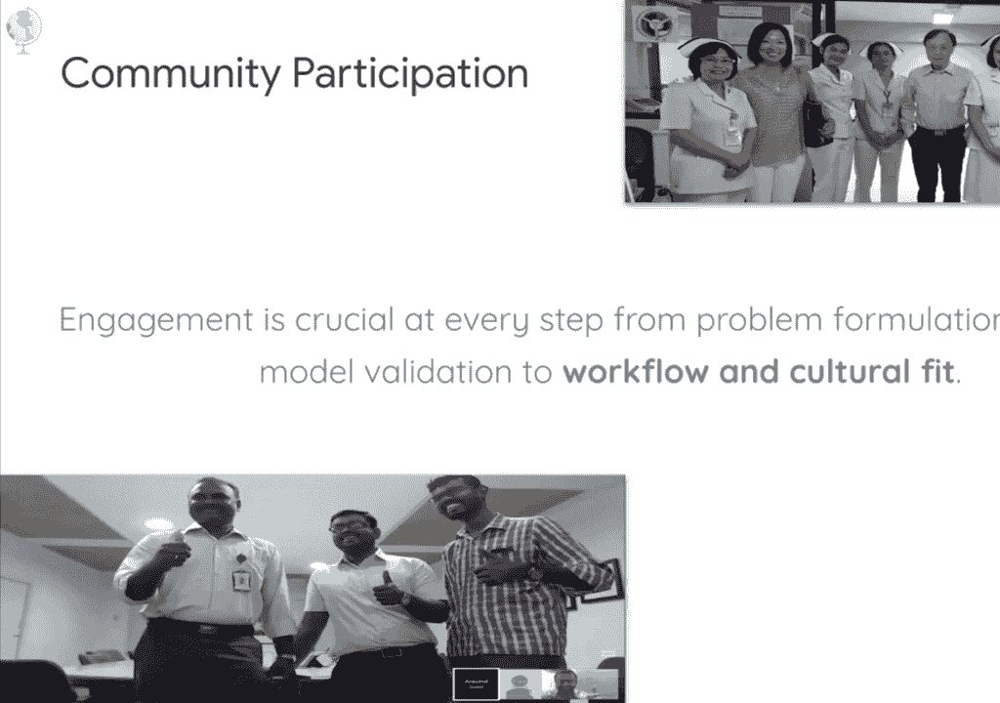
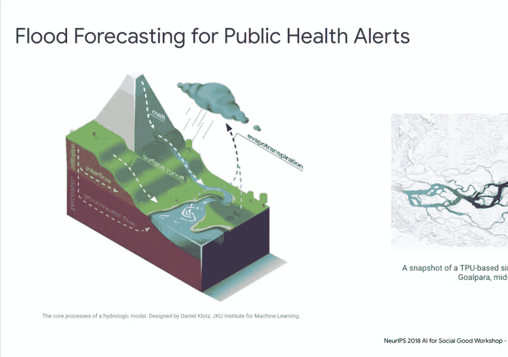

# 【双语字幕】MIT《深度学习导论(6.S191)》课程(2021) - P12：AI in Healthcare - 爱可可-爱生活 - BV1jo4y1d7R6

我在谷歌工作了16年，过去六年，我一直在生命科学和医疗保健，我通常喜欢运行更多的互动课程，嗯，给定群体的规模，我们认为民意调查可能会奏效，所以我会在整个谈话过程中发起几个民意调查。

我也会试着留意聊天记录，如果你们有问题，但是嗯，我也可能把它们留到最后，我先说一下议程。

我希望能给你一些关于人工智能的信息，特别是深度学习和医疗保健，我将互换使用人工智能和深度学习，因为这只是我们团队的名字是谷歌AI嗯，但你将看到的例子都是深度学习的例子，嗯，如你所知。

人工智能确实包括其他东西，如机器人技术和非神经网络方法，所以我只想说清楚，当我使用它们的时候，我不需要把它们完全混为一谈，一旦我介绍了一些关键的应用程序，我们在人工智能和医疗保健方面所做的一切。

我想和你讨论一下什么样的独特机会，我想我们有是因为深度学习，能够创造一个更加公平的社会，当我们部署人工智能模型时，我们可以谈谈这是如何可能的，最后，我将谈到人工智能和医疗保健的最后一组应用程序。

在这里的末尾，所以呃在，就人工智能和医疗保健背后的历史而言，我们受益于深度学习的成熟，尤其是端到端功能，在那里我们可以直接从原始数据中学习，嗯，这对计算机视觉和语音识别的进步非常有用。

在医学领域极具价值，另一个区域，大家都知道，通过GPU本地化计算能力的增加，这使得神经网络的性能优于，过去的非神经网络，第三个是所有这些开源的价值。

大型标记数据集和Magenet是非健康相关领域的数据集，但有我呃，公共数据集，如英国生物银行，甚至模仿，这非常有帮助，它实际上是在麻省理工学院实验室开发和生产的。

所以你会听到人工智能在医疗保健中的一些应用，下一个，我们做的一件事是确保，我们关注行业的需求，并将其与技术能力相匹配，医疗保健每年都有大量复杂的数据集，估计它正在产生，每年几千艾字节的健康数据，嗯。

只是为了正确看待这一点，据估计，如果你把互联网数据，嗯，这大约是数百艾字节的东西，所以它是它的几千倍，嗯，我们现在看到的是，稍后您将看到的应用程序是模式检测，以及识别病变和肿瘤的能力，和非常微妙的图像。

它有用的另一个领域是寻址，全球有限的医学专业知识，如果你往右边看，你想看的是一位医学专家，像放射科医生，人口中约有一万二千人，但是你可以在右边的图表上看到在发展中国家。

看起来更像是一到十万或者一到一百万，甚至，因此人工智能在医疗保健中的好处，它可以帮助扩展到运行一些有价值的复杂任务，许多专家都有能力，第三是真正解决人类的不一致，我们会谈谈这个。

尤其是当我们谈论生成标签的时候，嗯，人工智能模型没有明显的近因或认知偏差，嗯，他们也能够不知疲倦地工作，当你不得不加班时，这是一个问题，但就像在医学领域一样，这是经常发生的，让我来谈谈下一个应用程序。

也就是肺癌，但我们开发的是一种计算机诊断，在这种情况下是为了用低剂量CT帮助筛查肺癌，扫描，嗯，你通常会看到存活率急剧上升，如果你在早期感染，但是大约80%的肺癌没有早期发现，和我。

他们通常用来做这些筛查的是这些低剂量的CT扫描，如果你看这个图，向右边，是发生在你整个身体上的三维成像，它创造了数百张图像供放射科医生查看，和我，肺癌的征兆很微妙，所以我们的模型能做的。

我们认为这不仅仅是超越了最先进的技术，但实际上更重要的是，我们把它和放射科医生做了比较，看看假阳性和假阴性是否都有绝对减少，所以假阳性会导致系统的过度使用，假阴性会导致，呃。

不能足够早地感染癌症，通常一旦你们都减少了。

病理学是另一个难以深度学习的领域，甚至更复杂的数据，这是左边的一个，你可以看到当你做活检的时候，你有身体组织的切片，这些被放大了四十倍，并在每张幻灯片上创建大约10到15个数据像素的信息。

本质上复杂的部分是当你做病理学时，你想知道A放大了，呃，职等，这个组织的高度放大水平，这样你就可以描述病变的特征，你还需要了解整个组织结构，为它提供上下文，所以在较低的功率下，所以你有一个多尺度的问题。

嗯，这也是嗯，固有的复杂，呃，能够区分良恶性肿瘤，有数百种不同的病理会影响组织，所以能够在视觉上区分是非常有挑战性的，我们建立了模型，嗯从检测乳腺癌啊，嗯，病理图像，病理学家实际上没有假阳性。

该模型能够捕捉到更多的癌症病变，所以大于95%，相比之下，病理学家得到的73%，但也增加了假阳性的数量，嗯，这意味着我们尝试的，呃，然后就是结合起来让模型和病理学家一起工作，看看精度能不能提高，然后它。

它绝对做到了，嗯，这种共同努力也导致了一种增强显微镜的发展，在那里你可以看到模型，嗯嗯，检测微软内部的补丁，显微镜视图本身，我们会回到这样一个事实，即模型有某些弱点，我们是如何处理的。

后来的基因组学是另一个领域，呃，显著受益于深度学习，值得注意的是，当你做全基因组序列时，你所做的就是把你的DNA撕成十亿，大约一百个碱基的读数，嗯，有大约30倍的误差采样，当你这样做的时候，嗯。

当你尝试，和，呃，弄清楚顺序，你想做的是像拍摄一样的事情，星期日报纸的三十年，三十份，每份都有错误，然后把它们切成二十个字的片段，然后你试着把它们重新组合在一起，啊，这就是当你做测序时发生的事情。

嗯，所以我们把这个问题重新定义为深度学习问题，呃，我们研究了图像识别是如何，特别是卷积神经网络将能够在这个空间中执行，开发了一个名为Deep Variant的工具，这是开源的，可供呃，供任何人使用。

随着时间的推移，我们一直在改进它，这被证明是一个非常准确的，嗯，美国食品和药物管理局每隔几年举办一次精确的美国食品和药物管理局竞赛，它是，呃，表现出色，大多数人在四分之三的准确性领域获奖。

你可以在右边看到当你，在视觉上很明显，当你在测序中得到假变异的错误时，嗯，所以这是一个聪明的方法，但是。

所以我们讨论了医疗领域的不同需求，其中之一是有限的医学知识，有一种方法可以帮助他们，这是扩展他们运行的任务，这样它们就可以自动化了，这是另一种穿衣方式，这是医生的回归时间。

发生的事情就是你在这张照片中看到的，是一个把自己的经历，看医生时，你可以看到医生实际上是对着左边的电脑，嗯，这在医疗保健行业引发了许多关于技术成本的讨论，以及它是如何干扰病人护理的，嗯。

医生们现在在这一点上，每天花大约六个小时与他们的电子健康记录交互，输入数据，能够支持的时机成熟的领域之一，嗯，医生是要，呃，抄写员，人类抄写员已经被部署，医学听写已经变得更好了。

自动语音识别现在有了非常精确的端到端模型，嗯，它在自然语言处理方面也有显著的改进，所以这些都是更像是一种辅助人工智能的方式，帮助医生减轻文件的负担，我现在就开始投票。

只是为了看看人们认为什么是最有价值的应用程序，让我看看这里，如果我能做到，我只是想快速回顾一下，有计算机诊断，这对筛查和诊断很有用，有一个，放射学证明了这一点，嗯，有证明的预后，嗯，那病理学对。

确定治疗学，能够确定治疗效果，和疾病的进展，嗯，这就是病理学和基因组学被高度利用的地方，然后返回专家的时间实际上是通过医学听写来帮助人工智能，开处方，伟大，所以让我继续走，当城邦走的时候，嗯。

我想谈谈我们如何实现更大的登月计划，所以让我退一步，哪里啊，我们看看医疗保健是如何，医疗保健的角色现在看起来，它充满了巨大的碎片，这是相当客观的，它是呃，分布不均，我注意到的一件事是，在技术方面，嗯。

如果你把它应用到一个系统上，我们确实会放大它，所以科技是一种既增强又扩大现有事物的方式，嗯，所以如果你有，如果你把它应用于一个有不正当激励的破碎系统，它不会从本质上修复系统，它会加速它。

但机器学习的核心，嗯，而这些深度学习技术，我们正在做的是，我们正在非常仔细地查看数据，并利用这些数据来，按成果分列，在这种情况下，鉴于世界并不充满公平，你冒着训练错误模型的风险。

我们还发表了一篇论文来帮助解决这个问题，所以说，社会，不平等和偏见往往被编纂成法典，在我们使用的数据中，嗯，我们实际上有机会检查这些历史偏见，当我们开发模型时，积极促进一个更公平的未来。

你可以通过纠正训练数据中的偏差来做到这一点，嗯，你也可以在模型设计中纠正偏差，和问题的表述，你想解决的是什么，我们一会儿再谈这个，呃最后，如果这些都不适用，那你啊。

您还可以测试和确保平等的结果和资源分配，当你部署人工智能模型的时候，所以这是，嗯，我以前在谷歌X工作，这就是谷歌在月球拍摄方面的努力，我们定义月球拍摄的方式是一个巨大问题的交集。

突破性技术和激进解决方案，这里的一个大问题是世界是不确定的，不带人情味，它也需要更高的精度，嗯，我们现在有一项突破性的技术，也就是人工智能和深度学习，嗯，我只想说。

数字移动工具实际上是医疗保健的突破性技术，因为他们往往落后于其他行业大约十年，做规定，安全隐私和质量需求，嗯，所以一个激进的解决方案是我们，我们实际上考虑的不仅仅是提高我们提供的护理质量。

但要确保当我们这样做的时候，我们也使它更加公平，在我看到技术浪潮发生的每一个时间点，嗯，我确实意识到，在这一点上，这是我们重塑未来的机会，所以在嗯的情况下，深度学习，我想谈谈真正搬家的机会，嗯。

所以我没有意识到幻灯片没有前进，嗯，我想谈谈让人工智能模型更加公平的机会，我们将如何做到这一点，所以我要讲的两个关键领域是社区参与，嗯，以及这将如何影响模型，和在数据评估中，嗯，然后规划模型限制。

我们如何有效地做到这一点。

ai，我们做的一件事就是与这些地区合作，我们将直接部署模型，左边以此类推，在这里，你可以看到我们和印度的团队一起工作，嗯，在右边，是我们的团队和泰国的人一起工作，i，我们发现社会经济状况绝对重要。

就您将在哪里部署模型而言，嗯，一个例子是当我们用，啊，眼科，嗯中心，这就是眼病发生的地方，糖尿病是世界上日益增长的失明原因的主要原因，这是模型开发的地方，但实际上，在糖尿病中心，用例最严重。

所以内分泌科办公室和人们没有跑一百米，从内分泌科办公室到那里的距离，到眼科办公室，嗯，因为访问问题，然后呃，挑战与嗯，用线条等等所以这是我们探索的一个领域，探索，广泛使用用户研究来确保我们仔细考虑。

人工智能模型将在哪里着陆，这将如何影响。

我们看到的是当我们为模型生成标签时，你可以在左边看到，就像你所期望的那样，当你得到更多的数据，嗯，模型不断改进，所以它在这里变平了，有六万张图像，嗯，在某个时候，这就足够了，你不会从中得到更多的改善。

你实际上从中受益，如果你看右边的图，我们的改进，标签的质量，或者我们所说的图像上的等级，每个医生给出一个图像和等级，这是他们对他们认为自己看到的东西的诊断意见，嗯，因为我们对单个图像有多种意见。

并且能够调和我们能够不断改进模型输出。

嗯，并提高精度，所以这是嗯，医疗保健领域经常说的话，如果你问三个医生，你有四种意见，因为，嗯，随着时间的推移，甚至医生自己也可能与自己不一致，处理这一问题的方式，嗯，在一些国家是使用德尔菲法。

它是在冷战期间发展起来的，在个人意见不同的地方，它有助于确定共识，我们开发了一个工具来对不同的意见进行异步裁决，嗯，这导致了更高的地面，真理，数据创建，和，这是因为医生有时会错过什么。

另一个医生注意到的，所以他们通常会和解，并能够就实际的严重程度或诊断应该是什么达成一致，所以这是我们看到的，真的，这真的很有影响力，因为，嗯，当我们和眼科医生一起做分析的时候。

我们会看到医生们60%的一致性，嗯。

这是一种实际解决差异水平的方法，这是我想谈论的社区参与的最后一个领域，嗯，如果你更深入地研究问题的表述，就会发现这一点，这是一个他们不认为，通过对他们的模型和算法的输入，这个算法试图确定。

社区的使用需求，他们用，作为实际健康需求代理的um健康成本，这导致了，呃，呃，无意中的种族偏见，因为花在黑人病人身上的钱少了，嗯，这是在事实发生后被抓住的，所以如果你再点击一次，这是关键区域之一。

在哪里，嗯，有来自社区的投入，呃其实早就发现了，当他们在做算法开发的时候，这是我们现在经常练习的事情，我知道你们在做项目，所以呃，这将是我想发布的民意调查之一，只是，我们看看能不能让它发射，是呃。

其中哪一个，嗯，方法实际上是潜在的相关的，为了嗯，你们正在做的项目，好的，伟大，我会继续说下去，然后呢，当这个被保存下来的时候，在左边回顾一下是很好的，这里我前面提到过。

我们的病理模型在假阳性方面有一定的弱点，嗯，但它也比病理学家捕捉到了更多的癌症忠诚，所以我们开发了一种方法来解释模型，图像查找，然后呃，这是允许发生的，是嗯它，它使用了一种聚类算法能够找到不被称为四个。

给病理学家，这可能是实际诊断或预后的有意义的指标，嗯，在这种情况下，我，病理学家已经开始使用该工具从中学习，然后嗯，病理学家也有好处，能够识别模型的任何问题并通知模型进行改进。

所以你得到了模型的良性循环，右边的病理学家互相学习，是我们用来解释模型输出的另一种方式，你可以看到显著性图，这是一种，只是嗯，能够识别哪些特征是，嗯一个，模型其实是在关注，在这种情况下。

模型关注的是哪些像素，把它们点亮，我们这样做是为了知道，嗯，模型实际上决定诊断的方式，不管是特殊的皮肤状况，嗯，我，他们正在看实际的皮肤异常，而不是某面，与肤色或人口统计信息的潜在相关性。

所以这对你来说很有价值，作为检查模型的一种方式，最后我提到的是对平等结果进行模型评估，嗯，里面有东西，在皮肤科领域被称为菲茨帕特里克皮肤类型，它可以让你看到不同的肤色，我们所做的是用不同肤色的测试集。

做模型评估，看看我们是否得到了同样的结果，作为模型开发人员你必须做出一些艰难的选择，如果你发现你的模特在某一特定类别或人口统计中表现不佳，理想情况下发生的事情是，您补充您的数据集。

这样您就可以进一步证明您的模型能够适当地解决这些区域，或者你可能不得不决定限制你的模型，这样就可以有平等的结果，嗯，有时你实际上并没有选择不部署模型，所以这些是发展人工智能的一些现实世界的含义。

医疗保健领域的模型，我想和这个小组讨论的最后一个申请是，嗯保健的概念，在过去，医疗保健通常是，嗯，我为病人想到的，虽然每个病人都是一个人，不是每个人都是病人，和，嗯，病人通常被认为在这里的左边。

生病或有危险的人，他们正在进入医疗保健系统，当你想到这种性质的人时，模型是完全不同的，他们是否患有急性或慢性疾病，嗯，他们是我们刚才谈到的，它们是筛选诊断，预后治疗，这些是模型倾向于关注的，嗯。

如果你在看人们，他们被认为是引用未引用的，嗯，嗯，但它们的健康每天都受到我们所说的，健康的社会决定因素，你的环境和社会环境，你的行为和生活方式选择，嗯和嗯，你的基因是如何与环境相互作用的，然后嗯。

就如何处理这个问题而言，这里的模型看起来截然不同，他们倾向于专注于预防性护理，所以边吃边睡，好好锻炼，他们还关注公共卫生，我认为这是一个很大的，嗯，所以嗯，当我们谈论公共卫生时，可以有流行病学模型。

这些都是非常有价值的，但也有，嗯，你知道，现在正在发生的事情，尤其是可能对公众健康最大的全球威胁之一是气候变化。

所以在印度这样的地方正在发生的事情之一，印度公共卫生警报的洪水预报，实际上有很多警觉疲劳，所以实际上不清楚他们什么时候应该关心警报，或者不是，嗯，这个团队所做的是。

他们专注于建立一个可扩展的高分辨率水力模型，使用卷积神经网络来估计输入，如降雪量，土壤水分估算与渗透性，这些水力学模型模拟了洪泛区的水行为，嗯，而且比以前使用的要准确得多，这是我现在被部署来帮助警报。

和整个印度地区在季风季节，嗯。

所以我只想给这个团队留下这样的想法，呃，呃，在气候变化方面，现在有很多事情要做，嗯，自然对健康植入至关重要，还有住在上面的人，所以呃，我们目前依赖这些生态系统服务，这意味着人们依赖清洁的空气，供水。

粮食农业授粉，土地稳定和气候条例，这是一个人工智能成熟的领域，能够帮助更好地理解和重视，那些我们目前没有支付很多费用的服务，但我们将来可能不得不，所以最后一张幻灯片。

让我们看看我们是否能让它出现在投票中，嗯，我只是想比较一下了解人们对健康的看法是否有什么不同，嗯，人工智能应用于什么可能是最令人兴奋的，谢谢你推出最后的PO，而且那个。

我离开团队的最后一件事就是我们所做的工作，人工智能和医疗保健是可能的，有一个庞大的团队和大量的合作发生在医学研究中，所以就是这样，呃，你知道的，这是我们的团队，随着它多年来的成长，以不同的形式。

因为我们的团队不再是所有人了，但这肯定是许多工作产生的地方，现在让我看看聊天中的问题，所以我就回顾一下投票结果，所以看起来，嗯，诊断模型，嗯，呃，哦耶，所以我猜你们可以做多项选择，你可以选择多个。

所以五六十人，一半的人认为诊断和治疗是有价值的，也不太感兴趣，但仍然有价值的援助，谢谢你填表，绝对让我看看问题，鉴于新车型的快速发展，这是什么意思，将ML诊断解决方案扩展到世界各地更多人的瓶颈。

但是满足监管需求的监管自动化，诊断用长杆，确保病人安全，适当规管，通常你会通过FDA或C标记，这可能需要一段时间，必须建立质量管理体系，从开发的角度确保这个系统是健壮的，所以它是作为医疗设备的软件。

这永远是真的，当你和病人打交道时，嗯，就另一部分而言，也许是开源的，嗯，有更多的标记数据集，这样每个人都可以进入并向前移动空间是有价值的，这里有一个很好的问题。

良好的数据集对于开发有用的公平模型至关重要，我们需要投入哪些努力和技术，继续收集数据集并形成更多模型，正在发生的事情之一是开发一个可伸缩的标签基础设施，这是能够，更好的数据集。

但原始数据也是直接反映结果的数据，这是有价值的，所以嗯，一个例子是，如果你在想，直接来自用户的数据，就他们的生命体征或生理信号而言，这些东西离地面很近，你能得到的关于个人福祉的真相，很明显。

但我们在Covid 19中看到的是，获得信息就更难了，就像嗯，实际发生了多少死亡，这些死亡的原因是什么，所以这些是需要，这些管道需要在…的背景下考虑，他们怎么能支持公共卫生产品。

这些数据是如何准确地传出去的，所以我们现在确实有一个努力，很多人都加入了，那是嗯，呃现在在GitHub上，我可以为以后提供一个链接，嗯，是志愿者建立了一个透明的数据管道，对于数据来源的来源。

跟踪是非常重要的，当您创建这些数据集时，以确保您知道，在哪里，什么，数据的用途是什么，和，嗯，谁有多可靠，源头来自哪里，所以说，这些都是需要建立的东西，通知您构建的模型，最后一个问题。

你如何促进对与你正在开发的产品相关的潜在算法偏见的对话意识，几件事之一是你建立的团队和他们一样多，可以反映一个，代表更广泛的人群实际上比，我想人们意识到我所说的，也就是说。

如果你有一个多样化的团队在工作，或者你带来的人可以是贡献者，或者嗯，能够反思问题的财团的一部分，你试图解决的空间，那其实是，嗯，一个很好的倾听方式，发现你以前可能从未想过的事情，嗯，但又一次。

它可以从你建立的团队开始，然后你周围的网络，你实际上从那里得到反馈循环，你知道的，如果你能负担得起，你，你会想用一种相当可测量和定量的方式来做到这一点，但如果你不能，它是，积极主动地。

就你要去什么空间进行对话，以及你将如何考虑模型的输入，所有的权利，所以谢谢你，呃。

