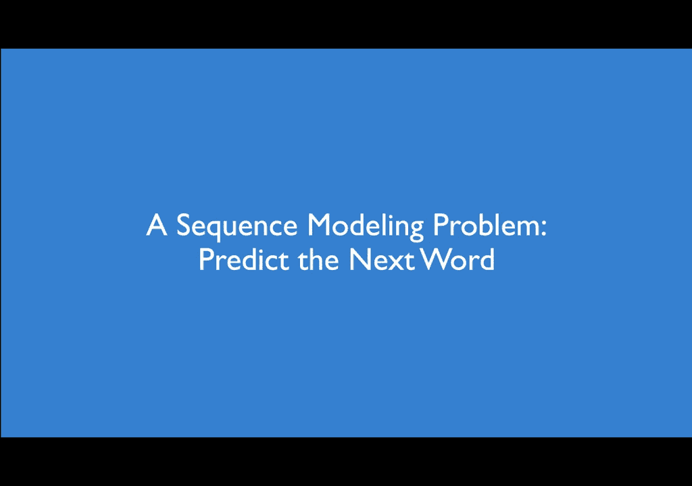
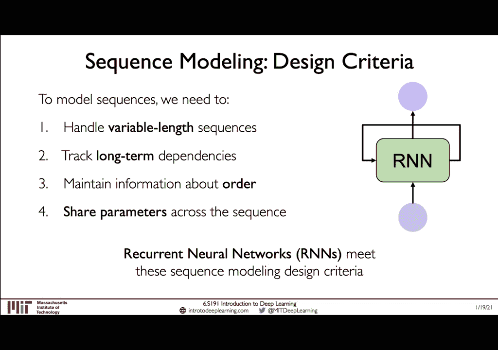
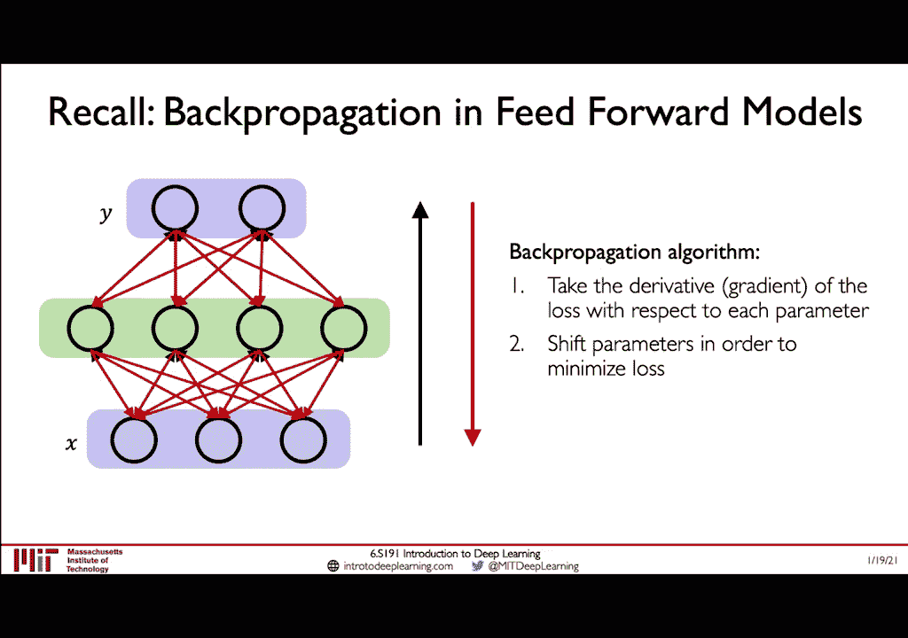
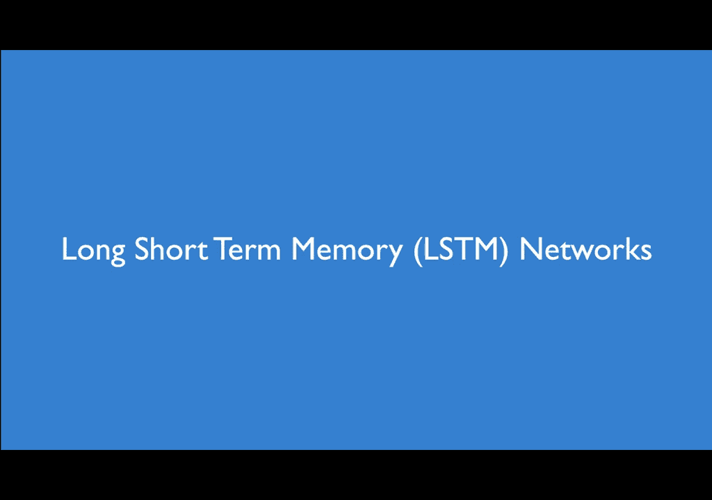
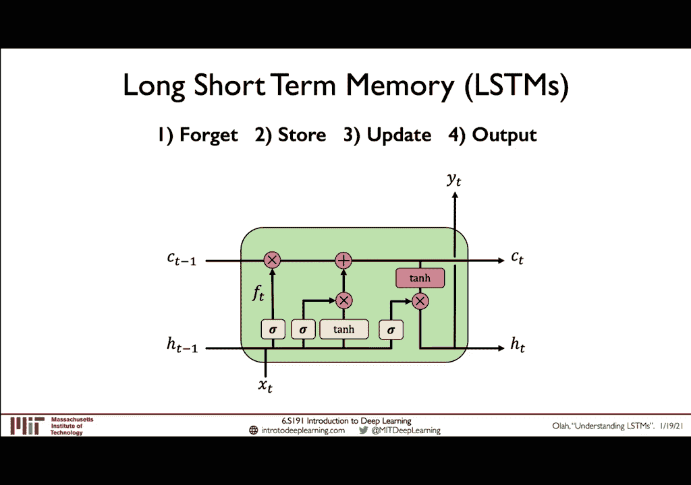
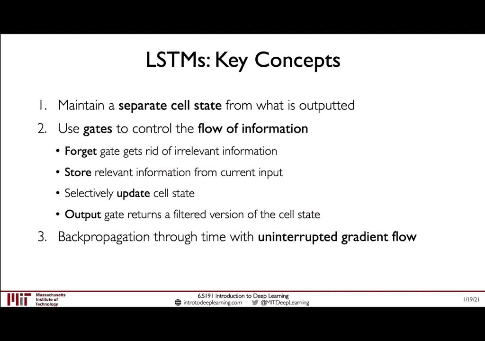

# 【双语字幕】MIT《深度学习导论(6.S191)》课程(2021) - P2：Recurrent Neural Networks - 爱可可-爱生活 - BV1jo4y1d7R6

大家好，我叫Ava。我是6。S191的讲师和组织者，欢迎您参加第2讲，这将专注于深度序列建模。因此，在与亚历山大的第一次演讲中，我们了解到，关于神经网络的本质，并建立了从感知器到感知器的理解，前馈模型。

接下来，我们将注意力转向将神经网络应用于问题，其中涉及到数据的顺序处理，我们将了解为什么执行此类任务，要求的网络架构与迄今为止所见的不同。为了加深对这些类型的模型的了解，我们将逐步完成此步骤。

从直觉开始，逐步了解这些网络的工作方式，并在何处建立网络，我们放弃了第一讲中介绍的感知器和前馈模型。所以。

让我们继续深入。首先，我想激发我们在顺序建模和建模方面的意义。通过一个非常简单的直观示例开始进行顺序处理。假设我们有，这张照片是一个球，我们的任务是预测它要去往下一个地方。

没有有关球的历史或对球的了解的任何先验信息，它的运动动力学，其下一个位置的任何猜测都将恰好是，只是猜测。但是相反，如果除了球的当前位置，我还给了它，以前的位置现在我们的问题变得容易得多。

我想我们都可以同意我们拥有，感觉球将传到下一个位置。所以希望这个直观的例子，使您了解我们在顺序建模和顺序预测方面的含义。

事实是，顺序数据和这些类型的问题确实存在于我们周围，诸如来自我的语音的波形之类的音频可以分解为一系列声波，可以将文本分为字符序列或单词序列，当此处每个这些字符。

字符或每个单词都可以看作是我们序列中的时间步，现在，除了这两个示例之外，还有更多的情况是顺序处理，从医学信号到心电图到股票价格预测到基因组或遗传学都可以用。

数据及其他数据，现在我们已经了解了顺序数据的外观，让我们，考虑一些在实际世界中发挥作用的具体应用，在第一堂课中，亚历山大介绍了前馈模型，从固定和静态输入到固定和静态输出的一对一方式，例如。

他给出了这种二进制分类的用例，我们试图建立一个模型，让这个班级的学生得到一个单一的输入，可以接受训练以预测该学生是否会通过这种类型的，例子中没有时间成分，没有序列或顺序数据的内在概念。

当我们考虑序列建模时，我们现在将可能性的范围扩展到可以，涉及时间输入以及潜在的顺序输出，例如，让我们考虑一个语言处理问题的情况，其中有一个句子是，输入到我们的模型中，并定义一个序列。

其中句子中的单词是单个单词，时间顺序，最后我们的任务是预测一个输出，该输出将，是与该序列输入相关的情感或感觉，您可以想到这个问题，作为具有单个输入的序列输入或作为多对一序列问题。

我们还可以考虑相反的情况，此时我们的输入不具有该时间维度，因此，例如，当我们考虑静态图像时，我们的任务是产生一系列输入，的输出，例如描述此图像中内容的句子标题，您可以将其视为一对多序列建模问题，最后。

我们还可以考虑许多情况，我们现在正在翻译，从一个序列到另一个序列，也许是最著名的例子之一，应用程序的类型是机器翻译，目标是训练模型以进行翻译，从一种语言到另一种语言的句子都可以。

因此希望可以给您一种具体的感觉，现在，顺序建模变得非常重要的用例和应用程序，我想继续前进。

了解我们如何实际构建神经网络来解决此类问题，并，有时候，围绕我们如何添加这种时间性的想法可能有些挑战，我们的模型的尺寸，以便解决这个问题并建立真正的直觉，我想，从最基本的基础开始。

我们将首先回顾一下感知器，我们将一步一步地发展出对改变需求的真正扎实的理解，为了能够处理顺序数据而对我们的神经网络体系结构进行了处理。

好的，让我们回想一下我们在第一堂课中学习的感知器，我们定义了一组输入，可以通过xn调用x1，这些数字中的每一个都将与权重矩阵相乘，然后将它们全部加在一起以形成感知器的内部状态，我们将说是z。

然后将此值z传递给非线性激活函数，产生预测性的输出，并记住，使用感知器，您可以拥有多个，输入信息，由于您在本次讲座中总体上了解，我们正在考虑顺序，建模我希望您将这些输入视为序列中的单个时间步。

我们还看到了如何从单个感知器扩展到现在的感知器层以产生，多维输出，所以例如在这里，我们有一层绿色的感知器，取蓝色的三个输入并预测紫色显示的四个输出，但这又是一次，有时间或顺序的概念，不是。

因为我们可以再次输入和输出，认为是从序列中的固定时间步开始的，所以让我们简化此图吧，为此，我们将隐藏层折叠到此绿色框以及我们的输入和输出，向量将如此处所示，同样，我们的输入x将是一些长度为向量的向量。

m，我们的输出将是长度n，但是我们仍然在考虑输入，在这里用t表示的特定时间与我们在第一堂课中看到的没什么不同，即使使用这种简化的前馈网络表示，我们也可以天真地。

尝试通过一次又一次地应用同一模型来将序列输入该模型，对于我们序列中的每个时间步，都有一个了解，以及如何处理这些个体，跨不同时间步长的输入首先让我们旋转上一张幻灯片中的同一张图。

所以现在我们又从某个时间步长t获得了输入向量x t，将其输入到神经元中，网络，然后在该时间步获得输出矢量，但由于我们对顺序数据感兴趣，假设我们不仅有一个单一的时间步长，而且还有多个独立的时间步长。

从假设时间零开始，这是我们序列中的第一步，我们可以在，该时间步将其视为该孤立的时间点，并将其传递到模型中并生成一个，预测性输出，我们可以在下一个步骤中再次将其视为某种东西，隔离，下一个相同。

这里要强调的是，这里描述的所有这些模型都只是，在这些不同的时间步长中的每个步长处，具有彼此不同的输入的彼此的副本，但是我们知道我们的输出，并且在第一堂课中我们知道我们的输出向量。

y在特定时间sub t只是该时间步长的输入的函数，但是如果我们考虑顺序数据，让我们在这里退一步，很有可能稍后的输出或标签将以某种方式，取决于先前时间步长的输入，因此通过对待这些个体。

我们在这里所缺少的是，时间步长作为单独的孤立时间步长是顺序固有的这种关系，序列中较早输入的数据到序列中较晚预测的数据，因此，我们该如何解决我们真正需要的是一种关联计算的方法。

以及网络在特定时间步距之前的历史记录所进行的操作，从先前时间步的计算以及该时间步的输入，最后得到，能够将当前信息传递到当前信息上的一种前瞻性的感觉，未来的时间步长。

因此让我们尝试做的正是我们将要考虑的是链接信息和，彼此在不同时间步长的网络计算，特别是，引入这个内部存储器或单元状态，在这里我们将其表示为t的h，这将是，这种记忆将由神经元和网络本身以及这种状态来维持。

可以跨时间按时传递，这里的关键思想是，这种递归关系我们正在捕获一些关于序列看起来像什么的记忆概念，这意味着现在网络的输出预测及其计算​​不仅，输入在特定时间步的函数，还包括单元格状态的过去记忆。

用h表示，这意味着我们的输出取决于我们当前的输入以及，过去的计算和过去的学习，我们可以通过以下方式定义这种关系，这些将输入映射到输出的函数，这些函数是标准的神经网络，亚历山大在第一堂课中介绍的操作。

因此我们的输出再次是我们的预测，不仅取决于特定时间步的当前输入，还取决于过去的记忆，并且因为如您在此关系中所见，我们的输出现在是当前输入的函数，以及上一个时间步的过去记忆，这意味着我们可以描述。

这些神经元通过递归关系意味着，我们的单元格状态取决于当前输入，并取决于先前的单元格状态中的先前状态，并且此行右侧的描述显示了这些单独的时间步骤正在排序，跨时间展开，但我们也可以在此周期内描述相同的关系。

这在幻灯片左侧的循环中显示，该循环显示了这种重复发生的概念，关系，正是这种递归概念提供了直觉和关键操作。

在递归神经网络或rnns后面，我们将继续进行其余的，本讲座是在此基础上建立的，并增强了我们对数学的理解，这些递归关系和定义rnn行为的操作。

好的，让我们将此形式正式化一下，正如我提到的，这里的关键思想是，希望您能从本讲座中脱身的是，这些rnns保持了这种内部状态，t的h，随着序列的处理在每个时间步上更新并完成，通过此递归关系。

该递归关系具体定义了状态在时间步的更新方式，具体来说，我们定义此内部单元状态h为t，并且内部单元状态将变为，是一个函数，该函数将由可以由一组参数化的函数定义。

权重w是我们在训练这样的网络的过程中实际要学习的内容，w的函数f将以t的当前时间步长x的输入作为输入，以及t减去1的先验状态h以及我们如何再次找到并定义该函数，它将由一组权重进行参数化。

这些权重将专门用于学习，在训练模型的过程中，rnns的关键特征是他们非常，处理序列的每个时间步骤都具有相同的功能和相同的参数集，当然，在训练过程中权重会随着时间而变化，稍后。

我们将确切地了解如何进行训练，但是在每次迭代时，权重将应用于序列中的每个单独的时间步长。

好的，现在让我们逐步介绍更新rnns的算法，以更好地理解，这些网络的工作方式，我们将从初始化我们的网络开始，只是在此代码块中将其抽象为伪代码块中的rnn，我们还将初始化一个隐藏状态和一个句子。

让我们说我们的任务，这是为了预测网络中句子中的下一个单词，rnn算法如下，我们将遍历此句子中的单词，并在每一步中，将当前单词和先前的隐藏状态都输入到我们的rnn中，这将。

生成下一个单词的预测以及对隐藏状态本身的更新，最后，当我们处理完这句话中的这四个词时，我们可以对下一个词实际上是什么产生预测，通过将所有单个单词输入模型后，考虑rnn的输出。

好的，因为您可能已经意识到rnn计算包括这两个内部，单元状态更新为hft以及输出预测本身，因此现在我们将具体，逐步了解如何定义这些计算中的每一个，我们将考虑输入向量x的t。

接下来我们将应用一个函数来更新，隐藏状态，此功能是标准的神经网络操作，就像我们在，第一次讲课，再次是因为t的内部细胞状态h将取决于两个，输入t的x以及t的先前单元格状态h减去1，我们将它们相乘。

根据各自的权重矩阵计算单个术语，我们将添加结果，然后应用非线性激活函数，在这种情况下，它将是一个双曲线，与这两个项的和相切，以实际更新隐藏状态的值，然后在给定的时间步生成输出，我们将内部隐藏状态乘以。

它是由一个单独的权重矩阵生成的，该矩阵固有地产生了此内部状态的修改版本，这实际上构成了我们的输出预测，因此为您提供了背后的数学，rnn如何实际更新其隐藏状态并产生预测输出，到目前为止。

我们已经看到rnn被描述为具有这些内部循环，关于自己的反馈，我们还看到了如何将这个循环表示为展开，我们可以从第一步开始，然后继续跨时间展开网络，直到时间t为止，在该图中我们还可以明确表示权重矩阵。

从权重矩阵开始，该权重矩阵定义了如何转换每个时间步长的输入，在隐藏状态计算中以及定义的权重矩阵，先前的隐藏状态与当前的隐藏状态之间的关系，最后，在特定时间步将隐藏状态转换为输出的权重矩阵。

对于所有这些权重矩阵，在所有这些情况下都需要再次强调，我们将在序列中的每个时间步重复使用相同的权重矩阵，现在，当我们通过网络进行前向传递时，我们将在，每个单独的时间步长，并从这些单独的输出中。

我们可以得出，损失，然后我们可以将各个时间步长中的所有这些损失加起来，确定总损失，这最终将是，用来训练我们的rnn，我们将在几张幻灯片中确切地介绍如何实现这一目标。

好吧，现在这为您提供了直观的数学基础，我们实际上如何使前进通过我们的前进，现在让我们来看一个如何使用tensorflow从头实现rnn的示例，我们将使用一个图层来定义rnn，这样我们就可以从继承自。

亚历山大在第一堂课中介绍的图层类，我们还可以初始化权重矩阵，并最终将rnn的隐藏状态初始化为全零，我们的下一步将是，定义我们所说的调用函数，这个函数真的很重要。

因为它准确地描述了在给定输入的情况下我们如何通过网络进行正向传递，我们向前通过的第一步将是更新隐藏状态，根据同样的方程，我们在前面看到了隐藏状态，并将前一个时间步长和的输入x乘以它们的相对值。

将相关的波矩阵求和，然后通过非线性激活函数，接下来，我们通过乘以a来转换此隐藏状态，从而计算输出，单独的权重矩阵，并且在每个时间步上，我们都将当前输出返回为，以及隐藏状态。

所以这给人一种打破定义我们如何定义前向通过的感觉，通过使用Tensorflow的代码来实现，但很方便地已经实现了Tensorflow，您可以通过简单的rnn层使用这些类型的rnn单元，然后。

得到一些练习来做到这一点，然后在今天的实验室中使用rnns可以。

现在回顾一下，我们在本演讲的这一点上已经建立了对rnn的理解，和他们的数学基础，我想回到序列建模的那些应用中，前面已经讨论过，希望现在您已经了解了为什么rnns可以特别。

适用于使用前馈或传统神经网络再次处理顺序数据，我们以一对一的方式从静态输入变为静态输出，与序列相反，我们可以从具有许多时间步长的顺序输入中进行选择，随时间顺序定义，将它们输入递归神经网络并生成一个。

单个输出，例如与句子相关的情感或情感分类，我们还可以从静态输入（例如图像）移动到从一个连续输入到一个连续输出，很多，最后我们可以从顺序输入到顺序输出进行多对多和两个例子，其中包括机器翻译。

音乐创作以及音乐创作，一代人，您实际上将有机会实施rnn来做到这一点，在今天的实验室中，稍后我们可以将递归神经网络扩展到许多其他，顺序处理和顺序建模可能有用的应用程序。

真正理解为什么递归神经网络如此强大，我想考虑一下我喜欢称之为设计标准的具体集合，在考虑序列建模问题时，我们需要牢记，特别是，需要能够确保我们的递归神经网络或任何机器学习模型。

我们可能感兴趣的设备将能够处理可变长度的序列，因为并非所有，句子不是所有序列都将具有相同的长度，因此我们需要具备，为了处理这种可变性，我们还需要具有能够跟踪的关键属性，数据中的长期依赖关系。

并具有内存概念并与，这也是具有这种秩序感和对事物的感觉的能力。发生在序列中的更早或更早会影响将要发生的事件或稍后发生的事件，为此，我们可以通过权重共享和实际共享来实现第二和第三点。

整个序列中矩阵方式的值，我们将看到我现在正在告诉您，我们将看到递归神经网络确实符合所有这些序列建模设计标准。

好的，所以要具体了解这些标准，我想考虑一个非常具体的，给定句子中的某些单词序列，将出现以下序列建模问题，我们的任务是预测该句子中最有可能出现的下一个单词。

因此，让我们假设我们以这句话为例，今天早上我带我的猫去散步，我们的任务是让我们说今天早上给了我这些话，我带着猫去了，我们想预测句子walk中c中的下一个单词，我们的目标是尝试。

建立一个循环神经网络来精确地做到这一点，这是我们解决这个问题的第一步，在开始训练模型之前，首先要考虑的是如何，实际上代表了神经网络的语言，所以我们假设我们有一个模型，在该模型中输入，单词较深。

我们想使用神经网络来预测下一个单词，了解可能是，关于如何在输入中将这些信息传递到我们的网络方面，这里的问题请记住，神经，网络是函数运算符，它们在输入上执行函数数学运算，并生成数值输出。

因此它们无法真正解释和操作单词，如果它们只是作为文字传递的，那么我们在这里所要做的就是根本行不通，相反，神经网络需要数字输入，该数字输入可以是向量或数字数组，例如。

模型可以对其进行操作以生成向量或数字数组作为输出，因此这将对我们有用，但仅对单词进行操作就不可行，好吧，现在我们知道我们需要一种将语言转换为向量的方法，或基于数组的表示形式我们将如何解决这个问题。

需要考虑的是这种嵌入的概念，也就是将一组标识符转换为，对象有效地索引到固定大小的向量中，该向量可以捕获输入的内容，因此，想一想我们如何才能针对语言数据真正做到这一点，让我们再次转向。

回到今天早上我们一直在考虑的例句，我带我的猫去散步，我们希望能够映射出现在我们的语言体系中的任何单词，到一个固定大小的向量，所以我们的第一步将被生成以生成一个，词汇表将包含我们一组语言中的所有唯一词。

然后，我们可以通过映射单个唯一单词来索引这些单个单词，到唯一索引，然后可以将这些索引映射到向量嵌入，我们可以做到这一点的一种方法是生成将具有一定长度的稀疏矢量和二进制矢量。

这等于我们词汇表中唯一词的数量，这样我们就可以指出，通过在相应的索引中对特定单词进行编码，例如，cat这个词，我们可以在这个稀疏的二进制向量的第二个索引处进行编码，这是一个非常。

嵌入和编码语言数据的常用方法，称为“一种热编码”，您很有可能在通过机器学习和深度学习的过程中遇到此问题，我们可以建立这些嵌入的另一种方法是通过实际学习它们，所以这里的想法。

是采用我们的索引映射并将该索引映射馈入神经网络模型之类的模型中，这样我们就可以转换索引映射，跨词汇的所有单词到一个低维空间的向量，学习该向量的值，使得彼此相似的词，具有类似的嵌入。

此处显示了一个演示此概念的示例，好的，这是我们可以对语言数据进行编码和转换语言的两种不同方式，数据转换成向量表示形式，该向量表示形式将适合于输入到神经网络。

现在我们已经建立了这种方式来编码语言数据并实际获得，首先将其输入到我们的递归神经网络模型中，让我们回到那组设计，我们想要的第一个能力是处理可变序列长度的能力的标准，再来考虑一下这个任务。

尝试预测我们可能拥有的句子中的下一个单词，非常简短的句子，这些词会驱动我们预测的含义，彼此非常接近，但是我们也可以有更长的序列甚至更长的时间，顺序，其中预测下一个单词所需的信息发生在更早的时间。

而我们的递归神经网络模型的关键要求是，处理这些长度不一的前馈网络的输入无法执行此操作，因为它们具有，固定维数的输入，然后将这些固定维数的输入传递到，相反，rnns的下一层能够处理可变的序列长度。

这是因为，序列长度的差异只是时间步长的差异，将由rnn输入和处理，因此rnns符合第一个第一个设计标准，我们的第二个标准是有效捕获和建模数据中长期依赖关系的能力，像这样的例子中确实体现了这一点。

我们显然需要，在序列或句子中更早的位置以准确地使我们的预测rnns能够，之所以能够实现这一目标，是因为他们可以通过这种方式来更新其内部单元状态，我们前面讨论过的从根本上合并信息的递归关系。

从过去的状态到单元状态的更新，因此也要满足此条件，接下来我们需要。

能够捕获序列顺序中的差异，这可能导致整体差异，序列的含义或属性，例如，在这种情况下，我们有两个句子，语义含义相反，但具有相同字词且具有相同计数的字母只是顺序不同。

rnn维持的细胞状态再次取决于其过去的历史，这有助于我们，捕获这些差异，因为我们正在维护有关过去历史的信息，并在序列中的每个时间步长上重用相同的权重矩阵。

所以希望通过这个例子来预测一个句子中的下一个单词，特别常见的顺序数据类型是语言数据，这显示了它如何向您展示如何更广泛地表示和编码顺序数据，rnns的输入以及rnns如何实现这些设置序列建模设计标准集。

好的，所以现在我们在这个阶段的演讲中已经建立了直觉和理解，递归神经网络如何工作，如何运作以及对序列进行建模的含义，现在我们可以讨论如何实际训练递归神经网络的算法，它是。

在第一堂课中介绍的反向传播算法的一个变种，称为反向，随着时间的流逝而传播，让我们先回到第一步。

回想一下我们如何使用反向传播算法实际训练前馈模型，我们首先接受一组输入，然后通过网络从输入到，输出，然后训练模型，我们通过网络向后传播净梯度，然后我们就网络中每个权重参数得出损失的导数。

然后调整参数在模型中的权重，以最大程度地减少该损失。

对于我们之前走过的路网，是通过网络的正向传递，跨时间前进并根据输入以及先前的输入更新单元状态，状态产生输出并从根本上计算个体的损失值，时间顺序，最后将这些个别损失相加得出总损失。

而不是一次通过单个前馈网络反向传播错误，这些错误将从整体损失中传播回来，遍历每个单独的时间步长，然后贯穿各个时间步长，我们目前处于从头开始的顺序中，这就是为什么将其称为，通过时间进行反向传播。

因为您可以看到所有错误都在发生，从最近的时间步长回到序列的最开始。

现在，如果我们扩展此范围，并仔细研究一下渐变如何实际流过，重复的递归神经网络模块链，我们可以看到，在每个时间步之间，必须执行涉及h的权重矩阵wh的矩阵乘法。

因此计算相对于初始细胞状态h为0的梯度将涉及很多，权重矩阵的因子，以及相对于梯度的重复计算，这个权重矩阵可能有很多问题，首先是如果我们有，该系列中的许多值这是矩阵乘法链，其中梯度值是。

小于或大于1或权重值大于1时，我们可能会遇到以下问题：称为爆炸梯度问题，其中我们的梯度将变得非常大，我们无法真正优化，这里的解决方案是有效地执行所谓的“梯度裁剪”。

缩小特别大的梯度的值以尝试减轻这种情况，我们也可能遇到相反的问题，即现在我们的权重值或梯度非常非常大，小，这可能导致所谓的消失梯度问题，当梯度变得越来越小，以至于我们无法再，有效地训练网络。

今天我们将讨论三种方法，首先通过巧妙地选择激活函数来解决这个逐渐消失的梯度问题，聪明地最初初始化体重矩阵，最后我们可以讨论如何制作体重矩阵，对网络体系结构本身进行了一些更改，以缓解此消失的梯度问题。

进入其中，您将需要一些直觉，以了解为什么梯度消失了，是一个问题，让我们想象一下，您不断将0到1之间的一个小数乘以，随着时间的流逝，另一个小数字将不断缩小，最终它将消失，这对于梯度发生的意义是。

越来越难以传播损失函数中的错误，回到遥远的过去，因为我们遇到了梯度变小的问题，越来越小，最终将导致我们最终产生偏见，网络的权重和参数，以捕获数据中的短期依赖性，而不是长期依赖。

以了解为什么这可能是一个问题，让我们再次考虑，这个训练语言模型以预测单词句子中下一个单词的示例，假设我们给了这个短语，在这种情况下，云层是空白的，很明显，下一个词可能是正确的天空，因为没有那么大的差距。

在相关信息词云和我们预测的地方之间的顺序，实际上是需要的，因此可以配备rnn来处理，但现在我们说这句话是我在法国长大的，我说的是流利的空白，现在在句子的前面需要更多的上下文来进行该预测，在很多情况下。

这正是我们之间存在巨大差距的问题，在相关性和我们可能需要做出预测的点之间，并且随着差距的扩大，标准rnns越来越无法连接相关信息，这就是，因为这个逐渐消失的分级问题，所以它与此有关。

需要能够有效地建模和捕获数据中的长期依赖性，我们如何解决这个问题，我们要考虑的第一个技巧很简单，那就是我们，可以明智地选择我们网络专门使用的激活功能，将使用relu激活函数，其中此激活函数的导数。

对于x大于零的所有实例，其值都大于1，这有助于，我们的损失函数相对于um的梯度实际上会在um时缩小，输入的值大于零我们可以做的另一件事是在如何，我们实际上是在网络中初始化参数，我们可以专门初始化。

单位矩阵的权重，以尝试防止它们完全缩小为零，在反向传播过程中非常迅速，我们最终的解决方案以及我们将要花费的解决方案，大多数时间都在讨论，也是最可靠的方法是介绍并使用一种更复杂的方法，循环单元。

可以更有效地跟踪数据中的长期依赖性，通过直观地理解，您可以将其视为控制传递的信息以及传递的信息，信息用于更新实际的电池状态，具体来说，我们将使用，称为门控单元，今天我们将专注于一种特定类型的门控单元。

绝对是递归神经网络中最常用和最广泛使用的，这称为，长期的短期存储单元或lstm，而lstms的最酷之处在于所构建的网络，使用lstms特别适合于更好地维护数据中的长期依赖关系，在多个时间步长上跟踪信息。

以尝试克服这种逐渐消失的梯度问题，更重要的是可以更有效地对顺序数据进行建模，因此lstms实际上是。

深度学习社区用于大多数顺序建模任务的主力军，所以让我们，讨论一下lcms的工作方式，本部分的目标是为您提供，关于lstms基本操作的直觉使一些数学抽象化，因为它再次使您的思维混乱，但希望我希望。

为您提供有关这些网络如何正常运行的直观了解。

为了了解使lstm变得特别的关键操作，让我们先回到常规，rnn的结构，在这里我对它的描述略有不同，但是概念是，正是从我之前介绍的内容中我们建立了递归神经网络，通过跨时间链接的重复模块。

您在这里看到的是一个表示，显示了定义状态和输出的那些操作的图示，更新功能，因此在这里我们将其简化为有效地消除了这些黑线，捕获权重矩阵乘法和黄色矩形，例如。

此处描绘的tanh显示了非线性激活函数的非线性应用，因此，在此图中，rnn的此重复模块包含单个计算神经，由tan h激活功能层组成的网络计算节点，因此这里再次，我们对t的内部单元状态h进行此更新。

这将取决于，t的先前单元状态h减去1，以及t的当前输入x并在每个时间步长，我们还将生成状态ta变换的输出预测y， lstms也具有这种链状结构，但是内部重复模块是递归单元，在lcm中稍微复杂些。

重复的重复单元包含这些，再次由标准神经网络操作定义的不同交互层，像sigmoid和10h非线性激活函数加权矩阵乘法，但是，这些不同的交互层最酷的地方是，它们可以有效地，控制通过lstm单元的信息流。

我们将逐步讲解如何，这些更新实际上使lstms可以在许多时间步骤中跟踪和存储信息，在这里您可以看到我们如何使用tensorflow定义lstm层，好的。

所以lstms背后的关键思想是它们可以有效地有选择地添加，或使用这些抽象化的结构将信息移至内部单元状态，通过称为“门”进行调用，这些门由标准的神经网络层（例如，此处显示的是sigmoid以及逐点乘法。

所以让我们花点时间考虑一下，在这种情况下可以这样做，因为我们有S型激活函数，这是，会强制通过该门的任何东西都在0到1之间。因此您可以有效地，将其视为调制和捕获应通过多少输入。

介于零之间或有效控制信息流的所有事物之间，lstms使用这种类型的操作通过首先忘记无关的信息来处理信息，首先忘记不相关的历史，其次通过存储最相关的新信息，第三，更新其内部单元状态，然后生成输出。

第一步是，忘记先前状态的无关部分，这可以通过采用先前状态来实现，并使其通过这些S型门之一，您可以再次将其视为调制，下一步应该传递多少或保留多少是确定新的哪一部分。

信息以及旧信息的哪一部分是相关的并将其存储到单元状态，而对lstms真正关键的是它们保持单元状态的单独值，除了我们先前介绍的t的c和t的c之外，t的c是，将通过这些选通操作有选择地进行更新，最后。

我们可以从lstm返回输出，因此有一个交互层，一个输出门，可以控制在单元状态下编码的最终信息是什么，在接下来的时间步中输出并发送给网络作为输入，因此此操作，控制t的输出y的值以及传递的单元格状态的总和。

我希望您拥有的关于lstms的关键要点以时间为单位的形式逐步发展，在本次讲座中，他们可以调节存储中的信息流，通过这样做，他们可以有效地更好地捕获长期依赖关系，并帮助。

我们从整体上训练网络并克服消失的梯度问题以及解决问题的关键方法。

它们在训练过程中的帮助是，所有这些不同的门控机制实际上都可以使，对于我所说的随时间变化的梯度计算的不间断流程，这是通过维持t的独立单元状态c来完成的，实际的梯度计算，因此采用权重更新的导数。

损失相对于权重的导数，并相应地转移权重，关于这个u的单独维护的单元状态c和t发生了什么，最终允许的是，我们可以缓解出现的消失梯度问题，传统rnns。

以便回顾一下lstms背后的关键概念lstms保持独立的单元状态。

从输出的结果来看，他们使用这些门来控制信息流，通过忘记过去存储相关信息的历史中的不相关信息，从当前输入更新其单元状态并在每个时间步输出预测，实际上是对单独的单元状态cft的这种维护，允许向后传播。

穿越时空，梯度流不间断，更高效，更有效，培训，因此，出于这些原因，lscms非常普遍地用作rnn骨干网中的一种。

好的，现在我们已经经历了rnn的基本工作，通过时间算法被引入到反向传播中，也被认为是lstm，我想考虑一些非常具体的实际例子，可以将神经网络部署用于顺序建模，包括您将获得的示例，在当今实验室中的经验。

这就是音乐产生的任务和问题。

或音乐预测，所以让我们假设您正在尝试建立一个循环神经网络，该网络可以，采取音符序列，并从该序列中实际预测下一个最可能发生的情况，音符出现，而您不仅要预测我们想要的下一个音符出现的可能性最大。

实际采用这种训练过的模型并将其用于产生全新的音乐序列，以前从未听说过的，我们可以通过基本上播种训练有素的rnn来做到，带有第一个音符的模型，然后随着时间的流逝迭代地建立序列以生成，一首新歌。

的确是这首歌中最激动人心且功能最强大的应用之一，递归神经网络并激发这一点，这将成为今天您的实验室的主题，我将要介绍一个非常有趣和有趣的历史例子，事实证明。

最著名的古典作曲家弗朗兹·舒伯特（Franz Schubert）的一首著名交响曲是，称为未完成的交响曲，而交响曲的描述与未完成的交响曲完全相同，它实际上只剩下两个动作，而不是四个动作。

而舒伯特并没有完成，在他去世之前创作了这首交响曲，最近他们有了一个基于神经网络的，经过训练并经过测试的算法实际上完成了此交响曲并撰写，两个新动作，这是通过训练递归神经网络模型的模型来完成的。

schubert的工作体，然后通过对模型执行任务来对它进行测试，给定前两个的分数，尝试生成新的构图，这个未完成交响曲的动作，让我们听一听，看看结果是什么。

我想继续，因为我实际上很喜欢听音乐，但我们也，必须继续讲课，真是太棒了，我希望你同意我认为你知道，看到神经网络在这里接受测试真是令人兴奋，但至少对我来说，这，引发了一些关于两者之间的界限的质疑和理解。

人工智能和人类创造力，您将有机会在今天的实验室中探索这一点，另一个很酷的例子是音乐产生之外，还有语言处理中的一个例子，我们可以从，输入序列（如句子）到单个输出，我们可以训练rnn接受此输入。

训练人们说要产生与之相关的情绪或情感的预测，一个特定的句子，无论是肯定的还是否定的，这实际上是一个分类任务，就像我们在第一堂课中看到的一样，只是我们在一个序列上进行操作，我们有这个时间分量的地方。

所以因为这是分类问题，我们可以训练，这些网络使用交叉熵损失，而我们可能感兴趣的一个应用是，对与推文相关的情感进行分类，例如，我们可以对此推文进行分类。

训练rnn预测关于我们的6s191类的第一条推文具有积极的情绪，但是关于天气的另一条推文实际上有负面情绪，好的，所以我要讲的下一个示例是的最强大的应用程序之一，递归神经网络。

它是诸如Google翻译之类的骨干，这就是，这种机器翻译的思想，我们的目标是用一种语言输入一个句子并训练一个，用另一种语言输出一个句子，这可以通过使用编码器组件来完成。

有效地将原始句子编码为某种状态向量和解码器组件，它将状态向量解码为目标语言的新语言，但是，使用基础和，我们今天学到的有关顺序建模和递归神经网络的概念，我们可以解决机器翻译这个非常复杂的问题。

但是可能会有一些潜在的，使用rnns或lstams使用此方法的问题第一个问题是我们有，我们需要的编码瓶颈，这意味着我们需要对很多内容进行编码，例如，将许多不同单词的长文本正文压缩到单个内存状态向量中。

完成翻译所需的所有信息的版本，并且是这种状态，向量最终将被传递并解码以实际实现转换，通过强制执行此压缩操作，我们实际上可能会丢失一些重要信息，强加了这个极端的编码瓶颈，这绝对是一个问题，另一个限制是。

我们今天了解到的递归神经网络并没有像它们那样高效，需要对信息进行顺序处理，这是我一直以来的重点，一直开车回家，而这些递归神经网络的序贯性质，在现代GPU硬件上效率相对较低，因为很难并行化它们。

而且除了速度问题，我们需要能够训练来自解码输出的rnn，一路回到原始输入，这将涉及到顺序t或，网络的t次迭代，其中t是我们输入到我们的时间步数，顺序，所以在实践中这意味着随着时间的推移反向传播实际上是。

非常非常昂贵，尤其是在考虑需要翻译的大量文本时，最后，也许最重要的是，这是传统rnns记忆能力有限的事实，我们看到了循环神经，网络遭受了这种消失的梯度问题的困扰，莱斯特姆为我们提供了一些帮助。

但他们仍然，这两种架构在处理很长的时间上都不是很有效，可以在需要翻译的大量文本中找到依赖项，那么我们如何，建立一个可以了解这些依存关系的架构，这些依存关系可能会以较大的顺序出现，或者。

克服这些局限性的文本主体开发了一种称为“注意”的方法，而是它的工作方式是，代替解码器组件仅访问，状态向量从编码器传递到解码器而不是解码器的最终编码状态，现在可以访问原始句子中每个时间步长之后的状态。

网络在训练过程中实际学习的这些向量的权重，这是一个非常有趣的主意，因为此注意力模块的实际作用是，从输入中学习要注意的要点和状态，这使其非常有效且，能够像捕获短期依赖一样容易地捕获长期依赖。

这是因为要训练这样的网络，只需要通过一次，注意力模块，不会随着时间的推移而向后传播，您可以如何看待这些注意力，提供的机制就是这种可学习的内存访问，实际上这个系统被称为，注意。

因为当网络实际上正在学习权重时，它正在学习放置权重，专注于输入序列的不同部分，以有效地捕获一种，在整个原始序列中都可以访问的内存，强大的想法，确实是新班级的基础，然后是迅速兴起的班级。

对于大规模顺序建模问题非常强大的模型，一类模型称为变压器，您可能也听说过。

这种应用程序和注意的关注不仅在语言上也非常重要，建模，但在其他应用程序中也是如此，例如，如果我们正在考虑使用自动驾驶汽车。

在任何时候，像这样的自动驾驶汽车都需要了解，仅在环境中每个对象都在的位置，而且特定对象可能在其中移动的位置，未来，这是无人驾驶汽车和右侧红框的示例，描绘一个骑自行车的人，如您所见。

骑自行车的人正在接近停下来的车辆，此处以紫色显示，自动驾驶汽车可以识别出骑自行车的人，现在要合并在汽车前面，在此之前，自动驾驶汽车会向后拉，并停止，所以这是轨迹预测和预测的一个例子，其中很清楚。

我们需要能够关注动态对象在何处并做出有效的预测，在场景中可能会移到将来，顺序建模的另一个强大示例是，环境建模和气候模式分析与预测，因此在这里我们可以可视化，不同环境标志（如风和湿度）的预测模式。

对于序列建模和，循环神经网络，因为可以有效地预测此类标记的未来行为，可以帮助对长期气候影响进行规划和规划，所以希望如此，在本讲座的过程中，您已经了解了递归神经网络的工作原理。

以及为什么它们如此强大地处理顺序数据，我们看到了如何为序列建模，通过定义的递归关系以及如何使用反向传播来训练它们，通过时间算法，我们然后探索了一些关于像lstms这样的门控细胞的方式。

可以帮助我们对数据中的长期依赖关系进行建模，还可以讨论rnns的应用，到音乐生成机器翻译等等，我们现在将过渡到。

您将有机会开始实施递归神经网络的实验会议，自行使用tensorflow，我们鼓励您参加课堂和实验室办公时间，参加城镇会议以讨论实验室答案，问您有关实验室内容以及。

