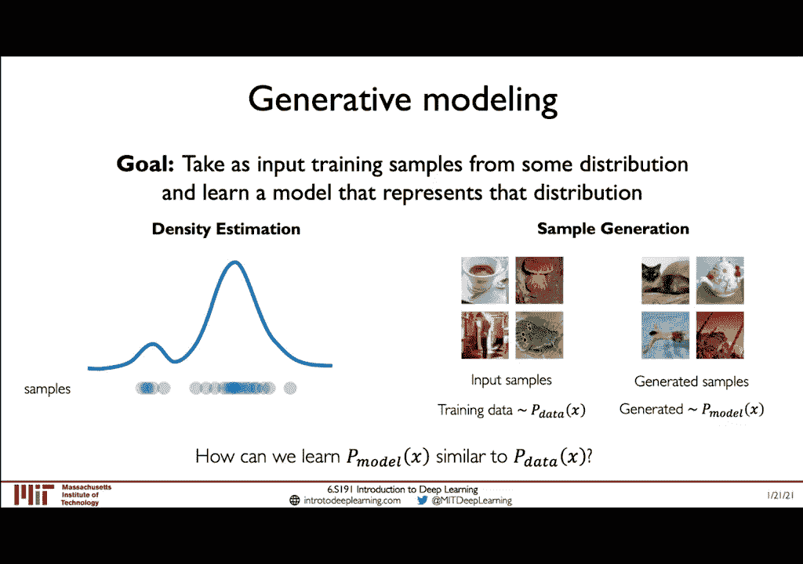
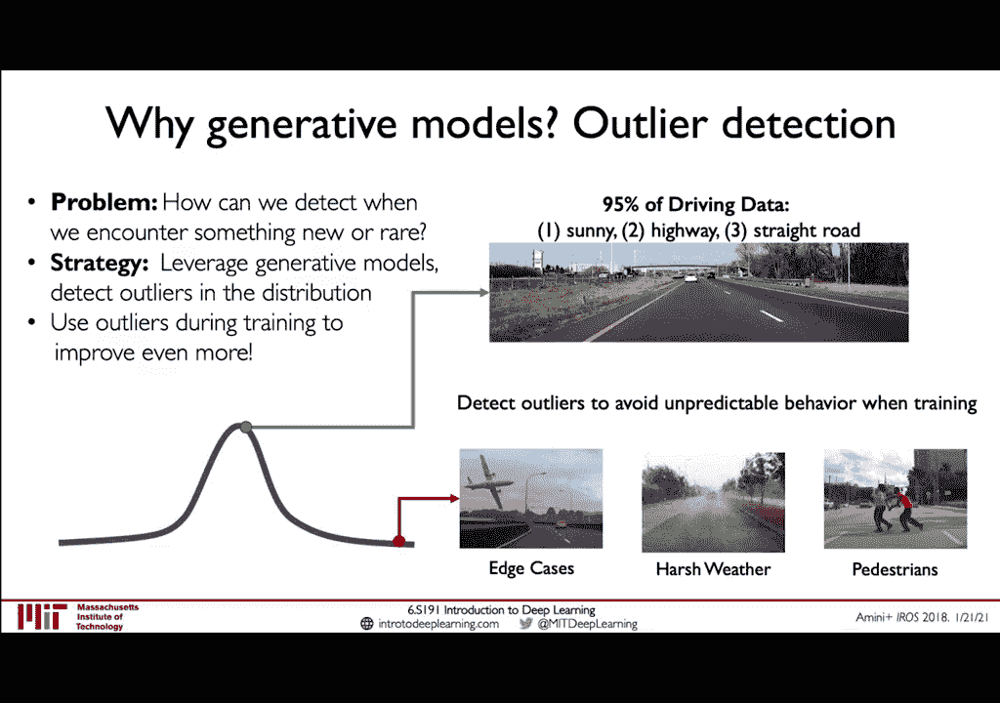
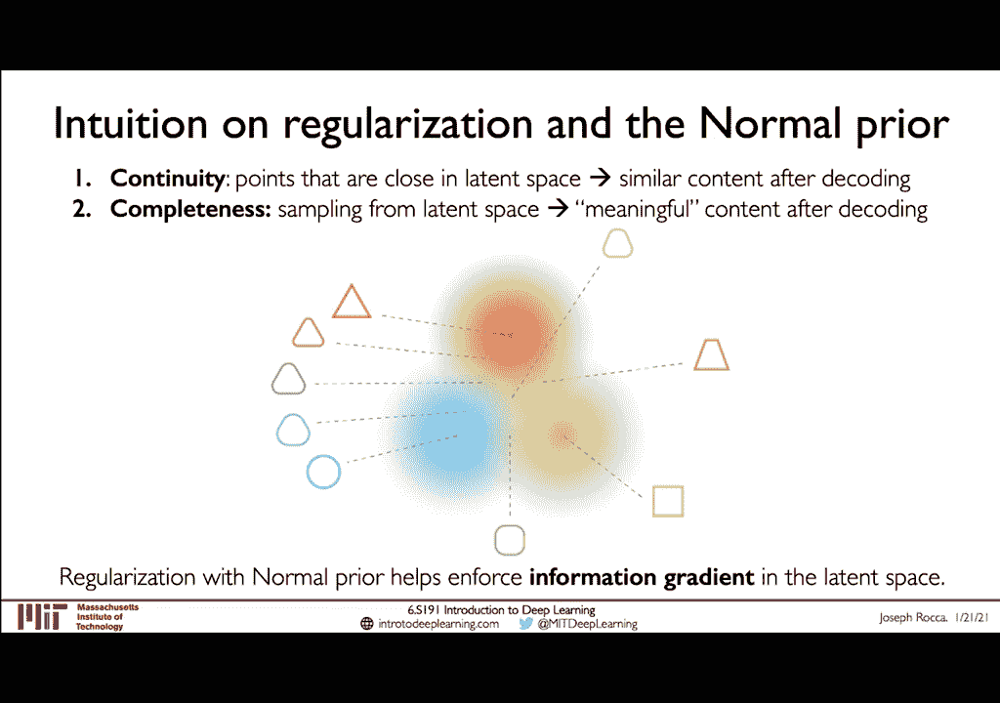
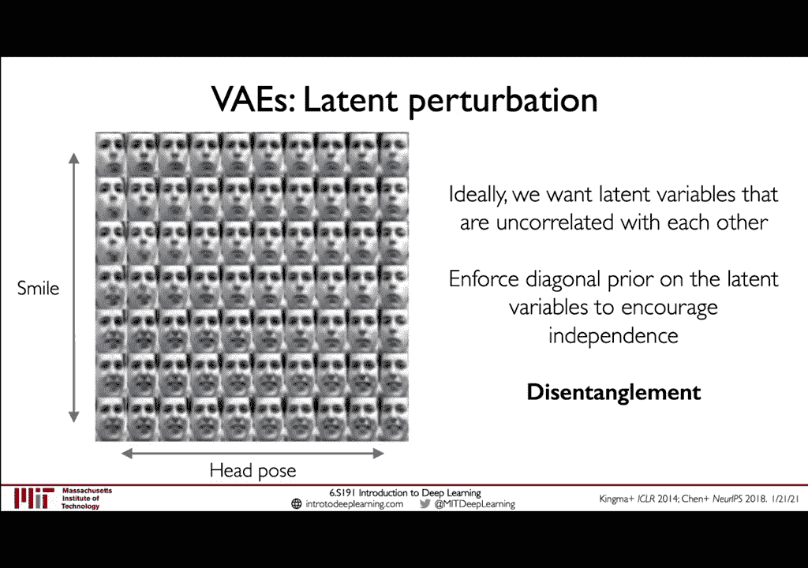
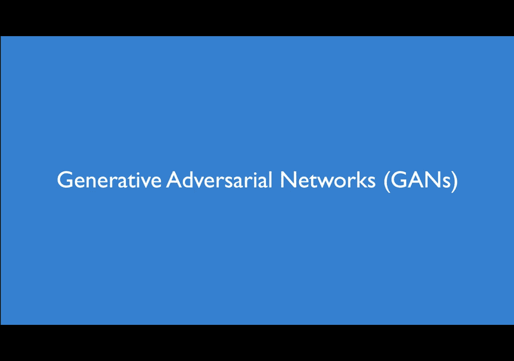
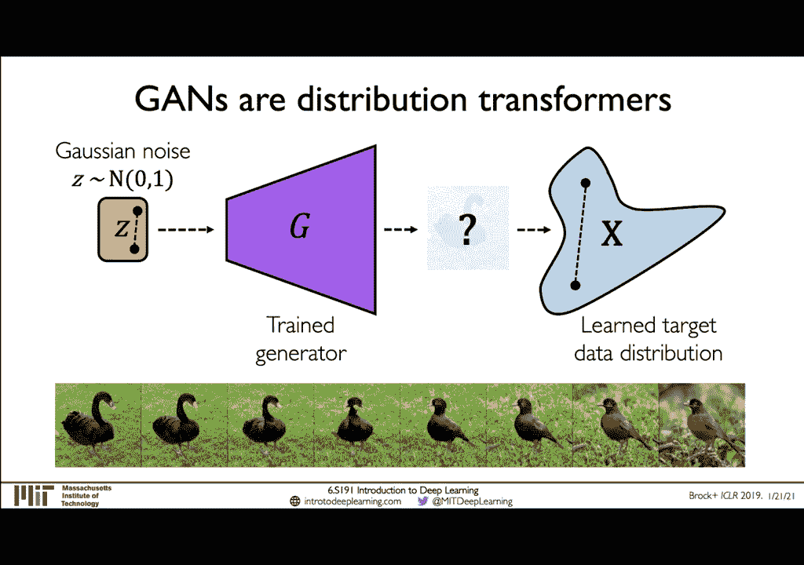
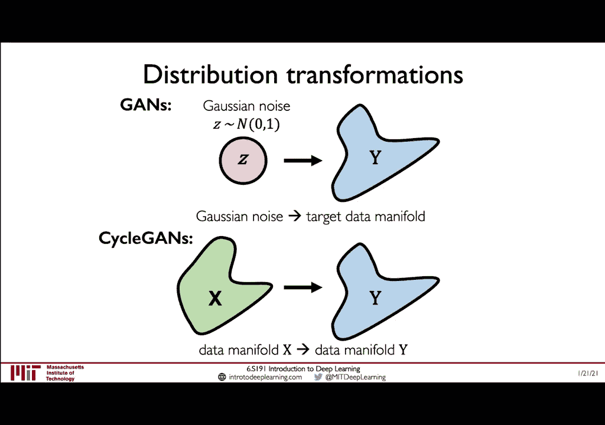

# 【双语字幕】MIT《深度学习导论(6.S191)》课程(2021) - P4：Deep Generative Modeling - 爱可可-爱生活 - BV1jo4y1d7R6

大家好，欢迎来到MIT 6。S191的讲座4！在今天的演讲中，我们将成为，谈论我们如何使用深度学习和神经网络来构建系统，不仅，寻找数据中的模式，但实际上可以超越此范围以生成全新的合成。

基于这些已学模式的示例，我认为这是一个非常强大的想法，这是深度学习的一个特殊子领域，它获得了很多成功，并且，在过去的几年中引起了很多兴趣，但我认为仍然有很多，退化建模领域在未来和未来的巨大潜力。

特别是当我们看到这些类型的模型以及它们所解决的问题类型，在各种应用领域中越来越重要，因此，我想开始。

在这里给大家一个简单的问题，我们有三张面孔的照片，我希望你们所有人，花点时间看一下这些面孔，研究一下，然后思考您认为哪些面孔是真实的，是左边的脸是中间的脸还是右边的脸是哪个，真的很真实。

这些面孔中的每一个都不是真实的，它们都是假的，都是图像，这些是由深度神经网络综合生成的，实际上这些人都没有，存在于现实世界中，希望我想大家都赞赏其中每一个的真实性，合成图像。

这对我而言凸显了深度生成建模的不可思议的力量，它不仅突出了这些类型的算法和这些类型的模型的强大功能，但这引发了很多关于我们如何考虑此类行为的合理使用和道德使用的问题，算法在现实世界中的部署。

因此可以通过设置并激发，这样，我首先我现在想退后一步，从根本上考虑什么是类型，当我们训练神经网络执行诸如此类的任务时可能发生的学习，到目前为止，在本课程中，我们一直在考虑所谓的监督学习问题，实例中。

我们得到了一组数据和与该数据相关的一组标签，我们，我们的目标是学习从数据到标签的功能映射，这些标签可以，是类标签或连续值，在本课程中，我们主要关注的是，开发这些可以由深度神经网络描述的功能映射。

但从本质上讲，这些映射可能是您所知道的任何统计功能，今天讲座的主题将集中在我们称为无监督学习的新知识上，学习问题的类别，与有监督的环境相反，在这种环境下，我们获得了数据和，在无监督学习中的标签。

我们只给数据没有标签，我们的目标是训练机器，学习或深度学习模型来理解或建立隐藏和，数据中的基础结构，这可以做的是让您深入了解，数据的基础结构，然后我们可以利用这种理解来实际。

产生超越深层生成领域的综合实例和无监督学习，建模还扩展到其他类型的问题和您可能正在使用的示例应用程序，熟悉的诸如聚类算法或降维算法生成，建模是无监督学习的一个例子，在这种情况下，我们的目标是作为输入。

训练集中的示例，并学习一个表示数据分布的模型，被输入到该模型中，这可以通过两种原理来实现：第一种是通过，称为密度估算，假设我们得到了一组数据样本，它们落入了，根据某种密度。

建立适用于这些样品的深度生成模型的任务，是要学习描述这些数据的方式和位置的潜在概率密度函数，沿着这种分布下降，我们不仅可以估计这种概率的密度，密度函数，但实际上使用此信息来生成新的合成样本。

我们正在考虑一些输入示例，这些示例是从一些训练数据分布中得出的，在使用这些数据建立模型之后，我们现在的目标是生成综合示例，可以描述为属于我们的模型所建模的数据分布，因此，在这两种情况下。

关键思想的关键是我们如何学习的问题，使用我们的模型（称为x的p模型）的概率分布为，因此类似于真实数据分布，我们称x为p数据，这不仅会，使我们能够有效地估计这些概率密度函数，而且还可以生成。

逼真的新合成样本并与我们正在考虑的数据分布相匹配，因此，我认为这是具体总结了生成建模背后的关键原理是什么。

但要了解生成建模可能是有益的又有影响力的，让我们来看一下，进一步思考这个想法，并考虑可能对应用程序有潜在影响的应用程序，以及，生成模型在现实世界中的用例生成模型使我们作为用户能够使用的功能是。

自动发现数据集中的基础结构和特征的原因可能是，真正重要而真正强大的往往是我们不知道这些功能是如何分布的，在特定的感兴趣数据集内，因此，假设我们正在尝试建立一个面部，检测分类器，我们得到了一个人脸数据集。

而我们可能不知道该数据集的确切信息，这些面孔相对于关键特征（例如肤色或姿势或衣物）的分布，而无需查看我们的数据集并手动检查这些实例中的每一个，实际上，即使没有我们。

我们的训练数据在某些功能上也可能有很大的偏见。知道了这一点，正如您将在本讲座和今天的实验室中看到的那样，我们实际上可以做的是训练，生成模型，可以自动了解数据集中的要素景观，例如，这些就像面孔一样。

通过这样做实际上揭示了训练分布的区域，相对于诸如皮肤的特定特征而言，代表不足或代表过多，语调以及之所以如此强大的原因是我们现在可以实际使用此信息来，调整培训期间如何采样数据，以最终建立一个更加公平。

更加公正的环境，具有代表性的数据集将导致一个更加公平和公正的模型，然后您将获得练习做这些的实际操作，并在今天的实验室练习中实现这个想法，生成模型非常强大的用例中的另一个很好的例子是。

可以视为离群值或异常检测的一类问题，自动驾驶汽车，对于确保自动驾驶汽车至关重要，由深度神经网络控制和操作的神经网络能够处理它所遇到的所有情况，可能会在路上遇到，不仅您知道直行高速公路将成为。

大部分的训练数据和大部分时间是汽车在路上的经历，因此，生成模型实际上可以用于检测训练分布和使用中的异常值，这可以再次改善训练过程，从而可以更好地为最终的模型配备。

希望能够很好地处理这些极端情况和罕见事件，从而激发产生原因和产生方式的动机。

模型对于各种现实世界中的潜水应用而言可能异常强大和有用，在今天演讲的大部分技术内容中，我们将讨论两个类别的内容，我们称之为潜变量模型，具体来说，我们将研究自动编码器和生成对抗，网络器官。

但在开始讨论之前，我想先讨论一下为什么，称为潜在变量模型，以及使用此词潜在时的实际含义，为此，我认为确实是我亲自了解的最佳范例，一个潜在的变量是这个故事，来自普拉托共和国的作品，这个故事被称为。

洞穴的神话或洞穴的寓言，故事如下：是一群囚犯，这些囚犯被作为对他们的监狱惩罚的一部分而受到约束，面对一堵墙，他们在这堵墙上唯一能看到的就是特殊的阴影，在他们身后的大火之前通过的物体。

所以在他们的头后面和外面，他们的视线和囚犯他们真正观察到的唯一一件事就是这些阴影，在墙上，对他们来说，这就是他们可以看到的，可以测量的，那是什么，他们可以说出真实的名字，这是他们观察到的变量。

但是他们不能，实际上直接观察或测量实际投射这些物体的物理对象，阴影，所以这些对象实际上就是我们可以像潜在变量一样进行分析的对象，它们是无法直接观察到的变量，但却是真正的解释，造成可观察变量的因素。

在这种情况下，囚犯，正在看到像投射在墙上的阴影，因此生成模型中的问题，广泛地是找到实际学习数据中这些潜在的和隐藏的潜在变量的方法，即使当我们仅给出所观察到的结果，这也是一个极其极端的情况。

由于神经网络的强大功能，非常适合神经网络学习的复杂问题，处理多维数据集并学习非线性函数的组合，这些函数可以，可以很好地估计非常复杂的数据分布，所以我们首先开始讨论一个简单的。

试图建立这种潜在变量表示的基础生成模型，通过实际对输入进行自我编码，这些模型称为自动编码器。

自动编码器是一种学习低维潜在空间的方法，从原始数据了解其工作原理，我们将输入的原始数据作为输入，例如，这张两张图片将通过许多连续的深度神经网络传递，层以及在一系列神经网络层的输出中，我们将要做的是。

生成是一个低维潜在空间的特征表示，这实际上是，我们正在尝试预测的目标，因此我们可以将网络的这一部分称为编码器，因为它将数据x映射到潜在变量z的编码向量中，所以让我们考虑。

如果您已经注意到我将z表示为较小的尺寸，则此潜在空间z，较小的尺寸作为输入x为什么确保低尺寸很重要，潜在空间z的维数较低，意味着我们能够压缩，在图像数据的情况下可以是许多维度的数据。

我们可以将数据压缩到一个小的潜在矢量中，在其中我们可以学习非常紧凑且丰富的，特征表示，那么我们如何才能实际训练该模型？能够监督我们感兴趣的特定潜在变量，请记住，这是一个无监督的问题，我们有训练数据。

但没有标签，潜在空间z因此，为了实际训练这样的模型，我们可以做的是学习解码器，网络并建立一个解码器网络，该网络用于实际重建原始图像，从这个较低维度的潜在空间开始，再一次是我们汽车的这个解码器部分。

编码器网络将是一系列层的神经网络层，如卷积层，然后将这个隐藏的潜在向量并将其映射回输入空间，我们将重建后的输出称为x hat，因为这是我们的预测，而且是不完善的。

输入x的重建以及我们实际训练该网络的方式是通过查看，原始输入x和我们重建的输出x hat，只需将两者进行比较并最小化，这两个图像之间的距离，因此，例如，我们可以考虑均方误差，对于图像。

这意味着有效地从另一个图像中减去一个图像并进行平方，差异权，实际上是输入之间的像素差异，和重建测量我们的重建对原始输入的忠实度，请注意，通过使用此重建损失，重建输出之间的差异，和我们的原始输入。

除了数据本身之外，我们不需要为数据添加任何标签，因此，我们可以通过抽象化图中的各个单独层来简化此图，编码器和解码器组件，再次请注意，此损耗函数不需要任何，标记它只是使用原始数据在输出上进行自我监督。

这是真正强大的功能，想法和变革性想法，因为它使模型能够学习一定数量的潜在变量，z我们从根本上感兴趣，但是我们不能简单地观察或无法轻松建模。

当我们将此潜伏空间限制在一个较低的维度上，从而影响程度，我们可以真正重构输入的目标和忠诚度，而您对此的看法就是强加于人，模型训练和学习过程中的一种信息瓶颈，有效地解决了这个瓶颈，这是一种压缩形式。

我们正在接受输入，数据将其压缩到更小的潜在空间，然后构建重建，实际上，这导致潜伏空间的维数越低，较差和较差的质量重建工作将使您顺利完成工作，因此总而言之。

这些自动编码器结构使用这种瓶颈隐藏层来学习压缩，数据的潜在表示，我们可以自我监督该网络的训练，通过使用我们所谓的重建损失来迫使自动编码器网络受力，将有关数据的尽可能多的信息编码到较低维的潜在空间中。

同时仍然能够建立忠实的重建项目，因此我喜欢这样思考，这是自动将数据中的信息编码到较低维的潜在空间中。

现在让我们进一步扩展这个想法，并介绍这个概念和架构。

可变自动编码器或vaes，就像我们看到的传统自动编码器一样，从输入到重构输出，如果我们更注意这个潜在层，用橙色表示这里您可以希望意识到的是，这只是一个普通层，在神经网络中，就像其他任何层一样。

它是否具有确定性，只要权重是，传统自动编码器同​​样有效地学习了确定性编码，相比之下，它可以重建和再现输入，可变自动编码器在此架构上施加了随机或可变扭曲，这样做的想法是生成更平滑的输入数据表示。

并不仅提高重建的质量，而且还可以实际产生，与输入数据集相似但不直接重建输入数据的新图像，而实现这一目标的方式是变分自动编码器，用随机采样操作替换该确定性层z，这意味着不是直接学习每个变量的潜在变量z。

变分自动编码器学习与该潜在变量相关的均值和方差，这些均值和方差的作用是它们为，该潜在变量，因此我们完成了从自动编码器到变分自动编码器的工作，正在从潜在变量z的向量到学习均值的向量mu和向量。

对这些变量进行参数化的方差sigma sigma平方的平方，并定义每个潜在变量的概率分布以及我们实际的方法，通过从这些缪斯定义的分布中采样来生成新的数据实例。

和sigma以生成潜在样本并获得潜在空间的概率表示，我希望您对此网络体系结构感到赞赏的是，它与，我之前介绍的自动编码器只是我们现在遇到的这种概率扭曲，执行采样操作以从每个潜在变量中计算样本，好吧。

因为我们已经将这种随机性引入了采样操作，对编码器网络的实际计算和学习过程进行建模，解码器的本质是概率，您可以这样认为，我们的编码器将要尝试学习潜在空间的概率分布，给定输入数据x的z。

而解码器将采用该学习的潜在表示，并根据给定的潜在分布z和这些来计算输入x的新概率分布，网络编码器，解码器将由权重phi和theta的单独集合定义，以及我们训练这种变型自动编码器的方式。

是通过定义一个损失函数，该函数将是数据x以及这些集合的函数，权重phi和theta以及如何优化vaes的关键是现在这个损失函数，由两个项而不是一个项组成，我们有一个重建损失，就像之前。

再次将捕获输入和重构输出之间的差异，也是损失的新术语，我们称其为正规化损失，也称为vae损失，并更详细地了解这些，损失术语代表我们首先要再次强调，我们的整体损失函数将是。

相对于编码器和解码器的权重集以及输入x定义和采用，重建损失与之前的损失非常相似，您可以认为它是由，对数似然对数似然函数，例如图像，数据输入和输出之间的均方误差，我们可以自我监督，重建损失就像以前一样。

迫使潜在空间学习和表现，对输入数据的忠实表示，最终导致忠实的重建，这里的新术语正则化术语更加有趣且完全，在这个阶段是新的，所以我们将深入探讨它，并进行更详细的讨论。

因此我们的概率分布将由x的z的编码器q phi计算，是给定数据x以及正则化强制执行的在潜在空间z上的分布，是该学习过程的一部分，我们将对潜在空间z进行先验。

这实际上是一些关于我们期望z分布实际的初始假设，并通过强加此正则化项，我们可以实现的是模型将，尝试强制执行它学会遵循此先前分发的zs并，我们先将其表示为z的p，这里d是正则化项。

它要做的是试图使差异最小化，或者，给定x时，编码器试图推断z的概率分布之间的差异，在此之前，我们将放置z的潜在变量p和这里的想法，是通过施加此正则化因子，我们可以尝试防止网络过度拟合。

通过加强以下事实来鼓励潜在空间的某些部分：变量以采用与我们之前的分布相似的分布，所以我们现在要经历，您既知道此正则化项的数学基础，又非常直观，逐步了解正则化可以帮助您具体化的内容。

关于正则化为什么重要以及为什么的理解和直观理解，放置先验很重要，因此让我们首先考虑嗯，所以再次强调一下，再次，这个正则化术语将考虑差异，在我们推断的潜在分布和我们要放置的固定先验之间，因此。

在开始讨论之前，我们先考虑一下每种情况下优先选择的好方法，这些潜在的uh变量中，我们该如何选择z的p？在社区中广泛使用的常见选择是强制执行潜在变量，大致遵循高斯正态分布，这意味着它们将成为正态分布。

分布以均值0为中心，且标准偏差和方差为1。这些潜变量的正态高斯先验，因此也就是我们的潜分布，总的来说，这鼓励了我们的编码器部分学习到的编码，vae将在每个潜在变量的中心周围均匀地分布。

如果您可以在图片中想象，当您在周围有大致均匀的分布时，潜在空间特定区域的中心，这意味着该区域之外的区域，距离较远的地方将受到更大的惩罚，这可能会导致实例中的实例，网络试图欺骗并试图聚集外部特定点的地方。

这些中心位于潜在空间中，就像它试图记住特定的，在将潜在的变量置于正态高斯之前，数据中的异常值或边缘情况，现在我们可以开始具体定义损失函数的正则项分量。

这个损失这个损失在原理上与我们看到的交叉熵损失非常相似，在关键点之前，我们将定义距离函数，该距离函数描述了，给定x时z的推断潜在分布q phi之间的差或或散度，以及我们将要放置z的p的先验条件。

这个术语称为kublac libor或kl，散度，当我们选择正态高斯之前，我们得到的结果就是kl散度，在这里采用等式的这种特殊形式，在这里我们使用均值和西格玛。

作为输入并计算该距离度量以捕获所学知识的差异，来自正常高斯的潜在变量分布，所以现在我真的很想，花一些时间来建立一些关于这种正则化的直觉，和工作原理，以及为什么我们实际上想规范自己的对战。

以及为什么我们选择一个正常的先验，好的，这样做吧，让我们考虑以下问题，我们希望通过正则化实现哪些属性，为什么我们实际上首先要规范我们的网络，这是第一个关键属性。

我们想要像vae这样的生成模型是我所能想到的连续性，这意味着，如果在潜在空间中存在紧密表示的点，它们也应该导致类似的重建，类似的输出，类似的内容在它们之后，解码后。

您会直观地期望潜在空间中的区域具有距离的概念，或彼此相似，这确实是我们想要实现的真正关键特性，在我们的生成模型中，第二个属性是完整性，它与连续性息息相关，这意味着当我们从潜在空间采样以解码潜在空间时。

转换成可以产生有意义的重构和有意义的采样内容的输出，那就是你知道的类似于原始数据分布，您可以想象，如果我们从潜在空间中采样而只是将垃圾清除掉，与我们的输入无关。

这可能对我们的模型来说是一个巨大的巨大问题，所以，考虑到这两个属性的连续性和完整性，我们来考虑一下，如果我们不进行正则化就不能很好地对模型进行正则化，将会发生什么？

关于这两个属性发生的事情是可能存在点的实例，在潜在空间中很近，但解码方式不一样，所以我在使用这种非常直观的方式，这些点表示潜在空间中抽象化的区域的示意图。

和它们相关的形状可以认为是那些形状之后将被解码的，潜在空间中的实例通过解码器传递，因此在此示例中，我们有，这两个点是绿色的点和红色的点，它们在潜在空间中物理上接近，但是，解码时会产生完全不同的形状。

我们也有一个紫色的实例，一点，当它被解码时不会产生有意义的内容，这只是乱涂乱画，所以，通过不进行正则化，我在这里抽象了很多，这是有目的的，我们可以，有这些实例，我们没有连续性，也没有完整性，因此。

我们进行正则化的目标是能够实现一个模型，其中，潜在空间中的close不仅被类似地解码，而且也被有意义地解码，因此对于，在这里的例子中，我们有一个红色的点和一个橙色的点，它们都产生三角形的形状。

在三角形本身上有一些细微的变化，所以这是关于什么的直觉，正则化可以使我们实现这些生成模型以及所需的属性，好吧，我们如何才能真正实现这种正则化？就像我提到的那样，他们不只是直接学习潜变量z。

试图将输入编码为均值和方差定义的分布，所以我的第一个，给您的问题是，仅仅学习均值和方差就足够了吗？发行版可以保证连续性和完整性否，让我们了解为什么，无需任何形式化就可以，模型可以尝试诉诸什么，请记住。

损失函数是由一个重建项定义的，和一个正则化项（如果没有正则化），您可以打赌该模型将继续进行，只是尝试优化该重建项，以便有效地学习如何最大程度地减少，即使我们通过均值和方差对潜变量进行编码。

也会造成重建损失，和两个实例的两个后果是，您可以拥有其中这些实例，潜在变量的学习方差最终非常非常小，有效地导致尖峰分布，并且您也可以拥有完全不同的方法，彼此之间会导致潜在空间的不连续，而这可能会在。

仍在尝试优化重建损失，即不进行正则化的直接后果，为了克服这些问题，我们需要对方差和均值进行正则化，编码器返回的这些分布以及正常的先前放置，正态高斯分布作为我们的先验可以帮助我们实现这一目标。

并了解为什么会这样，发生的事是，正常先验实际上会鼓励这些学习到的潜在变量，潜在空间中重叠的分布召回权是指零的方差，表示所有，所有潜在变量都将被强制尝试具有相同的均值，中心均值和。

他们所有的方差都将针对每个潜在变量进行正则化，分布，因此这将确保车道空间的平滑性和规则性以及重叠，这将非常有效地帮助我们实现连续性和完整性的这些特性，将均值居中以使方差正规化，因此。

通过将这些潜在变量中的每个变量居中，可以通过该正常先验进行正则化，正则化他们的差异是因为它有助于强制执行此连续和完整的操作，在潜在空间中表示的信息梯度，潜空间中的距离与重建有一定关系。

以及重建结果的内容说明，尽管要进行权衡，在正则化和重构之间，我们越正则化也存在遭受痛苦的风险。重建的质量和生成过程本身，因此在优化视线方面，进行权衡以适应感兴趣的问题，希望如此。

请仔细阅读本示例并考虑到您已经掌握的这些要点，对正则化为何如此重要以及正常先验的具体程度建立了更多的直觉。

可以帮助我们很好地进行正则化，所以现在我们定义了损失函数，我们知道我们可以重构，我们已经了解了如何使学习正规化并实现连续性和完整性的输入，通过这种正常的先验，这些都是定义通过网络的正向通过的所有组件。

从输入到编码再到解码重建，但是我们仍然缺少将整个画面放在一起的关键步骤，这就是向后传播，这里的关键是因为这个事实，引入了这种随机采样层之后，我们现在遇到了一个问题，即我们无法向后传播。

通过具有此随机性元素的采样层进行渐变，反向传播需要确定性节点确定性层，我们可以对其进行迭代，应用链式规则优化梯度通过梯度下降优化损失。

vaes提出了一种突破性的想法，解决了这个无法解决的问题，向后传播通过采样层，关键思想是实际上巧妙地，重新设置采样操作的参数，以便可以完全端到端地训练网络，因此，正如我们已经了解到的那样。

我们正在努力建立这种潜能，这些变量定义的分布z uh定义放置法线优先级，由均值和方差定义，我们不能简单地通过，采样层，因为我们无法通过此随机样本计算梯度，相反。

关键思想是尝试将采样的潜在矢量z作为由a定义的和。固定mu一个固定的sigma向量，并通过将要用的随机常数缩放该sigma向量，从先验分布（例如正态高斯）中提取出来，并通过重新参数化采样。

就目前的操作而言，我们仍然具有随机性这一要素，但是引入了随机性，通过这个没有在瓶颈内发生的随机常数epsilon，潜在层本身，我们已经重新参数化并将其分布在其他位置以可视化。

看起来让我们考虑以下原始形式的，否，我们有了这个确定性节点，​​即网络的权重以及输入，向量，我们试图通过随机采样节点z向后传播，但是我们现在无法通过重新参数化来实现此目的，我们已经实现了以下形式。

其中我们的潜变量z相对于，嗯，西格玛平方和这些噪声因子epsilon，这样当我们想做，通过网络反向传播进行更新，我们可以直接通过z定义的z反向传播，mu和sigma平方。

因为此epsilon值被当作常数重新设置了参数，在其他地方，这是一个非常非常强大的技巧，重新参数化技巧是因为，它使我们能够训练变分自动编码器，并以相对于z的反向传播结束，相对于实际梯度。

编码器网络的实际权重还可以。

将这些分布先验强加给潜在变量的一个副作用和后果，是我们实际上可以从这些潜在变量中采样并分别调整它们，同时保持，所有其他固定的变量，您可以做的是调整，一个特定的潜在变量，并在每次更改该变量时运行解码器。

每次扰动该变量以生成新的重构输出时，该结果的示例如下所示，其中潜变量的这种扰动，导致表示形式具有关于网络可能正在学习的内容的语义含义，因此，在此示例中，这些图像显示了头部姿势的变化，以及z的不同维度。

不同的潜在变量所在的潜在空间，这种方式编码不同的潜在特征，可以通过保留所有其他特征来解释，固定并扰乱一个单独车道变量的值的变量。

理想情况下，为了优化vas并尝试最大化我们想要的编码信息，这些彼此不相关的潜在变量有效地解开了，使我们能够实现的是学习可能的最丰富，最紧凑的潜在表示，所以在这种情况下，我们在x轴上有头部姿势。

在y轴上有微笑，我们希望这些姿势，尽可能彼此不相关的一种方法，我们可以实现这一目标。

实现这种解缠是相当简单的方法，称为beta vaes，因此，如果，我们再次考虑标准值的损失，我们用对数定义了这个重建项，由kl散度beta值定义的似然和正则项引入了新的。

超参数beta可以控制此正则化项的强度，并且已显示，从数学上讲，通过增加beta可以达到对潜在编码施加约束的作用，例如鼓励解开纠缠，并进行了广泛的论证和讨论，关于如何实现这一目标，但要考虑结果。

让我们再次考虑，如果我们考虑的潜在变量是使用标准vae的人脸重建问题，在这种情况下，头部姿势或旋转角度等于您希望得到的beta，是随着脸部姿势的改变，其中一些脸部的笑容也在改变。

相反，通过强制使用一个比一个大得多的beta，可以实现的是，当我们可以扰动单个潜在变量时，微笑保持相对恒定，旋转头的旋转，并获得相对于单独旋转头的摄动，好的。

正如我在本讲座的介绍开始时所激发和介绍的那样，生成模型和潜变量模型的强大应用在模型d偏向中，在今天的实验室中，您实际上将获得构建变体的真实动手经验。自动编码器，可用于实现面部分类系统的自动去偏。

检测系统以及此方法的功能和思想是建立表示形式，学习的人脸数据潜在分布，并使用它来识别该潜在空间的区域，这些将被过度代表或代表不足，而这一切将是，针对特定的学习特征（如肤色，姿势，物体，衣服）拍摄，然后。

从这些学习的分布中，我们实际上可以调整培训过程，以便我们可以，在这些图像和落入该区域的那些面孔上施加更大的权重和更大的采样，会自动显示下面的潜在空间，真正真正酷的是。

关于为模型d偏向等应用程序部署vae或潜在变量模型的问题是，无需我们注释和规定对于实际设计很重要的功能，反对模型自动学习它们，这将成为当今实验室的主题，同时也为更广阔的空间打开了大门。

该空间将被进一步探索，在后来的焦点演讲中，将重点讨论算法偏差和机器学习公平性，好的，这样就可以概括出vaes上的关键点，它们将数据的表示压缩为，数据输入的编码表示重构可实现无监督学习而无需，标签。

我们可以使用重新参数化技巧来训练血管端到端，我们可以采取隐藏的潜能，变量会扰乱它们以解释其内容和含义，最后我们可以进行采样，从潜在空间生成新示例，但是如果我们想专注于生成。

通常忠实于数据分布的样本和合成样本，可能了解我们如何实现这一目标，我们将过渡讨论，一种新型的生成模型，称为生成对抗网络或简称gam。

这里的想法是我们不想显式地建模密度或，或一些数据的基础分布，而只是学习可以，成功生成类似于数据的新实例，这意味着我们，想要从非常复杂的分布中进行优化以进行采样，而这是无法学习的，并且，直接建模。

我们将不得不建立该分布的近似值，gans真正酷而突破的想法是从极其极端的事物开始，非常简单，只是随机噪声，并尝试建立一个神经网络，生成神经，可以学习从噪声到数据分布的功能转换的网络。

通过学习这种功能性的生成映射，我们可以进行采样以生成假的，实例将与真实数据分布尽可能接近的合成实例。

可能实现这一目标的突破是称为gans的结构，其中的关键组件，有两个神经网络，一个发电机网络和一个鉴别器网络，它们是有效的，彼此竞争，它们是不利的领域，特别是我们有一个发电机网络，将在这里用g表示。

它将被训练为从随机噪声中产生出一个，模仿数据，然后判别器将把合成的假数据作为，以及真实数据，并经过训练以真正区分假冒和真实以及在训练中，这两个网络将彼此竞争，因此在竞争中，因此，总的来说。

结果就是歧视者将在学习如何，对真实和假冒进行分类，这样做会更好，它将迫使生成器执行以下操作：尝试产生越来越多的综合数据，试图来回欺骗鉴别器，来来回回，现在让我们分解一下，从一个非常简单的玩具示例开始。

以获得更多的直觉，关于这些gan的工作原理，发电机将从某些位置完全重新启动，随机噪声并产生虚假数据，我将在这里通过代表这些来表明这一点，数据作为一维线上的点，然后鉴别器将看到这些点，以及真实数据。

然后将其训练为输出以下概率：它所看到的数据是真实的，或者如果它们是伪造的，并且一开始它不会受到很好的训练，很好，所以它的预测不会很好，但是您要训练它，您将对其进行培训，它将开始增加利润概率。

真实与非真实的分离，这样您就可以得到完美的分离，鉴别器能够完美地区分真实的东西和假的东西，现在又回到了，生成器，生成器将返回，它将以实际，数据作为训练的输入，然后它将尝试改善对数据的模仿，以尝试。

将伪造数据移动到越来越接近真实数据的合成数据，歧视者现在又要获得这些新的观点，并估计这些点都是真实的概率，并再次学习降低假点成为真实的可能性，越来越远，现在我们将重复一遍，最后一次，发电机将。

开始将这些假点移动到越来越接近真实数据的位置，数据几乎跟随实际数据的分布，这将是，区分者很难有效地区分真实与虚假，而生成器将继续尝试创建伪造的数据实例以，愚弄歧视者。

这实际上是gans这两个组成部分背后的主要直觉，基本上可以互相竞争，所以总结一下我们如何训练礼服，生成器将尝试将伪造的实例合成为完整的鉴别器，接受培训以识别合成实例并将其区分为伪造的，进行实际训练。

我们将看到我们将定义一个损失函数，该函数定义了，鉴别器和生成器以及全球的竞争和对抗目标，最佳，我们可能会做的最好，这意味着发生器可以完美地再现，真实的数据分布，以使辨别器绝对无法分辨出什么是合成的。

与真实情况进行比较，让我们来看一下损失函数如何再次分解，损失项再次基于熟悉的交叉熵损失和，现在将在真实分布和生成分布之间进行定义，所以我们首先要从歧视者的角度来考虑损失。

我们想尝试最大化假数据被识别为假的概率，因此，在这里将其分解为z的g定义了生成器的输出，因此d， g的z是鉴别者对假实例实际上是假的概率的估计，x的d是判别器对真实实例为假的概率的估计。

所以x的一个减d是它对一个真实实例是真实的概率的估计，因此，从鉴别器的角度来看，我们希望最大程度地提高这种可能性，最大化伪造的概率是假的最大化伪造的概率估计是真实的，现在让我们把注意力转向发电机。

记住发电机，正在获取随机噪声并生成实例，它不能直接影响x的项d，出现在损失权中，因为x的d完全基于判别器在x上的运算，真实数据，因此对于生成器，生成器将具有对抗性目标，鉴别者。

这意味着将尝试最小化该术语，从而有效地最小化，鉴别者可以将其生成的数据区分为伪造品的可能性，z的g中的d，生成器的目标是最小化该目标项，因此，生成器的目的是尝试合成愚蠢的虚假实例，鉴别器。

并最终在训练鉴别器的过程中，会尽可能地区分真假，因此，生成器的最终目标是合成欺骗最佳区分器的伪造实例，并将它们全部合并到具有这两个组成部分的最小最大目标函数中，经过对抗性优化，然后经过训练。

我们可以实际使用发电机网络，经过全面培训，可以生成以前从未见过的新数据实例，因此我们将，现在专注于这一点，真正有趣的是，当gam的火车生成器合成时，新实例可以有效地学习从噪声分布到噪声分布的转变。

目标数据分布以及映射的转换将成为学习的内容，训练的过程，因此，如果我们从潜在的噪声分布中考虑一个点，在目标数据空间中产生特定的输出，如果我们考虑另一点，随机噪声通过发生器馈入它会导致一个新的实例。

新实例将落在数据流形上的其他位置，实际上我们可以。

do是在高斯噪声的空间中进行插值并进行遍历和遍历以导致插值，在目标空间中，您可以在此处看到此结果的示例，其中进行了一系列转换，反映遍历警报的遍历目标数据流形，该遍历是在。

发电机输出的综合示例可以正常运行，因此在最后的几分钟内。

在本讲座中，我将重点介绍gans的一些最新进展，并希望能激发人们的兴趣。

更进一步，为什么这种方法如此强大，所以一个想法极其强大，是渐进式gans渐进式增长的想法，这意味着我们可以迭代构建，生成的生成实例的更多细节，这是通过逐步添加来完成的。

在图像数据的情况下逐层增加空间分辨率的层，随着训练的进行，以这种方式建立生成器和鉴别器网络，产生非常好分辨的合成图像，最终由生成器输出。

所以这个渐进式甘的想法的一些结果在这里显示了另一个想法，这也大大改善了gans生成的合成示例的质量，是一种称为stylegan的体系结构改进，它结合了逐步增长的思想。

我之前介绍的风格转换原则意味着要撰写一个，像另一幅图像一样的图像，例如，我们现在可以实现的是映射，输入图像源使用从次要来源到这些来源的粗粒度样式的应用，目标生成模拟源b样式的新实例，结果是。

如此处所示，希望您能体会到这些粗粒度功能，像年龄的面部结构这样的样式可以反映在这些合成的例子中，相同样式的gan系统在两个方面都产生了非常逼真的合成图像，面部合成以及动物其他物体以及gan的另一个扩展。

架构已使特别强大的应用程序能够针对某些问题和，任务是这种条件的想法，它在类型上施加了一些额外的进一步结构，可以再次合成的输出，因此这里的想法是根据特定的标签，通过提供称为c的条件因子以及这允许的条件。

我们要实现的是像成对翻译这样的实例（在图片的情况下），综合，现在不再有任何输入作为生成器的训练数据，我们有成对的，输入，因此例如在这里我们既考虑了驾驶场景又考虑了相应的分段图，到那个驾驶场景。

然后可以对鉴别器进行训练，以对假对和真对进行分类，数据，然后将再次学习生成器，并对其进行训练以试图欺骗生成器。

这种想法的鉴别器示例应用如下所示，现在我们可以从，输入语义分割图以生成合成街道场景映射，该映射映射um，根据该细分，或者我们可以从卫星图像的鸟瞰图出发，到街道地图视图或从建筑的特定标签到合成。

建筑立面或白天到黑夜，为照片不同的边缘上色，通过以特定标签为条件来实现配对翻译的实例，所以我认为真的很酷又有趣的另一个例子是，谷歌街景到卫星视图，反之亦然，我们也可以动态实现。

因此，例如在给定边沿输入的着色中，可以训练网络以实际合成，由于这种特殊的边缘草图而在艺术品中产生的颜色是另一种想法。

而不是成对翻译是不成对的图像到图像的翻译，这可以是，通过称为cyclegan的网络体系结构实现的，其中该模型将输入的图像作为，一个域，并且能够学习映射到另一个域的映射，而无需。

配对了另一个域中的对应图像，因此这里的想法是转移样式和，从一个域到另一个域的分布，这是通过引入循环，循环损耗函数中的关系，我们可以在域x之间来回切换，和一个域y，在这个系统中。

实际上有两个生成器和两个鉴别器，将要接受有关各自的生成和歧视任务的培训，在这个例子中，Cyclagan训练有素，可以尝试从马的领域翻译成，斑马的领域，希望您能体会到在此示例中。

马的皮肤从褐色到斑马状的条纹皮肤，除此之外，周围地区从绿草地变成更棕色的地方。

在斑马的情况下，我想对这种环骑如何获得直觉，转型正在进行中，让我们回到传统甘斯的想法，正在从高斯噪声的分布移动到一些目标数据流形，并具有循环gans，目标是从一个特定的数据流形x到另一个数据流形。

为什么，在两种情况下，以及，我认为使gans如此强大的基本概念是，它们的功能非常非常，有效的配电转换变压器，它可以实现这些配电转换。

最后，我想考虑一个您可能熟悉的其他应用程序，自行车的概念，这是要转换语音并实际使用这种心理游戏，合成别人声音中的语音的技术，并且这样做的方式是，通过在一个语音中录制一堆音频，并在另一个语音中录制音频。

将那些音频波形转换成图像规格表示，称为频谱图，然后，我们可以训练循环甘氨酸，以对这些光谱图图像进行操作以进行变换，声音a的表示，使它们看起来像它们的出现，来自另一种声音，这正是我们所做演讲的方式。

亚历山大在演示中进行的演示中，对奥巴马的声音进行合成的转换。

第一次讲课，以便进一步检查，让我们并排比较来自，亚历山大以及使用cyclegan生成的奥巴马声音中的合成版本，大家好，欢迎来到MIT 6s191官方授课的深度学习入门课程，在这里，请注意。

产生奥巴马声音的频谱图实际上是由，操作亚历山大的声音，并从奥巴马域中有效学习域转换，到亚历山大域的域上，最终结果是我们创建并合成了一些东西，那更像是奥巴马，所以希望在本讲座的过程中总结一下。

建立了对生成建模的理解以及生成模型的类别，尤其是，在实现概率密度估计和样本生成方面功能强大。

在此，我想结束演讲并向您介绍今天的其余部分，本课程将重点关注我们第二个计算机视觉实验室，专门探讨，这个在面部检测系统中消除偏见并使用变分的问题，自动编码器实际上可以实现分类系统自动去偏的方法。

所以我鼓励你来班上集镇问你的问题，在实验室里回答，并与我们中的任何一个进一步讨论谢谢。

