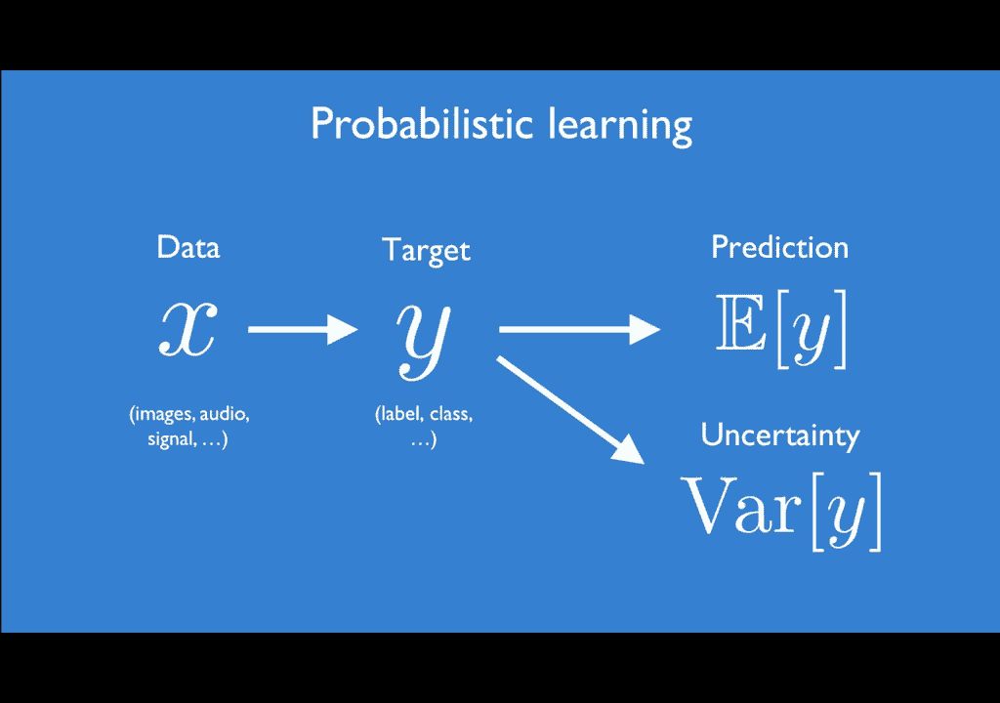

# 【双语字幕】MIT《深度学习导论(6.S191)》课程(2021) - P7：Evidential Deep Learning and Uncertainty - 爱可可-爱生活 - BV1jo4y1d7R6

大家好，欢迎回到今天的讲座，在91年的前六堂课上，我们尝到了一些基本的深度学习算法和模型，在接下来的两节课中，我们实际上会深入到更多的细节，特别关注现代深度学习研究中两个至关重要的热门话题领域。

对我们到目前为止在这门课上所学到的一切都产生了真正的影响，现在，这两个热门话题的讲座将首先集中在概率建模上，利用深度神经网络进行不确定性估计，以及算法偏见和公平性，我们将学习一种非常强大的新技术。

叫做证据深度学习，什么时候，我们可以信任我们正在训练和解释的神经网络的输出，当他们不自信的时候。

或者当他们的预测不确定时，现在，深度学习中不确定性估计的整个领域今天比以往任何时候都更加重要，当我们看到这些深度学习模型时，就像我们一直在学习的那样，到目前为止在这门课上，开始走出实验室进入现实。

与…互动，或，至少，影响人类生活。

在他们周围，深度学习模型倾向于传播训练中的偏见，并且经常容易在全新的分销数据上失败，而是，我们需要能，可靠快速地估计他们所看到的数据中的不确定性，以及他们预测的输出，在这次讲座中。

我们实际上会开始学习证据，神经网络不确定性估计的深度学习，所以训练我们的模型不仅仅是为了做出预测和预测答案，也是为了了解它在预测中有多少证据，我们应该在多大程度上相信它的答案。

不确定性的一个很大的原因和实际原因，估计数，或者对于深度学习中的不确定性，是由于神经网络在实践中的训练方式有很大的差距，以及如何在部署中评估它们，当我们训练机器学习模型时，我们做以下假设。

我们的训练集来自与测试集相同的分布，但在现实中，这很少是真的，比如说，当我们看到许多最先进的，到目前为止我们所学到的最先进的算法，他们几乎都受过极其干净的训练，预处理数据集，通常有最小的闭塞。

现实世界中最小的噪声或歧义。

虽然，我们面临着这么多我们模型的边缘情况，我们的模型将完全无法处理，比如说，如果我们训练这个分类器来识别狗，我们把它训练在左手边这些干净的狗的图像上，当我们把它带到现实世界中时，它会产生非常差的性能。

我们开始展示它，全新位置的狗，倒置结构的狗，甚至是这只从天空中跳伞的狗，或者如果我们把这个在干净的城市街道上训练的驾驶模型，然后我们把它带到现实世界中，开始看到各种各样奇怪的东西。

现实中意想不到的边缘情况，现在，今天讲座的重点是建立不仅超级精确的模型，并具有高性能，而且还将定量估计技术构建到我们的学习管道中，这样我们的模型就能告诉我们，当它不知道正确答案时，这里有一句名言。

乔治·博克斯，我改编了一点来传达这一点，现在最后，所有的模型都是错的，但一些知道什么时候可以信任的人实际上会在现实中有用，现在我们很少需要一个模型来实现完美的百分之百的准确性，但即使我们的精确度略低。

如果我们能理解什么时候我们可以信任这个模型的输出，那么我们就有了非常强大的东西，现在，知道我们什么时候不知道某事的问题证明是极其困难的，虽然，这是真的，即使对人类来说，有太多的任务我们相信我们可以完成。

即使我们真的不知道正确的答案，而且可能更有可能道歉，失败的可能性比成功的可能性大，现在，这张照片，对于任何在一个新城市开车的人来说，可能甚至不需要解释，在我们的手机里有谷歌地图这样的东西之前。

人们往往会拒绝接受你可能会迷失的事实，寻求帮助，即使我们可能真的迷失在一个我们从未去过的地方，所以今天我们要学习如何教神经网络，预测概率分布而不是纯确定性的点输出，以及如何像这样构建我们的神经网络。

可以让我们模拟一种不确定性，但不是所有类型，特别是，然后我们将讨论它如何没有捕捉到一种非常重要的不确定性形式，也就是预测本身的不确定性，最后我们将看到我们如何学习不确定性的神经表征，利用证据深度学习。

这将使我们能够真正捕捉到这一点，呃，这另一种类型的不确定性，并迅速估计它，同时也扩展到一些非常高维的学习问题和高维输出问题。

让我们开始讨论我的意思，当我说我们想用神经网络来学习不确定性时，概率学习的这个术语，概率学习的这个术语是什么，它是如何与我们在这门课上所看到的一切联系起来的，现在在粘土里，在监督学习问题的情况下。

我们的模型有两个主要的数据输入来源，首先是数据本身，我们过去一直称这个为X，这是我们实际上输入模型的东西，鉴于我们的数据，我们想预测这里表示为Y的某个目标，这可能是x所属的一个离散类。

它也可能是我们想预测的任何真实数字，考虑到我们的数据，我们将得到一个x和y对的数据集，到目前为止，在这门课上一直专注于，至少在监督学习的情况下，学习从x到y的映射，并根据我们的输入预测y的期望值，x。

这正是我们训练决定论的方式，过去类中的有监督神经网络，现在的问题是，如果我们只模拟目标的期望，对为什么的期望，那么我们只有预测的点估计，但我们对这一预测有多广泛或不确定缺乏任何理解，这正是我们的意思。

当我们谈论估计我们模型的不确定性时，而不是平均预测答案，对Y的期望，我们还想估计我们预测目标y的方差，这让我们对输出有了更深入、更概率的感觉。

你可能在想，当我这么说的时候，这听起来很，与我们在这堂课中已经看到的非常相似，你是完全正确的，因为在这门课的第一节课上，我们已经对训练神经网络输出完整的分布有了很大的认识，对于分类的情况，特别是。

所以我们看到了一个例子，我们可以把图像输入神经网络，这个图像需要分为猫或狗，比如说，现在这里的每个输出都是属于那个类别的概率，这两个概率和为一或必须和为一，因为这是一个概率分布，我们的输出是概率分布。

现在，这绝对是神经网络如何训练的一个例子，输出概率分布，在本例中，离散类类别上的分布，但让我们深入一点，真正解剖它，看看我们如何做到这一点，嗯，首先我们必须使用这个特殊的激活函数，如果你还记得的话。

这被称为SoftMax激活函数，我们必须使用这个激活函数来满足输出的两个约束，首先，每个概率输出必须大于零，第二次，那个，我们需要确保，我们所有类概率的总和现在被归一化为1。

给定从这个Softmax激活函数中出现的类概率的输出，然后我们可以定义这种特殊的损失，使我们能够优化我们的分布学习，我们可以这样做，通过最小化我们所说的预测分布的负对数似然，与地面真相相匹配。

这也被称为交叉熵损失，这是你们现在应该非常熟悉的事情，因为你已经实现了它，并在你的三个软件实验室中使用了它，让我们把它弄得更正式一些，为什么我们用激活函数和损失函数来做这些选择，嗯。

这一切都归结为我们在开始学习之前所做的假设，那就是我们假设我们的目标类标签，y是从某个似然函数中提取的，在本例中，由分布参数定义的分类分布。

这里的分布参数实际上定义了我们的分布和我们在预测标签上的可能性，特别是，我们的答案在I中的概率，第1类现在正好等于第1个概率参数，同样，我们也看到了如何在连续类目标的情况下做到这一点，在这种情况下。

我们没有学习类概率，而是整个实数线上的概率分布，像分类域，这可以应用于任何监督学习问题，但当我们在以前的讲座中看到它时，我们看到了它，我们关注的是强化学习，我们想预测车辆应该采取的方向盘角度。

给定场景的原始图像像素图像，现在，因为这个输出的支持是连续的和无限的，我们不能像在分类的情况下那样只输出原始概率，因为这将需要来自我们网络的无限数量的输出，而是，虽然我们可以输出我们分布的参数。

即平均值和标准差，或者该分布的方差，这定义了我们的概率密度函数，我们的平均值是无限的，所以我们根本不需要约束它，另一方面，尽管我们的标准差西格玛必须是严格正的，所以为了那个。

我们可以使用指数激活函数来强制该约束，在分类领域，我们或类似于分类域，我们可以通过使用负对数似然损失来优化这些网络，一次又一次，我们是怎么走到这一步的，嗯，我们假设我们对我们的标签做了这个假设。

我们假设我们的标签是从正态分布或高斯分布中提取的，参数已知，μ和sigma平方，我们的平均值和方差，我们想训练我们的模型来预测输出，现在，我觉得这真的很神奇，因为我们没有任何理由，真理。

数据集中的基本真值均值和基本真值方差的变量，我们所拥有的基础真理智慧是标签，但是我们用这个公式和这个损失函数来学习，不是我们标签的点估计，而是一种分布，完全分配，描述数据可能性的高斯周围。

现在我们可以总结这些似然估计问题的细节，利用神经网络进行离散分类域和回归，连续回归域，现在从根本上说，这两个域不同，就他们适合的目标类型而言，在分类领域，目标可以是一组固定的类中的一个。

回归域中的1到K，在开始之前，我们的目标可以是任何实数，我们假设我们的标签来自或来自某种潜在的似然函数，在再次分类的情况下，它们是从分类分布中提取的，而在回归的情况下，我们假设它们是从正态分布中提取的。

现在这些似然函数中的每一个都由一组分布参数定义，在绝对的情况下，我们有这些概率来定义我们的范畴分布，在正态分布或高斯分布回归的情况下，我们有一个均值和方差来确保这些是有效的概率分布。

我们必须对我们的参数应用一些相关的约束，通过激活函数的方式，巧妙构造的激活函数，最后对于这两个，就像我们之前看到的，我们可以利用负对数似然损失来优化整个系统，这使我们能够了解标签上分布的参数。

同时我们可以获得这里的概率和方差。

对我们来说记住一些事情是至关重要的，那就是概率或可能性，让我们称之为我们通过建模得到的，我们在这节课中看到的问题，永远不要误认为我们模型的信心，我们得到的这些概率与置信度绝对不一样，我们认为至少是信心。

这就是为什么让我们回到这个分类的例子，在那里我们输入图像，对这个神经网络来说，它可以是猫，也可以是狗，我们有神经网络预测，这张照片是猫的概率有多大，或者现在是狗的概率有多大，因为如果我们输入一个。

比如说一只猫，我们的模型应该能够识别，假设它被训练来识别一些关键特征，专门针对猫说，好的，这很可能是一只猫，因为我在这张照片中看到了一些类似猫的特征，同样，如果我输入狗的输入，那么我们应该更有信心预测。

这张照片很有可能是一只狗，但是如果我们说让我们在这张图像中喂食会发生什么，一只猫和一只狗在一张照片中，我们的模型将识别出与成功检测到一只猫相对应的一些特征，以及在同一图像中同时成功地检测到一只狗。

它的决定会相对分裂，这并不是说我们对这个答案没有信心，我们可以对这个答案非常有信心，因为我们在这张照片中发现了猫和狗的特征，这只是意味着我们的输入数据中有一些歧义，导致了我们在输出中看到的不确定性。

我们可以对我们的预测充满信心，即使我们的答案是有可能的，或者百分之五十的猫或者百分之五十的狗，因为我们实际上是因为我们，我们实际上是在训练共享这些类型特征的图像，但如果我们看到的是我们没有看到的图像。

对这些类型的特征进行训练，例如，如果我们用同样的神经网络，但现在我们在这艘船的图像中进食，一些全新的东西，不像我们在训练中看到的任何东西，模型仍然有输出两件事，这个图像是猫的概率，这张照片是狗的概率。

我们知道，因为这是一个用Softmax激活函数训练的概率分布，我们知道这是一个范畴分布，这两种概率，猫的概率加上狗的概率必须和为一，无论发生什么，因此，在这种情况下，输出可能性将非常不可靠。

如果我们的投入与我们在训练中见过的任何东西都不一样，我们称之为脱离分布或脱离训练分布，我们可以看到，在这种情况下，我们的输出或这两个概率在这里是不合理的，他们不应该相信这真的是为了向你强调。

当我们说不确定性估计时，在训练神经网络时，我们应该关注不同类型的不确定性，像这样捕捉概率，它们没有捕捉到预测本身的不确定性，而是数据中的不确定性这带来了问题，存在哪些不同类型的不确定性。

我们如何在深度学习中使用不同的算法技术来学习它们。

这一切都归结为我们可以尝试估计的不同方法，当模特不知道，或者当它不确定它的答案或预测时，我们看到这些不确定性有不同类型，这是真的，甚至在我们的日常生活中，我想一个很好的方法来思考。

这是通过已知和未知的二乘二矩阵，我举一个简单的例子，我只是简单地说明一下，所以想象一下你在机场乘飞机，你有一些已知的知识，例如，会有一些航班从那个机场起飞，那是已知的已知的，你很自信。

你非常肯定那会发生，也有像已知未知数这样的事情，我们知道我们知道的事情，有些事情我们根本无法预测，例如，我们可能不知道我们的飞行时间，我们的航班起飞的确切时间，那是我们无法预测的。

也许是因为它可能会被推迟，或者它只是一个，它只是我们不能完全控制的东西，可能会改变，那么就有未知的已知，别人知道的事情，但你不知道，一个很好的例子就是别人预定的起飞时间，他们的预定飞行时间。

你知道别人知道他们预定的起飞时间，但对你来说，这是一个未知的已知，最后还有未知的未知，这些都是完全出乎意料或无法预见的事件，一个很好的例子是流星撞上跑道，这是基础机器学习中一个新兴的令人兴奋的研究领域。

理解，我们如何构建算法，鲁棒有效地建模和量化这些深度学习模型的不确定性，这真的很难，实际上是因为这些模型有数百万亿，现在甚至是数万亿的参数，理解和内省它们，检查他们的内部以估计理解，当他们不知道的时候。

正确答案肯定不是一个简单的问题，现在人们通常不会训练神经网络来解释这些类型的不确定性，所以当你对一些数据进行训练时，比如说，在这里你可以看到黑色的观察结果，我们可以训练一个神经网络用蓝色做出一些预测。

预测与我们在这个区域的观测一致，我们有训练数据，在本地区以外，我们可以看到我们的预测开始失败很多，并估计不确定性，在这种情况下，有两种形式，我们今天要讨论的，第一种形式是认识不确定性。

它对潜在预测过程中的不确定性进行建模，这是当模型只是不知道正确的答案，它对自己的答案没有信心，不确定性的另一种形式是任意不确定性，这是数据本身的不确定性，把这看作是统计或感官噪声。

这就是所谓的不可约不确定性，所以不管你收集了多少数据，在收集过程中你会有一些潜在的噪音，它是数据本身固有的，减少空气不确定度的唯一方法是改变传感器，并获得更准确的数据。

现在我们非常关心这两种形式的不确定性。

动态不确定性和认知不确定性，一次又一次，只是为了回顾这两种形式的不确定性之间的差异，我们左手边有Alatoric，这集中在我们数据的统计不确定性上，它描述了我们对数据本身有多自信，当我们的数据有噪声时。

它是最高的，而且不能通过增加更多的数据来减少，另一方面，我们有认知上的不确定性，这比自由不确定性更难估计，有一些新兴的方法试图确定认知的不确定性，现在，关键是认识不确定性反映了模型对预测的信心。

我们可以利用这些估计开始理解当模型不能提供可靠的答案时，当它缺少一些训练数据来提供答案时，不像所有的不确定性，通过增加更多的数据可以减少认知不确定性，并提高模型的可信度。

而动态不确定性可以直接用神经网络学习，使用似然估计技术，就像我们在今天的讲座中所学到的那样，认知不确定性是很难估计的，和，这是因为，认识的不确定性反映了不确定性，模型预测过程本身固有的标准神经网络。

确定性神经网络，我们无法获得这种不确定性的感觉，因为网络是确定性的，通过一组给定的权重传入模型的一个输入，多次会一次又一次地产生相同的输出，它将始终具有相同的固定输出，不管我们在相同的输入中输入多少次。

但我们能做的不是确定性神经网络，其中每个权重是一个确定性数，每个重量的单个数字，我们可以用概率分布来表示每一个权重，所以在这种情况下，我们将通过分布来模拟这些权重，这样，当我们向神经网络传递输入时。

我们从这个分布中的点对神经网络中的每一个权重进行采样，这意味着每次我们向模型输入输入，我们将得到一个稍微不同的输出，根据我们的重量样本，我们，我们意识到，那一次我们通过模型给它喂食。

这些模型被称为贝叶斯神经网络，这些模型分布在网络权重本身上的似然函数，因此，不是为每个重量建模一个单一的数字，贝叶斯神经网络，试着学习神经网络捕捉每个重量的完整分布。

然后用这个分布来实际了解我们模型的不确定性。

我们模型的认识不确定性，我们可以表述这种认识上的不确定性，并将贝叶斯神经网络的学习表述如下，而确定性神经网络学习这组固定的权重，这是给定输入数据和标签x和y的权重的概率，现在这些被称为贝叶斯神经网络。

因为他们用贝叶斯规则给出了我们权重的后验概率，他们实际上是用贝叶斯规则这样写出来的，但在实践中，这个后验是难以解析计算的，任何真实或非玩具的例子都是不可能的，这意味着我们必须求助于所谓的采样技术来近似。

试着估计这个后部，所以我们可以通过采样来近似这个后部，其中的想法是通过我们的模型进行多个随机评估，每个人都使用不同的重量样本，现在这可以用很多不同的方法来完成。

实现这种近似的一种方法是使用我们所学到的一种技术，在已经被称为辍学的课堂上，通常在训练期间使用辍学，但是现在我们讨论的是在测试期间使用辍学生，通过我们的网络获得这些多个样本。

所以它的工作方式是节点或神经元被删除或删除，或者没有退学，基于伯努利随机变量的值，我们定义为退出过程的一部分，每次我们输入我们的输入，我们通过模型的相同输入，取决于哪些节点被删除和删除。

我们会得到稍微不同的输出，这将是，这些输出中的每一个现在都将通过我们的网络代表不同的样本，或者，我们可以使用独立训练的模型集合来进行不同的采样，它们中的每一个都将学会一套独特的重量。

在看到一组独特的训练数据后，或者可能是以不同的顺序或序列显示的相同训练数据，在这两种情况下，虽然我们在这里做的很相似，我们正在从我们的重量中提取一组T样本，用这些来计算T向前传球。

在集合中使用退出或T模型，这允许我们制定两个术语，一个是对我们预测y的期望，以及我们预测的变化在这些向前传递的过程中，所以如果我们对这些预测的方差很大，所以如果我们取T随机向前通过模型。

我们有一个非常大的方差，如果我们的输出都不一致，这是一个很好的指标，表明我们的模型具有很高的认识不确定性，事实上，这不仅是它具有高度认识不确定性的一个指标，这就是认识上的不确定性。

我们的预测在这些随机向前传递上的方差。

而这些取样，基于知识的方法是非常常用的认知不确定性估计技术，首先，它们确实有一些非常显著的缺点和局限性，你可能已经意识到了，从他们抽取多个样本来近似这个重量分布的事实，这意味着它们需要多次运行模型。

但T次除外，只是为了获得他们对合奏的预测，它甚至比这更糟糕，因为你必须初始化和训练多个独立的模型，这在计算成本上是极其昂贵的，然后你必须将它们存储在内存中，并在内存中反复运行它们，反复相关。

这就施加了内存约束，因为你必须让所有这些模型在你的网络上并行运行，在您的计算机上，一起，这意味着抽样方法不是很有效，这对于需要不确定性估计的应用是一个显著的限制，实时制作，在边缘设备上，比如说。

在机器人或其他移动设备上，我想说的最后一点是贝叶斯方法，或贝叶斯近似方法，如跌落，倾向于产生，这在安全关键领域也可能有问题，我们真正需要校准的不确定性估计，我们真的，认为自己不确定而不是自信。

所以我们不想假设的备用情况，在备份案例中，我们有信心，我们知道我们在做什么，当我们不知道自己在做什么的时候，但是抽样方法真正想做的是什么，当他们试图近似这种不确定性时，让我们更详细地看看这个。

回答这个问题，让我们假设我们又在自动驾驶汽车的背景下工作，因为这是一个非常好和直观的例子，我们有一个模型，这是为了预测汽车的方向盘角度，给定它在左边看到的原始图像，这里的意思是，它预测了两件事。

均值和方差，这里的平均值是轮子应该的角度，方差是任意不确定性，数据不确定性，如果你还记得，现在考虑认识上的不确定性，这是模型的不确定性，我们说过很难捕捉，正如我们在基于抽样的方法中所看到的那样。

我们就可以，我们可以计算认知不确定性，使用该模型的许多独立训练的实例的集合，所以我们可以用一个模型，得到它的μ和sigma平方的估计，我们可以为这个给定的图像绘制。

模型认为μ和sigma的平方应该在这个二维图中，右边x轴上是mu，在y轴上是sigma平方，我们可以准确地把网络认为输出应该在这个二维空间中的地方，我们可以对几种不同的模型重复这一点。

每个模型我们取它的输出，我们可以在这个空间里画出来，随着时间的推移，如果我们为一群模特这样做，我们可以通过计算这些预测的方差来估计不确定性，得到不确定度的度量，直觉上，如果我们在这里得到一个巨大的方差。

与我们的缪斯女神有巨大的差异，如果答案说得不一样，如果答案很分散，这意味着我们的模型不自信，另一方面，如果我们的答案非常接近，这是一个很好的迹象，表明我们非常有信心。

因为即使在我们独立训练的所有这些不同的模型中，每个人都得到了非常相似的答案，这是一个很好的迹象，表明我们对这个答案有信心，的确，这是认识不确定性或模型不确定性，事实上，这些估计数，这些。

这些来自单独训练的模型的估计实际上是从一些潜在的分布中得出的，现在我们开始看到这个分布形状，我们从分布中提取的样本越多，它就会开始出现得越多，就像我们看到的捕捉这个分布的背景分布，虽然，而不是取样。

如果我们能直接捕捉这个分布，这可以让我们更好更全面地理解模型的不确定性，所以如果不是从这个分布中提取样本，近似于它，我们只是试图直接学习这个分布的参数，现在这种方法。

这是一系列新兴的不确定性量化方法所采取的方法，称为证据深度学习，它认为学习是一个证据获取过程，证据深度学习试图实现对任意不确定性的直接估计，以及认识上的不确定性，通过试图学习我们所说的高阶分布。

在单个似然参数上，在这种情况下，在mu和sigma参数上，我们试图了解它们上面的分布，所以要理解这一点，考虑不同类型的不确定性程度如何在这些证据分布中表现出来，当我们有很低的不确定性时。

就像我们在左手边看到的，沿着我们的均值或均值的传播，我们的西格玛方块将非常小，我们将有非常集中的密度，就在某一点上，这表明我们有低不确定性或高信心，当我们有很高的速度不确定性时，另一方面。

我们可能会看到很高的sigma平方值，我们实际上可以用沿着y轴的增加来表示，这个图的西格玛平方轴在中间表示，最后，如果我们有很高的认知不确定性，返回的亩的实际值将有很高的可变性。

所以你可以看到这个沿着MU轴蔓延，现在证据分布允许我们捕捉这些模式中的每一种，目标是训练一个神经网络，现在学习这些类型的证据分布，所以让我们来看看我们如何具体地进行证据学习，在回归的情况下，首先。

现在我们称这些分布为似然参数上的分布，证据分布，就像我现在提到的那样，要记住的关键是，当你试图把你的头围绕在这些证据分布上时，它们代表了，如果从证据分布中取样，您将获得一个全新的数据分布。

我们如何制定这个是呃，使用，或者我们如何实际地表述这些证据分布，好吧，首先，让我们像我说的那样考虑一下，持续学习问题的案例，像回归，我们假设，就像我们之前在课堂上看到的。

我们的目标标签y将从一些参数的正态分布中提取，分布参数，μ和sigma平方，这和我们之前在课堂上看到的一模一样，没什么不同，这里的关键是，而不是以前，当我们假设mu和sigma是已知的。

我们的网络现在可以预测的事情，假设我们不知道mu和sigma，我们也想概率地估计这些，我们可以正式地，我们可以通过在这些参数上放置优先级来形式化它，这些分布参数中的每一个，所以我们假设这里的分布参数。

mu和sigma平方是未知的，让我们在每个上面放置参数，并试图概率估计它们，所以从木井里抽水，我们可以从一个正常的参数化的，如下，我们可以画西格玛平方，我们与逆伽马的方差参数化如下。

使用这种证据分布的这些新的超参数，现在，这意味着μ和sigma的平方现在是从，这个正常的反伽马，也就是这两个先验的结合点，正态反伽马分布将被一组不同的参数参数化，γε，阿尔法和贝塔，这是我们的证据分布。

或者我们所说的证据先验，这是一个分布，由我们的模型参数定义的正常反伽马，当我们取样的时候，当我们从证据分布中取样时，我们实际上得到了mu和sigma平方的个体实现，这些是他们自己的高斯人。

在数据本身的顶行上定义这个原始分布，为什么我们称这些为证据分布，因为它们的密度更大，在有更多证据支持给定似然分布实现的领域，所以在左手边或者中间这里，您可以看到这种证据分布的一个示例。

这种证据分布的一种类型，用这个正态反伽马先验于mu和sigma的平方，放置在我们数据上的高斯分布的两个参数，我们的似然函数，但是你现在可以在左上角看到，在这个证据分布的空间上。

mu和sigma的不同实现，然后对应于我们似然函数的不同实现，它描述了我们目标值的分布，所以如果我们从这个证据分布中的任何一点取样，我们将得到一个μ和一个sigma平方，它定义了自己的高斯。

我们可以在右手边看到，我们也可以在分类的情况下再次考虑证据学习的模拟，请记住，如果您从证据分布中取样，你得到了一个全新的数据分布，所以为了分类，我们的目标标签y在k个类的离散集合上。

我们假设我们的类标签是从一个可能性中提取的，用某些概率参数化的范畴形式的函数，现在在这种情况下，我们可以概率地估计这些分布参数p，使用所谓的迪里希先验，在这里。

deerslaprior本身是由一组浓度参数参数参数化的，每类再次调用alpha，所以在这个分布中有k个alpha参数，当我们从这亲爱的光中取样，我们将收到分布参数的实现，分布概率。

再次定义我们的分类损失函数，正是这种分布的层次结构，让我们来看看这个证据分布的简单例子，在分类的情况下看起来像，这里，我们有三个可能的类，在这种情况下。

我们的迪里希分布的概率质量将完全存在于这个三角形单纯形上，从这个三角形内的任何一点取样，对应于对一个全新的范畴概率分布进行采样，比如说，假设我们从单形的中心取样，这将对应于三个类的相等概率。

所以对于那些没有看过简单情节的人来说，想象一下这些三角形的角代表了其中一个类的完美预测，所以说，从单纯形中间取样，对应于三类中每一类的相等概率，在其中一个角落，就像我说的。

对应于所有的质量都在其中一个类上，另外两个质量为零，在这个单纯形中的任何其他地方对应于采样的范畴分布，这是由这些类概率定义的，这些类概率必须和为1，这个三角形里面的颜色，你可以看到的蓝色渐变。

提供了这个质量如何在整个单纯形中分布的一个例子，其中分类分布可以更频繁地采样，所以这是一个例子，表示大部分质量位于单形的中心，但证据学习的全部力量是，我们要试着学习这个分布。

所以我们的网络将试图预测任何给定输入的分布是什么，所以这个分布可以改变，我们对范畴似然函数进行采样的方法将，结果也改变了，所以总结一下，以下是回归和分类的证据分布细目，在回归情况下。

目标从实数中获取连续值，我们在这里假设目标是从正态分布中绘制的，用mu和sigma参数化，然后我们在这些似然参数上有一个更高阶的证据分布，根据这个正态反伽马分布，在分类的情况下，这里的目标代表一组K。

或者在这里展示了一组k个独立的类，我们假设有可能观察到一个特定的类标签，y是从类概率p的范畴分布中提取的，这个P是从一个更高阶的证据中提取的，现在这里还有一个快速有趣的附带说明。

你可能会问自己为什么我们选择这种特定的证据分布，在每一种情况下，为什么我们选择狄利克雷分布，为什么我们选择正态反伽马分布，有很多分布，我们可以根据我们的可能性选择，选择了我们的可能性。

但我们选择了这些非常特殊的形式，因为这些被称为共轭先验，选择它们是这种形式使得分析计算我们的损失变得容易，如果我们先前或有证据的分配。

θ{\displaystyle\theta}的p{\displaystyle p}与我们的似然是同族的，给出θ的y的p，然后我们可以解析地计算这个用黄色突出显示的积分，作为我们训练中损失的一部分。

使整个过程变得可行，所以有了这些证据分布的这种表述，现在，让我们具体地考虑一下，我们如何建立和训练模型来学习这些证据分布，学习并使用它们来估计不确定性，什么是关键，这里，就是。

网络被训练以实际输出这些高阶证据分布的参数，所以在回归的情况下，我们预测伽玛，epsilonα和β，在分类的情况下，我们在预测一个K阿尔法矢量，其中k是我们有的类数，一旦我们有了这些参数。

我们可以直接为每个alatoric制定估计，和认识上的不确定性，这是由这些似然参数上的结果分布决定的，我们通过结合模型拟合的最大化来优化这些分布，并将错误证据最小化到回归的目标中，这表现如下。

我们的最大化捕捉看到数据的可能性，给定由这个证据先验参数控制的似然参数，表示为M，在这个正规化术语中捕获了不正确证据的最小化，在右手边，通过最小化，我们试图在模型的情况下降低不正确的证据。

模型出错的地方，所以想想右边，这确实符合我们所有的证据分布和我们的数据，左手边膨胀了这种不确定性，当我们看到我们得到一些不正确的证据时，开始在训练中犯一些错误。

我们可以在一些简单的玩具示例学习问题上实际评估这种方法，在那里我们得到了分布中的一些数据点，在我们这里的场景中的一些区域，在那里我们寻求预测目标值，或者在某些情况下回归中的类标签，我们有一个案例。

我们试图适应我们的数据集，我们在中间白色区域有数据，但我们没有两个边缘区域的数据，我们可以看到我们的证据分布能够膨胀，我们不分布的地区的不确定性是，到底是什么，我们想看到。

我们能够认识到那些我们没有数据的预测，不应该被信任，类似地，在mnist数据集上操作分类的情况下，我们可以从分布示例中生成，通过合成旋转手写数字，所以在底部你可以看到一个例子，一个数字从左到右旋转。

你可以看到我们证据分布的不确定性越来越大，在这种非分配制度下，在那里，一个甚至不再与一个非常相似，但两个端点的不确定性真的下降了，在那里一个回到一个真正的形状。

证据学习也可以应用于更复杂的高维学习应用中，最近，已经证明学习神经网络可以输出数千个证据分布，同时，学习量化单目深度估计器像素方向的不确定度，仅给定原始RGB输入，这是一个回归问题。

因为每个像素的预测深度是实数。

这不是一门课，但在分类的情况下，证据深度学习也被应用于不确定性感知，原始激光雷达点云的语义分割，也是极高的维度，其中点云中的每一点都必须预测，必须预测它属于哪个对象或什么类型的类。

证据深度学习使我们不仅可以将这些点分类为一个对象，还能认出场景中的哪些物体，表达一个我们不知道答案的对象的形式，证据深度学习真的给了我们表达一种形式的能力，我不知道它什么时候在输入中看到了什么。

它不知道如何自信地预测，它能够让用户知道什么时候它的预测不应该被信任。

现在开始包装，我想提供一个简单的比较所有不同类型的不确定性方法，我们今天所学到的估计，以及证据神经网络如何适应这些，我们今天谈到了三种技术，首先从马尼拉的可能性估计开始，然后转向贝叶斯神经网络。

最后探索证据神经网络，这些方法中的每一种都有自己的不同之处，长处和优势，在最高差异水平上，我们从根本上看到，这些方法中的每一种都在管道的不同方面放置了概率先验，在数据上。

在我们早期看到的似然估计的情况下，在讲座中，贝叶斯神经网络中的权重，在证据神经网络的情况下，超过似然函数本身，与贝叶斯神经网络不同，尽管证据神经网络非常快，记忆效率很高。

因为他们不需要任何抽样来估计他们的不确定性，尽管这两种方法都捕捉到了一种认识上的不确定性，这是一个巨大的优势，这意味着你不需要训练一群模特，你可以只训练一个模特，您只需对每一个输入运行一次，不需要取样。

所以总而言之，在这节课中，我们将深入研究使用神经网络进行不确定性估计，这是现代机器学习中一个极其重要的问题，以及我们真正开始将我们的模型部署到现实世界中。

我们需要尽快理解什么时候我们应该信任它们更重要的是，当我们不应该，我们了解了一些不同形式的不确定性，以及这些不同的方法如何帮助我们捕捉数据中的不确定性，以及模型中的不确定性，最后。

我们必须了解如何使用证据，深度学习学习快速可扩展，用神经网络标定不确定性的表示，感谢您参加本次讲座，在下节课中，我们将讨论当今世界另一个非常有影响力的话题，关注人工智能偏见与公平。

并看到一些减轻这些模型不利影响的策略，所以我们也很期待你的演讲。

