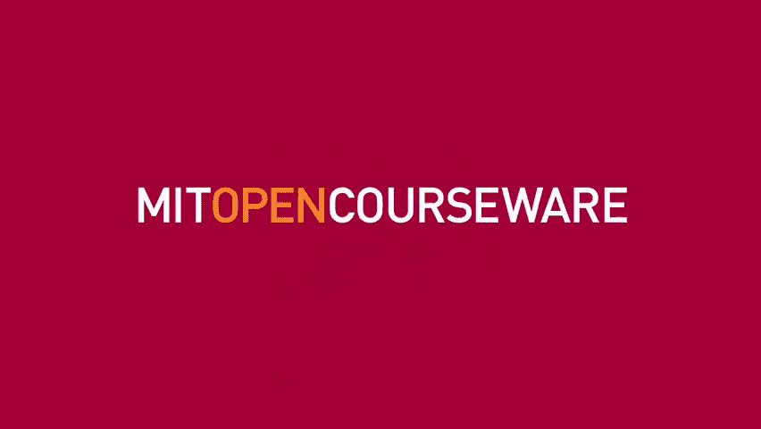
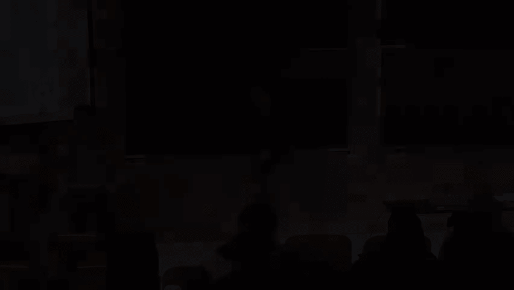

# MIT医疗机器学习中英文字幕 - P10：10.Application of Machine Learning t - 大佬的迷弟的粉丝 - BV1oa411c7eD

所以欢迎大家，今天是本学期四场客座讲座的第一场，从开始的那一周会有客座讲座，从今天起的一周，然后在学期结束时会有另一个，皮特和我决定做什么，就是引进比我们更了解某些专业领域的人。

今天的例子是关于心血管医学的，特别是关于如何在这种情况下对图像使用成像和机器学习，今天的讲座，我们很高兴能请到饶德奥教授讲话，拉胡的名字不断出现，因为我在过去几年里做了研究，首先。

我的小组开始对超声心动图感兴趣，我们说，哦，这里有一篇有趣的论文可以读，我们读了它，然后我们写了另一篇关于做潜艇的论文，保留射血分数的分型是一种心力衰竭，我们读到，我没注意报纸上的名字。

然后突然有人告诉我，下个月有个家伙要搬去波士顿，他在做很多有趣的工作和有趣的机器学习，你应该去见他，我当然要见他，然后我告诉他这些文件，我读过，他说，哦，所有的论文都是我写的，他是这方面的资深作家。

所以拉乌尔已经有一段时间了，嘿嘿嘿，呃，呃，他已经是这个领域的资深人士了，他开始在康奈尔大学进行医学院培训，在纽约市的康奈尔医学院，同时在洛克菲勒大学攻读博士学位。

然后他花了他博士后培训机构后的第一块钱，在波士顿这里，在哈佛医学院，他职业生涯的大部分时间都在加州大学旧金山分校任教，在加利福尼亚，在过去的一年里搬回来担任一个职位。

首席数据科学家对一个勇敢的想法项目来说是正确的，这是麻省理工学院和布里格姆联合发起的一个非常大的倡议，妇女医院学习心血管医学，他会告诉你更多，也许和拉胡的研究真的已经全面了。

但是你今天会听到的事情实际上不是什么，他职业生涯的大部分时间都在做，令人惊讶的是，所以这家伙的大多数人都更多地考虑基因型，以及如何真正连接基因型表型，牧场，但我特别要求他谈谈成像，所以这就是他会关注的。

今天事不宜迟，谢谢你能来，所以我习惯于给临床观众讲课，所以你们是迄今为止最有技术含量的观众，所以你知道，请饶了我一点，但我实际上想鼓励打断问题，这是一个非常固执己见的演讲，所以如果有人有任何问题。

请在上课的时候把它们带上来，等到最后，你知道，在某种程度上，这是固执己见的，因为我觉得有点热情，我们正在做的事情需要付诸实践，它本身不是，纯粹学术上有趣的，我们正在做的许多事情已经开始了。

这里其他人已经在做的事情，但同时，就这样就这样就这样，从那个角度来看是可以的，但它真的必须走自己的路，这意味着我们必须对它的实践有一些成熟的理解，阻力会在哪里，所以讲座会贯穿始终，有某种观点和评论。

希望这将是有用的，所以只是一个快速的轮廓，只是介绍心脏的结构和功能可能不是，麻省理工学院的普通本科生和研究生培训，谈谈心脏诊断的主要类型，以及他们是如何使用的，所有这些都是为了帮助引导。

关于我们如何自动化的想法和决策，并将其引入如何将机器学习人工智能应用到实际临床实践中，因为你需要给出足够的背景，所以你意识到挑战是什么，然后可能每个人都有的问题是数据在哪里，一个人怎么能接触到这些东西。

能够在这一领域做潜在的工作，然后我要尝试一下计算机视觉，谈谈至少我一直在思考的一些话题，与我们正在做的事情相关的，然后谈谈周围的一些工作，超声心动图自动流水线，绝不是金本位制，但实际上只是试图让。

在这个上面打个凹痕，然后思考一下大卫提到的课程，你上周或上节课谈到了心电图，所以那里的一些想法，以及它们将如何有助于对未来类型的方法的洞察力，配有自动口译，然后我的背景实际上更多的是生物学。

所以我会回来说，哦，好了够了，有了这些成像的东西，生物学呢，我们如何在那里做出一些见解，每次人们试图为冠心病获得资金，他们试图大肆宣扬这有多重要，所以这个还是，你知道吗，我们和肿瘤科的人有一些斗争。

但这仍然是世界上主要的死亡原因，然后人们就像，哦，你只是，你只是，你只是在强调发达国家，有你知道的，很多传染病，这些疾病更重要，但即使你看看这些你看看底部，这个还是，如果这是所有的死亡原因，年龄。

调整数，心血管疾病仍然是其中的头号疾病，所以它当然仍然很重要，在一些发展中国家，这种情况越来越多，也是如此嗯，考虑一下心脏的作用是很重要的，因为这将指导，至少疾病分类的方式。

所以心脏的主要作用是它是一个泵，它将含氧血液输送到整个循环系统，给所有需要它的组织，大脑，肾脏，肌肉和氧气，当然啦，是ATP生产所必需的，所以这是一个相当令人印象深刻的器官，它每分钟泵出大约五升血液。

通过锻炼，可以增加五到七倍，对于有条件的运动员来说，不是我，但其他人可以大幅提高，我们需要保持一个非常非常有规律的节拍，所以如果你停顿大约三秒钟，你可能会头昏眼花或昏倒，所以你必须保持心脏有节奏的跳动。

你可以计算出这将是什么，在典型的一生中大约有20亿次跳动，所以我会在整个过程中展示很多图片和视频，所以这可能是值得的，只是停下来谈谈，心脏的解剖结构是什么，所以心脏是这样坐着的。

所以尖的部分就像这样放在一边，所以我要描述一下血液的流动，所以血液来自一种叫做下腔静脉的东西，或者上腔静脉，这是从大脑中排出的，这是从下半身排水的，然后进入一个叫做右心房的房间。

它通过一种叫做三尖瓣的东西移动，进入所谓的右心室，右心室有一些肌肉，它泵入肺部，在那里，血液吸收氧气，所以这就是为什么它在这里显示为红色，含氧血液从左心房流出，然后通过二尖瓣进入左心室。

稍后我们会给你看一些二尖瓣的图片，然后左心室，这是心脏的大主力，把血液输送到，通过身体的其他部分，通过一个叫做主动脉的结构，如此如此穿过右心，通过肺部，穿过左心，穿过身体的其他部分。

然后在这里用黄色显示的是导电系统，你们上节课讨论了电气系统，窦房结在右心房，然后传导，心电图上的p波代表通过那里的传导，你通过保存V节点，有延迟的地方，这是一个公关间隔，然后你通过心室扩散。

也就是QR复合体，然后复极化是T波，那是一种电子系统，当然，这些东西必须紧密地结合在一起，每一种基本的心脏生理学都会显示出这张图，叫做威格斯图，它真正显示了电气系统的互连性，心电图在上面。

这些是提供者用听诊器听的心音，这是捕捉心脏压力变化的流动，在主动脉里，所以心脏在一段叫做舒张的时间里充满，二尖瓣关闭，心室收缩，压力增大，这是一段叫做姐妹的时光，最终一种叫做主动脉瓣的东西突然打开，血。

穿过身体的其他部分，心终于开始放松，房室瓣关闭，然后你再填满，所以这种情况以循环的方式一次又一次地发生，你有这种电学和机械性能的结合，所以我这里有一些照片，这些都是核磁共振，我要谈谈超声心动图。

这是一种非常丑陋的颗粒状的东西，不幸的是，我不得不和核磁共振成像一起工作，它们很漂亮，但非常昂贵，所以这是有原因的，所以这就是所谓的，心脏的长轴视图，这是厚壁的左心室，到左中庭那里。

你可以看到这种美丽的湍流的血液在里面流动，它从心房流向心室，是不是另一个病人，它被称为短轴视图，有左心室和右心室，所以我们有点斜着看，然后这是另一个视图，称为，那里有点沉闷，对不起。

我们可以把它稍微亮一点，这就是所谓的四室视图，所以你可以看到左心室和右心室在这里，所以这些不同观点的原因，就是，最终，人们有了功能和疾病的衡量标准，与这些特定的观点相一致。

所以你会看到他们一次又一次地回来，好的，所以医生喜欢组织疾病定义的方式，围绕着这些相同的函数，所以心脏不能正常泵血导致了一种叫做心力衰竭的疾病，这表现在上气不接下气，腹部和腿部积液，这是通过药物治疗的。

有时你可以有一些人工设备来帮助心脏泵血，最终你甚至可以进行移植，取决于它的严重程度，那是泵，这导致了一种叫做冠心病的疾病，如果血液完全堵塞，你可能会得心脏病，或者心肌梗塞，那是胸痛，有时呼吸急促。

我们通过血管成形术打开阻塞的血管，在里面插个支架，或者一起绕过它们，然后身体的流动，我是说，对不起，血液的流动必须是单向的，所以异常是血液通过瓣膜流动，是一种瓣膜疾病，所以你可以有两种类型的元音。

所以这叫做青色病，也可以有漏音，那叫反流，表现为轻头，呼吸急促晕厥，然后你得修好那些阀门，最后是节律异常，所以像心房颤动这样的东西，这是中庭的颤抖，所以两次缓慢的心跳，心室功能不全可表现为心悸、昏厥。

甚至猝死，你可以在里面插一个起搏器，或者里面的鳍状肢层，或者试图烧掉心律失常，好的，所以这就像是以生理学为中心的观点，但事实是心脏有很多细胞，所以那里有更多的生物学，不仅仅是考虑泵的类型和电功能，嗯。

只有30%的细胞，这些心肌细胞也是如此，这些是参与收缩的细胞，这些是易兴奋的细胞，但这只是30%的细胞，细胞内有内皮，有成纤维细胞，里面有一堆血细胞，我也是，里面肯定有很多红细胞，我也是。

所以你有很多其他的东西，所以我们要回到这里来讨论，我们应该如何看待疾病，思考泵送和电激活的历史方法，但实际上这里可能有更多的复杂性需要解决，所以有很多不同的，所以心脏病学是以成像为中心的，结果它很贵。

因为成像有，你知道，花了很多钱做，所以我这里有美元符号，反映了我们所做的各种不同的测试，所以你上周看到了最便宜的，心电图，所以一美元符号，那是用来，我是说有很多用处，比如说。

人们可以用超声心动图诊断急性心脏病发作，包括声波的超声心动图，最终更多地用于量化结构和功能，会导致心力衰竭，瓣膜病，肺部高血压，这是另一种形式，核磁共振成像在这个国家并不多，但非常昂贵。

但做的事情基本上是一样的，你可以想象，即使它很美，人们过得并不轻松，并能够证明为什么它比这种稍微便宜的方式更好，然后你做血管造影，可以通过猫眼扫描，也可以通过X光扫描，这可视化了血液通过心脏的流动。

寻找要植入支架的堵塞物，膨胀并支架，然后你有这些非侵入性技术，比如PET和Spect，使用像锝这样的核苷酸，铷，他们寻找血液流动的异常来检测是否，有创伤性，有一块心脏没有得到足够的血液。

如果你得到一个这样的，而且很不正常，你经常去那里，你可以去看电影，就像我以前的老师常说的那样，然后你可能会得到，你可能会发现自己的支架边缘或搭桥，所以心脏病学的一个可悲的事情是。

我们不用生物学来定义我们的疾病，我们定义我们的疾病，常与解剖或生理是否异常有关，还是正常的，通常基于这些图像或数字，好的，所以我们必须做出决定，我们也经常使用这些同样的东西，能够做出一些决定。

所以我们必须决定是否要把除颤器，并这样做，你经常需要做超声心动图，看看心脏的泵血功能，如果你想决定某人是否需要血管成形术，你得做个血管造影，如果你想做瓣膜置换，你需要回声。

但其中一些实际上不涉及任何成像，这是我要谈论的挑战之一，这就是所有的未来，如果你能想象建立全新的风险模型，你一直坚持的新分类模型，外面的数据，外面的数据最终被收集起来。

因为有人已经觉得值得为此付出代价了，所以如果你想建立一个全新的风险模型，谁会得心肌梗塞，你可能不会做任何超声心动图，能够用来，因为没有人会一开始就为收集这些东西付钱，所以这是一个能够创新的问题。

我会继续回到那个问题上，因为我想你会被震惊的，我们在这些事情中面临的小样本量，部分原因是因为如果你只是想依靠什么，保险公司会愿意付钱来获取你的数据，你会被困住的，只有能够摆脱这些东西。

我们已经知道了一些，我的大部分工作都在思考如何改变这种情况，好的，所以再多一点，然后我们可以吃更多的肉，所以数据成像数据存储的通用标准，是一种叫做dicom的东西，所以数字成像和通信标准。

在一天结束的时候，有一些压缩的图像数据，有一个二进制标头，我一会儿就给你看，有很多很好的Python库，可以使用这些数据的，你可以用一个免费的查看器，好的，那么我从哪里得到这个。

所以这实际上是一种难以置信的痛苦，所以医院是为了临床手术而设立的，他们不是为了让你容易而设置的，获得大量的数据来进行机器学习，只是不是，只是不是真的在那里。

所以有时你会有一些这样的数据档案来存储这些数据，但人们让这变得困难有很多原因，其中之一是因为图像通常以像素为单位刻录，带有可识别信息的，她会把病人的名字印在图像上，你会有出生日期，你会有其他属性。

所以你就被困住了，他们在那里不仅是一个问题，供应商，不要让摆脱这些信息变得容易，所以你实际上有一个问题，他们真的不容易批量下载或识别，部分原因是，因为这样你就更容易更换供应商，让别人接手。

所以一旦它在里面，他们会让你有点困难，你很难把它弄出来，人们在出售他们的数据，这当然也在发生，所以有一些尝试试图以这种方式控制事情，你想要的许多标签都是单独存储的，所以你想知道这些人的疾病。

所以你有原始的成像数据，但所有临床的东西都在别的地方，所以你有时必须把它联系起来，所以你需要进入那里，所以只是为了给你一点规模的概念，所以我们要做所有的心电图，从布里格姆和妇女。

大约有三千万储存在历史上，这都与成本有关，所以正电子发射断层扫描你可以得到大约8000个，我们是最繁忙的中心之一，你知道的，超声心动图在三十万到五十万之间，档案，所以这变得更有趣了，好的。

那么图标标头是什么样子的，你有某种标识符，然后你在那里有一些信息，图像的属性，病人姓名，出生年月日，这种东西就在那里，有一些可变性，所以这从来都不容易，所以这些不同的模式对他们有一些不同的好处。

这就是为什么它们被用来治疗一种或另一种疾病，所以真正令人头痛的是心脏在运动，所以胸壁会移动，因为我们呼吸，心动，我也是，所以你必须想象一些东西，因为它有足够的时间频率，你不会被心脏本身的基本运动所淹没。

所以这些事情中的一些并不是很好，所以幽灵或宠物获得他们的图像，它们是，你知道的，几分钟内的放射性计数，所以当涉及到像那样移动的东西时，这肯定是一个问题，如果你想有高分辨率，所以你通常没有。

你的空间分辨率很差，最终它不能很好地处理移动方面，所以冠状动脉造影有非常非常快的帧率，这是X光，速度很快，心电图可以相当快，核磁共振和CT不太好，所以图像有一些退化，结果，人们会做一些叫做门控的事情。

他们会在那里做心电图，心电图，试着把不同心跳的不同部分排成一行，然后说，嗯，你知道的，我们从这里拍这张照片，从那里把它和这个对齐，这个暂时，我要谈谈关于注册的问题，但归根结底，这是人们必须处理的问题。

所以这是一个有趣的计算机视觉问题，好的，序言差不多写完了，好的，所以嗯，那么我们为什么要想象这些东西会有用呢，所以事实证明，解释的实践涉及到大量的手工测量，所以像我这样的人和那些应该训练太久的人。

发现自己拿着小尺子测量各种东西，例如，这是动脉狭窄，所以你可以用一点卡尺测量一下，和这里比较说，啊，这里缩小了80%，你可以测量这个房间的面积，左心室，你可以测量它的面积，你可以说啊，它的峰区是这样的。

它的最小面积是这个，因此它收缩了一定的数量，所以我们做那些事情，我们测量，那些东西是手工的，我们做的另一件事是我们实际上只是通过观察它们来诊断它们，所以这是一种叫做心脏淀粉样蛋白的疾病。

具有一些增厚的特点，我会向你展示更多关于这一点的知识，这里有一些斑点，所以人们确实看着说，啊，就是这样，所以有一个，有一种分类问题，要么出现在图像层面，要么出现在视频层面，所以我们来谈谈这是否值得做。

但是但是是的，这是用软件吗，还是你真的拿着尺子和尺寸，所以软件包括点击一个点，拉伸某物并单击另一个点，所以这比从你的后口袋里掏出尺子要好一点，但也好不到哪里去，所以我们要讨论三个小领域，再说一遍。

这不是，我是说，在过去的两年里，我真的参与了这件事，或者说，大卫请我在这里发言是很好的，但我不打算，我想这个房间里的人可能在这个领域有更多的经验，但与我们一直在做的事情相关的领域是图像分类。

然后是语义分割，因此图像分类正在为图像分配标签，非常大的语义分割，将每个像素分配给类标签，我还没有我们还没有做任何关于图像注册的事情，我正在思考一些有趣的问题。

这实际上是将不同的图像集映射到一个坐标系上，好的，所以很明显图像分类是你想象中医生会做的事情，所以也许我们可以模仿这似乎是一件合理的事情，很多事情让放射科医生，解释图像的人确实参与了识别，他们真的很快。

所以他们通常需要几分钟来做像侦探这样的事情，有肺癌，侦探，有人得了肺炎，判断心脏里是否有液体，甚至不到一分钟30秒，他们可以，他们发球非常非常快，所以你可以想象，你知道周围的兴奋浪潮。

图像分类真的是一种后图像化，所以大概三年左右，大约四年前，我们在医学上总是有点迟钝，所以有点落后于其他领域，他们去的地方是已经有数据集的地方，它们是简单的识别任务，所以说，他们受到了很多关注。

和其他地方都被，获取数据有多难，所以如果你不能得到足够大的数据集，你也做不了什么，好的，所以大卫提到你们已经覆盖得很好了，这可能是一顶旧帽子，但我想说，在卷积神经网络之前。

医学中的图像分类空间没有发生任何事情，只是不是，我是说，人们甚至不认为现在值得做这件事，有很多兴趣，所以我有很多不同的公司来，在这些事情上寻求帮助，所以它现在是一种非常吸引人的东西，我想人们还没有想好。

我们将如何利用这一点，例如，如果放射科医生花一分钟到两分钟读一些东西，把它自动化你能得到多少好处，真正的问题是，你不能把放射科医生带走，他们还在那里，因为他们是上钩的人，他们会被起诉的。

它是医学界被起诉最多的职业之一，所以我是说有很多人可以看X光片，你知道你不，你不需要那么多训练，但如果你是那个要被起诉的人，结果是医学上真的没有任何任务转移，没有那种，哦，我要让某某承担九十九。

有什么问题就告诉我，就是不会发生，因为他们最终不愿意把它传递出去，所以这是值得考虑的事情，所以你有一个相对容易的任务，非常昂贵和熟练的人做，他们拒绝放弃，好的，所以这是个问题，但你可以想象有一些场景。

我们将更多地讨论它可能在哪里，所以让我们假设这是一夜之间，放射科医生在家里睡得很舒服，你在急诊室里做了一堆研究，你想弄清楚好吧，我们应该给他们打电话，所以你可以想象可能会有分诊，因为现状是。

我们会把他们一个一个带走，也许你可以想象快速筛选，然后重新确定它们的优先级，他们仍然会被每一个人看着，只是顺序可能会改变，所以这是一个例子，你可以想象可能有单独的，你知道其他人可以同时阅读。

我们会回到这个问题上，你可以有两条流，这是否是一个有意义的场景，也许在资源匮乏的环境中，我们没有与放射科医生合作，也许这是有道理的，我也是，所以我们也会回到这个问题上，好的，所以这里还有一个问题。

所以医学上几乎所有的东西都需要一些视觉发现的确认元素，你知道有些原因很简单，所以假设你想谈谈有一个肿瘤，所以如果你要请外科医生做活检，你最好告诉他们在哪里，仅仅说这张照片有肿瘤是不够的，在它的某个地方。

所以有一些因素，那个，你需要更详细一点，而不是简单地进行分类，用一个水平和图像，但我想说除此之外，所以所以我你知道，当我让我们说，我要让我的一个病人去做瓣膜手术，我和他们坐在一起，发出他们的回声。

和他们并排坐着，把他们指向它所在的地方，拿出一个正常的比较一下，因为我想让他们参与决定，我想让他们觉得，他们不仅仅是信托，他们必须在一天结束时信任我，他们甚至不知道我在展示，我是说。

我会告诉他们他们的名字，但最终还是有一些信任的因素，他们不能这样做，但同时也有一种共同决策的感觉，你试图和一个生活真的很糟糕的人交流，你知道，冒着风险，这就是我们做这个决定的原因，所以你越能想象到。

就越难证明这一点，所以医学是这样的，你知道吗，我发现这篇来自伯克利的本·尤的评论刚刚出版，它谈到了这种紧张，预测准确性与描述准确性之间的关系，所以这是一种，这是我们认为很重要的典型事情，然后呢。

有很多人写过这类事情，医学是艰难的，这里的空间要求很高，在这个空间里几乎是不灵活的，所以这是一个很难解决的问题，就能够取得一些进展而言，所以我们将更多地讨论一个可能发生的事情，好的。

所以这可能是非常熟悉的东西，我也是，所以我们在一些疾病检测模型方面遇到了这个问题，我并不觉得这一切都很令人满意，就能够成功地本地化而言，所以只要翻阅文献，它看起来像是一种能够解释。

图像的哪一部分是驱动某种分类的，那个领域有点古老，也许可以追溯到那之前，但最终有两种广泛的方式，你可以想象找到一个范例图像，最大限度地激活课堂分数，或者你可以拿一个给定的图像说，它的哪个方面推动了分类。

所以在这篇论文中，他们要么做了这两件事，要么优化了这一点，从所有训练数据的平均值开始，他们优化了强度，直到他们为给定的类最大化分数，这就是这里显示的，另一种方法是在某种意义上，你可以对分数函数求导。

相对于所有像素的强度，想出这样的东西，但你可以想象你把这个给一个病人看，他们不会很满意的，所以说，所以很难证明这是非常有用的，但似乎这个领域有所进步，我还没试过这个。

这是马克斯·韦林和他的公司几年前的一篇论文，也许你们对这个有一些熟悉，但这最终是一种不同的方法，从某种意义上说，它们采取了某种补丁，这个紫色的补丁，他们比较最终分数或班级标签，相对于你所知道的。

所以把这里的强度，并将其替换为从外围进行的有条件结果采样，只是比较这两件事，看看你是否被激活，这是一种，这里的红色，也就是，这就是他们做条件采样的方式，然后蓝色是负面的贡献者。

你可以想象这里有更多的区别，然后在医学方面有更多的东西，这是大脑核磁共振，所以取决于这种补丁的大小，你会得到不同程度的分辨率，定位图像中一些相关的区域，所以这是我们非常期待的事情，医学界的很多要求。

就能够展示这一点而言，至少我们最初的尝试不是很令人满意，用我们正在做的事情做这件事，但也许这些算法变得更好了，好的，所以接下来重要的是，好的，所以这就是人们所做的，所以所以我花了，你知道。

我在哈佛做了心脏病学研究员，我只是追踪圆圈，我就是这么做的，我只是在画圆圈，我和我伸出一把尺子，然后把它喂进去，至少程序为我计算了它的体积，面积和体积，但除此之外，你必须自己做这件事。

所以这就像是一个完成的任务，有时你可能不得不，所以说，这里是一个关于卷的例子，通过追踪这些东西来计算，报道中的大部分内容都涉及到这样做，所以这似乎是一个非常明显的任务，我们应该能够改进。

所以医学往往不是最有创意的，在尝试一系列不同的架构方面，所以如果你看看报纸，他们都跳上了这个单元，作为最受欢迎的，一种最受欢迎的语义分割体系结构，所以这里的人可能很熟悉，我真的只是它捕捉到了这一点。

这种编码或收缩层，你在哪里取样，然后是一种对称的向上采样，然后最终有这种跳过连接，你在那里拍摄图像，然后你把它和这种上采样层连接起来，这有助于获得更多的本地化，所以我们用这个做论文，我们会稍微谈谈这个。

它在医学文献中很受欢迎，其中一件很烦人的事情是你会发现，你会发现的一些图像，比如说心室，你会发现这个分割得很好的区域，然后你会发现这个小卫星心室，图像会选择，所以你会得到这个，你知道的。

问题是这种像素级分类往往是一个问题，人类永远不会犯那样的错误，但这听起来像是，它是它在，这是一种常见的张力，这种专注于相对有限的规模最终会有问题，当谈到拿起全球，一种全球架构。

所以在文献中有很多不同的解决方案，我只是强调了，其中一些来自谷歌不久前发表的一篇论文，捕捉到的东西之一，这些想法和膨胀的卷曲，所以你想象你有某种卷积，建立在卷积上。

所以最终你会有一个更大的接收场对这一层来说，尽管你没有真正增加你必须学习的参数的数量，所以有一些，好像有很多，这不仅仅是我们的问题，但对这个领域的许多人来说是一个问题，所以我们需要多一点冒险精神。

在尝试这些其他方法方面，我们确实尝试了一点，但没有发现巨大的收益，但我认为最终还需要做更多的工作，好的，所以在开始工作之前，我要说的最后一件事，图像配准的想法真的是。

所以我谈到了有时有些技术是有局限性的，在空间分辨率或时间分辨率方面，这是一个PET扫描，这里的这种红光，在背景中，我们有一个心脏的猫扫描，很明显，这是一张注册不良的图像，PET扫描就在这里。

当它真的应该在这里排队的时候，所以你有一些注册更好的东西，也提到了这个问题，但最终加廷，如果你有一张从不同心脏周期的不同部分拍摄的图像，你必须以某种方式将它们对齐。

所以这是一个非常听起来像是计算机视觉世界中一个非常成熟的问题，我们在这个空间里什么也没做，但最终它已经存在了几十年，以为我至少会摸摸它，触摸它，所以这是一种老派的方式，然后现在人们开始使用有条件的。

能够学习几何变换的变分自动编码器，这是普林斯顿的西门子集团，又有这篇论文，没有什么我要关注的，只是想把它作为一个仍然感兴趣的领域提出来，好的，所以我想我们做得很好，但是你说四三五五，好吧，好吧。

打断一下，请打断一下，好的，我希望我没有讲得太快，好的，所以我要谈谈，你知道吗，正如大卫所说，这不是我的领域，但越来越多的人对参与其中感兴趣，部分原因是我对临床医学的挫折。

所以这是我对临床医学的挫折之一，所以心脏病学并没有真正改变，它失败的原因之一就是，早发疾病，所以这里是这里是一个，这里有一种典型的个人资料，有点滑稽，所以像我这样四十出头的人已经开始有一些问题。

用其中的一些数字，所以我喜欢开玩笑说，自从我从加州回到哈佛系统，我的血压上升了十分，不幸的是，这是真的，但是这些变化已经开始发生了，没有人对此采取任何措施，这样你就可以去看医生了，你知道你也在说不。

我不想吃任何药，他们就像不，否，否，你不应该吃任何药，所以你就哼哼唧唧，十年过去了，十五年过去了，最后你说好吧，看起来至少我的同事在吃药，所以也许我愿意这么做，所以我们有很多东西可以治疗，但往往很难。

你在医生层面上看到了这一点，我也是，是的，对于上坡的价值，个人偏差有多大，用于，所以最佳值是和是就像一个参考值，你可以离开，所以血压，这么说吧，所以人们认为最优的是小于120，两百人中不到八十人。

人们在，你知道的，所以你会在两个，但是一百四十年代会有很多人，和一百五十，在一段时间内，对此会有一定程度的虚无主义，我的病人会说，哦，我和停车管理员打架了，哦我，你知道的，我只是，你知道的。

我有一个非常糟糕的电话，我是说，你知道有无数的理由，一个人不应该开始服药，这种情况会持续很长时间，是呀，蕾妮，你如何评估血压的风险，因为我喜欢噪音，国家肯定会去看一次医生，是啊，是啊，所以好吧。

所以这是一个很好的观点，如此如此，哦，是啊，是啊，所以所以问题是，就是，那个，我们看到的许多风险因素，对它们来说有固有的可变性，血糖是这些事情的另一个很好的例子，那么那么你好吗，如果你要有一个单点估计。

在一次诊所就诊中出现的，你有多相信，所以有几件事与此有关，所以其中一个是，那就是人们可以带着监视器被送回家，他们可以在欧洲有两个四小时的监视器，这比在这里做得更多，然后你知道问题是他们经常。

你知道他们会说，然后你去看连续六次的访问，他们都有提升的东西，但这是真的，所以这些是有一个噪声点估计，人们已经表明，平均往往做得更好，但同时，如果这就是你的全部，你知道吗，偏见很有趣。

因为偏见来自某种程度的压力，但是我们在生活中有很多压力，我希望我不是病人生活中压力最大的部分，所以我认为最终会有所以我的意思是，这是一个，问题是这是一个，这是一个很好的理由，有人说服你放弃他们。

让他们做任何事情，这就是最终发生的事情，所以这可能是一段很长的时间，我想这没关系，所以这是可怕的部分，好的，结果发现一旦出现类似心力衰竭的症状，所以五年后50%的死亡率，有人因第一次心力衰竭住院。

通常症状就在那个时候，所以很不幸，这些事情往往是在背景中发生的不可逆转的变化，基本上你直到比赛后期才真正有任何症状，所以我们遇到了一个问题，我们有一个巨大的延伸，我们知道有风险因素，但我们有很大的延伸。

在那里没有人对他们做任何事情，然后在那之后，我们的事情就会相对较快地走下坡路，不幸的是，你知道，我会提出一个理由，可能反应可能是最好的，在那边的这个阶段，费用真的到处都是，所以我们真的很想找到。

这是我认为医学上缺少的，我稍后会再来讨论这个问题，但我们真的想有这样的，你知道的，如果你要在这个无症状阶段做什么，最好便宜点，你不会每天或每年都得到核磁共振成像，对于有这些的人来说，你知道没有症状。

我是说，系统就会破产，你有那个，所以我们需要这些低成本的指标，可以告诉我们在个人层面上，不仅仅是如果我们有一千个像你这样的人，有人会受益，但真的，这是我的病人会说的，他们会。

他们会对他们的心电图或回声每年都在做感到非常兴奋，因为他们想知道，与去年相比情况如何，他们想在他们的水平上进行一些比较，不仅仅是一些关于某某的公共卫生报告，你知道这对一百个像你这样的人来说是一个好处。

所以它应该是一种低成本，应该对某事进行反思，个人层面，应该相对特定于疾病过程，在某种程度上有表现力的，通过治疗应该会好起来，我认为这是非常重要的事情之一，如果有人做了你要求他们做的事情，希望那会更好看。

然后我们激励，我想这就是人们被激励的方式，他们得到的回应，所以我会提出一个理由，即使是简单的事情，就像超声波，我在这里展示了一个确实捕捉到了其中的一些东西，不是所有这些，但他们有一些这样的东西。

所以所以你有，例如，在高血压的情况下，左心室肿块开始增厚，这是一种定量的连续度量，它只是随着时间的推移而变厚，心开始改变，泵送功能会随着时间的推移而变得更糟，左心房就是这里的这个结构。

这个薄壁结构太神奇了，从某种意义上说，它几乎是心脏压力的晴雨表，这是一个可怕的参考，好的，所以说，但它，但它往往会变得越来越大，以一种非常微妙的方式，在任何症状发生之前，所以你有这个，这只是一个观点。

对呀，这是从超声波上获得的简单视图，在个人层面上捕捉其中一些东西，所以这就引出了我的一些想法，我们可以想象自动解释，如此受益，如果你想想想你不太可能在哪里，所以用这些非常，非常困难。

结束阶段或复杂的决定，在那里你有一个超级熟练的人，甚至一开始就收集数据，他们经过训练，他们很有经验，你有一个非常昂贵的硬件用来收集数据，你有专家解释，这是在病程后期进行的，你必须做出非常艰难的决定。

所以你可能不想把它搞砸，所以可能不是尝试在那里安装自动化系统的好地方，但什么会吸引人，就是试图使那些甚至根本没有做过的研究成为可能，所以转移到初级保健环境，使用低成本手持设备，所以即使是现在。

也有公司开始尝试自动化，数据的获取，通过帮助人们收集它，并引导他们在疾病过程的早期收集正确的观点，这里没有真正的症状，决策支持就在附近，你是应该开始一些药物还是加强它们，低负债，低成本。

所以这是一个我们想关注的地方，在这个领域引入某种创新，嗯好吧，所以这又回到了这种幻灯片，我说过你可以想象这些东西很低，挂果，但也许这些不是我们应该关注的，相反，我们应该专注于以低成本实现更多数据。

从我们收集的数据中获得更多，一开始就帮助人们获得它，所以这是一类事情，这就是我在上一张幻灯片中突出显示的，你可以想象在医院系统级别的后台运行的东西，只是想看看是否有人在某些方面被遗漏了，然后分诊。

我将在下一张幻灯片中讨论，我们会回来的，然后真的，这也是我进入这个行业的原因之一，我们想做一些超越练习的事情，只是简单地重复我们已经做过的事情，所以这种对中间状态的定量跟踪的想法，疾病亚类。

这实际上是真正的原因，我进入了这个空间，是因为想要增加数据的规模才能做到这一点，这是你可能想去的地方，所以，所以心电图的例子是一个有趣的例子，因为心电图自动判读系统已经存在了四五十年，他们真的开始了。

嗯，大约两千年初，当人们意识到这一点时，所以有一个结构，有一个，有一种模式叫做圣海拔，我不知道你们有没有谈过，这是流向心脏的血液完全停止的标志，所以肌肉开始死亡，在2000年初，有一个质量衡量标准。

一种品质，那种运动说，一旦有人看到，你应该在一个半小时左右的时间里找到有人在做什么，所以问题是过去的日子和做这件事的旧方法，甚至你也知道，这大约是，我是住院医生，你就会，嗯，你得先打电话给心脏病专家。

把他们叫醒，他们会来，你会给他们发一张图像，他们会看着它，他们会决定是否，这就是他们看到的模式，然后他们会激活实验室，导管室，他们会进来，你损失了大约一个小时，在这个过程中一个半小时，因此。

他们决定自动化系统可以用来，你知道的，使救护人员或急诊室医生，所以非心脏病专家可以说，嘿看，这就是我们认为正在发生的事情，让我们把团队带进来，所以人们会被动员起来，人们会来医院，在有人证实之前。

没有人会做任何事情来开始这个案子，但整个轮子已经转动起来了，所以你有这样的分诊系统，你在那里做出决定，你还没有最终决定，但你在加速事情，所以这是一个例子。

在那里你可以想象试着把它转移到一些东西上是很重要的，所以这是一个例子，会有假阳性，人们会嘲笑急诊室的医生，嘲笑救护车司机说啊，你知道的，他们不知道自己在做什么，你知道他们没有经验，但最终人们会死去。

因为他们在等心脏病专家来读这个，读心电图，所以你必须从事情的角度来考虑这些，可能会有延误成本的地方，好的，所以回到回声，好的，那么为什么回声研究，因为这可能不是典型的，它是一种视频的汇编。

大约有70个不同的视频，通常在我们所做的研究中，我们所在的中心，它们被多个循环和多个不同的观点所占据，通常需要相当熟练的人来获得这些观点，他们需要大约四五分钟到一个小时来收集数据，多个不同的视图。

速记员会改变深度来放大给定的结构，所以你可以理解，已经有人在这个过程中非常有经验，甚至收集数据，这是个问题，因为你需要把他们从画面中剔除，因为做这些事情很贵，嗯，所以我们在做，1万2至1万5千瑞士法郎。

布林厄姆可能在三十到三十岁的时候更忙一点，五千医疗保险，在2011年有700万这样的表演，可能有数亿份这样的档案，这么多数据，所以我们我们去年发表了一篇论文，试图自动化围绕这个的所有主要过程。

也是做这一切的部分原因，让一点点自动化对你没有帮助吗，因为在一天结束的时候，如果你必须让心脏病专家做其他一切，作为一个摄影师，做其他一切，你走了一小步，真正节省了什么，所以这里的目标是从原始研究开始。

直接从机器上下来，试着做所有的事情，所以这涉及到对所有这些不同的视图进行排序，用它来做经验性的质量评分，分割我们使用的五个主要视图，直接检测某些疾病，然后计算所有标准质量和体积类型的测量结果。

所以我们想做这一切，这是一个，你知道的，我觉得，在算法中使用了惊人的独创性，但同时，对社区里的任何人来说，试图承担这个责任都是非常大胆的，当然，总的来说，你能想象到的所有反弹，当你试图做这样的事情时。

我还在听，但是但是但是有兴奋，当然在行业方面，那真的很令人兴奋，这是可行的，所以我在2006年左右经营着一个生物实验室，然后决定这样做，我表弟的丈夫是宾夕法尼亚大学的工程系系主任，我给他发了电子邮件说。

你知不知道，伯克利的任何人，我住在那附近，我通勤时间很长，所以我你知道，我就像更接近，有有，你认识的人在那里，所以他就像，是啊，是啊，我知道我在那里认识Rujabashi，她以前在宾夕法尼亚大学。

我知道阿廖沙·埃弗罗斯，所以他只是，你知道的，他只是给他们发了电子邮件说，你能这样见面吗，实际上也做苔原马利克，所以我遇到了他们中的一些人，然后我试着找一些愿意工作的人，所以我每周在那里呆一天。

持续了大约两年，只是写代码，试着让这种项目开始，所以我们有几个不同的机构，jeff sang是伊利诺斯州大学的一名大四本科生，现在作为一名研究生，这很有趣，因为很难毕业，学生级别的人对事情感到兴奋。

那是现有算法的应用，嗯，但他们很乐意建议，我想我认为这是如此，我最后不得不自己写很多代码，但是本科生当然很兴奋做这些事情，因为它比家庭作业好，我可以付钱，但是。

但我认为最终试图找到那个甜蜜的地方是很有趣的，并找到最终可能，从算法的角度来看可能很有趣，我也是，你知道，我这些天想做更多这样的事情，好吧我们不是第一个对视图进行分类的人，所以有人已经发表了一些东西。

但我们希望它比这更细致入微，我们希望能够区分，比如说，这个结构是不是，左心室被切断，因为我们不想测量它，如果它被切断，我们不想测量中庭，如果这里完全切断了，所以我们希望能够有一个分类器。

能够区分其中一些东西，这不是一件容易的事，你知道，很多标签都是我，我在漫长的通勤中乘火车，从加州东湾到加州大学旧金山分校，所以我做了很多标签，我做了很多分割，我也是，所以我撒了很多谎。

这是另一件有趣的事情，你经常需要做繁重的工作，你可能需要一个相当专业的人来做这件事，也可以，但是但是是的，所以大部分时间都是我，所以我追踪了很多这些图像，然后我你知道我得到了一些其他人的帮助。

但你不会让一个计算机科学的本科生为你追踪艺术结构，你也不会让他们对做任何事情感到兴奋，所以我们最终没有那么多数据，我想我们可能会做得更好，但我们有五个主要的观点，我们实现了一种改进版本的单元算法。

我们没有，我们施加了一点惩罚来保持这种问题，比如说，一点杂乱的心室在外面，我们罚了说好，如果那离中心太远了，然后我们会有损失函数，考虑到这一点，这有点帮助，嗯，但这是我们的方法，这是一个。

这是一笔相当可观的交易，能够做所有这些事情，那通常会很乏味，结果，当我们开始分析事物时，我们可以分割每一个视频的每一帧，典型的回声阅读器会取两帧并跟踪它们，就是这样，这就是你得到的一切。

所以我们可以在每一个心脏周期中做任何事情，因为从一个节拍到另一个节拍有惊人的可变性，所以你知道，认为这应该是金本位制有点傻，但这是金本位制，嗯，所以我们有，你知道成千上万的回声，所以这是另一件事。

事实证明，几乎不可能进入回声，所以我在前端写了一个击键编码器，只是模仿我进入学习并下载它们，所以这是我唯一能得到的方法，所以我在一年多的时间里积累了大约3万份研究，但是没有办法进行批量下载，又是这样。

你得做一些基础工作，愿意在这个空间里玩，所以我们有一个，你知道我们可以用相当多的研究来测量，你知道体面的价值观，我是说，我认为思考一个人能有多好是很有趣的，一个人能靠多近，我们发现的一件事是。

当出现很大的偏差时，这些都是平淡无奇的奥特曼情节，手动的几乎总是错的，哦好吧，所以好吧，奥特曼的情节如此平淡无奇，我不喜欢在医学领域使用相关性，安东·奥特曼大约三十年前在《柳叶刀》上发表了一篇论文。

抱怨相关性和相关系数最终不好，度量，因为你可能会有一些实质性的偏见，你真的想知道，如果这是金本位制，你需要得到那个值，所以这真的只是看看，假设参考值和，假设自动值，然后根据两者的平均值来策划，原来如此。

我在这里按百分比做的，但最终只是，所以你有，你只是把，假设左心室容积，你有一种自动化的手段，与手动测量的类型相比，然后你比较一个减去另一个的差异，所以你会站在一边或另一边。

所以理想情况下你会完美地坐在这条线上，然后你会看到，不管你是不是聚集在一边或另一边，所以这只是一种，人们试图避免相关系数的典型事情，因为他们认为他们并没有真正告诉你，你是否知道真的有一个金本位制。

这里真的有价值，你想接近那个值，所以这是一种，这是查看诊断比较的标准，所以我们有大约八千件东西，所以当你知道评论者给了我们一个艰难的时间在这里的空间，这里没有那么多研究，但最终还是有一些。

当我们手动查看一堆它们时，他们总是手动的，只是错了，不是有错别字之类的，所以这让人放心，但我们有时大错特错，所以有时候，你会发现我们错的地方，会是这些复杂得可笑的先天性心脏研究，我们从来没有。

你知道我们以前从来没有举过这样的例子，所以我是说这是一个需要吸取的教训，有时你会在这种方法中非常偏离，你得想一想，我们最终做的是循环错误，在那里我们可以识别这些并反馈给它们，然后继续这样做。

但这仍需改进，好的，所以再次发挥作用，有几个度量函数，你知道我们是如此，有几个，有一家公司有一些东西，在这个领域得到了FDA的批准，因为它有一个自动弹射分数，所以我认为我们总体上比他们的数字要好。

但是是的，我想那只是其中之一，那种期望能够做到的，然后我们遇到了一个问题，所以说，所以我们在比较现状，就像我说的，一个人追踪两个图像，并将它们进行比较，就是这样。

所以我们每次研究可能会处理两三百张不同的帧，和竞争的中值平滑，我们做的远不止这些，那么我们怎么，在金本位制方面，我们该怎么办，如果你只考虑到可观察到的可变性，你会有8%到9%的绝对值。

将其与参考的60%进行比较，所以这太可怕了，那么你应该怎么做，我想人们做的一件事是，他们收集多个读者，并要求他们这样做，但这就像，你会找一群心脏病专家做，你知道有一千个研究给你，很难想象有人会这么做。

你可以把它和另一种形式进行比较，所以我们还没有做这个，但你可以，比如说，把它和核磁共振比对说，你是否更符合另一种情态，然后这是一种间接的，但你可以在试验中看到类似的结果，看看你是否做得更好。

所以你可以做一些事情，我们决定做的一件事，就是在研究本身中寻找结构的相关性，然后说，嗯，嗯，质量，你知道所以，所以我们知道，比如说，增厚的心脏导致更大的压力增加和左心房增大。

所以我们可以寻找这些东西之间的相关性，看看我们是否做得更好，在大多数情况下，我们与那里的一切都不相上下，所以我不认为我们更好，有时我们比事情更糟的时候更好，我想在很大程度上，这是另一种尝试。

因为我们被困住了，我是说，你怎么，你如何用一个黄金标准来工作，最终，我不知道，我不认为有人真的把信任作为金本位，这是一个必须不断出现的问题，这只是一个例子，你可以促进，这种在护理点低成本串行成像的想法。

所以这些是正在接受化疗的病人，所以赫赛汀还是知觉，赫赛汀，就像盗梦空间，有一个是一个是一个嗯，所以人们得到了筛选回声，所以你可以想象，如果你让它更容易获得和解释，你要关心的只是功能和大小。

所以你可以想象自动化，所以我们这样做只是为了证明概念，你可以想象做这样的事情，我最后想说的是，所以我们还是对不起，这个空间里的最后一件事是，你也可以想象直接检测疾病，所以你不得不说，嗯，为什么这值得。

是呀，好奇，我想是时光倒流，但是如果你把模型和人类地面的真相混合在一起，也许是生物基地，说实话，一种粗鲁的方式，因为我们将摆脱心脏病专家的共识，而不是像你需要从核磁共振成像或其他东西中得到的。

也许不一定是你说的话，有点基于潜在的生物学，或者这两个东西一般都是留着的，是啊，是啊，我是说，我想这一切都是，这些都是早期，为了很多这个，我想任何时候你做任何比，然后读者会给你一个艰难的时刻。

但你可以想象，尤其是你可能想调整一些东西，以便能够更接近于这样的东西，所以是的，我觉得，我觉得不幸的是人们对于如何解释，但这确实有道理，你可能知道一些事情，理想情况下，你希望能够拥有一些有用的东西。

可能和模仿人类所做的不完全是一回事，否，我想一个好主意，我认为这将是，下一波浪潮会更多地考虑这个问题，就喜欢而言，我们如何改进那边发生的事情，而不是简单地把它拖回那个，所以有多种罕见病。

我以前有个诊所专门治疗这些，他们往往在中心被错过，看不见他们的人，通常你可以想象的一个地方是，你可以专注于试着把它们捡起来，你可以想象这可能只是监视，在后台奔跑，它不一定是一种实时识别，所以有一些疾病。

做这些事是很有道理的。很明显，所以这是一种叫做肥厚型心脏病的疾病，我以前在诊所里看到，所以异常增厚的心脏，年轻运动员猝死的主要原因，所以雷吉·刘易斯，感谢上帝，我是说，有一群人突然死于这种情况。

心律不稳定，猝死，心力衰竭，它是家族遗传的，如果你识别出它，你可以做一些事情，所以这实际上是一个相当容易的任务，从某种意义上说，这往往是非常明显的，所以我们围绕这个建立了分类模型。

我们试图理解它在做什么，所以我们试着做一些这样的关注或突出类型的事情，他们在一定程度上很不满意，因为我认为你的整个形象有很多不同的特征，所以你只是得到这个斑点，但我想也许我们只是没有正确地实施它。

我不是很确定，但你很棒因为，你知道左心房变大了，心越变越厚，我是说图像上有太多的变化，就这一点而言，这有点不令人满意，所以我们做了一些简单的事情，然后取概率的输出。

并将其与我们实际了解的一些简单的事情进行了比较，并发现有一定程度的相关性，但我想让它变得更好一点，心脏淀粉样蛋白，一种非常流行的疾病，现在有治疗方法，所以制药公司对识别这些人非常感兴趣。

他们真的以相当高的速度被错过，所以我们为此建立了另一个模型，通常我们每样东西都有250到300箱，也许有几千个控件，然后这个有点有趣，这是二尖瓣脱垂，所以这个所以这个，嗯，这就是瓣膜脱垂的样子。

所以如果你想象一下阀门的平面，它向后扣，所以它这样做，那样做是不正常的，这是一个正常的元音，所以你注意到它不会扣回去，所以这有点有趣，心脏周期真的只有一部分，这将真正突出这种异常，至少是这样。

所以从临床上看，人们在等待，心脏周期的这一部分被扣回了，他们画了一条假想的线，他们测量那里的位移，所以我们建立了一个合理的聚焦模型，所以我们对这些图像进行了分相，并选择了心脏周期的部分，相关的。

都是以自动化的方式，并围绕它建立了一个模型，就能够做到这一点而言，这是相当好的，就能够检测到这一点而言，嗯是的，在特定的时间，图像上的模型也是如此，或者喜欢，你能不能回到，因为很明显你在视频上做得不好。

所以我们把整个视频，我们在分割它，我们在分阶段，弄清楚，你知道什么时候结束很傻吗，然后用这些作为，所以用一堆这些来分类，你怎么知道时间点，嗯，这就是我要说的，所以我们用体积的变化，是啊，是啊，是啊。

是啊，是啊，是啊，正是因为，因为你知道典型的回声会有一个心电图来检测，但手持设备没有，所以说，我们想远离那些涉及幻想的事情，所有的铃铛和哨子，我们试图单独使用图像，能够判断心脏周期，我们就是这样做的。

既然你提到了手持设备会告诉我们与这些有点不同，你觉得他们长得很像吗，我是说我们有一些，我们得到了我们得到了一些，我是说就图像质量而言它们看起来很相似，你可以获得同样的观点。

所以我想我们还没有证明我们可以做到这一点，部分原因是没有足够的训练数据，但它们看起来很漂亮，我知道我是说在加州大学旧金山分校和布里格姆，所有的伙伴都在用，它看起来几乎是一样的，传感器有点相似。

图像质量很好，分辨率很好，帧率可能不一定会上升到那么高，但在大多数情况下，我不认为这有什么不同，这就是下一个空间，是呀，你能评论一下，所以你提到了这三个例子中的每一个都可以在监视算法中使用，是啊，是啊。

你能评论一下，伴随着这种真正的正的假的正的权衡，你就会，你实际上会很现实地使用，是啊，是啊，是啊，是啊，这是一个很好的观点，我想我想每一个都会有所不同，你真的想有一些成本，所以我会。

我通常会站在更高灵敏度的一边，让你知道把它交给心脏病专家，所以我会工作，你知道的，但我想我的意思是你必须选择一些，让我们看看，假设你是一个项目，你是产品经理，从这三个中选择一个，也许好吧太久了。

是的这是一种非常罕见的疾病，所以就这些人而言，你的前科很低，啊，所以我，你知道的，我想你可能会想沿着这条路的某个地方播出，这种，你知道的，这个区域，所以只是在做什么，所以。

你可能仍然会有相对较高的假阳性率，即使是那个空间，但如果你知道我会争辩说这需要治疗心脏病的医生，可能只有几分钟的时间来再次查看这项研究，如果你接了其中一个病人那将是一个巨大的胜利，你知道的。

所以我想成本可能不会那么高，你只需要证明这一点，我想我认为最好的淀粉样蛋白治疗，比如说，用这些，我是说这是一种很好的尖锐的向上划水，在那里，外面有新药，他们在乞求病人，他们真的很难识别他们。

所以你可以再想象一次，这是一种基于好处的计算，为了那个身份，你给我带来了什么负担，个人必须过度阅读一些东西，你可能会调整它，取决于，疾病是什么，你在向谁推销它，但如果是，你说的对，你会把人压垮的。

如果一百个最终是一个真正的积极因素，那你就不会有很多粉丝了，你能评论一下从基础上抓狂，你能很好地预测的，举个例子，为什么你不能输，不管是什么区别，那些你很好，嗯，那是件好事，所以这是一个很好的观点。

我也不，我真的不知道，我不知道，从某种意义上说，我没有仔细看过，但我猜它们很厚，很明显，在那种意义上，所以我们有一个心电图模型可能会早期发现这一点，我的意思是你想要的东西是修复它，当它是可以治疗的。

没有一些可笑的夸张的东西，所以你可能需要多种模式，其中一些比其他的更敏感，可以感染早期疾病的人能够做到这一点，所以关于这种疾病有一些有趣的事情，特别是，所以白内障有时会发生在，所以理想情况下。

你这样做的方法是，你知道吗，我实际上是在咨询这样的事情，你最好混合电子健康记录，其他发现中的一些东西，镜像发现，眼部发现，再加上一些心脏的东西，并有一些理想的在最理想的治疗状态下感染疾病的东西。

也许回声不是最好的，我想我们会回到这个问题上，最后我们有一点时间，好的，UCSF正在提交，我不知道，我不认为这实际上是可以申请专利的，但他们正在申请专利，我今天只是在填写文件，我不知道。

但我的代码都是免费的，所以说，用于学术非营利用途，我们只是想让它变得更好，我是说，我想作为一个学者，我在这里的最终观点是试图展示什么是可能的，然后你知道如果你想买一个商业产品。

那么你需要有人站在行业的一边做出漂亮的东西，并使其可用等等，但我想最终我只是想表明嘿，如果我们能以可扩展的方式做到这一点，并发现一些新的东西，然后你们就可以赶上并做一些最终可以部署的事情，有趣的是。

我在新西兰有一个合作者，他们资源匮乏，所以他们积压了大量的病人，他们没有足够的速记员，他们没有足够的心脏病专家，所以他们试图实施这种超级快的五分钟研究，然后有自动化，所以他们希望我们的精确度更高一点。

但我想他们已经准备好推出了，如果我们能得到一些可能有更多训练数据的东西，是的，你是新西兰人吗？否，我想他开始谈论这件事了，在，我在学术界也能看到，我感觉到我们总是在追求完美的准确性，是啊，是啊。

就像你说的，你不会在诊断中摆脱心脏病专家，所以我有一个哲学问题，你追错东西了吗，我们应该追求完美的准确性，嗯一点点，是的，所以问题就在附近，我们的目标应该是什么，我认为这是一个，这是一个，你知道。

所以我们应该，应该是，我们应该追求一定的精确度吗，很难达到，尤其是如果从来没有一个场景，没有临床医生参与的地方，我们是否应该考虑一些足够好的东西来进行下一步，我认为这是一个很好的观点，还有田野。

有趣的是，从行业方面来看也很有趣，字段是从模仿模式开始的吗，因为改变练习要困难得多，直接把东西放进去要容易得多，说嗨，我知道你必须做这些测量，我帮你做吧，你可以看看他们，看看你是否同意。

心电图就是这么做的，所以现在没有人在测量QRS的宽度，没有人这么做，我是说还没结束，你得到了一个荒谬的数字，你会改变它，但在大多数情况下，你就像，已经够近了，但你几乎必须从这个开始，很难做到这一点。

所以我觉得我和大卫谈过，这有点像，那种，主机界面令人着迷，我们如何一起想出更好的办法，但要被收养要困难得多，因为它需要以一种不同的方式购买，你为我做我的工作，但更多的是我们走到一起做更好的事情。

我认为这会很有趣，关于如何解决这个问题，好的，所以几个沉思，然后我要谈谈一个勇敢的想法，如果我们有时间，或者我可以拿，我会停下来回答问题，嗯，因为这有点像生物学上的冒险，好的。

所以我觉得我们真的应该看看当人们问，周围的人让我很难过，回声和我很好，嗯，心电图已经存在很长时间了，那里有自动化，所以让我们想想它在那里是如何使用的，然后看看是不是，你知道这并不像人们想象的那样古怪。

所以说，我觉得，许多常规测量都将以自动化的方式进行，然后你就可以，我是说已经在我们的软件里了，你可以放一张小图片，把分割覆盖在原始图像上，说它看起来有多好，所以这很容易，所以你可以这么做。

然后这种关心点的想法，自动化诊断在一些紧急类型的情况下是有意义的，所以也许你需要快速检查一下功能，也许你想知道他们的心脏周围是否有很多液体，你不一定想等，所以这些地方可能会有一些创新，快点把事情做完。

然后你总是有人在后面检查背景，就像我给你看的心脏病发作一样，我认为这个问题和回声在那里，所以如果你有这样的，如果你首先需要有技能的人能够获取数据，你被困住了，因为他们能很好地读懂回声。

我是说一个很好的速记员可以帮你读整个研究，所以如果你已经有那个人参与了管道，那么真的很难引入一个大的进步，所以你需要弄清楚如何让初级保健医生离开街道，把一台机器放在他们手里，让他们得到图像。

然后为他们自动化所有的解释，所以直到你能把任务转移到那个空间，你还是太高了，技能水平，所以现在有这些公司在这个领域，我是说有一些人试图，我是说你知道很容易想象，如果你能训练一个神经网络来分类视图。

你可以让它识别，我是说这有点像注册的想法，如果你偏离了10度，你就能认出来一点，或者如果你需要翻译，我是说你可以训练一个模特来做到这一点，所以我想现在已经发生了，所以这是否会被采纳是个问题。

但我认为最终你想转向，技能较低的人员，你需要在那个空间里做点什么，好的，所以这是它变得更难的地方，就是思考如何制造东西，提升医学，超越我们正在做的，这又回到了这个问题上，我提到过，在一天结束的时候。

你不能，你找不到回声的新用途，除非数据已经存在，为了你，能够证明有更多的价值，现在有一种鸡和蛋的东西，在某种意义上如此如此，我想介绍的是，我们可以得到更大的数据集，它们不一定是一百个视频数据集。

它们可以是三个视频数据集，但我们希望能够弄清楚，如何使越来越多的这些研究，所以你可以想象学习更复杂的东西，你想随着时间的推移跟踪人们，你想看看治疗反应，所以你得看看人们在哪里，钱已经在哪里。

看看谁能做到这一点，所以制药公司对，因为他们有第二阶段的试验，他们可能只有三个月或六个月的时间来显示一种药物的一些好处，然后他们真的很有兴趣看看一个月后是否有差异，两个月，三个月，四个月。

所以那可能是一个你得到，他们很节俭，但他们有钱，所以你可以想象如果你能在那里引入这种管道，只需手持简单，快速获得更多的频率，你表现出治疗反应，因为你可以想象它可以在实践中推广，在那之后，你需要有人资助。

从这个开始，然后你可以想象一旦你有了一个用例，然后你可以想象它会变得更多，这种监视的想法，你可以想象那是非常可行的，你可以有一些，我是说，问题是你连档案里的数据都拿不到，但假设你能得到。

你可以让这个系统寻找淀粉样蛋白，寻找任何东西，那将是一场胜利，我也是，就是能够想象做这样的事情，它不会给临床工作流程带来任何压力，这不会让任何人难堪，我想最终它只是想弄清楚，如果那样的话，也许在寻找。

有人可能看起来很糟糕，我想如果他们错过了什么，但是但是是的，我认为它只是试图识别个体，嗯，所以这是一个区域，我想那很难，嗯，所以这种想法，这就是我开始的地方，这种疾病分类和风险模型的思想，所以这就像。

这比我们正在做的任何事情都复杂，我想我们在这种事情上很粗鲁，挑战之一是人们对新的类别或新的风险模型不感兴趣，如果他们没有办法改变练习，这变得更加困难，因为你不仅需要介绍模型。

你需要展示如何以某种方式结合这个模型，能够识别对那里做出反应的人，我的意思是它总是，在一天结束的时候，它总是归结为治疗，所以你能告诉我一些亚类的人谁会在这种药物上做得更好吗，这意味着你必须有试验数据。

所有那些拥有所有数据的人，不幸的是，因为回声太贵了，像布里格姆这样的地方每个回声收费3000美元，那么在审判中只有一百个人有回声，或者三百个人在回声，你有一个5000人的审判，其中5%有回声。

所以你需要改变完成的方式，因为你的力量严重不足，无法探测到任何东西，那是那种工作中的一个子组，嗯，所以是的，不幸的是，事物的研究速度在空间上超过了实践的变化，直到我们能够进行更多的数据收集。

所以我可以停在那里，我本来想谈谈幻灯片上的血细胞，但是是的，是啊，是啊，是啊，是啊，好的，我们为什么不那样做呢？看到一些文件，人们说好，我们大致知道解剖学需要什么，这样我们就可以填补缺失的细节。

在那些日子里，切片比较远，所以他们会产生幻觉，是啊，是啊，当然，这样做的好处是给你一个更好的模型，但也有风险，你们试着把它留给一些，是啊，是啊，这是一个伟大的观点，如此如此好吧，所以问题是如此的。

你知道，心脏成像有很长的历史，所以有一段时间，在那里有这些活跃的心脏形态建模者，所以人们有了这些模型，围绕着心脏应该是什么样子，从很多很多，许多研究，他们当时正在使用它。

当你用这些相对粗糙的多层扫描仪做CT时，他们将重建心脏的三维图像，基于一些预先存在的心脏应该是什么样子的几何模型，当然，这对一些风险是有好处的，从某种意义上说，某人可能在缺失的空间里非常不同，你可以。

所以问题是这些前科是否可以以某种方式引入，如何做到这一点并不简单，但我的意思是，那是，每当你看到这些糟糕得离谱的分段时，你就像，这太白痴了，我们应该能够引入一些，我见过人们，比如说，放一个自动编码器。

我是说那不是，这不完全是得到它，但它实际上得到了一些，这些粗糙的特征，但没有，我认为就使用某种程度的几何先验而言，我想我可能在那个空间里看过一些文学作品，我们在那里什么都没试过。

我们没有任何数据可以做到这一点，不幸的是，我怀疑，嗯，是啊，是啊，我只是不知道这有多难，我是说，你提到不想看到一个小的额外中庭，是的，还有距离，所以这是一种积累知识的方式，耶不，我来吧。

我记得当我在这个空间开始的时候，我就像这是耳部，为什么我们不能这样做，为什么我们没有办法做到这一点呢？我们当时找不到，任何简单的架构都可以做到这一点，但我肯定在那个空间里有什么东西，嗯。

我们自己也没有这些祈祷的数据，我是说，这种东西有很长的历史，现有的从头开始的心脏模型，来自牛津和新西兰集团，就那件事而言，他们一直在做这种多尺度建模，我肯定会有的，我是说，会很有趣的。

是否有人在那个空间里向前推进，还是只是更多的数据，我想这总是那种紧张，我能问问超声波吗，是啊，是啊，你没有给我们看超声波，对呀，是啊，是啊，你做了，是啊，是啊，是啊，是啊，回声和所有，哦，但是好吧。

但那真的很贵，超声，就像那里，更便宜的超声波，你可以想象你一直做对，是的，所以，所以有一个，嗯，有一家公司刚刚推出了一款价值2000美元的手持产品，超声与订阅模型，啊是的，所以我想所以所以。

菲利普斯有一个大约8000美元的手持设备，两千块左右已经很便宜了，所以我认为这就是手持设备的空间，我们说的是资源，发展中国家的贫穷国家，在那里，每个人口的医生可能很少，那种东西，什么样的成像可能有用。

我们可以应用计算机视觉算法，我仍然认为超声波是最佳选择，它有多功能性，它的成本大约是，和，我敢肯定那些公司以更低的成本出租，在那种地方，我也是，所以我们把，或者我把，其实，它可能没有得到资助。

我不太确定，但是，但看看撒哈拉以南非洲，与布里格姆的一名医生合作，他去撒哈拉以南非洲旅行，并试图建立一些自动检测类型的东西，在那个空间里，所以没有，我想肯定有人对此感兴趣，可能会有更大的胜利。

然后我提议的那种东西，但是是的，否，我认为这是一个很好的观点，那将是，它也是便携的，你可以有一个基于电话的东西，所以它其实是，从这个角度来看，它很有吸引力，五分钟好的，我觉得我在实质性地改变话题。

但不是完全好，这就是那张幻灯片，我展示了，嗯，我投球的方式，试图激励你思考超声波，但我不确定超声波真的能实现所有这些，我不认为这是最好的生物工具，潜在的疾病途径，这些事情中的一些可能会迟到。

就像大卫说的，也可能不是那么可逆，所以我们得到了一个勇敢的想法，现在八千五百万美元来在一种特定的疾病上取得一些进展，所以冠心病，冠心病，是那种傲慢的技术，你只是把很多钱扔在某个地方。

以为你会解决所有的问题，我很乐意接受，但我觉得有一些问题所以这就是我想做的，所以我想在过去的五年里一直这样做，六年前，我甚至开始在这里，这在一定程度上激励了我很长一段时间，这就是我们的问题。

所以我们在研究心脏病，所以冠心病或冠心病是心脏中的动脉，你不能得到那些，所以你不能做任何生物学，你不能做这些事，癌症患者，你不能活检，那个，你在那里什么也做不了，所以你被困住了。

你想要得到的东西是无法访问的，我谈到了很多成像是多么昂贵，但其他那些组学的东西真的很贵，我也是，所以这对他们来说并不是不可能的，你就不能做麦片了，1000美元的蛋白质组学，这不会很快发生，然后，嗯。

我所说的一切，我们在样本量方面严重不足，尤其是如果你想描述潜在的复杂生物过程，所以我们预计我们需要高维数据，我们需要大量的样品，弗拉基米尔<<unk>尼克在那边，然后这里还有一个问题。

所以这些东西需要时间，这些疾病需要时间，所以如果我现在引入一个新的测试，我要如何证明这些都是有益的，因为这种疾病发展了十到二十年，所以我不打算谈论解决这个问题的方法，好的，所以很多数据的一个问题是。

不是特别有表现力，很多都是临床上的东西，同样的成像材料，所以所有这些大的研究，这些耗资数十亿美元的大型研究最终只有回声和核磁共振，你知道，也许有一点遗传学，但他们真的没有东西。

这是一种低成本的表达生物的东西，我们理想中希望能够做到的，所以这真的很贵让八千五百万美元看起来像个笑话，就复杂性而言，它并不那么丰富，所以我们想做一些不同的事情，所以这是疯狂的事情，嗯。

我们关注的是循环细胞，所以这是一种妥协，他们的参与有一个相当好的理由，如此如此，有很多数据表明，这些是冠状动脉疾病或冠心病的因果介质，所以你可以在牌匾里找到它们，有这么多患有自身免疫性疾病的病人。

肯定有加速形式的耳硬化症，有，所以有一种叫做Connecinemab的药物，抑制巨噬细胞分泌Isone-β，这对podisease的死亡率有好处，白细胞群本身就有突变，与早期心脏病发作有关，所以有一个。

那里有很多，这一直在发生，有很多老鼠模型表明，如果你进行突变，只有在白细胞室里你会完全改变，疾病本身就很好，大量的数据表明有一个信息丰富的，那里的细胞类型，它是可访问的，嗯，已经有很多预测模型了。

他们可以用这些来做，它们表达了许多与，在许多这些生物过程中都有一个窗口，所以我们专注于计算机视觉方法来处理这些数据，所以我们决定，如果我们不能做组学的东西，因为它太贵了，我们将拍摄幻灯片。

每个人有数万个细胞，然后我们可以引入荧光染料，可以集中在许多不同的细胞器上，然后我们可以潜在地扩大表型空间，通过添加各种扰动，它可以揭开人们的属性，甚至可能在基线时相对不存在，我得到了。

我想我被计算机视觉的体验赋予了力量，为了回声的东西，我说嘿，我能做到，我可以训练这些模特，如此如此，所以我们，我们现在所处的位置，我们可以在哪里，你知道这东西每人要花几美元，它很便宜，你可以。

你知道你可以继续扩大表型空间，你可以把带进来，你可以在这里拿任何你想要的东西，你还在这种年龄，你可以，所以我们只是背着，我们只是在周围盘旋，只有几个研究助理在诊所里徘徊，我们一个月可以做成千上万的病人。

所以每年有成千上万的病人，所以我们可以在这里进入深度学习样本量，所以我们希望这些初级分析成本低，可重复性，富有表现力的，对治疗有理想反应，所以这就是这里的空间，我们有很多东西。

我们有所有这些人的医疗记录数据，我们可以有选择地做体细胞测序，我们和基因组协会，我们有所有的心电图数据，我们有选择性正电子发射数据，所以它有很多额外的拇指，我们希望能够走我们便宜的化验。

对那些更贵的东西，但对此有更多的历史数据，所以这就是我这些天的生活，时间问题已经解决了，因为我们在MGH找到了一个合作者，他有350万张这样的记录，在细胞计数和细胞计数据方面，可以追溯到大约三年前。

所以我们应该能在那段时间里举办一些像样的活动，我需要为350万条记录建立一个文档分类模型，来决定他们是否患有冠心病，但听起来是可行的，我们在这个空间里无所畏惧，然后他们还有1300万张图像。

所以成千上万的人用幻灯片的文字，这样我们至少可以得到合适的重量来转移，从这些数据中学习，我们这样做是为了急性心脏病发作的病人，如此如此是的，所以这是我最终要做的，所以它是现有成像之间的桥梁。

现有常规医学数据，这种低成本的表达系列类型的东西，最终希望扩大表型空间并降低成本，我认为我从处理昂贵的图像数据中得到的所有教训，促使我在这个空间周围建造一些东西，所以这是我的，它现在是我的孩子。

你们很多人都知道，很多事情要人们参与，如果他们想，这些是一些资金来源，所有的权利。

