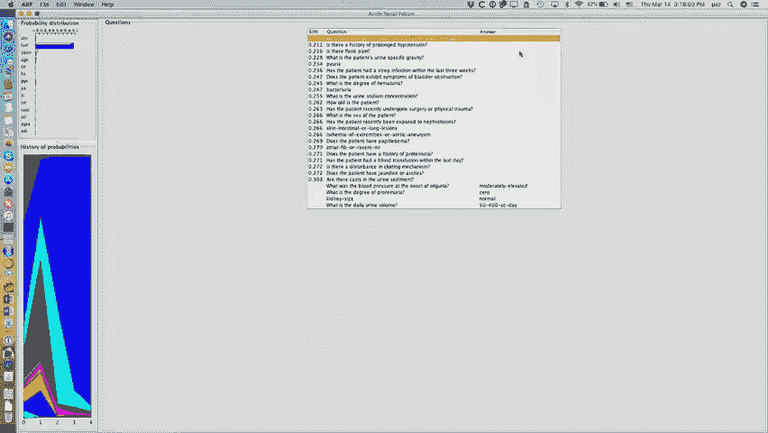

# MIT医疗机器学习中英文字幕 - P11：11.Differential Diagnosis - 大佬的迷弟的粉丝 - BV1oa411c7eD

所以我只是引用维基百科，诊断是对某一现象的性质和原因的鉴定，鉴别诊断是对某一特定疾病或状况的鉴别，与其他表现出类似临床特征的人，所以当医生面对病人时，他们通常会谈论鉴别诊断。

他们列出了这个病人可能有的问题，然后他们经历了一个过程，试图找出它到底是哪一个，这就是我们今天要重点讨论的，现在，只是为了吓唬你，这是一个可爱的人体循环生理学模型，我不会让你对这个模型的所有细节负责。

但这很有趣，因为这至少是20年前的事了，人们如何理解循环系统中发生的事情的最新技术，它有各种控制输入来决定你的激素水平如何变化，心血管系统的各个方面，以及有氧运动不同成分之间的相互作用。

心血管系统相互影响，所以原则上，如果我能把这个模型调到自己身上，然后我就可以做出各种很好的预测，你知道吗，如果我增加全身血管阻力，下面是将要发生的事情，随着系统的其余部分调整，如果我冠状动脉堵塞。

那么我的心输出量会发生什么，还有各种其他的东西，所以这将是非常棒的，如果我们有这种模型，不仅仅是心血管系统，但是整个身体，然后我们会说好，我们很好地解决了医学问题，对于大多数系统，我们没有这种模型。

还有一个小问题如果我给你这个模型，这与特定的病人有什么关系，你怎么知道，它有数百个微分方程，由这张图表示，它们有数百个参数，所以你知道当我们开始使用这个模型时，我们是在开玩笑，你真的必须杀死病人。

为了做足够的测量，能够调整这个模型以适应他们特定的生理，当然，这可能不是一个很好的实际方法，我们通过开发更多的产品而变得更好，测量这些东西的非侵入性方法，但这进展得很慢，我不指望我。

或者你们中的任何一个人都能活得足够长，这种进行医学推理和医学诊断的方法实际上会发生，所以说，我们今天要看的是，什么是，诊断推理有哪些更简单的模型，和，我要冒昧地，给你带来一点历史，因为我觉得有趣的是。

这些想法是从哪里来的，所以第一个想法是建立流程图，哦，顺便说一句，我忘记了的体征和症状，如果我们在课堂上讨论过这个，所以征兆是医生看到的东西，症状是病人经历的，所以一个标志是客观的。

它是可以在你的身体之外说出来的东西，症状是你感觉如此，如果你感到头晕，那就是症状，因为这对你以外的人来说并不明显，你头晕，或者你有痛苦之类的事情，嗯，通常我们谈论的是表现或发现，这是一个超级类别。

所有关于病人的事情都是可以确定的，所以我们来谈谈，那么你是否试图诊断一种单一的疾病就会有一些问题，或多种疾病，这使得模型更加复杂，不管你是想做概率诊断还是明确的或明确的，然后我们将讨论一些实用理论方法。

我只想提到一些基于规则和模式匹配的方法，所以这有点可爱，这是1973年的，如果你是一个女人，走进麻省理工学院的健康中心，并抱怨可能有尿路感染，他们会拿出这张纸，上面有很好的颜色编码，他们会检查一堆盒子。

你知道，如果你击中一个红色的盒子，代表一个结论，除此之外，它给了你关于进一步测试的建议，这基本上是一个分诊仪器，上面说，这位女士是否有需要立即关注的问题，所以我们要么叫救护车送他们去医院。

或者我们可以告诉他，第二天回来看医生，或者它实际上是某种自我限制的东西，我们说，你知道，吃两片阿司匹林，它就会消失，所以这就是现在这里的尝试，有趣的是，如果你看看这个项目的历史。

在贝斯以色列医院和林肯实验室之间，它一开始是一个电脑辅助工具，所以他们正在建造一个计算机系统，应该这样做，然后，但你可以想象在20世纪60年代末，二十世纪七十年代早期的计算机相当笨重，你知道的。

那时个人电脑还没有发明出来，所以这就像主机，操作种类，它是，它很难使用，所以他们说，嗯，你知道的，这是一个足够小的程序，我们可以把它减少到大约20个流程表，二十张这样的床单，他们开始打印，我被逗乐了。

因为在大约180年，一天晚上我在办公室工作，头痛欲裂，我去了麻省理工学院医疗中心，果然，护士拿出了一张头痛的床单，和我一起经历，并决定，你知道，几片泰诺应该能治好我，但很有趣，所以这真的用了一段时间。

现在像这样的方法的困难，其中有许多，很多，医学界的许多人认为它们非常脆弱，它们非常具体，在达成共识以建立这些东西方面有很多努力，然后它们不一定在很长一段时间内有用。

所以麻省理工学院在我头痛后不久就停止使用它们了，但如果你去医院，你在书架上看，你仍然会发现看起来像这样的手册，说我们如何应对热带疾病，对呀，所以你问了一堆问题，然后根据流程图的分支逻辑。

它会告诉你这是否严重，原因是如果你在波士顿接受医学培训，你不会看到很多热带疾病，所以你没有经验基础，在此基础上，你可以学习并成为做这件事的专家，所以他们用这个作为一种备忘单，好的。

我提到疾病和症状之间的联系是诊断的另一个重要方法，我向你发誓，在20世纪60年代有一份报纸，我想这实际上是提议的，所以说，如果你们中有人在古代图书馆闲逛过，图书馆过去有卡片目录，是物理纸片，硬纸板。

他们用这些做的一件事是，每张卡片都是一本书，然后边缘有一堆洞，并取决于书的分类，沿着不同的维度，就像它的杜威十进制数，或者是它的顶部数字，国会图书馆的号码什么的他们会在边界上打洞。

这让你可以很容易地对这些书进行分类，所以如果你在人们还书的时候把一堆卡片放在一起，你把它拉到一堆纸牌上，你想让它找到所有的数学书，所以你要做的就是把针穿过这个洞，代表数学书籍，然后你摇晃那一堆。

所有的数学书都会掉下来，因为它们被打了一拳，所以有人认真地提出这是一种诊断算法，事实上，并实施了它，甚至试图从中赚钱，我认为这是一次商业冒险的尝试，他们将向医生提供这些代表疾病的图书证。

这些洞现在代表的不是数学和文学，但它们代表了呼吸急促和左脚踝疼痛，一次又一次，当人们进来抱怨一些情况时，你会把针穿过那种情况，你摇一摇，就会出现有这种共同条件的牌，所以这种方法的一个明显问题是。

如果你有两件事不对劲，对吧，那么你很快就会没有牌，因为，嗯，你知道的，什么都不会从堆里掉出来，所以这没有去任何地方，但有趣的是，即使在二十世纪八十年代末，我记得新英格兰医学杂志的董事会问我。

来参加一个会议，他们得到了一个推销，从一个提出这个诊断模型的人那里，除了现在在计算机上实现，而不是在这些图书卡上实现，他们想知道这是不是他们应该支持的事情，并投资于，和我。

我的一群同事向他们保证这可能不是一个好主意，他们应该远离它，他们做到了，嗯，一个更复杂的模型是类似于天真的贝叶斯模型的东西，它说，如果你有病，我的光标在哪里，如果你有病。

你有一系列的表现可能是由疾病引起的，我们可以做一些简化的假设，说你一次只会得一种病，这意味着该节点的值，d形成一套详尽无遗和相互排斥的价值观，我们可以假设这些表现是条件独立的，只取决于你所患疾病的观察。

但不是在彼此身上，也不是在任何其他因素上，如果你做了这个假设，然后你就可以应用好的老托马斯贝叶斯规则，顺便说一句，这是贝叶斯牧师，你们知道他的历史吗，所以他在英国是一个不墨守成规的部长，他不是数学家。

除了你知道，我是说他是个业余数学家，但他决定向人们证明上帝的存在，所以他发展了贝叶斯推理来证明，所以他的论点很好，假设你完全不相信，所以你有50%的几率认为上帝存在，然后你说，让我们看看奇迹，让我们问。

这个奇迹发生的可能性有多大？如果上帝存在，如果上帝不存在，所以通过创造一堆奇迹，你可以让人们越来越相信上帝一定存在，因为否则所有这些奇迹都不可能发生，所以他有生之年从来没有出版过这个，但在他死后。

他的一位同事在英国皇家学会发表了一篇论文，所以，贝叶斯一举成名，作为概率推理概念的创始人，至少是相当简单的情况，就像他的情况一样，上帝的存在或不存在，或者在我们的情况下是某种疾病的原因，某些疾病的性质。

所以你可以画这些树和贝叶斯规则很简单，我相信你们都看到了，再次与医学接触的一件事，很多时候，你不仅仅对一个可观察到的对你的概率分布的影响感兴趣，但你对一系列观察的影响感兴趣，所以你能做的一件事是。

你可以说好，这是我的一般人口，假设第二种疾病有百分之三七的患病率，疾病1有12%等，现在我做了一些观察，我应用贝叶斯规则，所以这相当于找到了一个较小的患者群体，他们都有任何答案，我得到了第一个症状。

然后我就一直这么做，这就是贝叶斯规则的顺序应用，当然这取决于所有这些症状的条件独立性，但在医学界，人们不喜欢做数学，甚至算术多，他们更喜欢做加法而不是乘法，因为这样更容易，所以他们所做的是，他们说好。

而不是在概率框架中表示所有这些数据，让我们用赔率来表示，如果你用赔率来表示，一些疾病的几率给出了一系列症状，考虑到独立性假设只是疾病的先验几率，你观察到的每个症状的似然比，所以你只要把这些相乘在一起。

然后因为他们喜欢加法而不是乘法，他们说，让我们把两边的对数都取下来，然后你就可以把它们加起来了，所以如果你还记得我在谈论医疗数据的时候，比如格拉斯哥昏迷评分或阿帕奇评分。

或者衡量病人做得有多差或多好的各种措施，这通常涉及到将对应于不同条件的数字相加，他们所做的正是这样，他们在应用顺序贝叶斯规则，有了这些独立性假设，以原木的形式，而不是乘法，对数赔率，他们就是这么做的。

好的，呃，很快，嗯，在之前的一次演讲中，有人想知道接收器运算符特征曲线，我只是想给你一点关于这些的见解，所以如果你在两组病人身上做一个测试，红色的是病人，蓝色的不是病人，你做一些测试，你所期望的是。

测试的结果将是一些连续的数字，它将被分发，类似于井病人的蓝色分布，像病人的红色分布，通常我们选择一些阈值，我们说好，如果你选择这个作为预测生病或健康之间的门槛，那么你会得到的是。

蓝色分布中右边的部分是假阳性，红色分布中左边的部分是假阴性，好的，而且经常，人们会选择这两条曲线相交的最低点作为阈值，但现在当然不一定是这样，如果我给你一个更好的测试，像这样的一个，那太棒了。

因为基本上没有重叠，极小的假阴性和假阳性率，正如我所说的，你可以选择把门槛放在不同的地方，取决于你想如何权衡敏感性和特异性，我们通过接收器操作员特性曲线来测量这一点，它的一般形式是。

如果你得到这样的曲线，这意味着敏感性和特异性是有确切权衡的，如果你在抛硬币，好的，所以它是随机的，当然如果你能撞到顶角，这意味着两个分布之间不会有任何重叠，你会得到一个完美的结果。

所以通常你会得到介于两者之间的东西，所以通常如果你做一个研究和你的AuC，这个接收器操作员特性曲线下的面积刚刚超过一半，你几乎一文不值，而如果它接近一个，那么你就有了一个很好的方法来区分这些类别的病人。

好的，下一个话题，理性意味着什么，对不起，圆周率是非理性的，但那不是我说的，嗯好吧，所以有一个理性的原则，上面写着，那个，你想做的是以这样的方式行事，以最大化您预期的效用，例如，如果你是个赌徒。

在扑克游戏中，你可以选择各种下注方式，或者如果你是一个完美的计算器，得到一个，你知道下一次抽奖有一个女王，然后你就可以做出一些理性的决定，是多赌还是少赌，但你也必须考虑到。

我怎样才能使我的对手相信我不是在虚张声势呢，如果我在虚张声势，我怎样才能使他们相信我在虚张声势呢？如果我不是在虚张声势，等等，所以那里有一个复杂的模型，但尽管如此，这个想法是你应该以一种方式行事。

这会给你最好的预期结果，所以人们开玩笑说这是经济人，因为经济学家假设这就是人们的行为方式，我们现在知道这不是人们真正的行为方式，但这是他们行为的一个很常见的模型，因为它很容易计算，它有一些合适的特点。

所以正如我提到的，每一个行动都有成本和效用措施，某种结果的价值或好处，也就是你赢了多少钱，无论你是死是活，或质量调整寿命年，或其他各种效用措施，你知道你住院要花多少钱吗？所以让我给你举个例子。

这实际上来自新英格兰医学中心的决策分析服务，塔夫茨医院在二十世纪七十年代末，这是一位上了年纪的中国绅士，他的脚长了坏疽，坏疽是一种感染通常血液循环不良的人会感染这些，他面临的是是否截肢。

或者试图对他进行医学治疗，对他进行医学治疗，意味着向系统注射抗生素，希望血液循环足够好让他们到达感染区域，嗯等，嗯，选择变得有点复杂，因为如果医疗失败，然后呢，当然病人可能会死。

或者你现在可能要截肢整条腿，因为坏疽已经从他的脚蔓延到脚上，现在你要砍掉他的腿，那么你应该做什么，你应该如何推理，所以帕克的工作人员想出了这个决策树，顺便说一句，在这本书中，在这篇文献中。

决策树的意思与决策树不同，像C4。5，所以你在这里的选择是截肢或开始医疗护理，如果你把脚截肢，假设病人有百分之九十九的机会活下来，有百分之一的可能性，你知道的，也许麻醉会杀死他们。

他们估计有百分之七十的机会完全康复，他有25%的机会病情恶化，如果他的病情加重，有百分之五的可能会死亡，你现在面临着另一个决定，我们是截肢整条腿还是继续用药，再一次，有各种各样的结果。

有各种各样的估计概率，现在，这个小组推动的关键是，这些决定不应该基于医生的想法，对你有好处，它们应该基于你认为对你有好处的东西，所以他们非常努力地试图引出，你的脚被截肢值850分，在一千的尺度上。

健康是1，死亡是0。

好的，现在你可以想象这个数字对不同的人来说会有很大的不同，你知道的，如果你问勒布朗·詹姆斯，如果你的脚被截肢，他可能会认为这比我想象的要糟糕得多，因为你知道把我的脚截肢会很痛苦。

但我仍然可以做我专业做的大部分事情，然而，作为一个篮球明星，他可能做不到，那么你如何解决这样的问题，嗯，你说，好的。

在每一个机会节点，我可以计算出这里发生的事情的期望值，所以这里是点6乘以995点4乘以零，这让我对这个决定有了一个价值，在这里做同样的事情，我比较这里的值，选择最好的一个，这给了我这个决定的价值。

所以我把这个决策树折回，我的下一张幻灯片应该是，是啊，是啊，这些是你得到的数字，你会发现尝试医疗的效用更高，比立即截肢的效用，如果你相信这些数字和那些公用事业，这些概率和那些效用。

现在的困难是这些数字变化无常，所以你想做一些敏感性分析，你说，比如说，如果这位先生用一只截肢的脚把他的生活估价为九百英镑呢，而不是八百五十，现在你发现截肢看起来是一个稍微好一点的决定，比另一个。

所以这其实是，在临床医学中的应用，现在有成千上万的医生接受过这些技术的培训，试着和个别病人一起解决这个问题，当然啦，当人们观察大量人群时，它更多地用于流行病学基础上，呃，他们，呃。

所以做研究的服务会阅读文献，他们会在数据库中查找，他们会试着估计这些概率，我们今天可以比他们当时做得更好，因为我们有更多的数据可以查看，但你可以说，对人们来说还好，你知道的，这个年纪脚坏疽的男人。

他们中有多少人有以下经历，这就是这些是如何估计的，你知道其中一些对我来说就像百分之五，好的，所以我才这么说，然后你从哪里得到这些实用程序的问题是一个棘手的问题，嗯，所以一种方法是做标准的赌博，上面写着。

好的，你知道，索洛维奇先生，我们要玩这个游戏，嗯，我们要滚一个，嗯，公平的死亡，或者一些会得出零到一之间的连续数字的东西，然后我要玩游戏，我把你的脚砍下来，或者我掷这个骰子，如果超过某个阈值。

那我就杀了你，所以现在如果你发现我漠不关心的地方，如果我说好，八点，你知道那是百分之二十的死亡机会，好像很多，但也许我会去九个，现在，你已经说好了，这意味着你重视九岁时没有脚的生活，健康的价值。

所以这是一种方法，这通常是这样做的，也不稳定，所以人们做了一些实验，让别人给他们这样的数字，作为一个假设，然后当那个人最终，实际面临这样的决定，他们将不再遵守这个数字，所以当情况真实时，他们会改变主意。

但它很好，因为它太深了，所以你可以跑六个，他们实际上并没有这么做，它是，这是假设，下一个节目我想再告诉你一次，这项技术是作为博士论文开发的，1967年在麻省理工学院，所以这是刚出炉的。

但它仍然使用这种想法，这是一个发表在《美国医学杂志》上的项目，这是一本高影响力的医学杂志，我想这实际上是第一个计算程序，那本杂志曾作为医学杂志出版过，并讨论了急性少尿症的诊断问题，肾功能衰竭。

少尿意味着你尿得不够，肾是你的肾，你的肾脏出了问题，你没有产生足够的尿液，好吧，现在这是一个很好的问题，可以用这些技术来解决，因为如果你出了什么事，突然，很可能只有一个原因，如果你已经85岁了。

你有一点心脏病，还有一点肾病，一点肝病和一点肺病，不能保证你有什么地方出了问题，导致了这一切，但如果你昨天没事，然后你就不再撒尿了，很可能有一件事出错了，所以这是这个模型的一个很好的应用。

所以他们说有14个潜在的原因，这些都是详尽无遗的，相互排斥的，有两个，两个，与差分有关的七个测试、问题或观察，这些都是廉价的测试，所以他们不涉及做任何昂贵或对病人危险的事情。

它在实验室里测量东西或问病人问题，但他们不想问他们所有人，因为那很乏味，和，所以他们试图尽量减少他们需要收集的信息量，以便作出适当的决定，现在在真正的问题上，有三种侵入性测试既危险又昂贵。

然后是八种不同的治疗方法，我只想告诉你们这个问题的第一部分，这篇1973年的文章向您展示了程序的样子，是你知道的，计算机终端，它给了你选择，你会输入一个答案，这就是当时最先进的技术。

但我要做的是上帝的意愿。

我将演示我对这个程序所做的重建，所以这个，这些家伙是停下来撒尿的潜在原因，急性肾小管坏死，功能性，急性肾功能衰竭，尿路梗阻，急性肾炎，等等，这些是先验概率，现在我得警告你，这些数字实际上是由人们估计的。

把他们的手指伸向空中，弄清楚风是朝哪个方向吹的，因为你知道，一九七三年，没有很好的数据库可以求助，然后这些是可以问的问题，以及您在第一列中看到的，是概率分布的期望熵，如果你回答了这个问题，好的。

所以这基本上是在说，如果我问这个问题，根据我的疾病分布概率，每个可能的答案的可能性有多大，然后对于这些答案中的每一个，然后我用得到答案的概率来衡量结果分布的熵，这让我得到了问这个问题的预期熵。

这个想法是期望熵越低，这个问题就越有价值，所以如果我们举个例子，最有价值的问题是老尿症发作时的血压是多少，这个彩色的小图表向你展示的是，如果你看初始概率分布，急性肾小管坏死约2例，百分之五。

已经下降到很小的数量，而其中一些其他的重要性已经大大增加，好的，这样我们就可以回答更多的问题，我们可以说一个，让我们看看，什么程度，有蛋白尿吗，尿液中有蛋白质吗，我们说不，没有，我们说不，没有零，对呀。

然后它说下一个最重要的是肾脏的大小，我们说肾脏大小正常，所以现在突然功能性急性肾衰竭，顺便说一句，是这些有趣的医学类别之一，说它不好用，不能向你解释为什么它不能很好地工作，但这是一种普通的东西，果然。

我们可以继续回答关于，你知道的，你产生的尿液少于50毫升吗，这是一个很小的量，或者在五四百之间，记住这是给那些生产不够的人的，所以通常你会超过四百岁，所以这些是唯一的选择，所以让我们说它是中等的。

所以你可以看到概率分布一直在变化，在最初的程序中，他们有一个任意的阈值，说。

当这些疾病原因之一的概率达到95%时，然后我们切换到一个不同的模式，现在我们实际上愿意考虑，做昂贵的测试和昂贵的治疗，我们建立一个决策树，正如我们所看到的，在坏疽脚的情况下，找出其中哪一个是最佳方法。

所以这里的想法是，因为构建一个包含两个七个潜在问题的决策树变得非常繁忙，我们用启发式说，信息最大化或熵约简，是一种合理的方法来关注这个病人的问题，然后一旦我们很好地专注于，然后我们就可以开始对剩下的。

现在可用的更重要、更昂贵的测试，这个程序运行得不太好，因为，他们的决策分析部分的实用新型特别可怕，它并没有真正反映现实世界中的任何东西，他们有一个递增的实用新型，说病人要么好转。

或者保持不变或者变得更糟，按照效用的顺序，但它们与他好转的程度不一致，或者他变得更糟了，所以它不是很有用，所以尽管如此，在二十世纪九十年代，我在一个医学信息学会议上教教程，观众席上有一群医生。

我给他们看了这个节目，一个医生后来走过来说，哇哦，它的想法和我一样，我不这么认为，但很明显它，你知道它在做一些与他思考这些案件的方式相对应的事情，所以我想这是件好事，所有的权利，嗯。

如果我们不能假设只有一种疾病会发生什么，潜在的人的问题，如果有多种疾病，嗯，我们可以建立这种二部模型，说我们有一个疾病列表，我们有一系列的表现，疾病的某些子集可能导致，表现的症状。

所以表现只取决于存在的疾病而不是彼此，因此，我们有条件的独立，这是一种无法解决的贝叶斯网络，我马上给你看的一个程序，你知道四五百种疾病和成千上万的表现，以及这些网络精确解技术的计算复杂性。

随着网络中无向循环的数量呈指数级增长，当然，在这项工作中有很多无方向的循环，像这样，嗯，所以在，最初是在二十世纪七十年代初，叫做对话，然后他们被起诉了，因为有人拥有这个名字，然后他们称之为内科医生。

他们被起诉是因为有人拥有这个名字，然后他们称之为QR，代表快速医学参考，没有人拥有这个名字，所以在1982年左右，这个项目有大约500种疾病，他们估计大约有70到70个，内科主要诊断的5%。

大约三千五百种表现形式，它花了大约15个人年的时间，坐在那里阅读医学教科书和期刊文章，查看他们医院的病人记录，这项工作是由匹兹堡大学的一位计算机科学家领导的，和UPMC的医学主管，匹兹堡大学医学中心。

他只是个狂热分子，他让所有医学院的实习生，到1997年，花了几个小时来开发这些数据库，他们通过一家公司将其商业化，该公司购买了它的版权，他们有，那家公司已经把它扩大到大约750个诊断。

和大约五千五百个表现形式，所以他们把它做得更大，我试着在所有的幻灯片上加参考资料，下面是QR中每个诊断的数据，有一系列与唤起强度和频率相关的表现，所以我平均一分钟就能解释清楚。

每种疾病大约有75种表现每种表现，除了你在这里看到的数据，还有一个重要的衡量标准说，解释这种特殊的症状或体征有多重要，或最终诊断中的实验室价值，例如，如果你头痛，这可能是偶然的，解释它并不那么重要。

如果你的胃肠道系统出血，解释这一点真的很重要，你不会指望那个病人的诊断，这并不能向你解释他们为什么会有这种症状，然后这里有一个例子，酒精性肝炎，这里的两个数字是所谓的唤起强度和频率，这两个都在秤上很好。

唤起力量的等级是0到5，频率是一到五，我会告诉你那些是什么意思，例如，这说明如果你有厌食症，这不应该让你想到酒精性肝炎有这种病，但你应该预料到，如果有人患有酒精性肝炎，他们很可能有厌食症，这是频率数。

这是唤起力量数，你看有各种各样的，那么多，多年的努力，想出这些清单，想出这些数字，这是天平，所以唤起强度为零表示非特异性，五表示它是单性的，换句话说，仅仅看到症状就足以让你相信病人一定得了这种病。

相似频率，一个意思是它很少发生，和五意味着它基本上发生在所有情况下，缩放值介于两者之间，这些有点像赔率比，他们把它们加起来，就好像它们是对数似然比，所以有很多关于，试图弄清楚这些数字到底意味着什么。

因为对你没有正式的定义，数这个的数，除以那个的数，这给了你正确的答案，这些是印象主义的数字，系统中的逻辑是，嗯，呃，你会来的，并给它一个案件的表现清单，以他们的信用，他们追查非常复杂的案件。

所以他们把新英格兰医学杂志上的临床病理学会议案例，这些是被选择的足够困难的病例，医生愿意阅读这些，他们通常在MGH的大回合中由某人展示，他经常被案子难倒。

所以这是一个观察人们对这些事情进行互动推理的机会，嗯和所以嗯，你从给定的表现中唤起具有很高唤起强度的诊断，然后你根据这些数字进行评分计算，这个细节可能都是错的，但他们就是这样做的。

然后你在最高分的诊断周围形成一个差异，现在这实际上是一个有趣的想法，这是一个启发式的想法，但这是一个工作得很好的，所以假设我有两种病，D一个可以导致1到4的表现，D两个可以导致3到6的表现。

那么这些是在竞相解释同一案件吗，或者它们能很好地互补，直到我们知道病人实际上有什么症状，我们不知道，但让我们追溯一下，所以假设我告诉你病人有第三和第四种表现，好的，嗯。

你会说没有理由认为病人可能同时患有这两种疾病，因为他们中的任何一个都可以解释这些表现，所以你会认为他们是竞争对手，嗯，怎么样，如果我加我一个，所以这里变得有点冒险了，现在你更有可能认为这是一个。

但如果它能解释所有的表现，D 2仍然可以作为竞争对手查看，另一方面，如果我也加M6，现在这两种疾病都不能解释所有的表现，所以更有可能存在两种疾病，所以内科医生有一个有趣的启发式，也就是说。

当你得到那种赞美的情况时，你在排名靠前的假设周围形成一个微分，换句话说，你保留了所有与这个假设竞争的疾病，这定义了一个子问题，看起来像急性肾衰竭问题，因为现在你有一组因素，你试图用一种疾病来解释。

你把所有其他的表现都放在一边，和所有其他潜在互补的疾病，你暂时不用担心他们，把注意力集中在这一堆竞争的东西上，来解释一些表现的子集，然后有不同的提问策略，所以根据这些东西的分数。

如果其中一种疾病得分很高而其他疾病得分相对较低，你会选择一个追求策略，说，好的，我有兴趣问问题，这更有可能让我相信这个假设是正确的，那个主要假设的，所以你寻找它强烈预测的东西。

如果你在微分中有一个非常大的列表，你可能会说我要试着缩小差速器的尺寸，通过寻找一些不太可能的假设中可能的东西，这样我就可以排除他们，如果那个东西不存在，所以不同的策略，我几分钟后再来讨论这个问题。

他们的测试，当然啦，根据他们自己的评估很棒，它做得非常好，这篇论文发表在《新英格兰医学杂志》上。这是一个难以置信的突破，有一个人工智能项目，新英格兰杂志的编辑们认为很有趣，嗯，现在不幸的是。

它没有坚持得很好，于是Eberner和她的同事们发表了一篇论文，在一九九四年，在那里他们评估了QMR和其他三个项目，d解释在结构上与QMMR非常相似，伊利亚特和奖章是贝叶斯网络还是贝叶斯几乎幼稚。

其他小组开发的贝叶斯模型类型，他们寻找结果，即覆盖面，所以在这些真正的诊断中，他们选择测试的零五个案例，这些程序真的能诊断出，所以如果程序不知道某种疾病，那么很明显它不会做对，然后他们对项目的诊断说好。

专家们认为哪个分数是正确的，正确诊断的等级顺序是什么，在该程序给出的诊断列表中，专家们被要求列出这些病例中所有可信的诊断，其中有多少人出现在节目的前20名中，然后这个项目有什么附加值吗。

专家们没有想过的事情，但当他们看到他们时，他们同意了，对这个案子有合理的解释，结果如下，你看到的是，诊断，这零五测试案例中的诊断，嗯，其中91%出现在DE解释节目中，但例如，QMMR项目中只有73个。

所以这意味着马上，它缺少了大约四分之一的可能病例，然后如果你看正确的诊断，你看到的数字是69点，六十一，点，七十一，等等，所以这些是，你知道吗，就像唱歌的狗，但唱得很对，它竟然会唱歌，真是了不起。

但这不是你想听的，在这个项目中正确的诊断是12或10或13个左右，所以它是前二十名，但它不在前二十名之首，所以结果有点令人失望，取决于你把截止点放在哪里，你得到正确诊断在前N以内的病例比例。

你看到二十岁的时候，在大多数这些节目中，你都在五点多一点，如果你把列表扩展得越来越长，情况就会变得更好，当然啦，如果你把名单扩展到数百个，然后你就会达到百分之百，但它实际上不会很有用。

为什么他们把它和人类相提并论，好吧，所以，首先呢，他们认为他们的专家是完美的，所以你知道，他们是金本位制，所以他们在某种程度上把它和人类进行了比较，好的，所以底线是，尽管敏感性和特异性并不令人印象深刻。

这些程序可能很有用，因为它们有与疾病相关的体征和症状的交互式显示，它们可以给你各种诊断的相对可能性，他们得出结论，他们需要研究，像这样的程序是否真的帮助医生更好地执行药物，所以你知道，这里有一个例子。

我重建了这个程序，这是一种探索，你可以这么说，如果你点击引擎，胸肌，以下是与之相关的发现，所以你可以浏览它的数据库，您可以键入示例案例或选择示例案例，所以这是一个临床病理会议案例。

然后是存在和不存在的表现，然后你可以得到一个解释说，好的，这是我们的差速器，这些是互补的假设，因此，这些是，而这些是由这一系列疾病解释的，所以你可以看看程序是如何推理的，然后斯坦福大学的一个小组来了。

当信仰网络或贝叶斯网络被创建时，他们说嘿，我们为什么不把这个数据库当作一个贝叶斯网络来对待呢，看看我们能不能这样评价事情，所以他们不得不填写很多细节，他们最终使用了QMMR数据库和二进制解释。

所以一种疾病存在或不存在，一种表现存在或不存在，他们使用因果独立性，还是漏水的嘈杂，或者我想你在其他情况下也见过，所以这只是说，如果某件事有多个独立的原因，发生的可能性有多大。

取决于其中哪一个存在或不存在，有一种简化的计算方法，这对应于某种因果独立性，并且计算速度相当快，国家卫生统计中各种诊断的估计先验，因为原始数据没有先前的数据，他们最终没有使用唤起的力量。

因为他们在做一个相当直的贝叶斯模型，你只需要先验和条件，他们把频率作为一种缩放条件，然后在此基础上建立了一个系统，我将向你们展示结果，所以他们拿了一堆科学的美国医学案例说。

这23个病例的参考诊断的等级是什么，你看，就像在第一个案例中，QMR将正确的解决方案排在第六位，但他们的两种方法，结核病和迭代结核病，排名第一，然后这些是做一种扁平分析的尝试。

看看这个程序的工作效果如果你去掉它的各种聪明的功能，但你看到的是它工作得相当好，除了少数情况，所以第二个案子，三个，程序的所有变体都做得很差，然后他们为自己辩解说，嗯，实际上，在科学的美国医学结论中。

对这种疾病有一个概括，程序确实发现了，所以这将是第一位的，所以他们可以做一种手，挥舞着它真的做对了的论点，所以这些都很好，所以这验证了使用这个模型的想法。

嗯，以那种方式，今天你可以去你最喜欢的，你知道的，谷歌应用商店或苹果的应用商店，或者任何人的应用商店，下载成吨成吨的症状检查器，好的，所以我想给你一个演示，如果，所以我早些时候玩的时候腹痛和头痛。

所以让我们开始一个新的，所以输入你今天的感受，我们应该因为腹痛而咳嗽吗，发烧，喉咙痛，头痛，背痛，疲劳，腹泻或痰。

痰就像咳嗽，喉咙里有屎，幸运的是他们把它想象成，对呀，告诉我你的贫民窟，什么时候开始的，i，以保罗的身份登录，因为我不想和这些数据联系在一起，痰也是，血样或脓样，或者水汪汪的，或者以上都没有。

以上都没有，那是什么感觉，我不知道，是不是，这些颜色中的任何一种。

它发生在早上吗，中午晚上，夜间，或者一年中的特定时间，躺下或体育活动会让情况变得更糟吗，这通常是身体上的，体力活动，这个问题多久出现一次，我不知道一周几次，也许，吃了可疑的食物会引发痰吗，我不知道。

我不知道什么是可疑的食物，是啊，是啊，这会消磨我大部分的时间，嗯，它是，呃，呃，它在改善吗，当然可以，情况正在好转，我能想到另一个相关的症状吗，否，我把你的病例和66岁到72岁的人比较。

类似案件的数量得到更多的完善。

我呼吸急促吗，否，那很好，所有的权利，我流鼻涕吗，是啊，是啊，我肯定流鼻涕，嗯嗯，它是，它是，呃，我不知道流鼻涕。

好吧，我要停下来，因为它只需要，经历这些需要太长时间，但你明白了，所以这实际上是在运行一个算法，这是我展示给你们的急性肾衰竭算法的一个表亲，所以它试图优化它提出的问题，它现在正试图得出一个诊断结论。

为了不惹上像FDA这样的麻烦，它最后退缩了，上面写着，你知道的，如果你感觉很不好，去看医生，但尽管如此，这些事情现在正变得真实，它们正在变得更好，因为它们基于越来越多的数据，嗯，我走不到尽头。

因为我们才三点，六，是啊，是啊，这里，所以说，英国医学杂志对一系列症状检查器进行了测试，两个的，大约四年前的三个症状检查，他们说好，能把它放在四五个标准化的病人小插曲上吗，它至少能找到合适的紧急程度吗。

建议你是否应该去急诊室，得到其他种类的照顾，或者只是照顾好自己，然后目标是，如果诊断是由程序给出的，它应该在名单的前二十名，它给你的，如果进行分诊，那么它应该是正确的紧急程度。

正确的诊断是三个中的第一个，百分之四的病例，前二十和五十名之内的是什么，百分之八的病例，正确的分诊是五个，七，五个，百分之七的准确率，但请注意，在紧急情况下，这更准确，这是很好的。

因为那些是你真正关心的。

所以根据他对我的评价，我有百分之五十的可能性有上呼吸道感染，我可以问，嗯，你知道下一步该做什么，注意疼痛等症状，喉咙和发烧，医生经常进行体检，探索大多数病例的其他治疗方案和康复。

就像这是几天到几周的事情。

我可以回去说好吧，我可能得了流感，或者我可能有过敏性鼻炎，所以这实际上是合理的，我不知道你到底怎么说我的，但是，做同样人口统计的病人，是啊，是啊，我不知道不到50是什么意思，一开始是十几万，哦。

所以这是基于一小部分病人。

那么发生了什么，当然啦，当你把一个人口切片切丁时，它变得越来越小，这就是我们所看到的，所以还有两个话题我要匆忙通过，一个是，正如我在早期的一张幻灯片中提到的，每一个行动都有代价，至少需要时间。

有时它会导致潜在的坏事发生在病人身上，所以人们很久以前就开始学习了，在资源约束下理性而不是理性意味着什么，就在这个经济人模型中，所以埃里克·霍维茨，他是微软公司的研究主管。

但以前只是斯坦福大学的一个卑微的研究生，呃，当他开始做这项工作的时候，效用不仅来自病人身上发生的事情，也是从推理过程中，从计算过程本身，所以考虑到你们看MacGyver，这已经过时了。

所以你知道如果MacGyver在拆除炸弹，它在滴答滴答地归零，他没有时间了，然后他的公用事业在那一点上急剧下降，所以这就是这项工作的真正意义，我们能做什么，当我们没有世界上所有的时间来进行计算时。

也必须努力最大化对病人的效用，和丹尼尔·卡尼曼，他几年前获得了诺贝尔经济学奖，对于有限理性的概念，这表明我们想要理性的方式实际上并不是，我们的行为方式，他写了一本很受欢迎的书，我真的很喜欢。

书名叫《思考快与慢》，如果你想知道该买哪栋房子，你有很多时间做这件事，所以你可以仔细考虑并列出所有的优点和缺点，不同房子的成本等等慢慢来做决定，好的，当你过人行横道时，如果你看到一辆汽车向你疾驰而来。

你不停下来说好，让我弄清楚向左移动的利弊，或者向右移动，因为当你想明白的时候，你死了，所以他，他声称，人类以一种方式进化，我们有一种本能，非常快的响应，审议程序现在很少被援引，他哀叹这个事实。

因为他声称人们做出了太多的决定，他们应该考虑，基于这些直觉，比如说，我们的现任总统，埃里克和他的同事们正在做的是试图观察，这种元层次推理是如何，关于有多少推理。

什么样的推理是值得做的在决策过程中发挥作用，所以说，计算期望值是反映替代推理策略的基本组成部分，例如，我提到QMMR有这些替代提问方法，取决于它正在工作的差速器的长度，这是一种心理层面推理的例子。

一种提问策略可能比另一种提问策略更有效，细化的程度，人们谈论像及时算法这样的事情，如果你没有时间更深思熟虑地思考，你可以选择你现在能得到的最好的答案，因此，利用信息的价值，计算的价值和实验的价值。

在做这种元层次推理时，想出最有效的策略是很重要的，所以他举了一个时间紧迫的决策问题的例子，你有一个病人，重症监护室里一位75岁的老妇人，她突然呼吸困难，好的，那么你是做什么的，嗯，这是个挑战对吧。

你可以很深思熟虑，但问题是她可能会死，因为她呼吸不好，或者你可以冲动地说，嗯，给她上呼吸机，因为我们知道这会防止她在短期内死亡，但那可能是错误的决定，因为这有不好的副作用，她可能会感染。

得了肺炎就这样死了，你当然不想让她冒这个险，如果她不需要冒这个险，说得好，这就是你要做的决定，他们用影响图建模，所以这是一个贝叶斯网络，随着决策节点和价值节点的增加。

但是你在这里使用贝叶斯网络技术来计算最优决策，然后呢，这是我们所理解的背景知识，关于重症监护室里不同事物之间的关系，这是一个元推理的表示，它说你知道，我们应该使用哪种实用新型，我们应该使用哪种推理技术。

等等，他们建立了一个架构，集成了这些不同的方法，然后在我最后的两分钟里，我只想告诉你一个有趣的，这是一个现代的观点，不是历史的，这是上次欧洲会议上提出的一篇论文，也就是说你知道我们一直在谈论的那种问题。

比如急性肾衰竭问题，或者像其他任何一个，我们可以把它重新表述为一个强化学习问题，所以这个想法是，如果你把所有的活动，包括你知道的，给某人上呼吸机，或得出诊断结论，或者问一个问题。

或者我们考虑过的任何其他事情，如果你以统一的方式对待这些，并说这些是行动，然后我们把宇宙建模为马尔可夫决策过程，每次你采取这些行动，它改变了病人的状态或者我们对病人的了解，然后你做强化学习。

找出在所有可能的状态下应用的最优策略是什么，以最大限度地取得预期成果，所以这正是他们正在采取的方法，它的状态空间是一组积极和消极的发现，动作空间是询问一个发现或得出一个诊断。

奖励是正确或不正确的单一诊断，所以一旦你得到诊断，这个过程停止了，你得到了你的奖励，它是有限的视界，因为他们对问题的数量有限制，如果到那时你没有得到答案，你就输了，你得到负1的奖励。

奖励越远对你的价值就越小，它鼓励更短的问题序列，他们使用一个相当标准的Q学习框架，或者至少是使用双深度神经网络策略的现代Q学习框架，然后是两片神奇的酱汁让它变得更好，其中之一是他们想鼓励提出问题。

可能有积极的答案而不是消极的答案，原因是在他们的世界里有成百上千的问题，当然，大多数病人并没有这些发现，所以你不想问一大堆问题，答案是不不不不，否，否，否，不不，因为这并不能给你很多指导。

你想问答案在哪里吗，是呀，因为这有助于你了解到底发生了什么，他们实际上有一个很好的证据证明他们做了这件事，他们称之为奖励塑造，这基本上为提问增加了一些增量奖励，会有一个肯定的答案。

但他们可以证明从奖励函数中学习到的最优策略也是最优的，对于不包括它的奖励函数，所以这有点酷，然后他们做的另一件事是试图识别缩小的发现空间，通过他们所说的特征重建，这本质上是一种降维技术。

他们在那里共同训练这种双重网络架构，他们在共同训练政策模型，那是，你知道的，这当然是一个神经网络模型，这是两千十，所以他们产生了一个序列，产生输出的深层神经网络集，也就是M个问题和N个可以得出的结论。

我认为它比这些做了一个软麦克斯，为任何特定情况提出正确的政策，但同时，他们共同训练它，为了预测所有的表现，从他们以前观察到的，所以它在用，它正在学习一个概率模型，如果你用以下方法回答了以下问题。

以下是你对其余表现形式可能给出的答案，他们能这么做的原因是，当然是因为他们真的不是独立的，它们经常是共同变化的，所以他们学会了协方差，因此可以预测哪些答案会得到肯定的答案，哪些问题会得到肯定的答案。

因此，他们会把学习偏向于我们正在做的事情，所以这个系统叫加油，它已经在模拟数据上进行了测试，六百五十种疾病和三百七十五种症状，他们展示的是红线是他们的算法，黄线只使用这个奖励重塑。

蓝线只是一种直线强化学习方法，你可以看到他们做得好多了，在这方面的训练时间要少得多，现在对此半信半疑，这都是假数据，对呀，所以他们没有真正的数据集来测试这一点。

他们得到了关于哪些疾病是常见的以及这些疾病中哪些症状是常见的统计数据，然后他们有一个生成模型来生成这些假数据，然后他们从生成模型中学到，所以当然用真实的数据重做研究是非常重要的，但他们没有那样做。

这是几个月前刚刚出版的。

这就是我们目前的诊断和鉴别诊断，我想先从历史的角度来介绍这些想法，但这意味着有大量的论文，你可以想象，自二十世纪九十年代和八十年代以来写的，我给你看的，基本上是对相同主题的阐述，只是在过去的十年里。

这些神经网络模型的出现，人们已经改变了，所以不是学习显式的概率，比如说，就像你在贝叶斯网络中所做的那样，你只要说好，这只是一个预测任务，所以我们会像预测其他一切一样预测，用神经网络模型。

我们建立一个CNN或RNN或一些东西的组合，或者一些注意力模型什么的，我们把它扔向它，它通常做得稍微好一点，比我们以前通常使用的任何学习方法都要好，但并不总是好的。

