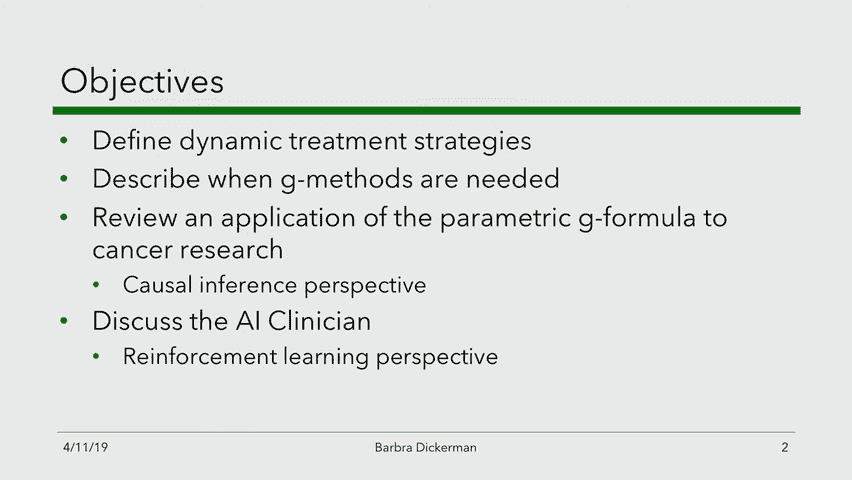

# MIT医疗机器学习中英文字幕 - P17：17.Reinforcement Learning, Part 2 - 大佬的迷弟的粉丝 - BV1oa411c7eD

今天的三部分讲座，仍在继续强化学习的主题，第一部分，我要讲话了，我将继续上周关于因果推理的讨论，以及周二关于强化学习的讨论，我将进入，嗯，出现在那里的另一个微妙之处。

在那里我们可以开发一些很好的数学方法来帮助，然后我要把节目交给芭芭拉，到时候我会正式介绍他，她将谈论她在开发方面的一些工作，评价动态处理方案，然后她会领导一场关于败血症论文的讨论，所以这就是三个部分。

今天的讲座，所以我想让你回来，把你的背放在周二演讲的心态上，我们在那里谈到了强化学习，我记得强化学习的目标是优化一些奖励，我们的目标是找到一些政策，我可以作为圆周率明星去。

这是所有可能策略的ARG最大值，圆周率v的圆周率，只是想提醒你，圆周率的V是保单的值，圆周率正式，它是，定义为期望，跨时间的奖励总和，好的，所以我称之为期望的原因，就像圆周率一样，因为有随机性。

无论是在环境中，还是在圆周率中，都将是一个随机策略，这是时间步长的总和，因为这是一个，这不仅仅是一个单一的时间步长问题，但我们将考虑跨时间的干预，每个时间点的奖励，奖励函数可以在每个时间点。

或者你可以想象这对所有的时间步长都是零，除了最后一步，所以我想考虑的第一个问题是，作为一种学习范式，这意味着什么，如果我们看看这里发生了什么，隐藏在我的故事里，也是对x病人的期望，比如说，或者初始状态。

所以直觉上这是在说，让我们试着找到一个有很高期望回报的政策，所有病人的平均凡尔纳，我只想让你想想这是否真的是正确的目标，有人能想到一个可能不受欢迎的场景吗，如果奖励是病人的生死，你不希望它有很高的方差。

比如救了几个病人零，但后来预料到了，因为来对了，所以这次奖励是至关重要的，像病人一样，病人，垂死，真的想尽量避免这种情况发生，当然还有其他我们可能感兴趣的标准，我们讨论了如何。

可能还有其他方面要确保病人不仅仅是活着的，也很健康，这可能会发挥你的奖励功能，所以可能会有奖励，如果你，只是，比如说，为病人的死亡加上一个正的或负的无穷大，那是不可能的。

因为如果你这么做了不幸的是在这个世界上，我们并不总是能让病人活着，所以你会遇到一个不可行的优化问题，所以负无穷大不是一个选择，在这种方法中，我们必须给出一些数字，但你会开始在病人之间进行交易。

你知道在某些情况下你可能，你可能会有很高的回报，可能有两种不同的解决方案，你可以想象，一种对患者的奖励在某种程度上是平衡的解决方案，在另一种情况下，你对一些病人的奖励价值很小。

和一些价值和奖励非常大的病人，两者都会给你相同的平均值，显然但不是两者兼而有之，但两者不一定同样有用对吧，我们可能想说，我们更愿意避免最坏的情况，所以人们可以想象制定这个优化问题的其他方法。

就像也许你想，也许你想控制最坏情况的奖励，而不是一般的案件奖励，或者你想说一些关于不同四分位数的东西，我只想指出这一点，因为真的，那是我们在这里做的许多工作的起点，所以现在我想让我们好好想想。

好的回到这个目标，我们已经完成了政策迭代，或者我们已经做了我们的Q学习，也就是说，我们出台了一项政策，现在可能想知道，那份保单有什么价值，对呀，那么我们对这个数量的估计是多少呢？去得到那个。

人们可以试着从Q学习的结果中读出来，通过计算Vπ，我们所说的VPI帽子，估计正好等于现在，动作上的最大值，Q函数的a在初始状态下求值，和你的最佳行动选择A权利，所以这就是我要说的。

算法的最后一步可能是问好，这项政策的预期回报是什么，如果你还记得，Q学习算法本质上是一种动态规划算法，从，你知道的，从现在到现在的时间价值很大，它实际上是在计算你感兴趣的期望值。

所以你可以从最后的Q值中读出它，但我想指出，这里有一个隐含的政策，所以说，我马上要比较一下，在因果推断场景下发生的事情，所以只要一个时间步骤，和潜在结果框架，我们已经注意到这个政策的价值。

这就是为什么它是圆周率的函数，因为它的价值是，也是你随后采取的每一个行动的函数，所以嗯，现在让我们将其与潜在结果框架中发生的情况进行比较，所以我们的起点在那里，所以现在我要。

我要把我们的注意力转移一会儿，从强化学习到因果推理，在强化学习中，我们谈到了政策，我们如何发现政策在政策的预期回报方面做得很好，但是当我们谈论因果关系的时候。

我们只用了平均治疗效果或条件平均治疗效果这样的词，在哪里，比如说，估计条件平均治疗效果，我们说的是，我们首先要学习如果我们使用，如果我们用协变量调整方法，我们学习一些功能。

它是给定结果y的期望值的近似值，我会在那里说的，所以这个符号，所以协变量调整的目标是估计这个量，我们可以利用这一点来构建一个政策，比如说，你可以，你可以考虑一下政策，x的pi，它只是想看看。

或者你对凯特x的估计是正零，否则只是想提醒你我们对凯特的估计，对于个人来说，只需要看x逗号1减去f，好的，所以说，如果我们有政策，所以现在现在，我们将开始在因果推理的背景下思考政策。

就像我们在强化学习中所做的那样，我想让我们好好想想，保单的类似价值是什么，那项政策有多好，也可能是另一项政策，但现在，我想我只想专注于这项政策，我出现在这里，一种试图评估该政策有多好的方法。

与我们在强化学习中所做的完全相似，本质上，我们要说的是，我们，通过总结你的经验数据来评估政策的质量，所以这将是，如果政策上说给个人一个治疗，在这种情况下，我们说值是x逗号1的f，或者如果你给了第二个。

如果保单给零治疗，该个人的保单值是x的1减pi，x的次数x逗号零，所以我把这个叫做，一种，对你应该思考什么的实证估计，作为对保单PI的奖励，和，它与V的估计完全相似，从强化学习环境中得到的圆周率。

但现在我们明确地谈论政策，所以让我们试着深入一点，想想这实际上在说什么，想象一下这个故事，你只有一个协变量，我们把x看作是，假设病人的年龄，和，推动这里只有一种颜色，但我会尽我所能想象潜在的结果。

作为病人年龄的函数，x是这样的，现在想象一下另一个潜在的结果，看起来像那样好吧，所以我称之为Y一个潜在的结果，假设现在我们定义的策略是这样的，所以我们要给治疗一个，如果条件平均处理效果为正且为零。

否则我想让每个人都在一张纸上画出保单的价值，对不起，我想让每个人都写在一张纸上，保单对每个人的价值是什么，所以这将是一个函数，现在我希望它是，我在找为什么X的圆周率好的，所以我在找你画那个情节。

并随时与你的邻居交谈，事实上，我鼓励你和你的邻居谈谈，只是想把这个更好地和我这里的东西联系起来，我假设这是，这是x 0的f，是啊，是啊，所有的权利，任何，有什么猜测吗。

这个情节看起来像一个在过去一周里没有说话的人，一个半，如果可能的话，就像在所有点的函数的最大值，所以可能是线性截面的y-0，然后你一个，所以会是这样的，直到交点，然后就像这样，这正是我要做的。

让我们试着思考一个，为什么保单的价值，看这两条线之间差异的情况是负的，对呀，所以对于到这个交叉点的每一个x，我们在那里定义的策略将执行操作，二二二等一下，我画的对吗，也许实际上恰恰相反，对呀。

你应该做动作，一个，好的，所以这里，好的，所以这里，凯特是，负的，所以根据我的定义，执行的动作是动作零，所以保单的价值实际上是这个，对呀，等一下，哦等等，哦很好，你知道我们想要什么，因为这是图表。

我在我的笔记里，好的，我得到了，我开始担心了，好的，所以一直都是这个动作，直到你到这里，然后这边，现在凯特突然变得积极起来，所以，所以这个政策的价值是，好的，所以人们可以用不同的方式来写这个。

在…的情况下，在只有两个保单的情况下，现在我要用一种非常清楚的方式来写这个，在只有两个动作的情况下，人们可以把它等效地写成，数据点上的平均值，x的f逗号1好的，这种简化，把这个公式变成这个公式，就是。

假设我们被评估的圆周率，正是这个圆周率，所以这个蕴涵只针对圆周率，另一项保单，不是看着凯特，或者例如，这可能会使凯特处于伽马射线，就不完全是，这将是另一回事，好的，所以，但我在这里更进一步，好吧。

那我该怎么办，我给你看的是对的，这里不是平均值，但是个人的价值观，对呀，我已经给你看了最大的，但这实际上是在看预期的回报，它现在在所有x上平均，所以要真正把我们画的这个情节和，该政策的平均回报。

我们应该看的是这两个函数的平均值，我们会说，你知道吗，类似的东西，好的，这个值就是预期的回报，现在，这一切都表明，这项政策的预期回报不是一个数量，我们在以前的讲座中已经考虑过了。

至少不是以前关于因果推理的讲座，对呀，这与平均治疗效果不一样，比如说，我刚刚给了你一个思考的方法，您可能想要导出的策略是什么，当你在做因果推断的时候，第二个，估计保单价值的一种方法是什么。

它通过协变量调整来估计潜在的结果，但我们可能会想，就像我们谈到的因果关系，我说有两种方法或两种以上，但我们专注于两个使用协变量调整和做倾向，反倾向评分加权，你可能会想。

有没有另一种解决这个问题的方法是他们的方法，它不必经过估计潜在的结果，这就是我在这节课剩下的三分之一时间里要做的，专注地谈论，所以为了帮助你把这个页回来，记住我们在上周四的讲座中得到的。

平均治疗效果的估计器，是数据点和的n倍，倾向得分，我只写为e，i，所以说，e，i，给定数据点x，t等于1，i，数据点i上的和，使得ti等于零y i除以一减e，i，顺便说一句，课堂上有很多混乱。

为什么我有，为什么我这里有一个1，一个在这里，现在，我只是一起把它拿出来，而不是一个超过正数据点的数量，负数据点或零数据点数的1，我扩展了我在课堂上给出的推导，课后我在网上发布了新的幻灯片。

所以如果你对此感到好奇，去看那些幻灯片，看看推导，所以现在以一种非常相似的方式，我要给你一个新的估计量，和我这里的数量一样，政策的预期回报，注意这里的这个估计器，任何政策都有意义，不一定是。

看的政策是凯特，是否大于零，这适用于任何保单，我给出的简化只是在这个特殊的环境中，我现在给你另一个保单平均价值的估计值，它根本不通过估计潜在的结果，类似地，我们将利用倾向得分，我把它叫做。

我就叫它R帽子，现在，我要上标，逆倾向加权IW，它是圆周率的函数，它是由下面的公式给你的，指示函数数据点上的n乘和，因为如果实际给予第I个的治疗，病人等于保单会为我做的，第病人，顺便说一句，这里。

我假设圆周率是一个确定函数，所以说，所以保单上说这个病人，你应该把这个治疗做对，所以我们只看数据点，观察到的治疗与，保单会对那个病人做什么，这个指示器函数为零，否则，我们将除以，嗯，按概率。

所以顺便说一句，我写这篇文章的方式已经很笼统了，所以这个公式也适用于非二元处理，这是思考政策的好处之一，也就是，而当想到，嗯，当谈到平均治疗效果时，平均治疗效果有点道理，在比较意义上，互相比较。

但当我们谈论一项政策有多好时，它是，这根本不是一个比较陈述，这项政策对每个人都有好处，你可以好好问，结果的平均值是多少，你得到的，为那些人采取的行动。

所以这就是为什么我在这里用一种稍微笼统的方式写作的原因，我很明显，所以这是一个新的估计器，我不打算在课堂上给你们推导，但是推导和我们上周做的很相似，当我们试图推动平均治疗效果时。

临界点是我们除以倾向分数，就像我们在那边做的那样，如果所有的假设都有意义，你有无限的数据，应该给你和这个完全一样的估计，在这里，你根本没有估计潜在的结果，所以你永远不必试图在这里归咎于反事实。

它所依赖的一切，你有每个数据点的倾向得分，在您的训练集或数据集中，所以说，比如说，这为大量新的，令人兴奋的方向，假设你有一个非常大的观测数据集，从中学到了一项政策，比如说，你可能做了协变量调整。

然后说好，根据协变量调整，这是我的新政策，所以你可能通过这种方法得到了它，现在你想知道那口井有多好，假设你进行了一个随机对照试验，然后你的优化控制试验，你有一百个人，可能有两百人，所以没有那么多。

所以几乎没有足够的人真正估计过你的政策，对你可能需要成千上万的人来估计你的保单，现在你只会有几百个人，你可以为这些人做随机对照试验，因为你在抛硬币决定他们会得到什么样的治疗，假设我们在二进制环境中。

只有两种治疗方法，那么这个值总是二分之一，二分之一，我在这里给你的是一个公正的估计，那个政策有多好，人们现在可以估计，利用随机对照试验，也可能会让你思考这个问题，而不是估计政策，而不是获得保单。

通过优化凯特的镜头，弄清楚如何估计凯特，也许我们可以一起跳过这些，比如说，我想我们现在有了随机对照试验数据，想象一下，而不是一百个人，你有一个非常大的随机对照试验，有一万个人在里面。

这现在打开了思考直接最大化或最小化的大门，取决于你希望它是大的还是小的，关于这个量，它完全绕过了估计条件平均治疗效果的目标，你会注意到这看起来很像一个分类问题，对呀，这里的数量看起来完全像零一损失。

唯一的区别是，你用这个来加权每个数据点，逆倾向，所以说，人们可以减少在这里找到最优策略的问题，加权分类问题，在一组离散治疗的情况下，这个大洞穴，这种想法有两个很大的警告，第一个主要的警告是。

你得知道这些倾向分数，所以如果你有来自随机对照试验的数据，你就会知道那些倾向分数，所以或者如果你有，比如说，对A数据生成过程的一些控制，对呀，比如说，如果你是一家广告公司，你要展示你可以选择。

这增加了向您的客户展示，然后你看看谁点击了你可能知道的东西，那个政策是什么，表明事情是正确的，那样的话，你可能很清楚医疗保健的倾向得分，除了在渲染对照试验中，我们通常不知道这个值。

所以我们要么进行一个足够大的随机对照试验，我们不会通过直接最小化来过度适应，或者我们必须在观测数据环境中工作，但我们必须直接估计倾向得分，所以你会有一个两步程序首先你估计这些倾向分数，例如。

通过做逻辑回归，然后你试图最大化或最小化这个数量，为了找到最优的策略，这有很多挑战，因为最下面显示的数量可能很小也可能很大，观测数据集，由于这些问题，你的治疗之间有非常小的重叠，这是非常小的。

这意味着这个估计量的方差是非常大的，非常大，所以当一个人想使用这样的方法时，类似于当一个人想使用平均治疗效果估计器时，当你估计这些倾向时，通常你可能不需要做一些事情，比如剪裁倾向得分，为了防止变体太大。

然后，然而，导致有偏估计器，通常，我想在这里给你几个推荐人，所以一个是一个，J o a c h i m s i ml，两千零一万五，十五，2。他们在那篇论文中讨论了这个问题。

他们专注于已知倾向得分的设置，就像你在随机对照试验中一样，他们认识到你可能会决定你想要，您更喜欢像有偏估计器这样的东西，因为这些倾向分数可能很小，因此，他们使用了机器学习理论界的一些推广结果。

为了控制估计量的方差，作为这些倾向分数的函数，然后他们直接学习，最小化策略，这就是他们所说的反事实后悔最小化，为了让人们尽可能地概括，从您可能拥有的少量数据中，我想给出的第二个参考。

只是为了告诉你这些文献，如果你对内森·卡利斯和他的学生感兴趣，我相信，来自努里的安吉拉动物园，那是一篇论文，现在那张纸，他们也是从这样的角度开始的，他们说，哦，现在你有，我们在这个框架内工作。

人们可以想想会发生什么，如果你实际上有未观察到的混杂，所以你可能不知道真正的倾向得分，因为有你没有观察到的未观察到的混乱，你可以考虑试着绑定，你的估计量会错到什么程度，作为你不知道这个量多少的函数。

它们表明，当你试图，如果你考虑有一些备份策略，比如如果你的目标是找到一个新的政策，相对于旧策略，它的性能尽可能好，然后它给了你一个非常优雅的框架来思考，对此的稳健优化，即使考虑到。

可能存在未观察到的混淆的事实，在这个框架中也是如此，所以我现在快做完了，我现在只想结束这个想法，我们能对通过强化学习学到的政策做同样的事情吗，所以现在让我们现在已经建立了这种语言，让我们回到RL设置。

在那里，你可以得到一个类似的保单价值估计，对你观察到的序列求和，对该序列的时间步长求和，从第一次开始的概率比，跟上时间小T，你实际上会采取观察到的动作t素数，考虑到你处于观察状态，概率，这就是，这是。

得分概率倾向的类比，在看到动作的数据生成过程下，给定你处于最佳状态，所以如果像我们在那里讨论的那样，你有一个确定性的政策，那么这个圆周率就是一个δ函数，所以这只是看看这会是什么，这个估计量只会查看序列。

所采取的行动的精确顺序与行动的精确顺序相同，保单会采取，这里的区别在于现在没有单一的得分倾向，一个有这些倾向分数的乘积，与观察该动作的倾向相对应，给定沿序列的每个点上的相应状态，所以这很好。

因为这给了你一种方法来做所谓的政策评估，是估计量，这是一个完全类似于我们从Q学习中得到的估计器，所以如果所有的假设都是正确的，你有很多数据，那么这两个应该会给你完全相同的答案，但在这里。

就像在因果推理设置中，我们没有假设我们可以很好地进行协变量调整，或者说得不一样，我们不假设我们能很好地拟合Q函数，现在就像那里一样，基于我们有能力，真正准确地知道倾向得分是多少。

所以它现在给了你一个替代的方法来做评估，你可以考虑看看你的估计的稳健性，从这两个不同的估计量，如果你在这里，如果你在那里，这是最幼稚的估计量，有很多方法可以让这变得更好，例如通过做一个双鲁棒估计量。

如果你想了解更多，我推荐阅读这篇论文，由，和ml，二千零一十六，我想让芭芭拉过来准备一下，我们将过渡到讲座的下一部分，是呀，我们对t进行求和，然后把乘积除以所有的t有一个简单的方法来思考这个问题。

假设你只有最后一步的奖励，如果你只有最后一步的奖励，那你就不会有这笔钱超过T，因为前面步骤的奖励是零，你会让产品从零上升到大写，最后一步，你为什么要这么做，在每一个时间步骤。

是因为人们希望能够适当地权衡可能性，本质上，在那一点上看到奖励的可能性，随着时间的推移，人们可以重写这一点，在其他方面，我想保留其他问题，因为，这节课会比我这节课有趣得多，我想介绍芭芭拉，芭芭拉。

我第一次见到她是在去年她邀请我在她班上做报告的时候，公共卫生学院，她最近在2018年完成了博士学位，她的博士研究了许多与过去几周的主题相关的问题，从那时起，除了继续她的研究。

她在哈佛大学创建数据科学课程方面一直处于领先地位，所以请把它拿走，非常感谢你的介绍，戴维，我很高兴来到这里，分享我在评估动态治疗策略方面的一些工作，你在过去的几节课上一直在谈论，所以我今天的目标。

我只想轻描淡写地定义动态治疗策略，因为你已经很熟悉了，但我想谈谈什么时候我们需要一种特殊的方法，叫做G方法，然后我们将讨论两种不同的应用程序，专注于评估动态治疗策略的不同分析。

所以第一个将是参数g公式的应用，这是癌症研究的一个强有力的G方法，所以这里的目标是给你我的因果推断，关于我们如何思考顺序决策任务的观点，然后用剩下的时间。

我们将讨论最近发表的一篇关于人工智能临床医生的文章，通过强化学习的视角进行对话，所以我认为这将是一个非常有趣的讨论，我们可以分享这些观点，也谈谈相对的优势和局限性，如果你有任何问题，请阻止我。

所以你已经知道了，当谈到治疗策略时，主要有三种类型，在一个时间点上发生了点干预，随着时间的推移，持续的干预正在发生，当谈到临床护理时，这往往是我们最感兴趣的，有静态的策略。

这些策略随着时间的推移是不变的，然后是动态策略，我们将重点讨论，这些不同的是，随着时间的推移，干预取决于不断变化的特征，所以说，比如说，在基线时开始治疗，并继续随访，直到出现禁忌症，在这一点上。

你可以停止治疗，并与你的医生决定，你是否要改用另一种治疗方法，你仍然会坚持这个策略，即使你在这里退出了比较，不要开始治疗，也不要跟进，除非有迹象表明，你可能开始治疗，但仍然坚持策略，所以我们专注于这些。

因为它们是临床上最相关的，所以临床医生每天在实践中都会遇到这些，所以当他们向病人提出预防干预的建议时，他们会考虑到，病人不断发展的共病，或者当他们决定下一个放映间隔时，他们会考虑上次筛选测试的结果。

当决定同样进行治疗时，决定是否让病人继续治疗，病人是否有任何可能反映毒性的症状或实验室值的变化，所以有一点要注意的是，而你可能看到的许多策略，在临床指南和临床实践中是动态策略，这些可能不是最佳策略。

所以也许我们所推荐和做的对病人来说并不是最佳的，然而，最优策略将是动态的，在某种程度上，它们将适应个体独特和不断进化的特征，所以这就是我们关心他们的原因，那么有什么问题呢。

所以一个问题涉及到一种叫做治疗混乱反馈的东西，你们可能在这节课上说过，治疗混杂反馈存在下的动态治疗策略，所以这是当时变混杂物受到以前处理的影响时，所以如果我们把它放在一个具体的例子中，用这个因果图。

假设我们对估计某种干预措施的效果感兴趣，血管升压剂，也可能是静脉注射，我们称之为生存，我们知道血管升压剂影响血压血压会影响随后的决定，用血管升压剂治疗，我们也知道低血压，所以再一次，根据我们的临床知识。

血压l one影响存活率，然后在这个DAG中，我们还有代表疾病严重程度的节点U，所以这些可能是疾病严重程度的潜在不可测量的标记，会影响你的血压也会影响你的生存概率。

所以如果我们有兴趣估计持续治疗策略的效果，那么我们想知道在所有时间点治疗的总效果，我们可以看到这里的l是一个混杂器，对于一个对Y的影响，所以我们必须做些什么来调整，如果我们应用传统的统计方法。

我们基本上是在对撞机上施加条件，并诱导选择偏差，所以从零到l，1到u到y的开放路径，这样做的后果是什么，如果我们查看我们的数据集，我们可能会看到A和Y之间的联系，但这种联系并不是因为A对Y一定有影响。

可能不是因果关系，可能是由于我们创造的这种选择偏见，所以这就是问题所在，所以在这种情况下我们需要一种特殊的方法来处理这些设置，所以一类专门设计来处理，这是G方法，所以这些有时被称为因果方法。

它们是杰米开发的，罗宾斯及其同事和合作者自1986年以来，它们包括结构嵌套模型的参数g公式g估计，边际结构模型的逆概率加权，所以在我的研究中，我所做的是，我将G方法与大型纵向数据库相结合。

试图评估动态治疗策略，所以我对把这些方法带到癌症研究中特别感兴趣，因为它们在那里应用得不多，所以我的很多研究问题都集中在回答问题上，比如我们如何以及何时才能最好地干预，防止，检测和治疗癌症。

所以我想和大家分享一个例子，嗯，遵守准则的效果，基于体育活动的前列腺癌男性生存率干预，所以这项研究的动机，有一个大型临床组织，asco，美国临床肿瘤学会，他们实际上要求随机试验来产生几种癌症的估计。

前列腺癌是一种进展非常缓慢的疾病，所以做一个试验来评估这一点的可行性是非常有限的，审判必须长达十年，可能是这样，考虑到缺乏随机证据，我们做了退而求其次的事情来产生这个估计。

它将高质量的观测数据与先进的epi方法结合起来，在这种情况下，参数g公式，因此，我们利用卫生专业人员后续研究的数据，这是一项很有特色的前瞻性队列研究，所以在这些情况下，有一个三，我们采取的步骤过程。

从观测数据中提取最有意义和最可操作的见解，所以说，我们要做的第一件事就是指定目标试验的协议，如果可行的话，我们希望进行的，我们做的第二件事是，我们确保我们测量了足够的协变量来近似调整，为了混淆。

然后我们做的第三件事是，我们采用适当的方法来比较指定的治疗策略，在条件可交换性假设下，所以在这种情况下，参加这项研究的合格男性被诊断患有非转移性前列腺癌，和基线，他们没有心血管和神经疾病。

这可能会限制治疗策略的体能，男性在诊断时开始六种体育活动策略中的一种，并继续随访，直到病情发展，限制体力活动，所以这就是策略动态的原因，随着时间的推移，干预取决于这些不断变化的条件，所以要注意的是。

我们预先指定了我们正在评估的这些策略，以及男性被跟踪到诊断的条件，直到死亡，诊断后十年的随访，后续行动或行政结束，以先发生者为准，我们感兴趣的结果是十年内所有的死亡，我们对估计每个协议的效果感兴趣。

不仅仅是发起这些策略，但坚持他们而不是跟进，我们再次应用参数g公式，我想你们在上一节课中已经听过g公式了，可能以稍微不同的方式，所以我不会在这上面花太多时间，所以g公式，本质上我是这么想的。

是对时变曝光和混杂的标准化的概括，所以基本上是风险的加权平均，在那里你可以想到重量，是时变混杂物的概率密度函数，我们用参数回归模型估计，我们用蒙特卡洛模拟近似加权平均值，所以实际上我们该怎么做。

所以我们要做的第一件事是拟合参数回归模型，对于我们将要研究的所有变量，所以每次随访时的治疗混乱和死亡，接下来我们要做的是蒙特卡洛模拟，在哪里，本质上，我们想做的是模拟结果分布。

在我们感兴趣的每种治疗策略下，然后我们引导置信区间，所以我想给你们看一个示意图，这看起来像什么，因为它可能更容易看到，所以再一次，我们的想法是复制我们的数据集，在每个副本中。

每个人都坚持我们在副本中关注的策略，那么我们如何构造数据集的每一个副本，我们必须从头开始建造它们，从时间零开始，所以在时间零点的所有时变协变量的值，从它们的经验分布中取样。

所以这些实际上是协变量的观察值，我们如何获得下一个时间点的值，我们使用我提到的参数回归模型，我们适合第一步，那么我们要做的就是，我们强制干预变量的水平是干预策略指定的任何水平。

然后我们估计每个时间段结果的风险，再次给出这些变量，现在使用参数回归模型进行结果，所以我们在所有的时间段里重复这个，估计该策略下的累积风险，作为主体特定风险的平均值，所以这就是我正在做的。

这是一种在引擎盖下，这个方法是怎么回事，所以也许我们应该试着用语言来表达，但是我们在课堂上看到的，如果我搞错了，请告诉我，所以你首先估计马尔可夫决策过程，它允许您本质上模拟底层数据分布。

所以你知道下一系列观察的概率，给定前面的顺序和动作以及前面的动作，然后就这样，然后你可以你可以，然后你可以干预并模拟四个，所以那是，如果你还记得，弗雷德里克给了你三种不同的方法。

然后他把注意力集中在中间的那个，这是最左边的问题，我有这个权利，所以我们没有谈论这件事，无模型，是呀，但这是非常明智的，是啊，是啊，至少看起来很难，什么对不起，哦，在医学上建模似乎很难，是啊，是啊。

所以这是一个挑战，这是最难的部分，它依赖于很多假设，是啊，是啊，所以在我们做了所有这些之后，主要的结果就出来了，所以这是几种体育活动干预下所有原因死亡的估计风险，所以我不会太关注结果。

我想把重点放在这张幻灯片的两个主要要点上，要强调的一点是我们预先规定了每周体育活动的持续时间，或者你可以把这个想象成，干预的剂量，我们预先规定了，这是基于目前的指导方针，所以每个带的第三行。

我们确实观察了一些超出指南的剂量或水平，看看是否有额外的生存益处，但这些都是预先指定的，我们还预先指定了所有使这些策略动态的时变协变量，所以我提到，男性被免除遵循推荐的体育活动水平。

如果他们出现了这些列出的情况之一，脑卒中转移，等，我们预先指定了所有这些，有可能，也许你知道，对不同时变协变的不同依赖，可能导致了一个更最优的策略，还有很多未被探索的地方，所以作为这个项目的一部分。

我们做了很多敏感性分析，我想集中精力，虽然，关于我们对潜在的敏感性分析，慢性疾病造成的不可测量的混淆，可能严重到影响身体活动和生存，所以G公式实际上提供了一个自然的方法。

至少通过估计这些体育活动干预的风险来部分解决这个问题，在每个时间点，这不仅适用于那些健康到可以保持体力活动水平的男性，又是这样，在主要分析中，如果男性出现这些严重的情况之一，我们免除他们遵循推荐的水平。

所以在灵敏度分析中，然后我们扩大了严重情况的列表，还包括以蓝色文本显示的条件，所以这削弱了我们的估计，但没有改变我们的结论，有一点要指出的是，这种方法的有效性取决于这样一个假设，即在每次T。

我们有可用的数据来确定当时哪些男性是健康的，足够做体力活动，是啊，是啊，对不起，只是再检查一下，对不起，你把他们排除在外了，很好的问题，因为策略是预先指定的说如果你发展出这些条件中的一个。

你基本上可以做任何你能做的水平的体育活动，所以重要的是，我很高兴你提起这件事，那时我们没有审查男人，他们仍然被跟踪，因为他们仍然坚持定义的策略，谢谢关心，因此，鉴于我们不知道数据是否每次都包含。

难道没有必要的信息来了解这些人当时是否足够健康吗，因此，我们进行了一些替代分析，其中我们将体育活动和协变量数据落后了两年，我们还使用了消极结果控制来探索潜在的，未按临床疾病或疾病严重程度衡量的混杂。

那么这背后的理由是什么呢，所以在下面的达格，对于原始分析，我们有体育活动，我们有存活率，这可能与疾病的严重程度有关，所以当我们在数据中看到a和y之间的关联时，我们想确保这是因果关系，是因为蓝色箭头。

而不是因为这种混杂的偏见，红色箭头，那么我们如何可能提供证据来证明红色通道是否存在，我们选择问卷无反应作为替代结果，而不是生存，我们认为没有直接受到体育活动的影响。

但我们认为同样会被疾病的严重程度所困扰，所以当我们用阴性结果控制重复分析时，我们发现体育活动对问卷无反应几乎没有影响，正如我们所料，这提供了一些支持，在我们最初的分析中，身体活动，体育活动对死亡的影响。

所以这里要强调的一件事是，敏感性分析是由我们的主题知识驱动的，数据中没有任何东西推动了这一点，所以回顾一下这一部分，所以G方法是有用的工具，因为它们让我们有效地估计预先指定的动态策略的效果。

并估计对我们有临床意义的调整后绝对风险，和适当调整的生存曲线，即使在治疗混杂反馈存在的情况下，那个，当然，这是在我们典型的可识别性假设下，因此。

这使得它成为一个强有力的方法来估计当前推荐或提议的策略的效果，因此，我们可以在，准确地写出我们在这里所做的，然而，这些预先指定的策略可能不是最佳策略，所以再一次，当我做这个分析的时候，我在想。

有这么多不同的，我们没有看到的每周体育活动持续时间，有这么多不同的时间，变协变量，随着时间的推移，我们可能对这些策略有不同的依赖，也许这些会导致这些人更好的生存结果。

