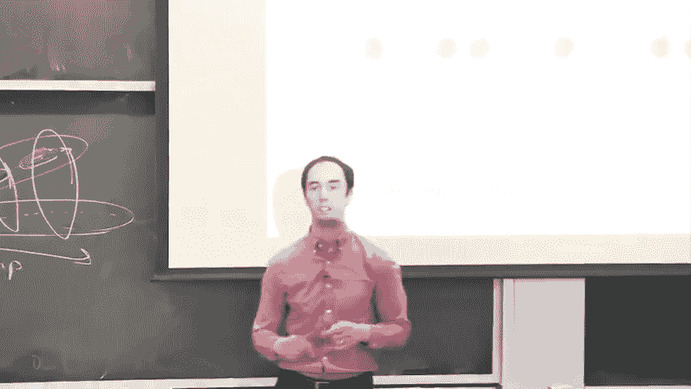
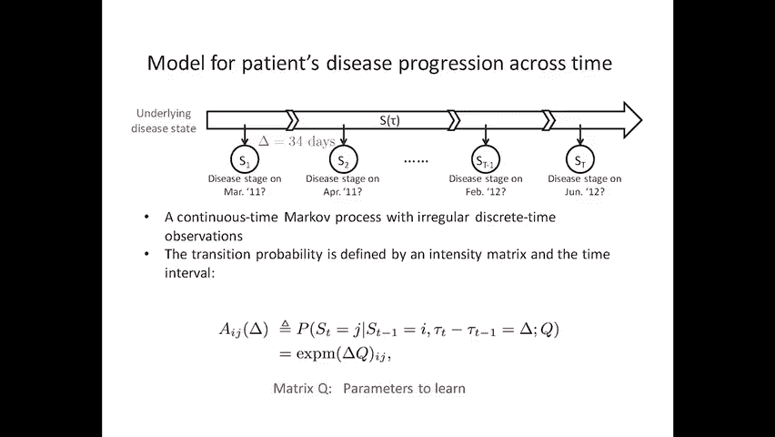
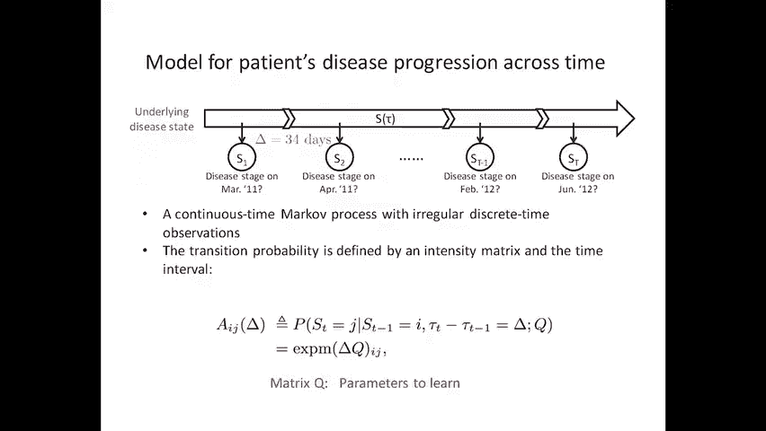
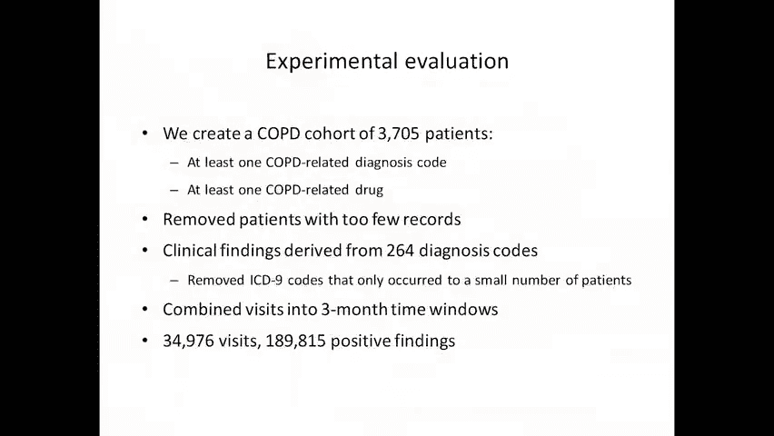
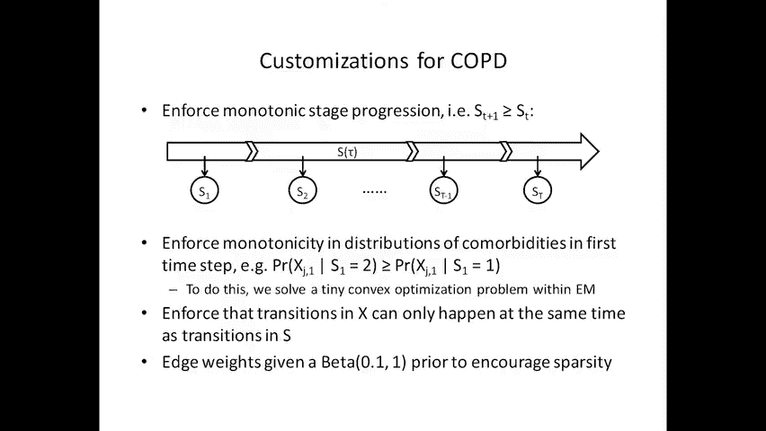
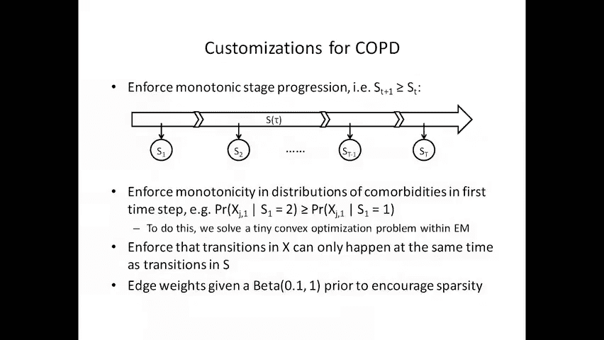
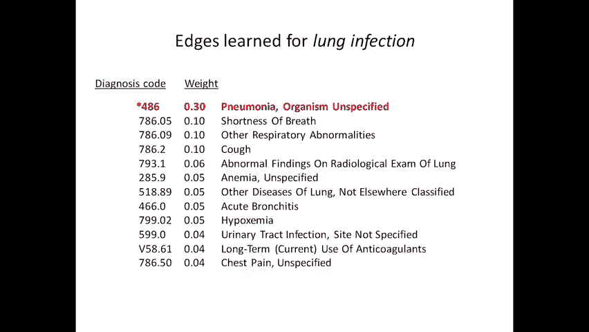
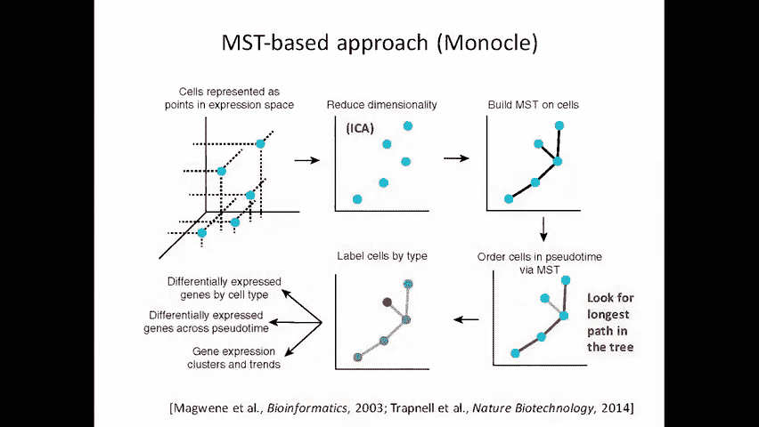
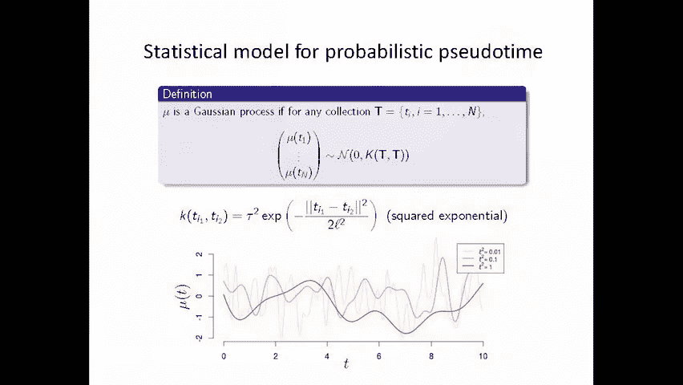

# MIT医疗机器学习中英文字幕 - P19：19.Disease Progression Modeling - 大佬的迷弟的粉丝 - BV1oa411c7eD

所以说，我想开始，由，试图建立一些直觉，以了解如何能够进行舞台表演，从横截面数据，我们将在很久以后回到组合分段子类型的问题，所以想象一下，我们有一个维度的数据，每个数据点都是一个单独的。

我们只在一个时间点观察他们的数据，假设我们确切地知道该看哪个生物标志物，所以我在这里给你们举了一个例子，当你可能会看到一些抗体表达水平，这可能就是我所说的生物标志物，如果你确切地知道要看什么生物标志物。

你可以把每个人沿着这条线，你可能会猜测，也许在线的一边，这是早期的疾病，在线的另一边，也许那是晚期疾病，为什么这是一个合理的猜测。

另一种猜想是什么，你为什么不和你的邻居谈谈，看看你们能不能想出一些替代的猜想，所有的权利，这就够了，所以希望简单的问题，所以我不会给你太多时间，所有的权利，那么另一个猜测是什么，所以再一次。

我们的目标是，我们每个人都有一个观察，每个人都处于疾病的某个未知阶段，我们想对个人进行分类，并将其转化为疾病的早期和晚期，我给你一个如何做到这一点的猜想，分拣，另一个合理的猜测是什么，举起你的手。

这就是他们有不同类型的相同疾病的区别，同一疾病的，它可能是一些人中的一个可能，是啊，是啊，所以你要回到这个例子，我在这里给了，在那里你可以把这些东西混为一谈，我想坚持一个简单的故事。

让我们假设这种疾病只有一种亚型，对病人进行分类的另一种方法是什么，给定这个数据，数据在哪里，你知道你在这里看到的这些点，中档季节，然后当你两边往上走的时候，好的，所以也许早期疾病就在这里。

当事情变得糟糕时，病人，这个生物标志物开始变得异常和异常，不管出于什么原因，可能是向右或向左，现在我想这是一个猜测，我认为这也许不是一个很自然的猜想，根据我们对从人体测量的常见生物标志物的了解。

以及它们对疾病进展的反应方式，除非你有多种疾病亚型，比如说，去右边的标记，对一种疾病亚型，向左或向另一种疾病亚型，另一个猜测会是什么，你们错过了简单的一个，是啊，是啊，在后面可能只有一个高价值的。

完全正确谢谢，所以这可能是早期疾病，那可能是晚期疾病，上面写着，这张幻灯片上的虫子寄生虫，哦，是吗，哦拍摄，早餐对对，好的，好的，谢谢。下次我就把那个拿出来，所以你们才说，好的，好的，如此如此，这很好。

至少现在不是，我想我们都在同一条船上，我们有一些想法，人们可能需要做出哪些假设，为了在这里做任何事情，比如，比如说，我们在做一些假设，我们可能不得不对连续性做出一些假设，生物标志物可能会逐渐发展。

从早到晚的无关紧要，它可能会变得更大，它可能会变小，如果这真的是我们之前谈到的场景，我们说过，就像早期疾病可能在这里，晚期疾病可能会发生在任何一方，那样的话，我想人们可以很容易地争辩说。

根据我们这里的信息，疾病进展，疾病阶段无法识别，因为你不知道，它会在哪里，你知道你应该去哪里，过渡点应该在哪里，是这里吗这里这里这里，事实上，这里也出现了同样的问题，好像你不知道，是早期疾病吗。

是往这边走吗？还是往那边走。

有什么方法可以解开这个纠缠，只是为了让我们都在同一页上，对呀，所以假设它只朝这个方向或那个方向，我们怎么才能弄清楚，哪个是哪个，我们有其他数据，他们还剩多少时间，是啊，是啊，否，那太好了。

所以也许我们有关于，假设那个信息，甚至只是年龄，如果我们从一个非常，非常粗略的假设疾病阶段，如果你做了一个额外的假设，疾病的阶段是，进来的人来自不同的疾病阶段，仅这两个假设，那你就可以，比如说。

看看这里个体的平均年龄和这里个体的平均年龄。

你会说平均年龄较大的是晚期疾病。

或者你可以把时间看得死去活来，如果你把每个数据点，你也知道一个人死了多久，你可以看看这些人的平均死亡时间，与那些试图用这种方式戏弄它的人相比。

这就是你，你的意思是，好的，所以我只是想给你一些直觉，这是如何可能的，如果您的数据是这样的呢，所以现在你有两个生物标志物，所以我们只上升了一维，我们想知道哪里很早，哪里晚了，它已经开始变得更具挑战性。

对呀，所以我想让你拥有的直觉，我们将不得不对疾病的进展做出一些假设，比如我们刚才讨论的那些，我们也必须在某种程度上走运，例如，幸运的一个方法是拥有大量的数据，所以如果你有一吨的数据。

你做了一个额外的假设，你的数据，你的数据生活在某个低维流形上，在歧管的一边是早期疾病，歧管的另一边是晚期疾病，那么你可能会发现那个流形，从这个数据，你可能会猜想流形是这样的，我用手勾勒出的轨迹。

但为了你能做到这一点，当然你需要有足够的数据对吧，所以现在将是一个权衡，只是有横截面数据可能没问题，只要你有很多数据，这样你就可以填满空间，真正识别那个流形，另一种方法可能很好。

也许你没有纯粹的横截面数据，可能每个病人身上都有两三个样本，然后你可以给这个颜色代码，所以你可能会说，好的，绿色是病人一或病人一，我们就叫它，这是病人A的第一个时间点。

病人的第二个时间点病人的第三个和第四个时间点，红色是病人B，病人B和蓝色有两个时间点，这是病人C，你有一二，病人C的三个时间点，好的，现在再来一次，你知道吗，数据不是很密集，我们真的不能画出曲线。

但现在我们可以开始了解顺序了，现在我们又可以，即使我们不，我们不是在密集的环境中，就像我们在这里，尽管如此，这里仍然能够计算出，可能歧管看起来有点像这样，又是这样，我只是试图建立周围的直觉。

当横断面数据的疾病进展建模成为可能时，但这是一片开阔的田野，所以今天，我会告诉你一些算法，试图建立在，做疾病进展建模的一些直觉，但它们会非常非常容易分解，当我给你的这些假设不成立时，他们就会崩溃。

当你的数据是高维的时候，它们就会崩溃，当你的数据看起来像这样时，它们就会崩溃，在那里你不仅仅有一个单一的亚型，但也许有多个亚型，所以这是一个非常活跃的研究领域，这是一个我认为我们可以取得很大进展的领域。

在未来几年的实地，所以我将从我自己工作中的一个案例研究开始，在那里我们开发了一个从横截面数据中学习的算法。

我们在慢性阻塞性肺疾病的背景下重视它，或者鳕鱼，cpd是一种肺部疾病，通常由空气污染或吸烟引起，它有一个相当好的分期机制，其中一个使用所谓的肺活量测定仪，为了测量个体在任何一个时间点的肺功能，例如。

你拿着这个肺活量测定仪，你把它塞进嘴里，你吸气，然后你呼气，其中一个测量呼出所有空气所需的时间，这将衡量你的肺有多好，所以人们可以测量你的肺功能，一个人的鳕鱼有多严重，这就是所谓的黄金标准，例如。

在鳕鱼的第一阶段，常见的治疗方法只包括接种疫苗，只在需要时使用短效支气管扩张剂，嗯，当疾病阶段变得更严重时，比如第四阶段，然后通常建议吸入治疗，糖皮质激素，疾病反复发作，如果发生呼吸衰竭，长期吸氧。

等等。

所以这是一种被合理地理解的疾病，因为有一个很好的分期机制，我认为，当我们想了解如何以数据驱动的方式进行疾病分期时，我们应该首先从合成数据开始，或者我们应该从治疗一种疾病开始。

在那里我们对真正的疾病分期有了一些了解，这样我们就可以看看我们的算法在这些情况下会恢复什么，它是否符合我们的预期，无论是从数据产生的方式还是从现有的医学文献，这就是为什么我们选择鳕鱼。

因为这是很好理解的，有大量关于它的文献，因为我们有关于它的数据，这比最初研究中的数据类型混乱得多，我们可以问，我们能得出与最初研究相同的结论吗，所以在这项工作中，我们将使用电子病历中的数据。

我们只看EMR的一个子集，特别是在任何时间点为病人记录的诊断代码，我们假设我们没有肺活量测定仪，所有数据，所以我们没有任何明显的方法来分期病人的疾病，一般的方法是建立一个疾病进展的生成模型。

在很高的水平上，这是一个马尔可夫模型，它是一个指定病人数据分布的模型，在底部显示了它随着时间的推移而演变，根据顶部显示的一些隐藏变量，这些表示疾病阶段的变量，这些表示共病的x变量。

病人在那个时间点可能有，这些x和s变量总是被假定为未观察到的，所以如果你把它们聚集成一个变量，这看起来就像一个隐藏的马尔可夫模型，而且，我们不会假设我们有很多纵向数据，对于一个病人来说，特别是。

CRPD经过十到二十年的发展，我们将从这里学习的数据，只有一到三年的数据，挑战将是，我们能把数据和这一到三年的时间范围，并以某种方式将它缝合在大量的病人身上，以获得一张照片。

这种疾病20年的进展可能看起来像，我们要做的事情，那就是通过学习这个概率模型的参数，然后从参数，我们要么推断病人的实际疾病阶段，从而对它们进行排序，或者实际上模拟来自这个模型的数据。

看看20年的轨迹会是什么样子，目标明确吗？所有权利，所以现在我要做的是，我要一步一步地走进这个模型，告诉你这些组件是什么，所以这是病人在任何一个时间点的疾病进展模型，所以这个变量，It’只有一个。

比如说，可能表示病人的疾病阶段，嗯，三月二万一，因为两个可能表示病人的疾病阶段，2001年4月11日美国首都T，可能表示病人的疾病阶段，六月二十二日，所以我们有一个随机变量，我们对病人数据的每一次观察。

并注意到对病人数据的观察可能是，在非常不规则的时间间隔内，这种方法是可以的，好的，所以请注意，在第一个和第二个之间有一个月的间隔，而是一个，但是在减一和正常之间有四个月的间隔。

所以我们要模拟病人在时间点的疾病阶段，当我们对病人进行观察时，表示该模型中的一个离散疾病阶段，所以s可能是从1到4的值，可能一个到十个其中一个表示疾病的早期阶段，四到十个可能意味着更晚的疾病阶段。

如果我们对每个病人进行一系列的观察，比如说，我们可能会在三月有一个观察，然后在四月注意到，我们将用s 1和s 2来表示疾病阶段，这个模型要讨论的是转换的概率分布，从第一个疾病阶段到第二个疾病阶段，现在。

因为阶段之间的时间间隔不是均匀的，我们必须有一个考虑到时间间隔的过渡分布，为了做到这一点，我们使用所谓的连续时间马尔可夫过程，形式上我们说，嗯，过渡分布，所以在时间t减去1时从阶段i过渡的概率。

在时间t上演J，给定时间间隔的差异作为输入，时间点增量的差异，所以delta是两次观测之间的月数，所以这个条件分布将由矩阵指数给出，时间间隔，乘以矩阵，q，然后矩阵q给出了我们想要学习的参数。

所以让我把它和你可能已经习惯的东西进行对比，在典型的隐马尔可夫模型中，或者一减一等于一，你可能会想象参数化，仅仅通过查找表就给了s t减一，例如，如果每个随机变量的状态数为三个。

就会有三乘三的表格每个州t减1，你有一定的概率过渡到相应的状态，所以这可能是，嗯，注意我在对角线上有一个非常大的值，因为如果我们说一个非常小的先验时期，我们可能会相信患有同一种疾病的病人。

然后我们可以想象，在时间t从状态1转变的概率，在时间t可能是类似点的东西，哦九，和跳过状态二的概率，从一号州直接到三号州可能要小得多，就像零点一，好的，我们可能会说这样的概率，我们可以想象倒退的概率。

从第二阶段在时间t减1到，让我们说第一阶段在时间t那可能是零，对呀，所以你可能会想象这实际上是模型，这意味着你永远不会倒退，你更有可能过渡到紧邻当前阶段的状态，不太可能跳过一个阶段。

所以这将是一个如何参数化转换分布的例子，在典型的离散时间马尔可夫模型中，这里的故事将会特别不同，因为我们不知道时间间隔，所以直觉上，如果两次观察之间经过了很长时间，然后我们想允许一个加速的过程。

我们想考虑到这样一个事实，即你可能想跳过许多不同的阶段，去你的下一个时间步骤，到下一个时间步骤的阶段，因为这么长时间过去了，直觉上，是这个矩阵q乘delta的缩放所对应的。

所以说，此参数化中的参数数实际上与，此参数化中的参数数，对呀，所以你有一个矩阵Q，它是给你的，本质上是状态数的平方，实际上是州的数量，那里有额外的冗余，因为它必须总结为一个，但那无关紧要。

所以这里同样的故事，但是我们现在要通过，在某种意义上，的，过渡的概率，所以如果你对这个转移分布求导，随着时间间隔的缩小，在观察到的时间间隔内，以及从任何状态过渡到任何其他状态的概率，用那个用那个。

以无限小的转变概率，你拿出来的就是这种形式，我会离开你可以，你可以通读它来获得更多关于连续时间的直觉，马尔可夫过程。

到目前为止还有什么问题吗？两个病人的线索都是一样的，是呀，这个模型的线索似乎对所有病人都是一样的，你可能会想象，如果有这种方法中没有的疾病亚型，每个子类型的q可能不同，比如说，对于某些子类型。

在阶段之间的转换可能比其他子类型快得多，其他问题，如此如此好吧，你说得好像，就像事先用的屏幕号一样，你们小组成员也有这些机构对吗，是呀，因此，您可以预先指定要建模的阶段数，有很多方法可以尝试选择该参数。

比如说，你可以看看在这个模型下，这是为了不同的阶段而学习的，你可以，你可以使用机器学习中的典型模型选择技术，也是另一种方法，你试图以某种方式惩罚复杂性，或者我们在这里发现的。

因为我要告诉你的其他一些事情，其实没那么重要，所以类似于当一个人做harku聚类，甚至k意味着聚类，如果您使用非常少的主题或集群数量，你倾向于学习一些非常粗粒度的主题或集群，如果你用更多的。

如果您使用更多的主题，你往往会学到更多关于绿色的话题，同样的故事也会发生在这里，如果你使用少量的疾病阶段，你将学习疾病阶段的非常粗粒度的概念，如果你使用更多的疾病阶段，你会学到一个细致入微的概念。

但病人的总体分类最终会非常相似，但要发表那种声明，我们需要做一些额外的假设，几分钟后我会给你看的，任何其他问题，这些都是很好的问题，那么我们知道疾病的分期吗，这在这里很关键，所以我假设这些变量。

这里的s都是隐变量，我们学习的方式，该模型是通过最大似然估计，在那里我们忽略了隐藏的变量，就像你在任何EM类型算法中所做的那样，任何其他问题，所有的权利，所以我刚才展示的，现在我要讲一个水平切片。

所以我要谈谈其中一个。

其中一个时间点，所以如果你看看翻译，其中一个时间点的旋转，你会得到的是这个模型，这些x也是隐变量，我们已经预先指定了它们来表征不同的轴，我们想通过它来了解病人的疾病进展，所以在周四的讲座中。

我们只用一个数字就把病人的疾病定性为亚型，同样，在本例中只是通过一个数字，但我们可能想了解每个亚型的真正独特之处，例如，对不起，每个疾病阶段真正独特的地方是什么，例如，在那个疾病阶段。

病人的内分泌功能如何？病人的情况如何，在那个疾病阶段的精神状况，病人患肺癌了吗，然而在那个疾病阶段等等，所以我们要，我们要问，我们希望能够从这个模型中读出，根据这些轴线，这将在本节的末尾变得非常清楚。

我向你们展示了一个模拟鳕鱼20年的样子，根据这些数量，病人通常什么时候发展成糖尿病，病人通常在什么时候变得抑郁，病人一般什么时候会患上肺癌等，所以这些是我们希望能够真正谈论的数量。

病人在任何一个疾病阶段会发生什么，但挑战是我们从来没有在我们拥有的数据中观察到这些数量，相反，我们所观察到的只是实验室测试结果之类的东西，或诊断代码，或者已经执行的程序等等，我称之为底部的临床发现。

正如我们在整个课程中所讨论的那样，人们可以把事情想象成诊断代码，给你关于病人疾病状况的信息，但它们和诊断不是一回事，因为有太多的噪音和偏见，这涉及到为病人分配诊断代码，所以我们要对原始数据建模的方式。

作为这些隐变量的函数，我们想要表征，正在使用所谓的嘈杂或网络，所以我们要假设存在某种生成分布，你看到的观察，比如说，诊断代码很可能被观察为一个函数，病人是否有这些表型或合并症的可能性。

概率可以由这些边缘权重来指定，例如，糖尿病的诊断代码很可能在患者数据中观察到，如果病人真的有糖尿病，但当然，它可能不会记录在每一次访问的数据中，病人必须去看临床医生，可能会去看临床医生。

与病人的内分泌功能和糖尿病无关，可能没有记录该访问的诊断代码，所以这将是一个嘈杂的过程，噪音率将被边缘捕获，所以学习算法的一部分是学习转移分布，例如，我在前面的幻灯片中向你们展示的Q矩阵。

但学习算法的另一个作用是学习，这种噪声分布的所有参数，即这些边缘权重，所以这将作为学习算法的一部分被发现，你要问我的一个关键问题是，如果我知道我想根据这些轴从模型中读出，但这些轴从来都不是。

我从来没有假设它们在数据中被明确地观察到，我如何使学习算法为这些隐变量赋予意义，因为否则，如果我们让他们不受约束，你做了最大似然估计，就像在任何因子分析类型模型中一样，你可能会在这里发现一些因素。

但它们可能不是你关心的因素，如果学习问题无法识别，就像在无监督学习中经常发生的情况一样，那么你可能不会发现你感兴趣的东西，所以我们引入的隐变量，我们使用了一种技术，你们在之前的讲座中已经看到了。

从第八讲叫做锚，所以领域专家会指定，对于每一种共病，一个或多个锚，这些锚是我们将要推测的观察结果，只能由相应的隐藏变量产生，请注意这里的诊断代码，是治疗二型糖尿病的，从x 1只有一条边，这是一个假设。

我们正在制作学习算法，我们实际上明确地归零了所有其他的边缘，从所有其他共病中，二零一，我们不打算预先指定这个边缘重量是多少，我们要考虑到这可能会很吵的事实，它并不总是被观察到，即使病人有糖尿病。

但我们要说，这不能用任何其他共病来解释，因此，对于每一种共病或表型，我们想建模的，我们将指定一些少量的锚，这与图上的一种稀疏性假设相对应，这些是我们选择的锚，用于哮喘的UM。

我们为肺癌选择了与哮喘相对应的诊断代码，我们选择了几个与肺癌相对应的肥胖诊断代码，我们选择了一个与病态相对应的诊断代码，肥胖等等，所以这些是我们要给隐变量赋予意义的方法，但几分钟后你就会看到。

它不会预先指定太多的模型。

模型仍然会学到一大堆其他有趣的东西，顺便说一句，我们的方式，我们实际上是通过一个迭代的过程来得出这个集合的，指定了一些隐藏变量以具有锚，但我们也让其中一些没有锚定，意思是你知道，自由变量。

我们做了我们的学习算法，我们就像你在主题模型中做的那样，我们发现有一些表型，这似乎真的是以病人的疾病为特征的，这似乎是病人疾病进展的特征，然后为了真正深入挖掘，与领域专家合作，我们为那些，我们迭代了。

通过这种方式，我们发现了所有有趣的变量，我们想做模特，你测量过这些锚有多好吗，有些人比其他人更好的锚，你会看到的，我想我们将在几分钟内回答这个问题，当我给你看图表的时候。

它学习了X到O网络零的所有其他权重，这是一个，它们非常明确地不为零，实际相反，那么锚呢，我们说它只有一个单亲，任何不是锚的东西都可以有任意多的父母。

清楚了吗，你在领导表中的锚，你重复了你的手机，还是医生说这些是特别的，我们从其中的一个子集开始，我们想对我们想了解的事情进行建模。

根据这些轴的疾病进展，但最初只是其中的一个子集，然后我们包括了一些额外的隐藏变量，没有任何与他们相关的锚，在做了无监督的学习和初步的开发阶段之后，他们发现了一些我们意识到的话题，哦拍摄。

我们应该把那些包括在里面，然后我们用相应的锚把它们加进去，所以你可以把这看作是一个探索性的数据分析管道，有没有可能这些不是锚，是呀，所以很有可能这些不是锚，与一秒钟前被问到的问题有关，所以说，比如说。

有可能病态的，肥胖诊断代码可能为患者编码，对于一个有，让我们说，哮喘，这是一个不好的例子，嗯，在这种情况下，这将相当于一个，他们真的存在从哮喘到这个锚的优势。

这将违反锚假设，所有的权利，所以我们选择了这些来使这不太可能，但是它，但这可能会发生，嗯，它不容易测试，所以这是另一个不可测试假设的例子，就像我们在今天的课上看到的许多其他例子一样，在因果推理讲座中。

如果我们有一些基本的真相数据，如果我们为一些病人做了图表回顾，我们实际上给这些条件贴上了标签，然后我们可以测试锚假设，但在这里，我们假设我们实际上并不了解地面，这些条件的真实性。

你选择这么高水平的共病有什么原因吗，就像我想你可以说得更具体，甚至说在糖尿病中，你可以试着把糖尿病亚型，基于其他一些模型，把它作为一个单层使用，但似乎至少这个模型似乎选择拼写高水平，就是因为，是啊。

是啊，所以这是我们做出的设计选择，后续工作还有很多很多方向，其中之一是在这里使用分层模型，但我们没有往那个方向走，另一个明显的遵循方向，向上的工作将是与分段同时进行子键入，通过引入另一个随机变量。

也就是说，疾病亚型，并使一切都成为它的函数，好的，所以我已经谈到了垂直切片。

但我还是要告诉你的是，这些表型与观察到的疾病阶段有何关系，所以我们用，嗯，我不记得确切的技术终止时间了，呃，术语分解马尔可夫模型，皮特因数分解马尔科夫是对的吗，我的意思是。

这是这是图形模型文献中的一个术语，但我现在不记得了，所以我们要说的是，这些马尔可夫链中的每一个，所以每一个，所以这些中的每一个x 1到x t，所以这个会说是第一个，我叫它糖尿病，这是第二个。

我会说是抑郁症，我们要假设，给定疾病阶段，这些马尔可夫链中的每一个都有条件地相互独立，所以是疾病阶段，把一切都联系在一起，所以图形模型是这样的，等等，好的，所以特别是，中间没有边，让我们说。

糖尿病变量和抑郁症变量，假设这些条件之间的所有相关性都是由疾病阶段变量介导的，这是我们必须做出的一个关键假设，有人知道为什么，如果我们不做那个假设，会出什么问题，所以说，比如说。

如果我们有一个看起来像x 1的东西，会出什么问题，x一三，假设我们在它们之间有边缘，完整的图形，我们有，让我们说，哦，所以有边的s变量，在那种情况下会发生什么，其中我们不假设x是条件独立的，给定s。

所以我想让你从，在分布方面，所以记住我们要，所以如果我们把这个设置好，如果我们以一种无法识别的方式设置学习问题，那我们就完蛋了，我们将无法了解这种疾病进展的任何情况，那么在这种情况下会发生什么。

今天没说话的人，理想情况下，你们谁还记得，让我们说，也许是早期的机器学习班，什么，什么类型的分布一个完整的图，完整的贝叶斯网络，可以代表，所以答案是所有的分布，因为它对应于联合分布的任何因式分解。

所以如果你允许这些x变量完全连接在一起，例如，说抑郁症除了分期还取决于糖尿病，那么实际上你甚至不需要这个阶段变量，你可以在这些x变量上拟合任何分布，即使根本没有那个变量，所以模型可以学会简单地忽略变量。

这完全不是我们的目标，因为我们的目标是了解疾病阶段，事实上，我们想要对疾病做出假设，关于疾病阶段的进展，这将帮助我们学习，所以通过假设这些x变量之间的条件独立性，它会迫使所有的相关性，必须由s变量介导。

它将消除一些不可识别性，否则会存在的，是一个微妙但非常重要的一点，所以我们要参数化条件分布的方法，所以首先，我假设这些x都是二进制的，所以病人要么有糖尿病，要么没有糖尿病，我想应该是。

这又是我们的另一个假设，我想应该是，如果一旦你已经有了共病，那你一直都有，所以说，比如说，一旦这一切都合二为一，那么所有后续的也将是一个，先别回答问题，我也要做一个假设，疾病的后期更有可能发展成共病。

所以特别是，人们可以从数学上把它形式化为。

嗯，我就说X，小s逗号x t减一等于零，我想这比，大于，或等于x t等于1的概率，x t减去1等于0，好的，所以我说，随着你在疾病阶段的进一步发展，你更有可能观察到这些并发症之一，一次又一次。

这是我们在学习算法中加入的一个假设，但它是，但这是我们发现的，当你没有大量的数据时，注意，这只是模型参数上的线性不等式，因此，在学习过程中可以使用凸优化算法，在该算法的最大似然估计步骤中。

在凸优化问题中加入一个线性不等式，强制此约束，有几个问题，通常是否有一种快速的方法来检查模型是否无法识别或，所以有一些方法可以尝试交谈，看看模型是否无法识别，这超出了课堂的范围。

但我只想简单地提到其中的一种技术，所以你可以通过观察分布的时刻来问这个问题，比如说，你可以，你可以把它看作是所有观察到的分布时刻的函数，你从数据中得到的，现在这里观察到的数据不是作为轴，而是O。

所以你可以看看O上的联合区域，然后你可以问关于，如果我，所以假设我在模型中选择一组随机的参数，有没有办法对模型的参数进行扰动，这使得观察到的边缘分布在O上相同，通常当你在不可识别的环境中，你可以。

你可以，你可以取一个函数的渐变，看看，你可以发现有一些回旋的空间，那你就表现出来好吧，其实有这个，这个目标函数实际上是可以识别的，现在，这种技术在研究所谓的力矩法时被广泛使用，算法或估计算法。

学习潜在变量模型的后期，但在这种环境下应用起来要困难得多因为，首先呢，这些是复杂得多的模型，估计相应的矩将是非常困难的，因为它们的维度很高，在那里，当我谈到可识别性时。

我实际上是把两件不同的事情混为一谈，一种说法是无限的数据可识别性，第二个问题是你真正学习，从少量数据中学习一个好的模型，这是一个样本复杂度，我所施加的这些限制，即使它们不影响模型的实际可识别性。

它们对于提高学习算法的样本复杂度非常重要，还有问题吗？所以我们使用了近4000名患者的数据集来评估这一点。

在那里嗯，又在哪里，我们只观察了几年的每个病人，一至三年，我们观察到的是264个诊断代码，在任何三个月的间隔内，这些诊断代码的存在或不存在，总的来说，在这个数据集中有将近20万个诊断代码的观察。

我们使用的学习算法是期望最大化，我记得这里有很多隐藏变量，如果你想最大化可能性，如果你想了解最大限度地提高这些观察可能性的参数，然后你必须忽略那些隐藏的变量，EM是试图找到局部最优的一种方法。

带有关键警告，在这里的E步中，我们必须做近似推理，因为这个模型不容易处理，没有封闭的形式，比如说，在该模型中进行后验推理的动态规划算法，鉴于其复杂性，所以我们用的是Gibb采样器，在e步内做近似推理。

我们用了一个，我们对马尔可夫链进行了块采样，其中我们将Gibb采样器与动态编程算法相结合，提高了马尔可夫链的混合速率，对于那些熟悉这些概念的人来说，在学习算法的M步，当一个人必须学习分布的参数时。

这个模型唯一复杂的部分是连续时间马尔可夫过程，事实上，物理学界以前也有文献，这表明你如何真正，它给出了解析闭形式解，对于连续时间马尔可夫过程的m步，现在，如果我今天再这样做，我会做得有点不同。

我仍然会考虑用一种非常相似的方式来建模这个问题，但我会用变分来学习，具有识别网络的似然下限，为了很快地给你一个可能性的下限，对于那些熟悉变分自动编码器的人来说，那正是，所以这就是我处理这件事的方式。

如果还能再做一次，只有一两个其他的扩展，我想提一下，第一个是我们想要的东西我们为鳕鱼定制了更多，就是我们强制单调的阶段进展，所以我们说。

所以这里我谈到了一种单调性，根据给定s的x的条件分布，但人们也可以假设，我已经说过了。

但人们也可以对s的p提出一个假设，给出T的s，t减1的s，这是对Q的一个隐式假设，我给了你一个提示，在这里如何做到这一点，当我说你可以把零放在左手边，这意味着你永远不能去，你永远不能向左走，事实上。

我们在这里也做了类似的事情，这是另一种类型的约束，最后，我们通过询问涉及条件的图表来规则化学习问题。

共病和诊断代码稀疏。

通过在边缘重量上放置测试版，所以以下是一个人学到的，所以我要做的第一件事是，我要给你看，你知道我们讨论过如何指定锚，但我告诉过你，主播不是故事的全部，我们能够推断出关于隐变量的更有趣的事情。

考虑到我们所有的观察，所以这里，我在给你看，几个。

首先，红色肾病表型，在这里，我向你们展示了我们为肾脏疾病选择的锚变量，你首先会注意到几件事，你应该认为是成比例的重量，在某种程度上，你会看到诊断代码的频率，鉴于病人有肾病，重量都远小于一。

所以当你观察病人的诊断代码时，在这个过程中有一些噪音，你观察到的第二件事是，还有许多其他的诊断代码，被观察到是，这些都可以用这个和这个肾病来解释，共病，比如贫血，尿路感染等。

这与医学文献中所知道的很一致，关于肾病，你可以看另一个红色的肺癌例子，我在给你看我们事先指定的锚，这意味着这些诊断代码只能用肺癌来解释，共病，这些是为他们学习的噪音率，这些就是其他的一切。

这里还有一个肺部感染的例子，我们为肺炎指定的只有一个锚，你会看到所有其他自动关联的东西，通过再学习算法。

那么你如何知道权利的基本真相，这就是学习算法正在做的，所以这些重量是学会的，我给你看一个点，学习算法所学习参数的估计，所以我们只是喜欢，如果你学习隐马尔可夫模型，你学会过渡和任务分配，这里同样的事情。

所以这看起来应该很像你做的时候看到的，在文本语料库上进行主题建模时，对呀，你会发现一个话题，这是，这类似于一个主题，这是一个离散的话题，这意味着病人要么发生，要么不发生，你会发现一些单词主题分布。

这类似于主题主题模型中主题的单词主题分布，所以人们可以用这个模型来回答几个最初的问题，我们着手解决，第一个是给病人的数据，我在底部举例说明，我人为地把它分成了三种不同的共病。

一颗星表示对该数据类型的观测，但这是我们人为的，它没有给学习算法，人们可以推断病人何时开始，从这些比迪的每一个开始，而且在整整三年的时间范围内我们有病人的数据，病人在任何一个时间点处于疾病的什么阶段。

所以这个模型推断病人从第一阶段开始，和大约半年的数据收集过程，过渡到鳕鱼第二阶段，使用这个模型可以做的另一件事是根据模型进行模拟，并回答我们会说什么的问题，这种疾病20年的轨迹，看起来像这里。

我给你看十年的轨迹，一次又一次，在学习过程中，任何一个病人只使用了一到三年的数据，所以这是你第一次看到这些轴，这些共病真的开始变得很重要，作为从模型中读出的方式，在这里我们已经扔掉了那些。

所有的诊断代码都在一起吗？我们只关心我们猜测的病人到底发生了什么，那些在训练中没有观察到的x变量，所以我们推测，嗯，肾脏疾病在疾病的第一阶段是非常罕见的，并随着从第二阶段过渡而缓慢增加。

疾病的三期到四期，然后真的进入了疾病的第五阶段和第六阶段，所以这就是你应该理解的在疾病的第六阶段，超过60%的人有肾病，现在，这里的时间间隔，所以我是怎么选择这些的，嗯把这些放在哪里，这些三角形。

我选择了他们，根据从一个阶段过渡到下一个阶段所需的平均时间，根据模型的学习参数，所以你可以看到那种阶段，一二三四，在这四个阶段之间转换需要很长一段时间，然后在过渡之间有很短的时间。

平均从第一阶段到第六阶段，那是治疗肾病的，也可以读出这个，对于其他共病，橙色的黄色的是糖尿病，黑色的是肌肉骨骼状况，红色的是心血管疾病，所以有趣的是，这个学习算法得出的推论是即使在鳕鱼的第一阶段。

在轨迹的早期，我们又看到了大量心血管疾病的患者，这是人们可以从医学文献中看到的东西，它是否符合我们的期望，即使在轻度至中度cpd患者中，发病的主要原因还是心血管疾病，这只是一个理智的检查。

这个模型对一种常见疾病的学习，实际上符合医学知识，所以这就是我想说的，关于疾病进展的概率模型方法，基于横截面数据的建模，我希望你们不要问问题，这样我就可以通过剩下的材料，下课后你可以问我。

所以接下来我想谈谈这些伪时间方法，这是一种非常不同的方法，试图将患者纳入疾病的早期和晚期阶段。

这些方法在过去的五年里真正普及了，由于生物界单细胞测序实验的爆炸，单细胞测序是一种真正理解，不仅仅是平均基因表达是多少，而是在一个细胞一个细胞的基础上，我们能理解每个细胞中表达的是什么吗。

所以在一个非常高的水平上，它的工作方式是你拿一个固体组织，你做了许多程序，以便从组织中分离出单个细胞，然后你要从这些单个细胞中提取rna，你会经历另一个复杂的过程。

它以某种方式对每个细胞的RNA进行条形码，把它们都混合在一起，对它进行排序，然后再把它下放，这样你就可以看到最初的rna表达是什么，这些伪时间算法的目标是获取那种类型的数据。

然后试图将细胞排列到某个轨迹上，所以如果你看这个图的顶部，图A，那是你应该记住的画面，在现实世界中，细胞随着时间的推移而进化，例如a，比如说，B细胞将有一个很好的特征，我们希望能够理解的是。

考虑到你有横截面数据，所以你可以想象你有一个，你有一个完整的细胞集合，每一个都在不同的部分，不同阶段，你能以某种方式将它们排列到它们处于不同分化阶段的地方吗，所以这就是我们想要的目标。

所以存在着一些真实的秩序，我从黑暗到光明，捕获过程会忽略订单信息，因为我们所做的就是得到一组处于不同阶段的细胞，然后我们将使用这个伪时间方法来尝试对它们重新排序，这样你就可以弄清楚，哦。

这些是早期的细胞，这些是晚期的细胞，当然，这里有一个与图片的类比，我在讲座的前一部分给你们看了，一旦你把细胞排列成阶段，然后你就可以回答一些非常有趣的科学问题，例如，你可以问各种不同的基因。

哪些基因在哪些时间点表达，所以你可能会看到基因A的表达非常高，在这个细胞分化的早期，而且在最后表达得不多，这可能会给你新的生物学见解，这些方法可以立即应用，我相信疾病进展模型，我想让你思考每个细胞。

作为现在的病人，那个病人对这个数据有很多观察，观察到的是该细胞的表达，但在我们的数据中，观察可能是症状，我们为病人观察，比如说，然后目标是给出这些横截面观察来分类它们，一旦你进行了排序。

然后你就可以回答科学问题，比如我提到的许多不同的基因，哪些基因在什么时候表达，所以在这里我向你们展示了，当这个特定的基因表达为伪时间的函数时，类似于疾病进展建模，你应该把这看作是一种症状，所以你可以问。

好吧，假设疾病有一些真正的进展，病人通常什么时候出现糖尿病或心血管症状，对于心血管来说，回到CPD的例子，你可以想象，在疾病的早期阶段，糖尿病有一个高峰，它可能是在后期的疾病阶段，它一直在开发研究方法。

在过去的十年里，单细胞基因表达数据刚刚爆炸式增长，所以我记不清有多少种不同的方法，但如果我能猜到，我想有50到200种不同的方法来解决这个问题，有一张纸，本月早些时候刚刚出版的。

它着眼于这些不同轨迹推断方法的比较，这张照片给出了一个非常有趣的例子，这些算法所做的一些假设是什么，例如，第一个问题，当你试图找出这些方法中的哪一种是，你认为会有多个断开的轨迹，可能是什么原因。

为什么你会期望疾病进展建模有多个断开的轨迹，不同的子类型将是一个例子，所以假设答案是否定的，正如我们在本课大部分时间里所假设的那样，然后你可能会问，好的，可能只有一个轨迹。

因为我们只是假设有一个单一的疾病亚型，但是我们现在期望一个特定的拓扑，到目前为止，我们一直在讨论的一切都是线性拓扑，意思是有一个线性投影，有一个早期和晚期的概念，但事实上，线性轨迹可能不现实。

也许轨迹看起来更像这个分叉。

对呀，也许病人在疾病阶段的早期看起来是一样的，但突然间可能会发生一些事情，导致一些病人往这边走，有些病人走那条路，有什么想法吗，在临床环境中可能是什么，所以也许这些病人的T等于零。

也许这些病人得到的T等于一，也许出于什么原因，我们甚至没有关于病人接受了什么治疗的好数据，所以我们实际上并不观察治疗，那么您可能希望能够直接从数据中发现分叉，那么这可能意味着回到数据的原始来源。

在这个时间点上，是什么区分了这些病人，你可能会发现，哦，数据中有些东西我们没有记录，例如治疗，所以有各种各样的方法来推断这些零次，在各种不同的假设下，接下来的几分钟我要做什么。

只是让你了解其中两种方法是如何工作的，我选择这些作为代表性的例子，第一个示例是基于构建最小生成树的方法。

我可以描述的这个算法被称为单片眼镜，它于2014年出版，在这张纸上，在陷阱里，在陷阱里，在这一切，但它很大程度上建立在2003年发表的一篇早期论文上，我在这里也引用，所以这个算法的工作方式如下。

从我们开始，因为我们一直假设横截面数据，所以我把它画在左上角，每个数据点对应于某个病人或某个细胞，算法的第一步是进行降维，做降维的方法有很多，你可以做主成分分析，或者例如，你可以做独立的组件分析。

本文采用独立分量分析方法，我看到的是要做的，将试图找到许多不同的组件，似乎尽可能独立于彼此，那么你现在要在这个较低的维空间中表示数据，在许多这样的论文中，这对我来说是相当惊人的，他们实际上使用了二维。

所以它们会在二维空间中一直往下走，在那里你可以绘制所有的数据，对我来说一点也不明显，你为什么要这么做，和临床数据，我想这可能是一个非常糟糕的选择，然后他们所做的就是在所有病人或细胞上建立一个最小生成树。

所以一个人这样做的方式是，通过在每对节点之间绘制一条边来创建图形，其中边的重量是这两点之间的欧几里得距离，然后就这样，比如说，从这里到这里有一条边，从这里到这里有一条边，以此类推，然后给出加权图。

我们要找到那个图的最小生成树，我给你看的是，下面是诅咒绑定图的最小生成树，接下来你要做的是在那棵树上寻找最长的路径，记住在图中找到最长的路径，在任意图中有一个名称，这叫做旅行推销员问题。

这是一个NP难题，怎么会在这里，嗯，我们不是，这不是一个任意的图，这其实是一棵树，所以嗯，这里有一个糟糕的算法，这里有一个，这里有一个糟糕的算法来寻找最长的，um路径，我想，我想谈谈那个，嗯。

所以一个人在树上找到最长的路，在树上在树上，然后一个人要做的是，有人说，好的，路径的一侧对应于，让我们说，早期疾病阶段，而路径的另一边对应疾病晚期阶段，它考虑到了这样一个事实，即可能会有一些分叉，例如。

你看这里，这里有一个分叉，正如我们之前讨论过的，你必须有某种方法来区分你所知道的，开始是什么，结束应该是什么，这就是一些附带信息可能会变得有用的地方，这里有一个将该方法应用于一些真实数据的示例，啊。

所以这里的每个点都是单元格，在做了降维之后，这些点之间的边对应于最小生成树的边，现在作者所做的是，他们实际上使用了他们拥有的一些附带信息，为了给每个节点着色，基于细胞分化过程的哪一部分。

被认为细胞被认为在嗯，一个人发现了什么，其实这是一个很明智的，所有这些点都处于更早的疾病阶段，然后这些点，这是一个明智的分歧。

接下来我想谈谈一种稍微不同的方法，所以这就是整个故事，顺便说一句，对呀，它在概念上是非常非常简单的方法，接下来我想谈谈一种不同的方法，那个，现在试图回到我们之前在讲座中使用的概率方法。

这种新方法将基于高斯过程，所以高斯过程在课堂上出现过几次，但我从来没有正式为你定义过它们，所以为了让我接下来要说的话有意义，我要正式为你定义，什么是高斯过程，MU表示时间点的集合，n是由联合分布定义的。

这些时间点的亩，它是高斯分布，所以我们要说，这两个不同时间点的函数值u，只是一个高斯，那个，为了今天讲座的目的，我假设均值为零，协方差函数是由大写的k给出的，它是输入点时间点的协方差函数，所以如果你看。

这是，这必须是一个维度资本n乘资本n的矩阵，如果你看I 1和I牙入口，如果你看矩阵的任何条目，我们将它定义为由以下内核函数提供给您，它看指数，这两个时间点之间的负欧几里得距离的平方，直觉上，这说明了。

如果你有两个非常接近的时间点，那么这个内核函数将非常大，如果你有两个相距甚远的时间点，然后你知道然后这是非常大的，这是一个非常大的负数，所以这将是非常小的，因此，对于两个相距很远的输入，内核函数非常小。

对于彼此非常接近的输入，内核函数很大，因此，我们在这里说的是，附近的数据点会有一些相关性，这就是我们要指定的方式，职能的分配，如果有人从这个高斯样本中取样，用如下方式指定的协方差函数。

我做的是一个人出来的东西看起来像这样，所以每一个我在这里假设每一个，这些曲线看起来真的很密集，这是因为我假设n在这里非常大，如果n很小，我们说三个，这里只有三个时间点，你可以把这些。

你可以使函数的分布变得任意复杂，通过玩这个小L，例如，如果你做了小L B，嗯，那么你得到的是这些非常尖锐的函数，我给你看的是一种很浅的颜色，如果你让小我变得很大，你得到这些非常平滑的函数。

所以这是一种获得函数的方法，这是一种获得函数分布的方法，仅仅通过从这个高斯过程中取样，坎贝尔和耶林两年前发表在《竞争生物学》上的这篇论文的作用，他们假设你的观测是从高斯分布中得出的。

它的平均值是由高斯过程给出的，所以如果你回想一下，如果你回想起来，我们之前画的这个故事，假设数据只存在于一个维度中，假设我们真的知道病人的分类，所以我们实际上知道你知道哪些病人是很早的时候。

哪些病人时间很晚，你可能会想象那个单一的生物标志物，你可能会想象这个函数告诉你生物标志物的值是多少，作为时间的函数可能是这样的对吧，也可能是类似的东西，好的，所以它可能是一个正在增加的函数，递减的函数。

这个功能正是这个MU，这个高斯过程是为了建模，唯一的区别是，现在人们可以模拟高斯过程，而不仅仅是一个单一的维度，人们可以想象有几个不同的维度，所以这个P表示数字，表示右维数，相当于，在某种意义上。

你可能猜测现在存在的合成生物标志物的数量，我们真的不知道病人分为早期和晚期，所以时间点T本身被认为是潜在的，从截断正态分布中提取的变量，如下所示，所以你可能，你可能，你可能会假设病人进来的时间间隔。

可能是，你知道的，可能病人通常是在疾病中期来的，或者你认为这是扁平的东西，所以病人在整个疾病阶段都来了，但时间点本身是潜在的，所以现在数据的生成过程如下，你首先从这个截断的正态分布中采样一个时间点。

那你就帮你看看，哦，你从一开始就取样，你在这个曲线上取样，然后你看看样本时间点的mu值是多少，这就给了你对病人的期望值，然后共同优化这个，试图找到最多的帖子，曲线，曲线亩，后验概率最高的。

这就是你从模型中读出的方式，两者都是什么，潜在的进展是什么样子的，如果你看看推断的T上的后验分布，对于每个人，你得到每个人沿着轨迹的推断位置，我会停在那里，我会把这最后一篇文章的幻灯片发到网上。

