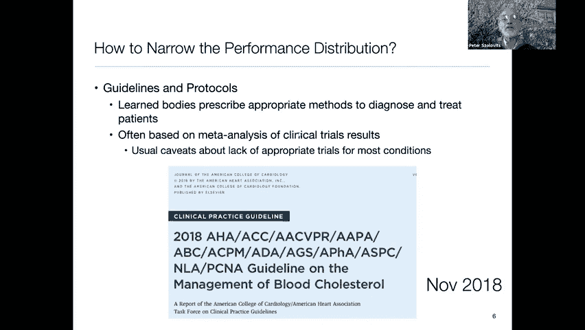
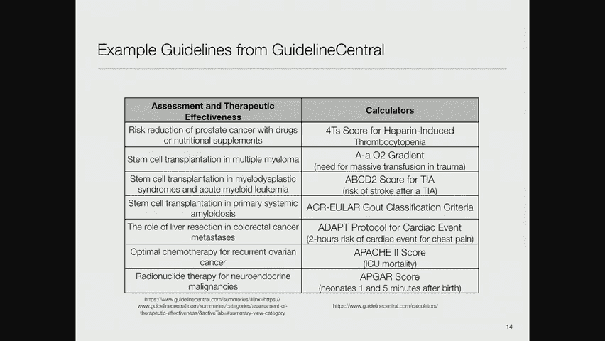
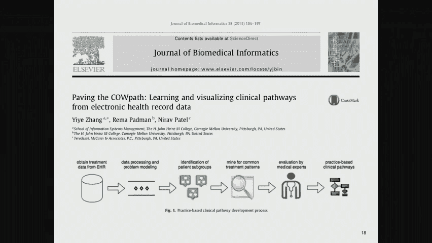
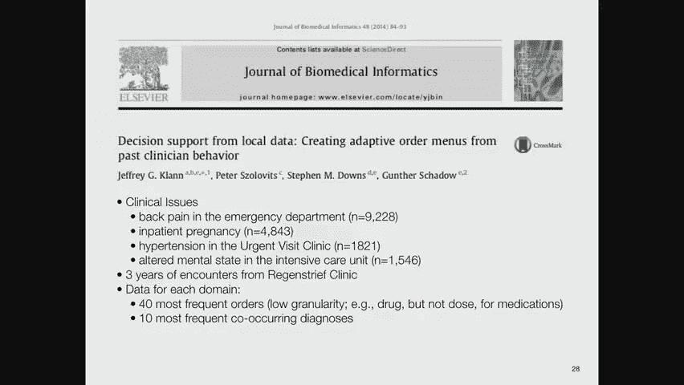
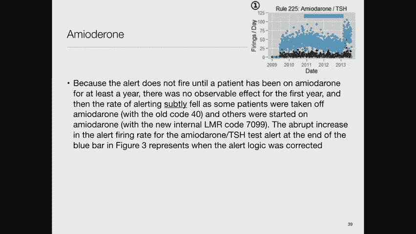

# MIT医疗机器学习中英文字幕 - P21：21.Automating Clinical Work Flows - 大佬的迷弟的粉丝 - BV1oa411c7eD

所以今天的主题是工作流，然后呃，这是一件，当我开始在这个领域工作时，我没有意识到这个话题的存在，但我已经埋头苦干了几十年，所以最后，对我来说，这很明显是需要注意的事情。

所以这里有一个有趣的问题，假设你的目标，我们在这门课上所做的工作就是改善医疗保健，不是一个不合理的目标，那么你怎么做好呢，我们在20世纪70年代有一个想法，当我开始做这个的时候。

那就是我们想了解世界上最好的专家做得最好的是什么，并通过封装他们关于，如何做诊断，如何做预后和治疗选择，为了提高其他不是世界级专家的医生的表现，通过允许在计算机系统中捕获世界级的专业知识。

帮助人们找出如何做得更好，所以为了让他们更准确，诊断学家，更有效率，治疗师，等，这里的目标真的是，提高医疗保健系统中每个人的平均表现，所以我们经常说，把大家都带来，呃，行医更接近世界一流专家的执业水平。

现在事实证明这并不是最重要的，所以后来有了另一个想法，说得好，你知道，并不是医生的平均表现不好，真正糟糕的是低于平均水平的表现，所以如果你的表现低于平均水平导致你的病人死亡。

但你高于平均水平的表现只会在他们的结果中产生适度的差异，那么关注那些最糟糕的医生显然更重要，并让他们以更好的方式行事，因此诞生了一个协议的想法，该协议说，让我们用相似的方法治疗相似的病人。

它的价值是减少方差，因此，提高平均值与减少方差，那么这些中哪一个更好呢，嗯，这取决于你的损失函数，正如我所建议的，如果你的损失函数是不对称的，所以做得不好或低于平均水平比做得高于平均水平要好得多。

那么减少方差的协议思想真的很重要，这几乎是医疗系统所采用的，所以我想试着帮你想象一下，假设在某种任意的尺度上，你知道从零到八，我们有一个通常的正态分布，在左边，呃卑鄙的行为。

所以这就是人们通常的行为方式，我们假设有一个正态分布，这是你的世界级专家，他的表现在，你知道六七个，这是一个医生的哑弹，他的表现在零到一之间，而一般的医生只是一个害羞的，不到四个，所以这里有两种情况。

第一种情况是我们把这些家伙的表现提高了一点点，所以我们通过改进，你知道吗，第一点表现点，我想这是我在这个模型中所做的与另一种方法的比较，假设我们可以显著地减少方差，使这个相同的正态分布变得更窄。

它的平均值仍然在完全相同的地方，但现在有遥远的离群值，所以没有医生表现得更糟，也没有医生表现得更好，在那种情况下会发生什么，嗯，你得看看成本函数，所以如果你有一个像这样的成本函数，也就是说。

在零水平上表演的人有一个成本，而一个在八级水平上表演的人的成本几乎为零，它像这样呈指数级下降，使平均性能的成本比平均性能低得多，在最差的表现和最好的表现之间，所以这表明。

如果你能把人们聚集在这个表演领域，你的总成本会下降，事实上，如果这是我建立的一个纯粹假设的模型，但如果你做计算，您发现对于基本分布，这是成本的分布，对于稍微改进的分布，你得到了一个成本。

是一千六百九十四对七百八十一，又是任意单位，但如果你设法缩小分布，你可以通过提高平均水平来将总成本降低到比你所做的更低的水平，现在，这并不能证明这是正确的想法，证据可能在于这样一个事实。

即医疗系统已经采用了这一点，并决定让所有的医生表现得更像普通医生，是改善医疗保健的最佳实际方法，嗯，如何缩小绩效分布，所以一种方法是制定指导方针和协议，在那里你有一个博学的身体。

谁规定适当的方法来诊断和治疗病人，所以发生的事情是，比如说，这里的文章来自2018年11月，美国心脏病学会的一份报告，美国心脏协会临床实践指南特别工作组，这已经被这个聚宝盆三和四个字母缩写的组织采用了。

这是血液胆固醇管理的指南，如你所知，高胆固醇是危险的，它会导致心脏病发作和中风，因此，人们一致认为，降低人们的这一水平是好的，所以这些人到处走，到处走，把一群世界专家聚集在一起说，嗯，我们怎么做。

我们颁布了什么来照顾患有这种疾病的病人的适当方法。

他们做的第一件事是，他们想出了一个颜色编码的概念，说明推荐有多强烈，某个建议应该是，和另一种颜色编码或阴影，呃，水平。

例如，如果你说某样东西在一班，所以强烈推荐，然后你使用像推荐或指示有用这样的词，有效，有益的应该执行等等，如果是在第二类，好处远远大于风险，然后你说这是合理的，它可以很有用等等。

如果收益可能等于或比风险好一点，你说像华夫饼这样的词可能是合理的，可以考虑，如果，如果没有好处，呃，换句话说，如果它大致等于风险，那你说不推荐，如果风险大于收益，然后你说这有潜在的危害，造成伤害等等。

所以如果你给一个关于，是否向肺部喷洒消毒剂，你可能会把它放在红色，说这是不推荐的，然后这里这个，这个底纹编码是，基本上，这项建议的证据有多好，所以最好的证据，那个呃，呃，一级。

是来自多项随机对照临床试验的高质量证据，或一组高质量rts um或rct的元分析，得到高质量登记研究的证实，然后我们下到C级，这是基于临床经验的专家意见共识，但没有任何形式的分析。

所以如果你看看这个特定的文件，胆固醇，它说很好，以下是关于测量低密度脂蛋白和非高密度脂蛋白的建议，呃，胆固醇，他们在这里说对推荐的信心，呃是呃，呃是一个，嗯和嗯，这是基于证据水平。

它说在20岁或以上的成年人中，而不是在降脂治疗上，空腹或非空腹血点的测量，所以你可以在以后的笔记中读到这一点，但请注意，有一些高质量的高强度推荐，有较低的力建议，每个建议也是阴影。

编码来告诉你证据的力量是什么，对于这种推荐，这里只是另一个例子，呃，这是继发性动脉粥样硬化性心血管疾病的预防，呃，所以这是给已经生病的人的，这是一堆建议，如果你超过七十五岁或更小。

与冠状动脉疾病的临床病例比高强度，高强度，应开始或继续他汀类药物治疗，目标是减少50%或更多的低密度脂蛋白等，所以再一次，一大堆不同的建议，顺便说一句，推荐的力度，这只是几页中的第一页证据的质量。

所以说，这在很大程度上是学术团体现在试图影响医学实践的方式，为了减少差异，让每个人，嗯，以正常的方式行事，你可能看过关于阿图尔德的文章，他是波士顿的外科医生，他因提倡核对表而声名鹊起，他说，比如说。

如果你是外科医生，你应该表现得像个飞行员在你起飞前，你要通过一个理智检查表来确保所有的系统都正常工作，所有的开关都设置正确，呃，在外科手术中就是你有所有必要的设备，你知道在各种潜在的紧急情况下该怎么办。

等，所以这是他们带回家的信息，这在这里是有道理的，我从一篇有所有这些细节的论文中摘录了这些，所以呃，呃，第一名，你走得很好，嗯，在所有人中强调心脏健康的生活方式，在生命历程中，这似乎没有太大的争议。

然后呃，在已经生病的人身上，呃，降低低密度脂蛋白，呃，高强度治疗，呃，他汀类药物，而且风险很高，ascbd，使用每分升70毫克的阈值，等，所以这些是总结建议，希望医生阅读这些文章，离开他们。

确信并将记住他们应该这样做，当他们和病人互动时，呃，这又是一个流程图，他们从那篇论文中抽象出来的，上面写着，呃，你知道，各位，你应该强调健康的生活方式，然后根据你的年龄，取决于。

但你对一生风险的估计是你最终会被分为不同的类别，这些不同的类别对你想对你的病人做什么有不同的建议，呃，这是二级预防，所以对于已经生病的人来说，这是一个类似的流程图，不仅仅是处于危险之中。

嗯，然后对于未来事件风险非常高的人来说，这是由这些历史和这些高风险条件定义的，呃，这些人陷入了第二个流程图，现在应该这样对待，顺便说一句，嗯，我没有做民意调查，但是呃，所以我会给你答案，但这样问很有趣。

当这样的论文发表时，医生实际上坚持这些有多好，结果答案不是很好，它需要很多，在这些建议被社区的大多数人接受之前的许多年，建议，呃，比如说，我觉得，呃，二十年前，呃，有一个建议说。

任何心脏病发作的人都应该接受治疗，即使他们现在没有症状的受体阻滞剂，因为呃，在各种审判中，他们显示有一个三，重复心脏病发作减少5%，由于这种治疗，它花了，呃，我觉得。

在大多数医生意识到这一点之前的十几年，并开始向他们的病人提出这种建议。

有一种叫做AHRQ的东西，卫生局，研究与质量，在本届政府之前，他们经营着一个国家指导方针交换所，这些指引由不同当局公布，并可供市民下载及使用，指导方针中心试图接管其中的一些角色，自从政府关闭以来。

政府运行一个，他们的网站上发布了大约2000条指导方针。

这些是一些例子，因此，通过药物或营养补充剂降低前列腺癌的风险，干细胞移植治疗多发性骨髓瘤，骨髓增生异常综合征和急性髓样细胞的干细胞移植。

髓系白血病，等等，然后他们还发布了一堆风险计算器，说，我不知道，肝素诱导血小板减少症的四个T评分是多少，但也有很多这样的，所以这些东西有一个交换所，而你，作为一个执业医生可以去这些。

或者你的医院可以决定他们将向他们的医生提供这些指南，并鼓励或，在某些情况下，强迫他们使用指导方针，以确定他们的活动，现在注意到这是一种非常自上而下的活动，所以这通常是由这些有学问的社会来做的。

将专家们聚集在一起思考正确的做法是什么，然后他们告诉世界其他地方怎么做，但也有一种自下而上的活动，所以嗯，有一种叫做护理计划的东西，护理计划实际上是一个护理术语，所以如果你在医院闲逛，你发现医生消失了。

它们出现又消失，你知道它们就像基本粒子，他们不是一直在身边，真正照顾你的人是护士，所以，护士们开发了一套方法，如何确保他们照顾好你，其中之一是制定这些护理计划，然后临床途径是什么。

是试图将护士在照顾个人时使用的护理计划，从这些中概括并说好，我们照顾特定队列中的病人的典型方式是什么。

所以我要谈谈这个，我给你的一篇论文作为今天的选读，是关于牛道的，这些是建立护理计划普遍性的尝试，这是密歇根护理中心的护理计划，这是一个教育组织，试图帮助护士找出如何成为好的，护士，我很开心。

当我在找这个的时候，我偶然发现了一段视频，这是一个有经验的护士在谈论你如何建立这些护理计划，她说嗯，你知道的，当你在护士学校的时候，你学会了如何建造这些非常精细的，精心构建的护理计划。

当你真正当护士的时候，你永远不会有时间做这件事，所以你要做一个粗略的近似，别担心，但就目前而言，正确地做这些练习使你的教授满意，所以你知道，看看这个，所以有一堆柱子，最左边的写着评估，所以这是客观的。

主观和医学诊断数据，客观数据是这个病人的左脚感染了坏疽，不是好事，开放性伤口等等主观数据，病人说走路和转身时疼痛更严重，她害怕理疗，她希望自己不必在这种情况下感到惊讶，但那绝对是主观的。

你看不到外部证据，护理诊断是这个病人的组织完整性受损，关于伤口，和感染的存在，这种诊断实际上伴随着一种关于如何做出诊断的指南，换句话说，为了能够把它写在护理计划上，她必须确保病人的特征符合某些标准。

这些是诊断的定义，病人的结局，所以这是护士试图实现的目标，注意这里有五个目标，一个是病人会报告任何疼痛感觉的改变，在1月2日、3日和2月4日之间的组织损伤部位，所以这是一个非常具体的目标，对呀。

上面写着，病人会告诉我他们感觉好多了，他们的感情发生了变化，在他们感染的左脚，愈合组织和防止损伤的计划，所以有一个病人教育的部分，他们将描述保护和治愈组织的措施，包括伤口护理。

请注意这是病人在向你描述你打算为他们做什么，换句话说，展示对计划的理解，他们可能会发生什么，经历伤口缩小，大小减小，肉芽组织增加，并实现功能疼痛零的目标，根据病人的言语，所以当他们进来用疼痛量表问你。

你是零分还是十分，或者介于两者之间，目标是病人会说我在零，换句话说，现在不痛了，干预措施是什么，嗯，这些都是护士为了达到这些目标而计划做的事情，然后原理是解释为什么。

期望这些干预措施实现这些目标是合理的，成果的评价，说什么标准，或者我们试图实现的实际结果是什么，所以以后会填满，显然比计划制定时，所以如果你看这样的网站，对许多人来说，有某种模板化的护理计划，很多条件。

你可以看到我只到C，在这个网站的A到Z列表中，还有很多其他人，但你知道有一个入院护理计划，成年未能茁壮成长，酒精戒断，我不知道什么是阿纳卡，贫血和凝血剂护理，等等，所以不同的病人有很多不同的情况。

这是一种尝试列出模板护理计划的方法。

现在，张和他的同事们对这篇论文很感兴趣，他们所做的是，他们说好，让我们把所有这些护理计划，让我们尝试建立一个机器学习系统，这些护理计划中嵌入的典型模式是什么，但他们没有从计划开始，这是回顾性分析。

所以他们从对每个病人所做的实际记录开始，所以这个想法是你从电子健康记录中获得治疗数据，然后从这些数据中识别患者亚组，然后你挖掘常见的治疗模式，你让医学专家评估这些然后这些成为临床途径。

这是护理计划对特定亚人群患者的概括。

所以他们的想法是定义一堆抽象，所以他们说，看一个事件就是一次访问，所以说，比如说，对于门诊来说，在一次就诊中发生在你身上的任何事情，去看医生或去医院，所以这是一套程序，一套药物，一组诊断，顺便说一句。

他们关注的是患有肾病的人，作为他们观察的目标人群，所以他们说，好的，单个事件将被抽象到这些超级节点中，它捕捉到了联想的独特组合，与某些访问有关的事件，所以你可能会担心这会是组合的，对呀。

因为有很多可能的组合，这实际上有点问题，我想在他们的分析中，所以现在你有了这些超级节点，然后每个病人都有一个就诊顺序，这是这些超级节点的时间顺序列表，所以每次你去看医生，你有一个新的超级节点。

所以你有一个时间序列，然后他们做下面的事情，他们说，哎呀，当我们和我们的医生和护士交谈时，他们告诉我们他们最关心的是病人最后一次就诊时发生了什么，但他们也不太关心，但他们仍然关心之前的访问发生了什么。

但不是关于更远的历史，所以他们说，在马尔可夫链中，我们只有依赖于马尔可夫链中最后一个节点的东西，所以让我们改变这里的模型，以便我们将访问对组合成节点，这样马尔可夫链中的每个节点都将代表最近两次访问。

病人没事。

所以这可能会再次导致一些组合问题，但这是他们想出的图像，所以有单独的项目，是去医院吗，参观办公室，以教育为目的的访问，做了超声波吗，你被注射了ACE抑制剂吗，你吃过利尿剂吗，等等。

所以这些都是我们提到的数据，他们把它当成一个袋子，然后他们说，好的，我们要找出所有袋子里的东西都是一样的，他们没有看，比如说，在给你的药物剂量下，只知道是哪种药物，所以那边有一些坍塌。

那么超级节点是这些组合，我们说，好的，你有一个特殊的目的，特殊的诊断，一套特定的干预措施，一套特定的程序，我们再次列出了这些的所有可能组合，然后这个序列代表你的序列。

这些节点被聚合成表示访问顺序的超级节点，然后这些超级对是这个黑客，让你回到马尔可夫链的两步，所以他们最终得到了大约3500个不同的超级对节点，所以它是组合的，但在他们的数据中，这并不是很好的组合。

每对访问序列之间公共子序列长度的最大值，所以他们要把这些序列聚集在一起，它们定义了一个距离函数，即它们共享的共同序列越多，它们之间的距离就越小，他们使用的特定距离函数是每个序列的长度。

减去它们公共子序列长度的两倍，最长公共子序列，这似乎很合理，然后分层聚类成不同的子组，他们为这组病人想出了三组，他们在这里，你所看到的，他们中的一些人彼此之间没有太大的不同，例如。

这两种不同的只是病人得到了一些药物和利尿剂，在一个案例中，另一种情况下只是药物，所以这些是，你知道的，它是一个分层集群，群中较低的东西可能彼此相当接近，然而。

然后他们能做的就是估计这些超级之间的转移矩阵，节点对状态，他们可以根据数据的支持程度来观察不同的轨迹，所以你可以设置不同的阈值，在一个特定的州有多少病例，以便您认真对待到或从该状态的转换。

我对这项研究的批评之一是他们的数据太少，他们想出的许多团体，里面的病人数量相对较少，一旦你有了这些转换矩阵，然后你可以说，好的，第二组，这个集群，所以在这个集群中总共有14个病人。

他们都处于慢性肾病四期，如此严重，他们都有高血压，他们都在服用ACE抑制剂和他汀类药物，所以如果你看那里，然后你可以说，好的，对于我们所知道的关于那个病人的一切，它们之间的概率关系是什么我们发现。

我看不懂这些，所以这些节点暗示了其他节点，箭的强度与宽度成正比，所以这是我们所了解到的关于这个星系团的一切的代表，但只记得那十四个病人，所以我不确定，我会把这个带到银行，太依赖它了。

但他们会手工抽象并说好，让我们来看看对此的解释，所以如果他们以他们在集群中看到的典型模式观察，他们说，嗯哼，我们看到病人在办公室就诊，病人正在服用这些药物，并进行这些程序，然后他们就住院了，否，对不起。

什么，黄色，是啊，是啊，黄色纸条是办公室访问，所以他们住院了，然后他们接受教育访问，所以这通常是和护士或护士在一起，从业者向他们解释他们应该做什么，他们有另一家医院，2。他们又去了一趟办公室，2。

他们去医院看病，2。他们又去医院看了一次病，然后他们就死了，好的，所以不幸的是，是一个非典型的模式，你在患有严重慢性肾病的病人身上看到的，从这张图中我们不知道这个过程需要多长时间，它需要发生。

所以我有一些问题，有很多子组，他们中的一些人和其他的人相当相似，他们在每个亚组中有10到158名患者，这样我会感觉好多了，如果他们每组有1000到15000个病人，或者每组十五万病人。

我会更相信他们发现的陈述，另一个问题是，即使在一个单独的亚组中，你可以发现非常不同的模式，例如，这里有一个模式，一个人有几次办公室访问，他们去医院，或者他们带着一个，略有不同。

啊，是呀，这是这个人在急性肾损伤的时候，所以你可以直接从办公室到那里，是之前的住院治疗，然后他们就死了，所以这是模式的一部分，但这里有另一个从完全相同的亚组中挖掘出来的模式，现在这个分组有122个病人。

所以有更多的异质性，但你在这里看到的是一个病人在两次教育访问之间来回，和医生出诊，在医生出诊和住院之间来回，然后住院，然后再住院，但他们活了下来，所以有点棘手，但我认为这是个好主意。

但在这里使用的技术上可能会有改进，当然还有，更多的数据会很有帮助，为了真正描述这些病人的情况，这里有一个类似的想法，我参与了杰夫·克兰，他在里根礁的博士学位，这是一个非常著名的。

印第安纳州最早采用计算机化信息系统的人。所以他一开始，他说，嗯哼，你知道亚马逊的推荐系统说，你知道吗，你刚买了这个相机镜头，和其他买了这个相机镜头的人，还买了清洁工具和相机配套的电池等等，所以他说。

我们为什么不把同样的想法应用到医疗订单上呢，所以他记录了里根街的所有命令，他基本上建立了一个亚马逊推荐系统的近似值，说嘿，其他要求进行以下一系列测试的医生也要求进行这项额外的测试，你没有点。

也许你应该考虑做这件事，或者反过来，其他要求做这一套测试的医生从来没有额外要求过另一套，你确定你真的需要它吗，所以这就是我的想法，他所做的是他专注于四个不同的临床问题，其中一次是去急诊科看背痛。

急诊科高血压，所以紧急访问诊所是这些较低级别的诊所之一，非急诊科，更便宜，较低的护理水平，但仍然是紧急护理类诊所，许多医院已经建立了，为了不让病得不重的人去急诊科，在这个低强度的诊所里。

嗯和高血压和高血压，然后在重症监护室改变了精神状态，所以重症监护室的人经常服用药物，他们变得古怪，所以这是试图照顾这样的病人，他们使用了里根街三年的遭遇数据，以及对于每个域。

他们将自己限制在40个最频繁的订单和低粒度，例如，一种，但不是药物的剂量，和十种最常见的共病。

共现诊断，所以这是人群智慧的一个例子，一种说得好的方法，你的同事所做的可能很好地代表了你应该做的事情，现在这种方法的一个明显的陷阱是什么，只是看看你是否醒着，是啊，是啊，你只是加强，是啊，是啊。

如果他们都是笨蛋，他们会把你训练成一个笨蛋，我也是，所以你知道，医学上有很多东西，没有很好的证据支持，事实上，人们已经形成了以某种方式做事的传统，那可能不是正确的方法，这只是强化了，另一方面。

它可能确实减少了方差，就像我们一开始谈到的那样，因此，这可能是一个合理的方法，如果你愿意容忍一些例外，你知道的，我最喜欢的故事是Semmelweis发现，嗯，在维也纳的医院生孩子对母亲来说是极其危险的。

因为他们会死于所谓的儿童热，基本上是一种感染，Semmelweis发现也许在巴斯德之前就有了，但他发现也许有什么东西在传播，从一个女人到下一个女人，导致了这种儿童热，他当然是对的，他做了一个实验。

在他的产科病房里，他让所有年轻的医生洗手，用某种酒精之类的东西来杀死他们传播的任何东西，在那里，这种儿童热的死亡率几乎降至零，他去找他的同事，他说，嘿伙计们，我们真的可以让世界变得更美好，停止杀害妇女。

他们看着他，他们说你知道，这些是治愈的手，他们不杀人，你知道的，他们中的许多人是从事这一职业的上流社会或贵族，他们不知何故负责传播细菌的想法，对他们来说是不可能的，塞梅尔韦斯结束了。

结束他在精神病院的日子，因为他疯了，他无法改变练习，尽管他做了一个实验来证明它是有效的，所以说，这是一个群众智慧不太好的案例，导致了不好的结果，好的，所以它就像亚马逊的推荐系统，它自动。

决策支持规则的学习，这一点的吸引力在于，因为它是从真实数据中诱导出来的，它倾向于处理更复杂的案件，而不是那种简单的刻板印象案件，人们可以为此制定指导方针，比如说。

在那里他们可以预测在各种情况下会发生什么，所以他使用了贝叶斯网络模型，可能的命令和证据，这是已经完成的订单的结果，匹兹堡大学有一个系统，叫做四分体，它实现了贪婪等价物搜索的一个很好的版本。

这是一种在贝叶斯网络空间中搜索的更快的方法，用于表示数据的适当网络，所以说，你知道这是一个高度组合的问题，其中的聪明之处在于它计算出了贝叶斯网络的类别，根据定义，这将同样适合数据。

它是按类而不是按单个网络来做的，所以它得到了一个很好的组合还原，怀孕网络中的，这些节点对应于各种干预措施和各种条件，这是贝叶斯网络，最适合这些数据，这相当复杂，这里还有一些其他的，这是急诊科的。

所以你看到你知道你有胸痛和腹痛，提出诊断，然后进行各种手术比如腹部CT或盆腔CT，或者胸部CT或者头部CT，或者一个基本的代谢面板，等等，这就给出了它们之间的概率关系。

所以他们能做的就是把这个贝叶斯网络表示，然后如果你把一个特定病人的数据放在那个代表上，这对应于固定某些节点的值，然后你做贝叶斯推理，计算未观测节点的概率，你推荐尚未做过的最高概率的干预措施，所以有点像。

如果你还记得我们说过顺序诊断，这有点那种精神，但这是一个复杂得多的贝叶斯网络模型，而不是天真的贝叶斯模型，所以界面看起来像这样，你有它被称为迭代治疗建议算法，它向医生表明这些是，你知道的。

病人的问题和当前的命令，你可能会问，你可以要求做这些订单中的任何一个，他们能够证明的是，这做得相当好，很明显它不会被出版，如果他们不能证明这一点，所以你看到的是，比如说，在住院妊娠中完成的下一个订单。

所以他们判断这个算法的标准是，它是否将人们实际做的事情提升到了推荐列表的首位，您考虑执行的推荐操作集，你看，在住院怀孕中，平均排名第四，大约六个在重症监护室，大约六个在急诊科，大约五个在紧急护理诊所。

所以这很好，因为这意味着即使你在看iPhone，你知道有足够的屏幕房地产，它会出现在所谓的谷歌点击的第一页，这是人们唯一关注的事情，事实上，它们可以显示平均列表位置对应于按频率排列的顺序。

但他们的模式做得相当好，让你保持在，你知道的，在这个范围的大部分时间里，前十个左右，好了，现在。

我又要换挡了，所以亚当，赖特，你见过的，他是我们早先一节课的讨论者，亚当一直在积极尝试部署决策支持系统，他有一个有趣的插曲，二十六，所以一定是在二十一点十六分之前。

他去展示他们在布里格姆实施的这个伟大的决策支持系统，他装了一个假箱子，在那里警报应该响了，服用某种药物超过一年的病人，需要有促甲状腺激素，为检查长期使用胺碘酮的潜在副作用而测量的。

以及他们的ALT作为肝脏测试，肝酶试验，所以他们需要这两个测试，他在演示这个奇妙的系统，他把一个有这些情况的假病人放进去，警报没有响，所以他去，嗯哼，发生什么事了？他们回去发现，在2009年。

该系统的胺体酮内部代码已从40改为70。九十九，谁知道为什么，但是系统中的规则逻辑从未更新以反映这一变化，所以，事实上，如果你看看，胺碘酮的使用历史，顺便说一句，这是一个有趣的图表，蓝点是工作日。

黑点是周末，所以周末医院里没什么事，但你看到的是我不知道以前发生了什么，大约在2009年底，他们可能没有执行那个规则什么的，但你看到的是这个规则的使用逐渐增加。

然后你会看到从2010年到2013年的大幅下降，当他们发现这个问题时，为什么减少了，我是说，这不是突然跳到零，好的原因是它的出现首先是逐渐出现的，因为服用这种药物的人，在软件的变化得到旧代码之前。

它还在触发规则，只是随着时间的推移，越来越多需要测试的人得到了带有新代码的药物，有了新的代码，它不再触发规则，然后这就是他们发现bug的点，然后他们把它修好了，当然，它又回来了，哦好吧。

我也要谈谈其他人，所以这是，所以当一些病人停药时，它微妙地下降了，其他的是用这个新的内部代码开始的，正如我所说警报逻辑是在2013年修复的。

是啊，是啊，所以我不知道医院的IT系统是如何工作的，在我的奶牛场里，但是有没有一个概念像这台电脑和你被更新的软件，但那个已经更新了，还是都同步了，这样它们都能同时更新，它们往往会同时更新。

在这个更新过程中发生了一些灾难，著名的是，贝斯以色列号沉没了大约三天，他们的电脑系统崩溃了，他们发现他们有一个非常复杂的网络，以便启动不同的系统，所以必须启动一些系统，为了让其他系统启动。

为了让第一个系统启动，它必须启动，当然在正常运行中他们不会破坏整个系统，所以没有人发现这一点，直到有思科搞砸了他们，路由器上有一些修复程序导致一切崩溃，然后他们就不能再把它带回来了。

所以这是一个很大的恐慌，约翰，哈拉科是那里的首席信息官，是我以前的一个学生，在这一切结束之后，我问，我问约翰，发生这种事的时候你做的第一件事是什么？他说我派了几辆卡车去斯台普斯的仓库，去买纸垫。

这是相当聪明的，好的，这里有另一个例子，这是铅筛选，所以，这是一个对两岁儿童有铅筛查规则的案例，还有一比一，三四岁的孩子，对一个的筛查没有变化，三四岁的孩子，但是对两岁孩子的筛选从，你知道的。

每天三四百人下降到零几年后他们才注意到，然后又回到了之前的水平，他们从来没有完全弄清楚这里发生了什么，但是有什么东西在规则中增加了两个不完整的条款，与性别和吸烟状况有关，但条款不完整。

所以他们实际上是在寻找，没有指明性别或吸烟情况的个案，所以两岁孩子的吸烟状况，你可以想象并不经常指定，但性别通常是，所以规则从来没有因此而被解雇，他们不知道这些变化是如何发生的。

有一个复杂的日志系统记录所有的更改，它崩溃了，丢失了日志数据，你知道这是一个，这是一个平淡无奇的故事，所以他们最终，他们很快就发现了这个，因为他们有一个两个月大的男孩，和胆固醇筛查。

并建议开始给病人服用各种药物，他们很快就找到了那个，所以我是说这很有趣，但有趣的是，这些人接着说，嗯，我们如何以某种持续的方式监控这一点，所以他们说好，有一个变点检测的概念，这是一个有趣的机器学习问题。

所以他们说好，假设我们建立了一个包括季节性的动态线性模型，因为我们要处理，事实上，周一到周五发生了很多事情，周末什么也没发生，所以他们创建了一个模型，说你的输出是某个函数，你的输入的f，加上一些噪音。

噪音是高斯的，有一定方差的资本v，X是根据某种进化而进化的，这意味着它取决于x的前一个值，加上一些其他的噪音，也是高斯的，所以这是人们通常采用的时间序列建模方法，然后他们说好，我们必须处理季节性。

所以我们要做的是定义一个周期，也就是一个星期，然后我们将在一周的不同日子把各州分开，为了让我们能够模拟季节性，我在一个不同的项目上工作，与…有关，在那里，周期是一年，因为像流感这样的事情是每年发生一次。

而不是每周发生一次，所以这个想法很常见，然后他们建立了一个多过程动态线性模型，基本上是一个，想象一下，我们的数据是由一组动态线性模型中的一个产生的，所以我们每次都有一个额外的状态变量，说明在这一点上。

哪个模型在控制生成数据，嗯和所以嗯，如果你有到一段时间t的一组观察，那么你就可以计算出模型i在这一点上驱动发电机的概率，所以你可以有三个基本的模型，你可以有一个模型说它是一个稳定的模型，换句话说。

你所期望的是稳态，所以这将是正常的每周体积变化，对于这些警报中的任何一个，您可以有一个模型，它是一个附加的离群值，所以这是突然间说的，发生了一些事情，比如衣原体屏幕，或者其他快速出现的东西。

或者你可以换一个等级，就像发生在，当胺碘酮的筛选规则或警报规则停止发射时，因为它从一个层次到了一个非常不同的层次，在相对较短的一段时间内，然后呢，你能做的就是计算这些模型控制的概率，下一次。

这就是所谓的变化点得分，你可以根据你得到的数据来计算，当然，他们有大量的数据。

这是一家大医院，很多这样的警报都在继续，如果你策划这个，有一个时间序列的数据，所以你可以看到每周的变化，但你看到的是稳定的概率，挺高的，除了在某些时候它突然下降。

所以在这些地方你会怀疑发生了一些有趣的事情，在这些不同的点上上升，在这一点上，水平移动的概率上升，你确实可以看到，有一个水平的变化，从本质上的零上升到这个周期性的行为，在原始数据序列中向上。

所以他们实际上在医院里实施了这个，所以现在你得到的不仅仅是警报，但你得到的消息说，你知道的，这孩子应该接受铅含量筛查，但铅含量筛选规则也没有像我们预期的那样频繁，开火，是啊，是啊，所以报纸上有很多细节。

如果你有兴趣，可以查一下，他们发现如果你观察延迟下的区域，假阳性率曲线，所以你在交易，确定其中一种情况发生需要多长时间，与你喊狼来了的频率相比，你会看到他们的算法比，他们试图对抗的一堆其他东西。

这些都是早期的尝试，这些都具有高度的统计学意义，所以他们去拿了一份很好的报纸，好的，在剩下的时间里，我想谈谈其他一些与工作流有关的问题，所以我们已经讨论过提醒，但是关于这些警报系统实际上是如何工作的。

有一系列有趣的研究，所以贝丝·以色列女执事有一个很酷的想法，波士顿的医院，在那里他们说好，我们真正需要做的是升级警报，例如，在医院里，如果你有，如果你是医生，你有一个病人，你刚刚把他们的血液送到实验室。

假设他们的血清钾含量是七八，好的，那个病人有很高的心律失常和死亡的风险，所以你的寻呼机在那些日子里响了，你读到这条短信说先生，琼斯的血清钾含量是8，你最好去看看他，所以他们做的很聪明，他们说好。

问题很忙，医生可能会忽略这一点，所以我们会启动倒计时，我们会说琼斯博士，史密斯博士真的来看看琼斯先生，你知道吗，二十分钟，如果答案是否定的，然后他们给医生的老板发了一个页面，说嘿，我们给这家伙发了一页。

不到二十分钟，他就没有去看病人，然后他们启动另一个计时器，他们说，如果老板在一小时内没有回应，然后他们给医院的负责人发了一个页面，说着，你知道的，你的传染病科的人做得很糟糕，因为他们不是。

或者在这种情况下，你的内分泌或其他什么做得很糟糕，因为他们对这些警报没有反应，你觉得医生怎么会喜欢这样，不多，过度警觉是一个真正的问题，也没有一般规则说，你多久能用这样的警报窃听医院的负责人一次。

在他或她只是说好之前，把这该死的东西关掉，我不想清楚地看到这些，如果你在不同的地方设置阈值，你会得到不同的结果，例如，我记得塔夫茨实施了一个这样的系统，早在二十世纪八十年代。

但他们会在每一个订单上发一个页面，任何实验室结果都不正常，这太过分了，因为你知道很多这样的测试产生了20个结果，正常值定义为95%的置信区间，在20个测试中，不是真正独立的，但如果他们是。

他们中的一个肯定会，对大多数病人来说超出了范围，所以基本上每一次测试都会向医生发出警报，医生们确实威胁要杀死实施这个系统的人，它关闭了这样的系统，如果将阈值设置为不异常，但危及生命的异常。

如果你设置了费率和持续时间，这样人们对它的反应是合理的，那也许可以接受，呃，当我们做这个项目的时候，嗯，急诊科如何预测大量的病人，因为看起来流感季节开始了，比如说。

我们问的问题是你们一个月能忍受多少次假警报，他们想了想，Ed医生聚在一起说一个月三次，你可以喊狼来了，因为我们真的想知道它什么时候真正发生，我们宁愿做好准备，我们可以容忍这个预测有10%的错误率。

但我不知道这里面是什么，在这个领域，另一个有趣的研究是，你知道的，它变得相当流行，就像我今天收到了一堆医生的电子邮件，因为我按处方点了续杯，他想知道进展如何，和废话，废话，废话，所以BI问了这个问题。

有多少，这些信息中有哪一部分从来没有被发送给他们的病人阅读过，这是一个重要的问题，因为，如果你依赖这种交流方式作为你工作流程的一部分，你希望它是零，结果只有百分之三，这是非常好的。

意味着大多数人实际上都在关注这些信息，然后我想说几句关于沟通的重要性，然后最后提到到目前为止的一些，试图很好地集成所有不同数据源的失败尝试，就像我说的，BI始于1994年，它的系统说。

如果你正在服用肾脏排泄或外露毒性药物，然后我们要警告人们，如果肌酸水平上升，这表明你的肾脏功能不太好因为，当然啦，如果药物是肾脏排泄的，这意味着如果你的肾脏没有排泄东西，以他们应该的速度。

你最终会在体内积累越来越多的药物，这可能会变得有毒，所以他们看到了两个一个小时，所以几乎一整天的降价，给出这些警报的医务人员的反应时间与以前发生的情况相比，真了不起，我是说。

节省了一天时间来应对这样的情况真的是一个令人印象深刻的结果，他们也看到了，就临床结果而言，肾损害的风险降低到前的一半左右，干预水平，所以早期的反应实际上是在挽救人们的肾功能，通过让人们早点干预。

我觉得有趣的是，他们说，44%的医生发现这些警报很有帮助，28%的人觉得他们很烦人，但65%的人希望他们继续使用，在一项调查中，恩里科·科伊拉是我心目中的英雄之一，他曾在英国呆过。他现在在澳大利亚。

他在20世纪80年代有一个非常深刻的洞察力，他说，你知道你们这些在医学领域踩着电脑的人，认为所有的行动都是关于决策的，但并不是所有的动作都是为了交流，医疗保健基本上是一项团队运动。

除非我们花更多的时间研究交流中发生的事情，我们要赶不上船了，然后我们大多没有注意到他们，但他一直在努力，所以他说，嗯，通信空间有多大，所以他引用了1985年的一项研究，是人们问同事要的信息。

而不是两个六个，他们在自己的笔记中查找，所以如果医生在查房，走进病人的房间说，你知道的，我想知道，这家伙的体温是忽高忽低的吗？四分之一的时间他会看笔记，有一半的时间他会转向护士说。

这个病人的体温是上升还是下降，好的，所以他说这很有趣，嗯，保罗·唐在90年代做了一项研究，What’在诊所里是这么说的，大约60%的时间花在工作人员之间交谈上，什么都不做。

说几乎100%的非病人记录信息，换句话说，那几乎是同义反复，因为你还能从哪里得到它，然后BI的查理·萨弗隆做了一项时间和运动研究，看着，我觉得，护理行为，说他们大约一半的时间是面对面的交流。

大约10%有电子病历，还有很多电子邮件、语音信箱和纸质提醒，作为人与人之间交流的方式，这是科伊拉和坟墓的98研究，他们在找一个顾问，家庭办公室或其他顾问，这些是英国的头衔，因为这是在澳大利亚做的。

护士等等，他们说，好的嗯，在医院工作人员中，我想这是在，呃，在一个班次，我想我应该把它放在幻灯片上，这是他们发送和接收的页数，所以它们的范围从零到大约四，拨打和接听的电话数目，从零到十三不等，哦。

这是观察的长度，所以这对每个病人来说都是在大约三个小时的时间里，这是事件的总数所以想想在三个半小时内，高级内务官员有24个不同的沟通事件发生在那个人身上，所以这意味着什么，就像七个，呃，是啊，是啊。

每小时7个，所以这就像一个，每一次，十分钟，大概，这里有一个特殊的主题，他们观察了三个三又一刻钟的观察，这个人花了86%的时间说话，百分之三十一被两个，八次中断，所以即使是中断也被打断了。

25%的人在两次或两次以上的对话中同时处理多项任务，87%面对面或通过电话或寻呼机，所以大部分时间是谈话时间13处理电脑和病人笔记，所以沟通功能真的很重要，我的意思是，我对此没有什么深奥的话要说。

除了我会在这些文件上贴一个指针，但他们正在考虑的事情，或者嗯，我们可以引入新的渠道或新类型的信息或新的通信政策，你知道的，你不能打断一个照顾病人的人，当他们在做的时候，或者类似的东西。

然后从同步方法转移到异步方法，像语音信箱或电子邮件或松弛，或者你知道一些现代的交流机制，嗯，让我跳过这些，所以说，嗯，快速到最后一个话题，你怎么不丢球，所以有很多分析说，医疗保健中最大的错误是犯的。

不是因为某人做了错误的决定，但这是因为有人没有做出决定，他们只是忘记了一些事情，他们没有跟进他们应该耐心等待的事情，你觉得一切都很好，你不处理它，部分灵感来自我在贝斯读到的传呼机的升级，以色列，我说。

嗯，听起来我们真正需要的是一个工作流引擎，那大约是一个离散的事件模拟器，那么有没有人在这个类中建立了一个离散事件模拟器，这是一个相当标准的编程问题，它在模拟各种涉及离散事件的事情时很有用。

这个想法是你有一个时间表，你沿着时间线运行，执行下一个出现的活动，这种活动做了一些事情，它发送电子邮件或它，你知道发射火箭或其他领域，你在做模拟，但最重要的是，它所做的是它所做的最后一件事。

它会在时间线的晚些时候安排其他事情发生，例如，为了每天发生一次的事情，当它发生的时候，运行的任务，安排第二天再次发生，这意味着它将一直持续运行，所以我的想法是，你想做的是说，如果在某个时候。

我没有一个任务说做X，或者让Z做Y，或者两者兼而有之，那么最后一件事应该是在未来时间表的某个时候，另一个说Y完成的任务，如果没有，然后去通知某人或者去提醒某人，据我所知。

没有医院和电子记录系统有这样的能力，但我仍然认为这是个好主意。

然后我想用一个指针结束，一个仍然困扰着我们的问题，所以在1994年，我和一些同事写了这个东西，我们称之为守护天使宣言，这个想法是我们应该让病人更多地参与他们自己的护理。

因为他们可以跟踪很多系统没有做的事情，很好地跟踪，这个想法是，你将有一个计算过程，从你父母怀你的时候开始，一直跑到你死后的尸检，在此期间，它将负责收集所有关于你的相关医疗保健数据。

所以它将是你的电子病历，但它也会是活跃的，所以它会帮助你和你的提供者沟通，它会帮助你了解，你有什么条件，它会提醒你一些事情，它会为你安排事情，等等，所以这是一个很好的科幻愿景，在两千年中期。

亚当·博斯沃思是谷歌的副总裁，他来找我，他说你知道我读了你的东西，这是个好主意，我要做这件事，所以谷歌启动了一个叫做谷歌健康的东西，它更侧重于至少是个人健康记录。

他们在克利夫兰诊所做了一个100人的试点，然后他们作为测试版上市，嗯，三年后他们杀了它，他们有一群搭档，所以他们有，你知道，所有脚本，和贝丝，以色列和马萨诸塞州蓝十字，和克利夫兰，诊所和CVS，等等。

所以他们做了他们的工作，试图联系一群重要的球员，但当然他们没有所有人，所以，比如说，我当然立即注册了一个账户，也是我打过交道的唯一一家公司，在那一套里是沃尔格林，我在那里买了一个护肤霜，一次是皮疹。

所以我的总病历包括皮疹，还有我买的护肤霜，不是很有帮助，因此，除了这些合作伙伴之外，没有人可以自动输入数据，这意味着你必须比我更有肛门强迫症，为了坐在那里把我的整个病史输入系统。

尤其是因为如果我这么做了，没有人会看它，如果我去看医生说，嘿医生，这是我医疗记录的谷歌URL，这里有一个密码，你可以通过它访问它，你认为他们真的会看起来像，零，好的，所以这件事绝对是一个可悲的失败。

人们一直在尝试，到目前为止还没有人想出怎么做，但这仍然是个好主意。

