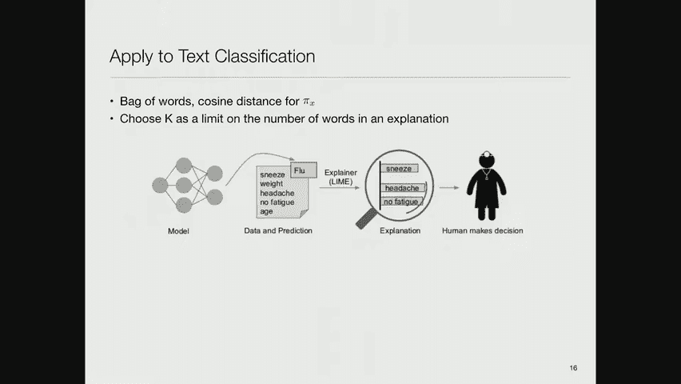
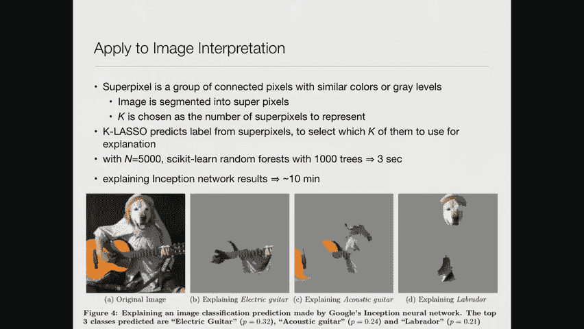
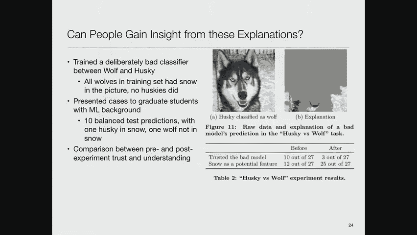
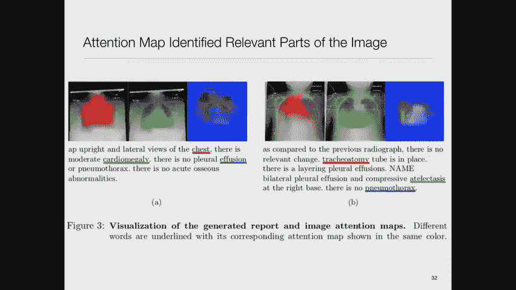

# MIT医疗机器学习中英文字幕 - P25：25.Interpretability - 大佬的迷弟的粉丝 - BV1oa411c7eD

这门课的最后一个主题是可解释性，很难理解所以，如果我给你一些像GPT 2型号的东西，我们在自然语言处理中谈到过，我告诉你它有一点，50亿个参数，然后你说，嗯哼，它为什么起作用了。

答案显然不是因为这些特定的参数有这些特定的值，没有办法理解，所以今天的话题是我们提出的，在关于公平的讲座中，其中一个问题是，如果你不能理解模型，你看不出来，如果模型通过检查它而产生了偏见。

所以今天我们要看看人们开发的不同方法，试图克服高深莫测的模型的问题，有一段非常有趣的历史，你们有多少人知道乔治，米勒七正负二结果，只有几个，米勒是哈佛的心理学家，我想在二十世纪五十年代。

他在1956年写了这篇论文，叫做神奇的数字，七正负二，对我们处理信息能力的一些限制，这是一篇相当有趣的论文，所以他从我忘记的东西开始，我在很多很多年前读过这篇论文，我已经忘记了，他从一个问题开始。

你能感觉到多少不同的东西，你能感觉到多少不同层次的东西，所以如果我给你戴上耳机，我要求你用1到N的比例告诉我，我在你耳机里播放的声音有多大，当你超过5英尺6英尺7英寸时人们会感到困惑，不同程度的强度。

同样，如果我给你一堆颜色，我请你告诉我不同颜色之间的界限在哪里，人们似乎想出了七个，正负二，作为他们能分辨的颜色的数量，所以有很长的心理学文献，米勒继续做实验，在那里他要求人们记住一系列的事情。

他又一次发现，你可以记住大约七个，正负两件事，除此之外，你再也记不起名单了，所以这告诉了我们人类大脑的认知能力，这意味着如果我给你一个有20个东西的解释，你不太可能理解它。

因为你不能同时把所有活动的部分都记在脑子里，现在这是一个棘手的结果，因为他确实指出，即使在1956年，如果你把东西分成更大的块，你能记得其中的七个，即使它们大得多，所以很擅长记忆的人，比如说。

他们记得那些模式，这样他们就可以记住更多的原始对象，所以你知道，我们仍然不明白记忆是如何工作的，但这只是一个有趣的观察，我想，在…的问题上发挥了作用，你如何在复杂的模型中解释事物。

因为这表明你无法解释太多不同的事情，因为人们不会明白你在说什么，是什么导致了复杂的模型，就像我说的，过拟合肯定会导致复杂的模型，我记得，在二十世纪七十年代，当我们开始研究医疗保健中的专家系统时。

我参加了统计学家和人工智能研究人员的第一次联席会议，统计学家们都在你知道的，理解方差和理解统计显著性等等，我一直在努力模拟一个病人身上发生的细节，在我演讲后的一些讨论中，有人挑战我，我说好。

我们AI人真正做的是合身，你们认为是噪音，对呀，因为我们正试图对我们的理论进行更详细的改进，在我们的模型中，比典型的统计模型，当然，我被大声嘘出了大厅，在会议的剩余时间里，人们避开了我。

因为我做了件蠢事，承认我是我在适应噪音，当然，我并不真的相信我在适应噪音，我相信我适合的是，一般的统计学家只是把噪音归因于噪音，我们对机制的更多细节感兴趣，通过正规化，我们有一个很好的处理。

这样你就可以，你知道的，在整个课程中，你已经看到了很多正规化的例子，人们不断提出如何应用正规化的有趣想法，为了简化模型，或者让它们合身，对模型应该是什么样子的一些先入为主的概念。

在你开始从数据中学习它之前，但问题是这些模型真的很复杂，不管你是否安装噪音，世界是一个复杂的地方，人类不是被设计出来的，它们进化了，所以我们的进化遗产留下了各种各样奇怪的东西，所以它很复杂。

很难简单地理解如何做出有用的预测，当世界真的很复杂的时候，那么我们该怎么做才能处理好这个问题，一种方法是编造我所说的，这些故事简单地解释了一件复杂的事情是如何运作的，你们中有多少人在小时候读过这些故事。

没有人，我的天啊，好的，一定是一代人的事，所以鲁德亚德·吉卜林是一位著名的作家，他写了一系列的故事，比如狮子是怎么得到鬃毛的，骆驼是如何驼峰的等等，当然，他们都是彻头彻尾的公牛，我是说，它不是。

为什么雄狮有男人，只是编出来的故事，但它们真的很可爱的故事，我小时候很喜欢，也许你也会，如果你的父母，如果你父母读给你听，所以我的意思是我用这作为一种贬义词。

因为遵循这条调查路线的人所做的是他们采用一些非常复杂的模型，他们对它做了一个局部近似，这不是整个模型的近似值，但它是在特定情况附近的模型的近似值，然后他们解释简化的模型。

我会在今天的课上给你们看一些例子，另一种方法，我也会向你们展示一些例子，你只是为了一个模型而牺牲了一些较低的性能，这很简单，可以解释，像决策树和逻辑回归等等，通常表现得不如最好的，最复杂的模型。

尽管你已经在这门课上看到了很多例子，事实上，他们确实表现得很好，在那里他们没有被花哨的模特超越，但总的来说，你可以通过调整一个花哨的模型来做得更好一点，但后来就变得难以理解了，所以人们愿意说，好的。

我要放弃百分之一或百分之二的业绩，为了有一个我能真正理解的模型，它之所以有意义是因为这些模型不是自动执行的，它们通常被用作对一些做出最终决定的人的建议，你的外科医生不会看这些模型中的一个。

把他的左肾拿出来说，好的，我想他们会很顺利的，这有道理吗，为了回答，这有道理吗，知道模型是什么真的很有帮助，模型的推荐是基于什么，它的内在逻辑是什么，所以即使是一个近似值也是有用的，信任的需要。

ml模型的临床应用，在这篇论文中，我将讨论两种方法，他们说，好的，您想做的是查看特定案例的预测，所以有一个特定的病人在特定的状态下，你想了解模型对病人的描述，然后你也想对整个模型有信心。

所以你希望能够有一个解释能力，上面写着，这里有一些有趣的代表性案例，以下是模型对它们的看法，浏览它们，并决定你是否同意这个模型所采取的方法，现在，还记得我对随机对照试验的批评吗，人们做这些试验。

他们选择最简单的情况，为了达到统计显著性，他们需要的最小数量的病人，最短的随访时间，等，然后这些试验的结果应用于非常不同的人群，大卫谈到了队列转移，作为那个想法的概括。

但同样的事情也发生在这些机器学习模型中，你在一组数据上训练，然后，典型的发布将对相同数据的一些保留子集进行测试，但这并不是对现实世界的非常准确的描述，如果您尝试将该模型应用于来自完全不同来源的数据。

很可能你会以某种方式把它专业化，你不欣赏，你得到的结果不如你得到的好，拿出的测试数据，因为它更异构，我想我提到过杰夫·德雷克，《新英格兰日报》的主编大约一年前开了一次会，他在信中争辩说。

该杂志永远不应该发表一项研究，除非它已经在，发表最终被撤回的研究，因为不是因为调查人员的任何公开的坏行为，他们做的正是，你们在这门课上学到的东西，但是当他们把这个模型应用到不同的人群中时。

它只是不像出版的版本那样工作得很好，当然，还有所有关于出版偏见的问题，你知道的，如果我们50个人做同样的实验，偶然的机会，我们中的一些人会得到比其他人更好的结果，这些是将要出版的。

因为结果不好的人没有什么有趣的东西可以报告，所以有整个出版偏见的问题，这是另一个严重的，所以我想花一分钟说，你知道的，解释不是一个新想法，所以在专家系统时代，我们谈到了一点，在我们早期的一堂课上。

我们谈到了我们将采取医疗措施的想法，人类，医学专家，向他们汇报他们所知道的，然后尝试将它们编码为模式，或在规则中，或者以各种方式在计算机程序中复制它们的行为，所以梅森是其中一个项目。

特德·肖特利夫在1975年的博士论文，他们发表了一篇很好的论文，这是关于霉素系统的解释和规则获取能力，作为一个例子，他们举了一些例子来说明你可以用这个系统做什么，所以他们争论的规则是完全可以理解的。

因为他们说如果一堆条件，那么你可以得出以下结论，对呀，所以考虑到你可以说好，当节目回来的时候，并根据获得培养物的地点和收集方法说，你觉得检测到了大量的有机体吗，获得了，换句话说。

如果你从某人的尸体上取了样本，你在寻找感染，你认为你的样本里有足够的有机体吗，用户说，嗯，你为什么问我这个问题，就系统运行的规则而言，答案是相当好的，上面写着，找出答案很重要，是否有治疗意义的疾病。

与这种生物体的发生有关，一个我们已经建立的，培养物不是通常不育的培养物，采集方法是无菌的，因此，如果观察到大量生物体，然后呢，有强烈的证据表明，那个，有治疗上重要的疾病，与这种生物体的发生有关。

所以如果你在仔细收集的地方发现虫子，那么这表明你应该治疗这个病人，如果有足够多的虫子，和，也有强有力的证据表明这种生物体不是污染物，因为采集方法是无菌的，你可以继续这个，你可以说好。

为什么为什么这个问题，它可以追溯到这些规则的演变，上面写着好，为了找出感染的部位，已经确定文化遗址是已知的，获得标本后的天数少于7天，因此，有治疗上重要的疾病与这种生物体的发生有关，所以有一些规则说。

如果你有虫子，而且发生在过去的七天内，病人可能真的感染了，所以说，我的意思是，我有很多这样的例子，但你可以继续前进，为什么你知道，这是两岁的，但是为什么爸爸，但是为什么，但为什么。

为什么找出感染源很重要，嗯，有一个原因，那就是有一个规则会得出结论，例如，腹部是感染的部位，或者骨盆是病人的感染部位，如果您满足这些标准，所以这是一种基本的解释，这直接来自于这些基于规则的系统。

所以你可以回放规则，我喜欢的一件事是，你也可以在1975年问自由形式的问题，自然语言处理不太好，所以这大约五分之一有效，但你可以走到它跟前打一些问题，和，比如说，你开过卡宾尼西林治疗假单胞菌感染吗。

上面写着好，在我的规则数据库中有三条规则可以得出与这个问题相关的结论，那么你想看哪一个呢？如果你说我想看第六十四条，它说很好，这条规则说，如果确定该生物体是假单胞菌，正在考虑的药物是戈霉素。

那么更合适的治疗方法是戈霉素和卡宾尼西林的结合，再次，这是1975年的医学知识，但我猜真正的潜在原因是，可能有假单胞菌对，到那时到戈霉素，所以他们使用了联合疗法，现在顺便注意一下。

这个解释能力并没有告诉你这一点，因为它实际上并不理解这些单独规则背后的基本原理，当时也有研究，比如说，我的一个学生关于如何通过编码来更好地做到这一点，不仅仅是规则或模式，也是它们背后的理由。

这样解释就更合理了，标准的爷爷，今天解释复杂模型的故事方法来自这篇论文，在一个叫做莱姆局部可解释模型的系统中，不可知论的解释，只是给你一个例子，你有一些复杂的模型。

它试图解释为什么医生或人类做出了某个决定，或者为什么模型做出了某个决定，所以它说得很好，这是我们掌握的关于病人的数据，我们知道病人在打喷嚏，我们知道他们的体重和头痛，和他们的年龄，他们没有疲劳的事实。

所以解释者说，为什么模型判断这个病人得了流感，嗯，积极的是打喷嚏和头痛，而负片就是不疲劳，对呀，所以它进入了这个复杂的模型，上面写着好，我无法解释神经网络中发生的所有命理，或贝叶斯网络。

或者它正在使用的任何网络，但我可以具体说明，看起来这些是最重要的，正负贡献者，是啊，是啊，这不仅是为了，还是为了那个，我会给你看一些其他的数据，一分钟后我想他们最初是为了笔记而设计的。

但它也用于图像和其他类型的数据，他们提出的论点是，这种方法也有助于检测数据泄漏，比如说，在他们的一个实验中，数据的标题有，与结果高度相关的信息，我想我不记得是不是这些人了。

但有人给每个病例分配了学习身份证，他们用一种愚蠢的方式做了这件事，所以所有的小数字都与患有这种疾病的人相对应，大数字与没有的人相对应，和，当然，最节俭的预测模型只是使用身份证号码，并说，好的，我拿到了。

所以这将帮助你识别，因为如果你看到最好的预测器是ID号，然后你会说嗯，这里有点可疑，嗯，所以这里有一个例子，这种能力非常有用，这是新闻组的，他们试图决定一个帖子是关于基督教还是无神论，现在看这两个模型。

所以有算法一和算法二，或者型号一和型号二，当你解释一个特定的案例时，它说很好，我认为重要的词是上帝，意思是任何人这个考雷什和通过，有人记得大卫·考雷什是谁吗，他是个邪教领袖，我不记得谁了。

如果他杀了一堆人或者发生了不好的事情，哦，我想他是德克萨斯州韦科的那个人，联邦调查局和ATF进去放火烧了他们的地方，一大群人死了，所以在这种情况下的预测是无神论，你注意到上帝、考雷什和卑鄙都是负面的。

任何人都是这样的，通过或积极的，你走了，这很好吗，但你看算法二，你说这也做出了正确的预测，这篇文章是关于无神论的，但积极的一面是这个词不是很具体，消极的是像NP这样的东西，你知道那是什么。

那是网络时间协议，这是一些技术上的东西，发帖和主持，所以这可能是进入文章标题或其他东西的元数据，所以碰巧在这种情况下，根据他们提供的测试数据，算法二比算法一更准确，但没有任何好的理由。

所以解释能力允许你了解这样一个事实，即使这件事得到了正确的答案，不是为了，那么你想从一个解释中得到什么，他们说你希望它是可解释的，因此，它应该提供对输入变量和响应之间关系的定性理解。

但他们也说这将取决于观众，我之前提出的乔治·米勒的论点需要稀疏性，你不能把太多的事情记在心里，你所解释的一定有道理，例如，如果我说好，这决定的原因是因为第一个主分量的特征向量是，下文。

这对大多数人来说意义不大，然后他们还说，嗯，它应该有局部的保真度，所以它必须与模型的行为相对应，在你试图解释的特定例子附近，及其第三项标准，我觉得这有点不确定，它必须是模型不可知论的，换句话说。

你不能利用任何东西，你知道吗，这是关于模型结构的特定内容，你训练它的方式，任何类似的东西，它必须是一个通用的解释器，适用于任何复杂的模型，是啊，是啊，所以那是那是，我觉得，他们的推理。

他们为什么坚持这个，因为他们不想为每个可能的模型写一个单独的解释，所以如果你能把这件事做完，效率会高得多，但我实际上质疑这是否总是一个好主意，但这是他们的假设之一，好的，这是他们使用的设置，他们说。

所有权利，x是定义原始数据的D维空间中的向量，我们要做什么才能让数据变得可解释，为了使数据不是模型可以解释的，我们要定义一组新的变量x素数，它们都是二进制的，在某个维d素数的空间里，它可能低于d。

所以说，我们正在简化我们将要解释的关于这个模型的数据，然后他们说，好的，我们要建立一个解释模型，g，其中g是一类可解释模型，那么什么是可解释的模型呢，嗯，他们不会告诉你，但他们说好，示例可能是线性模型。

加法得分，决策树，下降规则列表，我们将在后面的讲座中看到，它的域是这个输入，简化的输入数据，d素数维中的二元变量，模型复杂度将是决策树深度的某种度量，非零权重数与Logistic回归。

下降规则列表中的子句数，等等，所以这是一种复杂性度量，您希望最小化复杂性，然后他们说好吧，真实模型，多毛的复杂，一个全孔模型是f，它将原始数据空间映射成某种概率，例如，对于分类f是x属于某一类的概率。

然后他们还需要一个接近度测量，所以他们需要说，我们必须有一种方法来比较两个案例，说他们有多亲密，原因是因为记住，他们会给你一个特定的案例的解释，最相关的有助于解释的东西是那些靠近它的东西。

在这个高维输入空间中，所以他们根据实际的A决策算法定义他们的损失函数，基于简化的和基于邻近度的，他们说好，最好的解释是G使损失函数最小化，加上g的复杂度，很简单，所以这是我们最好的模型。

这里聪明的想法是说，而不是使用我们开始使用的所有数据，我们要做的是对数据进行采样，这样我们就可以在我们感兴趣解释的点附近取更多的样本点，我们将在可解释的简化空间中取样，然后我们建立G模型。

来自该数据样本的解释模型，我们通过接近函数等待，所以更接近的东西会对我们学习的模型产生更大的影响，最接近这个简化表示的点，我们可以计算出它的答案应该是什么，这就成了那个点的标签，所以现在。

我们训练一个简单的模型来预测复杂模型会预测的标签，对于我们已经取样的点，其他节目在能够，呃，去，呃，距离，呃，它是某种距离函数，我一会儿会说得更多，因为这是对这种特殊方法的批评之一，你如何选择距离函数。

但基本上是相似的，这里有一个很好的图形解释，假设实际模型，决策边界在蓝色和粉色区域之间，所以这是一个可怕的、多毛的复杂决策模型，我们试图解释为什么这个大的红色+会变成粉红色，而不是在蓝色中。

所以他们采取的方法是说，嗯，让我们对一组用最短距离加权的点进行采样，所以我们在这里做了几个点的样本，但大多数情况下，我们是在我们感兴趣的点附近采样点，然后我们学习正负情况之间的线性边界。

这个边界是更复杂的决策模型中实际边界的近似值，好的，所以现在我们可以给出一个解释就像你之前看到的那样，这是一个d素数维空间，所以D素数维空间中的哪些变量会影响你在哪里。

在这个新计算的决策边界的一边或另一边，以及在多大程度上，因此，如果将此应用于文本分类，是呀，我们只是想问，人们担心这种解释不仅仅是虚构的，就像我们能理解它一样，但相信我们应该相信它的理由。

如果这真的是线性所做的事情的真实本质，你知道吗，可以像，好的，我们知道这里发生了什么，但是，嗯，这就是为什么我把它叫做一个普通的故事，对呀，你应该相信吗，嗯，工程学科在近似，线性模型中极其复杂的现象。

对呀，我是说我在电子工程和计算机科学系，如果我和我的电气工程同事谈谈，他们知道这个世界是疯狂的复杂，然而，电气工程中的大多数模型或线性模型，它们工作得很好，人们能够建造非常复杂的东西并让它们工作。

所以这不是证据，那是历史上的争论什么的，但它是真正的线性模型是非常强大的，尤其是当你把他们限制在解释的时候，注意到这个模型对这个决策边界的近似很差，或者这个对，所以它只能在特定例子的附近解释。

我已经选择好了，但在那里确实管用，是啊，是啊，你说那里很好，因为你指向附近，就像一个边界，但是如果你在红色空间的中间选择一个点，他们，他们，他们做到了，所以他们到处取样，但请记住接近函数。

说这个与预测决策边界不太相关，因为这离我感兴趣的点很远，这就是魔力，但在这里他们试图解释大红十字，对是的，就像中间的某个点，红色的空间，基本上附近的都是红色的，成为别人的好，但他们会我的意思是。

假设他们选择了这个点，然后他们会在这一点周围取样，大概他们会找到这个决定边界或这个或类似的东西，仍然能够提出一个连贯的解释，在文本的情况下，您已经看到了这个示例，对于它们的接近函数来说很简单。

他们用余弦距离，所以它是一袋文字模型，他们只是计算不同例子之间的余弦距离，他们使用的单词之间有多少重叠，以及他们使用单词的频率，然后他们选择K和要显示的字数，只是作为一种偏好，所以它有点像超参数。

他们说，你知道的，我有兴趣看看前五个单词，或者对决定有积极或消极影响的前十个词，但不是前万字，因为我不知道用一万个字做什么。

现在有趣的是，你也可以把同样的想法应用到图像解释中，所以这里有一只狗在弹吉他，所以这是这些标签任务之一，你想把这张照片贴上拉布拉多的标签，或者作为木吉他，但有些唱片公司也决定这是一把电吉他，所以他们说。

嗯，赞成或反对其中每一项的因素是什么，他们采取的方法是相对简单的，他们说，让我们定义一个超级像素，作为图像中强度大致相同的像素区域，所以如果你用过Photoshop，魔法选择工具可以调整说。

在这一点周围找到一个区域，所有的强度都在，我选的点，所以它会勾勒出图片的某个区域，他们所做的就是把整个图像分成这些区域，然后他们把那些当成，单词样式中的单词，解释，所以他们说好，对算法来说。

这看起来像一把电吉他，这看起来像一把木吉他，这看起来像拉布拉多，所以有些是有道理的，我是说你知道那只狗的脸确实有点像实验室，这看起来确实有点像身体的一部分，和吉他的一部分烦恼，我不知道这是什么东西。

或者为什么这有助于它，当一只狗，但比如这些模型的性质，但至少它在告诉你。

为什么它相信这些各种各样的事情，所以他们做的最后一件事就是说好，好的，这有助于您理解特定的模型，但你如何说服自己，我指的是一个特别的例子，其中一个模型被应用到它，但是你如何让自己相信模型本身是合理的。

所以他们说好，我们知道的最好的技术是向你展示一堆例子，但我们希望这些例子涵盖所有地方，你可能会感兴趣的，所以他们说让我们创建这个矩阵，解释矩阵，这些是什么情况，这些是各种特征，你知道。

或者上面的像素元素什么的，然后我们填充矩阵中的元素，它告诉我，此特征与该模型的分类相关或反相关，然后它就变成了一种布景覆盖问题，找到一组模型，给我最好的解释覆盖范围，跨越这组特性。

这样我就能说服自己模型是合理的，嗯，所以他们有一个叫做子模选择算法的东西，你知道，如果你感兴趣的话，你应该看看报纸，嗯，但他们所做的本质上是在做一种贪婪的搜索，上面写着我应该添加什么功能。

为了在那个空间的特征中获得最好的覆盖，按文件分列，然后他们做了一堆实验，他们说，好的，让我们比较这些简化模型的这些解释的结果，两千个实例的两个情感分析任务，每一袋单词作为特征，他们把它比作决策树。

Logistic回归，最近的邻居，带径向基函数核的SVM，或者使用Word真空嵌入的随机森林，高度无法解释，有一千棵树，k等于十，所以他们选择了十个特征来解释这些模型中的每一个。

然后他们做了一个侧面计算，每种情况下最具启发性的十个特征是什么，然后他们说这样做，正确识别这些特征，所以他们在这里展示的是，在每一种情况下都比随机抽样，这并不奇怪，或者贪婪的取样，或者党派抽样。

我不知道细节，但无论如何，这张图表显示了什么，是他们认为重要的特征，在这些病例中，他们都在康复，所以他们的召回率很高，你知道的，百分之九十以上，所以其实，算法正在识别正确的案例。

为您提供所有重要功能的广泛覆盖，在对这些案件进行分类时，然后他们还做了一堆人体实验，他们说，好的，我们将要求用户从两个分类器中选择哪一个，他们认为会更好地推广，这就像我给你们看的基督教对无神论的图片。

如果你是一个机械火鸡，有人给你看了一个精确度很高的算法，但这取决于事情，比如在无神论和基督教的分类器中找到NNP这个词，你会说好，也许那个算法不会很好地推广，因为它取决于一些随机的东西。

可能与此特定数据集相关的，但如果我在不同的数据集上尝试，不太可能奏效，所以这是任务之一，然后他们要求他们识别像这样看起来很糟糕的特征，然后他们，并有一个单独的测试集，从这个网站上增加了大约800个网页。

底层模型是一个带有RBF核的支持向量机，对20个新闻组数据进行培训，我不知道你是否知道那个数据集，但它是，这是一个众所周知的公开数据集，他们有一百个机械图尔，他们说，好的。

我们将向他们每个人展示六个文档，每个文档有六个功能，为了让他们做这个，然后他们做了一个辅助实验，他们说，如果你在这个实验中看到不好的词，三振出局，这将告诉我们在这种方法中哪些功能是不好的。

他们发现人类受试者，很擅长弄清楚，哪个是现在更好的分类器，他们的判断更好，所以他们说，好吧，这个子模块选择算法，就是我没有详细描述的那个，但是这种集合覆盖算法比随机选择算法给你更好的结果。

只是说再次选择随机特征，并不完全令人惊讶，另一件有趣的事情是，如果你做特征工程实验，它表明，当土耳其人与系统互动时，系统变得更好了，所以他们一开始在现实世界中的准确率不到60%，利用他们更好的算法。

经过三轮互动，他们达到了大约75%，所以用户可以说我不喜欢这个功能，然后系统会给他们更好的功能，现在他们用图像尝试了类似的事情，所以这个有点好笑，所以他们训练了一个故意糟糕的分类器来分类。

在狼和哈士奇之间，这是一个著名的例子，而且原来哈士奇生活在阿拉斯加，所以狼，我想有些狼会，但大多数狼不会，所以在最初的问题表述中使用的数据集，经过训练的精确分类器，当他们去看它学到了什么。

基本上它已经学会了寻找雪，如果它在照片中看到雪，说是哈士奇，如果它在照片中没有看到雪，它说它是一只狼，所以这对他们的样本来说是非常准确的，但当然这不是一个非常复杂的分类算法。

因为有可能把狼放在下雪的照片里，你的哈士奇在室内没有雪是可能的，然后你就错过了这个分类的船，所以这些家伙建立了一个特别糟糕的分类器，通过让训练中的所有狼在照片中都有雪，没有一只哈士奇，十个平衡测试预测。

但他们在每个类别中放了一个铃声，所以他们放了一只哈士奇和雪还有一只不在雪中的狼，比较实验前后的信任和理解，所以在实验之前，他们说两个七个学生中有十个说他们相信坏人，他们训练的这个坏模型。

后来只有七分之三的人相信它，所以这是一种社会学实验，呃，是呀，我们实际上可以改变人们对一个模型是否是好的想法，是好是坏，基于一项实验，之前只有七分之十二的学生提到雪是这个分类器的潜在特征，然而。

后来几乎每个人都这样做了，这告诉您该方法提供了一些有用的信息。

现在这篇论文引发了大量的工作，包括对这部作品的很多批评，这是几个月前的一个特别的，十二月底，这些人说距离函数，其中包括一个西格玛，这是你愿意去的距离的尺度，在最初作者所做的实验中是相当武断的。

他们把那个距离定为七十，数据集维度平方根的5%，你去，好的，我是说，那是个数字，但并不明显这是最好的数字还是正确的数字，所以这些人认为调整社区的规模很重要，根据你试图解释的点离边界的距离。

所以如果它靠近边界，那么你应该取一个较小的区域来测量你的接近度，如果离边界很远，这解决了你们问的问题，如果你在中间选一个点会发生什么，所以他们展示了一些很好的例子，例如，如果你把这个，解释这个绿点。

你会得到一条很好的绿线，沿着当地的边界，但是解释蓝点，它靠近实际决策边界的一个角，你会得到一条线，它和绿色的没有很大的不同，红点也是一样的，所以他们说，嗯，我们真的需要研究距离函数。

所以他们想出了一个方法，但在这里，他们将取样现有的案例，所以他们要从训练中学习，原来的训练集，但他们会通过接近来取样，他们试图解释的例子，他们认为这是个好主意，因为，比如说，在法律上，先例的概念。

你可以争辩说这个案子和以前判决的案子很相似，因此应该以同样的方式决定，我是说，最高法院的争论总是关于这一点，下级法院的辩论有时更多地受到法律实际规定的驱动，但是判例法在英国法律中已经得到了很好的确立。

然后在美国法律中通过继承，许多世纪以来，所以他们说，嗯，基于案例的推理通常包括检索相似的案例，调整它，然后以此为新的先例，他们还主张对比论证，这不仅是你选择X的原因，但是你为什么选择X，而不是Y。

作为给予，对某些模型是如何工作的更令人满意、更有洞察力的解释，所以他们说，好的，类似设置f解决分类问题，其中x是数据，y是一些二进制分类器，你知道零或零一，如果你喜欢这套训练套装。

一堆x的y子为真的是实际的答案，y的预测值就是f在x上的预测值，并解释z的f等于某个特定的结果，你可以把一个案子的盟友定义为那些想出相同答案的人，你可以把敌人定义为一个，那些想出不同答案的人对吧。

所以现在你要对盟军和敌人都进行采样，根据一个新的距离函数，他们的直觉是，距离函数在原始石灰工作中的原因，效果不太好，是因为它是n维空间中的球面距离函数，所以他们会偏向它，说距离。

这个B将是线性预测差异的某种组合，加上这两个点的差值，第一项的等高线是这些圆形等高线，这就是莱姆在做的，第二项的等高线是这些线性梯度，他们把它们加起来，得到椭圆形的东西，这就是你想要的特征，对。

这一点离决策边界有多近，有很多相对毛茸茸的细节，我今天要把它省略在课堂上，但他们肯定在报纸上，所以他们还对一些非常简单的预测模型进行了用户研究，这就是你的房子值多少钱根据房子有多大，它是哪一年建的？

对它的主观质量判断是什么，所以他们展示的是你可以找到例子，他们是这座房子的盟友和敌人，为了做预测，所以他们应用他们的算法，如果成功了，它给你更好的答案，我得去找那张幻灯片好的，关于这件事。

我要说的就是这些，在个案的局部邻域中使用简化模型的想法，为了解释某事，我想谈谈另外两个话题，这是我的一些学生最近的一篇论文，他们在看医学图像，并试图从这些医学图像中生成放射学报告，对呀，我是说。

你知道的，机器学习可以解决所有问题，我给你一组图像和一组放射学报告，应该是直截了当的，建立一个模型，它现在拍摄新的放射学图像，并产生新的放射学报告，这些报告是可以理解的，精确等等。

但他们采取的方法有点有趣，所以他们用一个标准的图像解码器，然后在池层之前，它们本质上是一种图像嵌入，从这个图像编码算法的下一层到最后一层，然后他们把它输入单词解码器和单词生成器。

这个想法是让出现在图像中的东西，与报告中出现的词语相对应，在同一个地方结束，在嵌入空间中，所以又有很多头发，这是一个基于LSTM的，它被建模为句子解码器，里面有一个单词解码器。

然后有一个生成器生成这些报告，它使用强化学习，你知道，成吨的头发，但这是我想给你看的，有趣的是，所以编码器取了一堆空间图像特征，句子解码器使用这些图像特征，除了语言特征，输入到其中的单词嵌入，然后呢。

它们还使用远程注释方法，就是这个专家程序，这是一个基于规则的程序，出了斯坦福，读取放射学报告并识别报告中的特征，它认为重要和正确的，所以它并不总是正确的，当然啦，但是，但那是用来引导发电机的。

所以这里有一个例子，所以这是一个胸部和地面真相的图像，这是实际的放射学报告，说基底动脉中度心肌肥大是轻微的，没有气胸，部分可见下颈椎融合，愈合的右肋骨骨折顺便注意到，我看过上百张像这样的放射影像。

我永远也想不通，但这就是为什么放射科医生为许多人培训，多年来变得擅长这种东西，所以以前有一个别人做的程序叫TAT，它生成以下报告，上面写着，AP便携式胸部直立视图，没有，无焦点合并。

成像的骨结构完好无损，所以如果你把这个和那个比较，你说好，如果心内膜轮廓正常，然后呢，下颈椎融合的部分可视化，因为那是沿着中间的，所以这些不太一致，所以学生们建立的系统说，心脏轮廓轻微增大。

没有多发积液或气胸，没有急性骨异常，所以它也漏掉了愈合的右肋骨骨折。

但不管怎样，这是一个，你知道的，一只会唱歌的狗的非凡之处不是它唱得有多好，但它唱歌的事实，我把这个作品包括在内的原因，并不是让你相信这会很快取代放射科医生，但它有一个有趣的解释能力。

而解释设施利用注意力，这是它模型的一部分，嘿嘿，当我们得出一些结论时，我们可以指向图像，并说出图像的哪一部分对应于结论的那一部分，所以这很有趣，你说胸部的直立和侧视图是红色的，嗯，那是红色的胸部。

有中度心肌肥大，所以这里的绿色肯定向你展示了，你的心在哪里，大约在那里，再向左一点，没有多发积液或气胸，这个有点好笑，那是蓝色区域，那你怎么告诉我没有什么，我们很惊讶，其实。

当它向我们展示没有什么值得强调的时候，你可能感兴趣的东西之外的一切，这并不能完全令人信服地证明没有复数积液，这是另一个例子，没有相关的改变技巧，他必须把管子就位，所以粗略地显示有点太宽了。

但它大致显示了气管切开管可能在哪里，双侧胸腔积液和压迫，atleis和lcsis是指你的肺组织粘在一起，所以这种情况经常发生在肺的下部，再一次，底片向你展示了一切不属于行动的部分。

是啊，是啊，但就火车而言，真正好的是自己预测，而不是我的意思，就像一个模特，否，它试图预测整个模型，整个节点，就像他们掉下来一样并不容易，是啊，是啊，但这些人雄心勃勃，你知道吗，他们，是什么，杰夫。

辛顿几年前说过，他不想让他的孩子成为放射科医生，因为那个领域将被计算机取代，我觉得这么说很愚蠢，尤其是当你看到这些东西工作得有多好的艺术状态时，但如果那是真的。

那么你实际上会想要一些能够产生完整的放射学报告的东西，所以动机现在就在那里，在这项工作完成后，我们偶然发现了一份来自东北的有趣的报纸，上面写着，但是听着伙计们，注意不是解释，所以说。

注意力显然是一种机制，在各种机器学习方法中都非常有用，但你不应该把它和解释混为一谈，所以他们说好，假设，这是假设输入单元受到高度关注，受到高度重视的，权重负责模型输出，那可能不是真的，所以他们所做的是。

他们做了一堆实验，在那里他们研究了注意力权重和，模型参数的梯度，以查看是否，事实上，高关注度的话，是在模型中做出决定时最果断的人，他们发现直觉特征重要性之间的相关性衡量的证据，包括梯度和特征擦除方法。

所以这是消融研究，学习到的注意力权重很弱，所以他们做了很多实验，关于这项特殊的研究有很多争议，但你会发现，如果你计算一致性，你知道在不同的数据集上使用不同的模型，你看这个，比如说，一致性不是很高。

还不到一半，你知道的，有些在零度以下，因此，与此数据集相反的是，这些来自模拟数据的数据比其他一些数据的界限更窄，所以他们似乎有一个更明确的结论，至少为了研究，让我最后谈谈相反的想法。

所以与其建立一个复杂的模型然后试图用简单的方法来解释它，如果我们只是建立一个简单的模型，还有辛西娅·鲁丁，他现在是公爵，以前在麻省理工学院的斯隆学校，多年来一直支持这个想法，所以。

她想出了一堆关于如何建立简单模型的不同想法，权衡可能是一点点准确性，以便于解释，她最喜欢的是一个叫做下降规则列表的东西，所以这是一个例子，上面写着，如果有些肿块形状不规则，病人超过60岁。

那么有百分之八十五的机会患恶性肿瘤，有230个案例发生了这种情况，如果不是这样，那么如果肿块有推测的边缘，所以它有小尖刺从里面出来，病人已经四十五岁了，那么有78%的机会是恶性肿瘤，否则。

如果边缘有点模糊，它的边缘有点模糊，病人六十多岁了，那就有六十九的机会，如果它有不规则的形状，那么有百分之六十三的机会，如果是小叶状的，密度很高，那就有三九的机会，如果它是圆的，病人超过60岁。

那么有两个6%的机会，否则有百分之十的机会，好的，论点是对决策模型模型的描述足够简单，连医生都能理解，现在仍然存在一些问题，所以其中之一是通知，其中一些人的年龄超过了60岁，4岁以上，六十岁以上五岁。

不太清楚这定义了什么类别，原则上，不同的人可以有不同的年龄，但他们是这样建造的，所以这是一个非常简单的模型，是由一个非常复杂的过程建立的，简单的模型就是我刚才给你们看的，有一个贝叶斯方法。

贝叶斯生成方法，他们有一堆超参数，下降规则列表参数，θ，他们计算出一个可能性，给定一个特定的θ，你得到数据中实际答案的可能性有多大，给定您生成的A模型，他们从一组可能的，如果条款。

所以他们经常进行子句挖掘，以说明什么条件，数据库中经常出现的二进制条件是什么，这些是唯一会考虑的，因为，当然，可能的条款数量是巨大的，他们不想重复这些，然后对于每一组对于每一个子句。

它是由A由概率分布生成的，在下一个条款的风险评分较低的约束下，或等于前一条款的风险评分，好的，有很多细节，所以有一个频繁的项集挖掘算法，原来选r子，l成为实数乘积的日志是重要的一步。

为了以一种简单的方式保证单调性约束，l子句数取自泊松分布，你给它一个刻度，大致上说，在你的下降规则列表中，你愿意容忍多少条款，嗯，然后这里有很多计算，他们得到了平均的后验概率估计，生成一些子句。

然后他们用交换，替换，添加，并删除运算符，以便尝试不同的变体，他们在那个空间爬山，也有一些吉布斯采样，因为一旦你有了这些模型中的一个，简单地计算它的精度，并不直接，没有一种封闭的方式来做这件事。

所以他们正在取样，试图生成，所以它是一束头发，论文再次描述了这一切，但有趣的是，在一个为期30天的医院再入院数据集上，大约有8000名患者，他们使用了大约34个特征，比如精神状态受损，困难行为。

慢性疼痛，感觉不安全，等等，他们介意规则或条款，支持超过5%的数据库，并且不超过两个条件，他们将决定清单的预期长度设定为八个条款，然后他们将他们得到的决策模型与SVM的随机力进行了比较。

Logistic回归车与归纳逻辑规划方法，对我来说令人震惊，他们的方法，下降规则列表方法得到了大约8的auc，而其他人都喜欢第七点，九点七，五个逻辑回归像往常一样表现略好于他们得到的一个，但这很有趣。

因为他们的论点是，模型的这种表示更容易理解，对于大多数人类用户来说，甚至比逻辑回归模型还要好，如果你看看，这些只是各种运行，以及不同的型号，他们的模型有一个相当不错的A，你看上面。

我想绿色的是逻辑回归的，它稍微好一点，因为它的性能超过了他们最好的型号，在低假阳性率区域，可能是你想操作的地方，所以这可能是一个更好的模型，上面写着如果病人有褥疮，并且有不赴约的历史。

那么他们在三十天内被重新接纳的可能性是三三，如果我认为一些纸条上写着预后不良和最大限度的护理，等等，这就是他们现在得出的结果，顺便说一句，我们已经谈了30天了，再入院预测和超过70%在这个领域还不错。

因为这不是那么容易预测的，谁会在三十天内回到医院，所以这些模型实际上做得很好，当然可以理解，在这些术语中，他们还试穿了加州大学的各种，欧文机器学习数据集，这些只是随机的公共数据集。

他们试图建立这些下降规则列表模型来预测，你看到的是Aucs很好，所以垃圾邮件检测数据集，他们的系统大约有91，逻辑回归又得到了97，所以你知道，我们在几乎每一个例子中都教给我们的不幸教训的一部分。

在这个班上，像Logistic回归这样的简单模型通常做得很好，但请记住，这里他们是为了可解释性而优化的，得到正确的答案，所以他们愿意牺牲模型的一些准确性，为了开发一个容易向人们解释的结果，所以再一次。

这种类型的工作有许多变化，人们对什么是简单的可解释模型有不同的概念，但这是一种与莱姆方法非常不同的方法，上面写着建立毛茸茸的模型，然后提出当地的解释，解释为什么它对特定的案件做出某些决定，所有的权利。

关于可解释性，我想我要说的就这些，这是目前非常热门的话题。所以有很多论文，我想我刚刚看到一个关于，这方面的工作越来越多，这样我们的课程就结束了，我只想，我刚浏览了课程网站的首页，列出了所有的主题。

所以我们讨论了很多东西，你知道的，医疗保健的不同之处，我们讨论了临床护理是什么，临床数据是什么样的，如何在几堂课中解释临床文本，将技术转化为临床，斜体的是客座讲座。

所以心脏病学的机器学习和鉴别诊断的机器学习，病理学机器学习，大卫做了几次关于因果推理和强化学习的讲座，大卫和一位客人，我在这里没有注意到，疾病进展与亚型，我们谈到了精准医学和遗传学的作用。

自动化临床工作流程，规管讲座，然后最近，公平，对数据集的鲁棒性，移位和可解释性，所以那是相当多的，我想我们是我们，教职员工对课程的进展很满意，这是我们第一次作为这个团队来教它，我们希望再来一次。

向艾琳和威利表示感谢，4。没有他，我们可能早就没有希望了。

我也想承认大卫的远见，把这门课放在一起，几年前，他教了一个类似这样的班级的半尺寸版本，我想把它扩展到一个完整的学期是个好主意，常规课程，让我和他一起工作，我想感谢你们所有人的辛勤工作。

