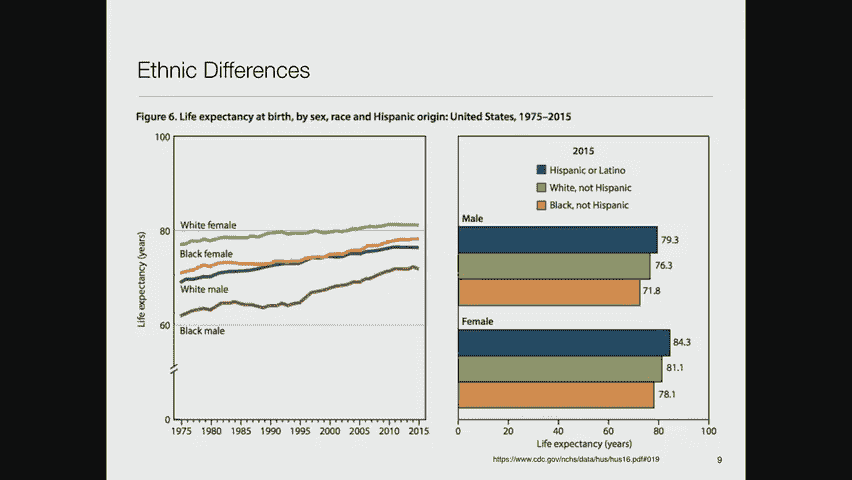
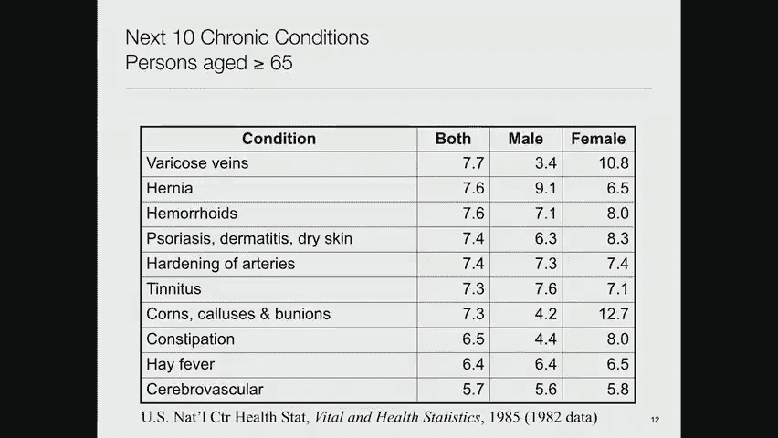
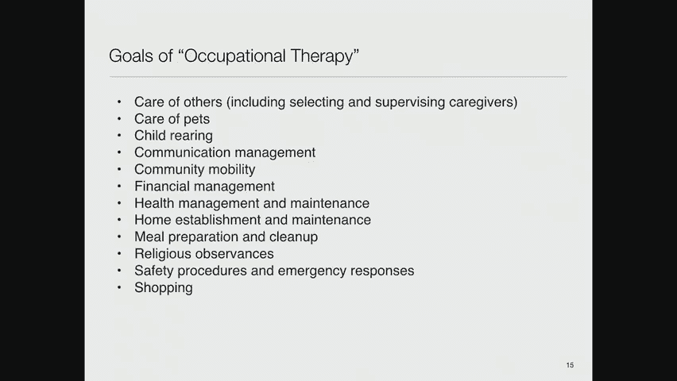
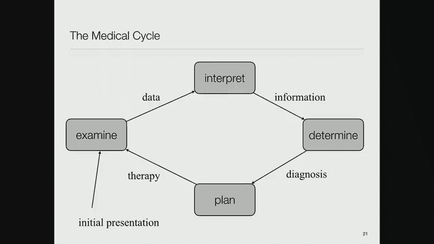
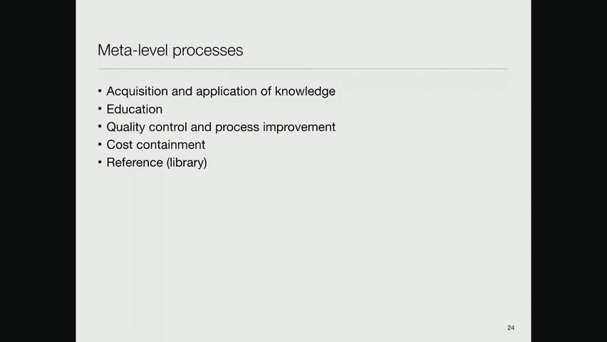
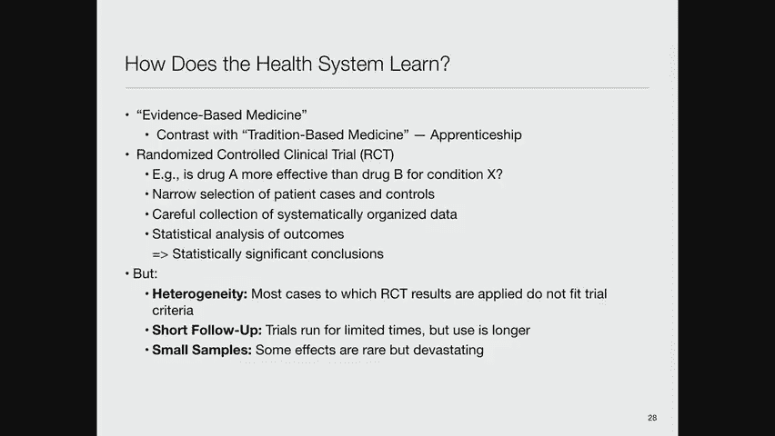
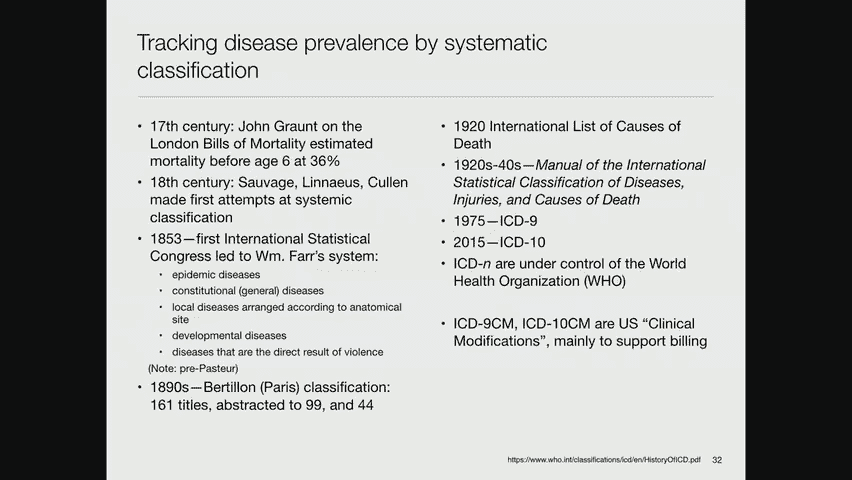
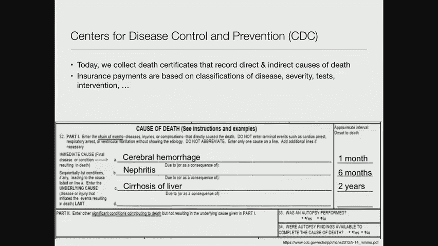
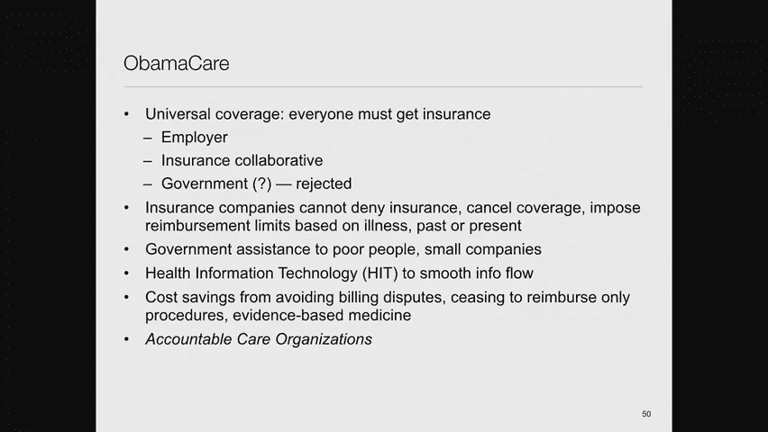

# MIT医疗机器学习中英文字幕 - P2：2. Overview of Clinical Care - 大佬的迷弟的粉丝 - BV1oa411c7eD

正如大卫所说，我在这方面已经很长时间了，我不是医生，但我可能已经学够了药，多年来能够在电视上播放一个，实际上这和今天的课有关，因为今天的课是为了让你们说，嗯，医生们感兴趣的问题是什么通过看它是什么。

他们是做什么的，好的，这就是我们今天的目标，所以我们今天要做的是用一种非常普遍的方式来讨论，医疗保健的目标是什么，你们中有多少人是医生，一对很棒的夫妇，好的，所以修复我，当我吹它所有的权利，请随意打断。

所以这将是我的第一个任务，然后第二个会是，人们为了实现这些目标实际上做了什么，医学实践是什么样的，生成的过程是什么，我们将用来学习的数据，然后我忍不住说了一点，讲座结束时支付医疗保健费用。

因为出现的很多问题，人们对，做我们所说的那种分析。

其实是受金钱的驱使，他们希望能够省钱或花更少的钱，或者类似的东西，所以重要的是要知道，好吧，医学已经存在很长时间了，我想从有记载的最早的历史开始，有关于人们想知道疾病的原因是什么如何治愈它的讨论。

他们想出了一些相当愚蠢的理论，因为他们没有很多科学的现代方法来解决这个问题，但例如，这是一张萨满左边的照片，我想来自一个加拿大印第安部落，躺在那里的男孩，谁病了，这个萨满会利用他对其他病人的经验。

他们确实对药用植物了解很多，他们知道如何护理受伤，诸如此类的事情，所以这是一种有效的医疗保健形式，没有太多的记录，你在那个场景中看不到电子病历系统，在右边，是一名现代萨满，在纽约地区的一家医院执业。

所以有传统文化，在这种情况下，与治疗者的互动被认为是医学实践中非常重要的一部分。

如果你听未来学家的话，医生们谈论医学可能是什么样的，他们强调治疗师的角色不是，只是为了成为一个好的自动机，谁能想出正确的事情，而是说服病人信任他，做他或她向病人建议的事情。

有很多安慰剂效应我们从很多很多的实验中知道，说如果你认为你会好起来，你会好起来的，好的现在现代医学实际上看起来更像这样，所以这是一个重症监护室，你看到的是一个病人身上有各种各样的导线和管子。

和进入他们体内的东西，被成吨成吨的设备包围着这些设备在监视他也许能让他活着，这就是高科技医学，我们认为是临床护理的当代版本，嗯，你可能会说好，健康意味着什么，如果医学的目标是造人或保持人的健康。

什么是健康，所以我们求助于世界卫生组织，他们有这个可爱的，健康定义的非常全面的概念，完全的身体状态，精神和社会福祉，不仅仅是没有疾病或虚弱，然后他们把这个分类，他们说，嗯，有身体健康，有心理健康。

还有社会健康。

社会健康尤其难以衡量，我一会儿再来讨论这个问题，所以最容易衡量的是人的寿命，所以我们有很长一段时间的生存分析数据，这有点令人震惊，如果你看这里，这个较低的曲线是从一千八百左右。

它告诉你如果你生活在一千八百年左右的印度，你的预期寿命大约是二十五岁，好吧，不是很好，如果你生活在最富裕的国家，当时在比利时是典型的欧洲人，你的预期寿命在40岁，你们中有多少人知道，好的很好，我没有。

直到我现在开始看这个，一千九百五十，就在不久前，它就像，你知道，六十，九年前，在挪威，你的期望是活到70出头，在美国，你能活到60多岁，平均，仍然有一个巨大的悬崖，如果你住在不丹或索马里，什么的。

你还在三十岁左右，今天好在二千零一二年，我们做得好多了，引人注目的不仅仅是，做得很好的人变得更好了，但是很多做得很差的人也变得更好了，所以我们现在上来了，你知道的，印度记得是在两个五年的预期寿命。

现在是六十年代，当然这些都是平均数，所以个体差异很大，但这有点有趣，所以如果你看看数字，你会看到，即使在较短的时间内，也有很大的变化，例如，如果你是居住在卢旺达的男性，就预期寿命而言。

这是最差的地方之一，你的预期寿命，如果你今天出生大约是62岁半，对呀，如果你出生在2001年，到现在才三十八年，卢旺达发生了什么，在2001年，是啊，是啊，他们互相残杀，所以这是一个例外，这变得好多了。

因为他们不再互相残杀了，我觉得，如果我没记错的话，南非怎么样？南非发生了什么，在2001年，我不确定我听说你没有解决艾滋病毒危机，是呀，当时的政府声称艾滋病毒，艾滋病毒不是艾滋病的原因，因此。

控制艾滋病毒感染是没有意义的，因为艾滋病是由其他原因引起的，所以这很糟糕，他们在这方面做得更好了，这就是你在许多非洲国家看到的，你也看到了到处都有进步，所以在美国。

我们的男性预期寿命从74岁增加到了78岁，所以预期寿命增加了四年，在短短十七年的时间里，你们女人，顺便说一句，会比我们活得更久，男，平均，有某种生物学上的东西似乎是这样工作的。

人们看待种群存活率的一个典型方式是说，给定一群出生在某个瞬间的人，他们中有多少人在一段时间后还活着，你看到的当然是21点31分我们还没有到达，所以这些是基于实际数据的理论推断的预测，但旧的数据是真实的。

你看到的是从1851年到，你知道的，双十一，假设这些数字现在已经上升了很多，2。他们在哪儿爬得最，过去儿童死亡率很高，所以如果你在十岁的时候看1851，大约30%的儿童死亡。

所以我们在阻止这种情况发生方面做得更好了，人们也会看这样的曲线，这是死亡率按年龄的分布，这碰巧是几年前给日本的，同样，雌性比雄性做得更好，中间的黄金曲线是两者的平均值，这几乎是你看到的任何国家的典型。

这条曲线的形状是相当普遍的，那么这说明了什么，它说当你出生的时候，你死亡的风险相对较高，所以这些孩子有先天性异常，有产前问题，有各种各样的困难，他们没有成功，所以出生时死亡率相当高，但一旦你成功了。

我想大约两岁，死亡率下降到每年万分之一左右，然后它一直很低，直到你现在成为一个青少年，为什么当你成为青少年时死亡率会上升，自杀就是一个极端的例子，但青少年倾向于寻求风险而不是厌恶风险。

你知道他们开始开车，他们去滑雪，跳伞，你知道他们在做什么，他们开始死亡，但如果你坚持到20岁左右，然后有一个相对平坦的区域，到那时，你已经发展了足够的意识，知道什么风险值得冒，哪些不是。

所以在三岁之前它是相对平坦的，五四十个，在这一点上，它开始无情地上升，当然，随着年龄的增长，你明年死去的概率越来越高，对像我这样花白头发的人来说这很不舒服，现在日本有一个特点，人们对此困惑了一会儿。

这就是106岁时奇怪的下降。

所以首先，这代表了极少数人，原来是诈骗，所以有些家庭没有报告他们的老祖母或曾祖母的死亡，因为他们想继续向政府收取社会保障金，所以那是一件艺术品，现在这是个严重的问题。

我们将在本学期晚些时候以更专业的方式回到，这就是差距的问题，所以如果你看看，比如说，美国白人和黑人女性预期寿命的差异，你看到每个人的预期寿命，正如我们所展示的，正在逐渐上升，在这种情况下。

从1975年到2015年，但是黑人和白人女性之间黑人和白人男性之间，黑人病人更有可能死亡或更不可能存活更长时间，存在的社会经济差距，也许医学上，我们不知道确切的情况，然后如果你看看西班牙裔，然而。

他们做得很好，所以在2015年，你实际上是西班牙裔更好一点，不是男的就是女的，而不是你是白的还是黑的，但黑人还是比白人或西班牙裔更糟糕。

所以这些是驱动一些问题的事实，在我们的医疗保健中，那么人是怎么死的呢，其中大约四分之一死于心脏病，其中五分之一多一点死于癌症，这是美国2014年的数据，所以它不是完全最新的，但变化不大。

然后死于各种其他原因的人数也在减少，所以心脏病，癌症，或慢性下呼吸道疾病，所以这就像鳕鱼，是由吸烟之类的东西引起的，事故约占死亡人数的5%，糖尿病，流感及肺炎，肾病，自杀。

然后其他一切都是关于另一个季度，好的，现在看看这些，这些是什么样的疾病。

他们是慢性的，大多数是慢性的，它们也没有传染性，对呀，流感和肺炎除外，别的都没有传染性，据我们所知，你应该在每一个关于当前医学的声明后面加上星号，所以这很有趣，因为如果你在一千八百五十年写下同样的表格。

你会发现很多人死于感染，他们通常活得不够长，无法发育出这些可爱的，老年慢性病，所以那里发生了很大的变化，现在另一件值得一看的事情是，除了人们死亡的原因，他们开始病得更重，他们从生活中得到的价值越来越少。

因为他们正在发展所有这些其他条件，所以如果你看看65岁以上的人，大约一半的人有关节炎，某种形式的关节炎，大约四十个，是啊，是啊，大约40%的人有高血压，顺便说一句，如果你对医学麦芽酒的任何一个词有困难。

只是中断高血压高，血压，听力障碍，我，你知道的，我一边戴着助听器，因为我的耳朵变坏了，心脏病大约四分之一，直立障碍，那意味着摇摇晃晃的人，因为他们的平衡感不太好，慢性鼻窦炎，视力障碍，糖尿病等。

好了这些都长出来了，这是下十个的名单，静脉曲张，疝气，痔疮，银屑病，动脉硬化，耳鸣，玉米，老茧，便秘，干草，发热和脑血管问题。

所有的权利，所以人们在65岁以上的时候开发了这些，所以我们可能会问一个问题，生活质量是什么，例如，我在20世纪70年代开始和很多医生一起工作，是应用决策分析的伟大倡导者，决策理论与医疗决策。

所以问题是你如何评估一个结果，他们说好，我们评估结果的方式是看你的寿命，很明显你活得越久，通常越好，但我们也会关注你在那段时间的生活质量，我们说你知道如果你被限制在轮椅上，让我们说。

你的生活质量可能不如你能到处跑，或者如果你患有慢性疼痛，你的生活质量可能不如你没有痛苦，所以我们想出了这个模型，你生命的价值本质上是一个积分，从零点到多长，你将活在一个功能中，Q上面写着。

这是衡量你在那个特定时间点的生活质量有多好的指标，然后再加上一些折现系数，对呀，那么折扣系数的作用是什么呢，嗯，就像经济学一样，如果我给你，你知道吗，今天有些可怕的痛苦的事情，与十年后相比。

你要选哪一个，我们大多数人以后都会说，这就是折扣系数现在的作用，谁知道正确的折扣率是多少，所以说，在他们的一些工作中，他们做了疯狂的事情，比如把金融折扣因素，你知道吗，银行利率之类的。

并将它们应用于这些健康的东西，仅仅因为他们没有更好的数字可做，这似乎有点可疑，但从方法上来说，这是一种方法，好的，那么你如何衡量生活质量呢，嗯，有这种日常生活活动的概念，所以你可以洗澡和淋浴，你能不能。

你知道，刷牙梳头，你能穿好衣服，你能去厕所吗，把自己收拾干净，你能走路吗，上下床，在椅子上进进出出，你能养活自己吗，然后有一堆工具因素，比如你能打扫你的房子吗，你能管理你的钱等等吗。

所以这些通常是给老年人的，但它们是试图量化生活质量的方法。

通过说你能做多少这些事情，有很多联邦法规，比如说，利用这样的量化，所以如果你要求被置于某种残疾状态，政府寄给你一张支票让你活着，你必须证明你在某一点上，从这些能力中衍生出来的规模。

是人们试图教老年人的事情之一，我父母八十多岁就去世了，我爸爸九十岁了，我记得当他有一些医疗问题的时候，然后他就会被职业治疗师控制，他会试图确保他能够，你知道的，交流和四处走动，不要上当。

人们想让他把所有的钱都寄给他们，或者你知道，准备饭菜之类的东西，所以这些是。

职业是一个有趣的术语，因为这通常适用于退休的人，所以这不是真正的职业，但这是你需要做的事情，为了能够过上体面的生活，现在有一个有趣的估值问题，所以如果你看右上角的模型。

我们实际上没有关于死亡率以外的任何东西的很好的数据，所以死亡就是谁死了，所以蓝色的曲线，有一个你以前见过的曲线，这是一个队列，有多少人在一定的年数后还活着，是发病率曲线，上面写着这些人中有多少人还活着。

没有任何问题的慢性病，这样他们就不会持续疼痛，也不会动弹不得，他们也不是做不到，我刚才在前面的幻灯片上列出的东西，残疾是指你真的无法照顾自己，它通常包括搬进辅助生活设施或养老院，或者类似的东西。

这对很多人来说都是一场噩梦，对社会来说也很昂贵，就像我说的，蓝色曲线是基于1980年美国女性的实际数据，红色曲线是一个假设的曲线，我只是假设发病率大约是，死亡率，和绿色曲线，我假设发展残疾的速度。

残疾是，我不记得了我想是死亡率的三倍，或者类似的东西，所以这就是为什么这些曲线较低，看起来大致正确，但我们现在没有关于这些的好数据，你要问的问题是你想如何改变这一点，例如，假设我们保持同样的情况。

我们把死亡率降低到实际死亡率的百分之二十，但我们保持了残疾和发病率，和他们在左上角一样，那么这样做有什么好处呢，这将创造大量的人，因为他们会活得更长，超过了它们能够充分发挥作用的点，所以这不是耶。

我能问一下吗，为什么绿色不仅仅是健康，喜欢我，它只是看起来绿色只是咸，好的，它确实，是啊，是啊，所以我的意思是超越绿色，是发病率曲线，红色之外是残疾曲线，好的，我可能说错了，所以绿色是健康的，红色。

红色表示患有某种疾病，蓝色表示残疾，好吧那么，如果我们只是延长寿命，但我们不会让它变得更好，那就不是一张很吸引人的照片，所以其他的可能性是发病率的压缩，例如，如果我们降低，人们生病和死亡，但我们增加它。

嗯，我们一开始减少，然后增加，所以人们的平均寿命和现在差不多，那么我们就会有更少的人患有疾病，或残疾人士，因为你上次做得很好，然后你就死了，所以这是一匹很棒的马，谢伊右，在那里一切都立刻分崩离析。

坦率地说，你知道，作为一个比你们更接近终点的人，我不会介意那种退出权利，我不想残疾二十年，我宁愿健康地生活很长一段时间，然后在某个时候死去，我爸爸常说他想被流星击中而死，他不会知道它来了，它是瞬间的。

没有痛苦，没有痛苦，完美，他差点就成功了，但不完全是，嗯好吧，最后的故事是延长寿命，这就是我们简单地降低，死亡率和所有其他比率的比例，发生的事情是你开始有，你知道吗，健康的107岁的人，不太健康。

人口中120岁的人比我们现在更多。

好吧，社会生活质量，这是一个艰难的问题，对呀，所以这里有一个天真的理论，我们把地球上每个人的生活质量，我们把它们总结一下，我们说好，这就是社会生活的质量，这是个好主意吗，可能不是为了一件事。

因为这样我们就有更多的人可以融入，现在看来不太明智，很明显，如果我们开始把世界包装得超级拥挤，那么生活质量最终会下降到足以增加更多的人可能不是最佳的，但尽管如此，这似乎不像是一个真正的，满足解。

少一点怎么样，大约十年前很流行，人们写这种推测性的书，世界会是什么样子，如果一半的人死对了，除了一半死去的人的创伤，你知道他们提议，这将是一些美妙的，你知道的，西尔万，一种理想的老式世界，我没买那个。

当然，我们不知道去那里的好方法，尽管在最不发达国家确实，出生率一直下降到人们担心人口不足的地步，日本人，比如说，有非常严格的移民政策，所以你不能成为日本人，如果你没有出生。

日本人和日本人没有足够的孩子来取代他们自己，因此，日本的自然人口正在下降，意大利也陷入同样的窘境，除了意大利有所有这些移民进来并试图成为意大利人，谁不呢，当然还有钱的问题，就像我说的，我们稍后再回来。

另一件需要考虑的重要事情是由于预期寿命的增加，时间尺度有了很大的变化，在人们对医疗保健的看法中，所以它曾经是很久很久以前，在萨满时代，你不会去找萨满说，让我保持健康，你会去找萨满说，你知道。

我摔断了胳膊，2。我的腿有点痛，或者以某种方式修复我，所以事情都集中在治愈的概念上，这适用于急性疾病，但是随着我们在治疗急性病方面做得更好，顺便说一句，这并不是很久以前发生的。

抗生素是二十世纪早期才发明的，这在阻止人们死于感染方面产生了巨大的影响，所以这就变成了一个管理长期慢性病的问题，这就是我们现在的处境，医学界，此刻，大多数行动是试图理解糖尿病、心脏病和癌症。

像这样的事情发展了很长时间，他们不会立即杀死你，就像传染病一样，但它们产生了真正的负担，当然大家期待的下一步是，我们如何预防疾病，那么我们如何改变你的曝光，我们怎样才能改变你的动机。

我们怎样才能改变你的饮食，我们怎样才能改变，我们需要改变的是什么，我们如何改变你的基因，从一开始就防止你患上这些疾病，这就是未来，好吧，这就是医学试图做的，但它是怎么做到的，所以我们要谈谈。

关于医疗保健实践的传统任务，所以传统上人们谈论诊断，预后与治疗，所以诊断我去看医生，我说，doc，我头痛得厉害，我已经买了两个星期了，我有什么问题对吧和他的工作，在我的情况下，它碰巧是一个他。

他的工作是想出一个答案，我到底怎么了，他应该预测我会发生什么，至少如果他什么都不做，所以说，你知道的，头痛会消失吗？还是会变成脑瘤要了我的命，还是会是，你知道的，一些生活在我大脑中的变形虫，和，神经元。

或，你知道的，各种可怕的事情都有可能，所以这是复苏的前景，根据疾病的通常病程或病例的特点所预期的，然后治疗，当然啦，是你怎么做的，因为如果你不知道我是怎么了，那就很难预测我会发生什么。

如果你不能预测我会发生什么，那就更难弄清楚该怎么办了，为了防止这种情况发生，或者鼓励这种情况发生，所以这是一个串行的过程，我看它的方式是，有一种循环的护理过程，这个过程从最初的演示开始。

所以我出现在医生的办公室，我抱怨一些事情，如果你听过医生和病人互动，病人第一次进来，第一个问题总是是什么把你带到这里来的，这叫做陈述申诉，所以如果我说你知道我的脚踝疼得要命，那和。

如果我说我的右耳听不见了，或者我手臂上有可怕的皮疹什么的，这将把我带到非常不同的方向，然后医生会给你做检查，并生成一堆数据，所以这些是测量，当然，过去这些测量是基于观察，所以有一百年前非常著名的医生。

他们非常擅长观察病人，并通过非常精明的观察者来找出他们的问题所在，你知道夏洛克·福尔摩斯有点微妙，哦，3。我发现你的鞋里面有一道口子，这意味着你一定穿过了荆棘，你知道我在编造什么。

这里有一个夏洛克·福尔摩斯的故事，以便生成数据，然后我们解释这些数据，生成关于病人的某种信息或解释数据，在此基础上，我们确定诊断，现在我们要确定一个诊断，也许不是。

也许我们猜测诊断，我在这个领域工作的早期学到的一件事是，医生们实际上很愿意猜测，因为相信你明白发生了什么是如此有用，如果你说好，你知道有一些概率分布，在大量可能的事情上。

这并不能很好地指导你下一步该做什么，而如果你能说，哦，我想这个病人患上了二型糖尿病，然后你就有了，你知道的，你被锁定在一组问题中，以及您现在可以尝试的一组方法，当我们回到机器学习机器。

没有和人一样的限制，所以对于机器来说，在大量的可能性中并不难，但对于人类的认知来说，那是很难的，所以这实际上是医生思考诊断推理的一个重要特征，所以在做出诊断或猜测后。

他们计划某种治疗，他们应用这种疗法，然后他们等了一会儿，看看发生了什么，所以如果你的诊断让你选择了治疗方法，然后你说好，这一定是正确的诊断，如果病人没有好转，然后你说好。

发生在病人身上的事情和我期望发生在病人身上的事情有什么不同，这驱使你修改整个过程，所以我们再次检查治疗的结果，我们收集更多的数据，我们解释它，我们提出了一个修改后的治疗计划，我们一直在循环。

现在这个循环发生得很快，如果你是住院病人，因为你无时无刻不在，他们总是想对你做一些事情，所以这个循环以小时或一天的顺序发生，如果你是门诊病人，你不是在处理一些紧急问题，它可能发生在一个慢得多的时期。

你知道可能你的医生说，嗯，我们要调整你的用药剂量，看看这是否有助于降低你的胆固醇或控制你的疼痛，或者他想做什么，或者更糟，我们会试着说服你多吃健康的食物，六个月后我们会看看你的血红蛋白，一个1 C下来。

你是，你不太容易得糖尿病，所以时间尺度很不一样，但是不断重新解释事物的过程是一个非常关键的特征，我想到了所有的医疗保健，如果你回头看，艾伦·图灵实际上在20世纪50年代初谈到了医疗保健。

作为人工智能有趣的应用领域之一，为什么好，因为这是一个重要的话题，他有一个幻象说，随着我们开始获得更多关于健康的数据，我们将能够建立各种模型，我们将在这门课上讨论的，嗯啊。

但早期的许多工作采取了一种一次性的方法，所以他们说，嗯，我们要解决诊断问题，所以我们要给一个病人拍一张快照，他们在特定时刻的所有数据，我们要把它输入一个算法，它会给出诊断，我们做得很好，那不是很有用。

因为，它没有遵守提供医疗保健过程的循环性，所以这是一场始于20世纪80年代左右的革命，当人们意识到你必须长期参与，不是为了单一的互动，嗯，这只是这些护理过程的一些定义，嗯，所以这里。

我列出了一些来自1976年一篇论文的想法，我的几个同事，说得好，这里有一个诊断的认知理论，从最初的投诉，猜测一个合适的假设，利用当前活跃的假设来指导提问，所以要求更多的测试来询问病人的问题。

这是未能满足期望，这是如何提出更好的假设的最有力的线索，然后假设可能在一个激活的，停用，确认，或拒绝状态，他们实际上建立了一个计算机程序来实现诊断推理的理论，本质上关于是否激活的规则，停用，确认。

或者拒绝某样东西，可以基于逻辑标准，在一种非常糟糕的概率模型上，这很糟糕因为他们真正需要的是贝叶斯网络，那是在大约十年后的那个时候，所以说，在20世纪70年代建立的系统有非常可怕的概率模型。

因为我们不明白如何正确地做这件事，现在，有趣的是，有人注意到，如果你把药从这里拿走，这有点像科学方法，好吧，如果你想了解一些事情，你形成一个假设，你做一个实验，如果实验与你的期望一致，然后你继续。

你对你的假设有了更多的信心，如果你的实验与你的期望不一致，那你就得改变你的理论，改变你的假设，你回去收集更多的数据，然后继续这样做，直到你对自己提出了一个充分的理论感到满意为止。

所以这对医生来说是一个惊喜因为他们认为自己更像是艺术家而不是科学家，但在某种程度上，他们表现得像科学家，这有点酷，好吧，这不仅仅是照顾一个病人，所以我们有所有这些关于收购的元级别过程。

以及教育知识的应用，质量控制与工艺改进，成本控制和开发参考资料。

这是大卫·马古利斯的一张照片，他是儿童医院的首席信息官，我描述的循环就是这里的循环，这是护理团队在照顾一个病人，但当然，在某个时候，病人出院了，然后他们在社区照顾和自我照顾。

然后他们可能在某种积极的健康状况管理中，在那里，然后如果进展不顺利，然后有一些插曲，他们重新连接到医疗保健系统，他们被授权回来，他们安排了一次访问，他们又回到了这个循环中，所以护理的过程包括。

你知道人们去医院接受治疗，他们会好起来的，他们出院了，他们在他们的生活中活了一段时间，也许他们又生病了，他们回来了，所以有一个更大的循环，围绕这个问题，然后是关于健康计划的各种事情，设计和成员资格。

你有什么保险范围。

等等，然后我会再加上一个想法，也就是说，如果你有一个这样的系统，你实际上想在下一个元级别研究这个系统，对它进行观察，分析一下，给它建模。

计划一些改进，然后干预系统并观察它是如何工作的，并努力让它变得更好，所以在这门课上对我们来说很重要的任务，因为，我们正在努力做的一件事是，看看医疗保健的工作方式。

并通过检查它的运行来找出如何使它变得更好，这可以在这三个级别中的任何一个级别上完成，在更急性期可以做的，我们在处理一个生病的人，可以在更大的相位上完成，一个正在经历一段时间健康循环的人，然后生病。

然后又好了，又生病了，它可以就系统本身而言，你如何设计一个更好地为人口服务的医疗保健系统，所以这个学习型医疗保健系统的概念现在是一本杂志，所以在二十七年，密歇根大学的查克·弗里德曼创办了这本新杂志。

上面全是关于这个的文章。

那么医疗保健系统是如何学好的呢，我给你讲一个二十世纪八十年代中期的轶事，我教人工智能专家系统课程，我刚从一个医学信息学会议回来，人们在那里谈论这个伟大的新想法，叫做循证医学。

我记得我向一群麻省理工学院的工程学学生提到过这一点，其中一个举手说，我是说对一个工程师来说，很明显，证据是你分析事物的基础，让事情变得更好，但对医生来说并不明显，所以这几乎是一个革命性的变化。

他们培养的想法是随机对照临床试验的想法，所以我要勾勒出那是什么样子，当然有很多变化，但假设我是肯德尔广场附近的一家制药公司，我想出了一种新药，我想证明它对X条件更有效，比一些现有药物b，那么我该怎么办。

我发现一些患有X的病人，我非常努力地寻找没有其他痛苦的病人，我想要最纯粹的案子，然后我去找我的统计学家，我说让我们设计一个实验，在那里我们将收集所有这些病人的标准数据集。

然后我们会给他们中的一些人药物和药物，其中一些是B，我们来看看他们谁做得更好，我们将预先定义我们所说的做得更好是什么意思，所以就像不死被认为是做得更好或不痛苦，人们正在遭受的一些坏事被认为做得更好。

然后统计学家也会告诉我，考虑到你期望药物A到B，比B药好10%，你有多少病人要参加这个试验，为了得到这个问题的统计上有意义的答案，然后他们就这么做了，统计学家分析数据，希望你得到的p小于零点五。

你去食品药品监督管理局说，请允许我把这种药作为治疗某种疾病的最热门的新药上市，然后你赚了几十亿美元，这是农民的标准工作方式。现在，有一些问题，所以大多数情况下，像这样的试验结果被应用于。

不会有资格参加审判，因为，例如，你知道我们谈到了发病率，关于慢性问题，人们有很好的，如果你在处理一种疾病，你想确保你正在处理的那些人口，我没有其他任何疾病，但在现实世界中，人们会。

所以我们从来没有真正测量过这些人会发生什么，如果你给他们这种药，他们有这些共病，另一个问题是制药公司想开始赚这数十亿美元，尽快，所以他们希望审判尽可能短，他们希望它是一个尽可能小的样本。

因为他们需要得到零点，五个统计显著性。

所以这些都是有问题的，它们导致了真正的问题，所以我没有带来任何例子，但有很多故事表明FDA在此基础上批准了一些药物，后来他们发现尽管这种药物在短期内效果很好，从长远来看，它有可怕的副作用。

或者它与其他疾病有相互作用，对人们没有有效的作用，除了这些测试过的纯案例，所以另一个想法，竞争的想法是说，让我们建立这个学习型医疗保健系统，其中科学的进步，信息学，任何产生新知识的东西。

作为护理体验的持续自然副产品，而我们，无缝地完善和交付最佳实践，以持续改进健康和保健，来自医学研究所的精彩话语，现在被称为国家医学科学院，但很难做到这一点，而原因。

很难做到这一点主要是因为一个非常深刻的潜在原因，就是人们不接受治疗，所以在那个素描中，我给你的药物是非常重要的，对药物b，有一个随机化步骤，在这里我掷硬币来决定任何特定的人将获得哪种药物。

如果我允许这个决定被我的期望或其他东西所偏见，我知道病人的情况，那我就不再做公平的审判了，当然，当我收集关于实际病人如何被治疗的数据时，他们正在按照医生认为对他们最好的方式接受治疗，所以没有随机化。

我是说，如果我去麻省总医院说，你们能不能，请随意对待每个人，这样我们就可以收集到很好的数据，他们会把我赶出去，所以我们还需要大量的技术基础设施，我们需要捕捉各种新的数据源，我们下节课会讲到。

然后我们需要一个真正的大数据的技术基础设施，所以你知道，只是嗯。

比如说，Dana Farber大约五年前开始，你知道这是一家癌症医院，对于每一个实体瘤，他们会采集肿瘤样本，并对其进行基因型--多个样本，因为肿瘤不是均匀的，所以储存这些东西是一个技术挑战，能够想出来。

你知道你有三个千兆字节，大概，你知道的，在每个样本的千兆字节数据上，从每个肿瘤时间，所有进来做这个测试的人，所以你知道你买了一些大磁盘驱动器，或者你把它外包给谷歌什么的，但你需要以某种方式组织它。

这样就很容易找到这些数据，所以今天的技术，今天的偏见就是我所说的绞肉机的故事，你拿病历，遗传数据，环境数据来自可穿戴设备的数据，你把它们放进一个老式的绞肉机和结果块，存储在磁盘上的。

然后你就有了所有的数据，你可以从这些数据中建立模型，这就是我们所做的，在这门课上，你会看到很多这样的东西，医学试图做的另一件事不是治愈人，而是为了让他们保持健康，这几乎是公共卫生基础设施的领域。

所以如果你过河去哈佛医疗区，有几栋大建筑，哈佛公共卫生学院，这就是他们的全部，他们做的事情像追踪疾病，流行率，和跟踪感染，担心隔离人，他们也做了很多我们将要讨论的工作，在这个班上，它是建模。

以试图理解发生了什么，在个人健康方面，对人口健康的影响，在卫生保健系统的运作中，所以他们现在非常喜欢这个，历史上我回顾过去，原来有一个叫伦敦的东西，十七世纪的死亡率，由一位名叫约翰·格兰特的绅士发起。

他感兴趣的只是弄清楚人们能活多久，所以他提出了这些死亡率，在那里他去了伦敦的不同地方，与殡仪员和医院交谈，当时存在的任何医疗保健提供者，什么人死了，有多少人住在那个地区，所以，比如说。

他估计在17世纪6岁之前的死亡率，很久以前，一千六百大约是三六百，所以如果你是个孩子，你活到六岁的机会只有六十岁左右，百分之四，所以不到三分之二，在18世纪有点令人震惊，你从未听说过的人，和林奈。

你可能听说过的人，因为他是早期生物和动物物种分类学家之一，等进行了系统分类的首次尝试，在十八世纪五十年代中期，十八世纪中期，第一届国际统计大会举行了一次大会，一位名叫威廉·法尔的绅士走了过来。

用一个有趣的分类说得很好，如果我们要对疾病进行分类，我们应该把流行病和体质疾病分开，来自当地疾病，他的意思是影响身体的某一特定部位免受发育疾病的影响，比如发育迟缓智力发育或言语发育失败。

然后是暴力直接导致的疾病，比如骨折和酒吧打斗的结果，诸如此类的东西，这是大约1853年第一次对疾病进行分类，顺便说一句，这是在路易斯·巴斯德之前，以及他的细菌致病理论，所以这是一个相当早期的尝试。

显然可以从巴斯德后来发现的东西中受益，所以到了十九世纪九十年代，也就是后克星，他们想出了一个分类，那是等级制度，分类，四个顶级层次结构，分为99个较低级别类别，和一百六十一个特殊的头衔。

他们采用这种方法来获得典型的死亡率数据，人们死于什么，到了二十世纪二十年代，你已经听说过了，ICD九号，i，十，所以这目前被用作分类疾病和障碍的一种方式，国际死因清单是第一个ICD。

我想是20世纪20年代然后它通过多个版本不断发展，1975年，ICD九号于2015年通过，icd ten，这些都在世界卫生组织的控制之下，它现在是一个联合国机构，虽然我认为它实际上早于联合国。

然后我们有九厘米的icd和十厘米的icd是u，ICD九号和十号涂层的延伸，它们主要用于计费。

但它们也用于流行病学研究，如果你看看疾病控制中心，cdc，他们从全国各地收集这样的死亡证明，这是一个死于脑出血的人，这是由于肾炎，这是由于肝硬化，所以你可以用这种数据说。

嗯，这是死亡的直接原因，这是最接近的死因，这是死亡的潜在原因，这就是我们现在掌握的统计数据，你们有谁看过美国公共广播公司的《维多利亚》吗，只有你们不是电视观众，所有的权利，挺酷的，所以我是，我惊呆了。

因为，当我准备这个讲座的时候，我有下一张幻灯片，原来这玩法，大约一周半前播出的一集里的一个角色，在十九世纪五十年代，伦敦爆发了霍乱约翰·斯诺，是一位医生，他做了这项惊人的流行病学研究。

试图找出是什么导致了霍乱，公认的观点是霍乱是由哮喘引起的，什么是哮喘，空气不好，好的，所以空气不好，不知何故，恶劣的空气导致人们生病和死亡，数百人死亡，嗯，而雪开始在伦敦的地图上绘制该地区。

这些集中的地方，每个人都住在那里，有趣的是，他发现就在布罗德街的中央，这几乎是所有这些人死亡的中心，是附近每个人都用的水泵，那个水泵，它的供应被霍乱感染了，所以人们在抽水，把它带回家，喝了它，然后死去。

或者至少病得很重，他看着这个，他说好，如果我们关掉泵，疫情就会停止，他真的去找女王，维多利亚女王，因此与电视节目有关，让她相信这值得一试，因为他们没有更好的主意，他们拿走了水泵，把手从泵上拿下来，果然。

霍乱疫情现在减轻了，当然，潜在的问题是卫生设施，他们没有修好，花了更长时间，但有趣的是，所以这是蚊子在咬人，让他们感染这种讨厌的疾病，他们实际上使用了非常相似的技术来计算。

也许这是从肯尼迪机场的飞机上传来的，你知道吗，蚊子在搭便车，乘坐飞机进入美国。

s，我们需要建一堵边境墙，还有一个非常有争议的做法，公共卫生官员过去经常使用，就是隔离人，所以有很多人的亲戚来埃利斯岛的例子，一定有几个好的，所以他们要接受隔离，如果你到埃利斯岛时生病了。

他们不知道你的病情，他们会把你放在一栋大楼里等一个月，看看你是否好转，或者如果你变得更糟，然后决定是送你回去还是让你进去，所以这是一个很常见的做法，有一个关于伤寒玛丽的著名故事，他是伤寒的携带者。

但她自己没有受到影响，不幸的是，她是个厨师，无论她在哪里工作，人们病得很重，最终纽约卫生部，为了防止她继续感染人，这是一个很有争议的案件，正如你所想象的那样，你不必回到那么远的地方。

这里有一篇1987年的文章，来自芝加哥论坛报的UI，杰西·赫尔姆斯是参议员，呼吁所有患有艾滋病的人都被隔离，所以幸运的是那没有发生，但这个想法仍然存在，嗯，我们将通过隔离人们来阻止这种感染。

然后是最近关于非洲埃博拉反应的报告，在过去的几年里，当埃博拉病毒肆虐该大陆的部分地区时，你知道他们的结论是这是有争议和争论的问题，隔离应作为最后手段，市区的隔离真的很难，流动人口使它很难。

这是最技术性的结论，如果你要隔离，一群人，你手上有一个巨大的废物处理问题，因为如果你有可能感染埃博拉病毒的人，你不能就这样把他们的垃圾扔到某个地方，你得把它处理好，好吧，我最不想说的是，希望很短。

将支付医疗保健费用，我记得20年前读到过如果你从通用汽车买一辆雪佛兰，他们在员工的健康保险和医疗保健上花了更多的钱，比他们在你车里的钢铁上做的还要多，那么为什么这口井，从本质上说。

对医疗保健有永不满足的需求，对呀，除了有自杀倾向的人，没有人想死，所以如果我病了，我想要最好的照顾，我想要尽可能多的，因为你知道生活中什么比继续生活更重要，所以我们在制造药物和测试方面也变得更好了等等。

我记得，大约三十年前核磁共振机开始流行的时候，马萨诸塞州，比如说，有委托，那个，你必须说服他们，要被允许为你的医院购买核磁共振成像机，因为核磁共振设备非常昂贵核磁共振当时非常昂贵。

所以他们想控制医疗保健的费用，通过限制这类机器的数量，最终成本降下来了，所以我们做得更好，但如果你看报纸，你看药物治疗很贵，我们有这些神奇的药物，你知道的，每年花费一百万美元支付剂量的罕见疾病或癌症。

所以人类有很高的动机去做这件事，也没有太多的阻力，保险公司除外，但他们只是在保险合同中转嫁费用，也有浪费，所以有很多故事，大约一半的医疗保健，花费在某人生命的最后一年，虽然手指，他是新英格兰杂志的编辑。

大约二十五年前在这里做了一次演讲，他说，你知道，当我还是个执业医生的时候，从来没有病人进过我的办公室，说着，doc，我在生命的最后一年，这是一个很难操作的标准，有一些稍微有用的程序。

国际移民组织估计大约有40到10万的报价，未引用，每年不必要的死亡，换句话说，只要更加小心就可以避免的死亡。

聪明一点，所以这样做的结果是，如果你看看医疗保健支出，占国内生产总值的百分比，从1970年到，我想二十七，我相信这张图表上的这一点，你看到的是一个真正的异常值，那是美国在上面。

所以我选择了其中的几个只是为了看看。

美国在上面，法国德国，许多欧洲国家大致处于人群的最高水平，加拿大就在下面，英国低一点，西班牙低一点，以色列低一点，土耳其是经合组织国家中最低的，占国内生产总值的百分比，他们在医疗保健上花得这么好。

没关系，但也许我们的钱比其他国家得到的更多。

所以有很多分析都是这样的，他们说，嗯，如果我们每年花这么多钱给每个病人，我们从最简单的测量中得到了什么，也就是预期寿命，1。人的寿命有多长？我们发现，在美国，我们花的钱，你知道吗。

一年9000美元花在病人身上，我们的寿命在70多岁左右，这是2015年的数据，而在瑞士，他们花了大约6000英镑，所以大约三分之二，他们得到了，你知道的，八十，八十，三年。

或者同样价格的生命等等所有这些不同的国家，顺便说一句，这都来自Gapminder，这是一个很棒的数据可视化工具，我没有时间给你看，但你可以点击那里的个别行，在滑块上滑动你所说的那个时代，数据移动。

它是美丽的，这是一种很好的理解它的方式，所以说，有一件重要的事情要记住。

这是我在哈佛教育学院的朋友克里斯教我的，那就是它甚至不足以站着不动，所以他建议了下面的场景，如果你看看这十年来工业生产率的增长，你发现生产率提高了，你知道的，七点，耐用品的百分比，采矿下降了大约2%。

大约1%用于建筑，信息技术增长了5。5个百分点什么的，所以如果你问这个问题，如果对这些商品的需求在一段时间内保持不变，会发生什么。

你会发现，因为更有生产力的东西变得更便宜，他们最终，占总支出的一小部分，所以你的电脑，今天你的笔记本电脑比三十年前便宜多了，这意味着人们花在信息技术上的钱，至少每个项目都比以前低得多，如果从总量上看。

它也比过去低，这意味着其他东西一定更高，是的，因为它加起来是百分之百，所以这表明，如果你花三十年的时间以同样的生产率，增长，采矿是从，你知道的，不管它是经济的一部分，到大约三倍大的东西，一小部分。

如果生产率增长好于该部门，经济就会萎缩，我认为这样的事情正在医疗保健中发生，那就是有无限的需求，医疗保健也不是很有成效，我们的进步不如电子产品的进步快，比如说，所以人们尝试做各种各样的事情。

管理式护理是二十世纪八九十年代的流行语，他们说好，我们要做的是防止人们过度使用医疗服务，通过要求入学前审查，持续逗留审查，第二外科意见，我们将有后期护理管理，在哪里，如果你出院了，你在循环的第二秒钟。

人们会打电话到你家里，试图帮助你，并确保你在尽最大努力让你远离医院，我们要尝试各种实验，比如制度安排，嗯，如果我作为一个医生同意把我所有的病人转介到大众综合医院，而不是给布里格姆或BI。

他们会付我额外的钱，他们会从聚合中获得某种效率，所以也许这是控制成本的一种方法，所以泄漏是让人们留在系统中的想法，人头是一个有趣的想法，上面说，与其为医院为我做的事情买单，或者医生为我做了什么。

我们只是付给他一年的固定费用来照顾我，这就剥夺了他做越来越多事情的动机，为了得到更多的报酬，但这当然会激励他们做得越来越少，这样他就不用花那么多钱了，所以这是一种刀刃平衡来弄清楚如何做到这一点。

但这是一个重要的组成部分，所以如果你看看很久以前对管理护理的评估，他们说这有助于降低住院费用，所以它所做的是，它促使人们从去医院到去医生办公室，但就总体支出而言，这几乎是一场清洗，医生们也讨厌管理护理。

我和我的一个同事坐在波士顿医院，一个保险公司的职员打电话给他，因为他订购了某种测试，在一个心脏病患者身上，所以他很生气，他转向她说，你有哪个医学院的毕业证书？她当然没有医学学位。

她在遵循一张关于如何骚扰医生的纸上的一些规则，不要订购昂贵的测试，所以我们有爱德华·安尼斯，谁说得好，在辉煌的日子里，没有官僚制度，无表格，没有废话，废话废话，我所有的病人都很高兴，我很高兴。

事情很理想，如果你真的回顾那些日子，不如他好，当他把它裂开的时候，我们谈论的一些差距问题是可怕的，所以对于他富有的病人来说，谁能看得起他，生活很美好，但对服务不足的人口来说就不那么多了。

更好的信息技术作为让医生做出更好决定的基础，它正试图培养这些负责任的护理组织，这是人头的一个版本，施加压力，减少人们要求的医疗服务的数量。

现在有一个减少住院人数的计划说，嗯，如果你是医疗保险病人，比如说，你出院了，你在出院后三十天内被重新接纳，然后他们会甩了你，不付钱给你重新接纳，或者不支付你重新接纳的部分费用。

但如果你看看我刚刚做的统计数据，这是支付调整因素的分布，所以最低的数字是97%，所以说，报销减少3%，是你们医院的首席财务官真正关心的事情，但它不像一个二，报销减少5%，所以这产生了相当小的影响，嗯。

让我最后说，金钱决定了很多，从我们的角度来看，我们面临的问题之一，传统上，它得到了医疗中心支出的1%到2%，然而，它在整个业务中获得了大约6%或7%的份额，大约10%到12%用于银行业。

许多这样的系统是由会计师管理的，尽管这种情况正在慢慢改变。

所以在二十世纪九十年代，HS ST与哈佛一起开始了一个医生培训项目，成为医学信息学家，所以练习这种巫术，我们的前两届毕业生，他们中的一个现在是贝斯以色列女执事的首席执行官，第二个是儿童医院的CIO。

所以我最大的成功之一，我个人已经用医生取代了一些会计师，在某种程度上真正了解这项技术的人，好的，我想我要说的就这些，这里有一张有趣的最后一张幻灯片，它有一个指针，我想让你记住，幻灯片会在我们的网站上。

你可以跟着它麻省理工学院，有一个叫宝石的程序，它是医学科学的通识教育，旨在为其他领域的博士课程的人提供一个小程序，如果你真的想专注于医疗保健的发展，至少，我今天试图给你们的对医疗保健过程的理解。

让你在电视上扮演医生真的很重要，有一个程序可以帮助你实现这一点，我向人们推荐。

好的。

