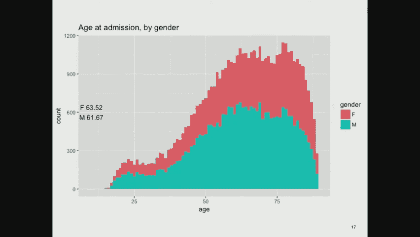

# MIT医疗机器学习中英文字幕 - P3：3. Deep Dive Into Clinical Data - 大佬的迷弟的粉丝 - BV1oa411c7eD

上次我们谈到医学的作用，今天我想深入研究一下医学数据，我要举个例子，模拟数据库中的很多东西，这是我们将在这门课上使用的数据库之一，你们中的一些人可能很熟悉，你们中的一些人不是。

我希望从这次讨论中可以吸取一些教训，例如，几年前，当《模仿III》即将上映时，我在玩数据，我在CareView中查看了心率的分布，数据库的一部分，对你们这些不知道的人来说是如此的模仿。

贝斯以色列女执事医疗中心重症监护室的入院情况，在大约十二年的时间里，我们遇到的技术困难之一是在这段时间的中间，医院从重症监护室使用的一个信息系统转移到另一个，Careview是旧的，元视觉是新的，当然。

它们并不完全兼容，所以我们会说我们会看到一些例子，所以这是旧数据，这是来自CareView的，你看着它说好，心率从，你知道，大概四两百，就可以了，但有一件有趣的事，有两个山峰，那么在哪里。

你是否在生理数据中看到过两个高峰，哈哈哈，所以我仔细看了看，我说，嗯哼，从这两个系统来看心率是什么样子的，如果你看CareView，你看我刚才给你看的照片，如果你看元视觉，你看到另一张照片了吗。

这看起来更像你通常所期望的，所以我坐在那里挠头，好的，这些肯定有区别，与医院的转换不是同时进行的，从一个信息系统到另一个信息系统，人的生理改变了，突然间，一些人的心率开始加快，对但如果你仔细想想。

哪一部分人的心率更快，所以我说，嗯哼，有趣，所以无论如何，如果你看看统计数据，你看Careview中的平均心率是108，平均心率和转位率是87，但当然手段没有那么有意义，当你观察这些双峰分布时。

所以我说好，如果我们只看成年人呢，所以我们观察年龄从一岁以上到九十岁的人，我一会儿就说一句，我看了看这两个分布，他们看起来很接近，他们看起来很相似，这意味着成年组中不同年龄的患者数量相似。

在两个数据集中，但如果我不排除非常年轻或非常年老的人，然后我看到这个有趣的分布，我已经抑制了，九十岁以上，但不是年轻人，您在CareView中看到的是，零岁时有一个巨大的尖峰，对呀。

所以在医院发生的事情是，在旧的系统下，它也被用于重症监护室，新生儿重症监护室，新系统没有在重症监护室使用，因此他们没有捕捉到婴儿的数据，对事实上如果你观察整个人口的年龄和心率，你看到两个非常奇怪的东西。

这是我们一直在谈论的成年人，这是婴儿，果然，他们的心率更高，然后这些是300岁的老人你会说哇，我不认为我会有一个心率，当我三百年的时候，那么那些人是谁，有人有线索吗，他们人太多了，是啊，是啊。

输入错误总是有可能的，但那里有相当多的数据点，是啊，是啊，我五个，差不多三百了，它并没有完全丢失数据，所以海帕，健康保险，可携带性和责任法案定义了一套关于保护个人健康信息的标准，你不允许做的事情之一。

是指定一个90岁或以上的人的年龄，原因是97岁的老人数量很少，所以如果我告诉你威利已经97岁了，那么你就可以相对容易地从种群中挑选出它们，所以禁止说，所以说，结果。

每个90岁或以上的人都被贴上了300岁的标签，在数据库中，这是神器对吧，就像回到我年轻的时候，我在加州大学洛杉矶分校的一个健康科学计算设施做计算机程序员，我们曾经有一个惯例，丢失的数据用999。9表示。

当然还有，如果你把它平均到一个真实的数据集，你得到垃圾，人们经常这样做，所以这个有问题，我们遇到了其中一个，如果你看看成年人，这两个系统实际上看起来很相似，所以蓝点和红点，我已经画出了它们之间的趋势线。

你可以看到他们很相似，所以看起来随着年龄的增长，你的心率下降得很轻微，但在两个数据集中，它的作用是相等的，是啊，是啊，在前面三百以上，就像那里，嗯，那是因为那里的年龄是计算出来的，在测量心率的时候。

所以如果他入院时你已经300岁了，如果你在医院住六个月，那么到测量的时候你已经三百五十岁了，所以这就是为什么在三百的右边有数据点，是啊，是啊，好的好的，好的，然后这就是婴儿的样子，当然。

他们的心率确实更高，这里是老人，所以实际上有310岁的人，因为也许他们出院了，然后在一百岁的时候他们回来了，你知道的，也许他们最初被录取时已经90岁了，十年后他们回来了，我们记录了更多关于他们的数据。

所以这都是相对于三百，好的，这只是一个例子，其中的教训是，当你查看数据时，要小心，因为它真的很容易愚弄你，因为有各种各样有趣的事情，它收集了关于这些人工制品的东西，像三百岁的病人等等，好的。

所以这里是我们可以获得的数据类型的目录，所以我们有一种典型的来自医院的电子健康记录数据，保险类型，语言，宗教，生活状况，家庭结构，地点，工作，等等，我们有生命体征，你的体重，你的身高，你的脉搏。

呼吸速率，体温，等，所以这些是典型的事情，如果你去医生的办公室，或者你去医院，护士会把你带到一边称你的体重，测量你的身高和血压，量体温之类的这些都是标准的生命体征，所以我们有很多记录，非处方药。

非法药物，如果你愿意不对你的医疗保健提供者撒谎，再次，我最早的日子之一，我和塔夫茨医疗中心的心脏病专家在一起，我们看到这位老太太看起来有点可怕，我们和她谈得很好，医生在和她说话，我尽量不碍事，他这样说。

你知道吗，你喝酒吗，她说，哦不，千万不要碰这些东西，然后我们再谈，我们走出病人的房间，医生在病人听不见的情况下转向我说，哦，她是个老酒鬼，我说好，你怎么知道，他说，嗯，从实验室测试，从她皮肤的外观来看。

从她的一般举止，从各种无法言喻的因素，所以病人撒谎，好的，他们真的有，因为他们不想告诉你事情，嗯好的，顺便说一句，药物是一件大事，所以有一个叫医疗娱乐的领域，药物调节，哪个是医院的办公室。

哪个是医生的办公室，试图弄清楚你实际上在服用什么药物，所以我是麻省理工学院健康计划的成员，如果我登录我的健康计划账户，它告诉我，我正在服用一些我十二年前得到的药丸，但我们是，你知道的，我吃了两片药。

据说会有一些生理作用，然后他们测量了，从那以后，我再也没吃过药，也没吃过一片，对我来说也不是特别好，但它仍然在我的记录中，它从来没有停止过的通知，这是一个真正的问题，因为如果你在照顾一个病人。

你想知道他们实际上在服用什么药物，很难知道，嗯，好的，然后实验室测试，这就是你想象中我们经常做的事情，这些是血液和尿液的成分，主要是，还有大便，唾液，脊髓液，从腹部取出的液体，关节液。

骨髓的东西从你的肺里出来，一切都好，任何你能生产一些的地方，一些标本，他们可以把它送到实验室，测量里面的东西，它们测量很多很多不同种类的东西，这些通常是有用的病理，任何身体组织的定性和定量检查，比如说。

活检样本或手术残渣，你知道的，如果他们做手术，他们从你身上切下了一些东西，通常会被放在病理学家的长椅上，然后他试图弄清楚它的特征是什么，这又是有用的信息，自从巴斯德，我们知道生物体会引起疾病。

所以我们很有兴趣知道什么生物体在你体内生长，通常测试不仅仅是为了识别生物体，还要弄清楚哪些抗生素，它既敏感又麻木不仁，所以你会看到像灵敏度测试报告这样的东西，在各种稀释下，换句话说。

他们试图给大剂量的抗生素，较弱的剂量，较弱的剂量，较弱的剂量，较弱的剂量，看看哪一个是最低水平的剂量，那足以杀死细菌，那里少了一个逗号，但是液体的输入输出是另一件重要的事情，因为人们，尤其是在医院里。

经常脱水或水分过多，这两个对你都没有好处，所以试图跟踪你体内的东西，从你身上出来的是什么，很重要，然后是成吨的音符，所以我们要看的一个重要的，这堂课是出院总结，这些是住院结束时写的典型的长纸条。

这是你进来的原因的总结，他们对你做了什么，他们发现的关于你的主要事情，然后计划出院后做什么，1。你打算到哪儿去？你要吃什么药，你什么时候回来跟进，等等，我会给你看一个令人痛苦的长，今天讲座后面的一个。

但我们也有主治医生的笔记，在居民下面，护士，各种专业，咨询人，转介医生，如果有人送你去医院，那个医生通常会写一张纸条，说这是我感兴趣的，这就是为什么我要把病人送进来，有给转诊医生的信，说好。

这就是我们发现的，这是问题的答案，你在问急诊科的记录，所以这通常是病人和医疗保健系统之间的第一次接触，所以这些都很重要，然后是成吨成吨的账单数据，它们是为了计费而设计的，所以。

我们捕获了大量关于描述病人状况的形式化方法的数据，对病人做了什么，为了提交正确的法案，你显然想要尽可能多的账单，但你必须能够证明你提交的账单是合理的，因为保险公司、医疗保险和医疗补助，我没有幽默感。

如果你为你无法证明的事情提交账单，那么你就会受到惩罚，然后是管理数据，比如你在使用哪个服务，所以这偶尔是一件令人困惑的事情，你可以进医院，有心脏问题，但事实证明心脏重症监护室，心脏重症监护室。

挤满了病人，但是肺部重症监护室有一张额外的床，所以他们把你关在那个单位里，但你还在做心脏病治疗，所以有这种混合物，你仍然要处理的案件，转移是指你在医院里从一个地方转移到另一个地方，成像数据。

所以我今天不打算谈那么多，但是有X射线，超声，核磁共振，PET扫描，视网膜扫描，内窥镜检查，像你的皮肤之类的照片，所以这都是成像数据，最近取得了巨大的进展，应用机器学习技术试图解释这些数据的内容。

所以这些也很重要，然后是整个量化的自我运动，我是说，你们中有多少人戴着活动跟踪器，只有大约三分之一，我对像麻省理工学院这样的地方感到惊讶，所以你知道我们测量台阶和海拔，改变和锻炼，你可以记录生命体征。

所有这些正念，心情，睡觉，疼痛，性活动，然后人们发展了一个实验N的想法，例如，几年前我有一个学生患有银屑病，这是皮肤病，问题是没有好的治疗方法，所以患有银屑病的人尝试各种各样的事情。

你知道他们有一段时间不吃坚果了，或者他们用醋浇自己，或者他们有，你知道无论你想到什么疯狂的事，我们没有一个好的理论来治疗这种疾病，但另一方面，有些事情对有些人有用，所以有一个完整的方法已经开发出来。

上面写着当你尝试这些东西时，表现得像个科学家有假设，好好记笔记，收集良好的数据，认识到像发作期这样的事情，你知道你可能要在自己身上滴一个星期的醋，在你看到任何效果之前，所以如果一天后它什么也没做。

不要停下来，而且如果你停下来，那就不要马上开始新的事情，因为你会对，这是不是你之前吃的东西的效果，或者你正在尝试的新事物，所以有各种各样的想法，好的，这是我们在模拟三号上的论文中的一张幻灯片。

它给你一个关于病人情况的概述，所以如果你看看这个，我要用我的手在上面指着这是非常重要的事情，这个病人以满码开始，这意味着如果他有什么不好的事情发生在他身上，他希望尽一切努力救他。

他最终只得到了舒适的措施，这意味着如果他有什么不好的事情发生在他身上，他想和家人一样死去，如果他失去知觉，对呀，关于这个人我们还知道些什么，嗯，GCS是格拉斯哥昏迷评分，这是一种量化人们意识水平的方法。

你可以看到，在一开始，这个病人是面向，然后就迷糊了，最后只是制造难以理解的单词或声音，他能服从命令，最后，只有当你刺激他的肌肉时，他才能弯曲，所以他不再清醒了，嗯高动作，呃，呃，他能自发地跟着你。

他能辨别方向说话。最终完全没有方向，所以这显然是一个迅速走下坡路的人，事实上在这一集结束时就死了，然后我们看实验室，这样我们就可以看到，他们的血小板水平是多少，大约在他们被测量的时候，他们的肌酐水平。

他们的白细胞计数，中性粒细胞百分比，等，这张幻灯片上没有所有可能的数据点，这只是说明性的，下一节是药物，他们在用万古霉素，这是一种抗生素，哌拉西林，我不知道那是什么，有人知道，氯化钠9。

这样可以保持它们的水分，体香酮和葡萄糖，所以右旋给了他一些能量，然后这些是各种测量，所以你看到心率，比如说，上升得很高，接近尾声，氧饱和度开始很好，但现在我们要做的是，你知道吗，百分之六十或百分之五十。

应该在92度以上，为了被认为是合理的，所以再一次，这是一个非常一致的画面，对这个特定的病人来说，事情变得非常糟糕，所以这是现在数据库中的所有数据，如果你想试着分析这些东西，你可以说好。

让我们看看数据库中最后一次实验室测量时的年龄，所以我们有所有实验室测量的时间，所以我们可以看到许多重症监护室的人都很老了，相对较少的年轻人，然后越来越多的老年人，无论是女性还是男性。

如果我们按性别看入学年龄，这是入学时的年龄，在最后一次实验室测量时没有年龄，这是一条非常相似的曲线，所以我们看到女性是64。02岁，上次测量时一次实验室测量，入学时63点5分。

所以我们可以看看人口统计人口统计通常包括这些因素，我之前反复提到过，如果我们对这和，比如说，年龄分布，我们看到，如果你看看不同的录取类型，所以你可以因紧急情况入院，为了一些紧急护理，或集体。

这似乎没有太大区别，至少在人口的手段上，年龄分布，另一方面，如果你看看保险类型，说谁买单，现在的年龄分布有很大的不同，你认为为什么私人保险在65岁左右下降了很多，保险总是为每一次州承保吗。

是因为医疗保险，所以医疗保险覆盖65岁的人，有一个可怕的故事，我得告诉你，我和保险公司的人谈过，有点愤世嫉俗，他说，假设你看到一个63岁的病人，谁患了二型糖尿病，你该为他做些什么。

对于患有2型糖尿病的人你应该做一些标准的事情，比如让他吃得更好，或者让他减肥，让他多运动，等等等等，但他愤世嫉俗的回答绝对是什么都没有，好的，为什么好，什么都不做是很便宜的。

大多数患2型糖尿病的人在接下来的两年里不会真正生病，当这个病人65岁的时候，他将是政府的责任，不是保险公司，所以说，当然啦，许多老年人都有医疗保险或医疗补助保险，并不奇怪，自付是一个相当小的数字。

因为支付自己的医疗保健费用贵得离谱，你从哪里来？你是从诊所转来的吗，或者你是急诊室，承认，或者你是从HMO或其他地方推荐的，而不是从熟练护理设施转移到设施内，在医院内，这没什么区别。

那里的平均值和分布看起来适度相似，如果你来自一个熟练的护理机构，如果你在一个熟练的护理机构，你可能老了，因为年轻人通常不需要熟练的护理，我不知道为什么在设施内转移的年龄要小得多，但从模拟数据来看。

这是真的，嗯，按语言划分的入学年龄是多少，所以有些人说英语，有些人说话不方便，有些人说西班牙语等，原来俄国人是最老的，对呀，这可能与移民模式有关，或者我不知道确切的原因，但这就是数据。

数据就是这么显示的，如果你按种族来做，事实证明，总的来说，非裔美国人比白人年轻一些，西班牙裔还有点年轻，比白人早，所以这是一个现在非常热门的话题，在关于偏见如何影响医疗保健的讨论中，是啊，是啊。

无法获得，只是意味着有人拒绝说出他们的种族，是啊，是啊，我想我不肯定，所以我想确认一下，这也代表了波士顿的人口动态，我也是，对呀，它是贝斯以色列女执事医院的集水区，很明显是波士顿，但是但是有，你知道的。

事实证明，像许多北岸的人一样，去马萨诸塞州综合医院，所以不同的医院有不同的集水区，这和喜欢有什么关系吗，这只是重症监护室吗，还是每个去急诊室的人，这些都是在某个时候在重症监护室的人。

所以这些是病情较重的病人，是啊，是啊，所以就这么多，我看到这里的黑人比例也很高，因为红色比其他的高，呃不实际上，呃，我不记得了，如果我有那个图表，我想这是累积的，好的，好的，所以大多数人都是白人。

对于我们使用的白色的任何定义，我想这只是你在上面看到的增量，所有的权利，婚姻状况如何？嗯，根据这个，单身不好，所以我可以看到住院治疗，我不知道为什么重症监护室是这样，因为如果你家里没有人照顾你。

当你生病的时候，你更有可能住进医院，这似乎是合理的，但我不知道你为什么会进重症监护室，是啊，是啊，那些不可能也像单身吗，人们可能比，那些可能更年轻，是呀，是啊，是啊，当然啦，是啊，是啊，那可能也是对的。

是的，好的，所以这里有一个有趣的问题，与你们在下一个习题集中看到的东西有一点关系，那么我们能仅仅从这些人口特征来预测医院死亡率吗，所以我在使用一个叫做R的语言工具，这是一个一般的线性模型。

我把它设置成基本上是逻辑回归，上面写着我在预测你是否会死在医院里，事实证明，唯一非常重要的是年龄，所以这并不奇怪，老年人比年轻人更有可能死亡，一般来说是真的，如果我无法获得你的种族。

或者我不知道你的种族，那你更有可能死，我不知道为什么会这样，其他事情没有那么重要，所以如果你说西班牙语或英语，你死的可能性稍微小一点，你在这里看到了一个负面的贡献，如果你说俄语，你死的可能性稍微小一点。

但重要的不是在顶峰，零五水平，但它在p等点，零六水平，嗯，婚姻似乎对预测没有太大影响，不管你是否会死，现在记住这是重症监护室的病人，我们正在研究医院死亡率，是啊，是啊，嗯，是为了毛茸茸的。

他们能在白天的任何时候了解到，或者刚开始的时候，还是你知道，因为，我不知道，我不知道，因为如果可能的话，无法获得意味着他们以前就死了，我们可以问他们不，因为不会有那么多人，我觉得。

没有多少人活过入学面试，他们确实问他们，除非他们发现情况不好，是啊，是啊，那就会，那将是一个例子，但我不认为你会看到足够多这样的人，嗯，所以我已经提到过了，从CareView转移到元视图有一个问题。

就在模拟数据库中，但当然这是一个更大的问题在全国和世界各地，因为每个医院都有自己的记录方式，如果我们有标准不是很好吗，当然还有一个有趣的短语，标准的奇妙之处在于有这么多可供选择的，例如。

如果你在模拟数据库中查看处方，这是对5号科目的两种特殊处方七一三九，入学时被录取，我是一，五，四，七，所以他们有相同的开始日期，但不同的结束日期，一个是泰诺对乙酰氨基酚的处方。

另一个是氯贝塔醇丙烷八点零，百分之五的奶油，那是润肤露，因为我想这是类固醇护肤霜，所以如果你查一下BI的数据库，他们有自己的私人处方代码，这个东西是一套三二五，这个东西是零点五摄氏度三十，如果你看。

还有一种叫做GSN的东西，这是一些商业编码系统的药物，可能与他们在医院的药物供应商有关，它们有不同的代码，有国家药品法规，这是FDA指派的，九位数代码，指定是谁制造了这种药物，它是什么形式的。

它的力量是什么，所以你得到了这些，然后有一个人类可读的描述说，泰诺有325毫克的药片，这种洛贝塔溶胶装在30克的管子里，剂量应该是三，两个，五到六百五十，我是一到两片，以毫克为单位。

这里的剂量是一个应用，不管那是什么，我不知道零点1是什么意思，这是一个平板电脑，那是一根管子，这是口服的，在皮肤上给药的，对呀，所以这是一个医生的本地数据库，他们只是收集包裹左右。

然后这都是在大多数医院，那倒是真的，现在，当模拟数据库开始被收集时，这不是真的，BI在走向这一点上相对较晚，与波士顿地区的其他一些医院相比，我是说每家医院都有自己的需求，为了它认为最重要的东西，然后呃。

我想BI只是没有优先考虑它，和其他一些医院一样多，好的，所以我说好，如果你看处方，他们多久给一次，请记住，我们有大约6万个重症监护室，所以渗透葡萄糖被给予八万七千次，给各种各样的人，氯化钠点9%冲洗。

你知道那是什么吗你做过静脉注射吗，所以周期性地，护士走过来，在静脉注射里喷了一点东西，确保它没有堵塞，就是这样，SW，我不知道盐水，我不知道是什么，SW是硫酸镁-葡萄糖五在水中，速尿是利尿剂。

氯化钾补充人们经常缺乏的钾，然后你去，所以说，为什么有这个D五W和那个D五W，这可能是系统中的一些数据，好的，他们中的一个有与之相关的MDC代码，另一个没有，但可能应该，是啊，是啊，哦，我真的问。

0是否意味着它们是所有医院的标准，或者只是我们没有数据，应该是全国的标准，因为这些是食品和药物管理局分配的代码，但不是每个医院都用，好的，对于那些说零的，我不知道为什么它们不与代码相关联。

在这家医院的数据库里，接下来最常见的是正常生理盐水，9%氯化钠，所以这和冲洗液是一样的，但这次不是用来冲水的，美托洛尔是一种受体阻滞剂，这是另一种胰岛素，这次用NDC代码等等，我喜欢袋子和小瓶，好的。

所以这些不完全是药物，袋子就像一个松松垮垮的，他们在里面放了一些东西，小瓶实际上是他们把药丸放进去的东西，为什么在数据库里，因为他们可以为此收费，好吧，我不知道收费是多少，但这并不让我惊讶。

如果你花五美元买一个塑料袋来装东西，好的，所以如果我们说好，这家医院每次入院有多少次药房订单，答案是很多，所以如果你看看，这是一个非常长尾的分布，大约有两千五百个，但是你看，如果我把数字放大到200。

有很多人都有两个，然后是相当下降的数字，用更多，然后它是一条很长的尾巴，所以你能想象，你知道吗，住院期间给你开的两千五百样东西，关于标准的更多信息，所以NDC可能是最好的编码系统，它是由FDA开发的。

上面的图片，右边显示前四位数字是所谓的标签器，那通常是生产的人，或者至少是分发它们的人，第二个四位数是药物的形式，所以不管是胶囊、药片、液体还是其他什么，和剂量，最后两位是包代码。

换算成包装中的总剂量对吧，所以这是天赐良机，所有的机器人，药店等依靠使用这类信息，如今，不幸的是，他们用完了四位数，所以现在有一个，他们加了一个额外的数字，但他们没有系统地这样做。

所以有时他们会在标签上加一个额外的数字，有时是产品代码，因此，旧代码和新代码之间的翻译是一场噩梦，你必须有一个代码字典才能正确地做到这一点，等等好吧，如果这还不够好，国际人用药品技术要求协调理事会。

开发了另一个叫做MEDA的编码系统，也用在各种地方，这是国际标准，也就是，当然啦，与NDC不兼容，一个常见的程序术语，我们稍后会讨论，他们有一个代码的子范围，也对应于药物给药。

所以这是另一种编码给药的方式，然后HCPCS是另一组代码，用于指定，你给某人吃了什么药，嗯，然后呃，我提到过这个GSN号码，显然贝丝·伊斯雷尔把它作为商业编码系统，来自一家名为第一数据库的公司。

这是一个试图制定标准的行业，但在这种情况下，他们正在生产与其他现有标准相当多余的标准，但由于历史原因或其他原因人们使用这些好的药物，那么对病人做了什么手术，如果你在模仿中寻找，有三张桌子，有程序。

icd，它有九个ICD代码，用于大约25万个程序，有大约50万的CPT事件，六十万，嗯，在CPT术语中编码的事件，然后转移两个系统中较新的一个，有大约25万个过程事件被编码在该系统中，所以一些例子。

以下是最常见的ICD九号程序代码，所以ICD九号代码三，八九十三，其中有一万四千例静脉导管没有在其他地方分类，什么是静脉导尿，当有人给你静脉注射时，好的，非常常见，你在他们问你名字之前出现在医院。

他们会在你的手臂上打静脉注射，那是收费的活动，我也是，你知道，如果你有这样的问题，他们把它粘在，把东西塞进你的喉咙里，浓缩营养物质的AL输注，所以如果你不能吃东西，然后他们通过胃管给你喂食，好的。

原来是这么回事，嗯，连续少于96小时的有创机械通气，所以这是在呼吸机上，那是为你呼吸，等等，所以你看到这些有一条很长的尾巴，这些是ICD九号代码，现在CPT有了自己的程序代码，这些代码包含了大量的细节。

例如，这是医学部分，它向你展示了你正在服用的药物种类，参与，然后是手术和放射代码，这些上面有很多很多的细节，是啊，是啊，那么他们怎么把这些代码写成一千到一千零二十二，像这样对任何人来说都很烦人不。

这些是类别，所以如果你往下钻，有一个，那棵树上有一个风扇，你可以得到单独的代码，就像一个讨厌的惊喜，cpt归美国医师学会所有，如果我给你看真正的代码，他们可能会起诉我，因为他们有版权，你得付钱给他们。

如果你，如果你使用这些代码，所以这很疯狂，嗯好吧，所以如果你看看每个入场的所有这些代码的数量，你会看到这样的分布，或者如果我把它们分开，你看到有更多的ICD九码和更少的CPT，和元视觉中的代码。

但它们的分布看起来有些相似，OK实验室测量，所以你把痰送出去，样本，血尿，你大脑的一部分，他们把它粘在黏糊糊的东西里，测量它的一些东西，那么他们测量得很好的是什么，结果发现红细胞压积是最常见的测量。

这是你血液中的血红蛋白含量，或者你血液中的什么部分，对病人很重要，第二个最重要的是钾和肌酸氯化钠，尿素，碳酸氢氮，等等，所以这是一长串不同的东西可以测量，所有这些东西都在数据库里，例如。

数据库里的二号病人，一九三八年七月十七日，这是去身份识别过程的一部分，很难弄清楚病人到底是谁，所以这里有几个有趣的事情需要注意，一个是有些东西有价值，有些东西没有价值，所以这是一个定性的测量。

所以它没有任何价值，只要标签的事实就能告诉你测试的结果是什么，另一件有趣的事情是最后一篇专栏文章，就是链接，我一会儿就说一句，实际上现在，所以Link是逻辑观察标识符，名称和代码。

它是由我们在印第安纳州里根礁诊所的同事开发的，大约十五年前，也许二十年前的这个时候，试图说，每种不同类型的实验室测试都应该有一个独特的名称，他们应该是等级森严的，这样如果你有，比如说。

三种不同的血清钾测量方法，他们是有血缘关系的，但他们彼此不同，因为在某些情况下，你从一种测量中得到的误差与另一种测量中得到的误差，都是不一样的，所以这是标准的方式，如果你把你的血样送到实验室。

他们把这样一根绳子送回医院，或者去你的医生办公室说，嗯，它是在这个OBX编码系统中编码的，这是链接代码，这是斯诺梅特的解释，所以这根弦是你医院的ehr的方式，或者你医生的办公室系统计算出测试的结果。

HL 7是一个30多岁的组织，一直致力于标准化的东西，像这样和链接是他们标准化的一部分，所以如果你看看这些，你又说好，每次入学测试多少次，一条巨大的长尾巴，对于极少数病人来说，最高可达15000英镑。

如果你看看每次入院的实验室测试，你可以做一个日志转换，得到一个看起来更合理的分布，顺便说一句，这是一个非常普遍的教训，当我们要对这些数据进行分析时，是不是经常做某种转换，就像在这种情况下。

日志需要一些看起来有趣的分布，把它变成看起来很正常的东西，这对我们使用的许多技术都更好，是啊，是啊，如此跨越，长代码的意思和是一样的吗，在一二处产生的物质，同样的是，是的，这就是创建标准的全部想法。

这很成功，相当成功地采用了，OK图表事件，所以这些是护士通常在床边进入的东西，所以有五点一，五点，在模拟数据库中测量的200万次心率，卡尔普雷夫耳是一个人工制品，它存在于每一个记录中，这是一些校准。

没有任何意义的东西，我一直搞不清楚到底是什么，spo 2是你血液中的氧分压，如果你用脉搏血氧仪，这就是它所测量的，呼吸频率，心律回到P型点点点点现在，你可能会对这里的心率感到困扰，对。

但我已经给你看过这个了，Careview中的心率和Metavision中的心率被编码在不同的代码下，在我们从这两个数据库中创建的联合系统中，所以你必须弄清楚什么是什么，如果你试图分析这些数据。

我们不仅在两个不同的数据集上有不同年龄分布的问题，但我们也有机械问题会有相同标签的东西，它可能代表也可能不代表系统中不同时间的相同测量，这是在对数刻度上每次入场的图表条目数，所以你看到大约有10到3点。

五个，每次入场的图表条目，所以你知道，每次接纳数以千计的图表事件，我们还跟踪输出，导尿管可以让你的膀胱引流，你没有有意识地去洗手间，所以他们收集这些信息，有一点，九百万个关于你膀胱流出多少液体的录音。

你胸口的东西，如果你有拥堵，尿液是如果你经常尿尿，排便，等等，一次又一次，我不确定我是否明白，尿出福利对福利，它们可能是一回事，但一个来自CareView，一个来自元视觉，所以再一次，典型的问题。

如果你看看每次录取的输出事件的数量，你看到的大约是一百个，大概，如果你在跟踪输出，您还应该跟踪输入，他们也是如此，所以葡萄糖在水中是5W，百分之零点九，生理盐水，异丙酚是一种麻醉剂，胰岛素，肝素。

血液稀释剂，等等，如果我没记错的话，所以这些是给人们的各种各样的东西，它们影响人的体积，所以这是为了让人保持平衡并跟踪那个元视觉，输入的分类有些不同，但他们有相似的数据，如果你把它们结合起来。

你又得到了一个对数刻度的分布，这表明有大约10到5个输入事件，所以相当多的输入事件，因为这是定期记录的，现在，那个纸，我是的，输入是什么，就像，当你走进医院，我承认，或者没有，不不不，它是。

它是对你的输入，就像你喝了一杯水，护士应该录下来，虽然她并不总是因为她可能没有注意到，但如果他们挂一个静脉注射袋，给你倒一升液体，他们确实记录了，所以我让你读了这篇有趣的论文，在那份文件之前的讨论。

因为其中一个作者是我以前的学生，我很了解其中一个人，和以前的学生，扎克·科哈纳几年前从加利福尼亚的一个会议上回来，向我解释他遇到了一个风险投资家，他发现了一种有趣的生理变化。

在夜间进行的实验室测试的异常中，他怀疑有一个日变化，实验室测试实际上在晚上比白天更不正常，和扎克，他不仅是计算机科学博士，也是执业医生，转向他说你是个白痴，凌晨三点抽血，通常不是健康人对吧。

这是另一个令人困惑的故事，如果你在半夜做测试，这可能表明你的病情加重了，所以他和格里芬招募了他们的第三作者，并对这个问题进行了大规模的研究，这就是我让你读的报纸上的报道，所以我说，嗯。

我想知道我是否能在模拟数据库中复制这项研究，如果你抱有希望，答案是否定的，在很大程度上，因为我们没有正确的数据，所以在模拟数据库中测量的白细胞计数并不多，比如说，如果你看看，这是模拟数据。

如果你说每小时异常白细胞计数值的比例是多少，所以这是午夜到午夜，每小时都有一部分测试结果是不正常的，果然你看到的是在早上5点，他们中更高的比例是不正常的，然后在下午三点，这与扎克的。

关于那家伙是个白痴的专横评论，所以我再一次说，嗯，我们能建立一个非常简单的模型吗，预测谁会死在医院里，在这种情况下，这是最容易预测的，因为我有数据，我们可以得到三年的生存数据，这就是他们在看的。

但这更难，它遇到了审查问题，如果该人在我们的数据收集期结束前不到三年住院，等等，所以我避免了，但这向你展示的是，每小时零到二四，什么是，在每一个小时里，号码是多少，这些测量中异常的比例是多少，所以我说。

嗯，让我们把它扔进一个逻辑回归模型，出来的东西真的很奇怪，那就是几个特定的小时是重要的，但大多数都不是，在我看来，这像是噪音，在早上八点，你有一些有分寸的东西这一事实很重要，但是在早上九点。

这似乎不太明智，所以我不认为这里有足够的信号，事实上，当我在晚上观察白细胞计数的数量时，与死亡率有关的问题，所以虚假意味着人们活着，真正的意思是他们死了，但你会看到，在分布之间没有太大的差异。

但你也可以看到在这个数据库中白细胞计数的数量相对较少，所以我认为我们没有足够的数据来做这件事，另一方面，如果你看一组不同的药物，你看血液的平均值，尿，氮气或氯化钙，Co two等。

你会看到随着时间的推移会有变化，所以有某种差异，这要么是由人体的日生理学引起的，或者通过常规的医学实践，关于人们何时选择进行实验室测量，事实上，如果你看看高端的比例，实验室值低，它们确实因小时而异。

尤其是如果你看白细胞计数，你会看到高值的比例在晚上上升，低值的比例在晚上下降，这也与他们看到的一致，有另一种方法来测量它，也就是不使用正常范围，实验室实际上会给你一个电话，说这个值正常吗，低或高。

我们可以利用这一点，这一点更微妙，因为这取决于设备的校准，并随着校准的变化而更新，所以这可能更准确一点，但你在这里看到了本质上相同的现象，但是如果你看看测量完成时的分布，原来是正常的。

当它们被证明是不正常的时候，的正常曲线和异常曲线之间有很多相似之处，当进行这些测量时，所以我们没有看到，好的，让我跑到最后，这是我手表上的心跳，你可以下载这些东西，并把它放在你最喜欢的分析引擎中。

看一下，所以我在这里跑过哈佛桥，如果你看我30秒的心率变化，所以你可以看到中间的节拍间隔从大约550，到六百三十个左右，六百或者二十毫秒，所以你可以计算我的心率变异性，这被认为是心脏健康的指标。

以此类推你可以计算出我以大约100英里的速度跑步，我的心脏以每分钟100次的速度跳动，所以你知道现在有各种各样的信息，正如我所说的，我今天不打算讨论这个问题，但这是最近发表的一篇非常成功的论文。

在那里他们可以看到肺部的图像，这是肺部的横向扫描，他们有一个深度学习机器能够识别这两个黄色标记的东西，肺包膜，而不是这些其他东西，只是组织中的随机斑点，我不能靠眼睛看，也许一个好的放射科医生可以。

但报纸上声称这优于体面的放射科医生，已经，这是杰夫·辛顿的文章之一，做出这个相当愚蠢的声明，告诉你的孩子不要成为放射科医生，因为当他们得到充分训练时，这个职业就结束了，我不相信他们会做不同的事情。

但他们不会离开，嗯，这是布里格姆的罗恩·凯尼斯的幻灯片，他们正在使用自动分析白质的技术，为了识别狼疮病变，狼疮是一种严重的疾病出现在这些磁共振图像中，在某些方面，今天我想谈的最后一件事是笔记。

所以我的学生上学期做了一点练习，我们试图看看普通猿类有多好，我预测死亡率的研究小组成员，所以我们从模拟数据集中取了一堆案例，对这个人是生是死的问题视而不见，我们用一种可视化工具把数据给人们。

有点像我之前给你看的那个，总结了这个案例，然后也让人们可以接触到笔记，关于这些案件的已确定的说明，看看人们是否能比掷硬币更好地预测，不管某人是生是死，答案是肯定的，稍微好一点，也好不到哪里去。

但稍微好一点，此外，通过给他们反馈，所以当他们看这些案子的时候，并试图做出预测，他们做出预测，你告诉他们，如果他们是对是错，我们学习，所以我们得到的比随机的稍微好一点，对呀，挺有意思的，好的。

所以我发现的一件事是，至少当我在这个练习中扮演猴子的时候，我发现这些笔记非常有用，比实验室数据的趋势线有用得多，部分是因为我习惯了读英语，我不太习惯阅读实验室数据的图表，但部分原因是人类的理解水平。

在护理笔记中，在出院总结中，等等，你不能仅仅从原始数据中得到，所以我们要讨论的是，我们如何利用这些信息，把它抽出来，并将其用于我们想要在模仿中做的各种建模中，如果你看，我们有护理笔记和放射学报告。

以及更多护理笔记和心电图报告，和医生记录及出院摘要，如果你看看这些长度的分布，不幸的是，这些规模不一样，但出院摘要是当时写的东西，你离开医院，这是你住院期间发生的一切的总结，而且很长，所以你知道。

它上升到三万个字符，你知道要小，这是一个短篇小说，不要那么短，短篇小说，护理笔记往往较短，它们最多有三千个字符，另一套护理笔记，我认为来自另一个系统的时间有点长，它上升到大约五千，医生的笔记有点长。

但它们通常会上升到一万一万五千个字符，还有各种各样的音符，所以我只是想给你看一些这些，这里有一个简短的护理说明，所以这是一个低血压的病人，但不震惊，病人仍在点滴这种药物，每分钟每公斤75微克。

此时不需要滴定，他们的血压很稳定，一百多，平均动脉压是65，大于六十五，让他们戒掉这种药，如果它能忍受伤口感染，腹股沟前区开放渗出，适量粉红色浆液，病人大便，少量大便在某物上，危险地靠近开放性伤口。

等等，这是护士的快照，她刚进去，顺便看了病人，我说她，但你知道，波士顿地区医院的绝大多数护士可能都是女性，但是有一些男护士，并将记录病人的情况，有什么问题，原则上，这会很有用的，不仅作为病历的一部分。

而且当这个护士下班的时候，下一个护士来轮班，那么这是病人状态的记录，护士最后一次见到他们，事实上，护士们倾向于口头告诉对方，而不是依赖书面版本，我记得有一次和重症监护室的护士聊天。

在这个国家的另一个地方，我说谁读了你的笔记，所以医院有人负责评估护理质量，当有诉讼时，他们会给律师，她很高兴，因为她通过仔细记录为医院节省了一千万美元，对一个病人做了一些手术，结果很糟糕。

并起诉医院忽视了他们没有这样做，而是因为它在纸条上证明了它实际上是这样做的，因此医院没有责任，所以说，但现在这里有很多信息，我要给你们看很多页典型的退伍总结，这是一个手术服务的人进来抱怨腿痛，红肿。

继发于左股骨弹出感染，小旁路，所以她做了手术，我想是女性，她做了手术，愈合得不好，所以主要的外科手术或侵入性手术，切开引流和脉搏，左腹股沟及左膝以上黄体部位冲洗，旁路探查切口，整个左侧移植物和切除。

公共股动脉到膝盖以上之类的，废话，废话，废话废话，这就是他们所做的目前疾病的病史，她是一名四五岁的妇女，接受了左股骨AK手术，医生或其他患有PTFE的人，不管那是一个多月前的某个日期，顺便说一句。

这些带星号的东西是我们去掉的，从记录中识别信息，她手术后一直做得很好，在发病前六天在诊所就诊，在这个时候，她突然感到恶心，呕吐，发烧和渐进性红肿，肿胀，她左大腿痛，等等，所以这只是佩奇，许多页中的一页。

是啊，是啊，问题是这完全是，此信息字段，没有帮助，没有自动完成，如果你输入病人的名字，在这个系统中，有很多人，亨利，湿气，马萨诸塞州将军花了十年时间建立了一个具有自动完成等功能的系统，一些医生喜欢它。

一些医生讨厌它，Mgh扔掉了他们所有的旧系统，为了购买史诗，就这样消失了，就像十年的努力付诸东流，但这并不是一个惊人的成功，因为每当你有自动完成，你必须预测每一个可能的答案，人们很有创造力。

他们总是想打一些你没有预料到的东西，所以很难支撑，什么是史诗，史诗，是一家大公司，它赢得了最近所有安装电子病历系统的竞赛，还记得我上一节课吗，我展示了我们达到了100%的饱和度。

所以他们赢得了很多安装交易，他们得到了很多补贴，我听说的估计是合作伙伴医疗保健，也就是MGH，布里格姆，和其他几家医院，安装系统花费了大约20亿，所以这包括所有的定制和所有的培训。

以及随之而来的所有行政工作，但那是一大笔钱，好的，所以我们有过去的病史，一天一包，但她说她六个月前停止了哮喘，第二类，糖尿病，这些是体检结果，所以它给了你很多关于这个人的信息。

底部缠绕的描述相关的实验室结果，所以这些是从实验室的桌子上复制出来的，是啊，是啊，药物结果，对不起，再核对一下药检结果，向后两张幻灯片，是的，它是，上面有21世纪90年代的假日期，是啊，是啊。

所以21年有一个阳性测试的事实，87意味着一年前，是啊，是啊，是啊，是啊，这里的去识别技术维护相对日期，但不是绝对日期，所以这些结果再次从实验室数据库中复制到出院摘要中，简短的医院课程。

然后对系统进行审查，发生什么事了？神经心血管肺胃肠道等，um传染病，内分泌血液学，预防，在出院时，病人情况很好，无发热，生命体征稳定，忍受有规律的饮食，走动的，走动的，在没有帮助的情况下排尿。

疼痛得到了很好的控制，入院时的药物，所以这是药物和解，出院药物，这就是她被送回家的原因，出院后的处置是到家里进行一些后续服务，她要回家了，出院诊断是感染了，左股骨腘旁路，移植物与病情。

这些是给病人的指示，你知道吗，以下是你在这里可以做的，如果出了什么问题，你应该什么时候回来告诉我们，等等，嗯，这是你应该报告的，如果发生了，呃，你知道的，如果你突然严重出血或肿胀，这样做，与医生跟进。

某人或其他人打这个号码给他的诊所预约，然后和医生随访，两周后有人，嗯，我想这是同一件，所以关于标准的最后几句话，你在大卫的介绍性讲座中看到了，奥德赛的参考，这是编码我们所说的数据的标准方法，今天。

模拟数据库的下一个版本有可能，将采用奥德赛格式，而不是，呃，大卫在摇头，想知道为什么我，我也是，我们显然还没有很好地处理临床笔记，嗯，所以你知道总是会发生什么，你是说我将采用带有以下扩展的标准星号。

这可能就是将要发生的事情，但这意味着中央桌子，你知道的，ICD九码表，和表，像这样的事情很可能会结束，采用奥德赛数据库的格式，你也应该知道这个叫Fire FR的东西，快速健康互操作性资源，所以说，七个。

是标准组织，在20世纪90年代初取得了巨大的成功，在解决，如何允许实验室向医院报告实验室数据的问题，或者订购实验室的诊所，上面有向上箭头和竖线的字符串等等，我之前给你看的，里面有链接编码。

那个标准叫做HL 7版本2吗，它仍在广泛使用，然后他们变得雄心勃勃，患上了第二系统综合症，他们决定建造HL 7版本三，十年前我在这里的一个班教过，我的一个朋友在一家帮助医院的公司工作。

给我一个三分的工具，八兆字节的PDF文件，描述您需要了解的内容，为了实施该制度，结果没有人做这件事，所以火是对它的粗略简化，说如果医生把一个新病人介绍给你，您需要知道的最小数据集是什么，为了照顾那个人。

Fire试图提供所有数据的子集，它已经成为一种标准，主要是因为国会花了四年时间，20亿美元左右贿赂人们购买这些信息系统，他们很生气，因为他们买的信息系统不能相互交谈，所以他们在地毯上喊道。

这些IT公司的负责人，健康IT公司，他们对他们大喊大叫，他们让他们承诺会有互操作性，他们承诺，火从里面冒出来，或者它可能是同时开发的，但他们采用了它，所以现在原则上，不同医院之间交换数据是可能的。

至少达到数据统一的程度，在现实中，公司不希望你那样做，因为他们喜欢那里，不能把你所有的数据带到不同的医院，因为它更有可能把你留在你所在的地方，社会经济问题，但至少标准是存在的。

并且正在得到越来越广泛的部署，只要国会注意，它很丑，这是病人的样子，对呀，这是通常不可读的XML垃圾，但幸运的是，有解析器可以将其转换为JSON，和更简单的表示，所以这很常见，所以存在的术语是和NDC。

i，我今天没有谈到的九个和十个雪人，DSM 5是精神病医生的诊断和统计手册，这是描述精神疾病的常用编码方法，还有更多这样的，有一种叫做统一医学语言系统的东西，来自国家医学图书馆的Methesaurus。

它集成了大约180个不同的术语，所以有一个很好的一站式商店，在那里你可以从他们那里得到所有这些东西，所以外卖课，了解你的数据，还记得心率一次又一次上升的第一个例子吗，对你不了解的数据进行机器学习和分析。

很可能导致错误的结论，统一是困难和耗时的，有很多事情我们没有标准，所以每个人都发展自己的表现。

大约十年前我有一个博士生，他在论文中写道，他花了大约一半的时间清理数据，我把这篇论文给了另一个几年后开始的学生，谁读了，他带着敬畏的神情向我走来，他说他只花了一半的时间打扫，不幸的是。

这大致就是我们在这个领域的位置，很抱歉让人沮丧，但这是目前的技术水平，下次大卫会从看，用这些数据建立一些模型，并向你展示，我们可以完成所有的权利。

