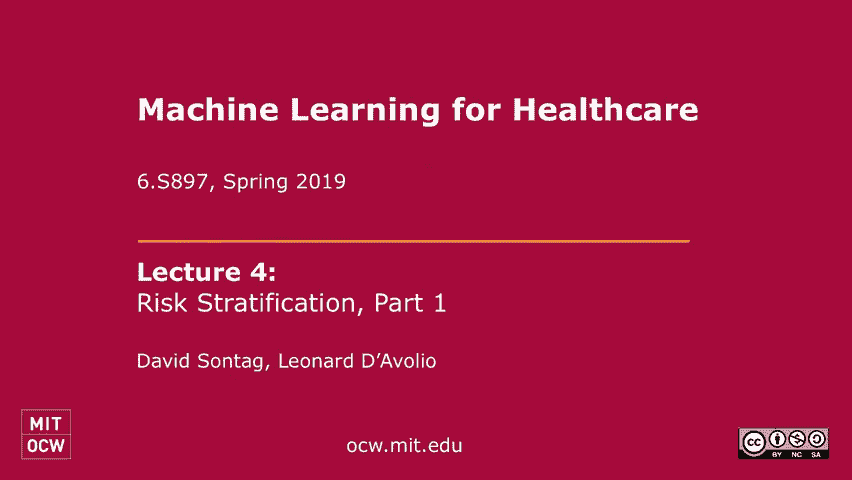
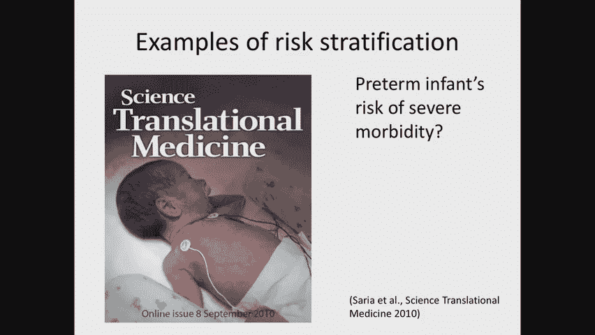

# MIT医疗机器学习中英文字幕 - P4：4. Risk Stratification, Part 1 - 大佬的迷弟的粉丝 - BV1oa411c7eD

今天我们将讨论风险分层，在给你一个关于我所说的风险分层的广泛概述之后，我要给你们一个案例研究，你在阅读中读到过，今天的讲座，来自二型糖尿病的早期发现，我也不会，当然，重复你在阅读中听到的相同的材料。

相反，我会给周围一些有趣的颜色，作为机器学习的人，我们需要思考哪些问题，当我们试图将机器学习应用于这样的问题时，然后我将谈谈一些微妙之处，机器学习会出什么问题，基于风险分级的方法，最后。

今天演讲的后半部分将是一个讨论，下午三点左右，你会看到一个男人走进门，他叫伦纳德·德沃利奥，他是布里格姆妇女医院的教授，他还有一家名为Sift的创业公司，它现在正在应用风险分层，他们有很多客户。

他们对如何让这些东西发挥作用的细节非常深入，所以我们将在我和他之间进行一次采访，我们也将有机会让你们所有人提出问题，我想这就是我所希望的，今天讲座中最激动人心的部分，然后超越今天的讲座。

我们现在正处于一系列三节课的开始，这些课的主题非常相似，下周四我们将讨论生存模特，你可以把它看作是今天讲座的延伸，讨论如果数据有定心，应该怎么做，我很快就会给你定义的，虽然今天的讲座会更高水平一点。

下星期四的课是我们要讲的内容，真正开始进入数学细节，关于如何用删失数据解决机器学习问题，接下来的课程是关于生理数据的，这个讲座也将更具技术性，那么什么是高水平的风险分层。

你认为风险分层是吸收病人群体的一种方式，把你所有的病人分成两个或更多的类别，高危患者，低风险患者，也许病人在中间的某个地方，现在，我们可能想做风险分层的原因是，因为我们通常想尝试根据这些预测采取行动。

所以目标通常是将这些预测与已知的干预措施相结合，所以说，比如说，高危人群中的患者，我们会试着为这些病人做些什么来防止任何他们感兴趣的结果，防止发生，现在危险分层与诊断有很大不同，诊断经常有非常嗯。

非常严格的业绩标准，如果你误诊了可能会产生非常严重的后果，就接受治疗的病人而言，他们不需要治疗的情况，病人死亡是因为他们，现在风险分层，你认为本质上更模糊一点。

我们想尽我们最大的努力把病人推到这些类别中的每一个，高风险，低风险，等等，正如我将在今天的讲座中向你们展示的那样，我们通常关心的性能特征会有点不同，我们要多看一点，在正预测值等数量上。

我们是否发现了我们所说的高风险患者，他们中的哪一部分实际上是高风险的，在这方面，它与诊断有点不同，也是因为目标不同，在风险分层中使用的数据往往非常不同，我们经常使用非常多样化的数据，嗯。

所以你可能会带来一个病人的多个视图，您可以使用辅助数据，例如病人的人口统计，甚至可能是病人的社会经济信息，所有这些都极大地影响了他们的风险状况，但不得用于对病人的无偏见诊断。

风险分层在很大程度上是为了降低美国医疗保健环境的成本，所以我会给你们几个风险分层的例子，其中一些以成本为主要目标，其他没有的，第一个例子，是预测婴儿患严重疾病的风险，这是早产儿，我的侄女，比如说。

早产三个月，对我妹妹和我全家来说都很可怕，早产患者的结局在过去的几年里发生了巨大的变化，在上个世纪，现在早产三个月的病人，就像我的侄女一样可以活下来并且在长期结果方面做得很好，但在许多不同的发明中。

这些发明导致了这些改善的结果，他们中的一个非常了解一个特定的婴儿可能有多危险，所以一个用来描述风险的非常常见的分数，早产儿，一般来说，被称为阿普加分数，例如，当我儿子出生的时候，我真的很兴奋。

当我儿子出生几秒钟后，护士拿出一张纸，计算阿普加评分，就像，哦，我研究得很有趣，对呀，然后我又回到了我必须做的其他事情上，但这个分数实际上并不像它可能的那样准确，我们将讨论这篇论文。

实际上在一周半的时间里，是约翰大学的教授，霍普金斯，它研究了如何使用基于机器学习的方法，真正提高我们预测婴儿发病率的能力，我从今天的读数中提取的另一个例子，今天的讲座，与入院的病人有关。

对于带着心脏来到急诊科的病人来说，患有心脏相关疾病，试着理解，他们需要住进冠状动脉吗，还是让病人回家由他们的主治医生管理，或者他们在医院外的心脏病专家，那张纸你们可能都注意到了那是1984年的对吧。

所以这不是一个新概念，而且，如果你看看他们在这项研究中使用的数据量，有两千多个病人，它们有大量的变量，50多个变量，他们使用了一种非平凡的机器学习算法，他们使用了逻辑回归，内置了特征选择。

以防止自己过度拟合数据，目标是以成本为导向的，所以前提是如果一个人能很快决定，这些刚来急诊室的病人风险并不高，我们可以送他们回家，然后呢，我们将能够大幅度降低成本。与那些进入冠状动脉监护室的人有关。

我现在要举的最后一个例子，是预测再住院的可能性，所以这在美国引起了很大的关注，过去几年的医疗保健空间，因为美国政府对医院实施的处罚，他们有大量出院的病人，然后在接下来的30天内重新入院。

这是向基于价值的护理过渡的一部分，皮特在以前的讲座中提到过，所以前提是有很多病人住院，但在出院时或出院后没有得到适当管理，比如说，也许这个有心脏病的病人，我真的不清楚他们回家后应该做什么，比如说。

他们应该服用什么药物，他们应该什么时候去看心脏病专家，他们应该注意哪些警告信号，他们应该回到医院或者打电话给他们的医生，由于沟通不畅，据推测，这些糟糕的结果可能会发生。

所以如果我们能找出哪些病人可能会再次入院，然后我们可以改变方式，如果我们能做到这一点，如果我们能预测当病人还在医院的时候，然后我们可以改变放电的方式，比如说，我们可以发送。

我们可以派一个护士或社会工作者去和病人谈谈，慢慢地通过出院说明，可能在病人出院后，在接下来的几周里，可以让护士在病人家里随访，通过这种方式，希望减少重新接纳的可能性，所以在高水平上，有旧的对新的。

这将是一个真正的讨论，在今天剩下的课程中，自从1984年的那篇文章以来发生了什么变化，你在今天的阅读中读到了，嗯，传统的风险分层方法是基于评分系统，几分钟前我跟你说过，Apgar评分系统如图所示。

对于这些不同的标准，你会说，活动脉冲，鬼脸，外观，呼吸，你看着孩子，你说好，没有活动，或者他们很活跃，运动，外表可能是苍白或蓝色的，这将得到零分或完全粉红色对两个点，对于这些答案中的每一个。

你把相应的点相加，所以你得到的总分，你看这里，你说，好的，嗯，如果你有零到三个点，工资有风险，那是有严重风险的，如果他们有7到10分，然后页面然后婴儿是低风险的。

有数百种这样的评分规则这些规则都是通过研究非常仔细地推导出来的，和你今天读到的没有什么不同，实际上在今天的医疗保健系统中被广泛使用，在过去的五年和十年里，时代发生了相当迅速的变化。

现在大多数行业正在走向机器学习，基于方法，可以处理更高维的特征集，并解决这些早期方法的一些关键挑战，这也许是最重要的方面，它们可以更容易地适应临床工作流，所以我之前给你看的分数通常是手工完成的。

所以一个人必须考虑做配乐，人们必须弄清楚相应的输入是什么，结果往往不是你，它们没有像应该的那样频繁地被使用，新的机器学习方法可以获得更高的精度，可能是因为他们能够使用比传统方法更多的功能，最后。

他们可以更快地驾驶，所以所有传统的评分系统都有很长的研发过程，导致他们被采纳，首先你收集数据，然后你建立模型，然后你发送检查模型，然后你在一家医院做评估，然后你在很多医院做一个透视评估。

现在每一步都需要很多时间，通过这些基于机器学习的方法，它增加了一个研究助理坐在医院里的可能性，或者在计算机科学系，说哦，我认为推导出，导出这道题的分数，你收集可用的数据，你应用你的机器学习算法，即使。

或者很少发生的结果，如果您可以访问足够大的数据集，你将能够得到足够的样本来实际预测，非常狭窄的结果，因此，它真的打开了重新思考，可以使用风险分层的方式，但结果也带来了新的危险。

我们将在今天的课上讨论其中的一些，我们将在下周四的课上继续讨论这些，所以这些模型正在被广泛商业化，这里只是许多公司中的一个例子，这些公司正在构建风险分层工具，这是Optum的。

我在这里向你们展示的是他们的一个模型的输出，它预测与鳕鱼相关的住院率，所以你会看到它，这是一个人口级别的视图，所以对于医院感兴趣的所有病人，他们会用其中一个分数给病人打分，我之前给你看过了，手动的。

或者是基于机器学习的模型，它们将被归入这些不同的类别中的一个，取决于风险水平，然后可以挖得更深，例如，你可以点击其中一个桶，试着看看，谁是风险最高的病人，对这些病人的健康有哪些潜在的影响。

我给你看一个稍微不同的问题，预测高危糖尿病患者，你看，对于每个病人，我们列出了1C测试的数量，最后一次A一C测试的值，数据被执行，这样你就可以注意到，哦嗯，这个病人患糖尿病的风险很高，但是你看。

他们没有跟踪他们的A C，他们患有未控制的糖尿病，也许我们需要把他们送进诊所，去验血，看看他们是否需要改变药物等等，所以通过这种方式，我们可以对患者群体进行分层，并思考可以为他们中的这一子集做的干预。

所以我现在要进入一个早期发现2型糖尿病的案例研究，那个，这个问题之所以重要，是因为据估计有二十个，美国未确诊的2型糖尿病患者的5%，这个数字和国际上许多其他国家一样大。

所以如果我们能找到目前患有糖尿病的患者，或者将来有可能患糖尿病，然后我们可以尝试影响他们，所以说，比如说，我们可以开发新的干预措施，可以防止这些患者在糖尿病进展中恶化，比如说。

减肥计划或让患者接受二甲双胍等一线糖尿病治疗，我今天要讲的关键问题是，你如何发现高危人群，所以传统的方法和阿普加评分很相似，根据这里的分数，这是芬兰使用的评分系统，它提出了一系列的问题。

并与每个答案相关联，病人的年龄是多少？他们的体重指数是多少？他们吃蔬菜吗，水果，他们有没有，抗高血压，高血压药物等，你得到最后的分数，低于七分之一的人患糖尿病的风险，二型糖尿病高于二十岁是非常高的风险。

在接下来的十年里，每两个人中就有一个人会患上二型糖尿病，但正如我提到的，这些分数并没有产生我们所希望的影响，和，原因真的是因为它们还没有真正被使用过，几乎和他们应该的一样多，所以我们要考虑的是。

我们能改变风险分层的方式吗，而不是必须是什么，当你想做的时候，这是手动做的，我们现在就可以，全人口，我们可以，比如说，从健康保险公司获得的数据，使用机器学习，也许我们无法访问我之前给你展示的所有功能。

就像，也许我们不知道病人的体重，但我们将在我们所做的数据上使用机器学习，我们必须努力寻找那些我们没有的东西的其他替代品，这可能预测糖尿病风险，然后我们可以在幕后自动地为数百万不同的病人应用它。

寻找高危人群并对这些患者进行干预，顺便说一句，我今天要讲的工作是，在过去的几年里，我实验室的研究中真正产生的工作，所以这是一个回到涉众集的示例，我们在第一节课中谈到的。

这是在付款人级别进行风险分层的一个例子，所以用于这个问题的数据是管理数据，你通常在健康保险公司找到的数据，所以我在这里给你看，一个病人的时间表，以及您希望在不同时间内为该患者提供的数据类型，你穿红衣服。

它显示了他们的资格记录，你知道他们什么时候参加了健康保险，这真的很重要，因为如果他们在某个月没有参加健康保险，那么缺乏那个病人的数据并不是因为什么都没发生，这是因为我们只是没有看到它，它不见了绿色。

我在看医疗索赔，与皮特上周谈到的诊断代码有关，程序代码，CPT代码，我们知道专家是什么，病人去看，就像心脏病专家，初级保健医生，等等，我们知道服务是在哪里进行的，我们知道它是什么时候表演的。

然后从药房我们可以获得左上角所示的药物记录，在上面我们知道医生开了什么药，我们有一个它编码到NDC代码，国家药物法规，皮特上周二又谈到了那件事，我们知道天数，药物供应，仍然可用的笔芯数量等等。

我们现在终于可以进行实验室测试了，传统上健康保险公司只知道进行了什么测试，因为他们必须为进行测试付费，但是越来越多的健康保险公司正在与，像Quest和LabCorps这样的公司实际上获得了访问。

也对那些实验室测试的结果，在我今天要告诉你们的数据集中，我们实际上也有实验室测试结果，那么这些因素对这个群体来说是什么，这个人口来自费城，哎呀这么，如果我们看看顶级诊断代码，比如说。

我们将看到十三万五千个有实验室数据的病人，有超过四十万种不同的高血压诊断代码，你会注意到这比人数还要多，那是因为它们在时间上发生了多次，你会注意到这里实际上有很多有趣的细节，即使在诊断代码中。

你会发现听起来更像是疲劳之类的症状，在这边，或者你看，哦，你有许多情况下的程序记录，就像他们接种了流感疫苗，这里有另一个例子，这只是告诉你一些关于这个群体中实验室任务的广泛统计数据。

肝酶都是最受欢迎的实验室测试，这并不奇怪，因为通常有一个叫做CBC面板的面板，这就是你在年度体检中会得到的，它有许多顶级的实验室测试结果，但当你往下看尾巴的时候。

还有许多其他实验室测试结果在性质上更专业，比如说，血红蛋白a，用于跟踪大约三个月的平均血糖，并用于了解患者的糖尿病状况，这只是为了让你了解幕后的数据是什么，现在让我们想想我们如何真正派生，我们如何解决。

我们如何将这个风险分层问题表述为机器学习问题，好今天，我将给你一个如何把它表述为机器学习问题的例子，但在周二的讲座中，我会告诉你其他几种方法，这里我们要考虑二进制分类的简化，我们要问，我们要回到过去。

我们要假装现在是1月1日，两千零九年，我们要说，假设我们在每个病人身上运行了这个风险分层算法，一月一日，两千零九年，我们将从过去的数据中构造特征，所以这几年，但我们要预测一些关于未来的事情。

你可以尝试预测未来的许多事情，我在这里向你们展示三种不同的预测任务，对应不同的缝隙，0年的差距，一年的间隔，和两年的间隔，对于其中的每一个，它问，在那个预测窗口里，病人会新发展成二型糖尿病吗，例如。

对于这个预测任务，我们将排除患有二型糖尿病的患者，在2000年到2009年到2011年之间，我们只会被认为是积极的，2000年至2011年间新诊断为二型糖尿病的患者，和二千零一十三，和。

你可能想在模型中包括一个缺口的原因之一是因为通常，有标签泄漏，通常情况下，临床医生可能有一个非常好的想法，病人可能是糖尿病患者，但它还没有以我们的算法可以提取的方式编码，所以在2009年，在一月份。

一千二百零九，初级保健医生，比如说，因为病人可能很清楚这个病人是糖尿病患者，可能已经在做基于它的干预，但我们的算法不知道，所以那个病人，因为数据中存在的信号，将在我们的预测列表中名列前茅。

我们会说这个病人是你应该去找的人，但那真的不是一个有趣的病人，因为临床医生可能已经在做与病人相关的干预措施，而是我们想找到那些糖尿病可能更出乎意料的病人，所以这是真正出现的微妙之处之一。

当您尝试使用回顾性临床数据来导出标签时，在机器学习中用于风险分层，所以在结果中我会告诉你，我要利用一年的空档，另一个问题是数据被高度审查，所以我所说的审查是什么意思，我们经常不能充分了解，病人的数据。

比如说，病人可能是在2013年才加入健康保险的，所以1999年1月，我们没有关于他们的数据，他们甚至根本不存在于系统中，所以有两种类型的审查，一种类型的审查称为左审查，这意味着当我们没有左边的数据时。

比如说，在特征构造窗口中，另一种类型的审查称为右审查，它的意思是，这意味着当我们没有病人的数据时，在那个时间线的右边，对于我们工作中的每一个，我们用不同的方式处理它，我们会处理的，我们会说好。

我们对病人的数据可能有限，但我们将使用数据，过去两年的任何数据，为了做出我们的预测，对于可用数据较少的患者，那很好，我们有一个更稀疏的特征向量来进行正确的审查，在这种二进制还原中处理有点挑战性。

因为如果你不知道标签是什么，它真的很难在里面使用，比如说，周二讲座中的有监督机器学习方法，我会谈谈处理权利的方法，今天讲座中的审查，我们要忽略它，我们忽略它的方式，是通过改变纳入和排除标准。

我们将排除不知道标签的病人，明确地说，这可能真的有问题，例如，如果你回到这张照片，想象一下我们在这种情况下，想象我们如果一个病人，如果我们只有一个病人的数据，我们将它们从数据集中删除，好的。

因为我们没有完全的能见度，到二千零一万到二千零一十二的时间窗口，好吧，假设，就在病人将从数据集中删除的前一天，嗯，就在，数据啊为病人消失是因为，比如说，他们可能会改变健康保险公司。

他们被诊断患有二型糖尿病，也许他们改变健康保险公司的原因与他们有关，被诊断患有二型糖尿病，我们已经把那个病人排除在人群之外了，我们现在可能真的偏向了模型的结果，带走了一整套人口。

这个模型在应用中非常重要，所以想想你是如何真正做到这一点的，排斥，以及这如何改变模型的通用性，是你应该放在心上的事情，所以那篇论文中使用的机器学习算法，你读过的是一个正则回归。

使用Lone常客的原因之一，Logistic回归是因为它提供了一种使用高维特征集的方法，但同时它允许人们进行特征选择，所以我会更详细地说明这一点，就在一瞬间，i，想象一下你们大多数人都很抱歉。

你们都应该熟悉制定机器学习的想法，作为一个优化问题，在这里你有一些损失函数，你有一些正则化术语，在本例中，w是线性模型的权重，我们正在努力学习，对于那些以前见过支持向量机的人来说。

支持向量机将使用所谓的L二正则化，我们将对权重向量的L 2范数进行惩罚，相反，我们在这篇论文中所做的是，我们使用了l-1正则化，所以这个惩罚在这里定义，它在总结特征，它看的是重量的绝对值，每个。

对于每个重量，把这些总结起来，所以说，一个正则化的原因之一，所谓的稀疏利益可以用这张图片来解释，所以这只是一个素描的演示，假设我们试图解决这个优化问题，所以这是你的损失函数的级别集，它是一个二次函数。

假设，而不是把正则化作为优化问题的第二项，相反，你应该施加约束，所以你可能会说我们要把损失降到最低，以你的体重矢量小于3的L1范数为条件，嗯，那么我在这里向你们展示的是重量空间，所以我给你看两个维度。

这个x轴是权重1，这个y轴是重量二，如果你把一个lone约束，比如说，你说过权重一和权重二的绝对值之和，必须等于一，那么解空间必须沿着这个菱形，另一方面，如果你在前面放一个L 2。

如果你在权重矩阵上加一个L2约束，在你的体重矢量上，那么它将对应于这个可行性空间，比如说，这会说类似于，权重向量的L2范数必须等于1，所以它是一个球，说明半径必须总是等于1，假设你试图最小化目标函数。

取决于解决方案必须是在球上，如果你优化L2范数，你就会这么做，与住在这颗钻石上，如果你优化L1范数，就会发生这种情况，嗯，解决方案，最优解将是，本质上是沿着圆圈最近的点，最接近结束的点是。

你会看到这个点有一个非零的w1和w2，这边，最近的点在这里，对呀，注意，它有一个零值w，1和一个non，w 2的零值，因此它找到了一个比这个更稀疏的解决方案，所以这只是给你一些直觉，为什么。

使用l one正则化会导致优化问题的稀疏解，这可能有两个好处，首先防止它可以帮助防止在设置中过度安装，那里有一个非常好的风险模型，使用少量的特征，并注意到，指出，这不是一个疯狂的想法。

可能存在一个风险模型，它使用了少量的特征，对因为记住，回想一下阿普加分数或者鳍的风险，在芬兰被用来预测糖尿病，每个人只有五到二十个问题，根据这五二十个问题的答案，我们可以很好地了解病人的风险对吧。

所以事实上可能有一小部分功能是在一起的，充分实际上是一个非常合理的先验，这也是为什么，l一个正则化实际上非常适合，关于这类数据的这些类型的风险分层问题，第二个原因是可解释性，如果有人想，那就问吧。

这个模型实际上使用了哪些特征来做出预测，当你发现只有二十或几百个功能，你可以把它们都列举出来，看看它们是什么，理解所做的预测中发生了什么，这对翻译也有很大的影响。

假设你用这家健康保险公司的数据建立了一个模型，这家健康保险公司碰巧获得了大量的功能，但现在你想去别的地方应用同样的模型，如果你所学到的是一个只有几百个功能的模型，所以你可以把它缩小。

那么它就提供了一个更容易部署模型的机会，你下一个去的地方，您只需要访问这些功能就可以做出预测，我会总结下一个，我将在五分钟内完成，为了让我们和伦纳德讨论，莱纳德，但只是想回顾一下，这个模型有哪些特点。

我们使用的一些评估是什么，所以我们在这里使用的功能是为了考虑到，病人有很多缺失的数据，所以与其想清楚，我们是否将此特征，我们不把这个特征，我们只是看看，这些特征被观察到了吗，所以我们选择我们的特色空间。

为了已经考虑到有很多失踪的事实，比如说，我们想看看这位医生过去看过哪些类型的专家，过去去过，对于每一个可能的专家，我们在对应的维度里放一个1，如果病人看过那个专家，那种类型的专家，零，否则嗯。

上面的药物，我们期待看到的一千种最常见的药物，病人服药了吗？又是还是不是，零一在实验室任务的相应维度上，这就是我们做一些事情的地方，有一点点，我们看到的不同，首先是实验室测试，然后我们说好，如果给药。

结果会很低，下侧出界，这是有史以来最高的结果，结果是正常的吗，价值在增加吗，值在减少吗，价值在波动吗，并注意到这些量中的每一个都有很好的定义，即使对那些从来没有任何实验室测试结果的病人来说，对呀。

答案是零，它从来没有被管理过，零，从来都不低，零从来都不高，等等，价值在增加吗，是不是像，首先呢，如果只观察到一个值，那就是零，如果观察到至少两个值，然后你看看，有没有任何相邻的观察对。

第二个比第一个高，这就是它在这里的定义，它增加了，然后减少了，你把一个和一个，正确的是，这就是我们在这里所做的，而且非常简单，对呀，所以有很多更好的方法可以做到这一点，事实上，你知道的，这是一个例子。

下节课会讲到，然后在随后的讲座中更多，当我们谈论使用递归神经网络时，试图总结时间序列数据，因为人们可以想象使用这种方法实际上可以自动学习这些特征，这么多，喜欢是波动的，另外两个中的一个。

波动正是刚才描述的场景，它可以上升，然后下降，两者都要做，是啊，是啊，是的，第一个问题是第一个问题和其他问题结束了吗，测试是用那个进行的吗，就像任何证据都是正确的，所以这些特征之间确实有很大的相关性。

如果其中任何一个，那么这也将是，尤其是结果，是啊，是啊，但你还是想把这个包括在这里，所以想象一下所有这些都是零，你不知道他们是不是零，因为这些事情没有发生，或者因为测试从未进行过，是低是高，正常，就像。

它们只是这里的二元指示器，对呀，那么它必须进入一个类别吗，哦不，嗯，哦，你是这么说的，你的意思是，如果结果是，如果结果曾经存在，那么至少是这三个中的一个，也许它涉及到一些技术细节，我现在不记得了。

这是个好问题，然后，这是下一个最重要的细节，我刚才描述的方式，这里面没有时间的概念，但当然，当这些事情发生时，可能真的很重要，所以我们接下来要做的是，我们为不同的时间桶重新计算所有这些特性。

所以我们计算了过去六个月的历史，在过去的24个月里，然后对于过去的所有历史，我们把所有这些特征向量串联在一起，在这种情况下，你得到的是一个42000维的特征向量，顺便说一句，它是四万二千维的，不会更高。

因为我们在这篇论文中用于诊断代码的特征本质上不是时间的，人们可以很容易地使它们在本质上是暂时的，在这种情况下，它将更像六万个功能，跳过驾驶标签下次再来，我想简单地谈谈如何评估这些类型的模型。

我会给你一个关于评估的看法，很快我们就会听到一种非常不同的观点，我给你看的是，高度，是由模型选择的具有非零权重的变量，例如，你看到的空腹葡萄糖受损的顶部，这是模型使用的，这并不奇怪，因为。

我们试图预测病人就是病人，可能患上二型糖尿病，现在你可能会问病人是否有影响血糖的诊断代码，他们不是已经有糖尿病了吗？他们不应该被排除在外吗，答案是否定的，因为在这个数据集中也有糖尿病前期的患者。

被故意包括在内的人，因为，我们不知道他们中的哪一个会继续发展成二型糖尿病，所以，这是一个指标，表明病人以前被标记为前，糖尿病患者，和，它这个，这显然是有道理的，这将是预测变量的顶部。

但有很多事情不太明显，比如说，在这里我们看到，阻塞性睡眠呼吸暂停与食管反流，被模型选择来预测患者发展为2型糖尿病，我们推测这些变量，事实上，充当肥胖病人的代理人，因为肥胖很少被编码在商业健康保险索赔中。

所以有了这个变量，尽管肥胖，如果不观察到这个变量，病人可能会肥胖，那么肥胖的病人通常会有所谓的睡眠呼吸暂停，所以他们可能会在睡眠中短暂停止呼吸，所以这将是肥胖的标志，所以说，我谈到了标准是如何。

我们用来评估风险分层模型的是，与用于评估诊断模型的标准有点不同，在这里，我要告诉你我们经常使用的一种方法，它被称为正预测值，所以我们要做的是，我们会在你学习了你的模型后再看，看看前一百个预测。

前一千个预测，超过一万个预测，看看这些患者中到底有多少人患上了II型糖尿病，当然，现在这是使用保留的数据来完成的，你可能对不同级别感兴趣的原因是，因为您可能希望根据风险和成本针对不同的干预措施，比如说。

非常低成本的干预，我们做的其中一件事就是给那些，嗯，谁被怀疑有服用兴奋剂的高风险型糖尿病糖尿病，如果他们去年没有去看眼科医生，我们给他们发短信说，也许你想去看你的眼科医生，记得你有一次免费的眼科检查。

这是一种非常便宜的干预，这是一个非常微妙的干预，它之所以有效是因为发展成，二型糖尿病，一旦糖尿病进展，它会导致糖尿病视网膜病变，这是在眼科检查中经常遇到的，所以这可能是病人被诊断的一个机制。

既然这么便宜，你可以为一万个人做这件事，所以你把一万个最危险的人，你为他们申请干预，你看看这些人中谁真的在未来患上了糖尿病，我给你看的模型，百分之十的人在一到三年后患上了二型糖尿病。

我在这里给你看的比较点，这个蓝条是，如果你使用一个模型，它是用很少的功能派生出来的，所以不是基于机器学习的方法，只有6%的人从上面发展成2型糖尿病，一万，另一方面，你可能想做的其他干预措施要昂贵得多。

例如，你可能只能为一百个人做这种干预，因为它花了这么多钱，作为一家健康保险公司，你的预算有限，所以对那些人来说，你可以问，什么是预测性阳性，前一百个预测的预测值，这是15%使用基于机器学习的模型。

其中不到一半使用更传统的方法，所以我就到此为止，我还有很多，我可以也会说，但我得在下星期四的课上讲到，因为我想让我们的客人下来，我们会讨论一下，这是我们第一次有这个，一种课堂互动，这就是为什么。

顺便说一句，我迟到了一点，因为我以前从来没有做过这样的事，嗯它，这是一个实验，让我们看看会发生什么，所以你说，伦纳德镜头镜头，好的，苏伦，你能自我介绍一下吗？我的名字是琳德沃，我是哈佛医学院的助理教授。

我也是一家名为Sift的公司的首席执行官和创始人，一点背景，是啊，是啊，一点点背景，我们应该在退伍军人管理局工作吗，比如说，是啊，是啊，所以我大概花了15年左右的时间试图帮助医疗保健。

以新的方式从数据中学习，在所有需要你帮助的领域中，我会说医疗保健，你知道，对于社会来说，但也只是从我们所处的位置，以我们使用数据的能力，立场是你们投入时间的好地方，我一直在学术界为政府做这件事。

作为一名研究员，发表论文，嗯，我一直在为这个国家的非营利组织做这件事，和其他一些人，嗯，但我参与的每一个项目，一直在努力引入一直存在的数据，但我们到现在还没能吸取教训，那是不是你知道的，VA。

建设他们的基因组科学基础设施，和征聘，招募一百万退伍军人献血和他们的EMR，或者在哈佛的阿里阿德内实验室，布里格姆公共卫生学院，改善印度的分娩，嗯，这一切都是关于我们如何一次又一次地变得更好，做保健。

a，你知道的，对人们来说更好的地方，所以告诉我，从你的角度来看，什么是风险分层，定义我发现是今天讲座中最困难的部分之一，嗯，谢谢你用它挑战我，所以这是一个相当通用的术语。

我认为这完全取决于你试图解决的问题，每次我这么做，你真的必须把自己放在你试图解决的问题上，风险可能是手术室里的医疗用品用完了，风险可能是阿普加分数，风险可能是从糖尿病前期到糖尿病前期。

风险可能是老年人在家里摔倒，所以这对我来说真的是什么，你知道我对工具的比喻很感兴趣，对呀，这些都是很棒的工具，一个熟练的工匠被其他有技能的人包围，可以继续解决非常具体的问题，所以这是一个锤子。

这是一个我们花了很多时间提炼和应用，解决医疗保健中的问题，那么你为什么要告诉我们贵公司一直在申请的一些领域呢，今天的风险分层水平非常高，然后我们会潜水，我们会选择其中一个深入一点，嗯，所以我们这样做。

我们描述我们所做的事情的方式是它的性能改进，我只是给你一点背景，因为它会告诉你我关注的问题，所以它的性能改进，嗯，坦率地说，我们喜欢提高性能的东西类型是，我们如何让人们远离医院，嗯。

我不打算在这件事上说太多，但我认为这很重要，你给出的你受雇帮助解决的例子，是由保险公司和保险公司，医疗保健行业可能有三十个行业，这不是一个行业，它们中的每一个都有不同的、经常相互竞争的动机。

所以这些技术最合理的应用是帮助做预防的事情，但只有大约，但取决于你的数学，8%到12%的医疗保健是财政激励的，做预防性的事情，其余的是医院和诊所，当你想到健康的时候，你可能会想到那些类型的组织。

他们通常不会付钱让你远离这些设施，而作为一家公司，你知道你必须从进入中获利，你需要关注那些有财务重点的，关于哪里有经济激励，就我而言，我想建立一家公司，经济激励与保持人们健康相一致，那么这些例子是什么。

当然可以，所以我们做了很多，老年人口，老年人口也是如此，理解变得非常重要，嗯，护理经理应该接触谁，因为他们的风险水平正在上升，很多风险分层，你描述的旧方法识别那些已经处于最敏锐状态的人。

所以它有点像滑向冰球所在的地方，你引起了注意，因为你的敏锐度正处于绝对的顶峰，我们正试图帮助护理管理组织，找到风险上升的人，即使我们这样做，我们试图得到，我是说，这些技术的力量是从一个尺寸，如此合身。

当我们想到不断上升的风险时，我们想好了，所以在行为健康的环境中，这是住院精神病入院的风险上升，这是一个非常具体的应用程序，我们可以做一些事情而不是冒险，我的意思是，如果你想想其他行业正在做的事情。

亚马逊并不认为我们都是消费者，有些人很可能在特定的时间对特定的提议做出反应，所以我们试图把，这种，嗯，更细粒度的医疗保健方法，我们和团队坐在一起，他们习惯于只有通用的风险评分。

我们试图帮助他们思考哪些老年人可能会摔倒，我们对糖尿病有效，也是，所以说，那个，患有一型糖尿病的儿童不应该每三个月就预约一次，但你现在应该去找他们，嗯，所以这些是一些例子，但主题非常一致。

它正在帮助组织远离相当通用的，宁可一刀切，哪些更有可操作性，所以即使从护理管理毕业，因为现在你应该有严重的疾病对话，因为你快到生命的尽头了，或姑息治疗转诊或临终关怀转诊，好的。

所以我想选择一个单独的潜入，我想选一个你工作时间最长的，你已经在做什么，至少是对它的评估的最初部分，所以我想当我们在电话里交谈的时候，Psyche r就是其中一个例子，是啊，是啊。

告诉我们一点关于那个的情况，是啊，是啊，所以嗯好吧，我就把要解决的问题告诉你，如此肯定，所以我们与一个大型行为保健组织合作，他们在那里，他们是由健康计划承包的，实际上是为了治疗有心理健康挑战的人。

传统的识别护理管理人员的方法又是，你得到一个风险评分，因为你知道当你根据赔率比变量对最高排名排序时，因为你已经被录取了，因为你年纪大了，因为你有更多的药物，所以他们，他们用了类似的方法，找到最尖锐的。

所以在我们所有的约定中，我们做的第一件事是理解，哪里是最大的机会，这与机器学习关系不大，只是很好，今天发生了什么，这些事情发生在哪里，谁在关心，谁在照顾这些人，住院是有区别的，因为你没有吃药，和住院。

因为你有慢性，复杂，所以我们想先了解一下，哪里的成本最大，什么类型的事情发生得最频繁，然后你想让临床团队告诉你，这些是我们拥有的资源类型，我们有可以解决这些问题的人。

或者我们有旨在解决这些问题的干预措施，所以你把，你的投资在哪里有最大的回报，从数据的角度来看，财务观点，但我们也可以做点什么，在你这样做之后，只有到那时，在得到执行团队的完全同意后。

这是我们认为可以解决的非常狭隘的问题，然后我们开始应用机器学习来解决这个问题，那是什么，那个漏斗导致了什么，你是怎么决定的？是要解决的问题吗，是啊，是啊，它试图减少住院精神病患者的入院人数，即使这样。

减少入学人数的传统方式，仅仅因为它来自于这种传统，传统的做法一直被认为是30天，但是当我们采访团队时，他们说实际上对于这种特殊的情况，我们需要90天才能产生影响，嗯。

所以你知道临床上的理解和我们有资源解决的问题混合在一起，这就是引导，然后应用机器学习来解决一个特定的问题，好的，所以精神病住院，这些是来急诊室的病人，精神病相关问题，然后当他们在急诊室的时候。

他们住进了医院，他们在医院里呆一天到几天不等，你想你想找到，那些将来什么时候会发生，是啊，是啊，什么类型的数据对此有用，当然可以，你不必只是通过教育署，虽然这是最常见的，任何非计划急性入院，明白了。

那么什么样的数据对预测，我认为你们都应该采取的一种哲学是，无论你有什么数据，应该是你解决问题的竞争优势，这与以前的做法不同，人们在哪里，他们在别的地方做了一个算法，然后他们来告诉你嘿，只要你有索赔数据。

然后插入我的变量，我可以帮你，嗯，我们的方法，这有点源于我的兴趣，从一开始就解决问题，并试图使工具工作得更快，我们的方法是你有的任何数据，我们会把它带进来考虑，最终什么会赢取决于问题。

但你不会惊讶地发现索赔数据有一些价值，但你把实验室建起来有很大的价值，实验室有很大的价值，当谈到行为健康时，这就是你真正必须了解医疗保健的地方，嗯，令人难以置信的是，它还没有被诊断出来。

携带诊断代码是有耻辱的，这将描述你有精神健康挑战，因此，单凭索赔是不够的，嗯，我们从护理管理中找到了很大的提升，所以当你有一个护理经理，护理经理正在评估你，你在填写表格，调查你。

给你不同类型的功能评估或日常生活评估活动，这些数据证明是非常强大的，然后你知道，大多数人不习惯使用的黑马，我们从临床医生那里得到了很多提升，不管是精神病学家还是精神病学家，或护理经理的笔记。

所以对护士的书面描述是有价值的，或者护理经理的，对错的印象，做了什么，还没做的事，等等，告诉我一些发展情况，进程，所以你知道你想预测什么，你至少有那个，换句话说，你的数据在一个地方，然后呢，是啊，是啊。

嗯，嗯，我的意思是，你不会感到惊讶，我们要做的第一件事就是试着对它进行逻辑回归，看看你知道什么，我们想要数据，我们希望这个故事一开始就有意义，我们总是在寻找问题的最简单的解决办法，然后团队来回迭代。

你知道的，嗯，基于这些数据的外观和特征，密度，稀疏，根据我们对这些数据的了解，这些家伙在计划中进进出出，所以我们可能在数据上有问题，不存在于您描述的时间窗口中，然后他们通过算法和特征选择方法。

似乎符合我们所掌握的数据，但是您为哪些错误度量进行优化，你得问他们，已经太久了，好的，我十年后才被允许写代码，但是是的，所以但是这是一个迭代的过程，在那里嗯，我们必须，这是件大事。

我们必须能够将我们所做的转化为积极的预测价值，很明显，我喜欢你描述的方式，因为很多受过医学统计学训练的人，不管是流行病学还是类似的，总是在寻找R平方，或中华民国之下的地区，我们必须帮助他们理解。

为了你只能照顾这么多人，所以你并不真的在乎，你知道为了这个客户，三十万，嗯，在我们服务的一个计划中，你真的很在乎顶部，一两百，实际上，这个数字应该根据你的能力得出。

是的如果我能以100英镑的价格给你10分中的7分，你可能会去敲他们的门，但让我们说，在一千到两千之间这个数字下降到十分之四，也许你应该去一个更便宜的干预，嗯，巨大的教育组成部分。

帮助人们理解他们所看到的，以及如何解释，并帮助他们将它与他们将要做的事情联系起来，然后我想你可能在学习课程，你将用可解释性和诸如此类的东西来迎接所有的挑战，但它们都存在，所以说。

所以告诉我它是如何部署的，所以一旦你建立了一个模型，你如何让你的客户开始使用它，让他们准备好，当模型准备好的时候，我吃了不少苦头才明白，让他们参与这个过程已经太晚了，事实上，你在这里的一颗子弹。

我并不完全同意，这些方法更容易插入工作流的想法是吗，在电子健康记录中输入一个数字可能会更容易，但当我想到工作流，不仅仅是这样，数字出现在正确的时间，这是这样说的文化，这些护理经理花了你知道的最后一年。

二三十年的学习，谁需要他们的帮助，以及他们训练的一切，他们的经验是照顾最敏锐的人，所有的危险信号都在熄灭，来了一堆，你知道的，书呆子与计算机科学，建议不的人，而不是你三十年的直觉和经验。

你应该相信电脑说的，所以有两个部分，我想更好地理解，当然可以，2。你是怎样处理这个问题的，是的，第二，我其实很好奇技术细节，你会在一张纸上给他们预测吗，你有，你使用API吗，是啊，是啊，是啊，是啊。

所有的权利，所以让我先回答技术上的问题，因为这是一个更快的答案，记得在这个开始的时候，我说从技术的角度来看，医疗保健是相当不成熟的，是啊，是啊，所以我们有，它从来不是一张纸。

但它可以是一个Excel电子表格，每月通过安全FTP交付一次，因为这就是他们现在所能承受的，根据他们的事态，它可以是对API的实时调用，我们学会做什么，通知一家提供医疗保健服务的公司不要创建新的界面。

不要创建新的日志，以适应他们已经到位的任何工作流和系统，所以为灵活性而构建，而不是给他们其他东西来登录，因为所有的原因，我敢肯定人们来自，我是说你的时间很少，另一件事是临床医生讨厌他们的信息技术。

他们喜欢他们的手机，但他们讨厌他们的组织强迫他们使用的东西，现在，这可能是一个粗略的概括，但我不认为太远了，所以数据是一个四个字母的单词，在过去的一周里，学生们一直在学习像火这样的东西，以此类推。

这些是您使用的API吗，否，是啊，是啊，那是一个，否，所以那些是，这些都是具有巨大潜力的技术，嗯，你发表了一篇论文，描述了一种风险分层算法，从1984年开始，我敢肯定，这篇论文得到了证据的支持。

证明它可以产生很大的影响，嗯，我又快站在肥皂盒上了，但你必须明白，医疗保健是基于提供护理来支付的，护理越复杂，你得到的报酬就越多，我不会告诉你这些，我有点分享它，是啊，是啊，你知道的，嗯。

所以像火这样的技术会打开Ehrs的想法，允许人们把东西进进出出，从而消除了电子健康记录的垄断，嗯，对于电子健康记录供应商来说，这些都是艰难的投资，他们是被联邦政府强迫的，他们看到墙上的文字。

所以他们在前进，孩子们身上有很好的例子，之类的，取得了一些进展，但我现在住在，我必须在今天的医疗保健中完成这件事，很少有组织不仅与我们合作，但甚至会和，准备好开火了，我认为这会，你知道五年后。

我希望我会告诉你一些不同的事情，是啊，是啊，那么你能简单地回答关于文化的第一个问题吗，关于那种，对于一个预测，你必须给出什么，以便有效地采取行动，是呀，所以你要做的第一件事是。

所以我们邀请临床团队参与这个项目，从一开始，只是真的很重要，如果你带着预测出现，你输了，我们嗯，现在他们，他们不只是，他们是团队的一员，我记得我说过我们在三角定位，他们能做什么，不能做什么，重要的是。

什么可能不喜欢，他们实际上是团队的一员，当我们穿过，一个人如何评价，不管这是否有效，我们给他们看，这些是我们找到的一些人，哦，是啊，是啊，那是有道理的，我知道，史密斯先生。

所以从一开始就是一个真正的展示和讲述过程，嗯，所以一旦你靠近，开发阶段完成后，那么开发阶段之后呢，如果你做得很好，你离我远点，在每个病人的基础上，什么变量是重要的，这样你就可以向人们展示，几率有多大。

模型上的比率很容易产生，你可以向人们展示，这些是重要的特征，模型级别的事项，这变得更难，所有的医疗保健都是用来获得APGAR分数的吗，基于五件事，我们都知道他们是什么，和机器学习的结果。

你知道我们在行为健康中一直在谈论的模型，我想我们现在使用的模型有三千七百个变量，至少有一点点贡献，是啊，是啊，那么你如何将五到七个变量的文化平方，事实上，我给了你变量。

你运行假设检验算法而不是更多的归纳方法，成千上万的变量实际上在增量地贡献，这是一把双刃剑，因为你永远无法向某人展示三千七百个变量，但如果你给他们看三四个，然后答案是好的，那很明显，我就知道是的，对呀。

就像空腹葡萄糖受损的一个，是呀，确实如此真的，我付钱让你告诉我，已经被录取的人可能会重新录取，那是，你知道吗，这就是挑战，嗯如此惊人，两者之间的平衡，教育比什么都重要。

因为我不认为一个算法使用了三千七百个变量，我不认为它可以变成决策支持，它可以给你两三个，你可以依靠，然后做出明智的决定，教育过程的一部分是，我们也说忘记数字，如果我给你这个人，你下一步会做什么。

答案总是好的，我会看他们的图表，所以如果你要看图表，那么我们使用的类比是有帮助的，这是GPS对吗这不是GPS，不会给你一条神奇的地下公路，我们不知道的，它会，它会提示你熟悉的道路。

它的优势在于不像你在车里，当你开车的时候，它只是意识到比你更多，它的数学运算比你快一点，所以它会给你一个建议，它会经常告诉你，在你的情况下，我现在要为你节省几分钟，你还是司机。

你仍然可以决定走93号公路向南，就这样吧，可能是GPS没有意识到，你真的喜欢纪念大道的景色而不是彻底的，所以你要这么做，所以我们试图帮助人们理解它只是知道一点，它只是比你有更多的机会。

它会让你更快地到达那里，所有的权利，我要在这里打断你，是啊，是啊，因为我想给观众留点时间问一些问题，所以我要问你以下问题，我提出以下要求，尽量保持快速反应，这样我们就可以得到尽可能多的问题。

有多少人担心某些人口群体的诊断不足，获得护理的机会较少，然后会有一个较低的风险分层，然后可能在，你觉得怎么调整一下，是啊，是啊，所以这是一个很好的问题，我会试着很快地回答它，嗯，如果有什么。

你能重复一下问题吗？也要尽快，是啊，是啊，你担心，我是说，模型可能会因经验而有偏差，你是否担心较小的人口被忽视，这么说公平吗，问题也是关于，因为你用得很好的训练数据，这就是我的意思，是呀，好的，好的。

所以好吧，我们在行为健康方面所做的工作，我们在其他一些环境中也这样做过，如果有不同的人群，你会做不同的事情，他们可能会在洗牌中迷失，我们确实提请他们注意这一点，下一个问题，后面有东西。

我记得你开得太快了，好的，你如何评估，你喜欢列队，就像你愿意牺牲一点，你似乎真的提高了三十岁，我再重复一遍问题，是啊，是啊，你说过如何，这真的是，无论如何，这就像阅读茶叶一样，只是为了展示几个顶级功能。

从A从线性模型，是的，所以为什么不把所有的可解释性都去掉呢，它是否为你打开了可能性的大门，啊你是说，去掉所有的可解释性，我想问题是，你愿意用性能来换取可解释性吗，是呀，这可能是答案，把它扔了，是啊。

是啊，所以嗯，你知道吗，如果我能得到，如果我能让我们的合作伙伴，他们真正理解我们在这里做什么，他们一直是评估模型的一部分，成功是在他们不需要的时候，所以在每个需要我帮助的病人的基础上，看到三千个变量。

但这确实意味着当你建立模型时，你会给他们看病人，你会给他们看变量，所以这就是我试着带他们去的地方，这是关于建立信任，当你走的时候，在某些情况下绝对是这样说的，取决于临床上是否合适，我是说。

如果我在这里是百分之一，我就像，但可解释性能让我走得很远，我愿意做这笔交易，这就是像这样的区别，别爱上锤子对吧，爱上了建造家园，然后你很容易就把它换成下一个问题，是啊，是啊，在开始建模之前。

你花了多少时间与医生接触，他们实际上是第一个，我们花时间和首席执行官和首席财务官在一起，首席营销官首席医疗首席财务，因为如果没有至少五比一的财务回报，为了解决这个问题，你永远不会一直做一些重要的事情。

所以我学到的是数学很棒，我们可以模拟各种有趣的东西，但如果我不知道它是如何制造或拯救他们的，我们也有，我们有500万美元的大关适合我们公司的规模，如果我不能帮你赚五百万，我知道你不会付钱给我，所以说。

所以我们从那里开始，一旦我们发现有钱可以赚或存钱，在正确的时间给这些人正确的照顾，那么是的，临床医生是我们的团队，我们有一个所谓的工作组，项目经理，临床铅，与数据有联系的人。

就像我们有一个团队和一个沟通结构，嵌入临床医生，我们团队中有临床医生，我想我想你会在许多不同的环境中找到，这就是实现机器学习的真正需要，你必须你必须，你必须有行政工作组，临床医生。

用户、工程师和这里的其他人，有一个问题，实际上是你们两个的问题，所以关于数据收集，所以我知道这喜欢的人，我们尝试，我们试着收集各种各样的，他们必须训练成机器学习模型，但当你有一些前置记忆。

你能有一些见解来指导你喜欢吗，针对某些数据，这样你就知道这些新信息对预测任务非常有用，甚至设计更好的实验来重复这个问题，有时我们还没有我们想要的数据，我们能否使用数据驱动的方法来找到我们应该获得的数据。

是啊，是啊，所以我们现在就在做这个，所以在医疗行业有一个流行的事情，每个人都对健康的社会决定因素非常感兴趣，因此，它已经被品牌化、营销和销售，所以现在顾客对我们说，嗯，嘿嘿。

你有健康数据的社会决定因素吗，嗯，这对我来说很有趣，因为他们只看索赔，现在他们建议去买一个第三方数据集，这可能不会比简单地拥有邮政编码增加更多的价值，我们说，是啊，是啊，当然我们可以带来新的数据。

我们输入天气模式，我们带来了各种有趣的数据，当问题需要的时候，那是容易的部分，真正的挑战是，它会增加价值吗，1。我们该不该花时间和精力去做这件事呢？所以如果你有各种奇妙的数据，我们会用它运行。

然后看看你在哪里做得不够，不仅仅是数据，只是现在不告诉你，出去获取不同类型的数据，如果性能较低，临床上和基于直觉，另一个数据源可能会增强，那我们就试试看，如果是免费的，我们会试得更快，如果要花钱。

我们会和客户谈谈的，对我们俩来说都很紧张，我会给你我对那个问题的答案，如果你有一个足够高维的起点，通常这会给你下一步去哪里的提示，在我给你们看的例子中，你知道吗，尽管肥胖很少被编码在索赔数据中。

我们看到它仍然是一个有用的功能，对呀，这样就很好地暗示了我们，也许如果我们有更高质量的肥胖数据，这将是一个更好的模型，所以有时你可以用这种技巧，嗯，这里有个问题，通过计算多少来提高以前的成本效益。

我们从，好的，所以这将是我们要结束的最后一个问题，这真的与评估和思考有关，关于干预的影响，根据预测，在你形式化问题的两种方式中，事实的原因在多大程度上表现出来，然后评估你干预的事实，你的预测，是啊。

是啊，所以最重要的是要知道，没有客户会因为一个积极的预测值而付钱给你，他们不在乎他们在乎，你会帮他们存钱还是赚钱解决问题，所以成本效益从一开始就开始了，但是正预测值方法的好处是。

有这么多的文献可以告诉你，某些事情发生的平均成本是多少，所以对我们来说，任何订婚的第一部分都是好的，你们来了，这就是在那里的代价，如果你提高10%，如果我们能得到批准，然后我们开始建模，我们说，嗯。

前一百人的样子，他们中的七十个是合适的人，乘以潜在成本，那值这么多钱，所以成本效益很高，数据在开始，它还在建模阶段，最后我们从来没有向他们展示我们在预测方面做得有多好，我们给他们看了基线。

我们说基线活动结果，1。你上哪儿去了？你在干什么，然后它有什么不同吗，这总是在最后一部分，总是用美元和美分，现在也是，虽然Len在这里没有提到，当他试图思考时，他也做了相当多的工作，这种因果有效性。

我们讨论了如何使用倾向匹配，比如说，在你的工作中，我们不能在今天的讨论中讨论这个问题，但我们会回到这些问题上，当我们在几周后谈论因果推断时，今天就到这里。

