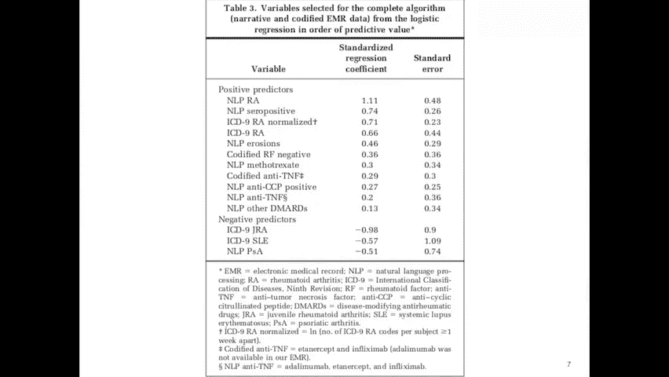
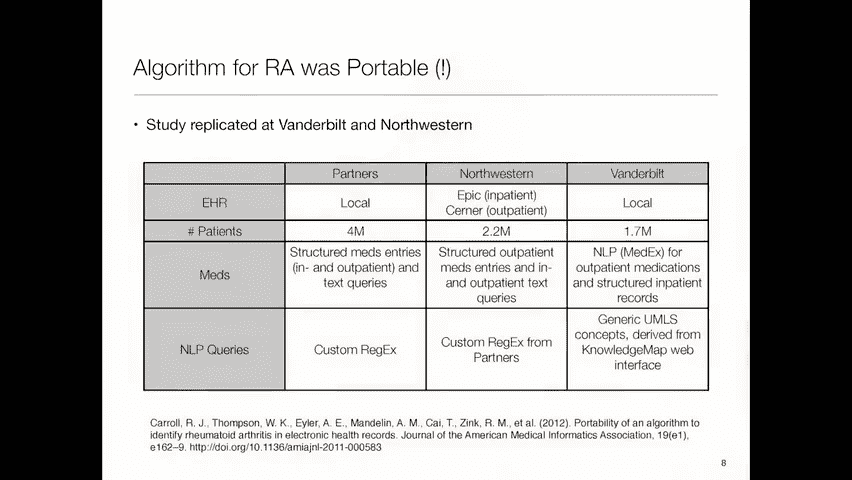
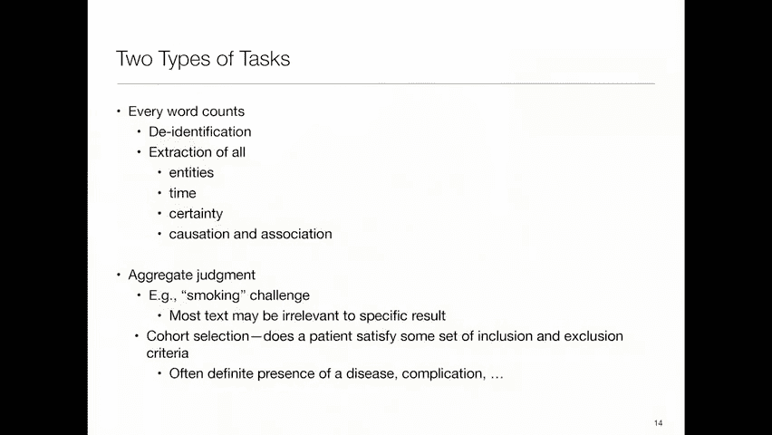
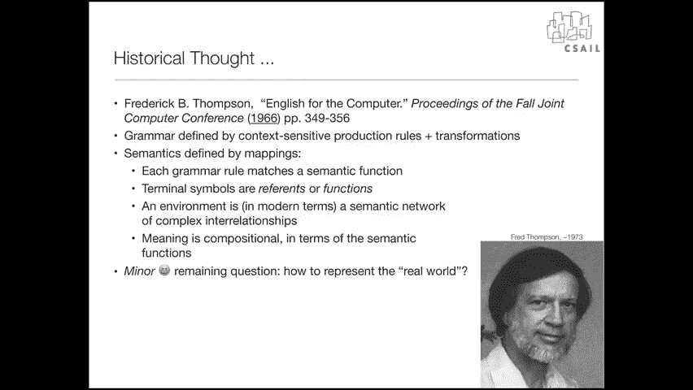
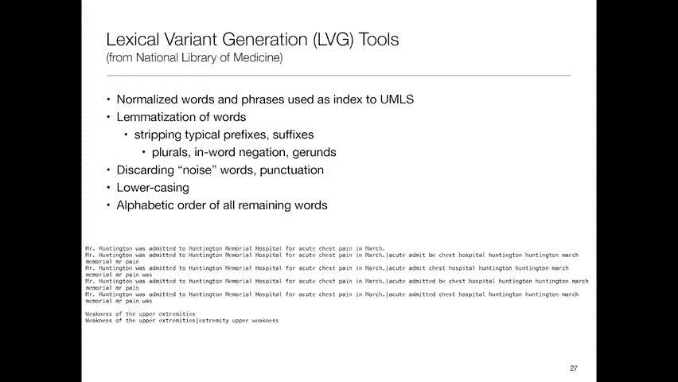

# MIT医疗机器学习中英文字幕 - P7：7.Natural Language Processing (NLP), - 大佬的迷弟的粉丝 - BV1oa411c7eD

我们谈论的是自然语言处理在医疗保健中机器学习中的作用，这将是一种异构的演示文稿，主要是今天我要谈谈发生的事情，或者利用不基于神经网络表示的方法，星期二，我要讲话了，主要是关于依赖于神经网络表示的东西。

但我不确定界限会落在哪里，我还邀请了那边的凯瑟琳·廖医生，他们将和我一起参加问答和采访，就像我们几周前做的那样，和大卫·凯特在一起，是伴侣医疗保健系统中的风湿病学家，你会听到我们一起做的一些工作。

在过去，在我们去面试之前，大概，这两节课的大纲是，我想谈谈为什么。

我们关心临床文本，然后我要谈谈一些，概念上很有吸引力，但实际上不是非常可行的方法涉及到分析这些叙事文本，作为语言实体，作为语言对象，以语言学家接近它们的方式，然后我们将讨论经常做的事情。

这是一种术语定位方法，可以说，我们可能无法准确理解叙述中发生的一切，但我们可以识别出某些单词和短语，这些单词和短语具有高度的指示性，病人有某种疾病，某种症状，对他们做了什么特别的事情。

所以这是很多面包和黄油，当今临床研究是如何进行的，然后我会继续一些其他的技巧，所以这里有一个例子，这是来自Mimic的出院总结，当你玩拟态的时候，你注意到它被识别了，所以名字和东西都被方括号取代了。

明星明星明星之类的东西，在这里我已经取代了，我们用合成名字代替了那些，所以瞎子先生，真的不是瞎子先生吗？等等，但我想要一些读起来像真实文本的东西，所以如果你看这样的东西。

你看盲人先生是一个79岁的白人白人男性，所以有人重复了一个有糖尿病和下MI病史的词，他在11月13日接受了扩大的憩室的开放修复，又在某个地方，那不是实际地方的名字，然后他发展了Hebretamesis。

所以他在吐血，因呼吸窘迫被插管，所以他呼吸不好，所以关于盲人先生的遭遇，这些都是非常重要的事情，所以我们希望能够利用这一点，事实上，为了给你一个稍微量化的版本，我在2010年左右做了一个项目。

我们在看的地方，试图理解，类风湿性关节炎的遗传相关性有哪些。

所以我们去了马萨诸塞州综合医院的研究病人数据库，和布里格姆，伴侣的医疗保健，我们说好，病人是谁，他们因类风湿性关节炎就诊而被收费，有成千上万的人，然后我们随机选择了一组，我想有四百个病人。

我们把它们给了风湿病医生，我们说这些人中谁真的患有类风湿性关节炎，所以这些是基于账单代码，那么你会猜到什么，是积极的，具有计费代码的预测值，本数据集中的类风湿性关节炎，我是说，有多少人认为超过50%。

好的，那就太好了，但不是有多少人认为不止两个，百分之五，神啊，你们变得很悲观，嗯，也不是，结果发现，在这个队列中，大约有19%的人，在你打电话之前，你知道的，欺诈调查员，你得问问自己。

为什么这个数据这么差，因为这些账单代码不是创建的，以便具体说明病人的问题所在，它们是为了告诉保险公司或医疗保险，或者某个人，照顾他们的医生应该得到多少报酬，所以这意味着，比如说，如果我抓住我的胸膛。

一辆救护车把我送到麻省总医院，他们做了一大堆测试，他们决定我没有心脏病发作，那次访问的正确账单代码是心肌梗塞，因为，当然啦，他们必须做的工作，为了弄清楚我没有心脏病发作，与他们必须做的工作相同。

发现我心脏病发作了，所以我们以前讨论过的账单代码，但它们是现实的一个非常不完美的表现，所以我们说好，好的，什么，如果我们坚持你有三个账单代码，治疗类风湿性关节炎而不仅仅是一个，这提高了积极的预测值。

高达2。7%，好的，所以你去，真的，你怎么能得到三次正确的账单，嗯，答案是你会收到账单，你知道的，你在医院吃的每一片阿司匹林，例如，为同样的事情积累三个账单代码是很容易的，因为你去看医生。

医生给你开了类风湿性关节炎的账单，他，或者她送你去看放射科医生，给你的手指和关节拍X光片，该账单是，医生还送你去实验室抽血，这是类风湿性关节炎的另一个账单代码，可能所有这些都是负面的。

你实际上没有这种疾病，所以这是一件非常重要的事情，当你分析这些数据时，要记住，所以我们开始了这个项目，说好，我们需要得到一个正的预测值，大约90，百分之五。

因为我们想要一个真正患有这种疾病的人的非常纯净的样本，因为我们要从那些病人身上提取血样，付一大笔钱给那个女人分析他们，然后呢，希望能更好地了解他们的基因和疾病之间的关系，当然还有。

如果你和生物统计学家交谈，就像我们做的那样，他们告诉我们，如果我们有超过5%的数据库损坏，那么我们将从中得到毫无意义的结果，所以这就是这里的目标，所以我们所做的是说好，如果你训练一个数据集。

它试图告诉你，某人是否真的患有类风湿性关节炎，基于刚刚编纂的数据，所以编码的数据是像实验室值和处方这样的东西，人口统计数据和表格形式的东西，然后我们得到了大约88%的积极预测值。

他说我们能做得多好而不是看那些编码的数据，看叙事文本，在护理笔记中，医生的笔记，出院摘要，各种其他来源，1。我们能不能做得更好，答案是我们得到了大约89，大约89%，只使用自然语言处理这些音符。

毫不奇怪，当你把它们放在一起的时候，联合模型给了我们大约94%的，好的，所以这绝对是一个进步，这是2010年出版的，所以这不是板凳上最新的热门结果，但对我来说，这是一个非常引人注目的故事。

这些临床叙述有真正的价值，好吧那么，我们是怎么做好这件事的，我们在EMR中接受了大约400万病人，要求他们至少有一个icd，类风湿性关节炎九码，然后我们，哦，是五百不是四百。

所以我们看了500个我们有金本位读数的案例，然后我们训练了一个算法来预测这个病人是否真的患有风湿性关节炎，这预测了大约35个井，三千五百八十五例，然后，我们对其中的400个验证集进行了采样。

我们用身体伤害威胁我们的风湿病医生，如果他们没有阅读所有这些案件并给我们一个金本位的判决，否，我开玩笑的，我是说，他们真的很合作，这里有一些细节，你可以在幻灯片中看到，我有一个指向原始论文的指针。

如果你对细节感兴趣的话，但我们在看类风湿的ICD九号代码，关节炎及相关疾病，我们排除了一些ICD九号代码，对我们感兴趣的样品是正确的，我们处理了这个多重编码，忽略一周内发生的代码。

这样我们就不会在同一次访问中遇到多张账单的问题，然后我们寻找各种各样的电子处方，我们寻找实验室测试，主要是射频，类风湿因子与抗环柑橘肽，如果我发音正确，我们不仅在这项研究中发现了另一件事。

但在其他一些情况下，计算一下数据库中有多少事实是很有帮助的，关于一个特定的病人，这是一个不错的代理，他们有多病是对的，如果你不是病得很重，你往往有一点点数据，如果你病得更重，你往往有更多的数据。

所以这些是队列选择，然后从叙述性文本，我们使用了一个由张清建立的系统，她的同事当时被称为高科技，今天绝对不是最先进的，但这是一个从叙事文本中提取实体的系统，并为其时代做了出色的工作。

我们从医疗保健提供者的笔记中做到了这一点，放射学和病理学报告，出院摘要，执行情况报告，我们还提取了疾病诊断笔记，来自相同数据的提及，药物实验室数据，放射学检查结果，等等，然后我们扩大了该工具附带的列表。

用手工策划的不同方式说同样的话，为了扩大我们的覆盖面，我们玩否定检测是因为，当然啦，如果一张纸条说病人没有X，那么你不想说病人有X，因为提到了X，我一会儿再多说几句。

所以如果你看看我们用逻辑回归建立的模型，这是一种很常见的方法，你发现有积极和消极的预测因素，预测器实际上是基于自然语言处理的有趣组合，和那些被编纂的，例如，你有类风湿性关节炎。

如果一张纸条说病人患有类风湿性关节炎，这很好地证明了他们有，这又是一个很好的证据，然后是侵蚀等等，但它们也被编纂成法典，比如，如果你在实验室测试中看到类风湿因子呈阴性，那么嗯，实际上是什么。

我不知道为什么，那是，哦不，这对，好的，然后各种排除，所以这些是我们选择的东西，我之前给你看了结果，所以我们能够得到一个积极的预测值，大约是9点，四，是啊，是啊，上一张幻灯片，你说标准化回归系数。

那么你为什么要标准化，也许我说错了，但就在之前，我觉得，所以逻辑回归中的回归系数通常只是赔率，比率，对呀，所以他们告诉你诊断的可能性是大还是小，哪里写着，标准化，我不知道为什么这是一个标准化的。

你知道为什么这是一个标准吗，所以有几件事，一个是当你在数据集上运行一个算法时，你不能用同样的系数，因为每个人都不一样，所以我们不想让人们觉得他们可以，在另一件事上，当你标准化的时候。

可以看到系数的相对权重，一种措施，不是每个系数有多重要，所以这是我们的方式，如果你能看到我们用标准回归系数对它进行了排名，所以NLP在一个上面，一个是你知道的重量最高的，而其他DD，你知道。

再借给它一点点。

好的，所以是的，变量，像nlp a这样的词，上面写着，类风湿性关节炎在文中用这些类似的礼物是值得的，是啊，是啊，如果假设它的现在，所以否定算法希望能找到，如果它说它不在，你不会得到那个功能，所有的权利。

所以这里有一件有趣的事情，这个小组我没有参与这个特定的项目。

说得好，我们能在范德比尔特和西北大学复制这项研究吗，所以我们在那些地方有同事，他们也有电子病历系统，他们也对识别类风湿性关节炎患者感兴趣，所以合作伙伴有大约400万病人，西北大学得了两分二。

范德比尔特得了1分7秒，我们不能运行完全相同的东西，因为，当然这些是不同的系统，所以药物，例如，从他们当地的EMR中以非常不同的方式提取，自然语言查询也以不同的方式提取，因为范德比尔特，比如说。

已经有了一个工具，他们会试着把笔记中的任何文本翻译成ummls概念，我们一会儿再讨论，所以当我听说这项研究时，我的期望是这将是一场灾难，它根本行不通，因为有局部影响，地方因素，人们描述病人的地方方式。

我认为这将是非常不同的，令我惊讶的是，他们发现事实上这很有效所以模型的性能，即使考虑到从笔记中提取数据的方式，和临床系统不同，现在相当相似，令人担忧的是我们算法在数据上的ppv，我们计算PPV的方式。

比我们发现它时的方式要低，所以这是有技术原因的，但我们得到了不同的结果，这仍然令人不安，这里描述了这里的技术原因，PPV是从数据的五倍交叉验证中估计出来的，而在我们的研究中，我们有一个数据集。

从中我们计算了正预测值，所以这是一个不同的分析，不是我们犯了什么算术错误，但这很有趣，你看到的是，如果你在，或者如果你画ROC曲线，你看到的是，西北数据培训，对合作伙伴或范德比尔特数据的测试都不太好。

但是在合作伙伴或范德比尔特数据上进行培训，在其他任何一个身上测试都很不错，所以算法有一定的通用性，所有的权利，我要换一下档，这是十九年前巴罗斯的一篇旧论文，在电子病历系统中，他想出了一张纸条。

上面的文字就在左手边，在护理笔记中，只是它没有很好地分成单独的线条，都是一起运行的，那么这意味着什么呢，有人有线索吗，当我看着它的时候，我没有，所以解释是这样的，那是个约会，注意：

啜泣并不是你所想的那样，它是指呼吸急促，母鹿用力时呼吸困难，所以当你用力时，这是呼吸困难，但这可能比以前的一些评估有所下降，病人生命体征稳定，所以VSS和病人是一个发热的AF。

这可能不是任何人都可以读的，除了写它的人，或者他们的直系亲属和同事，所以这是一个真正的问题，我们现在还没有一个很好的解决方案，你用什么，用于井的nlp，我提到过，嗯，那个，我们想做的事情之一。

出现在音符中的东西，所以如果上面说类风湿性关节炎，我们想说好，这相当于一个特定的ICD9代码，我们可能希望使用自然语言处理来去识别数据，在你知道模仿之前我提到过。

罗杰·马克的团队获得许可发布数据的唯一方法，并让像你这样的人使用它是通过说服IRB，我们已经很好地处理掉了所有的识别信息，在所有这些记录中，所以从技术上来说，这可能不是不可能的。

但很难弄清楚病人到底是谁，在那群人中，在那个数据库里，我们要求你签署数据的原因，使用协议是为了处理剩余的，你知道很难，但不一定不可能，由于与其他数据的相关性，然后你有小问题。

就像亨廷顿先生患有亨廷顿病一样，其中第一个亨廷顿受到保护，健康信息，因为这是病人的名字，第二个亨廷顿实际上是一个重要的医学事实，所以你不会想摆脱那个，您希望确定每个实体的方面，它的时间，它的位置。

它的确定性，您希望查找文本中标识的不同实体之间的关系，比如说，一个在，另一个，是不是，因为它，它治疗它吗，防止它，表示一下，等等，所以有一大堆这样的关系我们很感兴趣，然后也适用于某些类型的应用。

你真正想做的是识别文本记录的哪一部分，解决了一个问题，所以即使你不知道答案是什么，你应该能够指着一张唱片说，哦，这告诉我，在这种情况下，病人的运动方案，总结也是一个非常真实的挑战，尤其是因为切割和粘贴。

由于这些电子病历系统，当护士在写一张新纸条时，它很有诱惑力，并得到了系统的支持，他或她只是拿着旧纸条，把它复制到新的音符上，然后也许做一些改变，但这意味着它是非常重复的。

同样的东西被一遍又一遍地记录下来，有时这甚至不合适，因为他们可能没有改变所有需要改变的东西，另一件要记住的事情是有两个非常不同的任务，例如，如果我在做身份识别，基本上，我必须仔细阅读叙述中的每一个字。

以便查看它是否受保护的健康信息，但我经常需要做出总体判断，其中许多词没有任何区别，例如，我们在2006年参加的第一个挑战之一，是我们给人们的地方，医疗记录，叙述性文本，一堆病人的记录，然后说。

这个人抽烟吗？你可以想象有些词很有帮助，像吸烟者或烟草使用者，或者类似的东西。

但即使是这些有时也会误导人，例如，他不是吸烟者，然后你有有趣的案例，比如病人两天前戒烟了，他们到底是不是吸烟者，还有综合判断，比如队列选择。

不是你需要知道的关于这个病人的每一件事。

你只需要知道它们是否符合某种模式，所以让我给你一个小小的历史笔记，所以这碰巧是我的博士论文导师做的工作，那边幻灯片上的那位先生，他在1966年发表了这篇论文，称为计算机英语。

在秋季联合计算机会议的会议记录中，这是20世纪60年代的大型计算机会议，他的想法是做英语的方法，加工英语的方法，就是假设有一个语法和任何你遇到的英语文本，您根据这个语法进行解析。

每个解析规则对应于某个语义函数，所以出现的图片是这样的。

如果你有两个短语，它们之间有一些句法关系，然后您可以将每个短语映射到它的含义，以及这两个意思之间的语义关系，是由句法关系决定的，这似乎是一个相当明显的想法，但显然以前没有人在电脑上尝试过这个。

所以弗雷德在接下来的二十年里建立了计算机系统，其中一些是我做的，尝试遵循这种方法，事实上，他能够建立研究人员使用的系统，在人类学等领域，在那里你没有很好的编码数据，在叙事文本中有很多东西，然而。

他能够帮助一位人类学家，我在加州理工学院共事过，分析他所做的大约八万次采访的数据库，与古米安加部落成员，他们住在现在被赞比西河水库淹没的山谷里，在赞比亚和津巴布韦边境，太迷人了，他因一些研究而闻名。

在二十世纪八十年代，我很高兴看到那个SRI，它不代表任何东西，但过去代表斯坦福研究所，建立了一个叫做菱形图的系统，这是为了帮助，嗯，当他们不知道计算机的命令语言时，他们会与计算机系统交互。

这样他们就可以用英语表达他们想做的事情，英语会被翻译成一些语义表示，由此，正确的事情在计算机中被触发，这些家伙走来走去霍布斯说得很好，我们为什么不把这个想法应用到自然语言中呢，获取医学文本。

所以他们建立了一个不太好用的系统，但它试图通过基本上翻译英语来做到这一点，它读入了他们所看到的一些正式的谓词演算表示，这是为那些天真的电脑用户建造的，他们不知道，命令语言实际上有一个非常严格的语法。

所以人们发现人的适应能力比计算机强，他们可以，他们可以适应这种严格的语法，你们中有多少人有谷歌主页，或者亚马逊，回声或苹果，你处理得很好的事情，所以它在训练你，因为它不太擅长让你训练它。

但你你的适应能力更强，所以你很快就会明白，如果你用一种方式来表达事情，它理解你，如果你用不同的方式表达事情，它不理解你，你学会了如何表达它，所以这就是这些家伙所依赖的。

他们可以让人们采用计算机能够理解的惯例，最激进的版本是一个叫德霍尔姆的人，他是我1983年在巴黎认识的，他是医院的医生，这是巴黎的中世纪医院之一，这是一个美妙的地方，尽管当他们建造它的时候。

它只是一个死亡的地方，因为他们真的不能为你做什么，所以家庭说服了医院的心脏科主任，他将开发一种人工语言来记录心脏病患者，他会把这个教给所有的研究员和初级医生，在医院的心脏科，他们会被酋长要求。

在法国用这种人工语言写笔记是非常强大的，而不是用法语写笔记，他们实际上这样做了一个月，当我遇到德·霍姆，他正在分析他收集的数据，他发现语言不够表达，有些事情人们想说。

他们不能用他创造的这种人工语言说出来，所以他回去创建了第二个版本，然后他回到心脏病专家那里说，嗯，我们再来一次，然后他们威胁要杀了他，所以实验，实验没有重复，传统上，如果你试图这样做。

你会和一群医学专家坐下来，你会说好吧，告诉我，你认为可能出现在音符中的所有单词，这表明了我感兴趣的某种情况，他们会给你一长串名单，然后你会做grep，你会在注释中搜索这些术语，如果你想让它变得非常复杂。

您将使用像NEX这样的算法，它是一个否定表达检测器，这有助于摆脱不真实的事情，当人们这样做的时候，他们说好，一定有更复杂的方法来做到这一点，所以整个行业都是由人们发展起来的。

说我们不仅应该使用我们得到的术语，最初来自对做这些查询感兴趣的医生，但是我们可以定义一个机器学习问题，这就是我们如何学习我们实际上应该使用的术语集，这会给我们带来比我们开始的条款更好的结果。

所以我要谈谈这种方法，首先是否定，温迪·查普曼，现在在犹他州，但当时匹兹堡在2001年发表了这篇论文，称为识别门控发现和疾病的简单算法，和出院摘要，它确实是一个非常简单的算法，它是这样工作的。

您可以在出院摘要的每个句子中找到所有的ummls术语，所以我会谈谈这个，但基本上是查字典，你在这个非常大的医学术语数据库中查找，并把它们翻译成某种表达，代表这个术语的含义，然后你会发现两种模式。

一个模式是否定短语，在五个单词后面跟着这些ummls术语中的一个，另一个是五个字以内的一个词，后面跟着一个否定短语，不同的否定短语集，所以如果你没有看到任何迹象，这意味着它不存在。

或者如果你看到排除了不太可能的东西，那它就不存在了，未证明的，未证明的，否认等和后修饰符，如果你说什么东西谢绝了，或者一些不太可能的东西，也表明它不存在，然后他们砍了一堆例外，比如说。

如果你说革兰氏阴性，这并不意味着它对随之而来的任何事情都是负面的，或者之前的任何东西，对呀，等等，所以有很多例外，他们发现这个，实际上考虑到它有多简单，做得相当好，所以如果你看不包含否定短语的句子。

看了五百个，你会发现你得到了88和5的敏感性和特异性，不包含这些短语的百分之二，当然啦，灵敏度为零，特异性为百分之百，和在基线上，如果你使用NX，你发现你可以显著提高基线的特异性，所有的权利，什么。

你最终得到了一个，尽管不是在所有计划中，所以这意味着非常简单的技术实际上可以很好地工作，有时，那么我们如何做这个推广，一种方法是利用相关的术语，如Hypo或Hyperyms。

是一个词的子范畴或超范畴的东西，你可能会寻找其他相关的术语，比如说，如果你想看看病人是否患有某种疾病，然后你可以做一点诊断推理，然后说，如果我看到很多提到的那种疾病的症状，那么也许这种疾病也存在，所以。

递归机器学习问题是如何最好地识别与术语相关的东西，这通常被称为表型分型，你们中有多少人用过ummls，就几个，所以在十九，八十五还是八十四，新任命的国家医学图书馆馆长，这是国家卫生研究院的一个研究所。

决定投入巨资创建这个统一的医学语言系统，这是一次尝试，把各种医学专业协会发展起来的所有术语，并将它们统一为一个单一的，他们所说的方法龙，所以它不是真正的词库，因为它没有完全整合好。

但它确实包括了所有这些术语，然后他们花费了大量的人力和机器资源，以识别来自不同术语的两种不同表达的情况，真的意味着同样的事情，例如，心肌梗塞和心脏病发作其实是一回事，在某些术语中，它被称为急性。

心肌梗塞或急性梗塞或急性，你知道，随便啦，他们付钱给人们，他们付钱给机器来搜索整个数据库，并绘制出一张地图，上面写着，好的，我们会有一些概念，你知道吗，看三九八七五，二。

我只是编造了一个与那个特定概念相对应的概念，然后他们把所有这些都映射在一起，所以这是一个巨大的帮助，在两个方面，它帮助你，来自不同地方、描述不同的规范化数据库，它还告诉你自然语言处理是如何。

它为你提供了一个表达相同概念的方式的宝库，然后呢，你可以用那些，为了扩展你要找的短语的种类，有一些，截至目前，其中大约有370万个不同的概念，在这个，在这个概念中，也有等级制度和关系。

从所有这些不同的术语来源导入的，但那些是一个相当混乱的烂摊子，然后在整个过程中，他们创建了一个语义网络，说有五个，四种关系和一百二十七种类型，每个概念唯一标识符被分配至少一个语义类型。

所以这对翻这些东西很有用，所以你可以看到最常见的语义类型是t zero 61，它代表治疗或预防程序，在分类词表里有二十六万个这样的概念，有二十三万三千项发现，十七万二千种，有机化学品，药理物质。

氨基酸肽或蛋白质无脊椎动物，所以数据不仅仅来自人类医学，也来自兽医学和生物信息学研究以及各地，但是您可以看到这些是一个有用的列表，然后可以在这样的数据库中查找的语义类型，并且类型是分层组织的，因此。

比如说，关系是有组织的，所以有一个影响关系，它有子关系，管理，零食，扰乱，使情况复杂化，与，或者阻止生物功能之类的东西，可以是生理功能，也可以是病理功能，一次又一次，每一个都有子类别。

所以这个想法是每个概念，每一个独特的概念，用这些语义类型中的至少一种标记，当你浏览数据时，这有助于识别东西，也有一些工具来处理典型的语言问题，如果我想说流血，流血，流血，这些都是相同的概念。

所以有这些词汇变体生成器帮助我们规范，然后是规范化函数，它接受一些语句，就像亨廷顿先生被录取一样，废话，废话，废话，并将其规范化为小写，按字母顺序排列，其他潜在含义，该文本的语言意义，例如。

注意这个上面写着，但它的一个翻译是。

因为was z只是b的一种形式，这也会给你带来麻烦。

我遇到了一个问题，我在每个人的医疗记录中都发现了铍，因为它也知道B是铍的缩写，所以你必须小心使用这些东西，有一个在线工具，你可以在那里输入一些东西，上面写着上肢无力，上面写着，哦，你的意思是，概念。

近端无力，上肢，然后它与各种上下文有关系，它有兄弟姐妹，它有各种各样的其他东西，人们可以查阅。

几年前我做了一个工具，如果你用其中一个填充它，这个简短的总结，它尝试颜色代码，嗯，它在总结中发现的东西类型，所以这是使用一个叫做元地图的工具，它又来自国家医学图书馆，和本地构建的ummls查找工具。

在这个特殊的情况下，发现完全相同的，文本中的相同映射，所以你可以浏览课文，然后说啊，好的，所以没有表示否定，尿量是这些概念中的一种，如果你把鼠标放在上面，它会告诉你，我想我今天要做的就是到此为止。

这样我就可以邀请凯特加入我们，谈论一个，自2010年以来发生了什么事，临床医生和临床医生实际上是如何使用这些东西的，临床研究人员，好吧，好吧，欢迎凯特很高兴再次见到你，是呀，所以说。

是九年前那篇论文中所代表的技术，今天仍在研究环境中使用，是啊，是啊，所以我会答应，平台的裸露骨骼，我想说管道正在被使用，但现在我想说我们在第五版，我们其实是你，但从那以后我们做了很多改进。

使事情更加自动化，所以表型分型的速率限制因素总是，临床医生，总是得到那个标签，做图表回顾，想出那个术语清单，所以我不知道，如果你想让我谈谈我们一直在做的一些细节，但是是的，如果你能把它插上。

所以如果你回忆起那张图表，从EMR开始有几个步骤，有一个带有ICD代码的过滤器，然后你得到这个数据标记，然后你开始训练，你得随机选择500个，这是一个很大的，这是很多图表回顾要做的是很多。

所以我们的目标是减少图表审查的数量，减少这种情况的部分方法是减少特征空间，所以我们刚开始的时候不知道的一件事是，我们需要多少金本位标签，我们需要多少功能，这些特征中哪些是重要的，所以通过特征，我是说。

ICD代码，诊断代码，药物治疗，以及所有可能与条件相关的NLP术语列表，所以现在我们有方法试图削减这个列表，在我们使用那些金本位标签之前，所以让我想想，所以这是一个NLP，这里的重点是NLP。

所以我们有几种方法来做这件事，所以限制利率的一个步骤是让临床医生，想出一个对某种情况很重要的术语列表，你可以想象，如果你让五个医生在一个房间里试图就一个名单达成一致，它需要永远。

所以我们试图解决这个问题，所以我们开始做的一件事是，我们拿了，嗯，网上免费提供的常见东西，维基百科，medline，有医疗信息的默克手册，我们现在实际上处理这些文章，查找医学术语，把它们拔出来。

将它们映射到概念，这就变成了术语列表，现在，而不是，如果你想想在过去，我们想出了名单，我们有ICD列表和术语列表，它被映射到一个概念，现在我们直接进入文章，我们做大多数，对条款进行表决，你拿五篇文章。

如果五分之三，提到它超过X个时间，我们说这可能很重要，这就是术语列表，让临床医生离开那一步，然后我们，其实我们还没有训练，所以现在不是马上在金本位标签上训练，我们在银标标签上训练。

大多数时候我们使用主ICD代码，但有时我们使用主要的NLP奎，因为有时我们感兴趣的表型没有代码，所以这是一种，我们已经做了一些步骤来使事情更加自动化，并将管道正式化。

所以事实上管道现在是合作伙伴生物库的一部分，这是皮特提到的伴侣医疗保健，是麻省综合医院和布里格姆妇女医院，他们在招募病人进来，你知道，拿到血样，把它和他们的笔记联系起来，所以人们可以做研究。

未链接的人力资源数据和血液样本，这就是他们用来进行表型分析的管道，现在，我在波士顿弗吉尼亚州，和提西一起，这就是我们正在铺设的管道，用于，还有百万退伍军人计划，哪个更大，有上百万的兽医。

他们有几十年前的EHR数据，所以这很令人兴奋，那么有哪些，我是说，我们今天讨论的这项研究是针对类风湿性关节炎的，但是这种表型分型方法还针对哪些疾病，所以各种疾病所以谁，所以我们学到了很多东西，虽然。

表型分型方法最适合，我们的管道，基础管道最适合，对于患病率为1%或更高的疾病，所以类风湿性关节炎在这个下限，类风湿性关节炎是一种慢性炎症性关节疾病，影响百分之一的人口，但它是最常见的自身免疫性关节疾病。

一旦你去了罕见的疾病，这些疾病是偶发的，不会发生在，你知道的，它不仅低于百分之一，但只是偶尔发生一次，这种方法不那么健壮，但大多数疾病都在一个以上，所以在弗吉尼亚州，我们已经为物态学核心奠定了这一管道。

他们正在经历急性中风，心肌梗塞，嗯，你知道，各种各样的糖尿病，我们想研究的很多常见疾病，现在你提到当你识别这样一个病人时，然后你试着取血样，这样你就可以对它们进行基因分型，这在所有这些疾病中也很常见吗。

还是有不同的方法，是啊，是啊，所以十年前很有趣，很不一样，对病人进行基因型鉴定是非常昂贵的，所以每个病人要花五七百美元，这只是为了一个核苷酸，多形的多形的，是呀，只是为了一个片段。

所以我们必须非常小心我们选择的人所以十年前，我们所做的是，我们说过，好的，我们有400万病人和合作伙伴，他们肯定，然后我们选择这些病人并对他们进行基因型，因为它太贵了。

你不想给没有风湿性关节炎的人做基因分型，它不仅会，你知道的，改变那个，它会降低我们联想研究的力量，就像浪费了一样，有趣的是，现在变化已经发生了，我们完全想到了一种不同的方法来处理事情。

现在你有了这些生物库，所以你有像VA这样的东西，MVP或英国生物银行，他们被系统地招募，抽取血样，它们是基因分型的，没有学习的想法，与EHR相连，所以现在我走进VA，这是一个完全不同的故事，你知道。

十年后，我在V，我对识别类风湿性关节炎感兴趣，有趣的是，这个算法在那里端口很好，我也是，但现在我们只是在那里测试了我们的新方法，但现在不是说，我需要识别这些病人并得到基因型，所有的基因型都已经在那里了。

所以现在这是一种完全不同的研究方法，是啊，是啊，有趣，是啊，是啊，所以另一个，在观众提问之前我想问你的另一个问题，是的，所以这一切都集中在研究上，数据的使用，有没有，人们已经采用的临床用途。

使用这种方法，你知道的，试着读纸条，我们几十年前幻想的，你知道，当你从病理学家那里得到报告，那个，机器学习算法，使用自然语言处理会卑躬屈膝，识别出重要的东西，然后将其纳入决策支持。

或者在某种引起人们注意的预警系统中，重要成果，相对于不重要的，这一切发生过吗，我想我们还没到那一步，但我觉得我们比以前亲密多了，但这可能是你几十年前的感受，挑战之一是，如你所知。

人力资源实际上直到2010年的高科技法案才被广泛采用，所以很多系统现在实际上只是得到他们的ehr，我们有幸玩弄数据的原因，是因为合作伙伴走在了前面，开发了EHR，退伍军人管理局碰巧有一个EHR，所以说。

但我想首先，因为研究和临床医学是非常不同的研究，如果你搞砸了，你错误地将某人归类为疾病，没关系对吧，你只要，你在学习中失去动力，但在临床环境中，如果你搞砸了，这真的是件大事，所以我认为标准要高得多。

所以我们所做的，我们所有这些表型分型的目标之一是让它达到那个点，在你知道的地方，我们很有信心，我们不会说某人有或没有疾病，但我们是，你知道的，实际上，塔尼和我正在考虑或一直在计划这笔赠款。

从这个算法中输出的是疾病的概率，对于我们的一些表型算法来说是相当好的，所以我们想测试的是，你想告诉临床医生的可能性是多少，嘿，如果你不是在想这个病人的类风湿性关节炎，这在他们偏远的地方特别有帮助。

没有风湿病医生的地方，你应该考虑一下，也许你知道考虑推荐他们，或者你知道，通过远程健康与风湿病学家交谈，这也是，有很多事情正在改变，他们在做这样的东西，更多，嗯，合身，更多地进入工作流，所以是的，是啊。

是啊，所以你是如此，你和我一样乐观，是啊，是啊，在二十世纪九十年代，我们走着瞧，你知道这肯定会在某个时候发生，是啊，是啊，你们谁去参加庆祝活动了吗，围绕施瓦茨曼计算学院的开幕，所以他们讨论了很多。

医疗保健确实一次又一次地出现，作为一个伟大的机会，我坚信，但另一方面，几十年来我学到了，不像我的天性那样乐观，我想在座的一些演讲者还没有学到同样的东西，同样的教训，所以事情可能需要更长的时间。

所以让我打开这个问题，地板，发言提问，所以你对概念所做的映射，在合作伙伴的系统中，还是像公开可用的东西，你能把它转移到VA上吗，或者像你工作的时候，像这样，有多少是专有的，有多少是扩展的，是啊，是啊。

所以你说的是当我们试图创建术语列表的时候，我们将术语映射到概念，你使用维基百科和其他三个来源，是啊，是啊，是啊，是啊，所以这就是外面的一切，我们作为一个学术团体，我们试图出版我们所做的一切。

我们把我们的代码放在GitHub或Cran上，让其他人玩出来测试和打破，所以说，所以说，是啊，是啊，条款真的是，你知道的，MLS中相似，我不知道你有没有看过，他们有很多关键词。

所以有一个通用的方法来映射关键字，从术语到概念，这就是我们工作的基础，可能还有一点点，但它背后没有什么花哨的东西，你可以想象，因为我们试图跨越许多表型，当我们思考映射时，它总是要自动化的，我们尽量不要。

我们的第一轮是非常手动的，难以置信的手动，但现在我们尝试使用可用的系统，例如ML和其他映射方法，那么什么地图，想必你今天不用高科技，不，所以是的，那么你使用哪些工具，很有趣，我和奥克里奇谈了两个小时。

关于这个，嗯，我们正在使用程开发的一个叫做尼罗河的系统，这与C是一个非常健壮的系统有关，只是它，太，为了表型分型的目的，我们不需要那么详细，我们需要我们真正需要的是，有没有提到，这个概念和否定是什么。

所以尼罗河是我们一直在使用的东西，随着时间的推移，用我们测试的不同方法进行了验证，所以我星期二，我将谈谈这个系统和它的一些后继者，所以你会知道这是如何工作的，我还应该提到你阅读清单上的一篇论文。

是大卫·桑塔格小组的一份文件，它使用了这个锚的概念，这是非常相似的，这是一种试图自动化的方式，就像凯特说的，你知道如果你，如果医生提到一些术语，你会发现这个术语经常与某些其他术语一起使用。

通过查看维基百科或梅奥诊所的数据，或者在你的消息来源所在的任何地方，那么这是一个很好的线索，其他术语也可能有用，所以这是这个想法的形式化，作为一个机器学习问题，所以基本上，那份文件谈到了如何采取一些。

高度表明一种疾病的非常确定的术语，然后用那些作为锚，为了训练一个机器学习模型，它识别了更多也可能有用的术语，所以这个概念和大卫在上一次演讲中谈到的类似的想法，你得到的是银本位而不是金本位。

银本位可以用一些机器学习算法从一个较小的金本位导出，然后你可以在进一步的计算中使用它，那么过程是什么，比如与学者和机器学习合作，乡亲们，就像，你找到他们了吗，他们找到你了吗。

你们在公共汽车站撞在一起了吗？但这怎么行得通呢，我真的很幸运，有一个大的研究叫做整合生物学的信息学，床边项目叫i two b two，由扎克·科哈尼领导，所以这已经到位了，皮特已经被拉了进来，坦吉。

那么他们基本上做了什么，每周五把我们所有人锁在一个房间里三个小时，就像，有什么问题？有什么问题，我们怎么去那里，所以我认为基础设施很有帮助把每个人都带到谈判桌前，因为这并不容易。

因为你不在同一个空间旋转，你思考的方式很不一样，所以嗯，我们现在就是这么做的，现在有，那是更主流的，我想当我们刚开始的时候，每个人都是我的同事，跟我开玩笑，他们就像，你在干什么，r二d二，你知道吗。

发生什么事了？你是什么，你在那边走投无路，因为你知道我们做的研究更多的是，临床试验与EPI项目的方法，但现在你知道我们有我在布里格姆经营一个核心，所以风湿科已经用完了，所以我们试图把人们联系在一起。

我确实发到了我们的核心，这里的咨询会议，但你知道如果有兴趣，有办法，可能有更多的团体在这样做，在那里我们可以更正式地进行联合会谈，或，或者你知道把人们联系在一起，是啊，是啊，是啊，是啊，但这并不容易。

我不得不说，这是非常，它需要很多时间，因为当皮特把那个东西，看起来像是不同的语言，我的意思是，只是我没有，甚至，我甚至没有想到，很难读懂，所以就像你知道你进入了这两个不同的世界。

所以你必须努力在中间相遇，而且需要时间，也需要合适的人，所以说，我不得不说，扎克可能很聪明，把合适的人带到桌子上，一次把我们锁在房间里三个小时，因为，只是你知道，她说爱，或者她已经学会说AI了。

仍然有很多统计学家，他们只是对我们所做的事情有过敏反应，很难和他们一起工作，所以有正确的人的组合也真的，我觉得，临界，就像我的一个导师说的，你必须亲吻很多青蛙，很多青蛙。

如果你能更多地说说你是如何处理警报疲劳的，你如何平衡关于你有多确定的问题，与临床问题相比，这有多重要，而不是经常发送这个的心理问题，对一定数量的人来说，他们会开始一种不同的心理，是啊，是啊。

你说到点子上了，主要障碍之一，或者几件事，但警报疲劳是其中之一，所以EMRS在2010年变得更加突出，但现在随着EMRS而来的是许多关于医生的规定，所以我们真的，然后摆脱了我们的旧系统。

对于这些现在符合政府要求的新系统，这个正在全国推广的大怪物系统是如此史诗般的，你真的有，像蛋黄酱这样的地方太复杂了，他们雇文士，所以医生坐在办公室里，还有另一个人真的在听和打字。

并单击所有需要的按钮来获得那里的信息，所以警报疲劳绝对是障碍之一，但另一个障碍是EMR现在对用户太不友好了，它们不是为临床护理而建的，他们是为账单而建造的，你知道我们必须小心我们如何推出这个。

这也是我认为事情被搁置的原因之一，其实，是啊，是啊，不一定是科学，它的实施部分将是非常困难的，所以这并不新鲜，顺便说一句，我记得大约十五年前我教的一门生物医学计算课，戴维·贝茨，他是综合内科什么的主任。

在布里格姆来做了一个客座讲座，他描述了他们的经历，他们的药物相互作用系统，他们已经实施了，他们从一个叫做第一数据库的供应商那里购买了一个数据集，他们搜索了文献，找到了人们报告的所有例子，案件。

一个同时服用这种药物和那种药物的病人出现了明显的不良事件，所以他们之间有一些互动，他们买了这个东西，他们实施了，他们发现，他们通过药房系统订购的大多数药物，一个大的红色警报会弹出，说你知道。

你有没有意识到这种药物之间有潜在的相互作用，和这个病人正在服用的其他药物，问题是，策划这个数据库的公司的动机，是为了确保他们不会错过任何东西，因为他们不想为没有报警负责，但当然，没有阻力说。

如果你每秒钟警告一次，那么没有人会注意他们中的任何一个，所以大卫的解决办法是召集一群资深医生，他们做了一些关于他们在医院经历的实际不良事件的研究，他们把成千上万种药物相互作用的列表减少到20种。

他们说好吧这些是我们唯一要报警的，是啊，是啊，然后当史诗出现时，他们把它扔掉了，所以现在当我下订单的时候，我得到了一份十个的名单，我只是，这就是问题所在，门槛将是，所以会有一整个。

我认为会有完整的发展方法，在弄清楚阈值在哪里之间必须发生的事情，警报带来的疲劳，几个问题，一个像船，我明白了，我看到九个，我看到，哦是的，比如你是怎么做到的，因为在其他上下文中谈论这个。

另一个是你怎么能，你知道，把你在这里的研究通知其他国家，因为我是说在一天结束的时候，所以全球健康问题，所有这些药物系统或不同的，即使在我们和英国之间，所以你知道，我们在这里做的所有映射。

为EHR或其他地方下注，是啊，是啊，所以让我来回答第一个，第二个是正在进行的工作，所以我10月1日来了美国，二十五，我记得它伤害了我们所有人，所以我们实际上还没有那么多关于i d ten的信息。

但这肯定影响了我们的工作，所以如果你想想，当皮特指着iC9的ICD计数时，对于那些不知道的人来说，I C9是几十年前开发的，我看到十年前，也许二十年前，但我做的是，它增加了更多的粒度。

所以对于类风湿性关节炎，我提到过，是一种全身性慢性炎症性关节疾病，我们以前有一个代码说，类风湿性关节炎，它现在说类风湿性关节炎，类风湿因子阳性，类风湿性关节炎，类风湿因子阴性。

每个类别下面都是右手腕的ARA，左手腕阿里，右膝阿里，左膝，你能想象，所以我们点击了所有这些，所以事实证明，嗯，令人惊讶的是，所以我们做了，我们实际上，我们现在即将发表一项小型研究，RA怎么会更准确。

现在，他们有所有这些颗粒，事实证明，我想我们很恼火，因为它现在实际上比i c更准确，九，所以这是一回事，但那是你知道的只有两三年的数据，我想它会变得相当相当，另一件事是你会看到ICD代码的数量激增。

所以你要考虑，10月1日之前你们是怎么处理背影的？当你有一个没有代码的时候，但是20点15分以后你知道这取决于病人什么时候来，他们可能有右手腕的RA，在左膝上的一天，前几天看起来像是不同的代码。

所以现在我们必须考虑系统的系统来卷起，我认为现在最大的挑战是地图，所以我有九个，你知道现在不是直接映射到十或回来，因为有些疾病在发展时我们不知道，存在于，十在i c，十点。

他们用九年来没有描述过的方式谈论疾病，所以当你试图协调数据时，这是弗吉尼亚州正在积极处理的事情，你现在如何计算ICD代码，你怎么认为有人有RA的ICD代码，嗯，所以这些都是现在正在开发的东西。

CMS医疗补助和医疗保险中心，这是为了计费的目的，提出了一个地图系统，我们许多人现在都在使用，鉴于我们所拥有的，顺便说一句，设计icd-11的委员会多年来一直很活跃。所以又有一个从长矛上下来。

虽然据我所知没有，但是克里斯开枪是的，我看到它很好，所以，但实际上，我有点乐观，因为，与传统的ICD系统不同，是啊，是啊，这个是以游牧民族为基础的，它有一个更合乎逻辑的结构，好的，所以说，你知道的。

我最喜欢的ICD十码是，因航天器事故造成的左股骨骨折，据我所知，我认为这是存在的，代码从未应用于任何人，但它在那里以防万一，所以是的，我肯定我应该十一岁了，你不认为那样会存在，因为这是一个更合乎逻辑的。

所以我看到了井，我不知道会是什么，因为他们还没有定义，但雪人背后的想法是，它更多的是一个组合系统，所以它更像是一种描述语法，您可以根据组件有意义的某些规则进行组装，所以这意味着你不必明确地提到某事。

就像宇宙飞船事故一号，但如果出现这种情况，那么就有一种方法来构建一些东西来描述这种情况，克里斯，我在一次会议上碰到克里斯，他说了一些类似的话，他认为它会更基于NLP，连我都不知道，它会更像一种语言吗。

好吧，你问他，我根本不知道他暗示过这件事，我就像，哦不，我想它肯定会更像一种语言，但它会更像，老人，你知道的，弗雷德·汤普森，或者菱形图之类的语言，这是一门设计好的语言，你必须学习。

为了弄清楚如何恰当地描述事物，或者至少你的收银员必须学会，是啊，是啊，接近尾声，但我只是有一个问题当临床医生试图标记数据时，比如说，训练数据，是啊，是啊，有没有什么模棱两可的地方，哦是的。

就像有时候这绝对是，这个人就是这个人，我不是很确定，你觉得怎么样，嗯，你怎么考虑到这一点，当你实际训练测试时，是的，所以我们实际上有三个类别，确定可能和不可能，所以总是有歧义。

然后你总是希望有不止一个评论者，所以在临床试验中，当你有结果时，你有我们所说的裁决，所以你有某种系统，你必须首先坐下来，你必须定义表型，因为不是每个人都有学位，即使是一种非常明显的疾病。

你如何定义这种疾病，为此必须发生的组件是什么，它们通常用于社会或研究的分类标准，所以实际上有一个是给RA的，你知道吗，用于冠状动脉疾病，然后它有这些不同的类别，和一个非常结构化的裁决系统，你知道吗。

盲目地让两个审稿人审查，你知道吗，让我们假设20个相同的音符，看看，看中间阅读器或可靠性，是啊，是啊，所以这是一个大问题，所有的权利，我想我们已经过期了，所以凯特，非常感谢。

