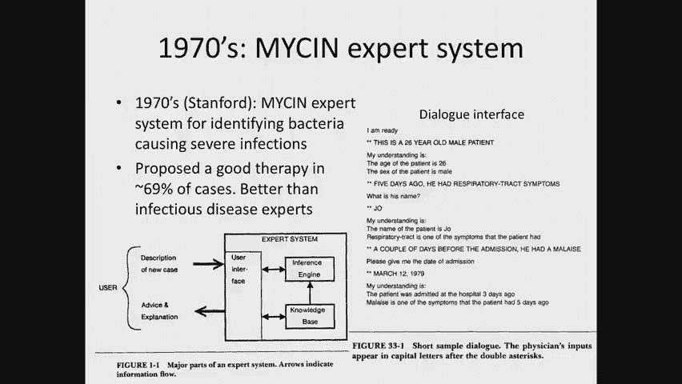
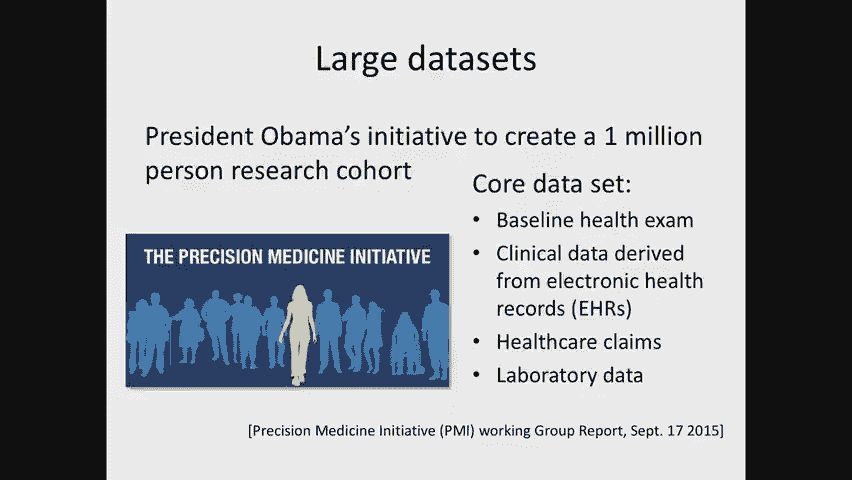
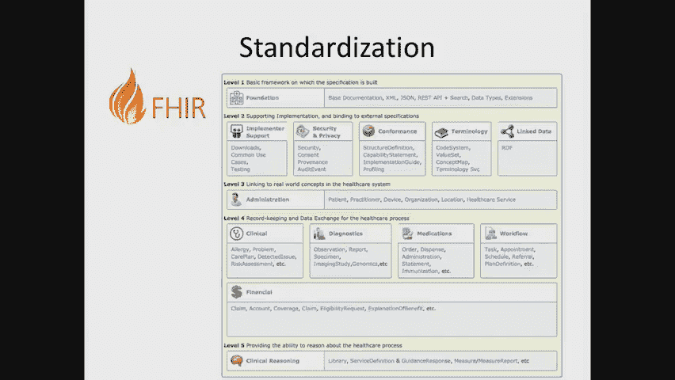
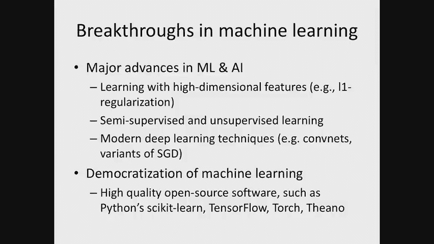
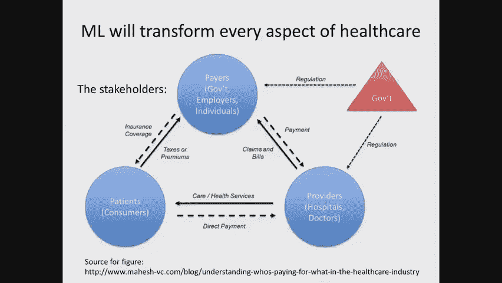
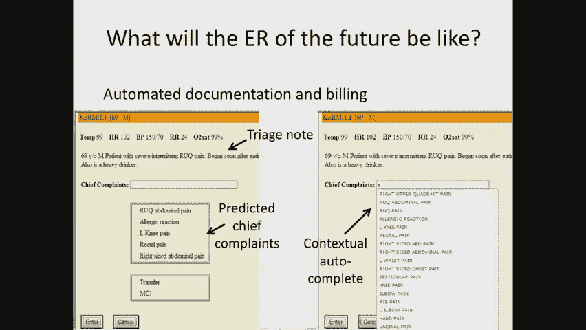
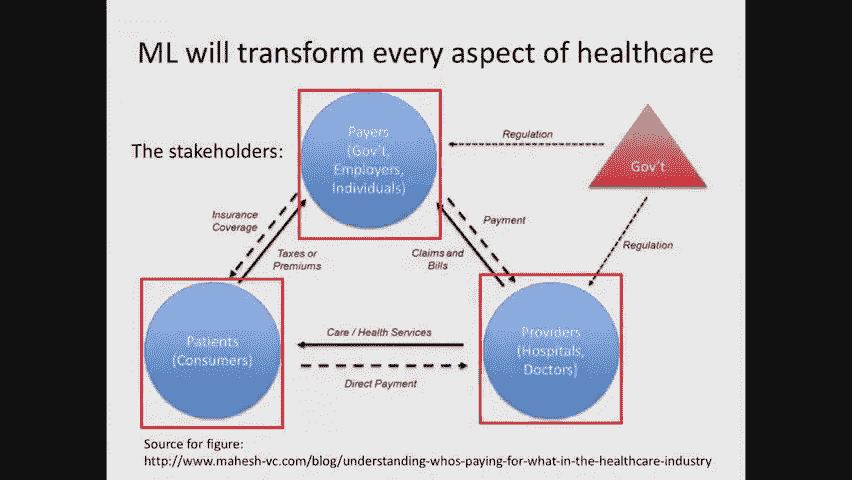

# P1：1. What Makes Healthcare Unique - 大佬的迷弟的粉丝 - BV1oa411c7eD

欢迎来到2019年春季医疗保健机器学习，我叫大卫•桑塔格，我是计算机科学的教授，我也在医学工程与科学研究所工作，我今天的共同导师将是皮特·索夫兹，在今天的讲座快结束时，我会介绍更多。

以及课程的其他工作人员，问题是美国的医疗保健费用太高，目前我们每年花费3万亿美元，我们甚至不一定做得很好，患有慢性病的病人往往发现这些慢性病诊断得很晚，他们往往管理得不好，这种情况发生了。

即使在一个拥有世界上最好的临床医生的国家，医疗差错时有发生，错误，如果被抓到，本可以防止不必要的死亡，医疗保健影响着我们所有人，所以我想这个房间里几乎每个人都有一个家庭成员，所爱的人，亲爱的朋友。

甚至他们自己也有健康问题，影响你的生活质量，影响了你的工作，你的学业，可能导致了不必要的死亡，所以我们今天在这门课上要问的问题是，我们如何使用机器学习，人工智能是试图改变医疗保健的更大难题的一部分。

所以我们都有一些个人故事，我自己也有一些个人故事，这些故事让我对这个领域产生了兴趣，我的祖父患有阿尔茨海默病，他很晚才被诊断出阿尔茨海默病，今天对阿尔茨海默氏症没有好的治疗方法。

所以我并没有预料到结果会有所不同，但如果他早点被诊断出来，我们家就会意识到，他做的许多不稳定的事情，在他生命的晚年是由于这种疾病，而不是因为其他原因，我妈妈得了多发性骨髓瘤，血癌。

他在四年前或五年前被诊断出来，现在，我以前从未开始治疗她的癌症，她两年前去世了，一年前，现在，为什么她死得很好，人们相信她的癌症还处于非常早期的阶段，她的血液标记物被用来跟踪癌症的进展。

把她归入低风险类别，她还没有明显的疾病并发症，根据今天的标准指南，要求开始治疗，结果，相信最好的策略是观望，但她不知道，和我的家人，她的血癌，这是由轻链造成的，它们正在积累，最终导致器官损伤。

在这种情况下，轻链在她的心里积聚，她死于心力衰竭，如果我们认识到她的病在更远的地方，她可能已经开始治疗了，现在有二十多种治疗多发性骨髓瘤的方法，被认为有延长寿命的作用。

我可以给你四五个来自我个人家庭和朋友的故事，发生过类似事情的地方，我毫不怀疑你们所有人，那么我们能做些什么呢，这是我们在今天的课程中想要试图理解的问题，别误会我的意思。

机器学习人工智能将只是拼图的一部分，有这么多其他系统，我们必须对我们的医疗保健系统进行系统性的改变，但让我们试着理解这些人工智能元素可能是什么，那么我们就从今天的课开始吧。

通过介绍人工智能和机器学习在医疗保健中的背景，我会告诉你为什么，我想现在是1919年的时候了，真正开始在这个问题上取得重大进展，那我就告诉你，我将给你举几个机器学习如何可能改变医疗保健的例子，今后十年。

当然我们只是猜测，但这是由最新和最伟大的研究指导的，很多都发生在麻省理工学院，今天的课结束时，我们将概述，有什么不同，机器学习医疗保健的独特之处，你们过去都上过机器学习的课程。

所以你知道监督预测的基本知识，你们中的许多人都研究过聚类之类的东西，你肯定在关注新闻，你看到的地方，每天都有关于谷歌的新闻，脸书，微软在语音识别方面的最新进展，计算机视觉等，那么。

将这些技术应用于医疗保健领域的真正不同之处在于，答案是有很大的差异，在这里进行机器学习有很多微妙之处，我们会在整个学期讨论这个问题，所以开始，这不是一个新领域。

医学中的人工智能可以追溯到20世纪70年代，甚至在六十年代的某个时候，最早尝试使用人工智能进行诊断的例子之一是这个霉素系统，斯坦福大学开发的，目标是试图识别可能导致感染的细菌。

然后试图指导对这种细菌的适当治疗方法，现在发现这个算法，这个机器学习，这个简单的AI算法，能够在69%的病例中提出一种好的治疗方法，这在当时比最好的或非常好的传染病专家，现在它还有一些其他的元素。

挺有意思的，所以那些一直在关注最新聊天机器人的人，可能会觉得这有点先见之明，所以有一个对话框界面，电脑说，我准备好了，电脑，临床医生回应，这是一个两个六岁的男性病人，计算机测试它对正在发生的事情的理解。

上面说病人的年龄是2岁6岁，病人的性别是男性，临床医生五天前写道，他有呼吸道感染，电脑问他叫什么名字，乔，计算机响应，我的理解是病人的名字是乔，呼吸道是病人的症状之一，然后临床医生在入院前几天写。

他身体不适，就是一般的疲劳，计算机响应，请告诉我入院日期，临床医生回应，一九七九年三月十二日，计算机再次确认它被适当地理解了，这是后期诊断阶段的序言。

所以人工智能如何真正影响医学的想法已经存在了很长时间，然而这些算法，已被证明是非常有效的，即使回到二十世纪七十年代，没有转化为临床护理，第二个例子，哦，它的性质同样令人印象深刻。

是匹兹堡20世纪80年代的作品，开发所谓的内科一或快速医学参考系，这现在不用于传染病，但对于初级保健，在这里，人们可能会问，我们如何才能在更大的范围内进行诊断，病人可能会患上数百种不同的疾病中的一种。

可能会报告成千上万种不同的症状，每一个都给你一些视野，对病人健康可能发生的事情的嘈杂看法，在很高的水平上，他们把它建模为贝叶斯网络，严格来说，这不是贝叶斯网络，它在当时更具有启发式后来被发展成。

但在高水平上，有许多潜在变量或隐藏变量对应于不同的疾病，病人可能得了流感、肺炎或糖尿病，然后在最底部有许多变量，这些症状都是二元的，所以疾病不是开就是关，这里的症状要么存在，要么不存在。

这些症状可能包括疲劳或咳嗽，它们也可能是实验室测试结果的结果，就像高值的血红蛋白，a a c，然后这个算法会采取这个模型，为病人报告的症状，并试图对病人可能发生的行为进行推理，弄清楚鉴别诊断是什么。

有超过4万个边缘将疾病与他们的疾病导致的症状联系起来，这在本质上是概率性的因为它捕捉到了一些症状只会发生的想法，有一定的概率，一种疾病花了15个人的时间才从一个庞大的医疗团队中得出。

所以这是一个很大的努力，甚至在，你知道的，走向今天的时间，很少有类似的努力能像这次这样令人印象深刻，但又一次，发生了什么事，这些算法今天在任何地方都没有被使用，在我们的临床工作流程中。

阻止它们今天被使用的原因有很多，但我在我姑姑和我的解释中用了一个词，这应该真的暗示了它，我用了临床工作流程这个词，我认为这是最大的挑战之一，也就是说，这些算法是为了解决狭隘的问题而设计的。

它们甚至不一定是最重要的问题，因为临床医生通常在诊断方面做得很好，输入之间有很大的差距，他们预期的和目前的临床工作流程，所以想象一下你有，现在是一台大型计算机，我是说这是80年代。

你有一个临床医生必须和病人交谈，获取一些信息，返回结构化数据中的计算机类型，病人报告的症状，从电脑上得到信息，和迭代，你可以想象，那是花很多时间的时间，时间就是金钱，不幸的是，它阻止了它的使用，而且。

尽管使用它花了很大的努力，在现有临床工作流程之外。

这些系统也很难维护，所以我谈到了这是如何从15个人多年的工作中得出的，这里没有机器学习，它被称为人工智能，因为一个人试图用人为的方式推理，就像人类一样，但这里面没有从数据中学习，所以这意味着。

如果你去了一个新的地方，假设这是在匹兹堡开发的，现在你去洛杉矶，或者去北京，或者去伦敦，你想应用同样的算法，您突然必须从头开始重新派生这个模型的部分，比如说，疾病的先验概率将非常不同。

取决于你在世界上的位置，现在你可能想去初级保健之外的另一个领域，一次又一次，人们不得不花费大量的精力来推导出新医学这样的模型，随着新的医学发现，必须再次更新这些模型，这对部署来说是一个巨大的障碍。

我现在再举一个例子，从十九世纪开始，也是从二十世纪八十年代开始的，这是一个不同类型的问题，不是一个你怎么做诊断，但你实际上是如何做发现的，这是斯坦福大学的一个例子，这是一个非常有趣的案例。

在那里人们采用数据驱动的方法试图做出医学发现，有一个所谓的疾病登记数据库，来自类风湿性关节炎患者，这是一种慢性病，这是一个嗯，这是一种自身免疫性疾病，在一系列不同的访问中，每个病人，一个会记录，比如说。

这里，它显示出，这是第一次访问，日期是一月，一万七千二千，十七，一九七九年，膝盖疼痛，病人的膝盖疼痛据报道很严重，他们的疲劳是中等的，温度是三十八点五摄氏度。

这个病人的诊断实际上是一种不同的自身免疫性疾病，称为系统性狼疮，我们有一些他们的肌酐和血液氮的实验室测试值，我们对他们的药物有所了解，在这种情况下，他们服用了强的松，类固醇。

一个人在每个时间点都有这些数据被记录，几乎可以肯定是记录在纸上的，后来这些被收集成计算机格式，但它提供了提出问题和做出新发现的可能性，例如，在这部作品中，有一个发现模块。

这将对哪些方面可能导致其他方面做出因果假设，然后它会做一些基本的统计，检查这些因果假设的统计有效性，然后它会把这些提交给领域专家试图检查，这对那些被接受的人来说有意义吗，然后它利用刚刚学到的知识来迭代。

试图有新的发现，和，本文的主要发现之一，强的松会提高胆固醇吗，这篇文章发表在1986年的《内科医学年鉴》上，所以这些都是数据驱动方法的早期例子，以改善医学和医疗保健，现在转到二十世纪九十年代。

神经网络开始变得流行起来，不完全是，我们在当今时代所熟悉的神经网络，但尽管如此，它们有着非常相同的元素，所以就在1990年，有88项发表的研究使用神经网络解决各种不同的医学问题。

真正区分这些方法的一件事是，我们在今天的景观中看到的是特征的数量非常少，所以通常与我在上一张幻灯片中展示的功能相似的功能，如此结构化的数据是手工策划的，用于机器学习，这不是自动的。

所以必须有助手收集数据，正因为如此每次研究的样本数量都很少，用于机器学习的，现在这些模型虽然很有效，我将在下一张幻灯片中向你们展示一些例子，这些例子也遭受了同样的挑战，我之前提到过。

他们不能很好地适应临床工作流程，很难得到足够的训练数据，因为需要人工努力，以及社区的发现，即使在二十世纪九十年代初，就是这些算法没有很好地推广，如果你经历了收集训练数据的巨大努力。

学习你的模式并在一个机构验证你的模式，然后你把它带到另一个，它只是工作得更糟，好的，所以这真的阻止了这些技术转化为临床实践，那么这些被研究得很好的不同领域是什么，这里有几个例子有点小，所以我会读给你听。

嗯，在乳腺癌中进行了研究，心肌梗塞，心脏病发作，下背痛，用于预测住院皮肤肿瘤患者的精神科住院时间，头部受伤，痴呆的预测，和各种其他问题，这些问题也是我们所看到的性质，我们今天在新闻上读到的。

在现代应用机器学习和医疗保健的尝试中，提到的培训例子很少，从三十九到，在某些情况下，三千，那些是个人，人类与网络，神经网络，他们并不完全肤浅，但它们不是很深，要么对，所以他们，这些是建筑。

它们可能是60个神经元，然后是七个，然后是六个，比如说，根据神经网络的每一层，顺便说一句，这有点道理，给定输入的数据类型，所以就目标而言，这些都不是新的，那么什么改变了，为什么我认为。

尽管事实上我们已经有了可以说是，最近三四十年的失败，我们现在可能有成功的机会，和大微分器，我现在叫什么，机会是数据，所以说，而在过去，医学中人工智能的大部分工作并不是，数据驱动，它是基于。

试图从临床领域专家那里获得尽可能多的领域知识，在某些情况下，今天收集了一点数据，我们有一个惊人的机会，因为电子病历的流行，在美国和其他地方，现在在美国，比如说，故事不是那样的，即使在2008年。

当电子病历的采用在全美国不到10%的时候，s，但那时美国没有经济灾难，s，作为经济刺激计划的一部分，大约有300亿美元被分配给医院购买电子病历，这已经是我们看到的第一个例子，政策对创造，打开舞台。

我们在这门课上能做的工作类型，今天，所以钱就被用来激励医院购买电子病历，因此，收养率急剧上升，这是一个非常古老的数字，来自84%的医院中的2155%。

现在它实际上大得多，因此，数据是以电子形式收集的，这提供了一个尝试对它进行研究的机会，它提供了一个在上面进行机器学习的机会，它提供了一个开始部署机器学习算法的机会，而不是手动为病人输入数据。

我们可以从已经以电子形式提供的数据中自动绘制它，所以，有许多数据集可以用于研究和开发，在这个空间里，在麻省理工学院，教授开创了一项重大努力，罗杰标记，在ECS和医学工程研究所。

创建所谓的物理网络或模拟数据库，Mimic包含了来自重症监护室4万多名患者的数据，而且数据非常丰富，它基本上包含了重症监护室收集的所有东西，从两个护士写的笔记，通过关注病人身上的监测器收集的生命体征。

连接的，收集他们的血压，氧饱和度，到血液测试结果，成果的执行情况，当然还有处方中的药物，所以这是大量的数据现在人们可以用来研究，至少在非常狭窄的重症监护室学习，机器学习如何在那个地方使用。

我不想强调这个数据库的重要性，通过这门课程和更广泛的领域，这是唯一公开的电子病历数据集，全世界任何合理大小的，它是在麻省理工学院创建的，我们将在家庭作业中广泛使用它，结果，还有其他不公开的数据集。

但这些都是由工业收集的，一个最好的例子是经过验证的市场扫描数据库，它是由一家名为Truvin的公司创建的，后来被IBM收购，几分钟后我会告诉你更多，这个数据。

有许多竞争公司拥有类似的数据集不是从电子病历中创建的，而是从典型的，它是从保险索赔中创建的。

所以每次你去看医生，所以你的提供者会给你的健康保险寄一张账单，基本上说发生了什么，那么做了什么程序啊，提供诊断，用于证明这些程序和测试的成本是合理的，从这些数据中，你现在得到了一个整体的观点。

对那个病人健康状况的纵向观察，然后有很多钱在幕后传递，保险公司和医院之间，对Truvin等公司，收集这些数据，然后转售用于研究目的，像这样的数据的最大购买者之一是制药行业，这个数据，不幸的是。

通常不公开，这实际上是一个大问题，在美国和其他地方，这是该领域研究的一大障碍，只有那些有数百万美元支付的人才能真正接触到它，这是我整个学期都要讲的东西，这也是我认为政策可以产生很大影响的地方。

但幸运的是，在麻省理工学院，情况会有所不同，多亏了麻省理工学院的IBM，麻省理工学院的watson ai实验室与ibm有着密切的关系，看起来我们可以访问这个数据库，我们这学期的作业和项目。

现在有很多其他的倡议正在创建大型数据集，后来更名为我们所有人倡议，这项倡议正在创建一个100万患者的数据集，以代表性的方式从美国各地吸引来捕捉病人，穷人和富人，健康及有慢性病的病人。

目标是试图创建一个研究数据库，让我们所有人和其他人，里里外外，U，我们可以通过研究来做出医学发现，这将包括数据，如基线健康检查的数据，在那里取典型的生命体征，血，抽血，它将结合我提到的前两种类型的数据。

包括来自电子病历和健康保险索赔的数据，很多这样的工作也发生在波士顿，就在街对面的布罗德研究所。

有一个团队正在创建所有的软件基础设施来容纳这些数据，这里有大量的招聘网站，在更广阔的波士顿地区，病人或你们中的任何一个人都可以去那里，自愿成为研究的一部分，我刚收到一封邮件，我上周收到一封信，邀请我去。

我真的很兴奋看到，所以说，各种各样不同的数据正在被创建，由于我一直提到的这些趋势，它的范围从临床笔记等非结构化数据到成像实验室测试，生命体征，我们过去认为的临床数据，现在。

已经开始与我们的想法有了非常紧密的联系，作为生物数据，所以来自基因组学和蛋白质组学的数据，开始在临床研究和临床实践中发挥重要作用。

当然啦，并不是我们传统上认为的关于医疗保健数据的一切，嗯，也有一些关于健康的非传统观点来源，例如，社交媒体是一种有趣的思考精神疾病的方式。

我们中的许多人会在Facebook和其他地方发布关于我们心理健康的信息，给你一个关于我们精神健康病人的镜头，跟踪您活动的手机，会让我们看到我们有多活跃，它可能有助于我们早期诊断，我后面会提到的各种条件。

所以我们有，你知道吗，所以现在的整个主题是关于什么改变了，自从AI医学之前的方法，我刚才谈到了数据，但是仅仅有数据是不够的，另一个主要的变化是，在标准化健康数据方面已经做了几十年的工作，例如。

当我向你提到当你去医生办公室的时候，他们发送一份与诊断相关的账单，诊断是在一个叫做ICD9或ID10的系统中编码的，这是一个标准化的系统，对许多人来说，不是所有的，而是许多疾病。

有一个相应的代码与之相关联，i，十，大约一年前在全国推广，比之前的编码系统要详细得多，包括一些有趣的类别，比如说，被乌龟咬是有密码的，被澳门袭击的海狮咬伤，对呀，所以开始在这里变得非常详细。

当涉及到使用这些数据进行研究时，这既有好处也有坏处，但我们当然可以用详细的数据做更多的事情，而不是用不太详细的数据做更多的事情，实验室测试结果在美国使用一种叫做loc的系统进行标准化，又来了。

每个实验室测试订单都有一个相关的代码，我只想简单地指出，与这些实验室测试相关的值不太标准化，药学，国家药品法规你应该很熟悉，如果你服用了医生给你开的任何药物，你仔细看，你会在上面看到一个数字，你看到零。

零，一个，五个，三个，四，七，九，十一，这个数字是那种药物独有的，事实上，这种药物的品牌甚至是独一无二的，有一个相关的分类法，所以人们可以以一种非常结构化的方式真正理解。

病人正在服用什么药物以及这些药物之间的关系，许多医学数据不是以结构化的形式发现的，而是在医生写的笔记中的自由文本中，这些笔记经常提到其中的症状和条件，人们可以通过将它们映射到，所谓的统一医学语言系统。

这是一个包含数百万种不同医学概念的本体论，所以我就不多说了，它们将是本学期许多讨论的主题，尤其是在皮特接下来的两节课中，但我想简短地谈谈你能做什么，你有一个标准化的词汇表。

所以你可以做的一件事是你可以构建API或应用程序编程接口，就目前而言，把数据从一个地方发送到另一个地方，和火，f，h，i，r，是一个新的标准，现在在这里被广泛采用，在美国，为下游临床目的向下游提供数据。

也直接给病人，在这个标准中，它将使用我向你提到的许多词汇，在前面的幻灯片中进行编码，过敏，与这个病人的护理相关的问题甚至财务方面。

对于那些有苹果手机的人来说，比如说，如果你打开苹果健康记录，它利用这个标准接收来自50多家不同医院的数据，你应该预料到将来会有很多竞争对手，因为它现在是一个开放的标准，其他类型的数据。

就像我前面提到的健康保险索赔通常被编码在一个稍微不同的数据模型中，我的实验室经常使用的一个叫做OMOP P，它是由一个非营利组织维护的，称为观察健康数据科学倡议奥德赛。

这个通用的数据模型给出了从一个机构获取数据的标准方法，它可能有自己的复杂性，并真正将其映射到这种公共语言，如果你写一个机器学习算法一次，机器学习算法以这种格式读取数据。

然后你可以很容易地把它应用到其他地方，这些标准的部分真的不能低估，将我们在这门课上所做的事情转化为临床实践的重要性，所以我们将在整个学期中继续讨论这些问题。

所以我们已经讨论了数据，我们已经讨论过标准，这和电灯泡是机器学习的突破，这对这个房间里的任何人来说都不应该感到惊讶，对呀，在过去的五年里，我们一次又一次地看到，一个又一个基准得到改进。

和人类的表现在这里被最先进的机器学习算法击败，我只是给你看一个数字，我想你们中的许多人已经看到了错误率，论Imagenet对物体识别的竞争，2011年的错误率是25%，甚至就在几年前。

它已经超过人类水平到5%以下，现在，导致物体识别进步的变化，在医疗保健方面会有一些相似之处，但只是在某个时候，比如说，有大数据，对此至关重要的大型训练集，算法有了进步，尤其是在卷积神经网络中。

它发挥了巨大的作用，还有开源软件，比如TensorFlow和PI Torch。

它允许一个地方的研究人员或产业工人非常，非常迅速地建立在其他地方其他研究人员的成功基础上，然后释放代码，以便，这样一个人就可以真正加快这个领域的进步速度，现在，就那些算法的进步而言。

这些进步已经产生了很大的影响，我真的想指出的是，因为它们与本课程的相关性是具有高维特征的学习，所以这真的是2000年初的进步，比如说，和支持向量机，用L-1正则化作为稀疏的一种学习，最近在过去的六年里。

随机梯度下降，快速求解这些凸优化问题的类似方法，这将对我们在这门课中所做的事情起到巨大的作用，在过去的几年里，在无人监督和半监督方面取得了巨大的进展，有监督学习算法，正如我以后会告诉你的那样。

医疗保健的主要挑战之一是，尽管我们有大量的数据，我们只有很少的标记数据，所以这些半，监督学习算法将在能够，真正利用我们所拥有的数据，然后当然，现代深度学习算法，卷积神经网络，递归神经网络及其训练方法。

所以这些在科技行业的进步中发挥了重要作用，在某种程度上，它们也将在医疗保健方面发挥重要作用，我将举几个例子，在今天剩下的课程中，所以所有这些结合在一起，数据可用性，机器学习其他领域的进展。

以及医疗保健领域巨大的潜在财务收益，它可能产生的潜在社会影响并没有被忽视，在这个领域有很大的行业兴趣，这些只是名字中的一些例子，我想你们很多人都很熟悉。

比如DeepMind Health和IBM Watson，像Bay Labs和Path AI这样的初创公司，就在波士顿，它们现在都在努力为医疗保健构建下一代工具，基于机器学习算法，数十亿美元的资金。

最近几个季度。

走向数字健康努力，与数百家不同的初创公司合作，这些公司专门专注于使用人工智能和医疗保健，人们认识到数据对这个过程是如此重要，导致了一个所有，努力购买尽可能多的数据，ibm收购了一家叫merge的公司。

它制造了医学成像软件，因此，在2000年积累了10亿美元的大量医学影像数据，和十五，他们在2016年以26亿美元收购了Trans，熨斗健康，这是纽约市一家专注于肿瘤学的公司，就在去年。

罗氏制药公司以近20亿美元的价格收购了它，还有几个这样的行业举措，一次又一次，我只是想让你想想在这个领域到底需要什么，这一点和获取数据实际上是一个非常重要的问题，很明显。

现在让我们来看看机器学习将如何改变医疗保健的一些例子。

首先，我想在这里展示风景并定义一些语言，有许多不同的玩家，当谈到医疗保健空间时，他们是我们，他们是我们去找的医生，你可以认为他们是提供者，但他们当然不仅仅是医生，他们也是护士和社区卫生工作者，等等。

有付款人提供哪里有，这些边缘确实显示了不同玩家之间的关系，所以我们的消费者，我们经常要么来自我们的工作，要么直接来自我们，我们将向健康保险公司支付健康保险公司的保费，然后健康保险公司负责支付给提供者。

为我们病人提供服务，现在在美国，付款人既是商业的，也是政府的，你们中的许多人会知道像信诺或现在这样的公司，或者蓝十字，它们是健康保险的商业保健提供者，但也有政府的，比如说，退伍军人健康管理局。

它经营着美国最大的卫生组织之一，为我们的退伍军人服务，它有第二个，第二大卫生系统之一，国防卫生局，这是一个组织，这两个组织，付款人和提供者都真正赢得了中心，医疗保险和医疗补助服务。

在美国为所有退休人员提供健康保险，还有医疗补助，它在州一级运行，为各种个人提供健康保险，在其他情况下难以购买或获得自己的健康保险的人，这些都是州经营或联邦经营的健康保险机构的例子，然后在国际上。

有时候线条会更加模糊，当然啦，在像英国这样的地方，在那里你有一个政府管理的卫生系统，国民保健服务，你现在有同样的系统支付和提供服务，为什么这对我们来说真的很重要，已经在第一课讲了。

因为这个领域最重要的是弄清楚，你可以尝试改善医疗保健的旋钮在哪里，我们可以在哪里部署机器学习算法，因此，一些算法将更好地由提供商运行，其他的会更好地由付款人管理，其他的将直接提供给病人，上面的一些橄榄。

我们也要考虑工业问题，开发一个新产品需要什么，谁来为这种产品付款？

这又是一个重要的问题，当涉及到在这里部署算法时，所以我会通过几个非常高级的例子，从我自己的工作中，关注提供者空间，然后我会跳起来说得更宽泛一点，所以在过去的七八年里，我和贝丝·伊斯雷尔合作做了很多工作。

河对岸的女执事医疗中心，与急诊科和急诊科是一个非常有趣的临床环境，因为从病人到医院只有很短的时间，来诊断他们是怎么回事，开始治疗，然后决定下一步做什么，你把他们留在医院里，你送他们回家吗。

如果你为这些事情中的每一个，最直接的行动应该是什么，至少在美国，我们总是人手不足，所以我们的资源有限，要做非常关键的决定，所以这是一个场景的例子，在幕后运行的算法。

可能真的有助于解决我前面提到的一些挑战，例如，人们可以想象一个算法，它建立在我向你提到的内科医生的技术基础上，一份或快速医疗参考资料，试着把病人的情况讲道理，根据病人现有的数据，症状。

但现代对此的看法不应该，当然，使用每个症状的二元指标，必须手动输入，但所有这些都应该从电子病历中自动提取，或根据需要列出，然后如果有人能对病人的情况进行推理，我们不一定想用它来诊断，尽管在某些情况下。

您可能会将其用于早期诊断，但它也可以用于其他一些，更微妙的干预，比如说，更好的分诊，以确定哪些病人需要先就诊，不良事件的早期发现，或者认识到可能会有一些不寻常的行为。

这可能是你现在想浮出水面并引起注意的医疗错误，你也可以用这个，了解病人的情况，改变临床医生与患者数据交互的方式，例如，人们可以通过展示临床决策支持来传播最佳实践。

自动触发对你认为可能相关的患者的临床决策支持，这里有一个例子，它说ED仪表板，急诊科仪表板，决策支持算法已经确定这个病人可能有资格，心房蜂窝织炎途径，纤维素通常是由感染引起的，请从其中一个选项中选择。

注册途径下降，如果你拒绝，您必须为审阅者添加注释，现在如果你点击，在那一刻注册路径，机器学习消失，而是有一个标准化的过程，这是一个算法，但这是一个确定性算法，蜂窝织炎患者应如何正确管理，诊断和治疗。

算法来自最佳实践来自临床医生聚集在一起，分析过去的数据，了解治疗这类患者的好方法，然后在文档中正式确定，挑战在于可能有数百甚至数千个这样的最佳实践，在一个学术医学中心，你有病人来，你有的地方。

在系统中快速旋转的医学生或住院医生，因此可能不熟悉，对于本机构的任何一个病人，最合适的临床指南是什么，或者如果你去农村，通过正确的临床指南来思考的学术性在哪里，少了一点主流日常活动。

什么时候用哪一个是很有挑战性的问题，这就是机器学习算法可以发挥作用的地方，通过推理病人的情况，你可能有一个很好的猜测什么可能适合这个病人，你用它来自动显示正确的临床决策支持触发器。

另一个例子是试图预测临床医生的需求，例如，如果你认为这个病人可能有精神疾病，或者你认识到病人进来了，分诊抱怨胸痛，那么可能会有一个心理秩序集，其中包括，其中包括与精神病患者相关的实验室测试结果。

或者胸痛顺序集，包括实验室测试和现在可能建议的阿司匹林等干预措施，这些也是这些顺序集不是由机器学习算法创建的例子，虽然那是我们可以在这学期晚些时候讨论的问题，相反，它们是标准化的。

但机器学习算法的目标只是找出哪些是要展示的，当直接给临床医生时，我给你们看这些例子，试图指出诊断并不是事情的全部，思考我们可以用机器学习做什么更微妙的干预，人工智能和医疗保健对产生影响非常重要。

它现在可以有这么多其他的例子，在诊断风格上更多的是减少，专家咨询的必要性，所以你可能会有病人进来，让病人接受X光检查可能会很快，做胸透，但是找放射科医生检查X光可能要花很多时间，在某些地方。

放射科医生的咨询可能需要几天时间，根据病情的紧急程度，所以这是一个数据相当标准化的领域，事实上，麻省理工学院上周刚刚发布，三十万张胸部X光片的数据集，上面有相关的标签，人们可以试着问这样一个问题。

我们能建立机器学习算法吗，使用我们所见过的卷积神经网络类型技术，在物体识别中起着很大的作用，试图了解这个病人是怎么回事，比如说，在这种情况下，根据这张胸部X光片，预测病人患有肺炎，并使用这些系统。

它可以帮助减轻放射科咨询的负担，它可以让我们真正地将这些算法转化为设置，可能资源匮乏得多，比如说，在，现在，同样的技术可以用于其他数据模式，所以这是一个数据的例子，可以从心电图中获得，从看着这个心电图。

人们可以试着预测，病人有心脏病吗，例如心律失常，现在，这些类型的数据过去只是在你去医生办公室时获得的，但今天我们所有人都可以买到，比如说，在苹果最近发布的手表中，它有一个心电图，建立了一个单一的线索。

内置心电图，它可以尝试预测病人是否有心律失常，还有很多微妙之处，当然是围绕着它所需要的，我们将在本学期晚些时候讨论，以及如何安全地将这些算法直接部署给消费者，有各种各样的技巧可以在一些讲座中使用。

我将和你谈谈八十年代和九十年代的事，这是基于试图信号处理，试图检测，信号的峰值在哪里，看看山峰之间的距离，因为有大量可用的数据，我们一直在使用卷积，基于神经网络的方法试图理解这些数据并从中预测。

急诊室的另一个例子真的与不有关，今天我们如何照顾病人，但是我们如何获得更好的数据，这将导致明天更好地照顾病人，所以一个例子，我的团队在贝斯·奥迪肯部署的是，它还在急诊科运行。

与得到更高质量的首席投诉有关，主要的抱怨是，通常是很短的两三个字的量，就像左膝疼痛，直肠疼痛，右右上象限你是Q，和，这只是对病人今天为什么进急诊室的一个非常简短的总结，尽管它很少说话。

它在病人的护理中起着巨大的作用，如果你看看急诊室的大屏幕，总结了谁是病人在什么床位，他们旁边有主要的投诉，主要抱怨被用作临床试验患者注册的标准，它被用作进行回顾性质量研究的标准。

看看我们如何照顾特定类型的病人，所以它起了很大的作用，但不幸的是，我们得到的数据一直是垃圾，这是因为它是自由文本，它有足够高的维度，试图用一个大的下拉列表来标准化它，就像你在这里看到的。

会扼杀临床工作流程，对临床医生来说需要太多的时间，试图找到相关的，所以它不会被使用，这就是一些非常简单的机器学习算法变得非常有价值的地方，例如，我们完全改变了工作流程，而不是主要的抱怨，当病人进来时。

分诊护士分配的第一件事，是最后一件事，首先，护士把生命体征，病人体温，心率，血压，呼吸频率和氧饱和度，他们和病人交谈，他们写了十个字，关于这里病人情况的三十个字的说明，上面写着，六十九岁男性患者。

右上象限严重间歇性，吃后不久就开始疼痛，奥索是个酗酒者，所以我们得到了相当多的信息，我们使用了机器学习算法，本例中的有监督机器学习算法，预测一组主要的抱怨，这些抱怨现在来自一个标准化的本体。

我们展示了五个最有可能的和临床医生，在这种情况下，护士可以点击其中一个，它会进入那里，我们还允许护士输入主诉的一部分，而不仅仅是做文本匹配，找到与键入的内容匹配的单词，我们做一个上下文自动完成。

所以我们用我们的预测来区分优先级，包含这一系列字符的最有可能的主要抱怨是什么，这样输入相关信息就更快了，我们发现随着时间的推移我们得到了更高质量的数据。

这就是我们会在这门课上讲到的，所以我只是给你们举了一个例子，机器学习和人工智能将如何改变供应商空间的几个例子，但现在我想跳上一个层次，仔细考虑，不是我们今天如何治疗病人。

但是我们如何看待病人慢性病的进展，在一段时间内，可能要十年，二十年，还有这个，我们如何管理慢性病的问题，是影响医疗保健生态系统各个方面的东西，它将被提供者使用。

付款人，也是病人自己，所以考虑一个患有慢性肾病的病人，慢性肾脏病，通常只会变得更糟，所以你可能会留下来，你可以从病人健康开始，然后有一些增加的风险。

最终他们会有一些肾脏损伤随着时间的推移他们会出现肾衰竭，一旦他们肾衰竭，他们通常需要透析，他们需要透析，或者肾移植，但是了解这些事情什么时候会发生在病人身上实际上真的真的很有挑战性。

现在我们有一种方法来给病人分期，一种标准的方法被称为EGFR，它主要来自病人的肌酐，这是血液测试结果和他们的年龄，它给你一个数字，从这个数字中你可以知道病人在这个轨迹中的位置，但它真的是粗粒的。

这一点也不能预测，病人何时会发展到疾病的下一阶段，现在，其他条件，比如说，一些癌症，我接下来会告诉你，别走那条直线，而是病人的状况和疾病负担，这就是我在y轴上给你看的，可能会变得更糟，更好，更糟了。

再好不过了，更糟了，等等，当然还有，作为对病人的治疗和其他与他们有关的事情的功能，了解是什么影响了病人的疾病进展，这种进展什么时候会发生，可能非常有价值，对于医疗保健生态系统的许多不同部分。

所以一个具体的例子说明了这种类型的预测是如何被使用的，会在一种精准医学中，回到我提到的例子，在今天多发性骨髓瘤讲座的一开始，我说我妈妈死于，有大量现有的治疗多发性骨髓瘤的方法。

我们真的不知道哪种治疗对谁最好，但想象有一天，我们有算法可以把你对病人的了解，在某个时间点，这可能包括，比如说，验血结果，它可能包括rna搜索，这让你对病人的基因表达有了一些了解，在这种情况下。

将从样本中导出，取自病人的骨髓，你可以利用这些数据来预测病人会发生什么，在两种不同的情况下，我在这里向你们展示的蓝色场景，如果你给他们治疗，或者这个红色的场景，你给他们治疗B。

当然治疗和治疗B不仅仅是一次性的治疗，但他们的治疗策略，所以它们是跨时间的重复治疗，有一定的间隔，如果你，如果你的算法说在处理B下，这就是将要发生的事情，那你可能，临床医生可能会认为，好的。

治疗B可能是这里的出路，这将是长期控制，病人的疾病负担。

最好的，这是一个因果问题的例子，因为我们想知道，我们如何改变病人的疾病轨迹，我们现在可以试着回答这个问题，使用数据，所以说，比如说，可供您在课程项目中使用的数据集之一，来自多发性骨髓瘤研究基金会。

这是一个疾病登记的例子，就像疾病登记处一样，我之前和你谈过类风湿性关节炎，它跟踪了大约一千个病人，多发性骨髓瘤患者，他们正在接受什么治疗，他们的症状是什么，在几个不同的阶段。

关于他们癌症的非常详细的生物学数据，在这种情况下，RNA寻求，人们可以尝试利用这些数据来学习模型来做出这样的预测，但这样的预测充满了错误，皮特的一件事，我将教你们这门课，预测和预测之间有很大的区别。

为了作出因果陈述，以及你解释数据的方式，当你的目标是做治疗，建议，或者优化，将与你在介绍性机器学习中所学到的非常不同，算法，类，所以我们可以尝试治疗和管理慢性病患者的其他方法包括早期诊断，比如说。

阿尔茨海默病患者的，在过去的几年里，这里有一些非常有趣的结果，或新的模式，比如说，液体活检可以做癌症的早期诊断啊，即使不用做活检。

肿瘤本身的，我们也可以思考如何更好地跟踪和测量疾病，慢性疾病，左边的一个例子，来自麻省理工学院和Sesa的迪娜·卡布实验室，在那里他们开发了一个叫做祖母绿的系统，它使用无线信号。

我们今天在这个房间里有同样的无线信号来跟踪病人，他们实际上可以看到墙后面，这是相当令人印象深刻的，所以利用这个无线信号，你可以，你可以安装看起来像，只是老年人家中的普通无线路由器。

你可以发现那个年长的病人是否摔倒了，当然还有，如果病人摔倒了，他们年纪大了，他们可能很难站起来，他们可能摔断了臀部，比如说，然后可以提醒照顾者，如果有必要，也许可以，提供紧急支援。

这可能会对这个病人产生长期的影响，这真的能帮助他们，所以这是一个例子，我所说的更好地跟踪慢性病患者是什么意思，另一个例子来自患有一型糖尿病的患者，一型糖尿病是，与二型糖尿病相反。

糖尿病患者通常在很小的时候就发病了，通常在孩子的时候，已经确诊了，一个通常是通过胰岛素泵来管理的，它附着在病人身上，嗯，并可以根据需要在飞行中注射胰岛素。

但是有一个非常具有挑战性的控制问题，如果你给病人太多的胰岛素，你可以杀了他们，如果你给他们太多，胰岛素太少，你真的会伤害他们，你给他们注射多少胰岛素将取决于他们的活动，这将是他们吃什么食物的函数。

和各种其他因素，所以这是一个问题，控制理论界已经思考了很多年，有许多复杂的算法，今天的产品中存在的，我不会感到惊讶，如果今天房间里有一两个人有一个这样的，但它也为机器学习提供了一个非常有趣的机会。

因为现在，我们在预测未来的血糖水平方面做得不是很好，这对弄清楚如何调节胰岛素至关重要，如果我们有算法可以，比如说，拿病人的电话，给病人正在吃的食物拍照，我把它自动输入一个算法来预测它的卡路里含量。

身体处理的速度有多快，然后作为结果，想想当基于这个病人的代谢系统，你什么时候开始写小说，以及这会对生活质量产生多大的影响，对于这些类型的病人，最后，我们讨论了很多关于我们如何管理医疗保健的问题。

但同样重要的是发现，所以我们可以使用的相同数据，试图改变算法的实现方式，可以用来思考什么是新的治疗方法，并对疾病亚型有新的发现，所以在本学期晚些时候的某个时候，我们将讨论疾病进展模型。

我们将讨论如何使用数据驱动的方法来发现，疾病的不同亚型，左边这里，我展示了一个非常好的研究的例子，从2008年开始，使用K均值聚类算法来发现哮喘的亚型，人们也可以使用机器学习来尝试发现，什么蛋白质。

比如说，对调节疾病很重要，我们如何在生物学水平上区分，哪些病人会进展迅速，哪些病人会对治疗有反应，而且那个，当然啦，然后将为新的药物靶点提出新的方法，麻省理工学院的许多实验室也在研究另一个方向。

实际上与药物创造或发现有关，所以人们可以使用机器学习算法来预测，什么是好的抗体来试图与特定的靶点结合，这就是我的概述，在剩下的二十分钟里，我要告诉你一点什么是独特的，关于机器学习和医疗保健。

然后是教学大纲的概述，我确实看到上面写着六分钟内更换灯具，否则电源将关闭并进入待机模式，但我们有那个权利，好的，如果你没进这个班，你就被录用了，以后再跟我说，所有的权利。

那么机器学习医疗保健的独特之处在于，我已经给过你一些提示了，所以首先，不幸的是，医疗保健最终是关于生死的决定，所以我们需要稳健的算法，不搞砸，这方面的一个主要例子，我会告诉你更多关于，在学期结束时。

发生了一个重大的软件错误，大约20个，三十年前，在X射线类型的设备中，在那里，一个病人暴露在大量的辐射中，仅仅因为软件溢出问题，窃听器，当然，这导致了许多病人死亡，这是几十年前的一个软件错误。

在循环中没有机器学习，因此，类似类型的灾害，包括航天工业和飞机等等，导致了计算机科学的整个研究领域，正式方法，我们如何设计计算机算法来检查，一个软件会做它应该做的事情，而不会做，里面没有虫子，但现在。

我们将开始把数据和机器学习算法带入画面，我们真的很痛苦，因为缺乏做类似事情的好工具，对我们的算法及其行为的正式检查，所以在未来的十年里，这将是非常重要的，随着机器学习的部署，不仅仅是在医疗保健等环境中。

但在其他环境中，我们也有生死，比如在自动驾驶中，这是我们整个学期都要讨论的问题，例如，当一个人部署机器学习算法时，我们需要考虑，他们安全吗，还有我们如何检查安全，长期。

我们应该在算法的部署中加入什么制衡，以确保它仍然按预期工作，我们还需要公平和负责任的算法，因为越来越多的机器学习结果被用来驱动医疗保健环境中的资源，一个例子，我将在大约一周半的时间里讨论。

当我们谈论风险分层时，算法正在被支付者使用，对病人进行危险的分层，比如说，找出哪些病人可能会重新入院，在接下来的三十天里，很可能患有未诊断的糖尿病，他们的糖尿病可能进展很快，基于这些预测。

他们正在进行一些干预，比如说，他们可能会派护士到病人家里去，他们可能会向他们的成员提供减肥计划，这些干预措施中的每一项都有与之相关的资金，如果他们有成本，所以你不能为每个人做，因此。

人们使用机器学习算法来确定优先级，你给谁做这些干预，但因为健康与社会经济地位密切相关，人们可以想想会发生什么，如果这些算法不公平，它可能会对我们的社会产生长期的影响。

这也是我们将在本学期晚些时候讨论的内容，我之前提到过，我们在这个领域需要研究的许多问题，没有好的标记数据，在我们知道我们想要预测的情况下，是一个监督预测问题，通常我们只是没有我们想要预测的事情的标签。

但在许多情况下，我们不只是对预测感兴趣，我们感兴趣的是发现，例如，当我谈到疾病亚型或疾病进展时，要量化你在寻找什么要困难得多，和，所以无监督学习算法在我们所做的事情中非常重要，最后。

我已经提到了我们想回答的问题中有多少是因果关系，尤其是当你想考虑治疗策略时，所以我们有两节课是关于因果推理的，我们将有两堂关于强化学习的课，它越来越多地被用来学习医疗保健中的治疗政策。

我们讨论过的所有这些不同的问题，导致我们不得不重新思考，我们如何在环境中进行机器学习，比如说，因为监督预测的驱动标签很难，嗯，一个人必须想清楚，我们如何自动建立算法来进行所谓的电子表型分析，去发现。

自动计算出，一组病人的相关标签是什么，人们可以在未来试图预测，因为我们通常只有很少的数据，比如说，一些罕见病，全国可能只有几百或几千人，患有这种疾病的人，一些常见疾病以非常不同的方式存在。

因此本质上是非常罕见的，正因为如此你只能得到少量的病人样本，即使你把所有的数据都放在正确的地方，所以我们需要仔细考虑，我们怎样才能把，我们如何将领域知识汇集在一起，我们如何将其他领域的数据汇集在一起。

大家现在往这边看，来自其他地区，其他疾病，为了学习一些，然后我们可以细化感兴趣的前景问题，最后，医疗保健领域有大量缺失的数据，所以举起你的手，你看到你现在的主要成分还不到四年，好的，这很容易猜到。

因为你所有的学生和你可能不住在波士顿，但在美国，即使你毕业了，你走到外面的世界，你有一份工作，这份工作支付你的健康保险，你知道你们中的大多数人将进入科技行业，你们中的大多数人每四年换一次工作。

所以你的健康保险每四年会改变一次，不幸的是，当你改变提供者或付款人时，数据不会跟随人们，所以这意味着我们可能想研究的任何一件事，我们往往没有关于这些个体的很好的纵向数据，至少在美国不是这样。

这个故事在其他地方有点不同，比如英国或以色列，比如说，而且，我们对医疗保健数据也有一个非常非常糟糕的镜头，所以即使你去看同一个医生已经有一段时间了，我们往往只有你的数据，当某件事被记录下来的时候。

所以如果你去看医生，你做了实验室测试，我们知道它的结果，如果你从来没有做过葡萄糖测试，这很难，虽然不是不可能弄清楚你是否患有糖尿病，想着，我们如何处理有大量丢失数据的事实。

缺失的数据在患者之间有非常不同的模式，以及列车和测试分布之间可能有很大差异的地方，将是我们在今天的课程中讨论的一个主要部分，最后一个例子是审查，我想我已经说过很多次了，所以审查，我们将在两周后讨论。

当你只有很小的时间窗口的数据时会发生什么，例如，如果您有一个数据集，你的目标是说，预测存活率，你想知道一个人离死还有多久吗，但是一个人你只有截至2009年1月的数据，到2009年1月他们还没有死。

那个被审查的人，你不知道会发生什么，你不知道他们什么时候死的，所以这并不意味着你应该扔掉那个数据点，事实上，我们将讨论学习算法，可以非常有效地从删失数据中学习，所以做机器学习和医疗保健也有很多后勤挑战。

我谈到了访问数据是多么重要，但还有其他原因之一，为什么在公共领域获得大量数据是具有挑战性的，是因为它太敏感了，并从数据中删除姓名和社交等标识符，其中包括免费文本注释可能非常具有挑战性，结果。

当我们在麻省理工学院做研究的时候，通常我们要花几个月的时间，这是两年来从未发生过的，这是谈判数据共享协议的通常情况，把健康数据拿到麻省理工学院做研究，当然，我的学生写代码。

我们很乐意在麻省理工学院的许可下开源，但那个代码完全没用，因为没有人能在相同的数据上重现他们的结果，因为他们无法访问它，所以这是对这个领域的一个主要挑战，另一个挑战是部署机器学习算法的困难。

由于整合的挑战，所以你构建了一个好的算法，你想在你最喜欢的医院部署它，但猜猜那家医院有什么，史诗，或塞纳，或雅典娜，或其他商业电子病历系统，电子病历系统不是为你的算法而构建的，所以有很大的差距。

将算法引入生产系统的巨大困难，我们在这学期也会讲到，皮特和我给你的目标如下，我们希望您获得处理医疗保健数据的直觉，所以今天之后的两节课将重点讨论医疗保健，医疗保健实践创造的医疗保健数据是什么，就像。

我们希望您获得如何形式化机器学习挑战的直觉，作为医疗保健问题，形式化步骤通常是最棘手的，这是你会花很多时间思考的事情，作为习题集的一部分，并非所有的机器学习算法都同样有用。

所以我整个学期都会回到的一个主题是，尽管深度学习有利于语音识别和计算机视觉问题，它实际上并不是医疗保健中许多问题的最佳匹配，你也会把它作为习题集的一部分来探索，或者至少其中一个，我们也希望你明白。

健壮安全地部署机器学习算法的微妙之处，现在更广泛地说，这是一个年轻的领域，例如，就在最近，大约三年前，是第一个关于机器学习和医疗保健的会议，每天都有新的出版场所被大自然创造出来。

以及发表机器学习医疗保健研究的机器学习期刊，因为我们谈到的一些问题，比如对数据的访问，不是很好，基准，可重复性一直是一个主要挑战，这也是这个领域现在才开始真正努力解决的问题，所以作为这门课的一部分，哦。

你们中的许多人将成为，目前是博士生，或者即将成为博士生，我们要好好想想，研究领域面临哪些挑战。

您可能想要解决的一些开放问题是什么。

