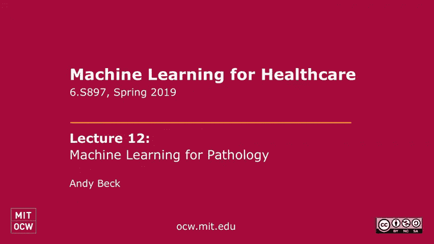
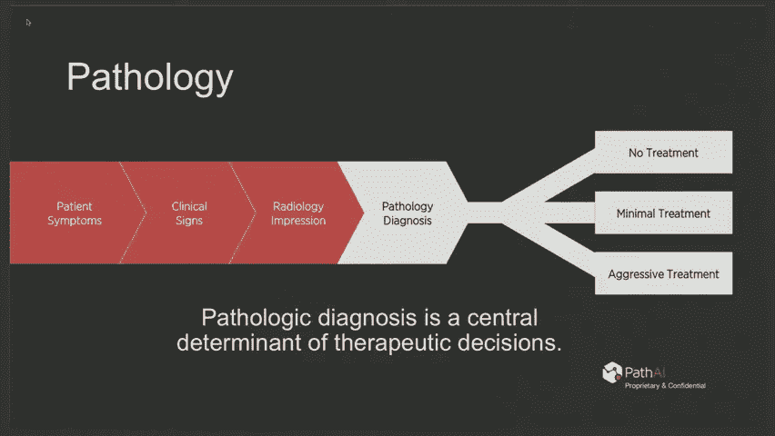
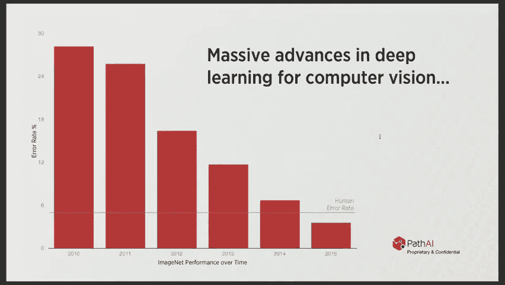
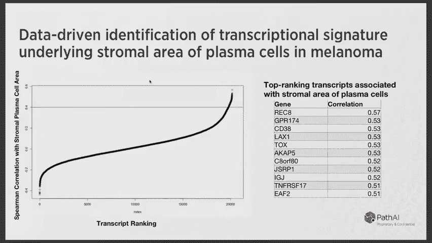
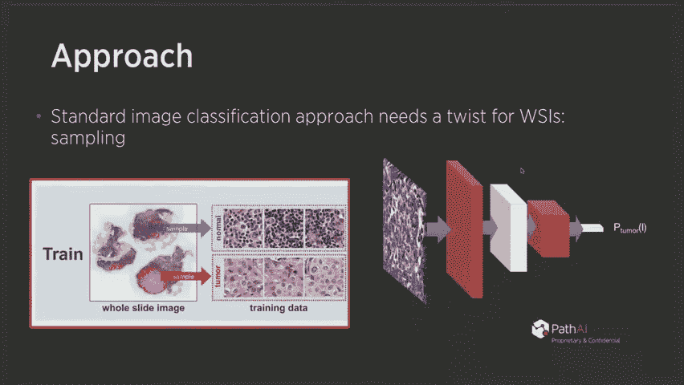
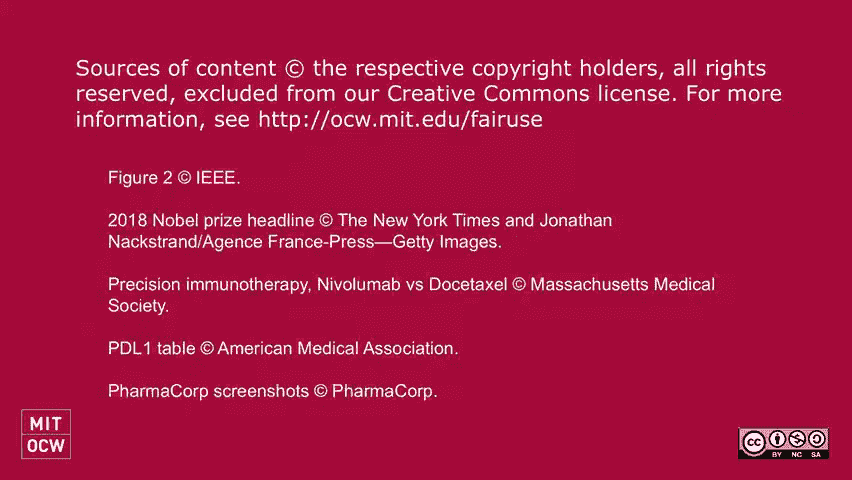

# P12：12.Machine Learning for Pathology - 大佬的迷弟的粉丝 - BV1oa411c7eD

所有的权利，每个人，所以我们很高兴安迪今天回来做我们的特邀演讲者，有着非常独特的背景，他既受过计算机科学家的训练，又受过临床医生的训练，专业是病理学，当他还是斯坦福大学的学生时。

他的论文是关于如何使用机器学习算法，真正了解当时的病理数据集，使用更传统的回归风格的方法来理解，这笔交易现在被称为计算病理学，但他的工作真的走在了这个领域的最前沿，从那以后他就来波士顿了，在最近几年。

她经营着一家叫Path AI的公司，这是我的，依我看，医学界最令人兴奋的人工智能公司之一，他是我最喜欢的受邀演讲者，每次演讲，我想你会对他要说的话很感兴趣，非常感谢，谢谢你邀请我，是啊，是啊。

我真的很兴奋能在这门课上发言，就像耶，对于机器学习和病理学来说，这是一个超级激动人心的时刻，如果你有任何问题，请随时询问，所以关于什么是病理学的一些背景，嗯，这就像，如果你是病人，你去看医生。

你知道我可以应用在整个轨迹的任何方面，我会在病理学上具体谈谈，但你去看医生，他们从你那里拿走一堆数据，就像你和他们说话一样，他们会有体征和症状，通常如果他们关心，可能是结构上的改变。

仅仅通过抽血是无法获得的，就像癌症一样，这是他们会送你去放射科的最大的事情之一，他们想去的地方，你知道的，放射学是获取数据寻找大的结构变化的最佳方法，所以在放射学中你看不到单个细胞，但你可以看到。

你知道在身体里，看到一些正在改变的大东西，为它做出评估，就像如果你咳嗽，你在看肺癌吗，还是说你得了肺炎放射科只能让你走这么远，人们对将人工智能应用于放射学感到非常兴奋。

但我想他们经常忘记的一件事是这些图像的数据并不丰富，与你知道的核心数据类型相比，我是说，这是我对病理学的偏见，但是放射学给了你一些方法，在那里你可以分诊正常的东西，放射科医生会对他们所看到的有一些印象。

通常这就是放射学报告的底线，你知道的，对癌症的关注，或印象可能是良性的，但不确定或印象完全良性，这也将指导随后的决定，但如果有人担心有什么严重的事情发生，病人经历了一个相当严重的手术，也就是组织活检。

所以病理学就像需要组织做什么，我要谈谈，也就是外科病理学，需要组织标本，也有基于血液的东西，但这是你知道你的诊断，你想说的是癌症不是癌症，这份报告本身可以真正指导随后的决定，这不可能是进一步的治疗。

或者你知道一个大手术，或者关于化疗和放疗的重大决定，所以这是你真正想要以最有效的方式合并数据的一个领域，减少错误，提高标准化，并真正为每个病人提供最佳治疗决定。

根据他们疾病的特点，病理学很有趣的一点是它是超级视觉的，这就像是一种随机抽样，病理学家每天看到的一些不同类型的图像，我认为这是吸引人们到专业的一件事，就是，你知道吗，我在放射学上说。

你看到的是可能发生的事情的印象，基于，你知道的，发送不同类型的图像并获取数据，试图估计发生了什么，而在这里，你实际上是在给组织碎片染色，用眼睛看，实际单个细胞，你可以在细胞内查看。

你可以看看细胞的数量是如何组织的，对于许多疾病，这仍然代表了定义正在发生的事情的核心数据类型，这是你知道的吗，预后严重的东西，需要，说手术，还是这完全是良性的，所有这些都是良性过程的不同方面。

所以正常的人体就会创造出所有这些不同的模式，然后有很多疾病的模式，这些都是不同的类型，具有不同形态的疾病亚型，所以有一种令人难以置信的丰富的不同的视觉图像，病理学家必须将其纳入诊断，然后在上面。

比如特殊的污渍，可以为传染病的特定生物体染色，基于药物靶点表达的亚型疾病蛋白质表达或特异性模式，这更增加了工作的复杂性，所以多年来，尝试应用人工智能真的没有什么新鲜事，或者机器学习或计算到这个领域。

它实际上是一个非常自然的领域，因为它是基于实验室的，这一切都是关于你作为输入的数据处理，像图像这样的东西并产生输出，什么是诊断，所以人们一直在尝试这个，你知道的，四十多年了，这是最早的研究之一。

试图看到，我们能训练一台计算机来识别癌细胞的大小吗，通过一个他们称之为形态测定的过程，然后我们能不能用癌细胞大小的测量，在一个非常简单的模型中预测结果，在这项研究中，他们有一个学习集，他们正在学习。

然后是一个测试集，他们表明他们的系统，正如每一篇发表的论文所表明的那样，你知道，比两种相互竞争的方法要好，尽管即使在这种最好的情况下，从学习到测试有显著的退化，所以一个是超级简单的。

它使用非常简单的方法，数据集很小，你知道，三八学习案例，40个测试用例，这发表在，你知道，柳叶刀，它是今天领先的生物医学杂志，然后人们对人工智能感到兴奋，这种人工智能建立在简单的方法上，回到1990年。

人们认为人工神经网络对定量病理学非常有用，出于显而易见的原因，但当时，真的没有办法以任何规模将东西数字化，这个问题最近才得到解决，但大概有两千人首先想到的是，你知道吗，一旦幻灯片是数字化的。

然后你可以应用计算方法，但什么都没变，在很大程度上仍然没有改变，我将谈到病理学的优势，但是正如前面提到的，我是第一批研究的一部分，真正采取更机器学习的方法来解决这个问题。

我们所说的机器学习与先前的方法是什么，就是使用数据驱动的分析来找出最好的特征，现在你可以用机器学习以更明确的方式做到这一点，但是从测量一两件事开始，在非常小的数据集上以非常乏味的方式，所以我会这样说。

我们正在使用一些传统的基于回归的机器学习来测量更多的特征，然后用这些联想之类的东西，将您的分析集中在最重要的特征上，这里具有挑战性的机器学习任务，病理学的核心任务之一是图像处理，那么我们如何训练计算机。

任何病理学家都想要的关于正在观察的东西的知识，你想训练计算机做一些基本的事情，也就是，比如说，确定癌症在哪里，间质在哪里，癌细胞在哪里，成纤维细胞，等，一旦你训练了一个基于机器学习的系统来识别这些东西。

然后你可以从图像中提取大量的定量表型，这都是利用人类，设计特征来测量正在发生的事情的所有不同特征，在图像中，机器学习在这里被用来创建这些功能，然后我们使用其他基于回归的方法将这些特征与临床结果联系起来。

在这项工作中，我们表明，通过采取数据驱动的方法，你开始关注肿瘤里发生的事情，微环境，不仅仅是在肿瘤本身，在过去的十年里，理解肿瘤与肿瘤微环境相互作用的方式，有点像癌症中最重要的事情之一。

像免疫肿瘤学这样的领域，是癌症治疗的最大进展之一，我们本质上只是调节肿瘤细胞啊，与周围的细胞相互作用，用传统的病理学方法是完全无法获得这种数据的，真的需要机器学习的方法来提取一系列特征，让数据自己说话。

这些特征中哪一个对生存最重要，在这项研究中我们展示了这些东西与生存有关，我不知道，如果你们在这里做了很多卡普兰·迈尔的阴谋，我们看过一次，但是好吧，带我们慢慢地经历它从来都不是，是啊，是啊，所以这些是。

我觉得有一种情节需要知道，对于大多数生物医学研究，可能是这个，而且非常简单，所以它实际上只是一个病人随着时间的推移如何做的实证分布，x轴就是时间这里的目标是建立一个预测模型。

我希望我在这里有一个预测性的，但我们可以谈谈那会是什么样子，但是一个预后模型，医学上任何疾病的任何预后测试，就是尝试创建显示不同生存结果的亚组，然后暗示他们可能从不同的治疗中受益，他们可能不会。

这并没有回答这个问题，但它只是告诉你，如果你想做一个估计，一个病人五年后会怎么样，你可以把它们分成两组，这是一种形象化的方式，你不需要两组，你甚至可以用一组来做到这一点。

但它经常被用来显示两组之间的差异，所以你会看到这里，有一条黑线和一条红线，这些是一组没有使用模型的患者，在这些情况下没有接受过训练，被训练来区分高风险患者和低风险患者，我们这样做的方式是。

我们对不同的数据集进行了逻辑回归，试图对诊断后五年活着的病人进行分类，与五年诊断死亡患者的比较，我们建立一个模型，我们把模型固定好，然后我们将其应用于大约250个案例的数据集，然后我们就问。

我们真的有效地创造了两组不同的患者，他们的生存分布明显不同，这个p值告诉你的是，这两条曲线来自相同底层分布的概率，或者这两条曲线在所有时间点上都没有差异，我们在这里看到的是，你知道的。

黑线和红线似乎有区别，在哪里说，十年，低危组的存活率约为百分之八十。在高危人群中，超过60%，总的来说，p值很小，因为这两条曲线之间有差异，所以这有点像，一个成功的卡普兰·迈尔情节会是什么样子。

如果你试图创建一个将病人分成小组的模型，不同的生存分布，然后呢，对于这些类型的事情，在多个数据集上尝试它们总是很重要的，在这里我们展示了，应用于不同数据集的相同模型。

在将患者分成两组时显示出非常相似的总体有效性，那么你为什么认为这样做可能有用，我猜，是啊，是啊，任何人，因为实际上，我认为这种类型的曲线经常与实际上非常有用的曲线混淆，我会说，是啊，是啊，你一定要等。

所有的权利，可能喜欢如果你用这个喜欢，有点像病人，有高风险的病人可能在五年后，如果病人有高风险，可能真的可以喜欢，做或重复跟进，你是对的，准确地说，是啊，是啊，是的，所以这将是一个很大的用处。

会是个问题，所以它在说，就像，如果有人在，如果你知道某人在五年前发生事件的风险很高，一个事件是当曲线下降时，所以红色组肯定是你知道的40个，你知道几乎是双倍什么的，黑人群体的风险。

所以如果你有某些干预措施，你可以做些什么来帮助防止这些事情，例如给予额外的治疗或更频繁地监测复发，比如如果你能做一个后续扫描一个月比六个月，你可以通过数据驱动的方式做出决定，知道病人是否在。

红色曲线或黑色曲线，嗯，所以是的，完全正确，它帮助你做出治疗决定，当你有一堆事情可以做的时候，要么给予更积极的治疗，要么对疾病进行更积极的监测，取决于它是侵袭性疾病还是非侵袭性疾病，另一种类型的曲线。

我认为经常与这些混淆，挺有用的，嗯，是一个直接测试干预的，所以本质上你可以做一个有用的试验，该算法的临床实用性，一方面你对每个人都做出预测，不要做任何不同的事情，另一个是你对病人做出预测。

你实际上用它来做决定，比如更频繁的治疗或更频繁的干预，然后你可以做一个曲线，说着，就像在高危患者中，我们实际上对其采取了行动，你知道那是黑色的，如果我们不采取行动，它是红色的。

然后如果你用正确的方式做实验，你可以推断你实际上防止了50%的死亡，如果你在做，如果干预导致黑对红，这里，我们没有做任何因果关系的事情，我们只是在观察病人随着时间的推移会有什么不同。

但你经常看到这些是这样的，这个图形，随机对照试验的关键人物，唯一不同的是，两组病人之间唯一不同的是干预，这真的让我做出了一个强有力的推论，改变了，应该注意什么，这个你就像OK。

也许我们应该做些不同的事情，但不太确定，但这是有直觉意义的，但如果你真的有随机对照试验中的东西，或者其他可以让你推断因果关系的东西，像这样是最重要的人物，你可以推断有多少人被拯救了，或者通过做某事。

但这次不是关于干预，它只是观察病人随着时间的推移是如何做的，这是八年前的一些工作，你知道，这些在实践中都没有真正改变，诊所里每个人都还在使用玻璃片和显微镜，研究是一个完全不同的故事。

但仍有99%的诊所在使用这些老式技术，你知道的显微镜，十八世纪中期的技术突破，18世纪晚期的染色突破，就像H和E染色是关键的染色，所以病理学方面根本没有进展，这有相当大的后果，这里有几种类型的数字。

可以让你看到，什么问题的原始数据，观察者间变异性，真的是在临床实践中，这只是另一个，我觉得真的很好，查看原始数据的经验方法，那里有一个基本的真理，专家们的共识，他们决定了这70个左右的病例是通过什么。

你知道专家总是知道正确的答案，对于这七十个人来说，他们都被称为ATA的范畴，这里用黄色表示，然后他们拿了所有这70个专家说是阿提亚的病例，把它们送到全国数百名病理学家那里。

为每一个人绘制了他们收到的不同诊断的分布，而且相当惊人，这发表在《美国医学会杂志》上，大约四年前的一本很棒的日记，现在他们显示了每个病例中不同诊断的惊人分布，所以这就是为什么你可能需要一种计算方法。

你知道应该有相同的颜色，这应该只是一个大颜色，或者是一些离群值，但几乎在任何情况下都有很大一部分人认为这是正常的，是黄色还是抱歉的棕褐色，然后是不典型的黄色，然后实际上是癌症，它是橙色的还是红色的。

非典型是什么意思，是啊，是啊，完全正常和癌症之间的边界是如此不典型，病理学家说不是，哪一个实际上是最重要的诊断，因为癌症通常什么都不做，你知道有很好的协议来做什么，乌托邦，他们经常过度对待。

这就是医学上的一种偏见，总是假设最坏的情况，我们得到了一定的诊断，所以ATIA有癌症的核特征，但它并不完全，你知道的，可能会得到十个标准中的七个或五个标准中的三个，它与原子核有关，看起来比预期的大一点。

更奇怪一点，但还不够，病理学家觉得称之为癌症很舒服，这也是为什么这几乎是一个掷硬币的原因，在那些，专家们称之为小费，只有48%的人在社区中得到同意，研究显示的另一个有趣的事情是内部观察者。

可变性和观察者之间的问题一样大，所以一个人不同意自己，八个月的观察期后的八个月，就像他们不同意别人一样，所以另一个，你知道，为什么计算方法有价值，为什么这真的是一个问题。

同一个研究小组显示了非常相似的结果，这篇文章发表在《英国医学杂志皮肤活检》上，这是另一个非常重要的领域，又在哪里，它们具有相同类型的数据可视化，他们有五种不同程度的皮肤损伤，从完全正常的良性痣，就像。

我肯定我们，我们很多人的皮肤上也有，就像黑色素瘤，它是一种严重的恶性肿瘤，需要尽快治疗的，这里的白色是完全良性的，深蓝色是黑色素瘤，他们再次表现出很多不和谐，和乳房活检一样糟糕，又在这里。

在八个月的观察期内，介绍观察者的变异性约为三个，所以人们有三分之一的时间不同意自己的观点，然后这些不像是完全异常的案例或一个研究小组，美国病理学家学院对116项研究做了一个大总结，总体得了18分。

所有研究的中位差异率为3%，和六大差异率，这就像是一个重大的临床决定，是错的，比如手术，不做手术，等等，那些在棒球场上，同意先前发表的调查结果，所以有很多悲观的理由，但你知道。

非常乐观的一个原因是人工智能不是，那个，或者可能是人工智能不完全的两三个区域中的一个，炒作是远见，就像视觉真的开始很好地工作，因为我不知道你是否上过这门课，但是在2012年有了像深度卷积神经网络。

然后所有的小组都一年比一年好，现在这就像是一张2015年的旧图表。

但是方法有了巨大的发展，即使从二十五年开始，在你知道的地方，现在，我想我们真的明白这些方法的优点和缺点，病理学有很多优势，定义得非常好，非常集中的问题，我认为无论你尝试什么更普遍的东西，都会有很多失败。

但对于你确切知道自己在寻找什么的任务类型，你可以生成训练数据，这些系统可以很好地工作，所以这是我们关注的很多道路，艾是，我们如何从病理图像中提取最多的信息，真正做两件事，一个是理解图像内部的内容。

第二个是使用深度学习直接，试着推断病人的水平，直接来自图像的表型和结果，我们使用传统的机器学习模型来解决某些问题，比如，特别是在病人层面上做出推断，其中n通常很小。

但是任何直接作用于图像的东西几乎都是某种变体，总是深卷积神经网络，这确实是图像处理的最新技术，我们有很多关于冷漠症的想法，我认为对于医学来说，毫升的这一领域真正重要的是什么，正在生成正确的数据集。

然后使用像深度学习这样的东西，以数据驱动的方式优化所有特性，然后真正思考如何智能地使用这些模型的输出，并以一种健壮的方式真正验证它们，因为有很多方法可以被文物和其他东西愚弄，所以只是一些不赘述的要点。

但是为什么这些方法在这个应用程序中真的真的很有价值，它允许你详尽地分析幻灯片，所以一个病理学家，他们犯这么多错误的原因，他们只是有点不知所措，我是说有两个原因，一个是人类不擅长解释视觉模式。

我其实认为这不是真正的原因，因为人类很擅长这个，有困难的事情，人们可以不同意，但就像当人们专注于小图像时，经常，他们同意，但这些图像是巨大的，人类只是没有足够的时间仔细研究，每张幻灯片上的每个单元格。

而计算机在一个真正的方式，可以被迫详尽地分析每张幻灯片上的每个单元格，这是一个巨大的区别，这是定量的，我是说这是电脑绝对更擅长的一件事，能计算出巨大的分子，巨大的分母和精确计算的比例。

而当一个人看着幻灯片时，他们真的只是盯着一些百分比，基于极少量的数据，超级高效，所以你可以分析整个过程是大规模并行的，所以你几乎可以想滑多快就滑多快，根据你愿意在上面花多少钱。

它不仅允许你完成所有这些自动化任务，穷尽，定量和有效地，也从数据中发现了很多新的见解，我想我们早在八年前就这么做了，当我们有人类提取的特征，将这些与结果联系起来，但现在你可以用机器学习来监督整个过程。

你如何从图像的组成部分到病人的结果，学习新的生物学，你知道你不知道进去，每个人都喜欢，嗯，你只是要取代病理学家，我真的不认为这是任何方式，几乎每个领域的未来，这有点像，嗯，自动化变得非常普遍。

对这方面专家的需求正在增加。就像飞机飞行员一样是我今天刚学的一个，就像他们，你知道他们只是做了一件与20年前完全不同的事情，现在这一切都是关于这个大系统的任务控制，了解所有的飞行管理系统。

了解他们得到的所有数据，我认为工作并没有变得更简单，但他们更有效，他们做着不同类型的工作，我不认为病理学家会从某种程度上，盯着显微镜，把非常短视的注意力集中在一件非常小的事情上，更像是医生的顾问。

整合了许多不同类型的数据。

人工智能真的不擅长很多关于具体情况的推理，然后向医生提供指导，所以我想这份工作看起来会有很大不同，但我们在未来从来没有像过去那样真正需要更多的诊断学家，所以一个例子，我想我们已经发出了关于这个的读数。

乳腺癌转移的概念是机器学习的一个很好的用例吗，这就像一个病人的例子，所以发现了一个原生质量，所以说，当原发肿瘤预后的一个重要决定因素是，扩散到淋巴结了吗，因为那是肿瘤首先转移到的区域之一，嗯。

以及肿瘤是否转移淋巴结的诊断方法，做一个活检，然后评估这些是否存在癌症，不该在的地方，这是一项任务，你知道的，非常定量，非常乏味，所以国际生物医学成像研讨会组织了这次挑战，叫做变色龙十六挑战赛。

在那里他们制作了近300张训练幻灯片，和大约130张测试幻灯片，他们要求一群团队建立基于机器学习的系统，嗯，自动评估测试幻灯片，两者都能诊断幻灯片是否含有癌症，以及在幻灯片中确定癌症的位置。

这是一个很大的机器学习挑战，为什么你不能把它扔进一个，你知道的，现成的或类似的网络上的图像分类工具是一种，图像太大了，你知道，把整个图像扔掉是不可行的，嗯进入任何类型的神经网络，因为他们有。

它们可以在一边有2万到20万像素，所以它们有数百万像素，嗯，为此，你知道的，我们做这个过程，从一个标记的数据集开始，那里有这些非常大的区域，要么标记为正常，要么标记为肿瘤，然后我们建立程序。

这实际上是让机器学习良好工作的关键组成部分，对图像的补丁进行采样，并将这些补丁放入模型中，和，这个采样过程实际上对于控制系统的行为非常重要，因为你可以用各种不同的方式取样，你永远不会详尽地取样。

仅仅因为有太多可能的补丁，所以思考正确的例子，展示系统，对系统的性能和通用性都有巨大的影响，你在建造，我们学到的一些见解是，如何最好地进行采样，但是一旦你有了这些样本，都是数据驱动的。

一定要多谈谈抽样策略，是啊，是啊，所以从高层来看，嗯，你想从随机抽样，这是一件合理的事情，在了解计算机需要了解更多信息的基础上进行更智能的采样，我们做了一件事，所以这有点像计算它，所以第一步很简单。

你可以随机抽取，但第二部分更难弄清楚示例是做什么的，您想丰富您的培训集，以便使系统性能更好，你可以为此优化不同的东西，所以这有点像整个取样，实际上，成为机器学习过程的一部分是非常有用的，你不只是要取样。

一旦你可以在上面迭代并继续提供不同类型的示例，例如，如果您了解到它缺少某些类型的错误，或者它还没有看到足够的确定，有很多种方法可以得到它，但就像，如果你知道它在你的训练集中没有看到足够多的例子。

你可以多取样，或者如果你看到你知道你有一个混乱矩阵，你看到它在某些类型上失败了，你可以试着弄清楚为什么它在这些方面失败了，并改变取样程序以丰富其内容，你甚至可以为人类提供输出，你能认识谁。

指出它犯错误的地方，因为你通常没有详尽地标记，在这种情况下，我们实际上已经详尽地标记了，嗯幻灯片，所以它更容易，但你可以看到，在不同的阶级中甚至有很多异质性，所以你可能会做一些聪明的把戏来弄清楚。

红色阶级的类型是什么，我该如何通过提供更多的例子来解决这个问题，所以我认为这是更容易控制的事情之一，而不是试图调整别人，你知道的，这些超复杂网络中的参数，根据我们的经验，只是玩训练取样，训练的抽样件。

它几乎应该被认为是优化的另一个参数，当你处理一个有巨大幻灯片的问题时，你不能使用所有的训练数据，几十年前，我遇到了一些病理学家，他们正在研究宫颈癌筛查，他们认为你可以检测到IA度的梯度。

所以不是训练时间，而是一个考验的时刻，他们试图做的是遵循这个梯度，为了找到最正确的部分，是的，这仍然被认为是真的吗，是的，这是一个连续体，是啊，是啊，是啊，是啊，肯定是你的意思是在样品中，它是，是啊。

是啊，我是说，你知道的，我是说像利用我这样一个连续的侵略性，是啊，是啊，我认为这是一个连续体，我是说这更像是一个二元任务，但癌症内部会有等级的连续体，我是说这是另一个层次的增加。

如果我们想把这和结果联系起来，这样做肯定是有价值的，不仅仅是说定量肿瘤的体积，而是要估计每一个细胞核的恶性程度，我们也可以这样做，所以你实际上可以分类不仅仅是肿瘤区域，但是你可以对单个细胞进行分类。

你可以根据恶性肿瘤对它们进行分类，然后你可以得到种群中的梯度，在这项研究中，它只是一个基于地区的，不是基于单元格的，但你绝对可以做到，绝对是一个，这是一个光谱，我是说这有点像是。

生物学中的一切都像是在一个光谱上，从正常到不典型再到低度癌症，中度癌症，高级癌症，这些方法确实允许你，更精确地估计你在这个连续体中的位置，这是基本的方法，你知道吗，我们得到了整个网站的大图像。

我们知道如何从不同的区域取样，在训练时间和测试时间优化模型的性能，只是我们拍了一个大的整个侧面的图像，我们把它分成数以百万计的小补丁，单独发送每个修补程序，我们实际上并不。

你可以潜在地使用空间信息来了解它们之间的距离，这将降低这一过程的效率，我们不那样做，我们只是把他们单独送进去，然后将输出可视化为热图，所以说，我想这不在我发送的参考资料中，所以我送的那个。

展示了如何结合深度学习系统的估计，与人类病理学家的估计，使人类病理学家的错误率降低85%，喜欢一个不到百分之一，有趣的是，这些系统是如何随着时间的推移而变得更好的，他们可能过度适应竞争数据集。

因为我想我们可能提交了三次，不是很多，但是嗯，在喜欢的过程中，人们不断竞争，使系统变得更好，实际上，这个数据集上的全自动系统实现了不到1%的错误率，按最后提交日期排序，这明显优于病理学家和竞争对手。

这是我相信在最初的档案文件中引用的错误率，他们还拍了同一套幻灯片，并把它们送到临床实践中的病理学家那里，嗯，他们的错误率明显更高，主要是因为，他们在临床实践中比在比赛中更受时间限制。

他们犯的大多数错误都是假阴性，简单地说，他们没有时间关注转移的小区域，在这些巨大的千兆像素中，在报纸上你说你把机器输出和病理学家结合起来，但是是的，他们已经会说如何耶，热图的数据，或者没有任何组合。

是的，我知道这是个很好的问题，所以今天我们就这样做，这就是临床实践中的方法，我们正在建造它，病理学家会检查两者，然后根据两者的结合为比赛做出诊断，他们在那里很简单，组织者真的做到了。

他们独立地解释了它们，所以病理学家只是看了所有的幻灯片，我们的系统做出了预测，它实际上就像幻灯片包含癌症的概率的平均值，这成为了最后的分数，然后Auc从任何东西中获得了99%，综合这两个分数是92%。

它们使不相关，几乎没有什么不相关的，尤其是因为病理学家往往有几乎所有的假阴性，和深度学习系统，你知道的，往往会被一些东西愚弄，比如艺术品，他们确实会犯不相关的错误，这就是为什么性能有很大的提升。

所以我提到了这个，但是这些计算数据集中的任何一个都是相对容易得到的，人们已经证明，你实际上可以建立模型，只预测一个数据集，比如使用深度学习，像深度学习，几乎太擅长寻找某些模式了，可以找到神器。

所以这只是一个警告要记住，我们在许多现实世界中做实验，像这样的方法的测试，在许多实验室里，有许多不同的染色程序和组织准备程序，等，评估鲁棒性，但这就是为什么比赛结果，即使是金雀花王朝也总是需要半信半疑。

然后我们但我们认为这将是巨大的价值，我是说很难说，因为这是一个很大的形象，但这是今天病理学家在显微镜下观察的，很难看到任何东西，用一个非常简单的可视化，人工智能系统的输出只有一部分是红色的，癌症。

看起来是的，这显然是一张很好的地区地图，他们需要确保专注于，这是本例中的真实数据，这个鲜红的区域，事实上，它含有转移性乳腺癌细胞的微小边缘，很容易错过，没有那个助手只是给你指正确的地方看。

因为这是一套很小的，你知道的，在一大堆正常淋巴细胞中的20个细胞，这是另一个，现在你可以从低功耗上看到，就像卫星图像一样，或者你可以立即专注于这个红色的小区域，这又是一个小口袋，就像十个癌细胞。

在成千上万的正常细胞中，现在可以从低功耗中看到，这是我们正在开发的一个应用程序，临床用例将在哪里，你知道今天人们只是在没有任何机器学习帮助的情况下看图像，他们只需要选择一些补丁来专注于，没有指导。

所以有时他们专注于正确的补丁，有时他们不，但很明显，他们没有时间在高倍率下看这一切，因为那要花一整天的时间，如果你想把整个图像放大4倍，所以他们用直觉来集中注意力，因为这个原因，他们最终。

因为我们已经看到犯了大量的错误，它是不可复制的，因为人们关注图像的不同方面，这是相当缓慢的，他们面临着这份空洞的报告，所以他们必须在报告中总结他们所看到的一切，比如诊断是什么，尺码是多少？就像。

假设这里有癌症，这里有癌症，他们必须手动添加这两个区域的癌症距离，然后他们必须把这个放进一个分期系统，包括有多少转移区域以及它们有多大，就像所有这些事情都是自动化的，这就是我们正在建造的东西。

系统将突出显示的地方，它看到癌症的地方，告诉病理学家把注意力集中在那里，然后根据AI系统的输入，病理学家的输入可以总结所有的数据，定量的和诊断的，以及总结阶段之类的。

然后病理学家把这作为他们报告的第一个版本，他们可以编辑它，确认一下，把它签了，数据回到系统中，将来可以用于更多的训练数据，箱子签好了，所以它要快得多，更加准确和标准化，你知道的。

一旦这个东西完全开发出来，现在还不是，所以这是人工智能的一个很好的应用，因为你真的需要，你确实有大量的数据，所以你需要做一个详尽的分析，有很多，这是一项任务，在补丁中的本地图像数据。

这正是当前一代深度CNN真正擅长的，就足够了，所以我们在细胞水平上观察事情，放射学实际上可能更难，因为你经常想在这里总结更大的区域，你真的经常在补丁中有突出的信息，在当前的ml系统中确实是可伸缩的。

然后我们可以解释模型的输出，所以真的不是，即使模型本身是一个黑匣子，我们可以在图像顶部可视化输出，这给了我们难以置信的优势，在模型做得好的可解释性方面，他们做得不好的地方，这是病理学的一个专业。

百分之八十还不够好，我们想尽可能接近100%，嗯尽可能，这是一种诊断应用程序，我要举的最后一个例子，与精准免疫治疗有关，我们不仅试图确定诊断是什么，但实际上亚型患者，预测正确的治疗方法。

正如我前面提到的，免疫治疗真的很重要，也很令人兴奋，相对较新的癌症治疗领域，这是2012年的另一个大进步，大约在你知道的同一时间，深度学习问世，最初的研究表明，靶向一种蛋白质，主要是肿瘤细胞。

也对免疫细胞，pd蛋白或pd l蛋白，当蛋白质打开时，它的作用是抑制免疫反应，但在癌症的背景下，免疫反应的抑制实际上对病人不利，因为免疫系统的工作是真正努力抵抗癌症。

所以他们意识到了一个非常简单的治疗策略，只要有抗体，与这种抑制信号结合，可以释放病人自己的免疫系统，最终治愈非常严重的晚期癌症，右上角的图像，有点像这个病人有一个非常大的黑色素瘤。

然后他们就用这种抗体来靶向，重新激活他们的免疫系统，然后肿瘤真的缩小了，也是评估的主要生物标志物之一，患者将从这些治疗中受益的是肿瘤细胞，或者表达这种药物靶点的免疫细胞，PD一还是PD一。

他们测试的是PDL一号，它是PD-1受体的配体，所以这通常是决定谁接受这些治疗的关键数据，事实证明，病理学家很不擅长评分，毫不奇怪，因为这很难，每个病例可能有数百万个细胞。

他们显示出观察者之间的一致只有8。6分，在肿瘤细胞上打分，这还不错，但在免疫细胞上得分第二分，这是非常重要的，所以这是一个我们试图测量的药物靶点，哪些病人可能会得到这种救命疗法，但我们的诊断很难解释。

因此一些研究显示了关于它有多有价值的喜忧参半的结果，在某些情况下，它似乎很有价值，在其他情况下，似乎不是这样，所以我们希望看到。

你知道的，这可能是我们可以使用机器学习的一个很好的例子吗，对于这种类型的应用程序，这真的很难，我们希望能够应用它，不仅仅是一种癌症，但就像20种不同的癌症，所以我们在Path AI建立了一个系统。

用于大规模地生成大量的训练数据，这是像比赛一样的比赛不会让你得到的东西，就像那个比赛的例子有300张幻灯片，你知道他们每年做一次，但我们希望能够建立这些模型，你知道每周什么的。

所以我们现在有大约500名病理学家登录我们的系统，我们可以用来为我们标记大量的病理数据，快速高质量地建造这些模型，所以现在我们在系统中有超过250万个注释。

这使我们能够建立组织区域模型，这是癌症的免疫组织化学，在那里我们训练了一个模型来识别所有红色的癌症上皮，绿色的癌症间质，所以现在我们知道了蛋白质在上皮中的表达位置，或者在间质里。

然后我们还训练了细胞分类，所以现在对于每一个细胞，我们把它归类为细胞类型，是癌细胞吗，或者纤维爆炸，或者巨噬细胞或淋巴细胞，它是根据蛋白质的棕色程度来表达蛋白质的吗。

所以虽然病理学家会试着对整个幻灯片做出一些估计，我们实际上可以计算每个细胞，然后计算出哪些细胞表达这种蛋白质的精确统计数据，哪些病人可能是治疗的最佳候选人，然后问题是，你知道的。

我们能识别出PDL之外的其他东西吗，一种预测免疫治疗反应的蛋白质表达，我们已经开发了一些机器学习方法来做到这一点，它的一部分是做事情，比如在H和E图像上量化不同的细胞和区域。

目前在病人分型中根本没有使用，但我们可以做分析，在这里提取新的特征，并询问，尽管对这些图像和免疫治疗反应一无所知，我们能在这里发现新的功能吗，这将是我们现在可以量化的特征类型的常规例子。

使用深度学习在任何情况下提取这些特征，这有点像你能想象到的每一种病理特征，然后我们将这些与药物反应联系起来，并可以将其作为一种发现工具来识别病理学的新方面，预测性的，其中患者反应最好。

然后我们可以将这些特性组合成模型，这是一个可笑的例子，因为它们是如此不同，但这将是一个例子，其中模型的输出，这完全是假数据，但我想说重点就在这里，颜色表示处理，绿色是免疫疗法，红色是传统的治疗方法。

目标是建立一个模型来预测哪些病人从治疗中真正受益，所以这可能是一个简单的问题，但如果模型起作用了，你觉得呢，右边图表的标题和左边图表的标题是什么，如果我们，这些是用我们的模型对病人进行分类的方法。

分类将是响应者类或非响应者类，颜色表示药物，这是正确的，但是模型的输出是什么，但你是对的，对这些图表的解释是工作，不管用，这是个棘手的问题，是的但我们的模型试图预测，这个人到底会不会死，或者看起来像。

你知道可能性，死亡只是在右边没有那么高，我认为这两张图上的总体可能性是一样的，右对左，你不知道每只手臂上有多少病人，但我认为其中的一部分，所以绿色是实验性处理，红色是常规治疗，也许我已经说过了。

所以在这里，这有点像一个读心术式的问题，但在这里，模型的输出将是对药物的反应，会是合适的病人，左边的分类对药物没有反应，所以你实际上并没有说任何关于预后的事情，但你是说，我预测。

如果你在合适的病人群体中，你会从蓝色药物中受益，然后你实际上看到在这个正确的病人群体中，蓝色的药效果很好，然后红色药物是我们认为我们预测会从药物中受益的病人，但因为这是一个实验。

我们没有给他们正确的药物，事实上，他们做得更糟，而左边的那个，我们是说你没有从药物中受益，他们真的没有从药物中受益，所以这是使用模型输出来预测药物反应的方法，然后想象它是否真的有效。

这有点像我之前谈到的例子，但这里就像它的真实版本，你可以直接用机器学习来学习，我想找到真正从药物中受益最大的病人，然后我们如何验证我们的模型是正确的，我是说我们有两种不同的方法，一个是做这样的事情。

所以我们建立了一个模型，你知道的，对药物的反应，对药物没有反应，然后我们绘制帽迈拉曲线，如果它的图像分析，我们要求病理学家手工标记许多细胞，我们把病理学家的共识作为我们的基本真理，从那里开始。

你呈现它的方式，它是这样的，听起来好像所有的数据都来自技术图像，或者你知道的各种临床数据，那么你怎么，是啊，是啊，我是说，病理数据的美妙之处在于，它总是可用的。

所以这就是为什么我们做的很多事情都集中在这一点上，因为像每个临床试验病人一样，都有治疗数据，结果数据和病理图像，所以我们真的可以很快地大规模地做到这一点，很多其他的东西是像基因表达，很多人都在收集它们。

比较这两个基线或将它们集成是很重要的，我的意思是两件事，一个是将其与基线进行比较，就反应者而言，我们能预测什么，无应答者，只使用病理图像，与只使用基因表达数据相比，与组合它们相比。

这只是增加了输入功能空间，部分输入特征空间来自图像，一部分来自基因表达数据，然后你使用机器学习来关注最重要的特征并预测结果，另一个是如果你想优先考虑，比如用病理学作为基线，因为每个人都有。

但就像一个辅助测试，又要花一千块钱，可能还需要两个星期，比如这给预测增加了多少，嗯，这将是另一种方式，所以我认为这很重要，但是我们平台上的许多技术开发都集中在，我们如何最有效地利用病理学。

当然可以添加图像基因表达数据，我实际上要谈谈下一个做这件事的方法，因为这是一种非常自然的协同作用，因为它们告诉你非常不同的事情，就像这里的一个集成的例子，就和这个问题有关。

基因表达数据与癌症基因组恶意的图像数据，这都是公开的，所以他们有病理图像，rna数据，临床结局，他们没有最好的治疗数据，但它是方法开发的好地方，用于癌症的um ml，包括病理类型分析。

所以这是一个黑色素瘤的病例，我们训练了一个模型来识别癌症、间质和所有不同的细胞，然后我们提取出你所看到的数百个特征，然后我们可以根据这些特征与存活率的相关性对它们进行排名。

所以现在我们从病理图像到结果数据，我们发现以一种完全数据驱动的方式，有一些小的15个特征与生存密切相关，其余的都不是，排名第一的是免疫细胞特征，与存活率增加有关的基质浆细胞面积增加，这是一个分析。

真的只是把图像和结果联系起来，然后我们可以好好问，这种病理背后的基因是什么，所以病理学告诉你细胞和组织。

rnas告诉你实际的转录景观，下面发生了什么，然后我们可以对基因组中的所有基因进行排名，仅仅通过它们与我们测量的数量表型的相关性，病理图像上，这里是所有从零到两万的基因，我们再次看到一个小集合。

我们正在阈值，以第四点的相关性，与我们测量的病理表型密切相关，然后呢，我们发现了这些已知高度富集的基因，在免疫细胞基因中，某种程度上，这是我们正在测量的某种形式的验证，我们认为我们在测量什么。

但这组基因也是潜在的新药靶点，新诊断，从临床结果到病理数据，到底层RNA签名，然后是我们正在研究的方法的美妙之处，它是超级可扩展的，你知道，理论上，您可以将其应用于所有TCGA或其他数据集。

并将其应用于癌症类型，做一些事情，比如找到，自动，在所有幻灯片中找到工件，嗯，在百老汇这样做，然后最有趣的部分，潜在地分析模型的输出，以及它们如何与药物反应或潜在的分子图谱相关联。

这就是我们正在努力的过程，我们如何从图像到测量疾病的新方法，病理学，总而言之，我认为今天最重要的许多技术开发，让ML在现实世界中很好地工作，用于医学应用，很重要的是要非常体贴，关于构建正确的训练数据集。

以及如何以可伸缩的方式做到这一点，甚至以一种结合机器学习的方式，这就是我之前说的，就像聪明地挑选补丁，但这种概念在任何地方都适用，所以我认为几乎有更多的创新空间，在定义训练数据集方面比在预测建模方面。

或者我想，然后把两者放在一起是非常重要的，嗯，对于我们正在做的工作，图像处理已经有了很大的进步，这在很大程度上是关于工程和可伸缩性的，以及严格的验证。

然后我们如何将它与潜在的分子数据以及临床结果数据联系起来，而不是试图解决许多核心视觉任务。

在过去的几年里，已经取得了令人难以置信的进展，在我们的世界里，我们经常思考的事情，不仅仅是技术和把正确的数据集放在一起，我们如何为合作伙伴提供强有力的商业案例，我们正在与，真正改变他们正在做的事情。

结合一些新的方法，真正给病人带来好处。

他们诊断的质量和准确性，所以总而言之，我知道你四分钟后就要走了，这一直是个老大难问题。尝试将人工智能应用于诊断或视觉任务并不新鲜，但在过去的五年里有一些非常大的不同即使在我的，短暂的职业生涯。

我看到这个领域发生了翻天覆地的变化，一个是数字数据的可用性，现在按比例生成大量图像要便宜得多，但更重要的是，我觉得，是最后两个，即访问大规模计算资源，对于任何可以访问云计算或大型计算资源的人来说。

它都是一个游戏规则的改变者，只是我们都可以访问一种任意的计算，今天和十年前，这是这个领域的一个巨大限制，以及这些真正重要的算法进步，尤其是在深度CNN中，总的来说，人工智能工作得非常好。

当可以定义问题以获得正确类型的训练数据访问时，大规模计算，以及实现像深度CNN这样工作得很好的东西，它在其他地方都失败了，这可能是你知道98%的事情，但如果你能在算法实际工作的地方制造一个问题。

你可以有很多数据来训练，他们可以很好地成功，这种基于视觉的人工智能病理学，它广泛适用于病理学中所有基于图像的任务，它确实支持与组学数据等东西的集成，基因组学，转录组学，剪断，数据，等等，嗯。

在不久的将来，我们认为这将被纳入临床实践，即使在今天，它也是许多研究工作的核心，嗯，它将以1987年的一句名言结束，在未来人工智能有望成为病理学实践的主要内容，我想我们比三十年前更亲密了。

我想感谢Path AI的每一个人，还有亨特，他真的帮助制作了很多这些幻灯片，我们确实有很多机会给机器学习工程师，软件工程师，在艾路等，所以如果你有兴趣了解更多，一定要联系，如果你有时间。

我很乐意回答你的任何问题，所以谢谢你，是啊，是啊，所以我认为通常都很有侵略性，我想知道这些系统是如何喜欢物理练习的，fda，或者是的，什么是这样我的意思是，实际临床实践，大概二二十个。

就像20世纪20年代中期，嗯，我的意思是，今天它在临床研究中非常活跃，所以像临床试验等等，确实涉及病人，但它是在一个更明确的设置中，但是第一个临床用例，至少我们正在建造的东西类型将是，我想一年后。

我想它会从小开始，然后逐渐变大，所以我不认为会一下子什么都有，在临床上的转变，但我确实认为我们会开始看到第一批申请，他们会去，他们中的一些人会通过食品和药物管理局，会有一些实验室开发的测试。

我们的将通过食品和药物管理局，但是实验室本身实际上可以自己验证工具，那是另一条路，你一直在使用观测数据集吗，你举了一个例子，你试图，随机对照试验的数据，或者会尝试使用不同疗效的不同治疗方法。

这门课的下一个主要部分是什么，大约两周后开始，将是关于因果推断，观测数据，是啊，是啊，我想知道艾有什么事情要做吗？到目前为止，你的发现是什么，所以我们把注意力集中在随机对照试验数据上，并为此开发了方法。

这简化了问题，让我们可以做，关于如何生成这些类型的图表，我认为很聪明的事情，我在展示你真正可以推断的地方，治疗正在起作用，我们做的要少得多，我对此超级感兴趣，我认为rts的优点是。

人们已经投入巨资建立这些精心策划的数据集，包括图像，分子数据，可用时，治疗和结局，就像，这是因为他们投资于临床试验，他们投资了给我生成数据集，观测方面的巨大挑战，有几个我对你们正在做的事情感兴趣。

并了解它是获取数据并不容易，对呀，比如结果数据没有将病理图像与结果数据联系起来，在我看来，甚至在观察的方式上比在RCT上更难，因为他们实际上是在做这件事，为它付费，并在RTS上收集它。

没有人真的把TCGA做得很好，会是个玩的好地方，因为那是观测数据，我们也想把重点放在可操作的决定上，在RCT中是完美的设置，就像我给药物X还是不给，所以我想如果你把正确的数据集放在一起。

并以某种方式使结果可操作，它可能真的真的很有用，因为有很多数据，但我认为仅仅收集结果并将它们与图像联系起来实际上是相当困难的，讽刺的是，我想观察起来更难，而不是随机临床试验，他们收集它。

我想一个例子会像护士的健康研究，或者这些大的流行病学队列，他们可能在收集数据并组织它，但你在想什么，你做任何与病理学有关的事情，从观察数据中推断因果关系，我想你喜欢护士学习的例子或者弗雷明汉。

在那里你跨时间跟踪病人，他们得到了不同的干预，因为这项研究的设计方式，事实上，随着时间的推移，甚至有好的结果变化，所以测量的问题不会发生在那里，是的，但是假设您要从文件库获取数据，做病理。

现在你得到样本，然后你可以问一下嗯，不同的干预或治疗方案对结果的影响是什么，是啊，是啊，非常强的推论的挑战，有偏见和做食物，不想治疗，是啊，是啊，这就是我们在课堂上谈到的技术的方块，会变得非常重要。

但是是的，我想我很感激你提到的挑战，我认为它非常强大，我想我想到的另一个问题是治疗方法随着时间的推移变化如此之快，所以你不想过度适应过去，你知道就像，但我觉得，在某些情况下，今天的治疗决定与过去相似。

还有其他领域，如免疫肿瘤学，在那里没有历史可以借鉴，所以我想这取决于好吧。

