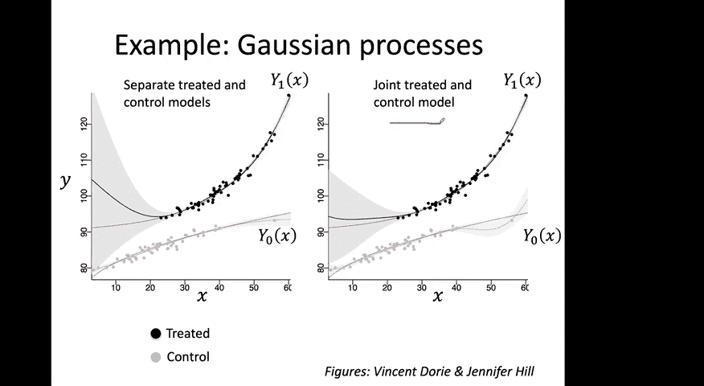
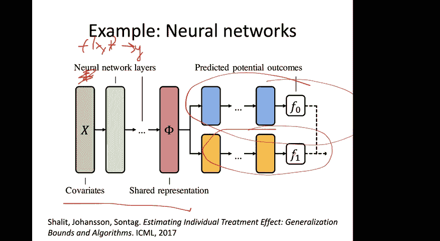
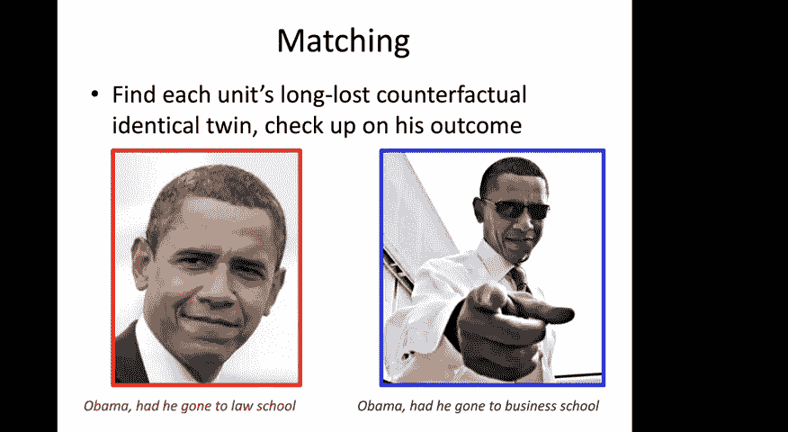
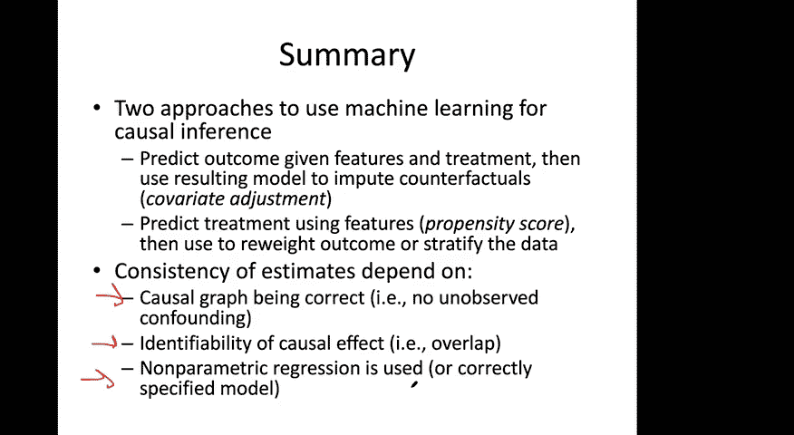

# P15：15.Causal Inference, Part 2 - 大佬的迷弟的粉丝 - BV1oa411c7eD

所以今天的讲座将继续，在周二的讲座上，它向你介绍了因果关系，所以因果推理设置，就是我们，呃，我们在这门课中学习的，是一个非常简单的，从因果图的角度，有三组感兴趣的变量，你所知道的关于个人或病人的一切。

我们在这里叫X，今天的讲座，我们将假设它要么是零，要么是一，所以二元干预，你要么接受，要么不接受，结果是Y，是什么让理解干预对结果的影响这个问题变得具有挑战性，我们必须从观测数据中做出推断。

在我们没有能力的地方，至少在医学上不是，我们通常没有能力进行干预，积极介入，以及我们在本课程中将要讨论的目标，是关于如何从医学实践中收集数据，采取行动或干预的情况，然后用它来推断因果效应。

显然也有随机对照试验，其中一个故意随机化，嗯，但是今天讲座的重点是使用观测数据，已经收集的数据试图做出这些结论，所以我们在周二介绍了潜在结果的语言，潜在结果是试图回答这些问题的数学框架。

然后根据潜在结果的定义，我们可以定义条件平均处理效果，也就是说，对于单个x来说，y 1和y之间的差是零，我嗯，所以你会注意到我有耐心，所以嗯，将潜在的结果视为随机变量，以防可能有一些随机性，它起作用了。

有时不会，所以这就是期望，在我继续前进之前，说明任何问题，因此，关于有条件平均治疗效果的定义，然后你可以问人口的总体情况，你可以计算出，通过取所有个体的条件平均治疗效果的平均值，所以这只是这种期望。

关于现在x的p，现在关键的是这个x的分布p，你应该把你的数据中存在的每个人的分布，所以其中一些人可能在过去接受过治疗，他们中的一些人可能是免费接受零治疗的，但是当我们问这个关于平均治疗效果的问题时。

我们要求这两个人口，会有什么影响，如果他们接受了治疗会有什么不同，减去他们接受的治疗为零，我想借此机会开始从更大的角度考虑，关于因果推理是如何，呃，玩，呃，它在各种社会问题中都很重要，所以我想。

现在花几分钟和你一起思考一些因果问题可能是什么，我们迫切需要回答关于Covid-19大流行的问题，当你试图思考这些问题时，我想让你记住这个因果图，对呀，所以有普通人群，有一些动作要执行。

因果关系的整个概念，评估就某些有关结果采取的有效行动，所以在试图回答我的问题和我的问题的各种答案时，一些所谓的推理，与当前大流行病有关的问题，我想让你试着用这些X来框定你的答案，T's和Y's，嗯。

显然也很难回答，使用我们将在本课程中讨论的技术类型，部分原因是我所关注的技术在很大程度上是数据驱动的技术，也就是说，我的一般框架，我在周二介绍了协变量调整，想出一个模型，并使用该模型做出预测。

以及作为基础的假设，那个模型是从哪里来的，如果你从数据中拟合参数，必须有共同的支持，为了能够，嗯，对下游的结论有任何信任，这些基本假设和一般前提仍然成立，但在这里，很明显，当涉及到社交距离之类的事情时。

它们是复杂的网络效应，所以，而到目前为止，我们一直在假设所谓的SATVA，这是一个嗯，假设我嗯，我可能在周二的课上都没有谈到，嗯，但直觉上，苏瓦假设是怎么说的，你的每个训练例子都是相互独立的，当你想到。

你知道的，给病人和药物与否，但当你想到社交距离类型的措施时，这肯定是没有意义的，在哪里，如果有些人社交距离，但其他人不会，它显然对社会有非常不同的影响，所以人们需要不同类型的模型来思考这个问题。

必须放松这种假设，所以这些都是对我的很好的回答，呃，回答我的问题，从某种意义上说，现在，这是我们上次谈到的流行病学类型的问题，但是最初的几个问题，如何治疗患有Covid-19的患者。

是我们现在才能真正开始回答的问题，不幸的是，因为我们开始在美国和国际上获得大量数据，例如，我自己的个人研究小组，我们开始真正扩大对这类问题的研究，嗯，我想给出一个非常简单的例子，因果推理透镜如何有用。

这里是通过试图了解病例死亡率，例如，在意大利，据报道，4。3%患有这种疾病的人，嗯去世了，而在中国，据报道，患有这种疾病的人中有2。3%去世了，你可能会问，仅仅根据这两个数字，中国有什么不同，比如说。

可能是那样，中国管理Covid的方式比意大利好，你可能会想，这种疾病的菌株是否与，中国和意大利，所以也许有一些突变，自从自从离开武汉，嗯，但如果你再深入一点，你会看到，如果你按年龄组绘制病例死亡率。

你得到了我在这里展示的这个情节，你可以看到，如果你把橙色的意大利和蓝色的中国进行比较，现在按年龄范围分层，你会看到，对于每一个年龄范围，意大利的死亡百分比低于中国，这似乎与我们看到的总数相矛盾。

我们看到的地方，意大利的病死率比中国高，所以发生这种情况的原因是，事实上，人口非常不同，顺便说一句，这个悖论被称为辛普森悖论，所以如果你再深入一点，你看，如果你看得很好，在中国和意大利，拥有。

据报道患有Covid-19的，你看到在意大利，它对这些老年人的权重要高得多，如果你把它和你得到的病例总数结合起来，你会发现这些差异，所以它现在完全解释了你现在看到的图中的这两个数字。

如果我们试着更正式地思考这个问题，我们会试着用下面的因果图来形式化它，所以这里我们有相同的x概念，t和y，其中X是被诊断患有Covid-19的个人的年龄，T现在是国家，所以我们要考虑这里的干预。

所以考虑完全改变环境，为什么结果是在个人层面上，所以，人们可能想问的正式问题，是关于改变国家对结果的因果影响，对于这个特殊的因果问题，我在这里画的这个因果图是错误的，事实上。

正确的因果图可能有一条从t到x的边，特别是，个人在国家中的分布显然是国家的一个函数，而不是相反，但尽管有一个方向性的差异，我们在这门课上教你们的所有技术，仍然适用于试图问一个关于，干预对一个国家的影响。

嗯，这真的是因为，嗯，在某种意义上，这两个分布在观测水平或等效水平上，嗯，如果你想更深入地研究这个例子，我想强调的是这只是为了教育目的，我对这些数字一无所知，课程结束后我会去看这个Collab笔记本。

所以嗯，所以所有这些都只是一点点设置来帮助框架，因果关系出现的地方，我们一直在想的一些事情，真的很担心自己，压力很大，最近亲自，嗯，我现在想换挡开始回到课程材料上，特别是。

我想从今天讲座中更多的理论部分开始，通过返回协变量调整，我们在星期二结束了，在协变量调整中，一个，嗯，我们将使用机器学习的方法来学习一些模型，我称之为F，所以有些你可以想象一个黑匣子机器学习算法。

它作为输入，x和t，所以x是接受治疗的个体的协变量，T是今天讲座的治疗决定，你可以假设是二进制零一，现在把这些放在一起预测结果，我们周二展示的，那就是在忽略能力或忽略能力下。

记住的是没有隐藏的混乱的假设，那么条件平均处理效果可以定义为，可以计算为y 1的期望，现在t等于1的条件，这就是我在这里添加的部分，减去y的期望值，条件是t等于零，真正重要的是条件反射。

因为这是层使你能够估计的，从观察到治疗的数据中估计为什么一个，而你从来没有在数据中观察到Y，当零号治疗是执行的时候，所以我们有这个公式，在拟合了那个模型后，如果一个人可以用它来估计凯特。

只需使用学习函数，处理变量的数字1，为了得到你对这个期望的估计，然后为处理变量插入数字零，当你想得到你对这个期望分布的估计时，把它们之间的区别，然后给你对条件平均治疗效果的估计，所以这就是方法。

我们没有谈论太多的是模特的选择，您的函数类应该是什么，这将是一个非常重要的，而且真的，接下来几张幻灯片的笑点，将是哲学的一个主要区别，机器学习与统计学之间，在预测和因果推理之间。

所以现在让我们考虑下面的简单模型，在那里我要假设现实世界中的基本真相，潜在的结果，x的y t，其中t又是处理等于，一些简单的线性模型，涉及协变量和处理T，所以在这个非常简单的设置中。

我假设我们只有一个特征或协变，对个人来说，也就是他们的年龄，我假设这个模型，没有任何关于x和t之间相互作用的术语，所以它在x和t中是完全线性的，所以这是一个关于真正潜在结果的假设。

接下来的几张幻灯片我们要做什么，想想如果你现在模拟T的y会发生什么，所以用函数f建模，其中f是，假设一个线性函数对一个非线性函数，如果f采取这种形式或其他形式，顺便说一句，我假设这里的噪音。

εt可以是任意的，但它的平均值为零，所以让我们从估计真正的凯特是什么开始，或对此有条件的平均治疗效果，对于这个潜在的结果模型，根据定义，情况是y 1减去y 0的期望值，我们要把这个公式。

我们要把它插上嗯，对于第一项，用t等于1，这就是为什么你在这里用伽马得到这个术语，因为t等于1，我们也要把这个，我们现在要把它插上，这个学期在这里，其中t等于零，当t等于零时，然后伽马项就消失了。

所以你得到的是βx加上ε0，到目前为止，我所做的就是插入y 1和y 0，根据假设的形式，但请注意，现在有一些条款需要取消，特别是这里的beta x项，在这里用beta x项抵消，均值为零，ε为零。

均值也为零，唯一剩下的就是伽马项和常数的期望，很明显那个常数，所以我们从中得出的结论是，平均治疗效果，即K对所有个体的平均值，x也是γ，很明显好吧，所以我们在这里做了一些很有趣的事情。

我们从真正的潜在结果模型是线性的假设开始，我们的结论是，平均治疗效果是，精确地确定该线性模型中处理变量的系数，所以这意味着，如果你感兴趣的是因果推理，假设我们足够幸运知道真正的模型是线性的。

所以我们试图拟合具有完全相同形式的函数f，我们从学习算法中得到了一些贝塔帽和一些伽马帽，我们所需要做的就是看看伽马，为了得出关于平均治疗效果的一些结论，不需要做这个复杂的事情，插入来估计k，一次又一次。

这是一个如此微不足道的结论的原因是，因为我们对线性的假设，假设，例如，你错误地估计了你的伽马帽，那就意味着你也会犯错，你对你的条件的估计，你的条件，和平均治疗效果，这里有个问题，我很幸运地看到上面写着。

伽马在药物方面代表什么，嗯，谢谢你的问题，从字面上讲，伽玛告诉你条件平均治疗效果，意思是嗯，如果你给治疗和不给治疗，这如何影响结果，思考感兴趣的结果，是病人的血压，他们正在混淆潜力，病人年龄的混杂因素。

T是两种不同的血压测量值之一，如果伽玛是正的，那就意味着治疗一更有效，治疗一相对于治疗零增加病人的血压，如果伽马是负的，这意味着治疗1相对于治疗0降低了病人的血压，如果在机器学习中，哦对不起。

又有一次聊天，谢谢很好，所以在机器学习中，我通常告诉我的学生不要试图解释你的系数，或者至少不要过多解读，不要把太多的重量放在他们身上，这是因为当你学习非常高维的模型时，您的功能之间可能有很多冗余。

当你和统计学家交谈时，他们经常非常关注他们的系数，他们试图解释这些系数，经常用因果透镜，当我刚开始在这个领域工作的时候，我不明白他们为什么这么关注这些系数，他们为什么要提出这些因果假设。

基于哪些系数为正，都是负面的，这就是答案，它真的归结为一个，反过来，对预测问题的解释，在相关性特征方面，作为一种治疗，如果治疗是线性的，关于可能的结果，然后看处理的系数。

告诉你一些关于干预或治疗的平均治疗效果，而且，这也告诉我们为什么观察置信区间通常非常重要，所以人们可能想知道，好的，我们有一些小数据集，我们得到了伽马射线帽的估计值，但是如果你有一个不同的数据集呢。

那么如果你有一个100个数据点的新样本会发生什么，你估计的伽马帽会有什么变化，所以你可能会对，比如说，在置信区间内，就像95%的置信度角色说伽马帽介于，让我们说，让我们说在你知道之间，呃一个。

假设概率是95，这将是伽马帽置信区间的一个例子，这样的置信区间，然后给你信心，系数周围的置信区间，然后给你平均治疗效果的置信区间，通过这个分析，第二个观察是如果真实模型不是线性的会发生什么。

但我们没有意识到作为一个模型师，我们只是假设，你知道线性模型可能足够好，甚至线性模型也可能得到很好的预测性能，让我们来看看这个极端的例子，让我们现在假设真，真实的数据生成过程，而不仅仅是x加t。

我们现在要加一个新学期，um delta乘以x的平方，现在，这有点像，这是你能想象到的原始线性模型的最天真的扩展，因为我甚至没有添加任何交互术语，比如，你知道十倍x t。

所以没有涉及治疗和协变量治疗的相互作用术语，在治疗中潜在的结果仍然是线性的，我们现在只是添加了一个涉及其中一个特征的非线性项，如果你通过我们之前做的相同分析计算平均治疗效果。

你会再次发现治疗效果是伽马的，让我们假设，现在，我们不知道有一个△x平方项，我们假设潜在的结果是由这个线性模型给你的，涉及X和T，我要用你的帽子来表示，这将是功能家族，我们要穿上。

所以我们现在把贝塔帽和伽马帽，如果你从这个真实的生成过程中提取了无限的数据，这又是未知的，我们可以证明的是，你估计的伽马黑客，使用任何合理的估计器，就像最小二乘估计量实际上等于伽马。

本学期的真实ATE值加上Delta乘以，请注意，这个术语并不依赖于贝塔或伽马，这意味着取决于Delta，你的伽马帽可以做得任意大或任意小，例如，如果Delta很大，当伽马可能是负值时，伽马帽可能是正的。

所以你关于平均治疗效果的结论可能是完全错误的，这应该会吓到你，这就是使用协变量调整如此危险的事情，也就是说，如果你对真正的潜在结果做出了错误的假设，你可以得到非常，非常错误的结论。

通常，它想生活在一个，在那里你不必对形式做出很多假设，以便您可以尽可能地拟合数据，所以这里你可以看到有一个非线性项，嗯，很明显，如果你使用了一些非线性建模算法，像神经网络或者随机森林。

那么它就有可能修复非线性函数，然后也许就不会陷入同样的陷阱，有各种各样的机器学习算法已经被应用，到因果推断，嗯，从随机森林到贝叶斯加法回归树，高斯过程和深度神经网络等算法，我将简要强调最后两个。

所以高斯过程经常被用来模拟连续有价值的潜在结果，有几种方法可以做到这一点，比如说，一类模型可能将y 1和y 0视为两个独立的高斯过程，适合这两个，对数据的um，右边显示的不同方法，这里将是治疗，呃。

什么会治疗为什么，呃，为什么作为嗯，把x和t当作，将T视为附加协变量，所以现在你有呃，X和T作为你的特征，并为该关节模型拟合高斯过程。

当谈到神经网络时，神经网络被用于因果推理可以追溯到大约二三十年前，嗯，但是呃，但几年前开始流行起来，嗯，我在小组里写的一篇论文，作为，最早的论文之一，从最近一代使用神经网络进行因果推理。

我们发现非常有效的一件事，是用一个联合模型来预测因果效应，所以说，嗯，我们将学习一个模型，它将作为输入，作为输入的f，这样做的好处是，它将允许我们在T等于1的情况下共享参数，t等于零样本。

而不是在你的第一层神经网络中输入x和t，我们只在第一部分喂一个X，在，在网络的初始层，我们将学习一个共享的表示，它将用于预测t等于零，t等于1，然后预测T为零，预测t何时等于零，我们用，嗯。

一个不同于预测T等于一的头，所以嗯，f零是一个将此连接在一起的函数，这些共享层与几个新层用于预测，当t等于零时，对一个人来说也是如此，我们发现这种架构比简单的架构工作得更好。

在对几个不同的基准数据集进行因果推断时，现在我想说的最后一件事是，当协变量调整时，在我开始一套新的技术之前，是一个叫做匹配的方法，这在直觉上是非常令人愉快的，这是一个非常。

似乎是进行因果推断的一种非常自然的方法，乍一看，可能看起来与协变量调整技术无关，我现在要做的是，我将首先向你们介绍配对技巧，然后我会向你展示它实际上与，协变量调整，嗯。

有一个关于f的泛函族不是这样的特殊假设，高斯过程不是深度神经网络，但这会是别的事情，所以在我进入之前，什么是匹配作为因果推断的技术，嗯，配对的关键是利用每个人的双胞胎。

试图获得一些关于他们潜在结果的直觉，我几年前制作了这些幻灯片，你可能会想象，嗯，你知道，这是真正的呃，你可以想象谁可能是另一位总统，如果他没有上过法学院，但假设上过商学院。

所以你现在可以想象试图在你的数据集中找到，另一个长得像巴拉克·奥巴马的人，但是谁没有去法学院而是去了商学院，然后你会问下面的问题，比如说，嗯，这个人会成为总统吗，他上过法学院吗，与他上过商学院相比。

如果你找到一个像巴拉克奥巴马一样的人，他上过商学院，想看看，那个人当了总统吗，最终会给你反事实，显然这是一个人为的例子，因为你永远不会得到样本量来看到。

这就是一般的想法，嗯，现在我将在这里的一张照片中给你看，现在我们有两个协变量或特征，病人的年龄及其共病指数，这是衡量有多少，呃，病人可能有什么类型的情况或共病，他们有糖尿病吗，他们有高血压等吗。

值得注意的是，我是什么，我没有给你看，结果是这样的，你们都是我展示的，你是原始数据点，他们接受了什么治疗，接受对照治疗的个体是蓝色的，或者t为零，红色是接受治疗的人，所以你可以想象试图找到最近的邻居。

比如说，离这里这个数据点最近的邻居，这里的这个蓝点，所以你想要它，如果你想知道，好吧好吧，我们观察到的一些，为什么，我们观察到这个个体的Y零，如果你想知道，这个人会发生什么。

如果他们接受的是零处理而不是一口井，你可以看看这个蓝点发生了什么，然后说，好的，这就是这个红点会发生的事情，因为他们离得很近，关于以前匹配会做什么有什么问题吗，我正式定义它，我会呃是的，好的。

好的一个问题，如果最近的邻居离得很远怎么办，好的，这是个好问题，所以你可以想象这里有一个红色的数据点，附近没有蓝色数据点，匹配的方法不会很好地工作，所以这个数据点，最近的邻居是这里的这个蓝点。

直觉上离这个红点很远，所以嗯，如果我们反事实地估计这个红点，用那个蓝点，我们可能会得到一个很糟糕的估计。事实上，这将是匹配基于方法的挑战之一，它在高维度环境中会非常好地工作。

在那里你可以想象或抱歉在一个大样本中，它在大样本环境中工作得很好，在那里你可以希望，你可能会观察到每个人的反事实，如果你的数据非常有限，它就不会很好地工作，当然，所有这些都将取决于共同支持的假设。

所以一个问题是如何转化为高维，简短的回答不太好，我们会回到那个，一会儿，单个数据点能否出现在多个匹配中，嗯是的，我会马上定义，呃，如何以及为什么不会是严格的匹配。

我们是否试图为每一个处理过的观察找到一个反事实，或每个控制观察一个，我马上回答，最后，医学数据集找到这样的匹配对是否常见，我要把这个问题重新解释为，嗯，这种技术在医学上常用吗，答案是肯定的。

它在临床研究中一直被使用，尽管事实上，几年来一直在争论人们不应该使用这种技术，原因你很快就会看到，嗯，所以它被广泛使用，这是非常直观的，这就是我教它的原因，它将适合一个非常普遍的框架，你一会儿就会看到。

这将为我将要提出的问题提供自然的解决方案，所以继续前进，然后我会回到剩下的问题上来，这里，我来定义其中一个，用匹配进行分形推理的一种方法，它要开始了，当然啦，假设我们在个体之间有一个距离度量d。

我们将对每个人说，让i中的j是另一个明显不同于i的j，谁离我最近，但最接近，但有不同的待遇，那么在哪里，好吧，再来一次，我假设是二进制的，所以在这个定义下，tj要么是零，要么是一，然后我们要定义估计值。

我们要定义我们对条件平均值的估计，对个人的治疗效果是他们实际观察到的结果是什么，我要给一个真正接受治疗的人，所以这就是为什么一个，而原因，这就是为什么我，与t相对应的推算反事实等于零。

我们得到计算反事实的方法，就是试图找到最近的接受零治疗的邻居，而不是治疗一，现在看着他们的Y，如果ti等于零，然后我们用这里观察到的y，而不是在那边，因为它对应于y零，我们需要把你的一个大写和一个。

潜在的结果，我们将使用从个体I的最近邻观察到的结果，他们接受了一号而不是零治疗，所有的权利，所以从数学上来说，这就是我所说的基于匹配的估计器，这也应该回答这个问题，提出的问题之一，它有什么作用。

你真的需要一个匹配的，或者可以使用数据点，一个数据点是否可以与多个其他数据点匹配，最后一个问题的答案是肯定的，因为你可以有一个设置，例如他们的空气，这里有两个红点，我不能画蓝色。

但我会用一个正方形来画我想画的蓝色，然后其他一切都很远，对于这两个红点，这个蓝点是呃是最近的邻居，所以这两个反事实的估计，因为这两个点将使用相同的蓝点，这就是那个问题的答案，现在，我只是要重写这个。

以更方便的形式，所以我将用这里所示的公式，你可以把它重写为y i减去y j i，但你得把牌子翻过来，取决于ti等于1还是零，这就是这个术语要做的，嗯，如果ti等于1，那么这个计算为1，如果t等于零。

这计算为-1，它翻转标志，所以现在我们有了凯特的定义，我们可以得到债务，我们现在可以很容易地估计平均治疗效果，只需平均这些cates，在数据集中的所有个人上，嗯，所以这就是现在的定义，呃。

如何使一个最近的邻居匹配任何问题，所以一个问题是我们有没有用公制D来称重，我们会引用多少，信任匹配，嗯，这是个好问题，所以啊，汉娜问的是什么，嗯，能不能，你知道如果你有，比如说，许多最近的邻居。

或者类似地，如果你有一些最近的邻居，非常近，会发生什么，有些真的很远，你知道的，可以想象试图通过离数据点的距离来等待最近的邻居，你甚至可以想象这样做，你甚至可以想象想出一个估计器。

这可能会打折扣某些数据点，如果他们附近根本没有最近的邻居，嗯，按相应的权重系数，是呀，那是个好主意，是呀，你可以通过这样的想法得出治疗效果的一致估计，嗯，大概有几百篇关于它的论文。

关于这件事我要说的就这些，所以这个有很多变体，它们最终都有相同的理论理由，在下一张幻灯片中我要屈服了，所以嗯，匹配的好处之一是你可以得到一些可解释性，所以如果我问你，你为什么告诉我。

这种治疗对约翰会有效的，嗯，有人会很好地回应，我用了这个技巧，我发现离约翰最近的邻居是，这是安娜，事情就是这样，安娜，接受了约翰的另一种治疗，这就是安娜的遭遇，这就是为什么我猜想约翰。

y 1和y 0之间的区别如下，所以这可以被批评，例如诊所，一个有领域专家的临床医生可以看看安娜，看着约翰说，哦，等一下，这两个人真的很不一样，你知道吗，比如说治疗，例如，与性别特定的事情有关。

然后把两个人与不同的人进行比较，性别显然不会相互比较，这样领域专家就可以，将能够拒绝这一结论，说不，呃，我不相信任何统计数据回到画板上，所以这种类型在可解释性方面是非常有吸引力的，第二个方面很吸引人。

它是一种非参数方法，非参数，就像神经网络或随机森林是非参数的一样，所以嗯，这并不依赖于任何强有力的假设，关于潜在结果的参数形式，另一方面，这种方法非常依赖于潜在的度量。

如果你的距离函数是一个差的距离函数，那么它就会给出很差的结果，而且，它可能会被不影响结果的特征所误导，这不一定是我们想要的财产，现在，这是最后一张幻灯片，它使连接匹配，相当于协变量调整，完全一样。

这是一个，这是一个隐蔽调整的实例，具有F的特定功能族，所以说，而不是假设你的函数f黑匣子是一个线性函数，或者神经网络，或者随机森林，或者贝叶斯回归树，我们将假设该函数采用最近邻的形式，分类器。

特别是我们会说你的帽子，预测潜在结果的功能，你的帽子是通过找到…的最近邻居给你的，数据点的um，x um，根据接受治疗的个人的数据集，Y帽子零的情况是一样的，这样我们就可以证明匹配的一些性质，所以说。

比如说，如果你还记得从，我想我在周二的讲座中提到过，这种协变量调整方法，在重叠假设下，在没有的假设下，隐藏和混乱，你可以，你的功能家庭的潜在结果是足够丰富的，你实际上可以拟合底层模型。

然后你就会得到对条件的正确估计，平均治疗效果，最近邻算法通常不是一致的算法，这意味着如果你有少量的样本，你会得到有偏见的估计，你的函数f通常可能是一个有偏见的估计，现在，我们可以从中得出结论。

如果我们使用一个最近的邻居匹配，用于推断平均治疗效果，总的来说，它可能会给我们一个有偏见的平均治疗效果估计，然而，在无限数据的极限下，嗯嗯，保证一个最近邻算法能够拟合，嗯，潜在功能族，也就是说偏差为零。

在大量数据的限制下，因此，我们可以立即从文献中得出因果推断，很抱歉从文献和机器学习中获得理论结果，用于因果推断的匹配，这就是我想说的关于匹配的一切，以及它与呃到查询调整的连接，真正的妙语是。

呃想想想想搭配，就像另一种职业调整一样，它使用最近邻函数，家庭，嗯，因此应与其他方法进行比较，嗯对嗯，到协调，比如，比如说，使用设计成可解释的机器学习算法，所以这节课的最后一部分将介绍一个。

推断条件平均值的第二种方法，用于推断平均治疗效果，即所谓的倾向评分法，这将是一个真正的转变，它将是一个不同于当前调整的估计器，所以嗯，所以正如我提到的，它将用于估计平均治疗效果和习题集四。

你将看到如何使用同样的技术，我现在告诉你也是为了估计条件平均治疗效果，但仅仅从今天的讲座来看，这一点并不明显，所以倾向的关键直觉，对于倾向评分方法是回想，如果你在随机对照试验中进行随机对照试验。

会发生什么，再次，嗯，你得到一些，你可以选择给每个人什么治疗，所以你可以想象抛硬币，如果是头在给他们治疗，如果它的尾巴给了他们零分的待遇，随机对照试验的数据，然后这里有一个非常简单的估计器。

用于平均治疗效果，你只要把接受治疗的人的y值相加，除以n，这是接受治疗的人数1，所以这是所有接受治疗的人的平均结果，你只要从中减去，所有接受治疗的人的平均结果为零，这可以很容易地证明是一个无偏估计器。

平均治疗效果的，你的数据来自随机对照试验吗，所以倾向评分方法的关键思想，把一个观察性研究变成一个看起来像随机对照试验的东西，通过数据点的重新加权。

这是照片，我想让你再想想，这里我不给你看结果，我只是给你看特征，x，这就是数据点，给他们的治疗，嗯，x，本例中的t和t表示为，点的颜色，所以红色是T等于1，蓝色是t等于零，我提前为任何色盲的人道歉。

所以说，关键挑战，在进行观察性研究时，在谁接受零治疗方面可能会有偏见，与接受治疗的人相比，如果这是一个随机对照瓷砖，然后你会看到红色和蓝色混合在一起，彼此平等，但是正如你在这个数据集中看到的。

有更多的人收到，接受治疗的年轻人，然后接受了不同的治疗，如果你看数据中以t等于零为条件的x上的分布，它与条件不同，以接受治疗的人为条件的X上的分布，那么倾向评分法要做什么，会认识到这两种分布之间的区别。

它将重新加权数据点，以便在总体上，看起来在任何一个地区，例如，如果你想象看看这个地区，你知道的红色和蓝色数据点的数量大致相同，如果你想炸毁这里的红色数据点，我把它做得很大，你可以想象它有很多。

对应权重的多个红色数据点，如果我们看这里，再次看到如此大致相同数量的红色和蓝色，同样数量的红色和蓝色质量以及，所以如果我们能找到一些方法来增加或减少与每个数据点相关的权重，这样现在看起来这两个发行版。

接受治疗1的和接受治疗0的，看起来他们来自，看起来现在他们有相同的分布，加权分配，那我们就要做生意了，所以我们要寻找那些具有这种性质的权重。

所以要做到这一点，我们需要引入一个新的概念，即倾向评分，倾向得分是由t等于1的概率给你的，给定x，在这里，我们将再次使用机器学习，而在协变量调整中，我们用机器学习来预测为什么以x逗号t为条件。

这就是协变量调整在这里所做的，我们会忽略你的，总的来说，我们只需要x的输入，我们将预测T，所以你可以想象使用逻辑回归，给你协变量来预测任何给定的数据点来自这里的治疗，您使用的是完整的数据集。

当然是为了做出那个预测，所以你看两个X的地方，t等于1和t等于零的两个数据点，这是你的标签，那么我们要做的是给出习得的倾向评分，所以我们把你的数据集，你先学会这个倾向评分，然后我们要重新加权数据点。

根据倾向得分的反比，你可能会问这个看起来很眼熟对吧，重新加权数据点的整个概念，试图找出哪句引语的整个概念，取消报价数据集，一个数据点来自接受治疗的个人的数据集。

或者接受治疗的人的数据集治疗零听起来很熟悉，这是因为这正是你们在第十课看到的，当我们谈到数据集移位时，事实上，整个方法就像你们在习题集4中所讲的那样，是数据集移位下学习的一个特例，现在是倾向评分算法。

我们把我们的数据集，其中有x，t和y的样本，为什么，为什么，当然会告诉你与治疗T相对应的潜在结果，我们将使用任何机器学习方法来估计这一点，这个呃，可以给你一个给定x的治疗概率的模型。

现在我们需要一个概率，我们不是要做分类，我们需要一个实际的概率，所以如果你还记得以前的课，当我们谈到校准时，关于准确预测概率的能力，这在这里非常重要，例如，使用深度神经网络，为了，为了预测。

为了估计倾向得分，众所周知，深度神经网络无法校准，校准良好，所以人们必须使用许多新方法中的一种，最近开发的用于校准深度学习输出的，为了使用这种技术，所以在完成第一步之后，现在你有了一个模型。

它可以让你估计每个数据点的倾向得分，我们现在可以采取这些措施，并估计你的平均治疗效果，用下面的公式，它是和的1/n，在数据点上，其中与处理相对应的数据点，我的原因之一，那部分和之前一模一样。

但你现在看到的是，我们将它除以倾向得分，因此提名，这是这里的新作品，那正好是分数的反比，我们前面提到的权重，同样的事情也发生在这里，对于ti等于零，现在让我们试着对这个公式有一些直觉，嗯。

我喜欢通过看一个特殊的案例来获得直觉，所以我们可能熟悉的最简单的特例，是随机对照试验，因为你在抛硬币，每个数据点要么得到零处理，要么触发一处理，那么倾向得分精确地等于点5，所以让我们现在就拿这个。

这里没有机器学习，让我们把它插上，看看我们是否能回来，我之前给你们看的公式，在随机对照试验中估计平均治疗效果，所以我们把它插在那里，这个现在变成了点5把它插在这里，这也变成了第五点，然后我们要做的是。

我们只要拿五分，我们要把它拿出来，这里变成二这里变成二，你得到下面的公式，如果你和几张幻灯片上的公式进行比较，几乎一模一样，除了这里的几张幻灯片，我有一个比N一个，在这里，我得了1/N。

现在这两个是同一件事的两个不同的估计量，你能看到同样的事情的原因是，嗯，在随机对照试验中，接受治疗的人数平均为1人，超过2人，同样，治疗次数为零或平均超过两次，如果你到了N以上，两种取消。

用这个抵消我们的n是得到正确估计量的，所以这是一个稍微不同的估计器，但几乎和我之前给你看的一模一样，通过这个论点，是随机对照试验中平均治疗效果的一致估计者，所以任何，在我试着为你驱动这个公式之前。

有什么问题吗，好的，所以一个学生问，所以倾向得分是报价，未引用的偏见，即人们被分配到Y等于，呃，t等于一，或者t等于零，完全正确，所以如果你想象一下，嗯，那个人的概率是，让我们说非常接近一个。

这意味着数据集中很少有其他人接受治疗，他们有点，它们是红色数据点，在一片，呃，蓝色数据点的，除以那个，我们将努力消除这种偏见，这是完全正确的，谢谢你的问题，还有其他问题吗？好的。

我真的很感激通过聊天窗口提出的问题，所以谢谢你，所有的权利，所以让我们，现在让我们试着导出这个公式，回顾平均治疗效果的定义，对于那些非常关注的人来说，你可能会注意到我去掉了对你的期望。

对于我要给你们的这个推导，我想，我假设潜在的结果都是确定性的，因为它让数学变得更容易，但不丧失一般性，所以平均治疗效果是预期的，关于潜在结果的所有个人，减去预期，尊重所有潜在结果为零的个人。

所以这里的这个术语是我们对它的估计，这里的这个术语是我们对这个期望的估计，如此天真，如果你只是把观察到的数据，它可以让你计算你，如果你，比如说，把y的值平均一下，接受治疗的个人，一个会给你这个期望的。

我在下面显示的，我想让你比较一下，平均治疗效果中实际需要的，而在这里，这是对接受治疗的个人的期望，一个在这里，这是对所有个人的期望，但是期望里面的东西是完全相同的，这是我们要研究的关键点。

那就是我们想要一个关于不同分布的期望，比我们实际拥有的，这应该是敲响警钟，因为这听起来很，非常熟悉数据集转移的故事，我们在几节课前谈到过，我将向你展示如何导出估计量，就在第一个学期。

第二个项显然是相同的，所以让我们从以下内容开始，我们知道给定t的x的p乘以t的p等于x的p，乘以t的p给定x，我刚才做的是用两种不同的公式，为了嗯的规则，用于联合分发，然后除以给定x的t的p。

或者得到我刚才给你们看的公式，我不会试图抹去它，我把它留在上面，所以接下来我们要做的是，我们会说好，如果我们计算一个期望，相对于x的p给定t等于1，如果我们现在把我们观察到的值，我们可以。

我们可以对所有接受治疗的人进行观察，如果我们用这个比例重新衡量这个观察，我们记得这个比例，它出现在前一个项目符号的in中，那么我一会儿要给你看的是，这等于我们实际想要的数量，嗯好吧，为什么那口井。

如果你，嗯，如果你扩大这个期望，这个期望是关于p的积分，条件是，t等于一，乘以括号里的东西，因为我们知道，因为我们从这里知道t上x的p等于1，乘以t的p等于1除以t的p等于1，x上的条件等于x的p。

整个过程等于x的p的整数倍，乘以你一个，这正是我们想要的期望的定义，所以这是一个非常，非常简单的推导，向你展示重新加权得到了你需要的，现在，我们可以经验地估计这个期望如下。

我们现在要把所有接受治疗的数据点相加的估计，我们取平均值，所以我们除以数据点的数量，或者z三元组1表示t的p等于1，我们只是要使用有多少人接受治疗的经验估计，数据集中的一个，除以数据集中的总人数。

那是n除以n，对于t的分母p等于x上的一个条件，我们现在只需插入倾向得分，我们之前估计的，我们就大功告成了，所以这是我们对第一个学期平均治疗效果的估计，你现在可以这样做，因为TI等于零。

我已经向你展示了原因的充分证据，这是一个无偏估计器。

为了嗯，平均治疗效果，所以我将在接下来的两分钟内结束，首先我想评论一下我们刚才看到的，所以我们看到了一种不同的方法来估计平均治疗效果，只需要估计倾向得分，特别是我们从来没有用模型来预测为什么。

在这种估计平均治疗效果的方法中，这是好事也是坏事，这是一件好事，因为如果你有呃，估计模型时的错误，就像我在今天讲座一开始给你们展示的那样，这可能会对你对平均治疗效果的估计产生很大影响。

所以它不会出现在这里，另一方面，这也有它自己的缺点，例如，倾向性得分会非常，确实受到缺乏重叠的影响，因为当你缺乏重叠时，这意味着有一些数据点，倾向得分非常接近于零或非常接近于一。

这真的会导致你的估计值有很大的方差，和一个非常常见的技巧，用来试图解决这个问题，被称为剪裁，你只需剪辑倾向得分，它们总是以0和1为界，但这真的只是一个启发式的，它可以，当然啦，借出。

导致对平均治疗效果的估计有偏差，所以说，有一个完整的因果推理算法家族，试图利用想法，从协变量调整和反倾向加权，比如说，有一种方法叫做双鲁棒估计器，我们会试着为，呃，对于抄写员注释中的估计量。

这些双重鲁棒估计量是一个不同的估计量家族，实际上把这两种技术结合在一起，他们有一个很好的财产，也就是说，如果他们中的任何一个失败了，你仍然得到平均治疗效果的有效估计。

我将跳过这个，现在就跳到摘要部分。

我们提出了两种不同的工作电话方法，是从观测数据中推断出来的，基于协变量调整和倾向评分的方法，这两个我都需要压力，只会给你有效的结果，根据我们在上一节课中概述的假设，例如，你的因果图是正确的。

关键是没有未观察到的混淆，第二，你的两个治疗课程有重叠，第三，如果您使用的是，嗯，如果使用非参数回归方法，重叠是极其重要的，因为没有重叠，您的模型在空间区域中未定义，因此，您无法验证。

如果你的推断是正确的，所以人们必须在模型中使用信任，在模型中，这不是我们真正喜欢的，嗯，和在倾向评分方法重叠，嗯是非常重要的，因为如果你没有，你会得到相反的倾向分数，它们是无限的，并导致极高的方差估计。

嗯所以嗯。

在幻灯片的末尾，这将是已经发布在网上的帖子，我包括一些参考资料，我强烈鼓励人们跟进，嗯，第一次提到最近在机器学习社区举行的两个研讨会，这样你就可以感觉到什么，最新最伟大的，呃。

在研究和因果推理方面是一本书，关于因果推理的两本不同的书，你可以从麻省理工学院免费下载，最后是一些我认为很有趣的论文，特别令人感兴趣的，潜在的课程项目，所以我们现在是时候了，嗯。

讲座结束后我会在这里呆几分钟，就像我平时一样。

